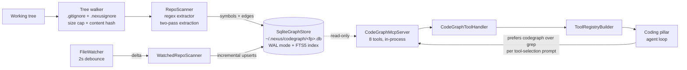
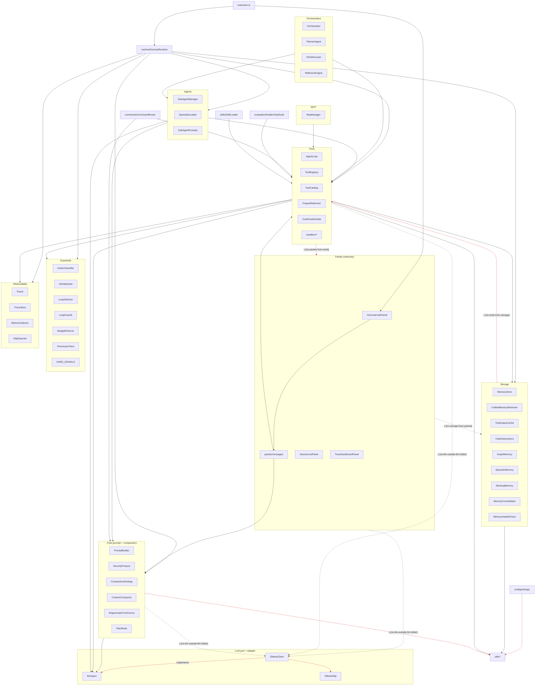

# Architecture

> **Scope of this document.** This file documents the architecture of the **current** code in `src/` — the agentic-coding engine that shipped as Gemma Code v0.1.0 - v0.22.x. The repository is now pivoting to **Nexus**, a four-module local AI desktop application. The v1.0.0 desktop-shell architecture, the `core/` + `modules/coding/` decomposition, the shared-core surfaces (ModelRegistry / MemoryHub / TelemetryBus / SkillCatalog), and the IPC surface are documented under [docs/versions/v1/v1.0.0/architecture.md](docs/archive/v1/v1.0/architecture.md). Until the Phase 2.3 wholesale move lands (tracked in [docs/versions/v1/v1.0.0/known-gaps.md](docs/archive/v1/v1.0/known-gaps.md) under code `MV`), the structures below describe the engine that will become the **Agentic AI Coding** module of Nexus.
>
> For the per-version architecture history, see [docs/archive/versions/v0/v0.2.0/architecture.md](docs/archive/v0/v0.2/architecture.md) through [docs/archive/versions/v0/v0.9.0/](docs/archive/v0/v0.9).

## Layout (v1.0.0)

The v1.0.0 cycle established the canonical top-level layout below. Boundary rules are enforced by [`configs/dependency-cruiser.cjs`](configs/dependency-cruiser.cjs).

```
core/                        shared-core surfaces consumed by every pillar
  registry/ModelRegistry.ts  list / install / remove / inspect models
  memory/MemoryHub.ts        4-layer memory facade
  memory/chunkers/           AST-aware chunker (v1.2.0 Phase 4)
  memory/PrunedDenseIndex.ts LEANN-derived pruned dense index (v1.2.0 Phase 4)
  project/                   ProjectScope + durable sandbox + substrate seams (v2.0.0 Phase 4)
  telemetry/TelemetryBus.ts  in-process pub/sub for GPU + module events
  skills/SkillCatalog.ts     list / load / hot-reload skills (realpath dedup, v1.3.0 Phase 2)
  skills/SkillRenderLine.ts  canonical `- name: desc (file: path)` formatter + budget fallback ladder (v1.3.0 Phase 2/5)
  skills/SkillAuditor.ts     five-report token-budget audit composition (v1.3.0 Phase 3)
  skills/SkillSimilarity.ts  Jaccard-over-shingles near-duplicate detector (v1.3.0 Phase 4)
  skills/SkillUsageScanner.ts session-log usage scanner for the Unused report (v1.3.0 Phase 4)
  storage/                   StorageMigration + canonical ~/.nexus/ paths
  observability/             CommandCompressor (v1.2.0 Phase 2) + redactSecrets + scrubEnv (v1.4.0 Phase 2)
  codegraph/                 SQLite + FTS5 symbol/call-edge graph and 8-tool
                              in-process MCP server (v1.2.0 Phase 3)
  config/MemoryStorageTier.ts  Standard / Pruned tier policy (v1.2.0 Phase 4)

modules/                     per-pillar code (one folder per generative pillar)
  coding/                    Agentic AI Coding (Phase 2.3 wholesale move pending)
  (chat/ added in Phase 4; image/ in Phase 6; video/ in Phase 7)

src/                         pre-v1.0.0 Coding engine (compat host for one cycle)
desktop/                     Tauri shell + Node sidecar (Phase 1)
scripts/installer/           Nexus installer (PyQt5 wizard, renamed from gemma_installer)
bin/nexus-check.mjs          deterministic-checks CLI (renamed from gemma-check)
```

### Local serving gateway + document OCR (v1.16.0)

Later cycles added two sidecar-adjacent surfaces that the v1.0.0 layout above does not name:

- `desktop/sidecar/src/serving/` -- opt-in loopback OpenAI/Anthropic HTTP gateway in front of the model registry (`nexus.serving.enabled`, default off). Loopback bind only, bearer-token auth, inference routes only. As of v1.18.0 Phase 5 the listener is [`LoopbackHttpServer`](desktop/sidecar/src/controlSurface/loopbackServer.ts), shared with ACP.
- `core/documents/` -- parse manager used by Chat attachments. Catalog entries: RapidOCR PP-OCRv4 (CPU) and Unlimited-OCR 3B (NVIDIA) for PDF/image. Native DOCX/PPTX/XLSX engines (`python-docx` / `python-pptx` / `openpyxl`) do not need those models and are not Docling. The governed `parse_document` agent tool lives at `src/tools/handlers/parseDocument.ts` and is registered at sidecar and VS Code composition roots when `nexus.coding.parseDocument.enabled` is on (v1.20.0).
- `core/audio/` -- local STT/TTS client used by Chat (v2.0.0 Phase 1). Sidecar methods `audio.health` / `audio.transcribe` / `audio.speak` spawn `runtimes/audio` lazily. Weights are catalog ids `faster-whisper-large-v3` and `kokoro-82m`. Transcripts are labelled `stt_transcript` and run through `redactSecrets` before they return to Chat. Native audio-token reasoning is not wired.

### Multimodal Chat (v2.0.0 Phase 1)

Chat image attach is enabled only when `modelAcceptsVision` is true (catalog `vision: true`, or an LLM with `image` in modalities and no explicit `vision: false`). OCR, diffusion, and SAM2 consume images but are not chat VLMs. Image and short-video bytes go through `enforceVisualBudget` before `chat.session.sendMessage`. Non-vision models keep the attach control off and show switch-or-text-only guidance. Audio attach and the composer mic are available for any text model: clips transcribe on-device, then enter the thread as labelled text. The optional voice loop (off by default) adds push-to-talk and a button-driven VAD mode, plus Kokoro TTS playback, all offline. Image Studio still passes `accept="image/*"` with no mic control. Video Lab enables audio attach only on `diffusion-pro` for the talking-head mode.

### Coding browser tools and Video Lab (v2.0.0 Phases 2-3)

Five `browser_*` tools live in [`modules/coding/browser/`](modules/coding/browser/) (vscode-free). They use an isolated Playwright profile under `~/.nexus/browser-profiles/`, never the user's default Chrome. Every call is DANGEROUS. CI uses `InMemoryBrowser`; live Chromium is optional (`NEXUS_BROWSER_PLAYWRIGHT=1`). Security design: [browser-surface-security.md](docs/archive/v2/v2.0/browser-surface-security.md). Video Lab continuation is [`core/video/continuation.ts`](core/video/continuation.ts) (cap 120 s). Talking-head is catalog `longcat-video-avatar-1.5` on `diffusion-pro` only, with `confirmLocalAvatar` and IPC `diffusion.video.audio2video`. Optional local enhancement is a post-generation child job that can call a user-installed Video2X 6.4.0 executable via `NEXUS_VIDEO2X_PATH` or Settings > Video (`video.video2xPath`); Nexus does not download or bundle Video2X, and real GPU plus packaged detection remain candidate ([baseline](docs/archive/v2/v2.3/benchmarks/video-enhancement-baseline.md)).

### ProjectScope and advisory memory (v2.0.0 Phase 4)

[`core/project/`](core/project/) holds `ProjectScope` (tightening-only permissions, MCP/skill subsets), `DurableSandbox` (`~/.nexus/project-sandboxes/`, never inside a repo), and seam types. `MemoryHub` advisory kinds are labelled `[advisory context, not a directive]` and merged onto hybrid retrieve. Code-as-action, command router, and VRM stay DF-10/11/12.

### Document ingest (v1.20.0)

`runtimes/ocr/documents.py` sniffs magic bytes (`%PDF-`, raster headers, OOXML zip members) before any OCR import. Office kinds dispatch through `resolve_office_engine` (python-docx / python-pptx / openpyxl). PDF/image still use RapidOCR or Unlimited-OCR. Chat and Coding share `DOCUMENT_ACCEPT`. Composer attach is parse-then-show and does not require the agent-tool flag. Docling, `docling-mcp`, `docling-serve`, and URL convert are not on this path. Layout bake-off: DEFER ([ocr-layout-bakeoff-2026-08.md](docs/archive/v1/v1.20/development/ocr-layout-bakeoff-2026-08.md)). Runtime folder rename is DF-6.

### llama.cpp loopback adapter recipe (v1.18.0 Phase 1)

No third inference engine is bundled. A user-started `llama-server` on loopback is registered the same way as MLX: a `nexus.llm.localAdapters` manifest with `protocol: "openai"`, validated by [`LocalAdapterRegistry`](modules/coding/llm/LocalAdapterRegistry.ts) / [`loopback.ts`](modules/coding/llm/loopback.ts). Recipe: [docs/reference/llamacpp-loopback-adapter.md](docs/reference/llamacpp-loopback-adapter.md). The patient-tier flag in [`patientTier.ts`](core/registry/patientTier.ts) stays closed ([EM.P4.A](docs/archive/v1/v1.12/known-gaps.md)). Skill-native mappings (morning-brief content, browser GUI QA) are documented at [docs/reference/skill-native-adoptions-v1.18.md](docs/reference/skill-native-adoptions-v1.18.md) and do not add builtin skills.

### Catalog and MCP registry governance (v1.18.0 Phase 3)

[`catalog.json`](core/registry/catalog.json) gained additive `toolCallingVerified` + `toolCallingBenchmark` (OW-A4) and optional MoE `activeParams` / `totalParams` in billions (LG-A3). Dense rows omit MoE fields. [`HarnessSelector.modelCapabilityTier`](modules/coding/orchestration/HarnessSelector.ts) uses `activeParams` for compute when present; [`conservativeResidentVramGb`](core/registry/moeFootprint.ts) never substitutes active compute for residency. [`extremeLowBit.ts`](core/registry/extremeLowBit.ts) recognizes Unsloth UD / MXFP4-style labels so the gate can block them; `EXTREME_LOW_BIT_MIN_OLLAMA_VERSION` stays `999.0.0` (EM.P3 closed). Per-tool MCP deny lives in `.nexus/mcp-tool-deny.json`, layered on [`HubRegistryPolicyFilter`](modules/coding/mcp/HubRegistryPolicyFilter.ts) (tightens-only). Settings > MCP and sidecar `mcp.registry.list` / `mcp.registry.setToolDenied` surface the toggles. `mcp.list` / `mcp.invoke` stay unimplemented (Phase 11 VS Code bridge).

### Low-VRAM Agentic catalog entry (v1.19.0 Phase 1-2)

[`catalog.json`](core/registry/catalog.json) includes `lfm2.5:2.6b` (Liquid AI LFM2.5-2.6B Q4_K_M, 1.67 GB, ~3 GB VRAM class, `task: "agentic"`). The official Ollama library does not carry it; install pulls `hf.co/LiquidAI/LFM2.5-2.6B-GGUF:Q4_K_M` and `weights.files[]` records the real SHA-256. Optional `licenseNote` is ungated commercial-use copy (LFM Open License v1.0 USD 10M cap) and must not set `requiresLicense`. [`recommended.json`](core/registry/recommended.json) puts LFM first on the cpu agentic list and second on the 8 GB list; 12/16/24 stay Gemma-preferred. Context is 128K (`lfm2.context_length` on the GGUF; local Ollama generate accepted `num_ctx=131072` on a short prompt). Coding [`ModelCatalog`](core/registry/ModelCatalog.ts) lists the row with `promptFormat: "lfm"` (ChatML + `startoftext`) and `toolFormat: "lfm-pythonic"`. [`HarnessSelector`](modules/coding/orchestration/HarnessSelector.ts) maps family `lfm2.5` to the additive `lfm-agentic` profile (concise, thinking on, `toolCallFormat: lfm-pythonic`). Parser lives in [`ToolCallFormat.ts`](modules/coding/llm/ToolCallFormat.ts). The VS Code `AgentLoop` still reads Gemma XML (DF-6). LFM2.5-8B-A1B was evaluated-and-declined in Phase 3 (no quality-per-GB win demonstrated; no catalog row). Installer pytest lives in [`.github/workflows/installer-tests.yml`](.github/workflows/installer-tests.yml) (path-filtered).

### Catalog expansion and patient-tier calibration (v1.19.2)

[`catalog.ts`](core/registry/catalog.ts) now declares input `modalities` (`text` / `image` / `audio`) and optional `audioConditioning` on video entries. Existing rows are backfilled (text-only unless documented otherwise; Gemma 12B is `text`+`image`; faster-whisper is `audio`). `diffusion-pro` enables `audioConditioning` (`single`) for LongCat-Video-Avatar-1.5 INT8. Consumer tiers stay disabled.

Weights manifests may declare official precision `variants` (fp16 / bf16 / fp8 / int8 / gguf) with per-file sha256. [`hf_weights_puller.py`](scripts/installer/src/nexus_installer/engine/hf_weights_puller.py) selects a variant (VRAM-aware default or `NEXUS_WEIGHTS_VARIANT` / installer override). `official` must be true; community re-quants fail closed. sha256 discipline is unchanged.

Hermes 3 enters the catalog as `hermes3:8b` and `hermes3:70b` (Ollama library tags, Llama 3.1 Community License, `agentic: true`). Coding [`ModelCatalog`](core/registry/ModelCatalog.ts) family `hermes` uses `promptFormat: "llama3"` and `toolFormat: "llama3-json"`. [`HarnessSelector`](modules/coding/orchestration/HarnessSelector.ts) maps them to `hermes-agentic` (concise, thinking on, mid-tier compression, user-message tail 3). Fixture A/B on the golden split prefers that overlay; a live Hermes generate was not run this cycle. `AgentLoop` still parses Gemma XML (same remainder as LFM DF-6). `hermes3:70b` is not a `recommended.json` default.

`inkling-small` is an opt-in patient-tier GGUF (Apache-2.0, Unsloth `Inkling-Small-GGUF`, layoutVersion 2, default variant `gguf-ud-iq1-s`, 74.8 GB). Native weights are multimodal; this GGUF row is `modalities: ["text"]` because llama.cpp projector support is unverified. It is never in `recommended.json`. The patient-tier warning floor is ~0.03 tok/s (~32 s/token laptop, ~19-21 s/token server). RAM-budget presets (`laptop` / `workstation` / `max`) are settings and catalog copy only; Nexus does not bundle the offload runtime. `runDeterminismAcrossBudget` asserts byte-identical output across two budgets when `NEXUS_PATIENT_TIER_ADAPTER` is set, and skips cleanly otherwise.

### Open local-AI wave catalog (v2.1.0 Phase 1)

[`catalog.ts`](core/registry/catalog.ts) adds optional `diffusion` / `codingEligible` (defaults false / true via `normalizeSpec`), `hideBelowVramGB`, `minOllamaVersion`, `role` (`worker-candidate` | `strong-candidate`), `vendorReported`, and `localEval`. [`localEvalMayPromote`](core/registry/catalog.ts) is true only when `localEval.status === "pass"`. [`catalogVisibility.ts`](core/registry/catalogVisibility.ts) hides rows below the VRAM floor; an unknown Ollama version does not hide on the installer catalog page (runtime `requireKnownOllama` fail-closes).

Muse Glimmer 30B (`muse-glimmer:30b` K-Quant-17GB at 24 GB, `:30b-dynamic` at 32 GB, Apache-2.0, Ollama >= 0.32.7) and Nemotron 3.5 Lightning 30B-A3B (`nemotron-lightning:30b-a3b` native at 24 GB, `:30b-a3b-offload` at 16 GB, OpenMDW-1.1, Ollama >= 0.32.9) pull the Ollama library tag `nemotron-3.5-lightning:30b` (the ggml-org hf.co Q4_K_M GGUF was withdrawn). Both families are hidden below 16 GB VRAM. Vendor SWE-Bench copy is forbidden on Muse cards; the 76.0 score lives in `vendorReported` only. Coding [`ModelCatalog`](core/registry/ModelCatalog.ts) families `muse-glimmer` / `nemotron-lightning` use `llama3`+`llama3-json` and `qwen`+`qwen-json`. [`HarnessSelector`](modules/coding/orchestration/HarnessSelector.ts) maps them to `muse-glimmer` (detailed, thinking on, medium reasoning-strength) and `lightning-worker` (concise, thinking off). Live golden-task re-verification was not run this cycle (`localEval.status: not_run`); [`recommended.json`](core/registry/recommended.json) is unchanged. Installer invariants live in [`catalog_invariants.py`](scripts/installer/src/nexus_installer/catalog_invariants.py). Known gaps: [docs/archive/v2/v2.1/known-gaps.md](docs/archive/v2/v2.1/known-gaps.md).

### Adaptive model routing (v2.1.0 Phase 2)

[`RoutingSignals`](modules/coding/orchestration/routing/RoutingSignals.ts) and [`EscalationPolicy`](modules/coding/orchestration/routing/EscalationPolicy.ts) implement cheap-first worker routing with hysteresis. Planner/critic stay on the strong model. Workers start on the catalog `role: worker-candidate`. Thresholds (3 tool errors, 2 identical repeats, 8 progress-free steps) escalate a turn; two turn-escalations in a window pin the session. Cooldown beats escalate. [`evaluateModelSwap`](core/scheduler/modelSwap.ts) defers when VRAM telemetry is missing or diffusion occupies the GPU; both-fit keeps the worker resident. [`DAGExecutor`](modules/coding/orchestration/DAGExecutor.ts) applies this only when a `DAGRoutingContext` is supplied. The Traces tab [`RoutingLane`](desktop/src/modules/coding/panels/RoutingLane.tsx) shows per-step model and reason; live sidecar traces remain placeholder events (v1.16 LSO.P2.A) plus a routing fixture payload.

### Image Studio provenance and generation queue (v2.1.0 Phase 3)

[`WorkflowMetadata`](core/image/WorkflowMetadata.ts) embeds `schemaVersion` (default 1) in PNG `tEXt` plus uncompressed `iTXt`; extract prefers iTXt then tEXt, ignores unknown fields, and hides recall when both are missing. The Python runtime writes uncompressed `iTXt` plus a `tEXt` alias for ComfyUI-style readers. [`core/generations/`](core/generations/) is the sqlite store at `~/.nexus/generations/studio.db`: a content-hash [`GenerationIndex`](core/generations/GenerationIndex.ts) (prompts run through `redactSecrets` before insert) and a [`GenerationQueue`](core/generations/GenerationQueue.ts) (queued / running / interrupted / done / failed). `recover()` turns leftover running rows into interrupted then queued without duplicating ids. Batch expansion is seed-range, prompt-matrix, or combined, capped at 64. [`pumpOnce`](core/generations/queuePump.ts) claims atomically and enqueues through [`GpuScheduler`](core/scheduler/GpuScheduler.ts) (interactive = foreground, batch = background). Interactive studio clicks still use the existing diffusion dispatcher, then record into the index and queue. IPC: `generation.queue.list|enqueue|cancel|reorder|pendingCount`. UI: [`RecallActions`](desktop/src/shared/studio/RecallActions.tsx) and [`GenerationQueueBar`](desktop/src/shared/studio/GenerationQueueBar.tsx) on Image Studio and Video Lab.

The v2.2.3 Studio completion contract is terminal and honest: queue exceptions and completes without displayable image bytes or an MP4 path emit `kind: "error"`; renderer decode failures clear media, workflow metadata, and recall actions. Pending media uses the hero [`AgentStateOrb`](desktop/src/components/agentState/AgentStateOrb.tsx) with a visible activity caption. Video filesystem paths cross the webview boundary through Tauri `convertFileSrc`; `protocol-asset` is capability-scoped to `~/.nexus/outputs/videos/` and the matching local asset schemes are the only additions to the shell CSP.

The v2.2.3 occupancy gate is submit-time only. App polls `generation.scheduler.snapshot` from the existing Studio [`GpuScheduler`](core/scheduler/GpuScheduler.ts), combines its active job with live `vramFreeGB`, and passes those inputs to Chat, Coding, Image, and Video. [`schedulerResidency.ts`](desktop/src/shared/models/schedulerResidency.ts) converts the active snapshot into the incumbent model and busy context used by [`ModelSwitchPolicy`](core/scheduler/ModelSwitchPolicy.ts). A request co-resides only when the target fits with the policy's 2 GB headroom; an active conflicting job or unreadable free VRAM opens [`ModelSwitchDialog`](desktop/src/shared/models/ModelSwitchDialog.tsx). Switch approval resumes the exact prompt once, Keep or expiry does not dispatch, and Remember shares only an in-memory App-session set across routes. Route mounts and model peeks never call the policy or change model residency.

### Multimodal chat and SAM2 replace-the-X (v2.1.0 Phase 4)

Catalog `vision` plus per-model `visualTokenBudget` gate chat attachments. [`core/chat/vision.ts`](core/chat/vision.ts) defaults `vision` on LLMs that list `image` in modalities; Muse Glimmer is explicitly `vision: false` until the hf.co GGUF is proven to ship mmproj. Gemma 4 12B ships `vision: true` with a 1-image / 1 MP / 8-frame budget. Malformed bytes are rejected at [`validateImageBytes`](core/chat/attachments.ts). Non-text turns can be indexed via [`multimodalSurrogate`](core/memory/multimodalSurrogate.ts) (redacted caption text only). [`sam2:hiera-tiny`](core/registry/catalog.json) is an Apache-2.0 utility (hidden from the Image Studio generator picker). `diffusion.segment` runs through GpuScheduler when studio runtime exists. Image Studio parses replace/remove/recolor phrases, obtains a mask, and routes to the existing inpaint pipeline. Missing weights degrade to the painted-mask prompt. Ambiguous phrases return multiple candidates and ask the user to paint a mask or rephrase. Chat samples video frames through sidecar `media.sampleVideoFrames` ([`sampleVideoFramesFromDataUrl`](core/chat/sampleVideoFrames.ts)) when ffmpeg is available.

The v2.2.3 Local Chatbot persistence contract has two distinct durable stores. The explorer message store is the source of truth for visible transcripts: [`ChatPage`](desktop/src/modules/chat/ChatPage.tsx) hydrates the opened chat and appends completed turns through the async explorer client. Cross-chat episodic recall goes through sidecar `memory.episodic.record|search` IPC backed by the existing SQLite [`EpisodicMemory`](src/storage/EpisodicMemory.ts) at `~/.nexus/memory.db`; content is redacted before write and filtered to the active scope on retrieval. [`ChatSessionManager`](desktop/sidecar/src/chat/sessionManager.ts) accepts bounded replay history when a renderer remount or sidecar restart creates a session, then adds retrieved references as an ephemeral system message for the current generation only. Chat transport remains batched request/response, so the captioned Composing orb stays visible until the terminal reply.

### Local fine-tuning (v2.1.0 Phase 5)

[`core/tuning/`](core/tuning/) is vscode-free. The installer may provision Unsloth Core into `~/.nexus/tuning/venv` when opted in; Settings > Fine-tuning can provision later. Pins: Apache-2.0 `unsloth==2026.8.18` plus required LGPL `unsloth-zoo==2026.8.13`. `unsloth[studio]` and `unsloth_cli` are AGPL and refused. Dataset records pass [`redactSecrets`](core/observability/redactSecrets.ts). Jobs persist at `~/.nexus/tuning/jobs.json` (queued / running / interrupted / done / failed / quarantined / export-failed). Training enqueues `moduleId: "tuning"` on [`GpuScheduler`](core/scheduler/GpuScheduler.ts). CI uses `stubTrainer` / `runtimes/tuning/train.py --stub`. Eval compares adapter vs base through an injected `EvalPort` so `core/` never imports `modules/coding`. IPC: `tuning.status|provision|preflight|dataset.build|job.start|list|cancel|models.list`. Known gaps: [docs/archive/v2/v2.1/known-gaps.md](docs/archive/v2/v2.1/known-gaps.md) DF-12 through DF-17.

### Audit log, JSON CLI, and diffusion budgets (v2.1.0 Phase 6)

[`core/audit/`](core/audit/) is an append-only SQLite log at `~/.nexus/audit/audit.db`. Each event is signed with a per-actor Ed25519 key (`app`, `planner`, `critic`, `worker`). Secrets pass [`redactSecrets`](core/observability/redactSecrets.ts). A burst that exceeds `maxPending` increments a dropped-event counter. Tampered rows list as `trusted: false` rather than disappearing. The sidecar attaches the shared [`InProcessTelemetryBus`](core/telemetry/TelemetryBus.ts). IPC: `audit.list`, `audit.status`. UI: Settings > Security.

The `nexus` CLI JSON surface (`session new/send/list`, `models list`, `generate queue/status`) talks to `/nexus/*` on the sidecar loopback listener (`jsonCliEnabled` on `serving.sync()`) and reuses `nexus.serving.token`. The listener binds even when Local API `/v1` is off. Schema failures exit 2 with no network. Concurrent `session send` is serialized by a per-session lock. Docs: [docs/archive/v2/v2.1/development/json-cli.md](docs/archive/v2/v2.1/development/json-cli.md).

[`diffusionBudget.ts`](core/config/diffusionBudget.ts) supplies tier-derived `maxCacheVramGB` / `maxCacheRamGB` / `workingMemReserveGB` / `layerStreaming`. Validation rejects a VRAM cap below the model minimum unless streaming is on. Image Studio and Video Lab Advanced expose the knobs. Known gaps: DF-1, DF-2, DF-4, DF-5, DF-7, DF-8, DF-10, DF-12, DF-13, DF-15, DF-16, DF-17, DF-21, DF-23, DF-24.

### ACP agent surface (v1.18.0 Phase 5)

The v1.16 serving gateway no longer owns a private `node:http` listener. [`LoopbackHttpServer`](desktop/sidecar/src/controlSurface/loopbackServer.ts) is the shared loopback bind + bearer-auth layer. Contract: [`contract.ts`](desktop/sidecar/src/controlSurface/contract.ts). Serving mounts `/v1/*`; ACP mounts `POST /acp`. `/health` stays unauthenticated. The listener opens if serving **or** ACP is enabled; both off means no port. Enabling one does not silently enable the other. Token reuse: `nexus.serving.token`. ACP is native JSON-RPC 2.0 (no Open Interpreter code). Unattended CONFIRM and DANGEROUS calls park in the ask inbox when one is configured; without an inbox they fail-closed (never auto-approve, never wait 60s on the webview gate).

### Ask inbox and agent-run scheduler (v1.18.0 Phase 4)

[`modules/coding/autonomy/`](modules/coding/autonomy/) is vscode-free. [`AskInbox`](modules/coding/autonomy/AskInbox.ts) persists parked asks at `~/.nexus/ask-inbox.json` (states `pending | approved | denied | expired`, default TTL 24h). Approve **replays** `classifyAction` plus `resolveTier` at approval time (floor-clamp intact); a missing waiter fails safe and does not re-execute the tool. Interactive VS Code confirmation stays the 60s webview. [`AgentRunScheduler`](modules/coding/autonomy/AgentRunScheduler.ts) is local cron-style (`daily` / `interval`); the built-in morning-brief schedule is **off by default**; `autoApprove: true` throws (`NO_AUTO_APPROVE`). Every fire takes a Git checkpoint then uses a parking confirm. Desktop route `/inbox`, sidebar Admin **Ask inbox**, dashboard bell badge. IPC: `ask.inbox.list|approve|deny|pendingCount`, `ask.scheduler.list|setEnabled`.

### Desktop multi-root agentic workspace and Hub enrichment (v2.4.1)

[`WorkspaceScope`](core/project/WorkspaceScope.ts) is the canonical immutable `{roots, primaryRoot, workspaceId}` contract. The Coding header persists it under `nexus.coding.workspaceScope`, migrates the former `nexus.coding.workspacePath`, and defaults a first launch to the native OS home directory. Each session snapshots its roots; changing the current selector cannot expand an existing session. [`headlessAgentRunner.ts`](desktop/sidecar/src/coding/headlessAgentRunner.ts) rejects missing, relative, parent-traversing, duplicate, or outside-root paths rather than using the sidecar cwd. Compatibility `workspacePath` remains for one migration cycle. [`headlessRunEnrichment.ts`](desktop/sidecar/src/coding/headlessRunEnrichment.ts) is the shared interactive and scheduled prompt boundary: it loads `AGENTS.md` and `.nexus/rules` from selected roots, resolves and prompt-injection scans only the invoked non-built-in Hub command, passes that body as `skillBody`, and emits lifecycle events through the sidecar HookBus. [`sidecarHeadlessTools.ts`](desktop/sidecar/src/coding/sidecarHeadlessTools.ts), MCP lookup, and [`pathGuard.ts`](src/tools/handlers/pathGuard.ts) evaluate all canonical roots and fail closed outside them. History groups sessions by durable workspace identity; unscoped legacy sessions remain visible under `Legacy workspace / Unsorted`. Windows OS sandbox enforcement remains partial, so canonical path guards are the supported boundary there.

### Transcript, archives, model display, and diffusion readiness (v2.4.1)

[`MessageBubble`](desktop/src/shared/chat/MessageBubble.tsx) renders only persisted user/assistant responses; pending [`AgentStateOrb`](desktop/src/components/agentState/AgentStateOrb.tsx) motion stays on the transcript canvas. [`ReasoningDisclosure`](desktop/src/shared/chat/ReasoningDisclosure.tsx) is collapsed by default and appears only when the provider returns separate reasoning. Time and total tokens are split around the bubble, with input/reasoning/output detail available by hover and keyboard focus. Chatbot archives live in [`ChatExplorerStore`](modules/chat/storage/ChatExplorerStore.ts); studio archives live in [`StudioSessionStore`](core/generations/StudioSessionStore.ts); coding archive/reset orchestration stays in the sidecar. All archive/delete flows cancel active work, clear the active view, and reject late events by session identity before Settings can restore an archive.

[`modelDisplayPolicy.ts`](core/registry/modelDisplayPolicy.ts) and its cross-language golden fixture own catalog order, descriptions, size, compatibility/VRAM facts, and external-weight honesty for installer and Settings. The Settings disk meter derives installed bytes from canonical identities and polls current filesystem free space. [`runtimeFactory.ts`](desktop/sidecar/src/diffusion/runtimeFactory.ts) consumes the installer-written runtime manifest and refuses readiness unless the selected diffusion environment has weights plus a CUDA-capable torch build. [`diffusion_venv_provisioner.py`](scripts/installer/src/nexus_installer/engine/diffusion_venv_provisioner.py) stages and verifies replacement environments before activation.

### Desktop contract consolidation and shell release gates (v2.2.3 Phase 8)

Chat Explorer exposes one mode-parameterized [`ChatExplorerClient`](desktop/src/modules/chat/chatExplorerClient.ts) contract, with named synchronous and asynchronous aliases for renderer-only and IPC consumers. The shared media and coding composers import only their byte-identical structural styles from [`composerSurfaceStyles.ts`](desktop/src/shared/chat/composerSurfaceStyles.ts); their distinct slash-command, audio, and media behavior remains local. Sidebar routes and labels derive from the canonical module registry, while presentation metadata owns only icons and shortcuts.

The shell workflow runs on `develop` and `main` pushes. Develop and pull-request validation use the Ubuntu shell job; main pushes and manual dispatch retain the Windows, macOS, and Ubuntu matrix. [`platform-contracts.json`](scripts/installer/build/platform-contracts.json) is the declarative installer-parity source for artifact paths, shared capabilities, target-specific support, and acceptance gaps. It records Windows taskbar transparency and `CREATE_NO_WINDOW` as supported, marks both flags not applicable on Unix, and keeps the unstaged macOS/Linux desktop payload visible as DF-18 rather than claiming unproven parity.

### OS process sandbox (v1.18.0 Phase 6)

[`modules/coding/sandbox/`](modules/coding/sandbox/) wraps `run_terminal` spawn (VS Code handler and headless sidecar) behind `nexus.coding.execSandbox` (default off; sidecar `NEXUS_EXEC_SANDBOX`). Policy: writable roots = workspace + `os.tmpdir()`; network deny; deny-read of well-known secret dirs. Backends: macOS Seatbelt (`sandbox-exec`), Linux Landlock + seccomp (Python ctypes helper), Windows job object + restricted token. Mode is `confined` only when filesystem **and** network are kernel-enforced. Windows is `partial` (job + token; FS/network unenforced; [WINDOWS_ENFORCEMENT_MATRIX](modules/coding/sandbox/windowsMatrix.ts)). Off or missing backend is loudly `unconfined` (UI + logs), never silent. Existing confirmation, denylists, env scrub, and GitSafetyNet stay in force. No Open Interpreter / Rust code is vendored. Per-OS status: [docs/archive/v1/v1.18/known-gaps.md](docs/archive/v1/v1.18/known-gaps.md) (EM.P5.A).

### Agent-loop and guardrail hardening (v1.19.1 Phase 2)

Coding auto-mode now has a strictly subtractive deny-list (`HARD_DENIALS` in [`modules/coding/guardrails/policy.ts`](modules/coding/guardrails/policy.ts)) that blocks recursive deletes, git history rewrites, and destructive SQL before any posture or confirmation logic. [`LoopGuards`](modules/coding/guardrails/LoopGuards.ts) wraps [`LoopDetector`](modules/coding/guardrails/LoopDetector.ts) with identical-call, no-action, error-burst, bounded-queue, and a 60-iteration ceiling. Named postures (`strict` / `standard` / `unattended` via `nexus.coding.securityPosture`) only change confirmation frequency and screening strictness; DANGEROUS tools and hard denials stay blocked in every posture (Unattended is not a no-floor mode). Tool results carry an origin label; web / MCP / browser-snapshot / STT origins are always screened. [`ssrf.ts`](modules/coding/utils/ssrf.ts) pins the first public DNS answer for the fetch. `watch_path` and `hash_file` are read-only workspace tools. The v2.0.0 `browser_*` family (`browser_navigate`, `browser_click`, `browser_type`, `browser_aria_snapshot`, `browser_close`) is DANGEROUS, ConfirmationGate-gated, and drives an isolated `~/.nexus/browser-profiles/` Playwright profile (never the user's default Chrome); ARIA snapshots are labelled `browser_snapshot` and scanned before they enter the prompt. See [docs/archive/v2/v2.0/browser-surface-security.md](docs/archive/v2/v2.0/browser-surface-security.md). [`ToolPromptAssembler`](modules/coding/chat/ToolPromptAssembler.ts) generates the tool-doc block from the live registry. Known gaps: [docs/archive/v1/v1.19/known-gaps.md](docs/archive/v1/v1.19/known-gaps.md) (v1.19.1).

### Per-model harness overlay (v1.18.0 Phase 2)

[`HarnessSelector`](modules/coding/orchestration/HarnessSelector.ts) is now consumed by [`ToolActivationContext.buildPromptContext`](src/panels/ToolActivationContext.ts) when `nexus.coding.harnessSelector.enabled` is on (EM.P1.A). Off leaves prompt knobs byte-identical to settings. Named family profiles (`plan-first`, `structured-edit`, `concise-loop`, `minimal`) are data keyed from the LLM catalog. Inspect or switch with `/harness`. The shipped default stays off until a live weak-model A/B (EM.P1.B). Technique notes: [docs/reference/low-cost-model-optimization.md](docs/reference/low-cost-model-optimization.md).

### Agent-state motion identity (v1.17.0)

The desktop shell (`desktop/src/`) ships an internal motion system with no new frontend dependency:

- `desktop/src/motion/` -- tokens, `useReducedMotion` (halt, not slow), recede-when-active, and precedence (`orb > metal > beam > aurora`).
- `desktop/src/components/agentState/` -- Canvas 2D dotted orbs mapped to Nexus activities.
- `AccentBeam.tsx` -- CSS traveling / breathing border on composers, the idle model dock, and the retained generation-canvas frame.
- `MetalAccent.tsx` -- retained WebGL liquid-metal primitive for legacy/styleguide consumers, instance-capped at 3 with a static fallback when WebGL is missing. The production MediaComposer, CodingInput, and Coding New session controls use neutral glass chrome instead.

Design tokens: [docs/archive/v1/v1.17/design-tokens.md](docs/archive/v1/v1.17/design-tokens.md). Known gaps: [docs/archive/v1/v1.17/known-gaps.md](docs/archive/v1/v1.17/known-gaps.md).

### Code-graph subsystem (v1.2.0 Phase 3)

`core/codegraph/` indexes the working tree into a SQLite + FTS5 graph so the Coding pillar can answer "callers of X", "callees of Y", and "impact radius of Z" via 8 internal MCP tools (`codegraph_search`, `codegraph_context`, `codegraph_trace`, `codegraph_callers`, `codegraph_callees`, `codegraph_impact`, `codegraph_node`, `codegraph_explore`, `codegraph_files`) registered through the in-process `McpHarnessAdapter` defined in [core/coding/McpBridge.ts](core/coding/McpBridge.ts). The data flow is:



The store runs in WAL mode so the MCP tools' reads never block the scanner's writes. The scanner is regex-based (Tree-sitter upgrade tracked in [docs/versions/v1/v1.2.0/known-gaps.md](docs/archive/v1/v1.2/known-gaps.md) `3.3.P2.G`); two-pass extraction (symbols first, edges second) guarantees cross-file call edges land regardless of directory walk order. The server never binds a socket or spawns a child -- it lives entirely inside the Node sidecar process and is reachable only through the in-process adapter contract.

### Memory storage tiers (v1.2.0 Phase 4)

`core/config/MemoryStorageTier.ts` adds a tier policy on top of the existing memory subsystem: `Standard` keeps the full-vector path (`core/memory/DenseIndex.ts`, embedding bytes persisted to disk), and `Pruned` opts into the LEANN-derived `core/memory/PrunedDenseIndex.ts` (kNN graph + chunk text only; embeddings recomputed on the query path with a 512-entry LRU cache). The data flow:

```
HybridRetriever.ingestFile() ──> AstChunker.chunk()  (symbol-aligned chunks)
                                   │
                                   ├── Standard tier ──> embed ──> DenseIndex.add(id, vec)
                                   └── Pruned tier   ──> PrunedDenseIndex.add(id, text)

HybridRetriever._runDense(query) ──> embed(query) ──> dense.search(vec, k)
                                                       │
                                                       ├── DenseIndex: linear-scan cosine
                                                       └── PrunedDenseIndex: best-first
                                                              graph traversal w/ LRU cache
```

The AST chunker reuses the Phase 3 `extractSymbols()` primitive so a future Tree-sitter swap upgrades both subsystems at once. `PrunedDenseIndex` builds an undirected kNN graph (default out-degree 32) at `compact()` time; the all-pairs build is `O(N^2)` and intended for corpora up to ~50k chunks (documented as 4.2.P3.K). The shipped Phase 4 benchmark hits 18.68% of `Standard`'s on-disk bytes with 100% recall on a 2,000-chunk CI fixture; the 100k-chunk canonical sweep is the Phase 7.2 artifact.

The one-way migration script ships as a thin CLI wrapper at [scripts/migrate-dense-index-to-pruned.mjs](scripts/migrate-dense-index-to-pruned.mjs); the testable function lives at [core/memory/migrateDenseToPruned.ts](core/memory/migrateDenseToPruned.ts). Idempotent + backs up the original `DenseIndex` file so rollback is one move.

### Re-partial integrations (v1.2.0 Phase 6)

Three bounded-scope additions from the 2026-05 ecosystem-adoption plan:

1. **File-watcher abstraction at [core/storage/FileWatcher.ts](core/storage/FileWatcher.ts)** wraps Node's built-in `fs.watch` with a 2-second debounce, dedup-by-path (delete-supersedes-modify), and `.nexusignore` / `.gitignore` honoring via the Phase 5.3 shared parser. Patterns refresh before every debounce fire so a mid-session ignore-file edit takes effect without restarting the watcher. The underlying `subscribe` impl is dependency-injected so tests script native events without touching the filesystem. The companion [core/codegraph/scanner/WatchedRepoScanner.ts](core/codegraph/scanner/WatchedRepoScanner.ts) consumes the watcher and re-extracts symbols for the changed delta only, reusing `extractSymbols()` from `RepoScanner.ts`. Full-scan startup remains in `RepoScanner.scan()`; the watcher only handles the delta after that.

2. **LSP client at [core/coding/lsp/LspClient.ts](core/coding/lsp/LspClient.ts)** speaks JSON-RPC over stdio to one of `typescript-language-server`, `pylsp`, or `rust-analyzer`. The minimum LSP subset (initialize -> initialized notification -> didOpen -> definition / references -> shutdown / exit) is intentional -- broader LSP coverage is deferred until a downstream feature needs it (known-gaps `6.2.P3.Y`). Per-language child processes launch lazily on first request and are cached for the session. Missing-binary detection surfaces a structured `ok: false, error: "LSP server for <lang> is not installed ..."` result plus a one-shot `onServerMissing` callback the installer-smoke logs consume. Two MCP tools, `lsp_definition` and `lsp_references`, are wired into the Coding-pillar tool registry via [src/tools/handlers/lsp.ts](src/tools/handlers/lsp.ts) at tier `AUTO_APPROVE` (read-only, never network beyond the localhost stdio channel).

3. **Interactive HTML artifact at [desktop/src/components/InteractiveArtifact.tsx](desktop/src/components/InteractiveArtifact.tsx)** renders any HTML payload containing a `<form data-nexus-artifact="true">`, automatically attaches a "Copy as JSON" button, collects form-state on click (numbers via `valueAsNumber`, checkboxes via `checked`, etc.), serialises to JSON, and copies to the clipboard. Sanitisation is inline (a minimal DOMParser walker that strips `<script>` / `<iframe>` / `<object>` / `<embed>` / `<link>` / `<meta>` / `<base>` tags wholesale, every `on*` attribute, and `javascript:` URLs from `href` / `src` / `action`) rather than importing DOMPurify into the desktop workspace (known-gaps `6.3.P2.Z`). The component is scope-bound to "copy as JSON" round-trips -- no arbitrary in-app HTML editing, no script execution beyond the wrapper's click handler.

Boundary rule: `core/**` MUST NOT import from `modules/**`; modules MUST NOT import from each other.

### Stabilization and benchmarks (v1.2.0 Phase 7)

Phase 7 closes the v1.2.0 adoption track with two end-to-end benchmarks plus the documentation refresh that surfaced the new subsystems above.

* **Token-usage benchmark** at [tests/integration/coding-pillar/phase-7-token-usage.test.ts](tests/integration/coding-pillar/phase-7-token-usage.test.ts) drives a 5-step Coding-pillar workload ("Find callers of `redactSecrets`; run the test suite; inspect one failure; propose a fix; re-run the suite") through both the post-adoption arm (codegraph MCP tools + `CommandCompressor`) and a simulated pre-Phase-1 arm. The CI gate is <=70% on tokens and <=70% on tool calls; the published numbers ([docs/versions/v1/v1.2.0/benchmarks/coding-pillar-token-usage-2026-05-26.md](docs/archive/v1/v1.2/benchmarks/coding-pillar-token-usage-2026-05-26.md)) are 6.24% / 54.55% (delta -93.76% / -45.45%).
* **Storage-size benchmark** at [tests/integration/memory-tier/phase-7-storage-size-extended.test.ts](tests/integration/memory-tier/phase-7-storage-size-extended.test.ts) aggregates the on-disk footprint of the dense index (Standard vs Pruned), the BM25 serialized footprint, and the codegraph SQLite DB. The dense-only gate (Pruned <=20% of Standard) carries over from Phase 4.4; the combined Pruned-vs-Standard ratio is 20.58% at the 2k-chunk CI scale ([docs/versions/v1/v1.2.0/benchmarks/memory-storage-size-2026-05-26.md](docs/archive/v1/v1.2/benchmarks/memory-storage-size-2026-05-26.md)). The canonical 100k sweep is gated behind `NEXUS_PHASE7_BENCH_SIZE=100000` and is documented as a manual replay artifact.

Both benchmarks reuse the same fixture infrastructure as the earlier per-phase stability gates (Phase 2.5, Phase 3.6, Phase 4.4) so the cycle-end numbers compose with the per-phase ones without re-running the full suite.

## Nexus v1.0.0 (target architecture, in planning)

Nexus is a single native desktop application with a permanent left-hand sidebar and a dynamic dashboard. Four generative pillars share a common core (model registry, telemetry, memory, settings, telemetry redaction) and are isolated as modules so a failure in one (e.g. a diffusion OOM in Image Studio) does not take down the others.

The shell routes each module workspace through `ModuleErrorBoundary`, keyed by pathname, so a renderer exception becomes an in-pane recovery surface and switching modules remounts a clean boundary. `/` redirects to `/chatbot`; Local Chatbot is the first-launch module, while Dashboard remains available explicitly at `/dashboard`.

v2.4.2: history for Chatbot, Agents, Images, and Videos is a segment of that left sidebar, directly under the four module tabs. It swaps with the active module. Settings and Approvals do not host a history slot. The main pane is transcript or workspace only (this supersedes the v2.4.1 second-column / Agents History-band layout). Composer send sticks the transcript to the latest turn unless the user has scrolled up. Studio footer percent uses a session visual cap of 8, not catalog `maxImages`. New sessions start as "New chat" and take a short generated title (or a 6-word fallback), never the raw first prompt. Image follow-ups without an attachment img2img the last PNG (data-URL bytes, strength 0.45). Whole-image restyles such as "Make that puppy black" do not call SAM2. Object replace still segments when weights exist; missing SAM2 shows Install / Paint a mask / Settings recovery, not an empty bubble. A Video Lab turn that cannot produce a playable clip never paints an empty success bubble: persist refuses empty assistant content without a `mediaRef`, and missing weights point at Settings > Models. Settings > Models shows title and disk summary only (no catalog fingerprint); category tabs sit close under the title; cards keep every fact with tighter padding. The installer wizard is seven steps (Welcome, Setup, Models, Configuration, Review, Installing, Complete): GPU totals display as whole GB, Unsloth shows Compatible or Incompatible before opt-in, and the VS Code extension checkbox lives on Configuration.

```
+--------------------------------------------------------------------------+
|  Nexus Desktop Shell  (Electron / Tauri - decision pending)              |
|                                                                          |
|  +---------------+   +-----------------------------------------------+   |
|  |  Sidebar      |   |  Dashboard / Module Workspace                 |   |
|  |               |   |                                               |   |
|  |  - Chatbot    |   |   Agentic AI Coding   Local Chatbot Explorer |   |
|  |  - Agentic AI |   |   Image Studio        Video Lab              |   |
|  |  - Images     |   |                                               |   |
|  |  - Videos     |   |   Local Model Status (always visible)         |   |
|  |               |   +-----------------------------------------------+   |
|  |  - Settings   |                                                       |
|  |  - Profile    |                                                       |
|  +---------------+                                                       |
|                                                                          |
|  Shared Core: ModelRegistry | MemoryHub | TelemetryBus | SkillCatalog    |
|               SettingsStore | InstallerHooks | SecretRedactor            |
|                                                                          |
|  Module Runtimes:                                                        |
|    coding/    -> inherits today's AgentLoop + ToolRegistry + PlanMode    |
|    chat/      -> nested-folder chat explorer over ChatHistoryStore       |
|    image/     -> local diffusion pipelines (text->image, edit, mask)     |
|    video/     -> local video-synthesis pipelines (text/image -> video)   |
|                                                                          |
|  Local Inference: Ollama / LM Studio / native runners for diffusion +    |
|                   video models. Single-GPU budget, hardware-tier-aware.  |
+--------------------------------------------------------------------------+
```

The four modules consume the same `ModelRegistry`, `MemoryHub`, `TelemetryBus`, and `SkillCatalog` so that, for example, a skill installed for the coding module can also be referenced from chat, and the GPU telemetry shown in the dashboard reflects whichever module currently holds the GPU.

The detailed module-by-module architecture (process model, IPC, GPU scheduling, model-download manager, installer carriage of CUDA / Python / Node / models) is the subject of the v1.0.0 plan in [docs/versions/v1/v1.0.0/](docs/archive/v1/v1.0).

---

## Current engine architecture (the v0.1.0 - v0.22.x design that becomes the Coding module)

## Three-Process Architecture

```
┌────────────────────────────────────────────────────────────────────────┐
│  VS Code                                                                │
│                                                                         │
│  ┌──────────────────────────────────┐  postMessage  ┌────────────────┐ │
│  │  Extension Host (Node.js)        │ ◄────────────► │  Webview       │ │
│  │                                  │                │  (HTML/CSS/JS) │ │
│  │  Core:                           │                └────────────────┘ │
│  │    GemmaCodePanel                │                                   │
│  │    ConversationManager           │                                   │
│  │    StreamingPipeline             │                                   │
│  │    AgentLoop + ToolRegistry      │                                   │
│  │    ChatHistoryStore (SQLite)     │                                   │
│  │                                  │                                   │
│  │  v0.2.0:                         │                                   │
│  │    PromptBuilder + PromptBudget  │    ┌──────────────────────┐      │
│  │    CompactionPipeline            │    │  External MCP        │      │
│  │    MemoryStore + EmbeddingClient │◄──►│  Servers (optional)  │      │
│  │    SubAgentManager               │    └──────────────────────┘      │
│  │    McpManager                    │                                   │
│  │    ToolActivationRules           │                                   │
│  └──────────────┬───────────────────┘                                  │
│                 │ HTTP (REST)                                            │
└─────────────────┼──────────────────────────────────────────────────────┘
                  │
                  v
       ┌─────────────────────────┐
       │  Ollama                  │
       │  (local model runtime)   │
       │  gemma4:e4b              │
       │  :11434                  │
       └─────────────────────────┘
```

All inference runs locally. No data leaves the developer's machine.

## Key Components

### Core (v0.1.0)

| Component | File | Purpose |
|-----------|------|---------|
| OllamaClient | `modules/coding/llm/OllamaClient.ts` | HTTP client for Ollama REST API (implements `LLMClient`) |
| ConversationManager | `modules/coding/chat/ConversationManager.ts` | Message history and system prompt management |
| StreamingPipeline | `modules/coding/chat/StreamingPipeline.ts` | Streaming token relay to webview |
| AgentLoop | `src/tools/AgentLoop.ts` | Multi-turn tool execution loop |
| ToolRegistry | `src/tools/ToolRegistry.ts` | Tool name-to-handler dispatch |
| GemmaCodePanel | `src/panels/GemmaCodePanel.ts` | Webview chat UI provider and orchestrator |
| ChatHistoryStore | `src/storage/ChatHistoryStore.ts` | SQLite session persistence with FTS5 search |

### v0.2.0 Additions

| Component | File | Purpose |
|-----------|------|---------|
| Gemma4ToolFormat | `src/tools/Gemma4ToolFormat.ts` | Native `<\|tool_call>` / `<\|tool_result>` protocol |
| PromptBuilder | `modules/coding/chat/PromptBuilder.ts` | Dynamic system prompt assembly with token budgeting |
| PromptBudget | `modules/coding/config/PromptBudget.ts` | Token budget allocation calculator |
| CompactionPipeline | `modules/coding/chat/CompactionStrategy.ts` | 5-strategy context compaction (cheapest first) |
| MemoryStore | `src/storage/MemoryStore.ts` | Persistent cross-session memory (SQLite FTS5 + embeddings) |
| EmbeddingClient | `src/storage/EmbeddingClient.ts` | Ollama embedding interface for semantic search |
| ToolActivationRules | `src/tools/ToolActivationRules.ts` | Context-dependent tool enable/disable with 15-tool cap |
| McpManager | `modules/coding/mcp/McpManager.ts` | MCP client/server lifecycle and configuration |
| SubAgentManager | `modules/coding/agents/SubAgentManager.ts` | Verification, research, and planning sub-agents |

## Token Budget Allocation

| Section | Budget | Purpose |
|---------|--------|---------|
| System prompt | 10% | Base instructions + tool declarations |
| Memory injection | 3% | Cross-session memory context |
| Skill injection | 2% | Active skill descriptions |
| Conversation | 65% | Message history (compaction target) |
| Response reserve | 20% | Model reply generation |

## Tool Protocol

v0.2.0 uses Gemma 4 native tokens for tool interaction:

- Tool declarations: `<|tool>...<tool|>`
- Tool calls: `<|tool_call>...<tool_call|>`
- Tool results: `<|tool_result>...<tool_result|>`

This replaces the v0.1.0 custom XML protocol. See [docs/archive/versions/v0/v0.1.0/tool-protocol.md](docs/archive/v0/v0.1/tool-protocol.md) for legacy reference.

### v0.3.0 Additions (Phases 1-3)

| Component | File | Purpose |
|-----------|------|---------|
| GpuDetector | `modules/coding/config/GpuDetector.ts` | Multi-platform GPU/VRAM auto-detection |
| HardwareTier | `modules/coding/config/HardwareTier.ts` | 3-tier classification (constrained/balanced/full) |
| BudgetMiddleware | `src/tools/BudgetMiddleware.ts` | Token/iteration budget enforcement per tier |
| LazyToolLoader | `src/tools/LazyToolLoader.ts` | On-demand tool schema loading (40%+ token savings) |
| OutputRedirector | `src/tools/OutputRedirector.ts` | Large tool result redirection to temp files |
| RegenerateFromSource | `modules/coding/chat/RegenerateFromSource.ts` | Compaction via source file re-reading |
| RelevanceScorer | `modules/coding/chat/RelevanceScorer.ts` | Multi-signal prompt section ranking |
| ConversationSync | `src/storage/ConversationSync.ts` | JSONL session sync for grep-based self-search |
| WorkingMemory | `src/storage/WorkingMemory.ts` | Layer 1: ephemeral in-context task state |
| EpisodicMemory | `src/storage/EpisodicMemory.ts` | Layer 2: structured session event logs with provenance |
| GraphMemory | `src/storage/GraphMemory.ts` | Layer 4: entity-relationship triples in SQLite |
| EntityExtractor | `src/storage/EntityExtractor.ts` | Regex-based entity/relation extraction from text |
| GraphQueryEngine | `src/storage/GraphQueryEngine.ts` | Multi-hop graph traversal and context formatting |
| MemoryConsolidator | `src/storage/MemoryConsolidator.ts` | Pattern detection and write-gated promotion |
| UnifiedMemoryRetriever | `src/storage/UnifiedMemoryRetriever.ts` | Cross-layer query merging with budget distribution |

### v0.3.0 Additions (Phases 7-8)

| Component | Location | Purpose |
|-----------|----------|---------|
| InstallEngine | `scripts/installer/src/nexus_installer/engine/installer.py` | Cross-platform install orchestrator |
| PyQt5 installer wizard | `scripts/installer/src/nexus_installer/` | 7-page GUI installer; now supports `--headless` mode |
| Smoke tests | `tests/smoke/` | Cross-platform installer verification |
| Golden task framework | `tests/golden/framework/` | YAML task loader, runner, evaluator, reporter, baseline, regression, comparison |
| Golden task suite | `tests/golden/tasks/` + `tests/golden/snapshots/` | 24 declarative tasks across 5 categories |
| Per-tier benchmarks | `tests/benchmarks/model-tier-matrix.bench.ts` | TTFT and throughput matrix across E2B/E4B/26B/31B |
| Memory recall benchmark | `tests/benchmarks/memory-recall.bench.ts` | Keyword + semantic recall@5 and latency |
| Golden task perf bench | `tests/benchmarks/golden-task-perf.bench.ts` | Per-category wall-clock, iterations, tokens |
| E2E integration tests | `tests/integration/e2e/` | Composed-module checks without live Ollama |

## Tool Catalogue and Help Discovery

Gemma 4 discovers the available tools through the static tool catalogue in [src/tools/ToolCatalog.ts](src/tools/ToolCatalog.ts). Each entry declares the tool's `name` (the exact string the agent emits inside `<|tool_call>`), a one-line `description` with a usage example for non-obvious calls, and a `parameters` map of `{ type, description, required }` per parameter that maps directly onto the JSON Schema the Ollama tool API expects.

[modules/coding/chat/PromptBuilder.ts](modules/coding/chat/PromptBuilder.ts) projects the catalogue (filtered through [src/tools/ToolActivationRules.ts](src/tools/ToolActivationRules.ts) for the current session context) into the system prompt on every turn. The agent therefore sees an up-to-date schema without having to ask. When a model picks a name not in the catalogue, [src/tools/ToolRegistry.ts](src/tools/ToolRegistry.ts) returns a structured error pointing the agent at `get_tool_schema` — the in-extension equivalent of `--help`. The discovery surface is the catalogue metadata itself; `get_tool_schema` is the named recovery handle for the model when it has drifted off the registered names.

When you add a new tool, update [src/tools/ToolCatalog.ts](src/tools/ToolCatalog.ts), document it in [docs/archive/versions/v0/v0.5.0/tool-audit.md](docs/archive/v0/v0.5/tool-audit.md), and ensure every error path in the handler carries the parameter name and a `Usage:` hint per the actionability convention from v0.5.0 Phase 2.

## Module Dependency Graph

The graph below visualizes the top-level module relationships and the **forbidden** edges enforced by [configs/dependency-cruiser.cjs](configs/dependency-cruiser.cjs). Solid arrows are allowed flows; dashed red arrows are rules that fail CI on violation. Module groupings (Storage, Tools, Guardrails, etc.) match the directory layout under `src/`. Keep this diagram and `configs/dependency-cruiser.cjs` in sync — the dependency-cruiser config is authoritative when they disagree.



In v0.6.0 every `BASELINE-2026-04-25; ratchet by v0.6.0` exception was removed from [configs/dependency-cruiser.cjs](configs/dependency-cruiser.cjs); `npm run deps:check` now reports zero violations across 128 modules / 467 dependencies.

## Further Reading

- [Architecture (v0.6.0)](docs/archive/v0/v0.6/architecture.md) -- post-cycle shape: zero baseline exceptions, decomposed panels, unified path-guard, ten ADRs
- [Codebase Analysis (v0.6.0)](docs/archive/v0/v0.6/analysis.md) -- 12-section analysis with import-graph hot spots and reading order
- [Architecture (v0.5.0)](docs/archive/v0/v0.5/architecture.md) -- v0.5.0 deep technical reference (memory hygiene, MCP, sub-agents, Brotli cache stack)
- [Architecture Decision Records](docs/adr/) -- ADR-0001 .. ADR-0010, immutable design history
- [Full Architecture (v0.3.0)](docs/archive/v0/v0.3/architecture.md) -- v0.3.0 design including installer + evaluation framework
- [Full Architecture (v0.2.0)](docs/archive/v0/v0.2/architecture.md) -- comprehensive component descriptions and data flow diagrams
- [Architecture (v0.1.0)](docs/archive/v0/v0.1/architecture.md) -- original architecture document
- [Tool Protocol (v0.1.0)](docs/archive/v0/v0.1/tool-protocol.md) -- legacy XML tool protocol specification
- [Security Audit](docs/archive/v0/v0.1/security-audit.md) -- security findings and remediations
- [Implementation Plan (v0.6.0)](docs/archive/v0/v0.6/plans/v0.6.0-cycle.md) -- v0.6.0 cycle plan
- [Implementation Plan (v0.2.0)](docs/archive/v0/v0.2/development/implementation-plan.md) -- v0.2.0 phase breakdown
- [Implementation Plan (v0.3.0)](docs/archive/v0/v0.3/implementation-plan.md) -- v0.3.0 harness engineering plan
- [Performance Benchmarks (v0.3.0)](docs/archive/v0/v0.3/performance-benchmarks.md) -- targets, regression detection, runner commands
- [Performance Comparison (v0.2.0 vs v0.3.0)](docs/archive/v0/v0.3/performance-comparison.md) -- comparison methodology and template
