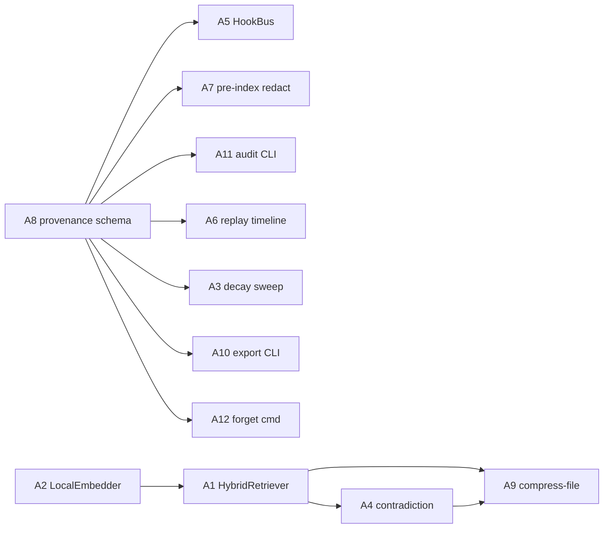

# Cross-Project Comparison: Nexus v1.1.0 vs. agentmemory

**Version**: v1.1.0 (pre-plan)
**Generated**: 2026-05-18T00:00:00Z
**Analyzer**: Claude Code -- /compare-project
**External Source**: https://github.com/rohitg00/agentmemory
**Source Type**: Repository
**Companion reports**: [comparison-sana.md](comparison-sana.md); upstream comparison artifacts in [docs/versions/v1/v1.0.0/comparison-comfyui.md](../v1.0/comparison-comfyui.md) and [docs/versions/v1/v1.0.0/comparison-devai-hub.md](../v1.0/comparison-devai-hub.md).
**Decision lens**: AGENTS.md / pivot-brief decision tree -- **local-only > LLM-native skill > reverse-engineered internal module > trusted-vendor wrapper > drop**.

---

## 1. Executive Summary

agentmemory is an Apache-2.0 persistent-memory system for AI coding agents (Claude Code, Codex, Cursor, Gemini CLI, plus ~12 more) that captures observations across sessions via 12 lifecycle hooks, indexes them with hybrid BM25 + dense vectors + a knowledge graph fused via Reciprocal Rank Fusion (RRF), and consolidates raw events through a four-tier pipeline (working -> episodic -> semantic -> procedural) backed by SQLite at `~/.agentmemory/`. The viewer dashboard lives on `127.0.0.1:3113`, the REST API on `:3111`, and a separate MCP server in `packages/mcp/` exposes ~51 tools (with a 7-tool offline fallback). It runs locally by default but is built on a third-party "iii-engine" Rust runtime (iii.dev) for functions / triggers / KV state / OTEL traces. Headline finding: **Nexus already ships a four-layer memory model and an MCP harness, but agentmemory has six concrete techniques worth reverse-engineering into our [core/memory/](../../../core/memory) and [core/observability/](../../../src/observability) surfaces -- hybrid retrieval with RRF fusion, Ebbinghaus-curve decay, contradiction detection, 12-hook lifecycle coverage, session replay timeline, and the privacy filter that strips secrets before indexing.** Overall recommendation: **selectively adopt** the techniques; **drop** the iii-engine dependency and the cloud-LLM compression options; **never vendor** the package itself (the iii-engine runtime is a third-party Rust binary that conflicts with our "originality over wrappers" + "local-first" + MCP Registry Policy stance).

---

## 2. Project Profiles

| Dimension | Nexus v1.0.0 -> v1.1.0 | agentmemory (latest main) |
|---|---|---|
| Identity | Local AI Studio (4 pillars: Coding / Chat / Image / Video) | Persistent-memory service for AI coding agents |
| Stage | v1.0.0 shipped 2026-05-18; v1.1.0 planning | Active development (Apache-2.0, ~1.5 yr old) |
| Audience | Developers / creators / data scientists wanting a private workstation | Operators of AI coding agents who want cross-session continuity |
| Surface | Tauri desktop app + optional VS Code extension + `nexus` CLI | Node-based daemon + MCP server + REST API + viewer UI |
| Scope | Four generative pillars, installer, sync pathway | Memory only (no inference, no UI for chat) |
| Tech stack | TypeScript + React 19 + Rust (Tauri) + Python (installer / diffusion runtime) | TypeScript + Node 20+ + Rust (iii-engine) + SQLite |
| License | MIT | Apache-2.0 |

The two projects do not directly compete -- agentmemory is a horizontal memory layer, Nexus is a vertical desktop product. The interesting comparison is the **memory subsystem alone**: how agentmemory does cross-session retention vs how Nexus's [core/memory/MemoryHub.ts](../../../core/memory/MemoryHub.ts) + [src/storage/MemoryStore.ts](../../../src/storage/MemoryStore.ts) + [src/storage/EpisodicMemory.ts](../../../src/storage/EpisodicMemory.ts) + [src/storage/GraphMemory.ts](../../../src/storage/GraphMemory.ts) do.

---

## 3. Technology Stack Comparison

| Layer | Nexus | agentmemory | Notes |
|---|---|---|---|
| Runtime | Node 20+, Rust (Tauri 2.x), Python 3.11 | Node 20+, Rust (iii-engine, third-party) | agentmemory's runtime is a single binary; Nexus's is a Tauri shell + Node sidecar |
| Storage | SQLite (`better-sqlite3`) at `~/.nexus/` | SQLite + in-memory vector index at `~/.agentmemory/` | Same storage primitive; agentmemory adds vector + graph indexes in-process |
| Embeddings | None bundled in v1.0.0 (deferred to v1.1.0 RAG work) | `all-MiniLM-L6-v2` via `@xenova/transformers` (local, default); optional OpenAI / Gemini / Voyage / Cohere / OpenRouter | agentmemory's local-default embedding is the right pattern |
| Search | Substring + sequential filter on episodic/semantic | BM25 + dense vector + knowledge-graph traversal, fused via RRF | agentmemory is materially more sophisticated |
| IPC | JSON-RPC 2.0 over stdio (Tauri sidecar) | REST `:3111` + WebSocket `:3112` + MCP server | Different shapes; both expose memory ops over an IPC surface |
| Viewer / UI | In-app panels (Memory / Trace / Sessions) under Tauri | Standalone web dashboard on `127.0.0.1:3113` | Nexus's Memory panel is in-app; agentmemory's is browser-served |
| Hooks | `IdleTimeScheduler` workers (curator, reflect) + skill-loaded hooks | 12 lifecycle hooks: SessionStart, UserPromptSubmit, PreToolUse, PostToolUse, PostToolUseFailure, PreCompact, SubagentStart, SubagentStop, Stop, SessionEnd, ... | agentmemory has finer-grained lifecycle coverage |
| Schema | working / episodic / semantic / graph (4 layers) | working / episodic / semantic / procedural (4 tiers) | Different name for the fourth layer; "procedural" overlaps with our skill catalog |
| Privacy | `redactSecrets()` on trace events (Phase 3 / 11) | "Strips API keys and secrets before indexing" | Both have the concept; agentmemory does it pre-index |
| Cloud opt-in | Local-only (no outbound calls without opt-in) | Local-default; opt-in Anthropic / Gemini / OpenAI / Cohere for compression + embeddings | Nexus opt-in story is stricter (no cloud option at all in v1.0.0) |

---

## 4. AI Assistant Configuration Comparison

| Aspect | Nexus | agentmemory |
|---|---|---|
| `.claude/agents/` | `pr-manager.md`, `pr-manager-lite.md`, `taskmaster.md` (committed; agent-agnostic markdown) | Not present (agentmemory is the *target* of hooks, not an agent author) |
| `.claude/commands/` | `ship-and-babysit.md` | Provides `/recall`, `/remember`, `/session-history`, `/forget` slash commands as part of its MCP surface |
| Skill catalog | DevAI-Hub baseline + user skills under `~/.nexus/skills/` | "4 skills" exposed alongside the 51 MCP tools |
| MCP server | `core/mcp/` (in-tree) + external MCP catalog under `catalog/mcp-configs/` | `packages/mcp/` (in-tree) -- proxies to running daemon, falls back to 7-tool offline set |
| Hooks integration | Skills can wire to `IdleTimeScheduler` workers | 12 hooks fire shell scripts at each agent lifecycle event |
| Context files | `AGENTS.md`, `ARCHITECTURE.md`, `pivot-brief.md`, per-version known-gaps | `README.md` + `docs/` (no equivalent of pivot-brief / known-gaps) |
| Instruction template | `AGENTS.md` is canonical and agent-agnostic | `README.md` + per-agent install instructions (no canonical agent-agnostic file) |

The structural gap: **agentmemory's 12-hook lifecycle coverage is finer-grained than Nexus's two-worker `IdleTimeScheduler`**. Nexus emits trace events but does not provide per-tool-call lifecycle hooks that external code (or the user's own skills) can attach to.

---

## 5. Skills and Capabilities Gap Analysis

### 5a. Present in agentmemory, Missing or Weaker in Nexus

| # | Capability | Where in agentmemory | Where it would land in Nexus | Notes |
|---|---|---|---|---|
| A1 | Hybrid retrieval: BM25 + dense vectors + knowledge graph fused via Reciprocal Rank Fusion | Core search engine (TypeScript) | [core/memory/MemoryHub.ts](../../../core/memory/MemoryHub.ts) + new `core/memory/HybridRetriever.ts` | Nexus's existing `UnifiedMemoryRetriever` is substring-based; this would be a step-change |
| A2 | Local embeddings via `@xenova/transformers` (`all-MiniLM-L6-v2`, 384-dim) | Default embedding path | New `core/memory/LocalEmbedder.ts` + `runtimes/embedder/` for ONNX | Already on the v1.1.0 RAG wishlist implicitly; agentmemory shows the concrete choice |
| A3 | Ebbinghaus-curve decay sweep: stale memories auto-evict; accessed memories strengthen | Decay sweep cron | New `core/memory/DecaySweep.ts` worker in `IdleTimeScheduler` | High value -- prevents unbounded memory growth |
| A4 | Contradiction detection: resolves conflicting memories automatically | Consolidation cron | New `core/memory/ContradictionResolver.ts` | Requires LLM call; gate behind opt-in |
| A5 | 12-hook agent lifecycle: SessionStart, UserPromptSubmit, PreToolUse, PostToolUse, PostToolUseFailure, PreCompact, SubagentStart, SubagentStop, Stop, SessionEnd | `src/hooks/` | New `core/lifecycle/HookBus.ts` -- emits typed lifecycle events the existing TraceBus subscribes to | Mirrors Anthropic's Claude Code hook surface; aligns Nexus's own Coding module with the wider ecosystem |
| A6 | Session replay with timeline scrubbing, play/pause, speed control | Web viewer on `:3113` | Extend [src/panels/TraceDashboardPanel.ts](../../../src/panels/TraceDashboardPanel.ts) (Tauri webview) with a `<TimelineScrubber>` | Nexus's TraceDashboard shows events but does not replay them temporally |
| A7 | Privacy filter strips API keys + secrets before they hit the index | Pre-index sanitization | Extend [`core/observability/redactSecrets`](../../../src/observability) to also gate writes into `MemoryHub` | Nexus redacts traces; not yet memory rows |
| A8 | Memory provenance chain (which session / hook / tool wrote this row) | Memory row metadata | Add `provenance: {sessionId, hookKind, toolName, parentSpanId}` to `MemoryEntry` | Improves explainability for memory-driven suggestions |
| A9 | `memory_compress_file` MCP tool -- compress per-file observations into structured facts | MCP API | New `nexus.memory.compressFile` IPC + slash command `/memory-compress <path>` | Useful for long codebases; matches our compaction story |
| A10 | Auto-export to portable JSONL on demand (`memory_export`) | MCP tool | New `nexus memory export --out <file>` CLI subcommand | Useful for skill curation + cross-machine sync |
| A11 | `memory_audit` introspection: who wrote / read / decayed what | MCP tool | New `nexus memory audit` CLI | Aligns with Nexus's trace dashboard surface |
| A12 | `/forget` slash command -- explicit user-driven memory deletion | MCP slash command | New `/forget <pattern\|id>` slash command + UI button in Memory panel | GDPR-aligned; Nexus does not yet expose explicit forget |
| A13 | Lease & signal coordination between multiple agents on the same machine | Inter-agent primitives | Deferred -- Nexus is single-process today | Drop until multi-agent on one machine becomes a real use case |
| A14 | Plugin auto-wiring: a single `/plugin install` registers all hooks + 4 skills + MCP server in Claude Code | Plugin installer | Inform v1.1.0 installer's "Nexus VS Code extension add-on" UX -- one click should wire everything | Pattern, not code |

### 5b. Present in Nexus, Missing or Weaker in agentmemory

| # | Capability | Why this is a Nexus strength |
|---|---|---|
| B1 | Four-layer memory model with explicit `MemoryHub` facade (working / episodic / semantic / graph) | Nexus separates *facade* from *layer* cleanly; agentmemory's tiers are tightly coupled to its iii-engine functions |
| B2 | `ChatScopedMemory` bridge -- per-folder context scoping | Nexus has folder-based scope chains; agentmemory has no equivalent (every session shares the same memory) |
| B3 | DevAI-Hub sync pathway with sparse-clone + tag-pinning + prompt-injection scanner | Nexus's skill provenance + scanner is more defensive than agentmemory's "snapshot + restore" approach |
| B4 | Hardware-tier aware (`DiffusionTier`, `GpuTelemetrySource`) | Nexus runs heavy local models; agentmemory is memory-only and ignores hardware |
| B5 | Tauri-native desktop UI with always-on `Local Model Status` widget | agentmemory's viewer is a browser tab; Nexus is a native app |
| B6 | Installer that carries CUDA + Python venv + Node + Ollama + models + DevAI-Hub baseline | agentmemory's install is `npm install -g`; Nexus's installer carries the whole stack |
| B7 | Single-GPU ceiling as a design constraint | agentmemory doesn't even use the GPU |
| B8 | Per-version known-gaps tracking + operator-actions consolidation file | Nexus's documentation rigor is stronger |
| B9 | MCP Registry Policy + reverse-engineering decision tree applied to every new dep | agentmemory adopts iii-engine wholesale without an equivalent policy |
| B10 | Local-only by default; no cloud-LLM compression path | Nexus is stricter on outbound calls |

### 5c. Present in Both, Quality Comparison

| Capability | Nexus quality | agentmemory quality | Verdict |
|---|---|---|---|
| Working / episodic / semantic memory layers | Solid foundation; substring retrieval | Same layers + RRF retrieval | agentmemory wins on retrieval |
| Knowledge graph | `GraphMemory.ts` entity table | Graph entities + relationships + entity-graph search | Similar shape; agentmemory has more polish on traversal |
| MCP server | In-tree `core/mcp/` (modest surface) | `packages/mcp/` with 51 tools | agentmemory wins on breadth, but breadth is a security cost (large attack surface) |
| Secret redaction | On trace events | On memory rows pre-index | agentmemory's placement is better; adopt the pattern |
| Slash commands | `/plan`, `/clear`, `/commit`, `/curate`, `/trace`, `/thinking-mode`, `/skill-metrics`, `/memory`, `/verify`, `/research`, `/help`, `/review-pr` | `/recall`, `/remember`, `/session-history`, `/forget` | Different focus; adopt `/recall` / `/forget` |
| Trace dashboard | TraceDashboard panel | Viewer at `:3113` with live stream + replay | agentmemory's replay UX is a clear adoption |
| Local-by-default | Strict (no cloud option) | Strict-by-default + opt-in cloud | Nexus is stricter; do not add cloud opt-in |

---

## 6. Commands and Automation Comparison

### 6a. Commands Gap

| Command in agentmemory | Nexus equivalent today | Recommendation |
|---|---|---|
| `/recall <query>` | `/memory` shows memory panel; no targeted query | Add `/recall <query>` that runs the new hybrid retriever and surfaces top N hits |
| `/remember <text>` | Manual `/memory` panel write only | Add `/remember <text>` that writes a working-tier observation with provenance |
| `/forget <pattern\|id>` | Not present | Add `/forget <pattern\|id>` with confirmation prompt + audit trail entry |
| `/session-history` | `nexus skills sync` is closest; no per-session history surface | Add `/session-history [N]` that lists last N sessions with timestamps and summary |
| `nexus memory export --out` | Not present | Add `nexus memory export --out <file> [--scope <id>]` CLI |
| `nexus memory audit` | Trace dashboard, no CLI | Add `nexus memory audit --since <ISO>` CLI |
| `nexus memory compress --file <path>` | Not present | Add `nexus memory compress --file <path>` CLI for long-file compaction |

### 6b. CI / Hooks Gap

| Hook in agentmemory | Nexus equivalent | Recommendation |
|---|---|---|
| SessionStart | `IdleTimeScheduler` startup | Add explicit `lifecycle.session.start` event on the TraceBus, fired by `AgentLoop.startSession()` |
| UserPromptSubmit | None (the user message reaches `AgentLoop` directly) | Add `lifecycle.user.prompt` event |
| PreToolUse | `ConfirmationGate` is closest | Add `lifecycle.tool.pre` event with `{toolName, args}` |
| PostToolUse | None (tool result is observed in the trace) | Add `lifecycle.tool.post` event with `{toolName, ok, durationMs}` |
| PostToolUseFailure | None | Add `lifecycle.tool.failed` event with redacted error |
| PreCompact | `Tracer` snapshot points | Add `lifecycle.context.preCompact` event |
| SubagentStart / SubagentStop | `SubAgentManager` events (not surfaced) | Surface as `lifecycle.subagent.start` / `lifecycle.subagent.stop` |
| Stop | `AgentLoop.finishTurn` is closest | Add `lifecycle.session.stop` event |
| SessionEnd | None (the session record is implicit) | Add `lifecycle.session.end` event with summary metadata |

A new `core/lifecycle/HookBus.ts` (a typed re-exporter atop `TelemetryBus`) makes these consumable by both internal skills and external tools (the future Nexus VS Code extension add-on).

---

## 7. Documentation and Developer Experience Comparison

| Dimension | Nexus | agentmemory |
|---|---|---|
| README quality | Deep; cross-links pivot brief + per-version docs | Tutorial-style; install + features |
| Architecture doc | `ARCHITECTURE.md` + per-version `architecture.md` | Inline in README |
| Per-version known gaps | Yes, per-cycle | No |
| Cycle plan | `docs/<version>/plans/<version>-cycle.md` | No equivalent |
| Operator actions consolidation | `operator-actions.md` per version | No |
| Reverse-engineering matrix | `docs/archive/versions/v0/v0.7.0/comparison-multi-source.md` | No equivalent (project adopts iii-engine wholesale) |

Nothing to adopt on documentation -- Nexus is materially ahead.

---

## 8. Testing and Security Posture Comparison

| Dimension | Nexus | agentmemory |
|---|---|---|
| Test framework | Vitest + pytest | Jest / vitest (TS) |
| Coverage gate | 80% lines / 80% functions in `desktop/`; per-module gates | Tests exist; no public coverage gate visible |
| Security review | Phase 11 deep review + security audit + pen-test (review/) | No comparable security review artifact |
| Secret redaction | `redactSecrets()` on traces | Pre-index sanitization |
| Prompt injection scanner | `core/skills/PromptInjectionScanner.ts` (11 OWASP-aligned rules) | None visible |
| Pinned upstream | DevAI-Hub via SHA + content hash | iii-engine version pin via npm semver only |
| Outbound calls | None by default | None by default, but cloud LLM is one env var away |

agentmemory's posture is reasonable, but Nexus's review machinery is more rigorous.

---

## 9. Security and Risk Assessment

This section gates Section 11. The MCP Registry Policy from [AGENTS.md](../../../AGENTS.md) drives every classification.

### 9.1 Threat Model Comparison

| Dimension | Nexus | agentmemory | Adoption delta |
|---|---|---|---|
| New runtime dependencies | Node, Rust (Tauri), Python | Node, Rust (iii-engine -- third-party), `@xenova/transformers` | iii-engine adoption is unacceptable; the embedder is acceptable |
| Outbound calls at runtime | None by default | None by default; cloud LLM + cloud embedder are one env-var flip away | Adopting cloud-LLM compression introduces a regression in our local-only posture |
| Credentials / API keys | None for v1.0.0 | `ANTHROPIC_API_KEY` / `OPENAI_API_KEY` / `GEMINI_API_KEY` accepted but not required | Do not adopt the cloud paths |
| Code leaving the machine | No | No (by default) | Same posture |
| New commercial relationships | None | iii.dev (the iii-engine maintainer), HuggingFace (xenova/transformers weights are CDN-hosted), optional LLM vendors | We only need HuggingFace (the embedder weights). HF is acceptable as a one-time install-time download, not a runtime dependency |

### 9.2 Per-Item Risk Scorecard

| Item | Risk tier | Justification |
|---|---|---|
| A1 Hybrid RRF retrieval | Low | Pure in-process indexing; no new outbound call |
| A2 Local embeddings via xenova/transformers | Medium | Adds `@xenova/transformers` (Apache-2.0) + ONNX weight file (~80 MB). The weights file is a one-time install-time download; the runtime is local-only |
| A3 Ebbinghaus decay sweep | None | Pure local maintenance |
| A4 Contradiction detection | Medium | Requires an LLM call to adjudicate; gate behind the local Ollama-served model only (no cloud) |
| A5 12-hook lifecycle | None | Internal typed event bus |
| A6 Session replay timeline | None | Read-only UI over local trace store |
| A7 Pre-index secret filter | None | Reuses existing `redactSecrets` |
| A8 Memory provenance | None | Schema add only |
| A9 `memory_compress_file` | Medium | Requires LLM call; same gating as A4 |
| A10 Memory export | Low | Pure local file write; gate path under `~/.nexus/exports/` |
| A11 Memory audit | None | Pure read-only CLI |
| A12 `/forget` | None | Local delete with confirmation |
| A13 Multi-agent lease/signal | Drop | Out of v1.1.0 scope |
| A14 Plugin auto-wiring pattern | None | Informs UX of our installer / extension wiring |

### 9.3 Reverse-Engineering Viability

| Item | Classification | Internal deliverable | Effort | Rationale |
|---|---|---|---|---|
| A1 | `re-full` | `core/memory/HybridRetriever.ts` + `core/memory/RrfFuser.ts` | M | Pure algorithm; no external runtime needed |
| A2 | `re-full` (with HF download) | `core/memory/LocalEmbedder.ts` wrapping `@xenova/transformers`; weights hosted in installer payload | M | The transformer.js library is Apache-2.0 and runs ONNX locally; we package the weights with the installer to avoid a runtime HF call |
| A3 | `re-full` | `core/memory/DecaySweep.ts` registered as an `IdleTimeScheduler` worker | S | Ebbinghaus curve is a closed-form `exp(-t/halfLife)`; no new dep |
| A4 | `re-partial` | `core/memory/ContradictionResolver.ts` -- local Ollama prompt, opt-in | M | The detection logic is RE'able; the LLM call routes through our existing local Ollama client |
| A5 | `re-full` | `core/lifecycle/HookBus.ts` | S | Typed event bus on top of `TelemetryBus`; no external dep |
| A6 | `re-full` | `desktop/src/components/TimelineScrubber.tsx` on the TraceDashboard | M | Pure UI over already-stored trace events |
| A7 | `re-full` | Widen `redactSecrets()` invocations into `MemoryHub.write` path | S | Reuses existing utility |
| A8 | `re-full` | Add `provenance` field to `MemoryEntry` + migrate SQLite schema | S | Schema migration only |
| A9 | `re-partial` | `nexus memory compress --file <path>` -- local Ollama prompt | M | Same gating as A4 |
| A10 | `re-full` | `nexus memory export --out <file>` | S | One file write |
| A11 | `re-full` | `nexus memory audit` | S | One SQL select |
| A12 | `re-full` | `/forget` slash command + Memory panel button | S | Local delete |
| A13 | `drop-outright` | n/a | n/a | Multi-agent-on-one-machine not in v1.1.0 scope |
| A14 | `skill-native` | Inform installer UX; no new code | n/a | Pattern, not implementation |

Net: **zero adoption candidates require iii-engine, cloud LLMs, or any external runtime that survives past install time.**

### 9.4 Recommendation Ordering

Per the policy, the v1.1.0 plan implements these in this order:

1. **`skill-native`** (no new code): A14 informs installer UX.
2. **`re-full`** (build internal):
   - A8 provenance (schema)
   - A5 HookBus (typed events)
   - A7 pre-index secret filter widening
   - A11 memory audit CLI
   - A10 memory export CLI
   - A12 `/forget` slash command + UI
   - A3 Ebbinghaus decay sweep
   - A1 Hybrid RRF retriever
   - A2 Local embeddings (with installer-packed weights)
   - A6 Session replay timeline (UI)
3. **`re-partial`** (build internal, route LLM calls through local Ollama, opt-in):
   - A4 Contradiction detection
   - A9 `memory_compress_file`
4. **`drop-outright`**: A13 multi-agent leases.

The iii-engine itself is **not adopted** -- we use plain Node + SQLite + the embedder, which is what agentmemory's fallback path uses anyway.

---

## 10. Structural and Architectural Differences

- **agentmemory ships a long-running daemon (REST + WebSocket); Nexus ships a Tauri app with an IPC sidecar.** Nexus's IPC contract is the natural place to add the new memory ops -- no second port to open.
- **agentmemory's `:3113` viewer is a separate process binding `127.0.0.1`; Nexus's TraceDashboard is in-app.** Keep the Nexus pattern; do not stand up a second port.
- **agentmemory exposes a 51-tool MCP surface; Nexus exposes a smaller MCP surface.** Expanding the Nexus MCP surface buys ecosystem reach (Cursor, Codex, etc.) but each tool is an attack-surface row. Add 4-6 tools (`memory.recall`, `memory.remember`, `memory.forget`, `memory.compress`, `memory.export`, `memory.audit`) -- not 51.
- **agentmemory's 4-tier consolidation runs as a nightly cron**; Nexus has `IdleTimeScheduler`. Wire the decay sweep + (opt-in) consolidation into the existing scheduler -- no new daemon.

---

## 11. Adoption Plan

Within each RE-bucket from Section 9.4, items are ordered by priority tier.

### 11.1 Skill-native (P0)

| # | What | Source | Target | Effort | Dependencies | Risk |
|---|---|---|---|---|---|---|
| A14 | Plugin one-shot wiring pattern | agentmemory `/plugin install` UX | Inform installer wizard's "Nexus VS Code extension add-on" step | Trivial | none | None |

### 11.2 Reverse-engineerable into internal code

**P0 -- foundational schema and event surfaces:**

| # | What | Source | Target | Effort | Dependencies | Risk |
|---|---|---|---|---|---|---|
| A8 | Add `provenance: {sessionId, hookKind, toolName, parentSpanId}` to `MemoryEntry` | `memory_save` row metadata | `core/memory/types.ts`, SQLite migration | S | None | Low (schema migration) |
| A5 | `core/lifecycle/HookBus.ts` typed lifecycle events | `src/hooks/` | `core/lifecycle/HookBus.ts` + emit sites in `AgentLoop`, `SubAgentManager`, `ConfirmationGate`, `Tracer` | M | None | Low |
| A7 | Pre-index secret redaction in `MemoryHub.write` | Pre-index sanitization in agentmemory | Widen `redactSecrets()` call into the write path | S | A8 | Low |

**P1 -- retrieval upgrade and lifecycle tools:**

| # | What | Source | Target | Effort | Dependencies | Risk |
|---|---|---|---|---|---|---|
| A1 | `core/memory/HybridRetriever.ts` (BM25 + dense + graph via RRF) | Core search engine | `core/memory/HybridRetriever.ts`, `core/memory/RrfFuser.ts`, `core/memory/Bm25Index.ts` | M | A2 | Low |
| A2 | `core/memory/LocalEmbedder.ts` -- `@xenova/transformers` + `all-MiniLM-L6-v2` weights packed in installer | Default embedding path | `core/memory/LocalEmbedder.ts`, weights at `~/.nexus/runtimes/embedder/all-MiniLM-L6-v2/` | M | Installer payload step | Medium (HF weight download size ~80 MB) |
| A3 | Ebbinghaus decay sweep worker | Decay cron | `core/memory/DecaySweep.ts` -- `IdleTimeScheduler` worker | S | A8 | Low |
| A11 | `nexus memory audit` CLI | `memory_audit` MCP tool | `bin/nexus.mjs` subcommand + `core/memory/MemoryAudit.ts` | S | A8 | Low |
| A12 | `/forget` slash command + Memory panel "Forget" button | `/forget` MCP slash command | `src/chat/SlashCommandRouter.ts` + Memory panel UI | S | A8, A11 | Low |
| A10 | `nexus memory export --out <file>` | `memory_export` MCP tool | `bin/nexus.mjs` subcommand + `core/memory/MemoryExport.ts` | S | A8 | Low |
| A6 | Session replay timeline scrubber | Web viewer replay | `desktop/src/modules/coding/panels/TimelineScrubber.tsx` | M | A8 | Low |

### 11.3 Reverse-engineerable with local-LLM gating (P2)

| # | What | Source | Target | Effort | Dependencies | Risk |
|---|---|---|---|---|---|---|
| A4 | Contradiction resolver (opt-in, routes through local Ollama) | Consolidation cron | `core/memory/ContradictionResolver.ts` + Settings toggle `nexus.memory.contradiction.enabled` (default off) | M | A1, A2 | Medium (LLM cost: gated to local model only) |
| A9 | `memory_compress_file` (opt-in, local Ollama) | MCP tool | `nexus memory compress --file <path>` + `/memory-compress <path>` slash command | M | A1, A2, A4 | Medium |

### 11.4 Dropped

| # | What | Reason |
|---|---|---|
| A13 | Multi-agent lease/signal coordination | Out of v1.1.0 scope; no real use case yet on a single workstation |
| iii-engine adoption | Hard no | Third-party Rust runtime; violates "originality over wrappers"; the SQLite + in-memory vector fallback path is what we use |
| Cloud-LLM compression (Anthropic / OpenAI / Gemini / Cohere) | Hard no | Local-only is a v1.0.0 design principle (README Section "Design Principles" #1); local Ollama only |
| 51-tool MCP surface | Hard no | Attack surface; we ship 6 tools, not 51 |
| Standalone viewer on `:3113` | Hard no | Nexus's TraceDashboard is in-app; no second port |
| Auto-install of hooks into Claude Code settings | Hard no | The Nexus VS Code extension add-on is the official wire-up; no third-party harness manipulation |

---

## 12. Implementation Sequence

Recommended phase placement:

- **v1.1.0 Phase 5 (Memory upgrade)**: A8, A5, A7, A3, A11, A12, A10 -- the schema + lifecycle + UX layer.
- **v1.1.0 Phase 6 (Hybrid retrieval + local embedder)**: A1, A2.
- **v1.1.0 Phase 7 (Timeline replay)**: A6.
- **v1.1.0 Phase 9 (Optional consolidation)**: A4, A9 -- gated behind `nexus.memory.compression.enabled` (default off).

(Phase numbers above are placeholders; the v1.1.0-cycle.md plan finalizes them after this report.)

---

## 13. Risks and Considerations

- **Schema migration risk (A8 provenance)**: `MemoryEntry` is a load-bearing type. The migration runs once on first launch of v1.1.0; existing rows get `provenance: null`. The SQLite schema change must be tested with `npm run test` against fixture databases generated under v1.0.0.
- **Embedder weight size**: `all-MiniLM-L6-v2` ONNX weights add ~80 MB to the installer payload. This is acceptable (under the existing 1.5 GB CUDA runtime); the v1.1.0 installer documentation page (already on the wishlist for the recommended-models picker) absorbs the new line item.
- **RRF fusion parameters**: `k=60` is the canonical RRF constant. We expose a Settings key `nexus.memory.rrf.k` (default 60) so power users can tune; no UI surface.
- **Contradiction detection cost**: Each contradiction adjudication is an Ollama prompt (a few hundred tokens at most). With the default off, the cost is zero. When enabled, the `IdleTimeScheduler` worker rate-limits itself to one adjudication per idle window.

### Items explicitly NOT recommended for adoption (security / policy reasons)

| ID | Item | Policy rejection reason |
|---|---|---|
| N1 | iii-engine runtime adoption | Violates MCP Registry Policy step (3) "reverse-engineer into a local internal MCP / module". The functionality (SQLite + in-memory vector index + cron sweep + REST API) is straightforwardly RE'able; vendoring iii-engine would create a permanent third-party dependency for capability we can ship natively |
| N2 | Cloud-LLM compression (Anthropic / OpenAI / Gemini / Cohere) | Violates MCP Registry Policy step (5) and Nexus's local-first design principle. The compression use case is satisfied by local Ollama models |
| N3 | Cloud embeddings (Voyage AI / Cohere / OpenAI text-embedding-3-small) | Same as N2 |
| N4 | 51-tool MCP surface | Each tool is an attack surface row. The 6-tool set we adopt is the minimum viable equivalent; the remaining 45 (graph traversal, leases, signals, routines, snapshots, governance) are either internal-only or out of v1.1.0 scope |
| N5 | Standalone viewer on `:3113` | Violates "no extra processes" guidance; Nexus's in-app TraceDashboard is the canonical UI |
| N6 | Auto-install of hooks into Claude Code settings | Violates user-consent boundary; the Nexus VS Code extension add-on is the explicit wire-up surface |
| N7 | Multi-agent lease/signal coordination (A13) | Not a v1.1.0 priority; no real use case on a single workstation |

---

## 14. Headline Adoption Summary

**Total candidates analyzed**: 14
**Adopt-in-v1.1.0 (P0+P1)**: 10 (A8, A5, A7, A1, A2, A3, A6, A10, A11, A12)
**Adopt-with-gate (P2)**: 2 (A4, A9)
**Pattern only (informs installer UX)**: 1 (A14)
**Dropped**: 1 (A13) + the underlying iii-engine + cloud LLM paths (N1-N6)

The single most-valuable adoption is **A1 + A2 (Hybrid RRF retriever with local embeddings)** -- it elevates Nexus's memory retrieval from substring search to state-of-the-art hybrid retrieval, with zero new outbound calls.
