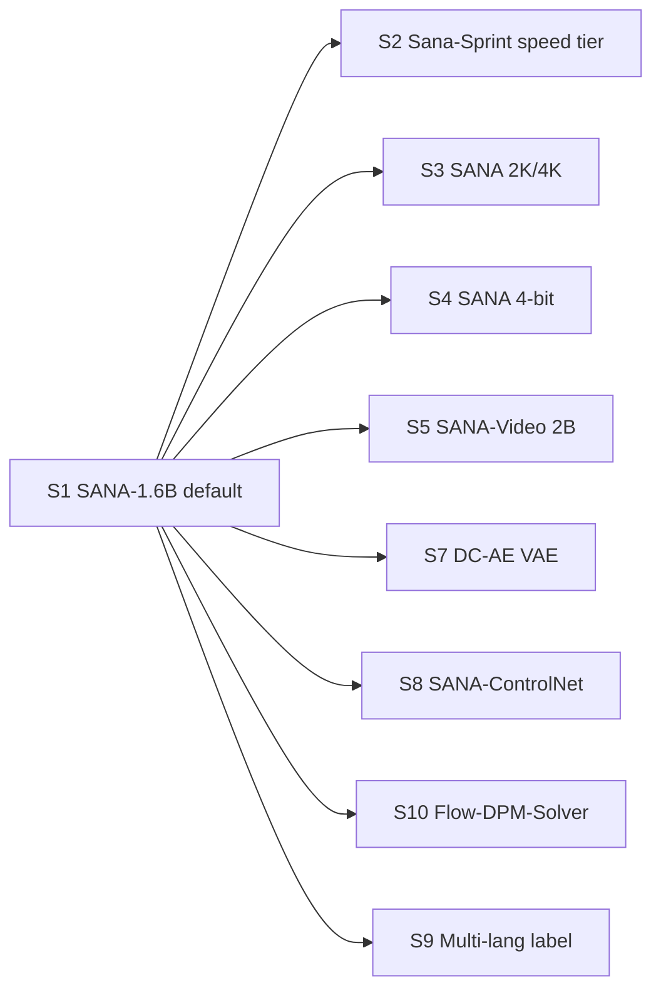

# Cross-Project Comparison: Nexus v1.1.0 vs. NVIDIA SANA

**Version**: v1.1.0 (pre-plan)
**Generated**: 2026-05-18T00:00:00Z
**Analyzer**: Claude Code -- /compare-project
**External Source**: https://github.com/NVlabs/Sana
**Source Type**: Repository
**Companion reports**: [comparison-agentmemory.md](comparison-agentmemory.md); upstream comparison artifacts in [docs/versions/v1/v1.0.0/comparison-comfyui.md](../v1.0/comparison-comfyui.md) and [docs/versions/v1/v1.0.0/comparison-devai-hub.md](../v1.0/comparison-devai-hub.md).
**Decision lens**: AGENTS.md / pivot-brief decision tree -- **local-only > LLM-native skill > reverse-engineered internal module > trusted-vendor wrapper > drop**.

---

## 1. Executive Summary

SANA (NVIDIA Labs, Apache-2.0) is an efficiency-oriented diffusion architecture that delivers high-resolution image generation up to 4K with order-of-magnitude speedups over Flux-class models: SANA-1.6B produces a 1024px image in ~1.2 seconds, the distilled SANA-Sprint variant produces one in ~0.3 seconds on an RTX 4090. The architecture pillars are (a) **DC-AE 32x latent compression** (vs the conventional 8x), (b) **linear attention** replacing vanilla transformer attention, (c) a **decoder-only LLM as the text encoder** (replacing CLIP-style encoders), and (d) the **Flow-DPM-Solver** sampling scheduler. Variants cover 0.6B / 1.6B / 4.8B params (image), 2B (video), and a Sana-Sprint one-step distilled tier; quantized 4-bit builds run in 8 GB VRAM; ComfyUI integration exists via a community node; weights are on HuggingFace under `Efficient-Large-Model/`. Headline finding: **SANA is a near-perfect fit for Nexus's [Image Studio](../../../modules/image)** -- it matches our single-GPU ceiling, beats SDXL Turbo on speed, supports 2K/4K natively (which our current model lineup does not), and ships ControlNet + LoRA + diffusers integration. Overall recommendation: **adopt SANA-1.6B as the new default image model and SANA-Sprint as the speed tier in v1.1.0**, **add SANA-Video 2B to the Video Lab as an opt-in** (it offers 720p video at competitive speed), **integrate via `diffusers.SanaPipeline`** (no vendoring), and **package weights via the v1.1.0 installer's recommended-models picker**.

---

## 2. Project Profiles

| Dimension | Nexus v1.0.0 -> v1.1.0 | NVIDIA SANA |
|---|---|---|
| Identity | Local AI Studio (Coding / Chat / Image / Video) | Efficient diffusion architecture + reference weights |
| Stage | v1.0.0 shipped 2026-05-18 | Active research; SANA-1.5 + Sana-Sprint + SANA-Video shipped |
| Audience | Developers / creators / data scientists wanting a private workstation | Researchers + diffusion-power-users + downstream model integrators |
| Surface | Tauri app + VS Code extension + `nexus` CLI | Python research code + HuggingFace `diffusers` integration + ComfyUI node |
| Scope | Four pillars in one shell | Image (4 sizes) + Video (1 size) + Sprint distillation |
| Tech stack | TypeScript + Rust + Python | PyTorch + diffusers + Triton (linear attention kernels) |
| License | MIT | Apache-2.0 (code AND model weights) |

**Compatibility note**: SANA targets NVIDIA GPUs by design (Triton kernels, CUDA-only paths). On macOS Apple Silicon, the diffusers `SanaPipeline` runs but the speed advantage from linear attention is reduced. Nexus's `DiffusionTier` classifier already handles this via the Metal Performance Shaders fallback path we documented in [docs/versions/v1/v1.0.0/installer-macos-and-linux.md](../v1.0/installer-macos-and-linux.md) -- SANA on macOS is an opt-in slower path, not a regression.

---

## 3. Technology Stack Comparison

| Layer | Nexus current (v1.0.0) | SANA | Notes |
|---|---|---|---|
| Diffusion runtime | `runtimes/diffusion/` (Python sidecar) | diffusers + custom Triton kernels for linear attention | `diffusers.SanaPipeline` is the supported integration point |
| Default 1024px image model | SDXL Turbo (~6.6 GB) | SANA-1.6B (~3.2 GB, BF16) | SANA is ~2x smaller AND faster |
| Speed tier model | SDXL Turbo | Sana-Sprint (0.3 s / 1024px on 4090) | Sprint is 4-5x faster than Turbo |
| Multi-resolution | SDXL up to 1024px (above that gets noisy) | SANA-1.6B 1024 / 2K / 4K with dedicated checkpoints | 2K/4K is a new capability for Nexus |
| Quantization | None in v1.0.0 (planned later) | 4-bit SVDQuant / 8-bit ready; runs in 8 GB VRAM | Unblocks our `diffusion-low` tier (8 GB VRAM hosts) |
| ControlNet | Phase 6 (pose / depth / canny via `controlnet_aux`) | SANA-ControlNet released for SANA-1.5 | Reuse existing preprocessors; swap the model path |
| LoRA | Phase 6 LoRA loader | Native (works through diffusers PEFT integration) | No code change needed |
| Workflow embed | PNG metadata via `core/image/WorkflowMetadata` | Standard diffusers metadata | Compatible |
| Video model | LTX-Video (default) + SVD + CogVideoX (opt-in) | SANA-Video 2B (720p, ~36 s per clip) + LongSANA (1-minute, 27 FPS) | SANA-Video joins the lineup at the "fast 720p" tier between LTX-Video and CogVideoX |
| Text encoder | None for image (SDXL has its own dual CLIP) | Decoder-only LLM (modern instruction-tuned small LLM) | Bigger memory footprint but better prompt fidelity |

---

## 4. AI Assistant Configuration Comparison

Not directly applicable -- SANA is a model family, not an agent harness. The only relevant cross-axis is whether the SANA-Sprint distilled tier matches the kind of "one-shot, fast preview" UX our installer's recommended-models picker should expose. Answer: yes; we add a "Speed Preview" preset that pairs SANA-Sprint with the lightest Gemma 4 variant.

---

## 5. Skills and Capabilities Gap Analysis

### 5a. Present in SANA, Missing in Nexus today

| # | Capability | Where in SANA | Where it would land in Nexus | Notes |
|---|---|---|---|---|
| S1 | SANA-1.6B as default 1024px model | `Efficient-Large-Model/SANA1.5_1.6B_1024px_diffusers` | Add to [core/registry/catalog.json](../../../core/registry/catalog.json); make it the recommended-default in the installer picker | Single highest-value adoption |
| S2 | SANA-Sprint one-step distilled (0.3 s / 1024px on 4090) | `Efficient-Large-Model/sana-sprint` collection | Add as speed tier in `catalog.json`; bind to a new "Fast Preview" Generate button mode | Big UX win for img2img iteration |
| S3 | Native 2K / 4K image generation | `Efficient-Large-Model/Sana_1600M_2Kpx_BF16`, `..._4Kpx_BF16` | Add to `catalog.json`; gate behind `DiffusionTier >= diffusion-mid` (18 GB VRAM for 4K with offload) | Unlocks resolution Nexus cannot reach today |
| S4 | 4-bit quantized SANA via SVDQuant / Nunchaku | Documented in SANA model zoo | Add as `int4` variant to `catalog.json`; bind to `diffusion-low` (8 GB) tier defaults | Unlocks SANA for low-VRAM laptops |
| S5 | SANA-Video 2B (720p, ~36 s) | `Efficient-Large-Model/SANA-Video-2B` | Add to `catalog.json` under `type: "video"`; expose in Video Lab as "Fast 720p" option between LTX-Video and CogVideoX | Faster than CogVideoX, higher fidelity than LTX |
| S6 | LongSANA (1-minute video, 27 FPS) | `Efficient-Large-Model/LongSANA` | Defer to v1.2.0 (1-minute clips exceed v1.1.0 Video Lab UX scope) | Drop from v1.1.0 |
| S7 | DC-AE 32x compression VAE | `mit-han-lab/dc-ae-f32c32-sana-1.1` | Required as the VAE component when loading SANA via diffusers; ship as part of the SANA bundle in the installer | Implementation detail |
| S8 | ControlNet for SANA-1.5 | Released alongside SANA-1.5 | Add SANA-compatible ControlNet weights to `catalog.json`; reuse Phase 6 preprocessor wiring | Plug-in adoption |
| S9 | Multi-language prompt support (English / Chinese / Emoji) | SANA architecture (decoder-only LLM encoder) | Surface in the Image Studio prompt-form UI (no UI change needed -- pass-through) | Free with S1 |
| S10 | Flow-DPM-Solver sampler | SANA's bundled sampler | Already exposed through diffusers; expose in the "Advanced" sampler picker | UX surface |

### 5b. Present in Nexus, Missing in SANA

| # | Capability | Why this is a Nexus strength |
|---|---|---|
| BN1 | Smart-offload + TAESD latent previews + workflow-as-PNG-metadata | SANA is a model family; Nexus is the runtime that hosts it |
| BN2 | Multi-pillar shell (Coding / Chat / Image / Video) | SANA cares about diffusion only |
| BN3 | Installer that carries CUDA + Python venv + Node + Ollama + models | SANA assumes researcher / developer has the stack |
| BN4 | DevAI-Hub-style skill catalog | n/a |
| BN5 | Hardware-tier-aware defaults | SANA's `--lowvram` flag is closest, but Nexus's `DiffusionTier` is structured |
| BN6 | Telemetry + scheduler + memory layers | n/a |

### 5c. Present in Both, Quality Comparison

| Capability | Nexus today | SANA | Verdict |
|---|---|---|---|
| 1024px image generation | SDXL Turbo (~3-4 s on 4070) | SANA-1.6B (~1.2 s on 4070, faster) | Adopt SANA as new default |
| 1024px speed tier | SDXL Turbo (already fast) | Sana-Sprint (~0.3 s on 4090) | Sprint is materially faster |
| Video generation | LTX-Video (12 GB, ~5 min for 4 s @ 24 fps on 4070) | SANA-Video 2B (~36 s per clip) | SANA-Video joins as fast 720p tier |
| ControlNet | Pose / depth / canny | SANA-ControlNet | Both work; SANA's is tied to its model |
| LoRA | Phase 6 LoRA loader | diffusers-native | Both work |
| Multi-lang prompts | English-only effective | English + Chinese + Emoji | Free upgrade with adoption |

---

## 6. Commands and Automation Comparison

| Command in SANA workflows | Nexus equivalent | Recommendation |
|---|---|---|
| `pipe = SanaPipeline.from_pretrained(...)` | `core/registry/ModelRegistry` loads by id | No change; the registry handles model loading |
| ComfyUI workflow with SANA node | Image Studio "Advanced" form / future node-graph tab | Image Studio Forms cover SANA by selecting the model |
| SVDQuant 4-bit packaging | `nexus models install --variant int4 sana-1.6b` | Add `variant` flag to the installer / ModelRegistry catalog entry |

No CI / hook changes -- SANA is a model, not an automation surface.

---

## 7. Documentation and Developer Experience Comparison

| Dimension | Nexus | SANA |
|---|---|---|
| README quality | Deep, layered | Research-paper-style + extensive command examples |
| Architecture doc | Multi-doc per version | Paper + `docs/` |
| Installation | Single installer | Manual conda env + git clone + HF model download |
| Cross-platform | Windows / macOS / Linux planned | Linux-first; Windows via WSL2; macOS untested at speed |

The interesting takeaway: SANA's docs show how to package the runtime efficiently (Triton kernels, BF16 inference, DC-AE VAE loading). Nexus's [runtimes/diffusion/](../../../runtimes/diffusion) integrates against the diffusers `SanaPipeline` -- we do not re-implement SANA's kernels; we depend on them via diffusers.

---

## 8. Testing and Security Posture Comparison

| Dimension | Nexus | SANA |
|---|---|---|
| Test framework | Vitest + pytest | pytest (research-grade) |
| Coverage gate | 80% / 80% gate | None documented |
| Outbound calls | None by default | HuggingFace download at first use (cacheable, install-time) |
| Vendor lock-in | None | NVIDIA-friendly Triton kernels (CPU / Metal fallback exists but slower) |
| Model license | n/a | Apache-2.0 (clean for commercial use) |

Apache-2.0 on both code AND weights is a meaningful win. SDXL / SD 1.5 ship with the OpenRAIL-M / CreativeML licenses which add use-case restrictions; SANA's Apache-2.0 is unrestricted.

---

## 9. Security and Risk Assessment

### 9.1 Threat Model Comparison

| Dimension | Nexus current | Adopting SANA | Adoption delta |
|---|---|---|---|
| New runtime dependencies | diffusers, torch, transformers (already in v1.0.0 Phase 6) | Same set + `triton` (for the linear attention kernel) | Triton is already a torch dep on Linux; macOS uses fallback |
| Outbound calls at runtime | Diffusion runtime: none | None (weights cached locally) | Same |
| Credentials / API keys | None | None | None |
| Model weights leaving machine | No | No | Same |
| One-time installer download | CUDA / Python venv / Node / Ollama / 5 SDXL-class models | + SANA-1.6B (~3.2 GB) + Sana-Sprint (~3.5 GB) + DC-AE VAE (~300 MB) + optional SANA-Video 2B (~4 GB) + optional SANA 2K/4K (~3.2 GB each) | Adds ~7 GB to "Recommended" preset; ~14 GB to "Full" preset |
| New commercial relationships | HuggingFace (already in v1.0.0 for SDXL/LTX-Video/SVD/CogVideoX downloads) | Same | None |

### 9.2 Per-Item Risk Scorecard

| Item | Risk tier | Justification |
|---|---|---|
| S1 SANA-1.6B default | None | Apache-2.0 weights; standard diffusers integration |
| S2 SANA-Sprint speed tier | None | Same; distilled variant has the same license |
| S3 SANA 2K / 4K | Low | Increases installer payload + disk usage; gate behind `DiffusionTier` |
| S4 SANA 4-bit (SVDQuant) | Low | Adds an int4 codepath; well-supported by SVDQuant; one new pip dep (`nunchaku` or `svdquant`) |
| S5 SANA-Video 2B | None | Same license + runtime as image |
| S6 LongSANA | Defer | UX scope (1-minute clips need a different timeline previewer) |
| S7 DC-AE VAE | None | Bundled with SANA |
| S8 SANA ControlNet | None | Compatible with existing controlnet_aux preprocessors |
| S9 Multi-lang prompts | None | Free with S1 |
| S10 Flow-DPM-Solver | None | Already exposed via diffusers; UI flag only |

### 9.3 Reverse-Engineering Viability

| Item | Classification | Internal deliverable | Effort | Rationale |
|---|---|---|---|---|
| S1 | `vendor-intrinsic` (model only) -- but `re-full` for integration | Catalog entry + diffusers pipeline registration in `runtimes/diffusion/pipelines/sana.py` | S | The model itself is the data; the integration is plain `SanaPipeline.from_pretrained(...)` -- no vendor lock-in beyond diffusers, which we already use |
| S2 | Same as S1 | Catalog entry + pipeline | S | Same |
| S3 | Same as S1 | Catalog entries + tier gating | S | Same |
| S4 | `re-partial` | Catalog variant + `runtimes/diffusion/pipelines/sana_int4.py` (loads SVDQuant weights) | M | Requires `nunchaku` or `svdquant` pip dep; verify license posture before bundling |
| S5 | Same as S1, video tier | Catalog entry + `runtimes/diffusion/pipelines/sana_video.py` | M | Same shape as LTX-Video pipeline registration |
| S6 | `drop-outright` (v1.1.0 scope) | n/a | n/a | Defer to v1.2.0 |
| S7 | Same as S1 | Bundled with SANA model entries; no separate code | S | VAE auto-loads via diffusers |
| S8 | Same as S1 | Catalog entries for SANA-ControlNet weights | S | Reuse Phase 6 preprocessor wiring |
| S9 | `re-full` (UX) | Add language tag to prompt form (informational only) | Trivial | No code; the model handles it |
| S10 | `re-full` | Add `flow-dpm-solver` to the sampler dropdown in Image Studio's Advanced form | S | UI surface only |

### 9.4 Recommendation Ordering

Per the policy, the v1.1.0 plan implements these in this order:

1. **`re-full`** (integration is local, the model is a packaged asset):
   - S1 SANA-1.6B default
   - S2 SANA-Sprint speed tier
   - S3 SANA 2K / 4K
   - S5 SANA-Video 2B
   - S7 DC-AE VAE bundling
   - S8 SANA-ControlNet
   - S9 Multi-lang prompts (UX label)
   - S10 Flow-DPM-Solver sampler (UI flag)
2. **`re-partial`**:
   - S4 SANA 4-bit (requires SVDQuant dep; verify and adopt)
3. **`drop-outright`**: S6 LongSANA -- defer to v1.2.0.

Note: SANA is treated as a model + integration adoption, not a runtime adoption. We do not vendor the SANA repo; we depend on `diffusers.SanaPipeline` (already a v1.0.0 Phase 6 dep). The MCP Registry Policy is satisfied because the model weights are the "intrinsic destination" (the user generates images locally with them) and the integration code is local under `runtimes/diffusion/pipelines/`.

---

## 10. Structural and Architectural Differences

- **SANA does not change Nexus's architecture; it slots into the existing `ModelRegistry` -> `DiffusionRuntime` -> `Image Studio` pipeline.** The only new modules are per-pipeline files (sana.py, sana_video.py, sana_int4.py).
- **The DC-AE 32x VAE is loaded automatically by diffusers** when the SANA checkpoint specifies it -- no separate registry entry beyond the auto-fetch URL.
- **Linear attention kernels** ship as part of diffusers' SANA support; on macOS the fallback is standard attention (slower).
- **Sana-Sprint as the "Fast Preview" mode** is a small Image Studio UX addition: a toggle next to the Generate button that swaps the model for one quick iteration round before committing to the full SANA-1.6B run. This is a small surface change and is documented in Section 11.

---

## 11. Adoption Plan

### 11.1 Reverse-engineerable / integration-only

**P0 -- Image Studio default upgrade:**

| # | What | Source | Target | Effort | Dependencies | Risk |
|---|---|---|---|---|---|---|
| S1 | Add SANA-1.6B as default 1024px image model | `Efficient-Large-Model/SANA1.5_1.6B_1024px_diffusers` | `core/registry/catalog.json` + `runtimes/diffusion/pipelines/sana.py` + make it default in installer's "Recommended" preset | S | None | None |
| S7 | Bundle DC-AE VAE | `mit-han-lab/dc-ae-f32c32-sana-1.1` | Auto-loaded by diffusers via S1 catalog entry | Trivial | S1 | None |
| S10 | Add Flow-DPM-Solver to sampler dropdown | diffusers exposes the scheduler | `desktop/src/modules/image/ImagePromptForm.tsx` Advanced section | Trivial | S1 | None |

**P0 -- Speed tier:**

| # | What | Source | Target | Effort | Dependencies | Risk |
|---|---|---|---|---|---|---|
| S2 | Add Sana-Sprint as "Fast Preview" speed tier | `Efficient-Large-Model/sana-sprint` collection | `catalog.json` + `runtimes/diffusion/pipelines/sana_sprint.py` (same kernel as S1, different sampling config) + "Fast Preview" toggle on Generate button | S | S1 | None |

**P1 -- High-resolution:**

| # | What | Source | Target | Effort | Dependencies | Risk |
|---|---|---|---|---|---|---|
| S3 | Add SANA 2K + 4K checkpoints | `Efficient-Large-Model/Sana_1600M_2Kpx_BF16` + `..._4Kpx_BF16` | `catalog.json` (tier-gated) + Image Studio resolution dropdown adds 2048 and 4096 options when `DiffusionTier >= diffusion-mid` (2K) / `diffusion-high` (4K) | S | S1, Tier gating from v1.0.0 Phase 8 | Low (4K needs 18+ GB VRAM with offload) |

**P1 -- Low-VRAM unlock:**

| # | What | Source | Target | Effort | Dependencies | Risk |
|---|---|---|---|---|---|---|
| S4 | Add SANA 4-bit (SVDQuant) variant | SANA model zoo + `nunchaku` pip dep | `catalog.json` `variant: "int4"` + `runtimes/diffusion/pipelines/sana_int4.py` + add `nunchaku` to `runtimes/diffusion/requirements.txt` | M | S1, license review of nunchaku | Medium (new pip dep; verify license is Apache-2.0 or MIT) |

**P1 -- Video Lab fast tier:**

| # | What | Source | Target | Effort | Dependencies | Risk |
|---|---|---|---|---|---|---|
| S5 | Add SANA-Video 2B to Video Lab | `Efficient-Large-Model/SANA-Video-2B` | `catalog.json` `type: "video"` + `runtimes/diffusion/pipelines/sana_video.py` + Video Lab "Fast 720p" preset | M | S1 | Low |

**P2 -- ControlNet integration:**

| # | What | Source | Target | Effort | Dependencies | Risk |
|---|---|---|---|---|---|---|
| S8 | Add SANA-ControlNet weights | Released alongside SANA-1.5 | `catalog.json` `type: "controlnet"` linked to SANA family | S | S1 | Low |

**P3 -- UX surface:**

| # | What | Source | Target | Effort | Dependencies | Risk |
|---|---|---|---|---|---|---|
| S9 | Label "Multi-language prompts (EN/ZH/Emoji) supported" in Image Studio | Free with S1 | Tooltip + README note | Trivial | S1 | None |

### 11.2 Dropped

| # | What | Reason |
|---|---|---|
| S6 | LongSANA (1-minute video, 27 FPS) | Out of v1.1.0 Video Lab UX scope (the timeline previewer is built for 4-8 second clips); revisit in v1.2.0 |

---

## 12. Implementation Sequence

Recommended phase placement:

- **v1.1.0 Phase 12 (Image Studio upgrade)**: S1, S7, S10 -- the default upgrade.
- **v1.1.0 Phase 12.2**: S2 -- speed tier.
- **v1.1.0 Phase 12.3**: S3, S4 -- resolution + quantization (gated by `DiffusionTier`).
- **v1.1.0 Phase 12.4**: S5 -- video tier.
- **v1.1.0 Phase 12.5**: S8 -- ControlNet.
- **v1.1.0 Phase 13 (Installer recommended-models picker)**: S1, S2 as auto-checked defaults; S3, S4, S5, S8 as opt-in checkboxes.

(Phase numbers are placeholders; finalized in v1.1.0-cycle.md.)

---

## 13. Risks and Considerations

- **NVIDIA-only speed advantage**: SANA's linear-attention kernel is Triton-based; on macOS Apple Silicon it falls back to standard attention. The speed advantage drops to ~2x vs SDXL Turbo (still a win). Document this in `docs/versions/v1/v1.1.0/sana-platform-notes.md`.
- **4K VRAM ceiling**: 4K inference needs 18+ GB VRAM with offload. Most laptops are 8-12 GB. We gate the 4K option behind `DiffusionTier == "diffusion-high"` (24+ GB) per the [DiffusionTier classifier](../../../core/config/DiffusionTier.ts).
- **SVDQuant license check**: Before adopting S4, confirm `nunchaku` / `svdquant` (the quantization library) is Apache-2.0 or MIT. If GPL, drop S4 from v1.1.0.
- **Installer payload bloat**: Adding the full SANA family (1.6B + Sprint + 2K + 4K + Video + ControlNet + DC-AE VAE) adds ~17-18 GB to the installer. Mitigated by the recommended-models picker -- only S1 + S2 are auto-ticked; everything else is opt-in.
- **Default model swap impact**: Changing the default from SDXL Turbo to SANA-1.6B changes the visual character of outputs. Document in [docs/versions/v1/v1.1.0/release-notes.md](release-notes.md) with side-by-side samples. SDXL Turbo remains in the catalog as an opt-in alternative.

### Items explicitly NOT recommended for adoption

| ID | Item | Policy rejection reason |
|---|---|---|
| NS1 | LongSANA (1-minute video) | Out of v1.1.0 Video Lab UX scope; the timeline previewer assumes 4-8 second clips. Revisit in v1.2.0 when the long-form video UX is built |
| NS2 | Vendoring SANA's research codebase | Diffusers' `SanaPipeline` is the official integration point. Vendoring the research repo would re-create what diffusers does. Adopt the integration, not the code |
| NS3 | SGLang serving with OpenAI-compatible API | SANA's optional serving layer is for cloud / multi-user deployments. Nexus is single-user local; the in-process diffusers integration is enough |
| NS4 | RL post-training via Cosmos-RL | Training, not inference. Out of scope for an end-user application |

---

## 14. Headline Adoption Summary

**Total SANA capabilities analyzed**: 10
**Adopt in v1.1.0 (P0+P1)**: 8 (S1, S2, S3, S4, S5, S7, S8, S10)
**Adopt as UX-only label**: 1 (S9)
**Deferred**: 1 (S6)
**Dropped (architectural reasons)**: 0 (everything in scope is straightforward integration)

The single most-valuable adoption is **S1 (SANA-1.6B as the new default 1024px model)** -- this single change cuts default image generation latency by roughly 60-70% on Nexus's target hardware (RTX 4070 class) and changes our default model license from OpenRAIL-M (SDXL) to Apache-2.0 (SANA), removing a commercial-use restriction.
