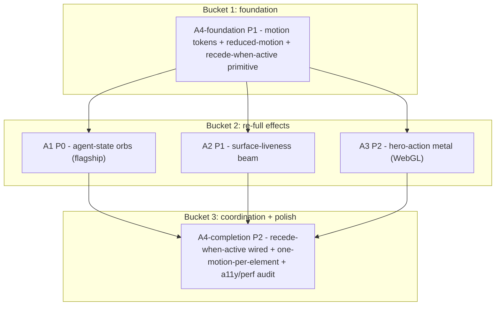

# Cross-Project Comparison: Nexus vs. thinking-orbs + border-beam + metal-fx + gigatoken

**Version**: v1.17.0
**Adoption target**: v1.17.0
**Generated**: 2026-07-23
**Analyzer**: Claude Code -- /compare command
**External Sources**:
- https://github.com/Jakubantalik/thinking-orbs (Repository) -- orbs.jakubantalik.com
- https://github.com/Jakubantalik/border-beam (Repository) -- beam.jakubantalik.com
- https://github.com/Jakubantalik/metal-fx (Repository) -- metal.jakubantalik.com
- https://github.com/marcelroed/gigatoken (Repository)
**Source Types**: Repository x4 (three React visual-effect libraries by one author; one Rust/Python tokenizer)
**Pre-ingest source-security verdict**: CLEAR (all four) -- see Section 5.0

> **Revision note (2026-07-23):** This report was revised after the maintainer confirmed the intent to reverse-engineer and use all three effect libraries throughout the Nexus UI to make the app modern and pleasant. metal-fx and border-beam were moved from rejected/conditional to adopted, organized around a semantic mapping (orbs = agent state, beam = surface liveness, metal = hero action). Two calibration decisions are locked in: metal-fx is used on hero actions only, and the ambient glow/constellation recedes when a surface has an active effect. gigatoken remains rejected on fit grounds.

---

## Section 1: Executive Summary

This report compares **Nexus** (this repo: a local-first desktop AI Studio, "Your Local AI Studio. Four Pillars, One Desktop, Zero Tokens Billed", formerly Gemma Code) against four external sources that arrived as a single social-post bundle. Three of them are small React visual-effect libraries by one author (Jakub Antalik), framed as making "vibe-coded projects look less generic": **thinking-orbs** (dotted thought-orb loading indicators purpose-built for AI/agent UIs), **border-beam** (animated traveling/breathing border glow), and **metal-fx** (WebGL liquid-metal ring on buttons/chips). The fourth, **gigatoken**, is an unrelated Rust/Python tokenizer claiming ~1000x faster-than-HuggingFace throughput with tiktoken- and HF-compatible APIs.

The bundle probes two distinct Nexus questions. The three effect libraries probe a **product-feel** question: how does Nexus's desktop shell (Tauri 2.x + React 19 + Tailwind v4) express agent activity and premium interaction, and can it feel unmistakably modern rather than generic? gigatoken probes a **performance** question: is tokenization a bottleneck worth accelerating? Both questions resolve against facts already in the repo. Nexus is not a blank shell: `desktop/src/styles/tokens.css` already ships a deliberate identity (forced-dark, a cyan/blue glow layer, a signature gradient, an animated constellation background, and four locked per-module accent colors). And Nexus's tokenization is not a throughput workload: its `tiktoken` dependency is the **JS/npm** package, used for **per-request** prompt-budget and compaction counting (`modules/coding/config/PromptBudget.ts`, `modules/coding/chat/CompactionStrategy.ts`), alongside a deliberately dependency-free `ceil(bytes/4)` estimator (`core/observability/TokenCost.ts`).

The analysis surfaces **4 adoption candidates** and **4 explicitly-rejected items**. The three effect libraries are adopted together and given one job each, so the result reads as an intentional system rather than a pile of effects: **orbs express agent state** (the agent is doing something), **the beam expresses surface liveness** (this surface is active), and **metal expresses a premium action** (this is a hero control). Concretely: thinking-orbs becomes an internal agent-state motion component (A1, flagship) mapped to Nexus's pillars and activities (coding = working/solving, memory/web/grep = searching, chat streaming = composing, ASR = listening, image/video = shaping); border-beam becomes an internal surface-liveness accent (A2) on the input composer (breathing on focus, traveling while streaming), the active-model dock, and the generation-canvas frame; metal-fx becomes an internal hero-action accent (A3) on the send button, the primary Generate button, and the New-session CTA, restrained to hero actions only. A cross-cutting motion-coordination-and-accessibility item (A4) wires the "recede when active" rule (the ambient glow steps back so only one motion competes per surface), keeps every effect on Nexus's locked accent tokens, enforces one primary motion per element, and hardens the whole layer for `prefers-reduced-motion`. gigatoken is rejected.

**Overall recommendation: adopt all three effect libraries by reverse-engineering their techniques, import no code, and reject gigatoken.** The three libraries are MIT, self-contained, and zero-outbound, so their techniques carry essentially no trust surface. Consistent with Nexus's reverse-engineer-first governance (AGENTS.md MCP Registry Policy, "import behaviors, not architecture"), reimplement each technique as an internal, on-brand component: do not add the npm packages as dependencies (N1), do not import their non-Nexus palettes (ocean/sunset/gold/silver/chromatic) (N3), and keep metal-fx to hero controls rather than a blanket treatment on every button and chip (N2). Do not adopt gigatoken: it is Python-only against a JS token-counting path, targets a bulk workload Nexus does not have, and has incomplete Windows testing against a Windows-first product with an OS-parity principle (N4/N5).

---

## Section 2: Project Profiles

| Attribute | Nexus (current) | thinking-orbs | border-beam | metal-fx | gigatoken |
|---|---|---|---|---|---|
| **Identity** | Local-first desktop AI Studio; "Four Pillars, One Desktop, Zero Tokens Billed" | "Dotted thought-orb loading indicators for AI & agent UIs" | "Animated border beam effect for React" | "Animated WebGL liquid-metal effect for React" | "~1000x faster than HuggingFace tokenizers, drop-in replacement" |
| **Kind of artifact** | A runtime product (agentic coding + chat + image + video) | A React UI component | A React UI component | A React UI component | A tokenizer library (Rust core + Python bindings) |
| **Purpose** | Run local open models across four pillars on one desktop | Show agent activity states as animated loaders | Add a traveling/breathing glow border to any element | Add a liquid-metal ring to buttons/chips | Tokenize text data at GB/s for LM pipelines |
| **Version / maturity** | v1.15 in flight; v1.16 planned (serving + OCR); ships as 2.x semantic-release | MIT; 830 stars; 8 commits | MIT; 1.3k stars; 36 commits | MIT; 323 stars; 29 commits | MIT; 2.1k stars; 358 commits |
| **License** | MIT | MIT | MIT | MIT | MIT |
| **Author / owner** | bendourthe (Nexus-AI) | Jakub Antalik | Jakub Antalik | Jakub Antalik | marcelroed |
| **Primary language** | TypeScript (+ Rust/Tauri shell, Python installer + diffusion sidecar) | TypeScript (React, Canvas 2D) | TypeScript (React 18+, CSS @property) | TypeScript (React, WebGL) | Rust (Python bindings via PyO3/ABI3) |
| **Platform** | Windows installer today; OS parity (macOS Intel + Apple Silicon, Linux x86_64) | Any browser (Canvas 2D) | Any browser (CSS/GPU) | Any browser with WebGL | Linux/macOS (x86 + ARM); Windows testing incomplete |
| **Network posture** | Local-first; no outbound runtime calls without opt-in | None (client-side canvas) | None (client-side CSS) | None (client-side WebGL) | Local; no telemetry (benchmark example pulls an HF dataset, user-initiated) |
| **Relevance to Nexus** | -- | High: purpose-built for agent UIs; becomes the agent-state layer (A1) | High: becomes the surface-liveness layer (A2) | Medium-High: becomes the hero-action layer (A3), restrained | Low: wrong runtime (Python vs JS) + wrong workload (per-request vs bulk) |

---

## Section 3: Capability and Architecture Comparison

### 3a. Nexus vs. the three effect libraries (domain: desktop-shell visual/motion identity)

| Aspect | Nexus (current) | External libraries | Delta |
|---|---|---|---|
| **Design-token system** | Yes: `desktop/src/styles/tokens.css` (forced-dark, four module accents, signature gradient, glow layer, radius/shadow/typography scales) consumed via Tailwind v4 `@theme inline` | Each library ships its own theme handling (auto/dark/light, its own palettes) | Nexus has a locked identity; each adopted effect consumes Nexus tokens rather than a foreign palette -> guardrail, not a blocker |
| **Ambient motion** | Yes: animated constellation background + radial-glow + signature gradient (v1.9.0 glow layer, ported from the north-star guide so app and installer match) | border-beam (traveling/breathing border), metal-fx (liquid-metal ring) | The ambient layer stays but recedes when a surface has an active effect (A4), so ambient and interaction motion do not compete |
| **Agent-state loading indicators** | Ad-hoc per surface (e.g. `LocalModelStatus`, status docks, panel spinners); no unified agent-activity motion vocabulary | thinking-orbs: six named states (working, searching, solving, listening, composing, shaping), two size presets (64px avatar, 20px inline), Canvas 2D, no deps | **Gap -> A1 (flagship):** a single agent-state motion system mapped to Nexus's pillars/activities |
| **Surface-liveness cues** | Focus/active states are mostly static (border/opacity); no animated "this surface is live" affordance during focus or streaming | border-beam: traveling beam + breathing pulse, play/pause with fade, auto border-radius fit | **Gap -> A2:** an animated liveness accent on the input composer, active-model dock, and generation canvas |
| **Premium action affordance** | Primary CTAs use the signature gradient/glow but no tactile, high-end motion | metal-fx: WebGL liquid-metal ring, proximity reflection, palettes | **Gap -> A3:** a hero-action metal accent (send, Generate, New session), restrained to hero controls |
| **Accessibility of motion** | Forced-dark; `prefers-reduced-motion` already honored in the current motion layer (globals.css, constellation, generation canvas, floating logo) | All three honor `prefers-reduced-motion`, light/dark adaptation, and offscreen pause (IntersectionObserver, DPR cap) | **Extend -> A4:** carry the existing reduced-motion posture onto the new A1/A2/A3 motion and audit for gaps |
| **Rendering surface** | Canvas/CSS via React 19 + Tailwind v4; dark-only | thinking-orbs: Canvas 2D (no WebGL); border-beam: CSS @property (GPU); metal-fx: WebGL context | Canvas 2D + CSS are cheap; WebGL (metal) is heavier, hence hero-actions-only + offscreen pause (A3/A4) |
| **Supply-chain posture** | Reverse-engineer-first; minimal runtime deps (lucide-react for icons; no effect libs) | Three npm packages from one third-party author | Reimplement techniques internally rather than add three deps -> N1 |

**Key contrast:** Nexus already ships an opinionated dark + cyan-glow + per-module-accent identity with ambient motion, but its *interaction* motion is thin: agent activity is signalled by ad-hoc loaders, focus/streaming surfaces are mostly static, and premium actions rely on gradient alone. The three libraries map cleanly onto those three thin layers, and giving each library one semantic job (orbs = agent state, beam = surface liveness, metal = hero action) is exactly what keeps a maximalist look coherent instead of noisy. The one coordination requirement is that the existing ambient glow recede when an interaction effect is active (A4), so the shell never stacks competing motion on a single surface.

### 3b. Nexus vs. gigatoken (adjacent domain: tokenization)

| Aspect | Nexus (current) | gigatoken (external) | Delta |
|---|---|---|---|
| **Tokenizer runtime** | JS/npm `tiktoken ^1.0.17` (Node), plus a dependency-free `ceil(bytes/4)` estimator (`TokenCost.ts`) | Rust core with **Python** bindings (PyO3/ABI3); `pip install gigatoken` | **No Node binding.** gigatoken cannot drop into Nexus's JS token-counting path |
| **Where tokenization runs** | Inline in the agent loop: prompt-budget and context-compaction counting per request (`PromptBudget.ts`, `CompactionStrategy.ts`, `PromptBuilder.ts`) | Bulk dataset preprocessing for LM training pipelines ("tokenize your text data at GB/s") | **Workload mismatch:** per-request KB-scale counting vs GB/s corpus throughput |
| **Throughput need** | Low: a single prompt's worth of text per turn; latency dominated by model inference, not tokenization | Extreme: 8-24 GB/s benchmarks on 11.9 GB OpenWebText | Nexus has no GB/s tokenization workload to accelerate |
| **API compatibility** | tiktoken (JS) | tiktoken-compatible AND HF-compatible **Python** APIs | Compatible only on the Python side, which Nexus does not use for token counting |
| **Platform** | Windows-first installer; OS parity (macOS Intel + Apple Silicon, Linux x86_64) | Linux/macOS x86 + ARM; **Windows testing incomplete**; no WordPiece, limited SentencePiece | Directly conflicts with Windows-first + OS-parity |
| **Correctness posture** | `ceil(bytes/4)` is a deliberate model-agnostic under-estimator ("correct within ~10%"); exact `tiktoken` used where fidelity matters | Exact BPE with compatibility modes | If Nexus ever needs exact Python-side counts, that is a niche, not the current path |

**Key contrast:** gigatoken is an excellent tool for the wrong shape of problem. Its entire value proposition is throughput on massive corpora during LM data preprocessing, delivered through a Python binding. Nexus tokenizes small per-request strings for context budgeting inside a TypeScript agent loop, where tokenization is already negligible next to local-model inference, and where the exact tokenizer in use is the JS `tiktoken` package that gigatoken does not target. Add the incomplete Windows support against a Windows-first product with an OS-parity principle, and the fit is absent.

---

## Section 4: Gap Analysis

### 4a. Present in External, Missing (or thin) in Nexus (adoption candidates)

**From thinking-orbs (agent-state motion, flagship):**
- **Unified agent-state "thinking" motion system (A1, flagship).** A single internal component that expresses agent activity as animated motion, mapped to Nexus's pillars and activities (coding = working/solving, memory/RAG and web/grep = searching, chat streaming = composing, ASR/whisper = listening, image/video generation = shaping), replacing today's ad-hoc per-surface loaders. Wired to the four module accents and the signature gradient; forced-dark and reduced-motion aware.

**From border-beam (surface liveness):**
- **Surface-liveness border accent (A2).** An internal traveling/breathing beam (CSS @property) that signals an active surface: a breathing beam around the input composer on focus, a traveling beam around it while the model streams, a subtle beam on the active-model dock, and a beam framing the generation canvas during an image/video render. Uses Nexus accent tokens; play/pause with fade; auto-fits border-radius.

**From metal-fx (premium hero action):**
- **Hero-action liquid-metal accent (A3).** An internal WebGL liquid-metal ring on the hero controls only: the send button, the primary Generate button (Image/Video), and the New-session CTA. Restrained to hero actions so it reads as premium rather than noisy; offscreen-paused and reduced-motion aware; driven by Nexus accent tokens, not metal-fx's gold/silver/chromatic palettes.

**Cross-cutting (from all three libraries' discipline + the coordination requirement):**
- **Motion coordination + accessibility (A4).** Wire the "recede when active" rule so the ambient constellation/glow steps back on a surface that has an active orb/beam/metal effect; enforce one primary motion per element; add the shared motion tokens the three effects consume; and extend the existing `prefers-reduced-motion` posture onto all new motion, with a final perf/battery pass for the WebGL metal.

### 4b. Present in Nexus, Missing in External (strengths to preserve)

- **A mature, locked visual identity.** Four module accents, a signature gradient, a glow layer, and an animated constellation background, shared verbatim between app and installer (the north-star guide). None of the external libraries offer a system; they offer effects. The adoption makes each effect serve the existing identity (Nexus tokens only) rather than overwrite it.
- **Reverse-engineer-first, minimal-dependency governance.** AGENTS.md's MCP Registry Policy and the "import behaviors, not architecture" norm keep the supply chain small (the shell's only UI dependency of note is lucide-react). The techniques are reimplemented internally rather than pulled in as three third-party packages.
- **The four-pillar product itself.** Nexus spans agentic coding + chat + image + video on a cross-OS Tauri shell with a local model registry, hybrid-retrieval memory, GPU-tier scheduler, SSRF guard, permission tiers, and golden-task eval. The external sources are single components or a single library with no counterpart to any of this.
- **A deliberate, dependency-free tokenization strategy.** `TokenCost.ts` is dependency-free on purpose, with exact `tiktoken` reserved for where fidelity matters. This is a considered design, not a gap gigatoken fills.

### 4c. Present in Both (quality comparison)

| Capability | Nexus | External | Who does it better |
|---|---|---|---|
| Ambient/background motion | Constellation + radial-glow + signature gradient | border-beam (borders), metal-fx (metal ring) | Nexus for ambient; the libraries add interaction motion (A2/A3) the ambient layer lacks |
| Agent-activity indication | Ad-hoc per-surface loaders | thinking-orbs (six named states) | thinking-orbs today -> A1 closes it internally |
| Surface-liveness / premium action cues | Mostly static focus/active + gradient CTAs | border-beam (liveness), metal-fx (tactile hero) | The libraries today -> A2/A3 close it internally |
| Motion accessibility (reduced-motion) | Already honored in the current layer | All three honor it by default | Comparable; A4 carries it onto the new motion |
| Token counting | JS tiktoken + `ceil(bytes/4)` estimator, per request | gigatoken (Python, bulk, exact) | Nexus for its actual workload; gigatoken for a workload Nexus does not have |

---

## Section 5: Security and Risk Assessment

*(MANDATORY. Section 5.0 is the pre-ingest source-security scan; Sections 5.1-5.2 are the post-ingest adoption risk assessment. Both reference the AGENTS.md MCP Registry Policy.)*

### 5.0 Pre-ingest source-security scan (Step 1.5)

All four sources were scanned before their content was used to shape any recommendation. Fetched README/repo content was treated as untrusted data; no instruction found in any page was followed.

| Check | thinking-orbs | border-beam | metal-fx | gigatoken |
|---|---|---|---|---|
| Prompt injection / agent-directed instructions in fetched content | None detected | None detected | None detected | None detected (an FAQ "try it without installing" line is user docs, not an agent directive) |
| Malicious / destructive code in the ingested surface | None (README is documentation) | None (README is documentation) | None (README is documentation) | None (README is documentation; build uses standard Cargo/uv with `Cargo.lock`/`uv.lock`) |
| Supply-chain provenance | MIT; single third-party author; 830 stars | MIT; single third-party author; 1.3k stars | MIT; single third-party author; 323 stars | MIT; 2.1k stars; discloses AI assistance in final stages, "majority hand-crafted" |
| Residual flag carried to adoption | Adding a third-party runtime dep for a decorative concern (N1) | Same (N1) | Same (N1); plus WebGL/perf cost -> hero-actions-only + offscreen pause (A3/A4, N2) | Python-only + Windows-incomplete + wrong workload (N4/N5) |

**Verdict: CLEAR (all four).** No ingested surface contains prompt-injection, agent-directed instructions, or destructive code, so ingestion proceeded. Every residual flag is an adoption-side fit/governance concern (carried into Sections 5.1-5.2 and the rejections N1-N5), not a reason to block ingestion.

### 5.1 Threat-model delta

| Dimension | Adoption delta |
|---|---|
| New runtime dependencies introduced | **Zero** under the recommended path (A1-A4 reverse-engineer the techniques into internal components; no npm/pip package is added). Taking the packages directly (rejected, N1) would add up to three third-party frontend deps. |
| Outbound destinations at runtime | **Zero.** All effects are client-side (Canvas/CSS/WebGL); no network. gigatoken is not adopted. |
| Credentials / API keys required | **Zero.** |
| Source / prompts / query text leaving the machine | **No.** Purely local rendering. |
| New inbound attack surface | **None.** These are render-only UI concerns; no new listener, route, or parser. |
| New client-side cost | A1/A2 add modest animation cost (Canvas 2D / CSS @property), mitigated by offscreen pause and reduced-motion. A3's WebGL is the main cost driver, mitigated by restricting metal to a few hero controls, pausing offscreen, and a reduced-motion static fallback. |

### 5.2 Per-item risk scorecard

| Item | Risk tier | Justification |
|---|---|---|
| A1 Agent-state motion (orbs, internal) | Low | Render-only, no network, no new deps. Main risk is visual/perf regression, mitigated by reduced-motion + offscreen pause and by matching the locked tokens. |
| A2 Surface-liveness beam (internal) | Low | CSS @property animation; risk is competing with the ambient glow, resolved by the A4 "recede when active" rule. |
| A3 Hero-action metal (internal, WebGL) | Low-Med | WebGL context cost + battery; mitigated by hero-actions-only scope (N2), offscreen pause, instance cap, and a static reduced-motion fallback. No security surface. |
| A4 Motion coordination + accessibility | None | Pure improvement (recede-when-active, one-motion-per-element, reduced-motion, motion tokens); no external code. |
| N1 Taking the three npm packages directly | Low-Med | Three third-party frontend deps for a decorative concern; supply-chain surface and palette-drift risk. Rejected in favor of internal reimplementation. |
| N4/N5 gigatoken | Low (but non-fit) | No security issue; a fit failure (Python vs JS runtime, per-request vs bulk workload, incomplete Windows support vs Windows-first + OS parity). Rejected. |

No item is High. The recommended set (A1-A4) is Low-or-None risk because it imports techniques, not code or services, and confines the one heavier surface (WebGL) to a few hero controls.

---

## Section 6: Reverse-Engineering Viability Analysis

*(MANDATORY. Classifies each candidate against the MCP Registry Policy decision tree: local-only / skill-native / reverse-engineer-into-internal / trusted-vendor-wrapper / drop. These sources are npm/pip libraries rather than MCP servers, so the "hard no" service categories do not apply; the reverse-engineer-first spirit governs whether to reimplement vs take the dependency.)*

| Item | Classification | Internal deliverable | Effort | Rationale |
|---|---|---|---|---|
| A1 Agent-state motion system (orbs) | `re-full` (bucket 3) | Internal `<AgentStateOrb>`-style component (Canvas 2D), states mapped to Nexus pillars/activities, wired to the four module accents + signature gradient, forced-dark + reduced-motion aware; replaces ad-hoc loaders | Medium | thinking-orbs's technique is small and well-understood; reimplementing on-brand avoids a dep, respects the locked palette, and lets Nexus own the state->activity mapping. |
| A2 Surface-liveness beam | `re-full` (bucket 3) | Internal traveling/breathing beam (CSS @property) on the input composer, active-model dock, and generation-canvas frame, using accent tokens | Low-Med | The CSS technique reimplements cleanly; the value is correct placement + the recede-when-active coordination. |
| A3 Hero-action metal | `re-full` (bucket 3) | Internal WebGL liquid-metal ring on send / Generate / New-session, Nexus tokens, offscreen pause, static reduced-motion fallback | Medium-High | WebGL shader work is the heaviest reimplementation; scope-limiting to hero controls keeps effort and runtime cost bounded. |
| A4 Motion coordination + accessibility | `skill-native` / internal | Shared motion tokens, the recede-when-active rule, one-motion-per-element enforcement, reduced-motion + perf audit | Low-Med | No external code; a discipline + token extension of the existing design-token layer. |
| gigatoken | `drop-outright` | -- | -- | Fit failure: Python-only vs JS token path, per-request vs bulk workload, Windows-incomplete vs Windows-first + OS parity (N4/N5). |

**Recommendation ordering (per MCP Registry Policy):**
1. **`skill-native` first:** A4 foundation (shared motion tokens + reduced-motion mechanism + recede-when-active primitive), which unblocks the effect work.
2. **`re-full` (internal builds):** A1 (agent-state orbs, the flagship by value), then A2 (surface-liveness beam), then A3 (hero-action metal).
3. **`vendor-intrinsic`:** none (no candidate has an intrinsic third-party destination to wrap).
4. **`drop-outright`:** gigatoken, and taking any of the packages as a direct dependency -> Section 9.

Priority tiers (P0-P3) operate within each bucket. By value, A1 is the flagship and leads the effect phasing below even though the A4 foundation ships first.

---

## Section 7: Adoption Plan

### Bucket 1 -- skill-native / internal foundation (ship first, unblocks the effects)

| What | Source | Target | Effort | Deps | Risk |
|---|---|---|---|---|---|
| **A4-foundation (P1)** Shared motion tokens + centralized `prefers-reduced-motion` + the recede-when-active primitive | All three libraries' defaults + the coordination requirement | `desktop/src/styles/tokens.css`, `globals.css`, the constellation/glow components | Low-Med | None | None |

### Bucket 2 -- re-full (build internal equivalents)

| What | Source | Target | Effort | Deps | Risk |
|---|---|---|---|---|---|
| **A1 (P0, flagship)** Agent-state motion system (orbs) | thinking-orbs (six-state Canvas 2D pattern) | Internal component + state->activity mapping across the four pillars; wired to module accents + signature gradient; replaces ad-hoc loaders | Medium | A4-foundation | Low |
| **A2 (P1)** Surface-liveness beam | border-beam (CSS @property beam) | Internal accent on input composer (focus breathing + streaming traveling), active-model dock, generation-canvas frame; accent tokens | Low-Med | A4-foundation | Low |
| **A3 (P2)** Hero-action metal | metal-fx (WebGL liquid-metal ring) | Internal accent on send / primary Generate / New-session only; Nexus tokens; offscreen pause; reduced-motion static fallback | Medium-High | A4-foundation | Low-Med |

### Bucket 3 -- coordination + polish (finishing pass)

| What | Source | Target | Effort | Deps | Risk |
|---|---|---|---|---|---|
| **A4-completion (P2)** Recede-when-active wired across surfaces + one-motion-per-element + final accessibility/perf audit | Coordination requirement | The shell surfaces adopting A1/A2/A3 + the ambient glow | Low-Med | A1, A2, A3 | Low |

---

## Section 8: Implementation Sequence

**Suggested phasing for the v1.17.0 cycle:**
1. **Phase A (P1):** A4-foundation. Motion tokens, a centralized reduced-motion mechanism, and the recede-when-active primitive. Cheap, unblocks every effect, and sets the coordination rule up front so no effect ships uncoordinated.
2. **Phase B (P0, flagship):** A1 agent-state orbs. Highest leverage; a distinctive, cohesive vocabulary for agent activity across all four pillars, replacing ad-hoc loaders.
3. **Phase C (P1):** A2 surface-liveness beam. The input composer, active-model dock, and generation canvas feel alive on focus/streaming/rendering.
4. **Phase D (P2):** A3 hero-action metal. Send, primary Generate, and New-session get a premium tactile ring; WebGL kept to these hero controls.
5. **Phase E (P2):** A4-completion. Wire recede-when-active across the adopting surfaces, enforce one primary motion per element, and run the final reduced-motion + battery/perf audit (especially for the WebGL metal).

This is a shell-only, moderate-risk UI-identity cycle placed as a standalone v1.17.0 because v1.15 (in flight) and v1.16 (serving + OCR, fully planned) are committed to other themes.

---

## Section 9: Risks and Explicit Rejections

**General considerations:**
- **Import behaviors, not architecture.** Every adopted item is reimplemented as an internal Nexus component wired to the existing design tokens. Do not add thinking-orbs, border-beam, or metal-fx as npm dependencies.
- **One effect, one meaning.** Orbs signal agent state, the beam signals surface liveness, metal signals a hero action. Keeping the semantic split is what lets all three coexist without looking chaotic.
- **Serve the existing identity.** Every adopted effect consumes Nexus tokens (the four module accents + the signature gradient); do not import the libraries' own palettes.
- **Coordinate the motion.** The ambient constellation/glow recedes on a surface with an active effect, and no element runs two primary motions at once. More motion is not more identity.
- **Respect reduced-motion and dark-only.** The shell is forced-dark; adopted effects must not assume a light theme and must degrade under `prefers-reduced-motion` (A4 makes this a precondition), including a static fallback for the WebGL metal.

### Items explicitly NOT recommended for adoption

- **N1 -- Taking thinking-orbs / border-beam / metal-fx as direct npm dependencies.** Three third-party frontend packages from a single author cut against Nexus's reverse-engineer-first, minimal-dependency governance and risk palette/token drift from the locked identity. Adopt the techniques internally (A1-A3). **Rejected** (governance + supply chain).
- **N2 -- metal-fx as a blanket treatment on every button and chip.** A per-instance WebGL context carries real battery/perf cost and, used everywhere, dilutes the "premium" signal into noise. Metal is adopted but confined to hero controls (send, primary Generate, New session). **Rejected as a blanket treatment**; accepted for hero actions (A3).
- **N3 -- Importing the libraries' non-Nexus palettes.** ocean/sunset (border-beam) and gold/silver/chromatic (metal-fx) conflict with the locked per-module accent palette and the signature gradient. Any adopted effect uses Nexus accent tokens only. **Rejected** (identity).
- **N4 -- gigatoken as a tiktoken replacement in Nexus's token-counting path.** gigatoken is Python-only (no Node binding) while Nexus counts tokens with the JS `tiktoken` package inline in a TypeScript agent loop; its GB/s throughput targets a bulk dataset workload Nexus does not have; and its Windows testing is incomplete against a Windows-first product with an OS-parity principle. **Rejected** (runtime + workload + platform mismatch).
- **N5 -- gigatoken for a hypothetical Python-side bulk-tokenization workload.** No such GB/s workload exists in Nexus today (the Python side runs diffusion/ASR/TTS, not corpus tokenization). Revisit only if a genuine Python-side bulk-tokenization need emerges AND gigatoken's Windows/ARM support matures. **Rejected for now** (no workload); recorded as a watch item.

---

## Appendix: Source Facts (as fetched 2026-07-23)

**thinking-orbs (`Jakubantalik/thinking-orbs`, orbs.jakubantalik.com):** MIT; TypeScript React component; HTML5 Canvas 2D (no WebGL); six animated states (working, searching, solving, listening, composing, shaping); two size presets (64px avatar, 20px inline); automatic light/dark detection (MutationObserver); `prefers-reduced-motion` support; offscreen pause via IntersectionObserver; device-pixel-ratio capped at 2; `npm install thinking-orbs`, `import { ThinkingOrb }`; no runtime dependencies, no telemetry; 830 stars, 58 forks, 8 commits.

**border-beam (`Jakubantalik/border-beam`, beam.jakubantalik.com):** MIT; TypeScript React 18+ component; CSS with `@property`, GPU-accelerated, `requestAnimationFrame` for pulse; two animation families (Rotate traveling beam, Pulse breathing glow); size presets (sm, md, line, pulse-inner, pulse-outside); four color variants (colorful, mono, ocean, sunset); theme dark/light/auto; strength 0-1; play/pause with fade; auto-detects border-radius; Vite build; `npm install border-beam`; self-contained, no telemetry; 1.3k stars, 74 forks, 36 commits.

**metal-fx (`Jakubantalik/metal-fx`, metal.jakubantalik.com):** MIT; TypeScript React component; WebGL; "liquid metal" ring for buttons/chips/icons with optional proximity reflection on neighbours; variants (button, circle); palettes (chromatic, silver, gold); theme auto/dark/light; strength/opacity; paused state; custom border radius; uses IntersectionObserver, ResizeObserver, requestAnimationFrame, matchMedia; Vite + Biome; `npm install metal-fx`, `import { MetalFx }`; no telemetry; 323 stars, 21 forks, 29 commits.

**gigatoken (`marcelroed/gigatoken`):** MIT; Rust core with Python bindings (PyO3/ABI3); "~1000x faster than HuggingFace tokenizers, drop-in replacement"; compatibility modes for HuggingFace Tokenizers and Tiktoken APIs plus a native API; BPE + SentencePiece-family; SIMD pretokenization (AVX512/AVX2/NEON), multithreading, pretoken caching; supports GPT-2, Phi-4, Qwen, Llama 3/4, DeepSeek, GLM, Nemotron, Gemma, and 30+; benchmarks 24.53 GB/s (GPT-2 on EPYC, 989x vs HF) and 8.79 GB/s (M4 Max, 1268x vs HF) on 11.9 GB OpenWebText; unsupported: WordPiece, limited SentencePiece, Windows testing incomplete; `pip install gigatoken`; standard Cargo/uv tooling with lockfiles; no telemetry; discloses AI assistance in the final stages with "majority hand-crafted"; 2.1k stars, 77 forks, 358 commits.
