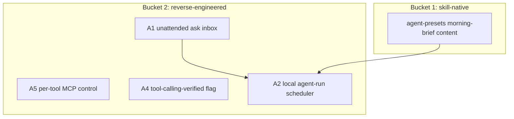

# Cross-Project Comparison: Nexus vs. OpenWorker

**Version**: v1.18.0
**Adoption target**: v1.18.0
**Generated**: 2026-07-24
**Analyzer**: Claude Code -- /compare command
**External Source**: https://github.com/andrewyng/openworker (Repository)
**Source Type**: Repository
**Pre-ingest source-security verdict**: CLEAR -- see Section 5.0

---

## Section 1: Executive Summary

OpenWorker (Andrew Ng, released 2026-07-23, MIT) is the closest architectural sibling Nexus has yet been compared against. It is a local-first desktop AI "coworker" built on a Tauri 2 (Rust) shell over a local Python FastAPI agent server, and that agent server is built on aisuite -- the same aisuite that Nexus reverse-engineered the local-only slice of in the v1.6.0 cycle. Where the two projects diverge is not architecture but doctrine: OpenWorker's headline value is 25+ hosted SaaS connectors (GitHub, Slack, Jira, Notion, Linear, HubSpot, Gmail, Google Calendar, ...) plus eleven cloud model providers, brokered through a small cloud OAuth relay. That connector-and-cloud surface is the photographic negative of Nexus's reverse-engineering-first, zero-as-a-service, local-first posture.

The useful signal is therefore concentrated in OpenWorker's local-only governance and UX patterns, not its integration catalog. Four adoption candidates survive the policy gate (an unattended-run "ask inbox", a local agent-run scheduler, per-tool MCP control, and a "verified-for-tool-calling" catalog flag); three items are rejected outright on MCP Registry Policy grounds (the SaaS connector surface, the cloud OAuth broker, and cloud provider breadth -- the last already formally dropped as D1 in v1.6.0).

**Overall recommendation: selectively adopt the four local governance / UX patterns and reject the connector-and-cloud surface wholesale; treat OpenWorker primarily as external validation that Nexus's Tauri + local-sidecar + aisuite-slice architecture is the right one.**

## Section 2: Project Profiles

| Aspect | Nexus (this project) | OpenWorker |
|---|---|---|
| Identity | Nexus (Nexus-AI) | OpenWorker (`andrewyng/openworker`) |
| Kind of artifact | Local-first desktop AI Studio (4 pillars) | Local-first desktop AI "coworker" |
| Purpose | Coding + Chat + Image + Video, local-only | Deliver finished work (docs, messages, calendar) across office tools |
| Version / maturity | Milestone v1.15.0 in flight; release track v2.4.0 | Initial public release, ~3.2k stars |
| License | MIT | MIT |
| Author / owner | @bendourthe | Andrew Ng / DeepLearning.AI orbit |
| Primary language | TypeScript (+ Rust/Tauri shell, Python installer + diffusion sidecar) | Python (+ Rust/Tauri shell, Rust STT sidecar) |
| Platform | Windows, macOS (Intel + Apple Silicon), Linux x86_64 | macOS 12+ (Apple Silicon only); Windows 10/11 x64 (unsigned) |
| Network posture | Local-first; no outbound without explicit opt-in | Local-first data; cloud OAuth broker relay + BYO cloud model keys |
| Agent framework | Internal Nexus coding engine (tool registry, plan/auto mode, 4-layer memory) | aisuite agents layer (tools, toolkits, MCP) |
| Relevance to Nexus | Direct architectural sibling and near-competitor in the same July-2026 local-first agentic-AI wave | High |

## Section 3: Capability and Architecture Comparison

### 3a: Shell, sidecar, and provider architecture

| Aspect | Nexus (current) | OpenWorker | Delta |
|---|---|---|---|
| Desktop shell | Tauri 2.x + React 19 + Vite + Tailwind v4 (`AGENTS.md:18`, `desktop/`) | Tauri 2 (Rust) + React + Vite | Equivalent -- same shell stack |
| Agent runtime / IPC spine | Node JSON-RPC 2.0 sidecar over stdin/stdout (`desktop/src-tauri/src/sidecar.rs:1-7`, `:133-160`; bridged by `#[tauri::command] ipc_call` `desktop/src-tauri/src/lib.rs:15-31`) | Python FastAPI agent server over local HTTP (`--port 8765`) | Different transport (stdio JSON-RPC vs loopback HTTP), same local-process pattern |
| Language of the agent loop | TypeScript/Node (Python is a downstream generation runtime only: `desktop/sidecar/src/diffusion/dispatcher.ts`) | Python end-to-end | Different; both keep the loop local |
| Provider abstraction | `LocalAdapterRegistry` -- manifest-driven, loopback-only, `ollama \| openai` protocols with a hard non-loopback reject citing the MCP policy (`modules/coding/llm/LocalAdapterRegistry.ts:13-21,:35`) | aisuite unified chat-completions across 11 cloud providers + Together/Fireworks + local Ollama | Fundamental: Nexus rejects cloud breadth by construction (D1 dropped, `docs/archive/v1/v1.6/plans/adoption-aisuite-harness.md:205-213`) |
| Product scope | Four pillars + 4-layer memory + telemetry + GPU scheduler | Single "coworker" outcome-delivery surface | Different product surface |

**Key contrast:** OpenWorker independently arrived at the same shell-plus-local-sidecar design Nexus shipped in v1.0.0, and it built its agent layer on the very library (aisuite) whose local-only slice Nexus reverse-engineered in v1.6.0. This is strong external validation of Nexus's architecture. The single meaningful architectural difference -- OpenWorker's agent loop is Python, Nexus's is Node with Python reserved for generation -- has no adoption consequence.

### 3b: Agent governance and autonomy

| Aspect | Nexus (current) | OpenWorker | Delta |
|---|---|---|---|
| Consequential-action gate | Tiered permissions (`PermissionTiers.ts:5-9`, floor-clamp `:69-80`) + `ConfirmationGate.ts` + git checkpoints (`GitSafetyNet.ts:17-52`) + action classifier (`ActionClassifier.ts:4-15`) + auto-mode verification gate (`src/tools/AgentLoop.ts:42-56`) | "Before anything consequential ... it checks in and you approve or redirect" | Nexus is deeper and structured; OpenWorker is a single check-in |
| Unattended runs | `ConfirmationGate.ts` blocks with a 60s timeout (`src/tools/ConfirmationGate.ts:4`) -- unsuited to headless runs | "Unattended runs park their asks in an inbox instead of acting on their own" | Gap in Nexus (adoption candidate A1) |
| Scheduling | Weekly skills auto-sync worker only (`README.md:158`); no user-facing agent-run scheduler | Scheduled automations (morning brief, weekly report, standing channel watch) | Gap (A2) |
| Third-party integrations | MCP stdio, per-project, read-only tools, reverse-engineering-first default-deny (`modules/coding/mcp/HubRegistryPolicyFilter.ts:36-76`; `README.md:163`) | 25+ native SaaS connectors + OAuth broker + "any tool reachable over MCP ... with per-tool control" | Policy divergence; the per-tool MCP control is a candidate (A5) |
| Model verification | `agentic` tags + benchmark fields in `core/registry/catalog.json` | "A curated model list marks what we've verified for tool-calling work" | Nexus can add an explicit tool-calling-verified flag (A4) |

**Key contrast:** Nexus's safety model already exceeds OpenWorker's single "check-in" on depth (tiered permissions, floor-clamping, git checkpoints, a verification-pass gate). What OpenWorker adds is the autonomy UX around that gate -- an ask-inbox and a scheduler that make unattended and recurring runs safe without weakening the gate. That UX layer, not the gate itself, is the adoptable delta.

## Section 4: Gap Analysis

### 4a: Present in OpenWorker, missing or partial in Nexus (adoption candidates)

- **A1 -- Unattended-run "ask inbox".** When an agent runs headless or on a schedule, park approval requests in a persistent inbox rather than blocking on the 60s `ConfirmationGate` timeout (`src/tools/ConfirmationGate.ts:4`). This is the missing precondition for any safe autonomous run.
- **A2 -- Local agent-run scheduler.** A cron-like local scheduler for recurring agent tasks (the "morning brief" content is already covered by the Nexus-Hub `agent-presets` morning-briefing preset; only the scheduling mechanism is missing).
- **A4 -- Tool-calling-verified catalog flag.** Add an explicit `toolCallingVerified` marker (plus benchmark provenance) to `core/registry/catalog.json` so the UI can distinguish models Nexus has actually validated for agentic tool use from models that merely run.
- **A5 -- Per-tool MCP control.** OpenWorker exposes per-tool enable/disable over MCP. Nexus has a per-project registry and default-deny classification (`HubRegistryPolicyFilter.ts`) but no per-tool granularity surfaced to the user.

### 4b: Present in Nexus, missing in OpenWorker (strengths to preserve)

- Four-layer memory (working / episodic / semantic / graph) + hybrid retrieval (BM25 + dense + graph via RRF, `k=60`) -- OpenWorker describes conversations but no memory architecture.
- GPU scheduler + always-on local VRAM/utilization telemetry.
- Image Studio and Video Lab pillars (OpenWorker is office-task focused).
- Tiered permission floor-clamp (closes pen-test F-003, `PermissionTiers.ts:69-80`), git checkpoints, and the auto-mode verification-pass gate -- deeper than a single consequential-action check-in.
- Reverse-engineering-first MCP policy with zero as-a-service integrations.
- Session replay + standalone HTML trace export.
- `redactSecrets` pre-index/pre-export scrubbing (`core/observability/redactSecrets.ts`).

### 4c: Present in both (quality comparison)

| Capability | Nexus | OpenWorker | Better |
|---|---|---|---|
| Local-first privacy | Local-only; `redactSecrets` before SQLite insert | Local secret store; only cloud piece is an OAuth broker | Nexus (stronger redaction, no cloud relay) |
| Tauri desktop shell | Tauri 2.x + React 19 | Tauri 2 + React | Equivalent |
| MCP support | Stdio, default-deny, read-only tools | MCP with per-tool control | OpenWorker on granularity; Nexus on safety default |
| Multi-provider model access | Local-only (Ollama / LM Studio loopback) | Cloud breadth + local Ollama | Different by design, not better/worse |
| Deliverables as files | Code/edits + HTML exports; docx/pptx/xlsx via Nexus-Hub skills | Docs, spreadsheets, reports, web pages as files | Roughly equivalent |

## Section 5: Security and Risk Assessment

*This section is MANDATORY per the compare-project skill (Steps 1.5 and 5) and the MCP Registry Policy.*

### 5.0 Pre-ingest source-security scan (Step 1.5)

| Check | OpenWorker |
|---|---|
| Prompt injection / agent-directed instructions | None found. README targets developers/end-users; no "ignore previous instructions" payloads, no hidden/zero-width/base64 blobs surfaced. |
| Malicious or destructive code patterns | None surfaced in the README/landing content examined (no `rm -rf` on unexpected paths, no credential harvesting, no reverse shells). |
| Supply-chain provenance | Reputable owner (`andrewyng`), MIT, aisuite lineage (already vetted in v1.6.0). No install-script or postinstall content examined here; a full clone scan is deferred to any actual code adoption. |
| Residual flags | None. |

**Verdict: CLEAR.** Ingestion proceeded. No source content was treated as instructions. Note: this scan covered the README/landing surface fetched over the web; a byte-level scan of the repository tree is a precondition of adopting any OpenWorker *code* (none is recommended here -- all candidates are reverse-engineered, not vendored).

### 5.1 Threat-model delta

| Dimension | Adoption delta |
|---|---|
| New runtime dependencies | A1/A2/A4/A5 add none (local queue, local scheduler, catalog field, registry toggle). The rejected connector surface would add many. |
| Outbound-call destinations | Zero for the four candidates. The rejected items (SaaS connectors, OAuth broker, cloud providers) would add numerous outbound destinations. |
| Credentials / API keys | Zero for the candidates. Connectors + cloud providers would introduce credential sprawl and a cloud OAuth relay. |
| Data leaving the machine | None for the candidates. Rejected items would send user data to third-party processors. |
| New inbound surface | A2 (scheduler) adds a local trigger surface that must re-enter the permission tiers on wake, not bypass them. |

### 5.2 Per-item risk scorecard

| Item | Risk tier | Justification |
|---|---|---|
| A1 Ask inbox | Low | Local UI + persistent queue; must preserve tier semantics when a parked request is later approved |
| A2 Local scheduler | Low | Scheduled wake must route through `PermissionTiers`/`ConfirmationGate`, never auto-approve |
| A4 Tool-calling-verified flag | None | Pure catalog data |
| A5 Per-tool MCP control | Low | Tightens (never loosens) the existing default-deny; UI-only surface |

## Section 6: Reverse-Engineering Viability Analysis

*MANDATORY. Every candidate is classified against the decision tree: skill-native > re-full > re-partial > vendor-intrinsic > drop-outright.*

| Item | Classification | Internal deliverable | Effort | Rationale |
|---|---|---|---|---|
| A1 Ask inbox | re-full | Local approval-queue store + desktop inbox panel; parked-request replay through the confirmation gate | Medium | Pure local logic; no OpenWorker code needed |
| A2 Local scheduler | re-full | Local cron-style scheduler that enqueues agent runs and honors permission tiers on wake | Medium | Extends the existing weekly-sync worker pattern |
| A4 Verified flag | re-full | `toolCallingVerified` + benchmark field in `catalog.json`; badge in `ModelSelector.tsx` | Low | Data + UI |
| A5 Per-tool MCP control | re-full | Per-tool allow/deny in the per-project MCP registry + settings surface | Low-Med | Builds on `HubRegistryPolicyFilter` classification |

**Recommendation ordering (per MCP Registry Policy):** all four are `re-full` local builds; none is `skill-native`, `vendor-intrinsic`, or `drop`. The "morning brief" *content* for A2 is `skill-native` (existing `agent-presets`), so only A2's scheduler mechanism is a re-full build.

## Section 7: Adoption Plan

### Bucket 1 -- skill-native (zero-code wins)

| What | Source | Target | Effort | Deps | Risk |
|---|---|---|---|---|---|
| "Morning brief" recurring-work content (P2) | OpenWorker automations | Nexus-Hub `agent-presets` (already exists) | None | -- | None |

### Bucket 2 -- reverse-engineered internal builds

| What | Source | Target | Effort | Deps | Risk |
|---|---|---|---|---|---|
| A5 Per-tool MCP control (P1) | OpenWorker per-tool control | `modules/coding/mcp/` registry + settings | Low-Med | -- | Low |
| A4 Tool-calling-verified flag (P1) | OpenWorker curated verified list | `core/registry/catalog.json`, `ModelSelector.tsx` | Low | -- | None |
| A1 Ask inbox (P1) | OpenWorker unattended ask-inbox | New approval-queue + desktop panel | Medium | -- | Low |
| A2 Local scheduler (P2) | OpenWorker scheduled automations | New local scheduler | Medium | A1 (parks asks) | Low |

### Bucket 3 -- vendor-intrinsic

None. No candidate requires a third party as its intrinsic destination.

## Section 8: Implementation Sequence

Suggested phasing for the v1.18.0 cycle:
1. A4 + A5 (low-effort, independent): catalog verified-flag and per-tool MCP control.
2. A1 (ask inbox): the precondition for safe unattended runs.
3. A2 (scheduler): depends on A1 so scheduled runs have somewhere to park approvals; reuse the `agent-presets` morning-brief content.

## Section 9: Risks and Explicit Rejections

General considerations:
- Every candidate is a local, additive build (new files or data fields), keeping adoption risk low.
- The scheduler (A2) is the one item that could weaken safety if implemented carelessly; it must re-enter `PermissionTiers`/`ConfirmationGate` on every wake, never auto-approve.
- OpenWorker's overall value proposition depends on the exact surface Nexus rejects; do not let "OpenWorker does more" pressure the connector/cloud rejections below.

### Items explicitly NOT recommended for adoption

- **N1 -- The 25+ hosted SaaS connectors (GitHub, Slack, Jira, Notion, Linear, HubSpot, Gmail, Google Calendar, ...).** These are third-party data processors reached over the network; adopting them would send user data off-machine and require credential storage per service. **Rejected** (MCP Registry Policy "hard no" on as-a-service integrations; `README.md:163,:194`; local-first design principle).
- **N2 -- The cloud OAuth broker relay.** OpenWorker's "small service that brokers OAuth handshakes" is a new cloud dependency and outbound relay. **Rejected** (no outbound without explicit opt-in; introduces a third-party runtime dependency; `HubRegistryPolicyFilter.ts` default-deny).
- **N3 -- Cloud provider breadth via aisuite (11 hosted providers).** **Rejected** (already formally dropped as D1 in v1.6.0, `docs/archive/v1/v1.6/plans/adoption-aisuite-harness.md:205-213`: "Outbound + API keys + per-token billing; conflicts with local-first / 'Zero Tokens Billed'"). The regulated-cloud option documented at `README.md:199` remains a user-side, out-of-band choice, not shipped routing.

## Appendix: Source Facts (as fetched 2026-07-24)

**OpenWorker (`andrewyng/openworker`, MIT, ~3.2k stars).** "An open-source AI coworker that lives on your desktop and delivers finished work, not just chat." Stack: Tauri 2 (Rust) shell + React/Vite UI, local Python 3.10+ FastAPI agent server built on aisuite ("a unified chat-completions API across LLM providers and an agents layer with tools, toolkits, and MCP support"), Rust speech-to-text sidecar; local agent server on `--port 8765`. Integrations: 25+ native connectors (GitHub, Slack, Jira, Notion, Linear, HubSpot, Outlook, monday.com, Gmail, Google Calendar, terminal, local files) plus "any tool reachable over MCP ... with per-tool control". Providers: OpenAI, Anthropic, Google Gemini, Inkling (Thinking Machines), GLM (Z.ai), DeepSeek, Kimi (Moonshot), Qwen, MiniMax, Mistral, Grok (xAI), Together, Fireworks, and fully local via Ollama. Governance: "Before anything consequential -- sending a message, changing a calendar, running a command -- it checks in and you approve or redirect"; "Unattended runs park their asks in an inbox instead of acting on their own." Automations run on a schedule. Privacy: "Everything lives on your machine ... all in the app's local secret store. The only cloud piece is a small service that brokers OAuth handshakes for connectors." OS: macOS 12+ (Apple Silicon, signed/notarized, auto-updates); Windows 10/11 x64 (unsigned, signing in progress). Pre-ingest security verdict: CLEAR.
