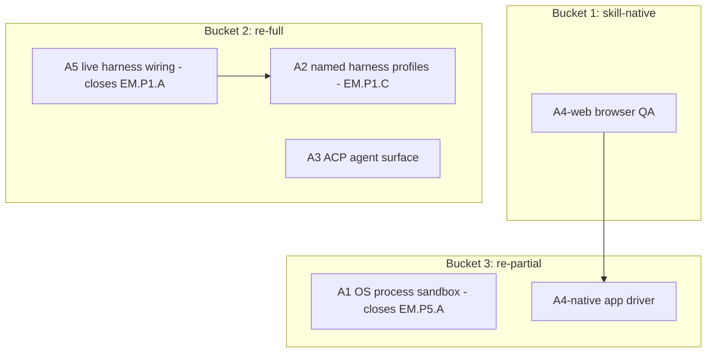

# Cross-Project Comparison: Nexus vs. Open Interpreter

**Version**: v1.18.1
**Adoption target**: v1.18.0
**Generated**: 2026-07-24
**Analyzer**: Claude Code -- /compare command
**External Source**: https://github.com/openinterpreter/openinterpreter (Repository)
**Source Type**: Repository
**Pre-ingest source-security verdict**: CLEAR -- see Section 5.0

---

## Section 1: Executive Summary

Open Interpreter has been rewritten as a Rust fork of OpenAI's Codex "with a focus on emulating the agent harness that gets the best performance out of low-cost models" (Apache-2.0, 67.2k stars). Its central thesis -- swap the *agent harness* per model to extract maximum performance from cheap open models -- is precisely the thesis Nexus reverse-engineered in the v1.12.0 cycle as the per-model `HarnessSelector` (which the v1.12 plan explicitly attributes to "the Open Interpreter / Codex-fork thesis", `docs/archive/v1/v1.12/plans/adoption-ecosystem-2026-07.md:8`). Of the three sources in this comparison, Open Interpreter is the highest-value because it is a mature reference implementation of work Nexus has already started but left gated.

Two things stand out. First, Open Interpreter ships ten concrete, named harnesses (`native`, `claude-code`, `kimi-code`, `qwen-code`, `deepseek-tui`, `swe-agent`, `minimal`, ...) selectable via `/harness` -- exactly the "deeper scaffold knobs not modeled" that Nexus deferred in EM.P1.C. Second, it "runs commands inside native sandboxing on macOS, Linux, and Windows" -- the OS-level process sandbox that Nexus documents as its single most important open gap (EM.P5.A, `docs/archive/v1/v1.12/known-gaps.md:47`). Five adoption candidates emerge; the flagship two close named Nexus gaps.

**Overall recommendation: adopt aggressively but by reverse-engineering, not vendoring. Wire the existing harness overlay into the live prompt path (closes EM.P1.A), import concrete harness profiles as internal data (fleshes out EM.P1.C), and use Open Interpreter as the Apache-2.0 design reference for the OS-level sandbox (closes EM.P5.A). Reject wholesale code vendoring and the cloud-provider catalog.**

## Section 2: Project Profiles

| Aspect | Nexus (this project) | Open Interpreter |
|---|---|---|
| Identity | Nexus (Nexus-AI) | Open Interpreter (`openinterpreter/openinterpreter`) |
| Kind of artifact | Local-first desktop AI Studio (4 pillars) | Terminal/TUI coding agent (Codex fork) |
| Purpose | Coding + Chat + Image + Video, local-only | Per-model agent harness emulation for low-cost models |
| Version / maturity | Milestone v1.15.0 in flight; release track v2.4.0 | Mature, ~67.2k stars, 400+ contributors lineage |
| License | MIT | Apache-2.0 |
| Author / owner | @bendourthe | Open Interpreter org (Codex fork) |
| Primary language | TypeScript (+ Rust/Tauri shell, Python installer + diffusion sidecar) | Rust (`codex-rs` lineage) |
| Platform | Windows, macOS (Intel + Apple Silicon), Linux x86_64 | macOS, Linux, Windows |
| Network posture | Local-first; no outbound without opt-in | Any provider/model (cloud or local), local session state under `~/.openinterpreter` |
| Relevance to Nexus | Reference implementation of Nexus's own v1.12 harness thesis; demonstrates the sandbox Nexus lacks | Very high |

## Section 3: Capability and Architecture Comparison

### 3a: Harness and provider model

| Aspect | Nexus (current) | Open Interpreter | Delta |
|---|---|---|---|
| Per-model harness | `HarnessSelector` derives weak/mid/strong from catalog `vramGb`/`tags`, applies a `HarnessProfile` overlay with safe fallback (`modules/coding/orchestration/HarnessSelector.ts`); golden A/B in `HarnessSelectorAb.ts` | Ten named harnesses (`native`, `claude-code`, `kimi-code`, `qwen-code`, `deepseek-tui`, `swe-agent`, `minimal`, ...) selectable via `/harness` | Both do per-model harnessing; Open Interpreter has a richer *named* catalog vs Nexus's tier-derivation |
| Live wiring | Overlay is NOT yet spread into a live `PromptContext`; ships opt-in and off (`HARNESS_SELECTOR_SHIPPED_DEFAULT = false`; EM.P1.A/B, `docs/archive/v1/v1.12/known-gaps.md:14-15`) | Harnesses are live and switchable at runtime | Gap: Nexus built the mechanism but has not connected it (A5) |
| Provider switching | `LocalAdapterRegistry` loopback-only (`ollama \| openai`), `ModelSelector.tsx`; hard non-loopback reject (`LocalAdapterRegistry.ts:13-21`) | `/model` + dynamically generated provider catalog (`scripts/write_provider_catalog.py`) | Both dynamic; Nexus local-only by construction, Open Interpreter any provider |
| Command execution | `run_terminal` via `spawn(shell:true)` at user privilege; guarded by confirmation + touched-path/secret-path denylists + env scrub; NO OS-level confinement (EM.P5.A, `docs/archive/v1/v1.12/known-gaps.md:47`) | "Runs commands inside native sandboxing on macOS, Linux, and Windows" | Gap: Open Interpreter has the OS-level sandbox Nexus documents as missing (A1) |

**Key contrast:** Nexus and Open Interpreter converge on the same idea (harness-per-model), reached from opposite directions -- Open Interpreter as a Codex fork optimizing for cheap models, Nexus as a local-first studio optimizing for the same. Open Interpreter is simply further along on two axes Nexus explicitly parked: live harness switching and OS-level sandboxing.

### 3b: Interop, sandboxing, and computer-use

| Aspect | Nexus (current) | Open Interpreter | Delta |
|---|---|---|---|
| Editor interop protocol | None; VS Code adapter proxies to the desktop daemon | Runs as an Agent Client Protocol agent (`interpreter acp`); "speaks the same Codex exec protocol"; drop-in via `codexPathOverride: "interpreter"` | Gap: a standard interop surface (A3), adjacent to the v1.16 serving-gateway candidate |
| Computer-use / GUI QA | No agent computer-use; a `browser-testing-with-devtools` skill exists in the Nexus-Hub catalog | "Ships with a QA skill that lets any model operate and test interfaces" -- web via `agent-browser`, native apps via `trycua` | Partial gap (A4) |
| Named scaffold recipes | EM.P1.C notes "deeper scaffold knobs not modeled"; H2 guidance is an in-repo doc (`docs/reference/low-cost-model-optimization.md`) | Concrete recipes per provider (claude-code / kimi-code / qwen-code / deepseek-tui / swe-agent) | Gap: importable profile data (A2) |
| OS-level confinement | Absent by design decision, documented (EM.P5.A; `docs/archive/v1/v1.12/exec-sandbox-audit.md`) | Native per-OS sandbox | Gap (A1, flagship) |

**Key contrast:** Open Interpreter treats the harness as a first-class, inspectable, hot-switchable object (`/harness`) and pairs it with real OS confinement. Nexus has the harness *data model* but neither the live switch nor the sandbox. Open Interpreter is the closest available blueprint for both.

## Section 4: Gap Analysis

### 4a: Present in Open Interpreter, missing or partial in Nexus (adoption candidates)

- **A1 -- OS-level process sandbox for `run_terminal` (flagship).** Open Interpreter runs commands in native sandboxing across all three OSes. This is the exact capability Nexus lists as its top open gap (Seatbelt / Landlock / seccomp / job object; EM.P5.A, `docs/archive/v1/v1.12/known-gaps.md:47`, `docs/archive/v1/v1.12/exec-sandbox-audit.md`).
- **A2 -- Named per-model harness profiles.** Port Open Interpreter's concrete harness recipes (kimi-code, qwen-code, deepseek-tui, swe-agent, minimal) into `HarnessProfile` data, fleshing out the deeper scaffold knobs deferred in EM.P1.C (`docs/archive/v1/v1.12/known-gaps.md:16`).
- **A3 -- Agent Client Protocol (ACP) agent surface.** Expose the Nexus coding engine as an ACP agent so external editors can drive it (and Codex-SDK clients can point at it). Adjacent to the v1.16 candidate A1 (an OpenAI/Anthropic-compatible serving gateway) -- see the overlap note in Section 9.
- **A4 -- Computer-use / GUI QA skill.** Let a model operate and test real interfaces (web + native). The browser half is largely covered by the existing `browser-testing-with-devtools` Nexus-Hub skill; the native-app half is net-new.
- **A5 -- Live `/harness` wiring + introspection UX.** Spread `overlayForModel()` into the live `PromptContext` at `ToolActivationContext.buildPromptContext`, gated on `settings.harnessSelectorEnabled`, and surface a `/harness`-style inspect/switch. This IS EM.P1.A (`docs/archive/v1/v1.12/known-gaps.md:14`) -- the single change that turns Nexus's built-but-dormant harness selector on.

### 4b: Present in Nexus, missing in Open Interpreter (strengths to preserve)

- GUI desktop studio with four pillars (Open Interpreter is terminal/TUI only).
- Four-layer memory + hybrid retrieval (BM25 + dense + graph via RRF).
- Structured, tiered governance: permission tiers with floor-clamp (`PermissionTiers.ts:69-80`), git checkpoints (`GitSafetyNet.ts`), action classifier, and the auto-mode verification-pass gate (`src/tools/AgentLoop.ts:42-56`) -- Open Interpreter grants permissions but does not describe this depth.
- Skill catalog + local skill self-optimization loop (golden-task graded, held-out validated).
- Local-only provider posture with a hard loopback guard.
- Image / Video / organized-Chat pillars.

### 4c: Present in both (quality comparison)

| Capability | Nexus | Open Interpreter | Better |
|---|---|---|---|
| Per-model harness | Tier-derivation + A/B + safe fallback, but dormant | Ten named, live, hot-switchable harnesses | Open Interpreter today; Nexus once A5 lands |
| Model/provider switching | Local-only, loopback-guarded | Any provider, dynamic catalog | Different by design |
| Command execution safety | Confirmation + denylists + env scrub, no OS sandbox | Native OS sandbox + permission grant | Open Interpreter (confinement) |
| Cross-OS support | Windows / macOS / Linux | macOS / Linux / Windows | Equivalent |
| Low-cost-model optimization | H2 guidance doc + selector | Core product thesis | Open Interpreter (maturity) |

## Section 5: Security and Risk Assessment

*This section is MANDATORY per the compare-project skill (Steps 1.5 and 5) and the MCP Registry Policy.*

### 5.0 Pre-ingest source-security scan (Step 1.5)

| Check | Open Interpreter |
|---|---|
| Prompt injection / agent-directed instructions | None targeting an AI reader. One maintainer-facing operational note ("From `codex-rs`, refresh all hosted providers with `python3 scripts/write_provider_catalog.py`") was flagged and is treated strictly as data, not an instruction. |
| Malicious or destructive code patterns | None surfaced in the README. The `curl ... \| sh` / `irm ... \| iex` install one-liners are standard for CLI tools but are a supply-chain trust decision if ever run (not required for this comparison). |
| Supply-chain provenance | Reputable org, Apache-2.0, Codex-fork lineage, 67.2k stars. Byte-level tree scan deferred to any actual code adoption (none recommended). |
| Residual flags | The install one-liners; noted, not blocking, because no execution occurs in this comparison. |

**Verdict: CLEAR.** Ingestion proceeded; all instruction-like text was treated as data. Any future adoption reverse-engineers behavior from the Apache-2.0 source rather than piping install scripts or vendoring Rust.

### 5.1 Threat-model delta

| Dimension | Adoption delta |
|---|---|
| New runtime dependencies | A1 (sandbox) adds per-OS system integration but no third-party service. A4-native would add a heavy dependency (`trycua`) -- gated. A2/A5 add none. |
| Outbound-call destinations | Zero for A1/A2/A5. A3 (ACP) opens a local inbound control socket, not an outbound call. A4-web reuses the local browser-testing skill. |
| Credentials / API keys | None introduced by any candidate. |
| Data leaving the machine | None. All candidates are local; A3's ACP surface stays on loopback. |
| New inbound surface | A3 (ACP agent) is a new local control surface that must be authenticated/gated. A4 (computer-use) is a new local capability that must be permission-tiered. |

### 5.2 Per-item risk scorecard

| Item | Risk tier | Justification |
|---|---|---|
| A1 OS sandbox | None (net risk reduction) | It is a security *improvement*; implementation complexity is Medium (three OS backends) but the security delta is strictly positive |
| A2 Harness profiles | None | Pure internal data; strip external attribution per policy |
| A3 ACP agent surface | Low-Med | New local control surface; must bind to loopback and require a local auth token |
| A4 Computer-use | Medium | Drives real browser/native apps; must be `run_terminal`-tier (DANGEROUS) and confirmation-gated |
| A5 Live harness wiring | None | Connects an already-built, already-tested internal mechanism |

## Section 6: Reverse-Engineering Viability Analysis

*MANDATORY. Every candidate is classified against the decision tree: skill-native > re-full > re-partial > vendor-intrinsic > drop-outright.*

| Item | Classification | Internal deliverable | Effort | Rationale |
|---|---|---|---|---|
| A5 Live harness wiring | re-full | Spread `overlayForModel()` into `buildPromptContext`, gated on `harnessSelectorEnabled`; `/harness` inspect/switch | Low | The mechanism already exists (`HarnessSelector.ts`); this is the wiring EM.P1.A defers |
| A2 Harness profiles | re-full | Internal `HarnessProfile` data for weak/mid/strong per model family (generic names, no OI attribution) | Medium | Behavior reverse-engineered from Apache-2.0 source; no code vendored |
| A3 ACP agent surface | re-full | Internal ACP implementation over the sidecar; loopback + local auth | High | Open protocol; implement natively rather than shell out to `interpreter` |
| A4 Computer-use (web) | skill-native | Reuse `browser-testing-with-devtools` skill as the QA driver | Low | Achievable by instructing the agent's own tools |
| A4 Computer-use (native apps) | re-partial | Internal native-app driver; document the gap vs `trycua` | High | Ship the local slice; do not bundle `trycua` |
| A1 OS process sandbox | re-partial | Per-OS confinement (Seatbelt / Landlock+seccomp / job object) wrapping `run_terminal` | High | Use OI as the Apache-2.0 design reference; build Nexus's own backends |

**Recommendation ordering (per MCP Registry Policy):**
1. `skill-native`: A4-web (browser QA via existing skill).
2. `re-full`: A5 (live wiring), A2 (profiles), A3 (ACP).
3. `re-partial`: A1 (OS sandbox), A4-native (native-app driver).
4. `vendor-intrinsic` / `drop-outright`: none for adoption; rejections in Section 9.

## Section 7: Adoption Plan

### Bucket 1 -- skill-native (zero-code wins)

| What | Source | Target | Effort | Deps | Risk |
|---|---|---|---|---|---|
| A4-web GUI QA (P2) | OI QA skill (`agent-browser`) | Nexus-Hub `browser-testing-with-devtools` | Low | -- | Low |

### Bucket 2 -- reverse-engineered internal builds (re-full)

| What | Source | Target | Effort | Deps | Risk |
|---|---|---|---|---|---|
| A5 Live harness wiring (P0) | OI `/harness` runtime | `ToolActivationContext.buildPromptContext`, EM.P1.A | Low | -- | None |
| A2 Named harness profiles (P1) | OI kimi/qwen/deepseek/swe harnesses | `HarnessSelector.ts` profile data, EM.P1.C | Medium | A5 (live path to consume them) | None |
| A3 ACP agent surface (P2) | OI `interpreter acp` | New ACP endpoint over the sidecar | High | Coordinate with v1.16 serving-gateway candidate | Low-Med |

### Bucket 3 -- reverse-engineered internal builds (re-partial)

| What | Source | Target | Effort | Deps | Risk |
|---|---|---|---|---|---|
| A1 OS process sandbox (P1) | OI native sandboxing | New per-OS confinement wrapping `run_terminal`, EM.P5.A | High | -- | None (net reduction) |
| A4-native app driver (P3) | OI `trycua` path | Internal native-app driver (no `trycua` bundle) | High | A4-web | Medium |

## Section 8: Implementation Sequence

Suggested phasing for the v1.18.0 cycle:
1. A5 first -- the lowest-effort, highest-leverage change; it turns the dormant harness selector on (EM.P1.A) and unblocks everything harness-related.
2. A2 -- import named harness profiles into the now-live path.
3. A1 in parallel -- the OS sandbox is large and independent; start it early (closes the top-priority EM.P5.A gap).
4. A3 -- ACP surface, coordinated with the v1.16 serving-gateway candidate to avoid duplicate endpoints.
5. A4-web then A4-native -- GUI QA, browser first (skill), native later (gated).

## Section 9: Risks and Explicit Rejections

General considerations:
- A1 (OS sandbox) is the single highest-value item across all three source comparisons because it closes Nexus's own top-ranked open gap, but it is genuinely high-effort (three OS backends) -- scope it as a multi-phase workstream, not a single task.
- **Overlap flag:** A3 (ACP) and the already-queued v1.16 candidate A1 (an OpenAI/Anthropic-compatible serving gateway, `docs/archive/v1/v1.16/comparisons/v1.16.0-comparison-local-serving-and-ocr.md:22`) both add an external control surface over the coding engine. They are complementary (ACP is editor-driving, the gateway is model-serving) but must share one transport/auth layer -- do not build two.
- A2's profiles must use generic, descriptive names with external attribution stripped (originality-over-wrappers; `README.md` Design Principle 2).

### Items explicitly NOT recommended for adoption

- **N1 -- Vendoring Open Interpreter's Rust harness code directly.** Apache-2.0 permits it, but a Rust harness engine does not fit Nexus's Node-sidecar spine and violates the originality-over-wrappers principle. **Rejected** (reverse-engineer behavior instead; do not embed a second agent engine).
- **N2 -- Adopting the "any hosted provider" dynamic catalog (`write_provider_catalog.py` across all cloud providers).** **Rejected** (outbound cloud providers conflict with the `LocalAdapterRegistry` loopback guard and local-first posture; keep local-only provider registration).
- **N3 -- Bundling `trycua` for native computer-use.** **Rejected / gated** (heavy dependency and a new attack surface; if native-app driving is pursued via A4-native, build an internal opt-in, permission-tiered driver rather than bundling the vendor dependency).

## Appendix: Source Facts (as fetched 2026-07-24)

**Open Interpreter (`openinterpreter/openinterpreter`, Apache-2.0, ~67.2k stars).** "A fork of OpenAI's Codex, with a focus on emulating the agent harness that gets the best performance out of low-cost models." Rust rewrite (`codex-rs` lineage), maintains Codex exec-protocol compatibility. Harnesses: `native`, `claude-code`, `claude-code-bare`, `zcode`, `kimi-code`, `kimi-cli`, `qwen-code`, `deepseek-tui`, `swe-agent`, `minimal`; switch with `/harness`, models with `/model`; provider catalog generated dynamically via `scripts/write_provider_catalog.py`. "Runs commands inside native sandboxing on macOS, Linux, and Windows"; session/config state under `~/.openinterpreter`. Runs as an Agent Client Protocol agent (`interpreter acp`); drop-in for Codex SDK via `codexPathOverride: "interpreter"`. Ships a QA skill to operate/test interfaces (`agent-browser` for web, `trycua` for native apps). Targets low-cost open models, highlighting Kimi K3 with a "provider-recommended Kimi Code harness in Rust." Install via `curl -fsSL https://www.openinterpreter.com/install | sh` (macOS/Linux) or `irm https://www.openinterpreter.com/install.ps1 | iex` (Windows); launch with `i` or `interpreter`. Pre-ingest security verdict: CLEAR.
