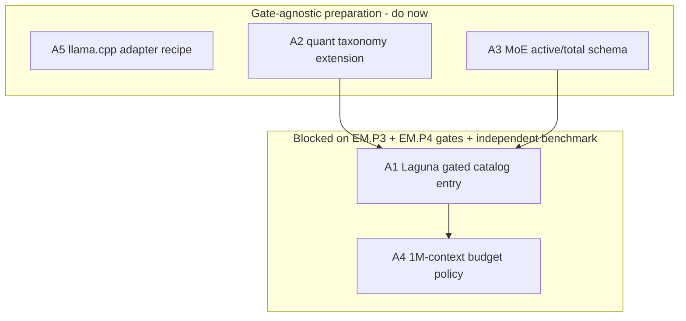

# Cross-Project Comparison: Nexus vs. Laguna-S-2.1

**Version**: v1.18.2
**Adoption target**: v1.18.0
**Generated**: 2026-07-24
**Analyzer**: Claude Code -- /compare command
**External Source**: https://huggingface.co/unsloth/Laguna-S-2.1-GGUF (Model card)
**Source Type**: Model card (article-equivalent insight extraction)
**Pre-ingest source-security verdict**: CLEAR -- see Section 5.0

---

## Section 1: Executive Summary

Laguna-S-2.1 (`poolside/Laguna-S-2.1`, quantized to GGUF by Unsloth, OpenMDW-1.1, released ~2026-07-21) is a 118B-total / 8B-active Mixture-of-Experts model built for agentic coding and long-horizon work, with context up to 1M tokens and GGUF quantizations reaching down to 1-bit. It is, by the public benchmarks (SWE-Bench-Multilingual 78%, SWE-Bench-Pro 59%), one of the strongest open-weight coding models available, and its permissive license makes it a legitimate catalog candidate.

Unlike the two repository sources in this comparison, Laguna is a *model*, so this report extracts model-card insights rather than comparing project structure. The dominant finding is a fit problem, not a capability gap: Laguna's weight class overshoots Nexus's founding single-GPU laptop ceiling (Design Principle 3: every pillar runs on an RTX 3070-4090-class GPU, <=24 GB VRAM). Even at ~1.5-2 bit, 118B total parameters must be resident or disk-offloaded, exceeding 24 GB. Consequently, Laguna does not belong in the default per-VRAM `recommended.json` tiers; it maps squarely onto the two catalog tiers Nexus has deliberately GATED -- extreme-low-bit (EM.P3) and the disk-offload "patient" tier (EM.P4.A) -- both of which are, by v1.12 roadmap policy, held closed until runtime support and independent benchmarks are confirmed.

The realistic adoption is therefore two-speed: do the low-risk *preparation* now (extend the quant taxonomy, model MoE active-vs-total in the catalog schema, document a llama.cpp loopback adapter recipe), and hold the actual catalog entry behind the existing gates plus an independent benchmark.

**Overall recommendation: adopt the preparatory, gate-agnostic items now; hold the Laguna catalog entry itself behind the existing EM.P3 / EM.P4 gates and an independent benchmark; reject bundling it as a default pick and reject any API-based (outbound) consumption. This report cross-references the queued v1.16.0 local-serving cycle, which is the natural place to open those gates.**

## Section 2: Project Profiles

| Aspect | Nexus (this project) | Laguna-S-2.1 |
|---|---|---|
| Identity | Nexus (Nexus-AI) | `poolside/Laguna-S-2.1` (GGUF by `unsloth`) |
| Kind of artifact | Local-first desktop AI Studio | Open-weight agentic-coding model |
| Purpose | Coding + Chat + Image + Video, local-only | Agentic coding + long-horizon work |
| Version / maturity | Milestone v1.15.0 in flight; release track v2.4.0 | Released ~2026-07-21 |
| License | MIT (app) | OpenMDW-1.1 (weights; commercial use permitted) |
| Author / owner | @bendourthe | poolside.ai; quants by Unsloth AI |
| Primary language | TypeScript (+ Rust/Tauri, Python) | N/A (model weights) |
| Architecture | Four-pillar app | 118B-total / 8B-active MoE; 256 routed + 1 shared expert; GQA; interleaved full/sliding-window attention (3:1 across 48 layers); FP8 KV cache; native interleaved reasoning + tool calling |
| Platform / footprint | Single consumer GPU, <=24 GB VRAM ceiling | Runs on a single NVIDIA DGX Spark; large-MoE footprint even quantized |
| Network posture | Local-first; no outbound without opt-in | Local via GGUF (llama.cpp / Ollama); also on OpenRouter + Poolside API (outbound) |
| Relevance to Nexus | A concrete test of the gated extreme-low-bit + patient tiers | Medium-High (as a gated catalog candidate) |

## Section 3: Capability and Architecture Comparison

### 3a: Model fit against the Nexus catalog

| Aspect | Nexus current defaults | Laguna-S-2.1 | Delta |
|---|---|---|---|
| Coding-model class | Gemma 4 family, Qwen2.5-Coder 7B/14B, DeepSeek-Coder-V2 16B -- dense, `agentic: true` (`core/registry/catalog.json`) | 118B-total / 8B-active MoE | Far larger total params; active compute (~8B) comparable to a mid dense model |
| Per-VRAM tiers | `cpu / 8 / 12 / 16 / 24` GB, each with a best-fit `agentic` default (`core/registry/recommended.json:7-48`) | Full weights in the 100s of GB; low-bit quants shrink but stay large | Exceeds the 24 GB top tier unless heavily quantized + offloaded |
| Quantization support | Standard GGUF via Ollama; sub-4-bit is GATED (`core/registry/extremeLowBit.ts:22-31`, fail-closed `:40-45`) | Ships UD dynamic quants from 1-bit (`UD-IQ1_S`) through 16-bit | Maps onto the gated EM.P3 extreme-low-bit path |
| Serving runtime | Ollama / LM Studio loopback adapters (`LocalAdapterRegistry.ts`) | GGUF in llama.cpp / Unsloth; large-MoE benefits from disk offload | Maps onto the gated EM.P4.A patient/offload tier (`core/registry/patientTier.ts`) |
| Context budget | Per-tier context budgets | Up to 1M tokens | Would require a context-budget policy update (A4) |
| License compatibility | MIT app; catalog holds various model licenses | OpenMDW-1.1 (permissive, commercial OK) | Compatible for catalog inclusion |

**Key contrast:** Nexus already owns the machinery to admit a model like Laguna safely -- `extremeLowBit.ts` and `patientTier.ts` exist precisely for sub-4-bit and disk-offload MoE cases. The barrier is not missing capability; it is that both mechanisms are fail-closed by design (EM.P3.A placeholder min-version `999.0.0`; patient tier disabled) pending runtime support and independent benchmarks (`docs/archive/v1/v1.12/known-gaps.md:31-39`).

### 3b: Single-GPU ceiling fit (the crux)

| Aspect | Nexus posture | Laguna-S-2.1 reality | Delta |
|---|---|---|---|
| Hardware ceiling | Design Principle 3: single consumer GPU, <=24 GB VRAM (`README.md:89`) | 118B total; ~25-35 GB+ resident even at ~1.5-2 bit; DGX Spark class recommended | Overshoots the laptop ceiling |
| Active vs resident compute | Catalog tiers on `vramGb` only | 8B active (modest compute) but full expert set must be resident or offloaded | Catalog schema does not yet model active-vs-total (A3) |
| Placement | Default `recommended.json` picks are laptop-fit | Belongs in the gated patient/offload + extreme-low-bit tiers, never a default | Correct placement is gated-only |

**Key contrast:** Laguna is the archetypal "punches above its weight" model, but the weight it punches above is still heavier than Nexus's target hardware. Its correct home is the gated tiers, and its correct near-term treatment is preparation, not shipping.

## Section 4: Gap Analysis (model-card insight extraction)

Each numbered insight from the model card is classified against Nexus.

### 4a: Insights that are adoption candidates

- **A1 -- Add Laguna-S-2.1 as a benchmarked, gated catalog entry.** *Status: Missing, and GATED.* A `core/registry/catalog.json` entry (Ollama GGUF pull or a HF `weights` manifest with sha256) plus a `patient-tier`-tagged / 24GB-plus `recommended.json` row. Depends on the EM.P3 and EM.P4 gates being opened AND an independent benchmark (EM.P3.B / EM.P4 enablement, `docs/archive/v1/v1.12/known-gaps.md:32,:39`).
- **A2 -- Extend the quant taxonomy to recognize Unsloth UD dynamic quants.** *Status: Partial.* `extremeLowBit.ts` labels are `Q1_0/Q2_0/TQ1_0/TQ2_0/I2_S/1bit/ternary` (`:22-31`); Laguna ships `UD-IQ1_S / UD-Q2_K_XL / MXFP4_MOE` style dynamic quants. Extend the recognized label set so the gate reasons about UD dynamic quantization.
- **A3 -- Model MoE active-vs-total params in the catalog schema.** *Status: Missing.* Catalog tiers on `vramGb` alone; a MoE like Laguna has modest active compute but a huge resident footprint. Add `activeParams` / `totalParams` fields so `HarnessSelector` and the GPU scheduler can reason about MoE resident-vs-active cost (ties into `modules/coding/orchestration/HarnessSelector.ts`).
- **A5 -- Documented llama.cpp loopback adapter recipe.** *Status: Partial.* EM.P4.A already references a user-registered llama.cpp flash-MoE offload adapter. Promote this to a documented, first-class loopback adapter recipe (manifest + guide) so the user's "run it in llama.cpp" path is a supported, local, no-outbound configuration.

### 4b: Insights that require care / are gated

- **A4 -- 1M-context budget policy.** *Status: Missing, low near-term value.* Only relevant if Laguna is adopted; Nexus would need a context-budget policy gating 1M ctx against local KV-cache memory. Gated behind A1.

### 4c: Present in Nexus already (no action, cited as strengths)

| Model-card claim | Nexus already has | Evidence |
|---|---|---|
| Runs locally via GGUF (llama.cpp / Ollama) | Loopback-only local adapter registry | `LocalAdapterRegistry.ts:13-21` |
| Sub-4-bit quantization support | Extreme-low-bit tier (gated, fail-closed) | `core/registry/extremeLowBit.ts:22-45` |
| Large-MoE / offload runtime | Patient/offload tier (gated) | `core/registry/patientTier.ts`; `docs/archive/v1/v1.12/known-gaps.md:39` |
| Per-hardware model selection | Per-VRAM curation + telemetry panel | `core/registry/recommended.json`; `README.md:50` |

## Section 5: Security and Risk Assessment

*This section is MANDATORY per the compare-project skill (Steps 1.5 and 5) and the MCP Registry Policy.*

### 5.0 Pre-ingest source-security scan (Step 1.5)

| Check | Laguna-S-2.1 (GGUF) |
|---|---|
| Prompt injection / agent-directed instructions | None. The model card is descriptive (architecture, quants, benchmarks, license); no instructions directed at an AI reader. |
| Malicious or destructive code patterns | Not applicable to this comparison -- the GGUF weight files were NOT downloaded or executed; only the model-card text was ingested. |
| Supply-chain provenance | Base weights `poolside/Laguna-S-2.1`; quants by Unsloth AI; OpenMDW-1.1. Reputable sources. NOTE: adopting the weights later requires standard model-trust controls -- sha256 verification, provenance pinning, and a documented license. |
| Residual flags | The card advertises OpenRouter / Poolside API access; those are outbound paths and are rejected for Nexus (see N2). |

**Verdict: CLEAR.** Only the model-card text was ingested. Executing or bundling the weights is out of scope for this comparison and would trigger the standard model-trust controls above.

### 5.1 Threat-model delta

| Dimension | Adoption delta |
|---|---|
| New runtime dependencies | A5 references a llama.cpp offload adapter that stays user-registered (not bundled). A1 adds a large model artifact but no new service. A2/A3 add none (data/schema). |
| Outbound-call destinations | Zero at build time. At runtime, a GGUF pull via Ollama/HF is a user-initiated download (documented). Consuming Laguna via OpenRouter/Poolside API would be outbound -- rejected (N2). |
| Credentials / API keys | None for the local path. (A gated HF pull of a license-gated model would reuse the existing v1.14 gated-model auth flow, not new credentials.) |
| Data leaving the machine | None on the local GGUF path. |
| Resource footprint | High -- 100s of GB for the patient tier; already governed by `patientTier.ts` latency/visibility guards. |

### 5.2 Per-item risk scorecard

| Item | Risk tier | Justification |
|---|---|---|
| A1 Gated catalog entry | Low | Data only; gated behind EM.P3/EM.P4; needs benchmark + sha256; cannot surface until gates open |
| A2 Quant taxonomy extension | None | Pure label-set data in `extremeLowBit.ts` |
| A3 MoE active/total schema | Low | Additive catalog schema + selector logic; must stay backward-compatible |
| A4 1M-context budget | Low | Policy change; only active if A1 lands |
| A5 llama.cpp adapter recipe | Low | Loopback-only local adapter; runtime remains user-registered |

## Section 6: Reverse-Engineering Viability Analysis

*MANDATORY. Every candidate is classified against the decision tree: skill-native > re-full > re-partial > vendor-intrinsic > drop-outright.*

| Item | Classification | Internal deliverable | Effort | Rationale |
|---|---|---|---|---|
| A5 llama.cpp adapter recipe | skill-native / re-full | A documented loopback adapter manifest + guide; runtime user-registered per EM.P4.A | Low | Mostly config + docs; no new bundled runtime |
| A2 Quant taxonomy | re-full | Extend the recognized quant-label set in `extremeLowBit.ts` | Low | Internal data change |
| A3 MoE active/total schema | re-full | `activeParams`/`totalParams` in `catalog.json` schema + `HarnessSelector` tier logic | Medium | Internal schema + selector work |
| A1 Gated catalog entry | re-full | Benchmarked `catalog.json` + `recommended.json` entry, gated | Medium | Data; blocked on gate-opening + independent benchmark |
| A4 1M-context budget | re-partial | Context-budget policy gating 1M ctx vs local KV memory | Medium | Ship the local slice; document memory limits |

**Recommendation ordering (per MCP Registry Policy):**
1. `skill-native`: A5 (documented adapter recipe).
2. `re-full`: A2 (taxonomy), A3 (MoE schema), A1 (gated entry).
3. `re-partial`: A4 (context budget).
4. `vendor-intrinsic` / `drop-outright`: API-based consumption -> drop (Section 9, N2).

## Section 7: Adoption Plan

### Bucket 1 -- skill-native (zero-code wins)

| What | Source | Target | Effort | Deps | Risk |
|---|---|---|---|---|---|
| A5 llama.cpp loopback adapter recipe (P1) | Laguna "run in llama.cpp" | Adapter manifest + `docs/reference/` guide | Low | -- | Low |

### Bucket 2 -- reverse-engineered internal builds (re-full)

| What | Source | Target | Effort | Deps | Risk |
|---|---|---|---|---|---|
| A2 Quant taxonomy extension (P1) | Unsloth UD dynamic quants | `core/registry/extremeLowBit.ts` | Low | -- | None |
| A3 MoE active/total schema (P2) | Laguna 118B/8B-active MoE | `catalog.json` schema + `HarnessSelector.ts` | Medium | -- | Low |
| A1 Laguna gated catalog entry (P2, gated) | Laguna-S-2.1 GGUF | `catalog.json` + `recommended.json` | Medium | EM.P3 + EM.P4 gates open; independent benchmark | Low |

### Bucket 3 -- reverse-engineered internal builds (re-partial)

| What | Source | Target | Effort | Deps | Risk |
|---|---|---|---|---|---|
| A4 1M-context budget policy (P3, gated) | Laguna 1M ctx | Context-budget policy | Medium | A1 | Low |

## Section 8: Implementation Sequence

Suggested phasing for the v1.18.0 cycle:
1. Preparation now (unblocked): A5 (adapter recipe), A2 (quant taxonomy), A3 (MoE schema). These prepare the ground and carry no gate dependency.
2. Gated, later: A1 (the actual Laguna entry) waits on the EM.P3 (extreme-low-bit) and EM.P4 (patient/offload) gates being opened plus an independent benchmark; A4 (1M-context budget) follows A1.

**Cross-cycle note:** the queued v1.16.0 cycle is "local-serving-and-ocr" -- the natural place to open the EM.P3 / EM.P4 gates and land the runtime work Laguna depends on. If the roadmap opens those gates in v1.16.0, A1 can be pulled forward into that cycle; otherwise it stays in v1.18.0 as gated. The adoption target for THIS report remains v1.18.0 as confirmed.

## Section 9: Risks and Explicit Rejections

General considerations:
- The primary risk is premature enablement: shipping Laguna by flipping the EM.P3/EM.P4 gates ahead of the runtime + benchmark preconditions would risk OOM and unbounded latency on target hardware.
- The preparation items (A2/A3/A5) are safe and useful even if Laguna is never adopted, because they generalize to any large-MoE / extreme-low-bit model.

### Items explicitly NOT recommended for adoption

- **N1 -- Bundling Laguna weights in the installer or making it a default `recommended.json` pick.** **Rejected** (118B total exceeds the single-GPU 24 GB ceiling even at low bit; violates Design Principle 3 "single-GPU ceiling", `README.md:89`; belongs in the gated patient/offload tier only).
- **N2 -- Consuming Laguna via the Poolside API or OpenRouter.** **Rejected** (outbound calls to a third-party data processor with per-token billing; conflicts with local-first, "Zero Tokens Billed", and the MCP Registry Policy "hard no" on generation-as-service, `README.md:194`).
- **N3 -- Opening the EM.P3 or EM.P4 gates specifically to ship Laguna ahead of independent benchmarks.** **Rejected / gated** (the v1.12 roadmap requires runtime support and independent benchmarks confirmed before flipping the gate, `docs/archive/v1/v1.12/known-gaps.md:31-39`; premature enablement is an OOM/latency risk).

## Appendix: Source Facts (as fetched 2026-07-24)

**Laguna-S-2.1 (`poolside/Laguna-S-2.1`; GGUF by `unsloth`; OpenMDW-1.1; released ~2026-07-21).** A 118B-total / 8B-active-per-token Mixture-of-Experts model "for agentic coding and long-horizon work", context up to 1M tokens (thinking and no-thinking modes). Architecture: token-choice router with softplus gating over 256 routed experts + 1 shared expert; grouped-query attention; interleaved full / sliding-window attention (3:1 across 48 layers); FP8 KV cache; native interleaved reasoning + tool calling. GGUF quants (Unsloth UD dynamic): 1-bit (`UD-IQ1_S`, `UD-IQ1_M`), 2-bit (`UD-IQ2_XXS`, `UD-IQ2_M`, `UD-Q2_K_XL`), 3-bit, 4-bit (incl. `MXFP4_MOE`), 5/6/8/16-bit (BF16). Benchmarks cited: ~78% SWE-Bench Multilingual, ~59% SWE-Bench Pro, ~70% TB 2.1, ~40% DeepSWE; "holds its own against models several times its size." Deployment: weights on Hugging Face under OpenMDW-1.1; runs on a single NVIDIA DGX Spark; also available via OpenRouter and the Poolside API. Trained start-to-launch in under nine weeks. Pre-ingest security verdict: CLEAR (model-card text only; weights not downloaded or executed).
