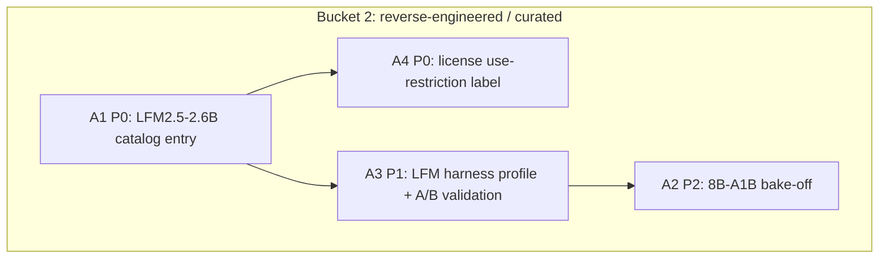

# Cross-Project Comparison: Nexus vs. Liquid AI LFM Model Library

**Version**: v1.19.0
**Adoption target**: v1.19.0
**Generated**: 2026-08-05
**Analyzer**: Claude Code -- /compare command
**External Source**: https://docs.liquid.ai/lfm/models/complete-library (Article -- docs page; supplemented by the LFM2.5-2.6B release blog, the LFM License page, and the Hugging Face GGUF repos)
**Source Type**: Article
**Pre-ingest source-security verdict**: CLEAR -- see Section 5.0

---

## Section 1: Executive Summary

Liquid AI's LFM model library is not a competing product; it is a family of small open-weight models, and its headline entry -- LFM2.5-2.6B, a 2.6B agentic model that plans, calls tools, and runs multi-step tasks entirely on-device in under 2.5 GB of memory -- lands squarely in a gap in Nexus's own model catalog. Nexus's current Agentic tier bottoms out at ~7 GB VRAM (`qwen2.5-coder:7b` class entries in `core/registry/catalog.json`); machines below that get a chat model but no tool-calling-capable agentic option. LFM2.5-2.6B (Q4_K_M GGUF is 1.67 GB) would give every hardware tier, including CPU-only machines, a working agentic model.

Because the source is a model library rather than a codebase, adoption here is catalog curation, not reverse-engineering of program logic: add the 2.6B agentic entry (and optionally the 8B-A1B MoE sibling) to `core/registry/catalog.json`, tune a `HarnessSelector` profile for LFM tool-calling output, and record the LFM Open License v1.0 correctly (Apache-2.0-derived, but free commercial use is capped at USD 10M annual revenue -- a use restriction, not a download gate). The one thing the Liquid ecosystem offers that Nexus must refuse is its hosted inference surface, which the MCP Registry Policy rejects outright as generation-as-a-service.

**Overall recommendation: adopt LFM2.5-2.6B as the low-VRAM Agentic-tier catalog entry for v1.19.0 (a small, shippable curation cycle), evaluate LFM2.5-8B-A1B as a follow-on, and reject any hosted Liquid inference path (LEAP / API endpoints) per the MCP Registry Policy.**

## Section 2: Project Profiles

| Aspect | Nexus (this project) | Liquid AI LFM library |
|---|---|---|
| Identity | Nexus (Nexus-AI) | Liquid Foundation Models (LFM2 / LFM2.5 families) |
| Kind of artifact | Local-first desktop AI Studio (4 pillars) | Open-weight small-model family + docs library (article source) |
| Purpose | Coding + Chat + Image + Video, local-only | On-device text / vision / audio / task-specific models |
| Version / maturity | Milestone v1.19.0 targeted; v1.15.0 in flight | LFM2.5 generation current (2.6B released 2026) |
| License | MIT (app) | LFM Open License v1.0 (Apache-2.0-based, <USD 10M revenue cap on free commercial use) |
| Author / owner | @bendourthe | Liquid AI (MIT spin-off) |
| Deployment paths | Ollama pull + HF `weights` manifests with SHA-256 pins | Hugging Face, GGUF (llama.cpp/Ollama), MLX, ONNX; Q4_K_M recommended |
| Network posture | Local-only; no outbound without explicit opt-in | Open weights run fully on-device; vendor also sells hosted inference (rejected here) |
| Relevance to Nexus | -- | High: fills the sub-4-GB agentic catalog gap |

## Section 3: Capability and Architecture Comparison

### 3a: Model catalog coverage vs the LFM library

| Aspect | Nexus (current) | LFM library | Delta |
|---|---|---|---|
| Agentic tier floor | Smallest `task: "agentic"` entries need ~7 GB VRAM (`core/registry/catalog.json`, qwen2.5-coder 7B class, `vramGB: 7`) | LFM2.5-2.6B: agentic tool-calling in <2.5 GB RAM, CPU-capable (113 tok/s AMD Ryzen, 220 tok/s Apple M5 Max) | Gap in Nexus (candidate A1) |
| Quant ladder | Catalog convention: per-entry `sizeGB`/`vramGB`, GGUF quants, Q4_K_M-class defaults | Official GGUF repo `LiquidAI/LFM2.5-2.6B-GGUF`: Q4_0 1.59 GB, Q4_K_M 1.67 GB, Q5_K_M 1.94 GB, Q8_0 2.87 GB | Already-implemented mechanism; just needs the entry |
| Agentic metadata | `agentic: true` flag + `task: "agentic"` + `strengths`/`whyRecommended`/`differentiators` copy (v1.9.0/v1.8.0 schema, `catalog.json` `_meta`) | Vendor-reported benchmarks: ToolSandbox 77.83 (vs Qwen3.5-9B 76.44), BFCLv4 56.88; agentic-RL post-training in live harnesses | Nexus schema ready; benchmark provenance goes in the card copy |
| Context length | Per-model, catalog-described | 32K standard across the library; 128K claimed for 8B-A1B (docs) and for 2.6B (release blog) -- conflicting, verify at pull time | Record verified value in the entry |
| Per-model harness tuning | `modules/coding/orchestration/HarnessSelector.ts` (+ `HarnessSelectorAb.ts`) selects harness per model (v1.12 adoption cycle, `docs/archive/v1/v1.12/plans/adoption-ecosystem-2026-07.md`) | LFM models emit their own tool-call format; trained inside live harnesses | Partial: selector exists, LFM profile does not (A3) |
| License gating in installer | `requiresLicense` + `licenseUrl` guided-acceptance flow (v1.14, `docs/archive/v1/v1.14/plans/installer-catalog-curation-and-reliability.md`) | LFM weights are ungated downloads; the license restriction is on commercial *use* above USD 10M revenue | Partial: mechanism exists, needs a use-restriction (not download-gate) presentation (A4) |

### 3b: Rest of the LFM library vs Nexus pillars

| LFM offering | Nexus equivalent | Assessment |
|---|---|---|
| LFM2.5-1.2B / 350M / 230M text models | Chat ladder already floors at gemma4:e2b (`vramGB: 4`, CPU-capable) | Redundant for chat; skip |
| LFM2.5-8B-A1B (MoE, 128K context) | 12-14 GB Agentic tier already served (qwen 14B-class, deepseek-coder-v2:16b) | Optional evaluation (A2) |
| LFM2.5-VL 1.6B / 450M vision-language | gemma4:12b already "also understands images" | Defer; watchlist only |
| Liquid Nanos (extract, PII, translation, math, embedding, ColBERT) | Nexus has local embedding + `redactSecrets` scrubbing | Not-applicable for v1.19.0; PII-extract nano is a future watchlist item |

## Section 4: Gap Analysis

Article-source mode: numbered actionable insights extracted from the source, each classified against Nexus.

1. **LFM2.5-2.6B on-device agentic model** (tool calling, planning, multi-step tasks, <2.5 GB, ~34T training tokens, agentic-RL post-training) -- **missing**. Nexus has no agentic-capable model below ~7 GB VRAM. -> Adoption candidate **A1**.
2. **LFM2.5-8B-A1B MoE (128K context)** -- **missing**, but the 12-14 GB tier it would serve is already covered by stronger coding specialists. -> Optional candidate **A2** (evaluate, adopt only if benchmarks beat incumbents per GB).
3. **Official GGUF quant ladder with Q4_K_M recommended** (`LiquidAI/LFM2.5-2.6B-GGUF`) -- **already-implemented** as a mechanism: the catalog's `sizeGB`/`vramGB` + Ollama/HF-weights dual sourcing (`catalog.json` `_meta`, `scripts/installer/build/pin-hf-weights.py`) handles this today.
4. **LFM tool-call output format / harness fit** (trained inside live agent harnesses) -- **partial**: `HarnessSelector.ts` exists but has no LFM profile. -> Candidate **A3**.
5. **LFM Open License v1.0** (Apache-2.0-based; free commercial use only under USD 10M annual revenue; fine-tunes may stay proprietary; non-profits exempt) -- **partial**: the installer's `requiresLicense`/`licenseUrl` flow (v1.14) covers download-gated models, but LFM weights are ungated; what is needed is a visible use-restriction label. -> Candidate **A4**.
6. **Small chat/instruct variants (1.2B, 350M, 230M)** -- **not-applicable**: the chat ladder already reaches CPU-only hardware via gemma4:e2b.
7. **Vision-language and audio variants** -- **not-applicable** for v1.19.0 (existing multimodal + curated audio coverage); watchlist.
8. **Liquid Nanos task-specific models** -- **not-applicable** for v1.19.0; the PII-extract nano is noted as a possible future local aid to redaction, nothing more.
9. **Hosted Liquid inference (LEAP platform / API endpoints)** -- **not-applicable by policy**: rejected in Section 9.

### Strengths to preserve (present in Nexus, absent from the source)

- Hardware-aware curation: per-VRAM-tier defaults (`core/registry/recommended.json`), best-fit family collapse in the installer picker, `releaseDate`/`origin`/`guardrails` metadata.
- SHA-256-pinned HF weights manifests and `ollama pull` digest delegation (`catalog.json` `_meta`).
- Per-model harness selection with A/B evaluation (`HarnessSelectorAb.ts`).
- Reverse-engineering-first MCP policy; zero as-a-service integrations.

## Section 5: Security and Risk Assessment

*This section is MANDATORY per the compare-project skill (Steps 1.5 and 5) and the MCP Registry Policy.*

### 5.0 Pre-ingest source-security scan (Step 1.5)

| Check | Liquid docs page + supplements |
|---|---|
| Prompt injection / agent-directed instructions | One agent-directed line found on the docs page: "Use this file to discover all available pages before exploring further" (llms.txt-style navigation hint). Benign, was treated as data and NOT followed. No "ignore previous instructions" payloads, no hidden/zero-width/base64 blobs surfaced. |
| Malicious or destructive patterns | None. Content is model specs, quant tables, and license prose. |
| Supply-chain provenance | Official vendor docs + official `LiquidAI/*` Hugging Face org repos; license page is first-party. Third-party summaries (benchmarks) used only for corroboration and flagged as vendor-reported. |
| Residual flags | Benchmark numbers are vendor-reported (ToolSandbox, BFCLv4); independent verification is a precondition of the catalog card copy claiming them. |

**Verdict: CLEAR.** Ingestion proceeded; all source text handled as data.

### 5.1 Threat-model delta

| Dimension | Adoption delta |
|---|---|
| New runtime dependencies | None. A1-A4 are catalog data, a harness profile, and installer copy; weights run under the existing Ollama/llama.cpp local runtime. |
| Outbound-call destinations | None new: weights pull from huggingface.co (already an installer destination) or the Ollama registry, at explicit install time only. |
| Credentials / API keys | None. LFM weights are ungated; no HF token required (unlike the v1.14 gated opt-ins). |
| Data leaving the machine | None. Inference is fully local; the hosted Liquid API is rejected. |
| New inbound surface | None. |

### 5.2 Per-item risk scorecard

| Item | Risk tier | Justification |
|---|---|---|
| A1 LFM2.5-2.6B catalog entry | Low | Data + pinned local weights; verify SHA-256 pins and real context length at curation time |
| A2 LFM2.5-8B-A1B evaluation | Low | Evaluation-only until benchmarks justify an entry |
| A3 LFM harness profile | Low | Local selector logic; A/B-verifiable via `HarnessSelectorAb.ts` |
| A4 License-restriction labeling | None (legal note) | Pure UI/data; the USD 10M cap binds the *user's* commercial use, so the label must be visible, accurate, and never silently dropped |

## Section 6: Reverse-Engineering Viability Analysis

*MANDATORY. Every candidate is classified against the decision tree: skill-native > re-full > re-partial > vendor-intrinsic > drop-outright.*

| Item | Classification | Internal deliverable | Effort | Rationale |
|---|---|---|---|---|
| A1 LFM2.5-2.6B catalog entry | re-full | New `catalog.json` entry: `task: "agentic"`, `agentic: true`, `vramGB: 3` class, Q4_K_M `sizeGB: 1.67`, `license: "LFM Open License v1.0"` + `licenseUrl`; HF `weights` manifest with pins via `scripts/installer/build/pin-hf-weights.py` (or Ollama source if/when the library carries it) | Low | Open weights consumed locally; zero vendor code, zero vendor service |
| A2 LFM2.5-8B-A1B entry | re-partial | Benchmark bake-off vs incumbent 12-14 GB agentic entries first; entry only on a win | Low-Med | Evaluation gate before catalog space |
| A3 LFM harness profile | re-full | LFM-aware profile in `modules/coding/orchestration/HarnessSelector.ts`, A/B-validated via `HarnessSelectorAb.ts` golden tasks | Low-Med | Pure local logic against the model's tool-call format |
| A4 License-restriction label | re-full | Catalog + installer card copy: reuse the v1.14 `licenseUrl` surface; present as use-restriction (no token gate, `requiresLicense: false`) | Low | Extends an existing mechanism |
| Hosted Liquid inference (LEAP/API) | drop-outright | -- | -- | Generation-as-a-service; MCP Registry Policy hard no (Section 9, N1) |

None is skill-native (this is catalog data, not agent behavior) and none is vendor-intrinsic: Liquid is not an intrinsic data destination -- its open weights are the whole value, and they run locally.

## Section 7: Adoption Plan

Framing: this is the ONE source targeted at the near-term v1.19.0 milestone; the plan is deliberately a small, low-effort, shippable catalog-adoption cycle, ordered skill-native -> RE builds -> vendor-intrinsic.

### Bucket 1 -- skill-native (zero-code wins)

None. All candidates are catalog data or local build work.

### Bucket 2 -- reverse-engineered internal builds

| What | Source | Target | Effort | Deps | Risk | Tier |
|---|---|---|---|---|---|---|
| A1 LFM2.5-2.6B low-VRAM agentic entry | LFM library / `LiquidAI/LFM2.5-2.6B-GGUF` | `core/registry/catalog.json` (+ `core/registry/recommended.json` low-tier default), ModelSelector badge via `desktop/src/shared/chat/ModelSelector.tsx` | Low | -- | Low | P0 |
| A4 LFM Open License use-restriction label | LFM License page | `catalog.json` `license`/`licenseUrl` + installer card copy (v1.14 flow) | Low | A1 | None | P0 |
| A3 LFM harness profile + golden-task validation | LFM tool-call format | `modules/coding/orchestration/HarnessSelector.ts` / `HarnessSelectorAb.ts` | Low-Med | A1 | Low | P1 |
| A2 LFM2.5-8B-A1B bake-off (entry only on a win) | LFM library | Evaluation vs incumbent 12-14 GB agentic entries | Low-Med | A1, A3 | Low | P2 |
| Watchlist: VL variants + PII-extract Nano | LFM library | Comparison note only; no build | None | -- | None | P3 |

### Bucket 3 -- vendor-intrinsic

None. No candidate requires Liquid as an intrinsic third-party destination.

## Section 8: Implementation Sequence

Suggested phasing for the v1.19.0 cycle (one small shippable slice):
1. A1 + A4 together: catalog entry, VRAM-tier placement, license label -- shippable on its own.
2. A3: harness profile tuned against golden tasks; confirm the 128K-vs-32K context claim empirically and correct the entry.
3. A2: only if the bake-off wins; otherwise close as evaluated-and-declined.

## Section 9: Risks and Explicit Rejections

General considerations:
- All benchmark claims (ToolSandbox 77.83, BFCLv4 56.88, 220 tok/s) are vendor-reported; catalog `whyRecommended` copy must not assert them until locally reproduced or independently corroborated.
- The context-length discrepancy (docs library says 32K standard; the 2.6B release blog claims 128K) must be resolved at curation time, not copied blindly.
- The LFM Open License is NOT plain Apache-2.0: scrutinized as directed, its USD 10M annual-revenue cap on free commercial use is a real restriction on end users. Nexus already ships restricted-license models (Gemma Terms of Use) and never redistributes weights -- the installer pulls from the official repo at the user's request -- so listing is fine, but the restriction must be labeled (A4). If Liquid later tightens the license, the entry is data and can be pulled without code changes.

### Items explicitly NOT recommended for adoption

- **N1 -- Hosted Liquid inference (LEAP platform, hosted API endpoints, playground).** Any routing of Nexus inference through Liquid-hosted endpoints is generation-as-a-service. **Rejected** (MCP Registry Policy "hard no" on generation-as-a-service; local-first design principle; zero-outbound posture). Local open weights are the only acceptable consumption path.
- **N2 -- Bundling or redistributing LFM weights inside the Nexus installer.** Redistribution would make Nexus a licensee-distributor under the LFM Open License and inherit its commercial-use cap into the product. **Rejected**: keep the existing pull-at-install-from-official-repo model with SHA-256 pins (MCP Registry Policy bucket 1 local-only posture; v1.14 installer discipline).
- **N3 -- Vendor SDK integration (Liquid edge/LEAP SDKs) for on-device execution.** Nexus already has a local runtime path (Ollama / llama.cpp GGUF); adding a vendor SDK duplicates it and creates supply-chain surface for zero capability gain. **Rejected** (MCP Registry Policy bucket 3 preference: the local internal equivalent already exists).

## Appendix: Source Facts (as fetched 2026-08-05)

**Liquid AI LFM complete library** (https://docs.liquid.ai/lfm/models/complete-library). 20+ models: LFM2.5 text (2.6B, 1.2B Instruct/Thinking/Base/JP, 350M, 230M, 8B-A1B MoE), LFM2 (24B-A2B, 2.6B, 700M), LFM2.5-VL (1.6B, 450M), LFM2.5-Audio (1.5B, 1.5B-JP), Liquid Nanos (extract, embedding, ColBERT, encoder, translation, math, PII extraction). 32K context standard (128K for 8B-A1B). Runtimes: vLLM, llama.cpp, Ollama, MLX, ONNX; GGUF Q4_K_M recommended. **LFM2.5-2.6B** (release blog): agentic on-device model -- planning, tool calling, multi-step tasks -- under 2.5 GB memory; 220 tok/s (Apple M5 Max), 113 tok/s (AMD Ryzen), ~30 tok/s (phone); ~34T training tokens; agentic-RL post-training inside live harnesses; vendor benchmarks ToolSandbox 77.83 (vs Qwen3.5-9B 76.44), BFCLv4 56.88 (trails Qwen3.5-9B); blog claims 128K context. **GGUF availability**: official `LiquidAI/LFM2.5-2.6B-GGUF` on Hugging Face -- Q4_0 1.59 GB, Q4_K_M 1.67 GB, Q5_K_M 1.94 GB, Q8_0 2.87 GB; ungated download. **License**: LFM Open License v1.0 -- Apache-2.0-based, royalty-free and perpetual, no copyleft, fine-tunes may stay proprietary; free commercial use limited to entities under USD 10M annual revenue (commercial license via sales@liquid.ai above that); qualified non-profits exempt. Pre-ingest security verdict: CLEAR (one benign llms.txt-style navigation instruction on the docs page; treated as data).
