# Cross-Project Comparison: Nexus (v1.1.0 codebase) vs. 2026-05 Ecosystem Scan (7 sources)

**Version**: v1.2.0 (forward input for the v1.2.0 cycle; analysis snapshot taken against the v1.1.0 codebase at cycle close, 2026-05-26)
**Generated**: 2026-05-26T00:00:00Z
**Analyzer**: Claude Code -- /compare-project
**Source Type**: Multi-source (5 repositories + 2 web articles)
**Companion reports**: [comparison-agentmemory.md](../v1.1/comparison-agentmemory.md); [comparison-sana.md](../v1.1/comparison-sana.md); upstream comparisons under [docs/versions/v1/v1.0.0/](../v1.0).
**Decision lens**: [AGENTS.md](../../../AGENTS.md) MCP Registry Policy -- **local-only > LLM-native skill > reverse-engineered internal module > trusted-vendor wrapper > drop**.

This is a single consolidated report covering seven sources scanned together because they all touch the same near-term concern: making AI coding agents cheaper, faster, more private, and less generic-looking on a large local codebase. The Coding pillar is the primary integration target; the Chat pillar inherits incidentally; Image and Video Lab are largely out of scope.

---

## 1. Executive Summary

Seven sources were scanned: two Anthropic blog articles (best practices in large codebases; HTML as output medium) and five open-source repositories (LEANN, CodeGraph, RTK, Hallmark, Multica). Across the seven, the analysis surfaced **41 distinct insights**, of which **9 are already implemented in Nexus**, **8 are partially implemented**, **20 are missing-but-relevant**, and **4 are not applicable**. The headline finding is that **three of the five repositories propose techniques that line up cleanly with Nexus's "originality over wrappers" stance and can be reverse-engineered into internal modules under [core/](../../../core)** -- LEANN's graph-pruning + selective-recomputation vector index, CodeGraph's symbol-and-call MCP server, and RTK's command-output compression proxy. **Hallmark is the cleanest skill-native win** (it is already a skill, MIT-licensed, drop-in to the Nexus-Hub catalog). **Multica is the only drop-outright candidate** -- it solves team workforce management against a SaaS, which is orthogonal to and conflicts with Nexus's single-machine local-first product shape. Overall recommendation: **selectively adopt** four of the five repos and harvest **~12 insights** from the two articles, all sequenced reverse-engineer-first per the MCP Registry Policy.

---

## 2. Source Inventory

| # | Source | Type | License | Headline claim | Primary integration target in Nexus |
|---|---|---|---|---|---|
| S1 | [LEANN](https://github.com/yichuan-w/LEANN) | Repo | MIT | 97% storage savings for vector index via graph-pruning + selective recomputation | [core/memory/DenseIndex.ts](../../../core/memory/DenseIndex.ts) + [core/storage/](../../../core/storage) |
| S2 | [CodeGraph](https://github.com/colbymchenry/codegraph) | Repo | MIT | 71% fewer tool calls, 57% fewer tokens, 46% faster wall clock; MCP server with symbol + call-edge graph in SQLite | Coding pillar ([modules/coding/](../../../modules/coding)) + internal MCP under [extensions/](../../../core) |
| S3 | [Best Practices in Large Codebases](https://claude.com/blog/how-claude-code-works-in-large-codebases-best-practices-and-where-to-start) | Article | Anthropic | 34 practices: layered context files, path-scoped skills, hooks-over-prompts, sub-agents for exploration, LSP-over-grep | [AGENTS.md](../../../AGENTS.md) + [.claude/agents/](../../../.claude/agents) + Coding pillar agent loop |
| S4 | [RTK](https://github.com/rtk-ai/rtk) | Repo | Apache-2.0 | 60-90% token reduction by compressing CLI output (git, grep, test runners, build tools) before it reaches the model | Coding pillar terminal layer + [core/observability/](../../../core/observability) |
| S5 | [Hallmark](https://github.com/Nutlope/hallmark) | Repo | MIT | Anti-AI-slop design skill: 22 themes, 65+ anti-pattern gates, four verbs (build/audit/redesign/study) | [Nexus-Hub skill catalog](https://github.com/bendourthe/Nexus-Hub) + desktop shell ([desktop/src/](../../../desktop/src)) |
| S6 | [Multica](https://github.com/multica-ai/multica) | Repo | Open source (specific not declared) | Agent workforce platform: assign tasks, track progress, compound skills across a fleet of agents | n/a -- conflicts with single-machine product shape |
| S7 | [The unreasonable effectiveness of HTML](https://claude.com/blog/using-claude-code-the-unreasonable-effectiveness-of-html) | Article | Anthropic | 21 practices: prefer HTML over Markdown for Claude outputs (reports, diffs, prototypes, custom editors, interactive tuning) | Coding pillar review tooling + Chat pillar render path + [.claude/agents/](../../../.claude/agents) |

---

## 3. Per-Source Briefs

### 3.1 S1 -- LEANN

LEANN is a UC Berkeley Sky Computing Lab vector index that stores **only a pruned HNSW graph** and **recomputes embeddings on the search path** rather than storing all vectors. The claimed 97% on-disk savings (60M chunks: 201 GB -> 6 GB) come from this single algorithmic shift, not from quantization tricks. It supports HNSW (default; max savings) and DiskANN (better latency via PQ traversal). Local-first by construction, no telemetry, no mandatory cloud calls. Already exposes a Claude Code MCP integration. Python-only runtime.

**What Nexus already has**: [core/memory/DenseIndex.ts](../../../core/memory/DenseIndex.ts) (per Phase 5) is a full vector index; [core/memory/HybridRetriever.ts](../../../core/memory/HybridRetriever.ts) + [core/memory/RrfFuser.ts](../../../core/memory/RrfFuser.ts) cover BM25 + dense + graph fusion via RRF.

**What is novel**: the **storage-vs-recomputation trade**. Nexus stores embeddings; LEANN deletes them and recomputes on-demand via the graph. For a long-lived Chat pillar with episodic memory growing into the millions of chunks on a single laptop, this is the difference between a 6 GB and a 200 GB `~/.nexus/` directory.

**Vendor risk**: depending on the Python `leann` package would (a) pull a UC Berkeley research artifact into our runtime, (b) add a Python + libomp + boost + protobuf + zeromq dependency chain to the Node sidecar, and (c) duplicate functionality we already own. RE-into-internal is the only acceptable path.

### 3.2 S2 -- CodeGraph

CodeGraph is a 100%-local MCP server (Node + native SQLite, no compilation) that pre-indexes 20+ programming languages into a symbol-and-call-edge graph with FTS5, exposes **8 tools** (`codegraph_search`, `codegraph_context`, `codegraph_trace`, `codegraph_callers`, `codegraph_callees`, `codegraph_impact`, `codegraph_node`, `codegraph_explore`, `codegraph_files`), watches files via OS events (FSEvents/inotify/RDCW), and debounces re-indexing over 2 seconds. Auto-configures itself into Claude Code / Cursor / Codex / opencode / Hermes via MCP config edits.

**What Nexus already has**: [core/memory/GraphMemory.ts](../../../src/storage/GraphMemory.ts) is a graph store, but it tracks **memory entities and observations**, not **code symbols and call edges**. The Coding module relies on Tree-sitter scans done inside its agent loop; there is no pre-built call graph the agent can query before reading files.

**What is novel**: the entire pattern. CodeGraph's metric (71% tool-call reduction) is the most credible quantitative claim of the seven sources, validated across VS Code / Excalidraw / Django / Tokio / OkHttp / Gin / Alamofire. The architecture (SQLite + Tree-sitter + FTS5 + file watcher) is directly buildable in the Nexus stack -- we already have all of those primitives.

**Vendor risk**: CodeGraph is shipped as a Node binary that mutates `~/.claude.json`. Adopting the binary would (a) introduce a third-party process Nexus does not control, (b) compete with our own MCP harness, and (c) auto-write into config files we already manage. RE-into-internal MCP under `core/codegraph/` is the natural fit -- this is the textbook MCP Registry Policy "re-full" bucket.

### 3.3 S3 -- Best Practices article (34 insights)

The article codifies what large-codebase Claude Code adopters do well. Most relevant items: (1) layered CLAUDE.md hierarchy with lean root and richer subdirectory files; (2) hooks for deterministic automation rather than prompt-based reminders; (3) path-scoped skills that only auto-load when in their relevant directory; (4) read-only subagent for exploration before editing-agent runs; (5) LSP for symbol-level filtering instead of grep; (6) `.claudeignore` rules in `.claude/settings.json` shared across the team; (7) MCP servers for structured search of internal data.

**What Nexus already has**: [AGENTS.md](../../../AGENTS.md) is the agent-agnostic equivalent of CLAUDE.md (Nexus explicitly does not ship a CLAUDE.md per repo policy); skill hot-reload + provenance landed in Phase 8; `.claude/agents/` and `.claude/commands/` track sub-agent and command markdown.

**Gaps**: (a) **no LSP integration** for symbol-level filtering -- the Coding pillar's agent loop currently uses Tree-sitter scans, which produce more matches than an LSP would; (b) **no path-scoped skill auto-loading** -- the skill catalog loads at session start but is not path-bound; (c) **no `.claudeignore`-style noise reduction** beyond `.gitignore`; (d) **read-only exploration sub-agent pattern is not enforced** in the Coding pillar agent loop.

### 3.4 S4 -- RTK

RTK is a Rust binary that registers as a Claude Code PreToolUse hook (and equivalents on 13 other agents). It transparently rewrites Bash commands -- `git status` becomes `rtk git status` -- and applies four compression strategies (smart filtering, grouping, truncation, deduplication) before output reaches the model. 100+ commands supported (git, ls, cat, grep, pytest, cargo test, jest, vitest, tsc, eslint, npm, etc.). Failed commands tee the full output to `~/.local/share/rtk/tee/` so the model can inspect on retry without rerunning. Apache-2.0, single Rust binary, optional anonymous telemetry (opt-in).

**Why it matters even though Nexus burns no API tokens**: the constraint Nexus actually fights is **local context window**, not dollar cost. Gemma 4 and Llama 3 have finite context; a noisy `cargo test` or `eslint --fix` output can blow a 128k window in one tool call. RTK's compression solves the same problem on a free local model that it solves on Opus.

**Note from global config**: the user's CLAUDE.md already references `guides/RTK_CONTEXT_COMPRESSION.md` -- so RTK is an established interest, not a speculative one.

**Vendor risk**: RTK is well-licensed and clean, but it is also a separate Rust process living in `~/.local/bin/`. The Coding pillar already has a Rust shell (Tauri 2.x) and an agent-loop layer that owns terminal IO. The compression heuristics are well-documented in RTK's README and codebase. RE-into-internal `core/observability/CommandCompressor.ts` (or a thin Rust crate under `desktop/src-tauri/`) is the right call.

### 3.5 S5 -- Hallmark

Hallmark is **already a skill** -- it ships as a `SKILL.md` + `references/` folder installable via `npx skills add nutlope/hallmark`. 22 themes, 65+ anti-pattern gates, four verbs (default build / `audit` / `redesign` / `study`). MIT-licensed. CSS + HTML + JS, no framework dependency, no network calls, no runtime dependencies beyond a file system.

**Why it matters for Nexus**: the desktop shell ([desktop/src/](../../../desktop/src)) is React 19 + Tailwind v4 + shadcn/ui-class components. The Chat pillar renders content that is increasingly HTML (see S7). The most common failure mode of agent-generated UI is "looks AI-generated" -- centered hero, gradient buttons, generic spacing. Hallmark codifies the antidote.

**Vendor risk**: minimal. It is a skill (markdown + reference text + CSS examples). Importing it into the Nexus-Hub catalog under `catalog/skills/developer-experience/hallmark-design/` with attribution is well within the MCP Registry Policy's "skill-native" bucket. Per [README.md L24](../../../README.md), Nexus-Hub is the upstream skill feed; Nexus consumes via `nexus skills sync`.

### 3.6 S6 -- Multica

Multica is "Multiplexed Information and Computing Agent" -- a Next.js 16 + Go + Postgres 17 + pgvector platform for managing a **fleet of coding agents** as teammates: assign issues, track progress on a board, agents post comments and report blockers, autopilots run on cron, skills compound across the team. Cloud mode requires multica.ai (auth + workspace management); self-hosted mode is Docker-only.

**Why it does not fit Nexus**: (a) Nexus is a **single-user single-machine** product, not a team workspace; (b) the workforce-management problem Multica solves is one that arises **above** the agent layer Nexus operates at; (c) cloud mode is a non-starter under "no outbound calls without explicit user opt-in" (the entire login flow is outbound); (d) self-hosted mode requires Docker + Postgres + Go runtime, which would more than triple the installer footprint Phase 14 just shipped.

**Conclusion**: drop. Document the rejection in Section 9 below.

### 3.7 S7 -- HTML effectiveness article (21 insights)

Argues that Claude Code outputs should default to HTML rather than Markdown. Specifically: (1) HTML supports tables + SVG + interactive controls + spatial data Markdown cannot; (2) Markdown over ~100 lines is hard to scan; (3) HTML files share as links rather than attachments; (4) interactive HTML enables "copy as JSON" round-trips back to Claude; (5) good artifact types are specs (grid of 6 designs), diff reviews with severity-coded margins, design prototypes with sliders, incident reports, and custom one-off editors; (6) anti-pattern: ASCII diagrams (use SVG); (7) anti-pattern: defaulting to Markdown when an HTML artifact would actually be read.

**Why it matters for Nexus**: the Coding pillar's review surfaces, the Chat pillar's render path, the [session replay timeline](../v1.1/plans/phase-07-session-replay-timeline.md) (Phase 7, landed), and the operator-actions dashboard ([docs/versions/v1/v1.1.0/operator-actions.md](../v1.1/operator-actions.md)) are all places where HTML artifacts beat Markdown. Some of this is already happening (the Tauri shell renders HTML/React), but it is not codified as a behavior the Coding agent should choose by default.

---

## 4. Cross-Source Themes

Five themes recur across the seven sources:

| Theme | Sources | Implication for Nexus |
|---|---|---|
| **Pre-index the codebase to cut tool calls** | S2 (CodeGraph), S3 (LSP recommendation), S3 (MCP for structured search) | Build a Coding-pillar code graph + LSP integration; expose both via internal MCP |
| **Compress at the IO boundary, not in the prompt** | S1 (storage compression), S4 (command-output compression) | Two distinct interventions, same philosophy: trim before the model reads |
| **Skills + hooks over prompts** | S3, S5, S7 | S5 ships *as* a skill; S3 says use hooks for determinism; S7 says outputs follow a skill-shaped convention |
| **Local-first and zero telemetry** | S1, S2, S4 (default), S5, S7 (implicit) | All five repos and both articles align with Nexus's local-first principle; only S6 conflicts |
| **HTML over Markdown for human-facing artifacts** | S7 explicitly, S5 implicitly | Codifying HTML output makes Hallmark useful; the two reinforce each other |

The cluster suggests a coherent v1.2.0 (or late-v1.1.0) initiative: **"Coding Pillar Context Diet + Output Polish."** Pre-indexed graph (S2) + LSP filtering (S3) + command compression (S4) + storage compression (S1) cut input tokens; HTML output convention (S7) + Hallmark anti-slop (S5) raise output quality.

---

## 5. Relevance Analysis: 41 Insights Mapped Against Nexus

The table below collapses all 41 distinct insights across the seven sources and classifies each against Nexus today. **Status** uses: **A** (Already implemented) / **P** (Partial) / **M** (Missing) / **N/A** (Not applicable).

| # | Source | Insight | Status | Evidence / Notes |
|---|---|---|---|---|
| 1 | S1 | Graph-pruning + selective embedding recomputation cuts vector index ~97% | **M** | [core/memory/DenseIndex.ts](../../../core/memory/DenseIndex.ts) stores full embeddings; no recomputation-on-traversal path |
| 2 | S1 | AST-aware code chunking (Python, Java, C#, TS) | **P** | Tree-sitter is used in the Coding agent loop; not wired into [core/memory/](../../../core/memory) chunkers |
| 3 | S1 | Merkle-tree file change watcher | **P** | File watching exists per Phase 5; Merkle-tree based incremental re-index is not the strategy used |
| 4 | S1 | Multimodal (PDF, DOCX, images via ColPali/ColQwen2) retrieval | **N/A** | Out of scope for Nexus pillars; image gen pipeline is separate |
| 5 | S1 | Metadata filtering operators on vector queries | **P** | [HybridRetriever.ts](../../../core/memory/HybridRetriever.ts) supports filtering; the operator set may be narrower than LEANN's |
| 6 | S2 | Pre-indexed symbol + call-edge graph in SQLite | **M** | [core/memory/GraphMemory.ts](../../../src/storage/GraphMemory.ts) is a memory-observation graph, not a code-symbol graph |
| 7 | S2 | `codegraph_*` MCP tool surface (search, context, trace, callers, callees, impact) | **M** | Coding pillar has no equivalent MCP-exposed code-graph tools |
| 8 | S2 | OS-native file watching (FSEvents/inotify/RDCW) with 2-second debounce | **P** | Watching exists; specific debounce / OS event abstraction layer is not documented |
| 9 | S2 | Auto-skip `node_modules`/`dist`/`build`/`.venv`/`Pods`/files > 1 MB | **P** | `.gitignore` is honored; size cap and explicit allow/deny may not match |
| 10 | S2 | FTS5 full-text index alongside symbol graph | **A** | BM25 in [Bm25Index.ts](../../../core/memory/Bm25Index.ts) covers FTS; not specifically over symbols |
| 11 | S3 | Layered CLAUDE.md hierarchy (lean root, richer subdirs) | **A** | [AGENTS.md](../../../AGENTS.md) is the agent-agnostic equivalent; subdirectory READMEs exist |
| 12 | S3 | Stop / Start hooks for context loading and reflection | **P** | 12-hook lifecycle exists per Phase 4 ([phase-04-memory-provenance-and-hooks.md](../v1.1/plans/phase-04-memory-provenance-and-hooks.md)); session-reflection hook not formalized |
| 13 | S3 | Path-scoped skills (auto-load only in relevant dir) | **M** | Skill catalog loads globally per session; no path binding |
| 14 | S3 | Hooks for deterministic automation (lint/format) instead of prompts | **P** | Pre-commit checklist skill exists; hooks-vs-prompts pattern is not yet enforced in agent loop |
| 15 | S3 | MCP servers exposing structured search over internal data | **A** | MCP harness shipped in v1.0.0; multiple internal MCPs already exist |
| 16 | S3 | Read-only sub-agent for exploration before editing agent runs | **P** | Sub-agent dispatch exists per Phase 8; read-only-exploration vs edit separation is not enforced |
| 17 | S3 | LSP for symbol-level filtering (vs grep returning thousands of matches) | **M** | Coding pillar relies on Tree-sitter; no LSP layer wired into agent tools |
| 18 | S3 | `.claudeignore` / `permissions.deny` shared via `.claude/settings.json` | **P** | Repository ignores via `.gitignore`; team-shared agent-permission policy is not codified |
| 19 | S3 | @-mentions to point at files/directories before exploration | **A** | Coding module supports file references already |
| 20 | S3 | Review CLAUDE.md every 3-6 months for model-version drift | **M** | No scheduled review of [AGENTS.md](../../../AGENTS.md); manual only |
| 21 | S3 | Subagent sealing (separate context window) for parallel work | **A** | Sub-agent dispatch with isolated contexts shipped in v1.0.0 |
| 22 | S3 | Assign a DRI for AI tooling config | **A** | Single-author project; the author is the DRI by default |
| 23 | S3 | Plugins / managed marketplaces for distribution | **A** | Nexus-Hub *is* the distribution mechanism for Nexus and three other agent surfaces |
| 24 | S3 | Code review parity (AI-authored code passes same review as human-authored) | **A** | [CONTRIBUTING.md](../../../CONTRIBUTING.md) enforces; CI gates on lint + tests |
| 25 | S4 | Compress command output (git, grep, tests, build) before model reads | **M** | No interception layer between the Coding agent's Bash tool and the model |
| 26 | S4 | Four compression strategies: filter, group, truncate, dedupe | **M** | No equivalent in [core/observability/](../../../core/observability) |
| 27 | S4 | Tee full output of failed commands to disk for retry inspection | **M** | Not implemented; logs are emitted but not structured per command |
| 28 | S4 | PreToolUse hook to transparently rewrite tool calls | **A** | Hook lifecycle exists; pattern is reusable |
| 29 | S4 | Opt-in anonymized telemetry (off by default) | **A** | Nexus is no-telemetry by construction |
| 30 | S5 | Anti-AI-slop design rules (65+ gates) for generated UI | **M** | Desktop shell uses Tailwind v4 + shadcn-class components; no anti-slop gate exists |
| 31 | S5 | 22 themes with distinct macrostructure DNA | **N/A** | Nexus is a single product with one theme; theme variation is irrelevant inside the app |
| 32 | S5 | Four verbs: build / audit / redesign / study | **M** | Skill catalog has no audit-existing-UI or extract-design-DNA flow |
| 33 | S5 | Skill ships as `SKILL.md` + `references/` (portable across agents) | **A** | Nexus-Hub uses exactly this format already |
| 34 | S6 | Agent workforce dashboard (assign / track / claim / complete) | **N/A** | Single-user single-machine; teams-of-agents is the wrong frame for Nexus |
| 35 | S6 | Skills indexed via pgvector for cross-task reuse | **N/A** | Nexus-Hub already indexes skills; pgvector dep is not justified for a single-user product |
| 36 | S6 | Autopilots (cron / webhook / manual triggers) | **N/A** | The autonomy unit in Nexus is the session, not a scheduled job |
| 37 | S7 | Prefer HTML over Markdown for human-facing artifacts | **P** | Tauri shell renders HTML; Coding pillar output convention is not codified |
| 38 | S7 | HTML grid layout for "N distinct approaches" specs | **M** | Plan / proposal docs are Markdown only today |
| 39 | S7 | Annotated diff display with color-coded severity margins | **M** | Diff rendering is plain in the Coding pillar |
| 40 | S7 | Interactive sliders / "copy as JSON" round-trip controls | **M** | No interactive artifact format defined |
| 41 | S7 | Avoid ASCII diagrams; use SVG | **P** | Most diagrams are Mermaid; full SVG / interactive is not the default |

Counts: **A = 9** / **P = 8** / **M = 20** / **N/A = 4**.

---

## 6. Security & Risk Assessment

The MCP Registry Policy in [AGENTS.md](../../../AGENTS.md) requires that every adoption candidate be classified per the decision tree before it enters the adoption plan. The matrix below covers all 20 **M** (missing) items plus the 8 **P** (partial) items where adoption work is non-trivial.

### 6.1 Threat-model deltas

| Dimension | Nexus today | Worst-case if all 5 repos were adopted as vendors | Adoption delta if we RE everything internal |
|---|---|---|---|
| New runtime processes | Tauri shell + Node sidecar + Ollama | + LEANN Python daemon + CodeGraph Node binary + RTK Rust binary + Multica daemon | 0 (all RE'd into existing core/ + sidecar) |
| Outbound calls at runtime | None | + Multica auth, + LEANN cloud-LLM (if configured), + RTK telemetry (opt-in) | 0 |
| New credentials / API keys | None | + Multica workspace token, optional LEANN cloud-LLM keys | 0 |
| Source / prompt egress | None | Multica cloud streams agent activity off-machine | 0 |
| New runtime deps | Ollama only | + Python 3.11, libomp, boost, protobuf, zeromq (LEANN); + Docker + Postgres 17 + Go (Multica self-host); + Rust toolchain (RTK source build) | 0 (Rust is already required; Node is already present) |
| New commercial relationships | None | Required for Multica cloud | 0 |

### 6.2 Per-item risk scorecard

Only Missing / Partial items with non-trivial adoption work are scored.

| # | Item | Risk tier | Justification |
|---|---|---|---|
| 1 | LEANN graph-prune + recompute index | Medium | Algorithmic complexity; embedding-recomputation latency is unproven on our embedder choice; vendor path conflicts with originality policy |
| 2 | LEANN AST-aware chunking | Low | Tree-sitter already in repo; chunker refactor is mechanical |
| 6 | CodeGraph symbol + call-edge graph | Low | SQLite + Tree-sitter + FTS5 are all present primitives; standard CS pattern |
| 7 | CodeGraph MCP tool surface (8 tools) | Low | Internal MCP pattern is already used; surface is small |
| 12 | Stop / Start hooks for reflection | Low | 12-hook lifecycle exists; this is one additional hook position |
| 13 | Path-scoped skills | Low | Skill catalog refactor; no new dependencies |
| 14 | Hooks-not-prompts for lint/format | Low | Pre-commit checklist skill exists; promote to hook |
| 16 | Read-only exploration sub-agent enforcement | Low | Sub-agent dispatch exists; this is a convention + linter check |
| 17 | LSP integration for symbol-level filtering | Medium | LSP-over-process communication is non-trivial cross-platform; depends on language server availability |
| 18 | `.claudeignore`-style noise reduction | Low | Read-only config addition |
| 20 | Scheduled AGENTS.md review | Low | Documentation policy + a calendar reminder |
| 25 | Command-output compression layer | Medium | Reasonable scope; risk is over-aggressive filtering hiding errors -- mitigated by tee-on-failure (item 27) |
| 26 | Four compression strategies (filter/group/truncate/dedupe) | Low | All four are well-documented in RTK; reimplement under [core/observability/](../../../core/observability) |
| 27 | Tee failed-command output to disk | Low | Filesystem write only; no behavior change on success path |
| 30 | Anti-AI-slop design gates | Low | Skill import; gates run at design-time, not runtime |
| 32 | Audit / redesign / study verbs | Low | Skill convention extension |
| 37 | HTML-over-Markdown output convention | Low | Documentation + agent prompt update |
| 38 | HTML grid layouts for specs | Low | Output template addition |
| 39 | Annotated diff display in HTML | Low | Renderer choice; no new deps |
| 40 | Interactive sliders + copy-as-JSON | Medium | Requires HTML interactive scaffolding inside Tauri shell; UI scope creep risk |

No **High**-risk items. No items require new credentials, outbound calls, or commercial relationships.

### 6.3 Reverse-engineering viability

Classification per [AGENTS.md](../../../AGENTS.md) MCP Registry Policy decision tree:

| # | Item | Classification | Internal deliverable | Effort | Rationale |
|---|---|---|---|---|---|
| 1 | LEANN graph-prune + recompute | `re-full` | `core/memory/PrunedDenseIndex.ts` (new) + migration from current `DenseIndex.ts` | High | UC Berkeley research artifact; we already own the surrounding HybridRetriever. RE follows policy preference 3 over vendor (policy preference 4) |
| 2 | LEANN AST-aware chunking | `re-full` | `core/memory/chunkers/AstChunker.ts` (new) | Medium | Tree-sitter is already a runtime dep in Coding pillar |
| 6+7 | CodeGraph (graph + 8 MCP tools) | `re-full` | New module `core/codegraph/` with SQLite store, scanner, MCP server | High | Standard CS pattern, all primitives present; this is the canonical RE-into-internal candidate. Per policy: "trusted-vendor wrapper acceptable only when reverse-engineering isn't viable" -- here it is viable |
| 8 | OS-native file watching with debounce | `re-partial` | Wrap chokidar or similar in [core/storage/](../../../core/storage) | Low | A library wrapper is acceptable; the abstraction layer is the deliverable |
| 12 | Reflection hook | `re-full` | New hook position in existing 12-hook lifecycle | Low | One-line policy extension |
| 13 | Path-scoped skills | `re-full` | [core/skills/SkillCatalog.ts](../../../core/skills/SkillCatalog.ts) gains path predicate | Low | Internal refactor |
| 14 | Hooks-over-prompts policy | `skill-native` | Documentation + a few migration rewrites | Low | This is a convention, not a code feature |
| 16 | Read-only exploration enforcement | `re-full` | Sub-agent dispatch policy + linter rule | Low | No new deps |
| 17 | LSP integration | `re-partial` | LSP client under `core/coding/lsp/` for top-3 languages (TS, Py, Rust) | Medium | Standard LSP client pattern; language server binaries are the user's responsibility (matches policy preference 3) |
| 18 | `.claudeignore` analogue | `re-full` | `.nexusignore` + agent permission policy file | Low | Internal convention |
| 20 | Scheduled AGENTS.md review | `skill-native` | Calendar reminder + a 6-month review task in [todos.md](../../todos.md) | Low | Process, not code |
| 25-27 | Command-output compression + tee | `re-full` | New module `core/observability/CommandCompressor.ts` + tee directory under `~/.nexus/logs/` | Medium | All four compression strategies documented in RTK; can be reimplemented in TypeScript under the existing observability layer |
| 30+32 | Hallmark anti-slop + 4 verbs | `skill-native` | Import `nutlope/hallmark` into [Nexus-Hub](https://github.com/bendourthe/Nexus-Hub) `catalog/skills/developer-experience/hallmark-design/` with attribution | Low | It IS a skill; policy preference 2 |
| 34-36 | Multica workforce platform | `drop-outright` | None | n/a | Conflicts with single-machine product shape; SaaS or Docker dep; orthogonal problem domain |
| 37-39 | HTML-over-Markdown outputs | `skill-native` | New skill `catalog/skills/developer-experience/html-output-conventions/` in Nexus-Hub | Low | Convention, not code |
| 40 | Interactive HTML scaffolding | `re-partial` | Optional render-side template under [desktop/src/](../../../desktop/src) for "copy as JSON" controls | Medium | Bounded UI scope; opt-in artifact format |

### 6.4 Recommendation ordering

Per Section 9.4 of the MCP Registry Policy template, candidates are sequenced **RE-first**, not P-tier-first:

1. **Skill-native (5 items)**: ship first. Items 14, 20, 30+32, 37-39. Zero code; pure skill / convention adds to Nexus-Hub.
2. **Re-full (10 items)**: build next as internal modules. Items 1, 2, 6+7, 12, 13, 16, 18, 25-27.
3. **Re-partial (3 items)**: build with bounded scope. Items 8, 17, 40.
4. **Vendor-intrinsic**: none.
5. **Drop-outright (1 group)**: Multica (items 34-36).

This ordering IS the adoption plan in Section 7.

---

## 7. Adoption Plan

Adoption items are bucketed first by Section 6.4 ordering, then by P-tier within each bucket. **What / Source / Target / Effort / Dependencies / Risk** for each.

### Bucket 1: Skill-native (ship first)

| Tier | What | Source | Target | Effort | Dependencies | Risk |
|---|---|---|---|---|---|---|
| P0 | Import Hallmark as a Nexus-Hub skill | S5 | `catalog/skills/developer-experience/hallmark-design/` in Nexus-Hub (+ attribution) | Low | Nexus-Hub repo write access | Low -- pure markdown / CSS reference content |
| P0 | HTML-over-Markdown output convention skill | S7 | `catalog/skills/developer-experience/html-output-conventions/` in Nexus-Hub | Low | None | Low -- documentation only |
| P1 | Hooks-over-prompts policy in AGENTS.md | S3 | [AGENTS.md](../../../AGENTS.md) "Critical Rules" section + new entry in [.claude/agents/](../../../.claude/agents) | Low | None | Low |
| P2 | Scheduled AGENTS.md review every 6 months | S3 | [docs/todos.md](../../todos.md) recurring item | Low | None | Low |

### Bucket 2: Re-full (build as internal modules)

| Tier | What | Source | Target | Effort | Dependencies | Risk |
|---|---|---|---|---|---|---|
| P0 | Code-graph MCP module (8 tools, SQLite, file watcher) | S2 | New `core/codegraph/` with scanner + SQLite store + MCP server | High | Tree-sitter (present), [core/skills/](../../../core/skills) MCP harness | Low -- standard CS; biggest single coding-pillar win |
| P0 | Command-output compression layer | S4 | New `core/observability/CommandCompressor.ts` + integration with Coding pillar Bash tool + tee directory | Medium | None | Medium -- over-aggressive filtering could hide errors; mitigated by tee-on-failure |
| P1 | Pruned-graph + selective-recompute dense index | S1 | New `core/memory/PrunedDenseIndex.ts` + migration of existing [DenseIndex.ts](../../../core/memory/DenseIndex.ts); gated behind `MemoryStorageTier` policy | High | Phase 5 HybridRetriever stable | Medium -- recomputation latency on local embedder is unproven; ship behind a tier policy |
| P1 | AST-aware code chunker | S1 | New `core/memory/chunkers/AstChunker.ts`, wired into [core/memory/HybridRetriever.ts](../../../core/memory/HybridRetriever.ts) ingest path | Medium | Code-graph module (P0) shares Tree-sitter primitives | Low |
| P1 | Read-only exploration sub-agent enforcement | S3 | Sub-agent dispatch policy + linter rule in [configs/dependency-cruiser.cjs](../../../configs/dependency-cruiser.cjs) or new `nexus-check` rule | Low | None | Low |
| P1 | Path-scoped skills | S3 | [core/skills/SkillCatalog.ts](../../../core/skills/SkillCatalog.ts) + `SkillManifest` path predicate | Low | None | Low |
| P1 | `.nexusignore` + agent permission policy file | S3 | New `.nexusignore` at repo root + parser in [core/](../../../core) | Low | None | Low |
| P2 | Reflection hook in 12-hook lifecycle | S3 | New hook position in Phase 4 hook taxonomy | Low | Phase 4 stable | Low |

### Bucket 3: Re-partial (bounded scope)

| Tier | What | Source | Target | Effort | Dependencies | Risk |
|---|---|---|---|---|---|---|
| P1 | LSP client for TS / Python / Rust | S3 | New `core/coding/lsp/` with three language adapters | Medium | LSP server binaries (user-installed) | Medium -- cross-platform LSP transport is fiddly; bounded scope to top 3 langs |
| P1 | OS-native file watcher abstraction with debounce | S2 | Wrap chokidar (or similar) under [core/storage/](../../../core/storage) | Low | None | Low |
| P2 | Interactive HTML artifact scaffolding | S7 | Optional template under [desktop/src/](../../../desktop/src) for "copy as JSON" controls | Medium | HTML-output convention skill (Bucket 1) | Medium -- UI scope creep |

### Bucket 4: Vendor-intrinsic

None.

### Bucket 5: Drop-outright

Multica (S6): see Section 9 N-item block.

---

## 8. Implementation Sequence

The dependency graph and recommended order. Items in **Bucket 1** ship immediately because they are documentation-only and unlock the Bucket 2 items' policy framing.

```mermaid
gantt
    title Ecosystem Adoption Plan -- relative ordering (not calendar dates)
    dateFormat X
    axisFormat %s

    section Skill-native
    Hallmark skill import           :a1, 0, 1
    HTML-output convention skill    :a2, 0, 1
    Hooks-over-prompts policy       :a3, after a1, 1
    AGENTS.md review cadence        :a4, after a3, 1

    section Re-full (P0)
    Code-graph MCP module           :b1, after a1, 5
    Command-output compressor       :b2, after a1, 3

    section Re-full (P1)
    AST-aware chunker               :c1, after b1, 2
    Pruned dense index              :c2, after c1, 4
    Read-only sub-agent enforcement :c3, after a3, 1
    Path-scoped skills              :c4, after a3, 1
    .nexusignore                    :c5, after a3, 1

    section Re-partial
    LSP client (3 langs)            :d1, after b1, 3
    File watcher abstraction        :d2, after b1, 1
    Interactive HTML scaffolding    :d3, after a2, 2

    section Re-full (P2)
    Reflection hook                 :e1, after c3, 1
```

Notes on the ordering:

- **Bucket 1 first** because the Hallmark + HTML-output skills, plus the hooks-over-prompts policy, frame how subsequent work should be described and reviewed.
- **Code-graph MCP (b1) before AST chunker (c1)** because both touch Tree-sitter; the chunker reuses primitives the code-graph scanner builds.
- **Command compressor (b2) early** because it slashes context bloat the rest of the work will incur during integration testing.
- **Pruned dense index (c2)** depends on AST chunker (c1) for proper segmentation but is otherwise independent.
- **LSP client (d1)** depends on the code-graph module's MCP scaffolding patterns; building the MCP first establishes conventions.
- **Reflection hook (e1)** is sequenced last because it benefits from observing what the other changes look like in practice.

A reasonable phasing for the v1.1.0 cycle's remaining capacity (Phases 9, 10, 11, 15) or a v1.2.0 cycle:

- **Next phase**: Bucket 1 in full (P0 + P1) + b1 (code-graph) start + b2 (compressor) start.
- **Phase after**: b1 / b2 land; c1-c5 in flight; d1-d2 design.
- **Phase three**: c1-c5 land; d1-d3 land; e1 closes the bucket.

If the next cycle is large enough to absorb all 18 items, the whole adoption set fits comfortably in two phases.

---

## 9. Risks, Conflicts, and Items Not Adopted

### 9.1 Risks of the adoption set

- **Pruned dense index (item 1, P1, Bucket 2)** is the highest-risk item. LEANN's claim depends on a graph traversal that may not generalize to our local embedder (`all-MiniLM-L6-v2`, per Phase 5). Recommendation: ship gated behind a `MemoryStorageTier` policy alongside the current full-vector path; benchmark before promoting to default.
- **Command-output compression (items 25-27, P0, Bucket 2)** carries real risk of hiding errors via over-aggressive filtering. Mitigation: the tee-on-failure pattern (item 27) preserves full output on disk so the model can inspect on retry. This must ship together with the compressor, not after it.
- **LSP integration (item 17, P1, Bucket 3)** depends on language-server binaries the user must install. This is acceptable per the originality-over-wrappers policy ("the installer carries the burden" applies to runtime parity, not to LSP servers), but the installer should warn when an LSP is missing rather than silently fall back to grep.
- **Interactive HTML scaffolding (item 40, P2, Bucket 3)** is the easiest scope-creep magnet in the list. Bound it explicitly to the "copy as JSON" round-trip pattern; reject any expansion into a generic in-app HTML editor.

### 9.2 Conflicts with existing conventions

- **Hallmark theming** introduces 22 visual fingerprints. Nexus is a single product with one shell theme. Adopt the *anti-slop gates* and the *audit / redesign / study verbs*, **not the theme catalog**.
- **CodeGraph's auto-config of `~/.claude.json`** is a behavior we should **not** copy. Our equivalent MCP must register only into Nexus's own runtime, not into other agents' config files.
- **RTK's PATH-binary installation pattern** is a pattern we should **not** copy. The compressor lives in-process under the sidecar, not as a separate binary in `~/.local/bin/`.

### 9.3 Maintenance burden

Eighteen items is non-trivial. The largest ongoing cost is the **code-graph module** (item 6+7) -- it requires per-language Tree-sitter grammar maintenance as the supported language set grows. Limit the initial language set to TypeScript, Python, Rust, and Go (the four languages the Nexus codebase itself uses); add others only on demand.

### 9.4 Items explicitly NOT recommended for adoption (security / policy reasons)

| ID | Item | Source | Rejection reason (MCP Registry Policy) |
|---|---|---|---|
| **N1** | Multica platform (managed agents, autopilots, squads) | S6 | Conflicts with Nexus's single-user single-machine product shape. Cloud mode requires outbound calls to multica.ai (violates "no outbound calls without explicit user opt-in"). Self-hosted mode requires Docker + Postgres 17 + Go runtime, which would more than triple the installer footprint Phase 14 just shipped. The team-workforce problem is orthogonal to the workstation Nexus is built for. Classification: `drop-outright` per policy decision tree step 5. |
| **N2** | LEANN multimodal (PDF/DOCX/image) retrieval via ColPali / ColQwen2 | S1 | Out of scope for Nexus pillars. Image and Video pillars handle generation, not retrieval; the Chat pillar retrieves text + code only. Adding visual-encoder retrieval would inflate the installer's model-pull list without addressing a known need. Classification: out-of-scope. |
| **N3** | LEANN's cloud-LLM provider options (OpenAI / Anthropic backends) | S1 | Violates "no outbound calls without explicit user opt-in." If LEANN is ever vendored (it should not be -- we are RE'ing it instead), this configuration surface must not be exposed. Classification: prohibited per local-first principle. |
| **N4** | RTK's optional anonymized telemetry (opt-in) | S4 | Nexus is no-telemetry by construction per [README.md L88](../../../README.md). The internal compressor must not include a telemetry path even as opt-in. Classification: prohibited per "telemetry, traces, and logs are local-only by default" principle. |
| **N5** | CodeGraph's auto-write into `~/.claude.json` and `.cursor/rules/` | S2 | Mutating other agents' config files from Nexus is out of bounds. Our equivalent MCP registers only into Nexus's own runtime. Classification: prohibited per agent-boundary principle. |
| **N6** | Hallmark's 22-theme catalog | S5 | Nexus is a single product with one theme; theme variation is irrelevant inside the app. Adopt the anti-slop gates and the four verbs, not the theme catalog. Classification: out-of-scope. |
| **N7** | Multica's pgvector dependency for skills indexing | S6 | Nexus-Hub already indexes skills sufficiently for a single-machine workload. Adding pgvector would force a Postgres dep into the installer. Classification: unjustified dependency per "single-GPU ceiling" + "installer carries the burden" principles. |

All seven rejections are grounded in the [AGENTS.md](../../../AGENTS.md) MCP Registry Policy decision tree or the README's design principles (local-first, no outbound calls, originality over wrappers, single-GPU ceiling, OS parity).

---

## Appendix A: Source URLs

- S1 LEANN: <https://github.com/yichuan-w/LEANN>
- S2 CodeGraph: <https://github.com/colbymchenry/codegraph>
- S3 Best Practices in Large Codebases (Anthropic): <https://claude.com/blog/how-claude-code-works-in-large-codebases-best-practices-and-where-to-start>
- S4 RTK: <https://github.com/rtk-ai/rtk>
- S5 Hallmark: <https://github.com/Nutlope/hallmark>
- S6 Multica: <https://github.com/multica-ai/multica>
- S7 The unreasonable effectiveness of HTML (Anthropic): <https://claude.com/blog/using-claude-code-the-unreasonable-effectiveness-of-html>

## Appendix B: Method Notes

- All seven sources were fetched via WebFetch on 2026-05-26.
- Counts in Section 5 collapse duplicate insights across sources (e.g. "local-first" appears in S1, S2, S4, S5, S7 but is treated as one insight per source).
- The Section 6 risk scorecard scores adoption work, not the source itself. A `Low` risk does not mean a source is low quality; it means adopting the relevant pattern into Nexus is low risk.
- Section 6.4 ordering follows the [AGENTS.md](../../../AGENTS.md) MCP Registry Policy decision tree literally: skill-native > re-full > re-partial > vendor-intrinsic > drop-outright. Within each bucket, P0 ships before P1 ships before P2.
- No code was written, no dependencies were added, and no external systems were contacted other than the seven HTTP fetches listed above. No temp clones were created.
