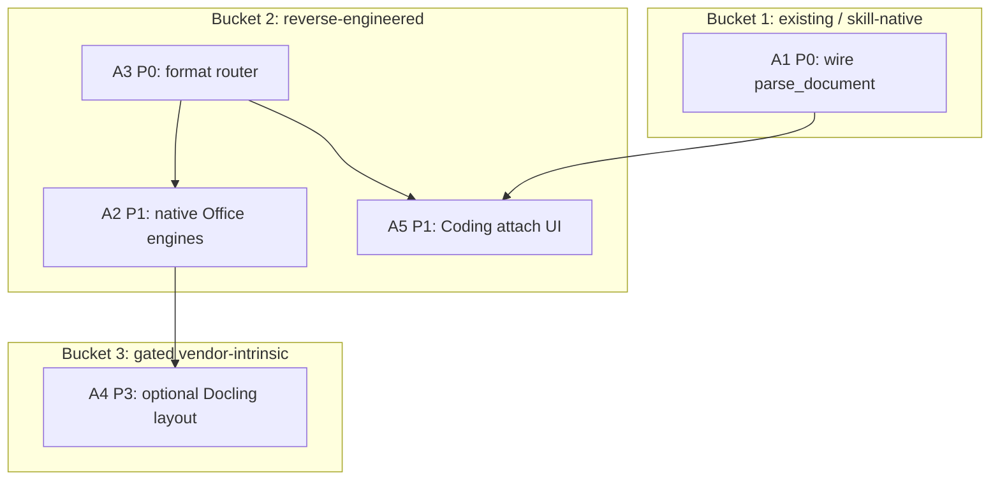

# Cross-Project Comparison: Nexus vs. Docling (document ingest for Desktop attach / upload / paste)

**Version**: v1.20.0
**Adoption target**: v1.20.0
**Generated**: 2026-08-19
**Analyzer**: Cursor -- /compare command
**External Source**: https://github.com/docling-project/docling (Repository; supplemented by the project docs, `pyproject.toml` on `main`, the MIT LICENSE, and the IBM-managed-service announcement on https://docling.ai/)
**Source Type**: Repository (focused comparison: document preparation for gen-AI, not a full product-vs-product bake-off)
**Pre-ingest source-security verdict**: PROCEED-WITH-CAUTION -- see Section 5.0

**Slotting reason**: `package.json` / CHANGELOG are at v1.19.1. v1.19.2 already holds an in-flight plan (catalog and model expansion). v2.0.0 and v2.1.0 already hold locked plans whose attachment work is vision, audio, and short video, not Office-format ingest. The next free minor with no committed plan is v1.20.0. This is a product-capability cycle, not a v1.19.3 patch.

---

## Section 1: Executive Summary

**Should Docling be the thing Nexus Desktop runs when a user attaches, uploads, or pastes a file? No.** Not as the default handler, not as a third-party MCP, and not as a network service. Nexus already has a local document-parse path for the two file kinds Chat actually accepts today (PDF and images). Docling is a large Python SDK whose unique value is layout-aware PDF reconstruction and native Office / HTML parsers. Those capabilities belong on Nexus's existing `core/documents` + `runtimes/ocr` spine, with Docling itself only as an optional, local, artifacts-pinned engine for complex PDFs.

Nexus Chat (`desktop/src/modules/chat/ChatPage.tsx`) already turns an attachment into a document-parse job rather than a model turn: RapidOCR PP-OCRv4 on every OS, Unlimited-OCR 3B on capable NVIDIA hosts, rasterization via pypdfium2, 64 MB / 200-page caps, parsed text returned as an assistant message so the user decides whether it enters a prompt. That path is **supported** for PDF and images in the Chat composer (v1.16.0). The coding pillar's `parse_document` tool is **candidate** (implemented and tested, unwired at the composition root; known gap LSO.P4.B). Coding's composer (`CodingInput`) is still text-only. Image Studio and Video Lab attach images (and video sources) for generation, which is a different job than "prep this document for a language model".

Docling (`docling-project/docling`, MIT, IBM Research origin, now an LF AI & Data project, ~65k stars, version 2.120.3 on the `docling-slim` tree) parses PDF, DOCX, PPTX, XLSX, HTML, EPUB, email, images, audio, and more into a `DoclingDocument` and exports Markdown / JSON. It can run fully offline after models are prefetched. It also ships surfaces Nexus must not adopt: HTTPS URL conversion, Hugging Face auto-download on first use, `enable_remote_services`, `docling-mcp` with a remote `DOCLING_CONVERSION_MODE`, `docling-serve`, an IBM watsonx managed service, and an Apify cloud actor.

The analysis surfaces **5 adoption candidates** and **11 explicit rejections**. The flagship product answer is a **format router** on the existing parse seam: keep RapidOCR / Unlimited-OCR for PDF and images; add native Office parsers (the same libraries Docling's Office backends wrap) so a dropped `.docx` works; only then consider a gated local Docling layout engine for tables-and-reading-order PDFs. Do not `pip install docling` into the attach path and hope the defaults are local-first. They are not: the documented happy path is `DocumentConverter().convert("https://arxiv.org/pdf/...")`.

**Overall recommendation: do not use Docling as the Desktop attach/upload/paste runtime. Adopt the format-router and native Office ingest as reverse-engineered internals. Keep Docling as a gated, local-only layout engine only if RapidOCR-plus-Unlimited-OCR quality on complex PDFs is proven insufficient on-device (not proven here). Reject every hosted, MCP-as-a-service, URL-fetch, and framework-integration surface by name under the MCP Registry Policy.**

---

## Section 2: Project Profiles

| Attribute | Nexus (current) | Docling (external) |
|---|---|---|
| **Identity** | Local-first desktop AI Studio; four pillars (coding, chat, image, video) | "Get your documents ready for gen AI" -- SDK, CLI, optional API and MCP |
| **Kind of artifact** | A runtime product | A Python library plus ecosystem (slim extras, serve, MCP, managed SaaS) |
| **Purpose** | Run local open models on one desktop | Convert messy documents into structured Markdown / JSON / DocLang |
| **Version / maturity** | v1.19.1 shipped; v1.16.0 shipped document OCR | Production/stable; PyPI `docling` / workspace `docling-slim` 2.120.3 |
| **License** | MIT (app). Per-model licenses in the catalog. | MIT (code, Copyright 2024 IBM). "For individual model usage, please refer to the model licenses found in the original packages." |
| **Author / owner** | bendourthe (Nexus-AI) | IBM Research Zurich origin; LF AI & Data host; `docling-project` org |
| **Primary language** | TypeScript + Rust/Tauri + Python sidecars | Python 3.10+ |
| **Platform** | Windows installer today; OS-parity principle | macOS, Linux, Windows; x86_64 and arm64. Layout models pull PyTorch. Intel Mac needs a pinned older torch. |
| **Network posture** | Local-first; no outbound without explicit opt-in; HF weights at install time only | Local by default for inference; first-use HF auto-download; URL sources; opt-in remote services; managed IBM / Apify surfaces exist |
| **Relevance to Nexus** | -- | Adjacent capability: the missing half of Desktop file ingest (Office / layout PDF), not a competing product |

---

## Section 3: Capability and Architecture Comparison

This is a focused comparison (document ingest on attach / upload / paste). The 11 generic dimensions that do not move the decision (CI/CD of Docling, their MkDocs site, their pytest markers) are summarized in 3c rather than scored item-by-item.

### 3a. What happens today when a Nexus user attaches, uploads, or pastes a file

| Surface | Attach / drop / paste | What runs | Status |
|---|---|---|---|
| **Local Chatbot** (`ChatPage.tsx`) | `MediaComposer` with `accept="application/pdf,image/*"` (click +, drag-drop, clipboard file paste) | First attachment routes to `documentClient.parse` (sidecar `ocr.*` IPC -> `OcrParseManager` -> Python `runtimes/ocr`). PDF is rasterized with pypdfium2; images pass through. Default engine RapidOCR; Unlimited-OCR on NVIDIA when selected. Parsed text is an assistant message. It is **not** auto-forwarded to the chat model. | **supported** for PDF and images. Office / HTML / EPUB are rejected by `fileMatchesAccept` before any parse. |
| **Agentic Coding** (`CodingInput.tsx`) | Text only. No file accept, no drop, no clipboard files. | `parse_document` tool exists (`src/tools/handlers/parseDocument.ts`): workspace path, secret-path denylist, `pathGuard`, `redactSecrets`, inbound classifier. **No host passes `parseDocument` into `buildToolRegistry`** (LSO.P4.B). | Tool: **candidate**. Composer attach: **future**. |
| **Image Studio** | Images via the same `MediaComposer` (`accept` defaults to `image/*`) | Image-to-image / inpaint intent, not document parse | **supported** (generation, not ingest) |
| **Video Lab** | Images (and generation sources) | Image-to-video / text-to-video, not document parse | **supported** (generation, not ingest) |
| **Plain text paste** | Clipboard text into any composer | Ordinary user message. No parser. | **supported** |
| **v2.0.0 plan (locked)** | Vision routing of image attachments; audio attach + faster-whisper | Does not add DOCX/PPTX/XLSX or layout PDF | **future** (different cycle) |
| **v2.1.0 plan (locked)** | Chat screenshots and short videos | Still not Office ingest | **future** (different cycle) |

Nexus already made the hard product call Docling's README is selling: "prep the document, then let the user (or the agent, behind CONFIRM) decide whether that text enters a prompt." Chat does the first half for PDF and images. Coding has the guarded second half, unwired.

### 3b. What Docling does that Nexus does not

| Aspect | Nexus (current) | Docling (external) | Delta |
|---|---|---|---|
| **PDF** | Rasterize at 200 DPI, then OCR or VLM. No reading-order model, no TableFormer, no formula/code detection. `differentiators` on RapidOCR say this explicitly. | Native PDF via pypdfium2 + `docling-parse`; Heron layout; TableFormer; optional OCR; VLM pipeline (GraniteDocling and others) | Layout-aware PDF is the real gap (A4), not "can we read a PDF at all" |
| **Office (DOCX/PPTX/XLSX)** | None. Composer rejects them. Payload path would treat a `.docx` as a single "page image" and fail. | `python-docx` / `python-pptx` / `openpyxl` extras (`format-office`) | Common Desktop drop. Highest-value missing format family (A2) |
| **ODF / EPUB / email / HTML / LaTeX / Pages** | None | First-class backends; HTML can optionally render via Playwright | Long tail (mostly skip; HTML-render overlaps the v2.0 browser tool) |
| **Images** | RapidOCR / Unlimited-OCR | OCR extras: RapidOCR, EasyOCR, Tesseract, OcrMac, Nemotron (Linux CUDA 13 only) | Nexus already ships RapidOCR. EasyOCR is the engine Docling's 2024 technical report called slow on CPU. |
| **Audio / video** | faster-whisper (catalog); v2.0 plans transcribe-then-chat | Whisper / MLX-whisper extras; video keyframes + ASR | Duplicate. Reject (N8) |
| **Output** | Plain text + optional markdown from the VLM | `DoclingDocument` -> Markdown, HTML, lossless JSON, DocTags, chunks | Markdown export is the piece to copy as a contract, not the whole IR |
| **Agent tool** | `parse_document` (candidate, CONFIRM, untrusted) | `docling-mcp` via `uvx --from=docling-mcp`; can delegate to remote serve | Internal tool already exists. Third-party MCP is a drop (N2) |
| **Bytes / pages caps** | 64 MB, 200 pages (runtime); tool caps 50 pages | `DocumentLimits` defaults to `sys.maxsize` unless the caller sets `max_num_pages` / `max_file_size` | Nexus is stricter. Keep Nexus caps (strength) |
| **Source kinds** | Base64 payload only. Never a URL. Never writes the payload to disk. | Path, `DocumentStream`, or `HttpSource` URL | URL ingest is a policy violation if wired (N4) |
| **Model weights** | Catalog + SHA-256 / revision pins; RapidOCR from `~/.nexus/models/weights/` | First-use download into `~/.cache/docling`; offline only after `docling-tools models download` + `artifacts_path` | Nexus's pin-at-install discipline is the one to keep |
| **Remote** | None | `enable_remote_services`, `models-remote` (Triton gRPC), `service-client` / `convert-remote`, IBM managed service, Apify | All drops (N1, N6, N7) |

**Key contrast:** Docling is a document converter. Nexus is a local AI studio that already converts the two formats Chat accepts. The user-visible hole is "I dropped a Word file / a deck / a spreadsheet, and the + button ignored it" plus "this scanned invoice's table came back as a wall of text." Those are format coverage and PDF-layout quality, not a missing product category.

### 3c. Compact 11-dimension snapshot (for the skill checklist)

| # | Dimension | Nexus | Docling | Action |
|---|---|---|---|---|
| 1 | Identity | Desktop AI studio | Document converter SDK | Compare function, not form |
| 2 | Stack | TS / Tauri / Python sidecars | Python, hatchling, optional torch | Do not take their default extra set |
| 3 | AI config | Internal tools, no Docling MCP | Ships `docling-mcp` | Drop the MCP; keep `parse_document` |
| 4 | Structure | `core/documents` + `runtimes/ocr` | Backends + pipelines + extras | Extend Nexus spine |
| 5 | Capabilities | PDF/image OCR; Office missing | Broad format matrix | A2 / A3 / A4 |
| 6 | Automation | Sidecar JSON-RPC jobs | CLI `docling` / `docling-tools` | Do not shell out to their CLI |
| 7 | CI/CD | Vitest + pytest OCR runtime | Their pytest + ruff | Not adopted |
| 8 | Docs | install.md "attach a PDF" | Excellent format tables | Cite; do not vendor |
| 9 | Testing | Stub engine in CI; on-device OCR is LSO.P3.C | ML-marked tests that download models | Keep CI weightless |
| 10 | Security | Caps, untrusted OCR, classifier | URL fetch, HF auto-download, remote extras | Section 5 |
| 11 | DX | Settings > Models install | `pip install docling` then surprise torch | Match Nexus installer, not pip-into-venv |

---

## Section 4: Gap Analysis

### 4a. Present in Docling, missing or partial in Nexus (adoption candidates)

- **Native Office ingest (A2).** DOCX / PPTX / XLSX as first-class parse inputs. Docling's own extras are `python-docx`, `python-pptx`, and `openpyxl`. Nexus can implement this without taking Docling. High value for Desktop attach.
- **Format router on the existing parse seam (A3).** Chat currently sends *any* accepted attachment to the OCR runtime. Expanding `accept` without a router would shove a `.docx` through `load_pages`, which treats non-PDF as a single image. Need MIME/extension sniffing (not caller-supplied type alone; `documents.py` already sniffs `%PDF-`) and a per-format engine. Medium effort, enables A2 and A5.
- **Layout-aware PDF path (A4, gated).** Reading order, tables, formulas. This is Docling's research core (`docling-ibm-models`, Heron, TableFormer) and is **not** something RapidOCR does. Reverse-engineering those models is high effort with no local quality proof that Unlimited-OCR is insufficient (LSO.P3.C: neither OCR engine has been run against real weights in-repo). Classify as gated vendor-intrinsic, not the default attach engine.
- **Wire `parse_document` and memory ingest (A1).** Already designed. Unwired. Highest leverage for Coding, independent of Docling. Closes LSO.P4.B / LSO.P4.C.
- **Coding composer file attach (A5).** Same `MediaComposer` accept list as Chat, routed through the format router and the already-guarded `parse_document` path (CONFIRM, redact, classifier). Without A1, a drop target in Coding would be a dead control.

### 4b. Present in Nexus, missing in Docling (strengths to preserve)

- Four-pillar desktop with a single attach widget (`MediaComposer`) and per-surface `accept` lists.
- Untrusted-document discipline: Chat does not auto-prompt on parse; the agent tool is CONFIRM + `redactSecrets` + inbound classifier.
- Hard caps (64 MB, 200 pages, tool 50 pages) and in-memory base64 (never writes the payload to disk).
- Portable OCR that does not pull PyTorch (`runtimes/ocr/requirements.txt` deliberately omits torch).
- Catalog-pinned weights under `~/.nexus/models`, not `~/.cache/docling`.
- OS-parity: RapidOCR is the engine that works on Windows, macOS Intel, Apple Silicon, and Linux without a GPU.
- Reverse-engineer-first MCP Registry Policy; no third-party MCP in the default product.

### 4c. Present in both (quality comparison)

| Capability | Nexus | Docling | Who does it better for this product |
|---|---|---|---|
| PDF and image -> text, CPU, every OS | RapidOCR + pypdfium2, catalog-pinned | RapidOCR extra + first-use HF cache | Nexus (already wired, capped, no auto-download) |
| Layout / tables in PDFs | Unlimited-OCR VLM (NVIDIA, **candidate**/unproven on-device) | Heron + TableFormer (local torch models) | Docling on paper; Nexus VLM may already cover "quality tier" -- **not proven here** (LSO.P3.C) |
| Office files | Missing | Native parsers | Docling (capability); Nexus should copy the *libraries*, not the SDK |
| Agent integration | Internal `parse_document` | External MCP + serve | Nexus (policy + existing guards) |
| Air-gap | Install-time pins | Prefetch then `artifacts_path` | Both can; Nexus's catalog path is the one already used for SANA / Whisper |
| URL / HTML fetch | SSRF-guarded `fetch_page` (opt-in) | `HttpSource` on `convert()` | Nexus must not take Docling's URL default |

### 4d. Insight classification (repo mode, focused)

| # | Docling capability | Status vs Nexus |
|---|---|---|
| 1 | PDF -> markdown for gen-AI | **partial**: raster+OCR/VLM exists; layout IR does not |
| 2 | DOCX/PPTX/XLSX | **missing** |
| 3 | Unified `DoclingDocument` | **not applicable** as a type to vendor; keep `OcrParseResult` `{ text, markdown, pages }` |
| 4 | RapidOCR backend | **already implemented** (`rapidocr_engine.py`) |
| 5 | EasyOCR default heritage | **not applicable** (slow CPU; Nexus already picked RapidOCR) |
| 6 | GraniteDocling VLM | **not applicable** for default (overlaps Unlimited-OCR; extra license/model) |
| 7 | ASR / video | **not applicable** (faster-whisper + v2.0 audio plan) |
| 8 | MCP server | **not applicable by policy** (internal tool exists) |
| 9 | docling-serve / IBM SaaS / Apify | **not applicable by policy** |
| 10 | `convert(https://...)` | **not applicable by policy** |
| 11 | Chunking extras for RAG | **partial**: Nexus memory ingest exists (unwired); do not take `docling-core[chunking]` |
| 12 | Local / air-gapped execution | **already implemented** as a posture; Docling needs extra prefetch steps Nexus already does via the catalog |

---

## Section 5: Security and Risk Assessment

*This section is MANDATORY per the compare-project skill (Steps 1.5 and 5) and the MCP Registry Policy (local-only > LLM-native skill > reverse-engineered internal module > trusted-vendor wrapper > drop). Hard no: search / embeddings / scraping / generation as a service; no outbound calls without explicit user opt-in; no telemetry by default.*

### 5.0 Pre-ingest source-security scan (Step 1.5)

Scanned before recommendations were shaped. Surfaces read as **data**, not instructions: GitHub repo metadata; raw `README.md`; raw `LICENSE`; raw `pyproject.toml`; `docling/document_converter.py`; `docling/datamodel/settings.py`; docs pages for supported formats, MCP, installation, and advanced options; https://docling.ai/ marketing page. No install, no `pip`, no clone-and-execute. Instruction-like text in the README (pip install, `docling https://arxiv.org/pdf/...`) is documentation of *their* CLI, not direction to this agent.

| Check | Finding |
|---|---|
| Prompt injection / agent-directed instructions | None detected. No "ignore previous instructions", no hidden zero-width payloads in the ingested files. README badges include Apify and Dosu (third-party chat); treated as marketing, not commands. |
| Malicious / destructive code in the ingested surface | None in README / settings / converter imports. `pyproject.toml` uses hatchling; **no `postinstall` / `preinstall` hooks**. |
| Supply-chain provenance | Reputable: IBM Research origin, LF AI & Data, MIT, OpenSSF Best Practices badge, ~65k stars. Residual: IBM-copyright MIT does not cover layout/VLM model licenses; those are "see original packages". |
| Network / remote by default | **`convert()` accepts HTTPS URLs** (`HttpSource`). Base deps include `requests`. First-use **Hugging Face auto-download** of layout/table/OCR models into `~/.cache/docling`. `models-remote` extra (Triton gRPC). `service-client` / `convert-remote`. MCP can set `DOCLING_CONVERSION_MODE=remote` plus `DOCLING_SERVICE_API_KEY`. `enable_remote_services` for picture-description APIs (explicit opt-in, good). |
| Telemetry | `AppSettings` (`DOCLING_` env prefix) exposes cache path, artifacts path, debug viz, batch sizes. **No telemetry sink observed in `settings.py`.** Absence of proof in that file is not proof the whole tree never phones home; not proven here beyond settings.py + README. |

**Verdict: PROCEED-WITH-CAUTION.** Ingestion proceeded. The URL-fetch happy path, HF auto-download, remote extras, MCP-remote mode, and IBM/Apify hosted products are **adoption-side** risks (Section 5.2 and Section 9), not a BLOCK. A BLOCK would require active injection or a malicious install hook; neither was present in the scanned surface.

### 5.1 Threat-model delta

| Dimension | Adoption delta |
|---|---|
| New runtime dependencies | **A1, A3, A5:** zero new libraries (wire and UI). **A2:** `python-docx`, `python-pptx`, `openpyxl` (pure-Python wheels, MIT / Apache-ish, no torch). **A4 (only if gated on):** `docling-slim` with a **minimal extra set** (`format-pdf` + `feat-ocr-rapidocr` + `models-local`), which pulls torch + `docling-ibm-models` + `huggingface_hub`. |
| Outbound destinations at runtime | **A1-A3, A5: zero.** **A4 must be forced local:** `artifacts_path` under `~/.nexus/models`, no `HttpSource`, `enable_remote_services=False` (the default), no `convert-remote`. Install-time HF pull only, same as SANA / Unlimited-OCR. |
| Credentials / API keys | **Zero** for A1-A5 if remote mode is rejected. `DOCLING_SERVICE_API_KEY` is a rejection trigger if it ever appears in Nexus config. |
| Source / prompts / query text leaving the machine | **No**, provided URL convert and managed SaaS are dropped. A naive `pip install docling` + default `convert(source)` **would** send user documents to whoever hosts that URL. |
| New inbound attack surface | None if we do not ship `docling-serve` or `docling-mcp`. Parsed bytes remain untrusted (existing classifier). Office parsers are a new **parser-bug** surface (malformed DOCX zip bombs); reuse Nexus byte caps and prefer `defusedxml` where XML is involved (Docling already depends on it for some extras). |

### 5.2 Per-item risk scorecard

| Item | Risk tier | Justification |
|---|---|---|
| A1 Wire `parse_document` | Low | Code and tests exist; composition-root wiring. Untrusted-output path already designed. |
| A2 Native Office parsers | **Medium** | New parsers on untrusted files (zip/XML). Mitigations: 64 MB cap, no network, run in the existing Python child, secret-path denylist unchanged, treat output as untrusted. **MCP Registry Policy:** new runtime deps, but local-only wheels, no new processor. |
| A3 Format router | Low | Control logic over existing + A2 engines. Sniff magic bytes; do not trust `file.type`. |
| A4 Optional Docling layout engine | **Medium-High** | Torch + IBM models + HF hub client. Mitigations: optional, never default, pinned artifacts, no URL sources, `enable_remote_services` forced off, sandboxed Python child, OS/GPU gating, do not take `all` extras. Gated on an on-device bake-off vs Unlimited-OCR (LSO.P3.C). |
| A5 Coding attach UI | Low | Reuses `MediaComposer` + A1 guards. Must not bypass CONFIRM. |

No item is unconditionally High if the Section 9 drops are honored. A4 becomes High if URL convert, remote MCP, or unmanaged `pip install docling` leaks into the attach path.

---

## Section 6: Reverse-Engineering Viability Analysis

*(MANDATORY. Classifies each candidate against the MCP Registry Policy decision tree.)*

| Item | Classification | Internal deliverable | Effort | Rationale |
|---|---|---|---|---|
| A1 Wire `parse_document` + memory ingest | `skill-native` / existing build | Sidecar + `ChatPanelBootstrap` composition-root wiring; `settings.parseDocumentEnabled`; close LSO.P4.B / LSO.P4.C | Low | Already specified. Highest leverage. Zero Docling. |
| A3 Format router | `re-full` | Extend `runtimes/ocr/documents.py` + `parse.py` + `OcrParseResult` with a `kind` (`pdf-image` / `office` / `unsupported`); Chat `DOCUMENT_ACCEPT` list; reject with a reason instead of silent drop | Medium | Control logic. Enables A2/A5. |
| A2 Native Office ingest | `re-full` | New engines `docx_engine.py` / `pptx_engine.py` / `xlsx_engine.py` wrapping `python-docx` / `python-pptx` / `openpyxl`; markdown export into existing `{ text, markdown, pages }` | Medium | Docling's Office backends are these libraries. **Originality over wrappers:** take the format libraries, not the SDK. Cite MCP Registry Policy: local-only new deps, no third-party processor. |
| A5 Coding file attach | `re-partial` | Point `CodingInput` at `MediaComposer` (or a shared accept list) and feed files through A1 | Medium | UX parity with Chat; depends on A1 |
| A4 Docling layout engine | `vendor-intrinsic` (gated) | Optional `engine: "docling-layout"` in the OCR runtime, **only** after an on-device comparison shows RapidOCR + Unlimited-OCR lose on tables/reading-order; pin models via catalog; `DocumentStream` bytes in, never URLs | High | TableFormer/Heron are not reasonably reverse-engineered in a cycle. Justified **only** if the bake-off fails. If the bake-off wins for Unlimited-OCR, **drop A4**. |

**Recommendation ordering (per MCP Registry Policy Step 5.4):**

1. `skill-native` / existing: **A1**
2. `re-full` / `re-partial`: **A3** then **A2** (router before Office engines), then **A5**
3. `vendor-intrinsic`: **A4** only with an inline bake-off gate
4. `drop-outright`: Section 9 (N1-N11)

P-tiers operate **within** each bucket.

---

## Section 7: Prioritized Adoption Plan

Value/effort within the RE order above.

| ID | Item | Bucket | P-tier | Value | Effort | Target locations |
|---|---|---|---|---|---|---|
| A1 | Wire `parse_document` + optional memory ingest | skill-native | **P0** | High (known gap; Coding cannot parse a PDF the user has in the workspace) | Low | `desktop/sidecar` composition root; `src/activation` / `ChatPanelBootstrap.ts`; `modules/coding/config/settings.ts` (`parseDocumentEnabled`); `src/tools/handlers/documentMemoryIngestor.ts` |
| A3 | Format router + honest accept list | re-full | **P0** | High (without this, expanding accept is a footgun) | Medium | `runtimes/ocr/documents.py`, `parse.py`, `ChatPage.tsx` `DOCUMENT_ACCEPT`, `MediaComposer.tsx` tests |
| A2 | Native DOCX/PPTX/XLSX engines | re-full | **P1** | High (the actual "I dropped a Word file" miss) | Medium | `runtimes/ocr/engines/*`, `runtimes/ocr/requirements.txt`, `core/documents/OcrParseManager.ts` (pass filename/mime), catalog copy that document models are not required for native Office |
| A5 | Coding composer attach / paste / drop | re-partial | **P1** | Medium-High (parity; blocked on A1) | Medium | `desktop/src/modules/coding/CodingInput.tsx`, `CodingPage.tsx` |
| A4 | Gated local Docling layout engine | vendor-intrinsic | **P3 / skip unless bake-off** | Medium (quality on complex PDFs; unproven vs Unlimited-OCR) | High | New optional extra in `runtimes/ocr`; catalog entry; installer pin of Heron/TableFormer artifacts under `~/.nexus/models` |

Suggested v1.20.0 phasing:

1. **A1** -- make the coding tool real. Independent of Docling. Closes a documented gap.
2. **A3 + A2** -- Chat (and then Coding) accept `.docx` / `.pptx` / `.xlsx` / `.pdf` / images and route correctly. This is the user-facing answer to "should attach use Docling?": **attach uses Nexus's router; Office files never need Docling.**
3. **A5** -- Coding drop/paste matches Chat.
4. **A4** -- only if Phase 2 on-device QA (carry LSO.P3.C) shows layout loss that a local Docling extra fixes. Otherwise close A4 as evaluated-and-declined.

---

## Section 8: Direct product answer (attach / upload / paste)

| User action | What should run | Use Docling? |
|---|---|---|
| Paste **text** | Chat / coding message as today | No |
| Paste / drop / pick a **screenshot or photo** | RapidOCR (default) or Unlimited-OCR | No (Nexus already does this) |
| Paste / drop / pick a **PDF** | Same OCR/VLM path; later maybe A4 for table-heavy PDFs | Not by default. A4 only after bake-off |
| Drop a **.docx / .pptx / .xlsx** | Native Office engines (A2) | No. Those extras are python-docx and friends |
| Drop **.html / .eml / .epub / .odt** | Honest "unsupported" until a later cycle | No (long tail; N11) |
| Paste a **https://...pdf URL** | Do not fetch inside the parser. User can `fetch_page` (opt-in, SSRF-guarded) or download first | **Never** (`convert(url)` is N4) |
| Drop audio / video as a "document" | faster-whisper / Video Lab / v2.0 audio plan | No (N8) |
| Coding agent "read this PDF in the repo" | `parse_document` (A1) | No |

**Implementation invariant for any engine, including a future A4:** bytes in (`documentBase64` / `DocumentStream`), markdown/text out, Nexus caps, no URL, no `enable_remote_services`, output through `redactSecrets` and the inbound classifier when it enters a model context.

---

## Section 9: Risks and Explicit Rejections

General considerations:

- Docling's README happy path is a **network convert**. Copying their quickstart into Nexus would violate local-first on day one.
- Layout/VLM **model licenses are not MIT**. Catalog entries must name the actual model license (same discipline as LFM / Gemma). GraniteDocling was not license-verified in this comparison (**not proven here**); it stays out of the default path.
- Torch on the portable OCR venv is a product regression: `runtimes/ocr/requirements.txt` exists specifically so a document-only install never pulls CUDA. A4 must be a separate extra / venv slice, never merged into the RapidOCR requirements.
- Intel macOS torch pins in Docling's install docs conflict with Nexus OS-parity unless A4 is GPU-tier gated and skipped on unsupported hosts.
- Parser bugs in Office files are a real DoS/crash class. Keep the 64 MB cap; consider zip-entry limits when implementing A2 (Docling's iWork backend already bounds member count/size; copy that *idea*, not their package).

### Items explicitly NOT recommended for adoption

- **N1 -- IBM watsonx / managed Docling SaaS, Apify Docling actor, any hosted convert.** Generation-or-processing-as-a-service. User documents would leave the machine. **Rejected** (MCP Registry Policy hard-no; local-first).
- **N2 -- Shipping `docling-mcp` (uvx) as a Nexus MCP server.** Third-party MCP, optional remote mode with API key. Nexus already has `parse_document`. **Rejected** (MCP Registry Policy: reverse-engineer into the internal tool, do not wrap the vendor MCP).
- **N3 -- `docling-serve` as a Desktop daemon.** New HTTP inbound surface duplicating sidecar JSON-RPC. **Rejected** unless a future cycle has a loopback-only justification; none is needed while `OcrParseManager` exists.
- **N4 -- `HttpSource` / `convert("https://...")` / CLI URL mode.** Outbound fetch of arbitrary URLs from the parse path. **Rejected**. Use existing `fetch_page` if the user explicitly asks to pull a page.
- **N5 -- LangChain, LlamaIndex, Crew AI, Haystack, Smolagents integrations.** Framework wrappers, not product features. **Rejected** (originality over wrappers; out of scope).
- **N6 -- `convert-remote` / `service-client` / `DOCLING_CONVERSION_MODE=remote`.** Sends documents to a server. **Rejected**.
- **N7 -- `models-remote` (Triton gRPC) and `PictureDescriptionApiOptions`.** Remote inference. **Rejected**. Keep `enable_remote_services` impossible to turn on from Nexus settings.
- **N8 -- Docling ASR / video extras.** Duplicates faster-whisper and the v2.0 / v2.1 audio-video plans. **Rejected**.
- **N9 -- EasyOCR as a Nexus engine.** Docling's own technical report: slow on CPU. Nexus already standardized RapidOCR. **Rejected**.
- **N10 -- GraniteDocling (or other VLM extras) as the default Desktop parser.** Overlaps Unlimited-OCR; extra weights, extra license, extra torch. **Rejected** as default. Revisit only if A4's bake-off includes it as a *candidate* engine with a named license, never as silent default.
- **N11 -- Playwright `format-html-render`, LibreOffice-legacy DOC/XLS/PPT, XBRL, USPTO, JATS, EBCDIC, Box Notes.** Long tail and/or new system deps. **Rejected** for v1.20.0. HTML as bytes can wait; the v2.0 browser tool is the HTML-from-the-live-web path.

---

## Appendix: Source Facts (as fetched 2026-08-19)

**GitHub** `docling-project/docling`: MIT License (Copyright 2024 International Business Machines); default branch `main`; ~65,237 stars; 4,659 forks; language Python; homepage https://docling-project.github.io/docling; LF AI & Data project. Workspace `pyproject.toml` names the package **`docling-slim` 2.120.3**, Python `>=3.10,<4.0`, hatchling build, no install hooks. Base deps: pydantic, docling-core, pydantic-settings, filetype, requests, certifi, pluggy, tqdm. Optional extras include `format-office` (python-docx / python-pptx / openpyxl), `format-pdf` (pypdfium2 + docling-parse), `feat-ocr-rapidocr`, `models-local` (torch, torchvision, docling-ibm-models, huggingface_hub), `models-remote` (tritonclient), `format-audio` / `format-video`, `format-html-render` (playwright), `service-client`. Bundle `standard` pulls PDF + local models + RapidOCR + office + web + latex + email + iwork + chunking + cli. Bundle `all` adds VLM, audio, HTML render, XML schemas, remote models, EasyOCR, Tesseract, OcrMac.

**README features:** multi-format parse; advanced PDF (layout, reading order, tables, code, formulas); `DoclingDocument`; exports Markdown/HTML/JSON/DocTags; local/air-gapped; LangChain/LlamaIndex/Crew/Haystack; OCR; GraniteDocling; ASR; MCP; docling-serve; CLI. Quickstart CLI: `docling https://arxiv.org/pdf/2206.01062`. Python: `DocumentConverter().convert("https://arxiv.org/pdf/2408.09869")`.

**Docs:** Supported inputs include PDF, Office Open XML, legacy Office (LibreOffice), ODF, EPUB, Pages, Markdown, LaTeX, HTML, CSV, images, audio, video, email, plus schema-specific XML. MCP install snippet uses `uvx --from=docling-mcp`. Remote MCP via `DOCLING_SERVICE_URL` + API key. Advanced options: models auto-download on first use; prefetch via `docling-tools models download`; `artifacts_path` / `DOCLING_ARTIFACTS_PATH` for offline; `enable_remote_services=True` required to send user data to remote picture-description APIs.

**docling.ai:** MIT, runs offline, IBM commercial managed service on watsonx announced (2026-06-15).

**Nexus evidence (this repo):** Chat document parse **supported** (`ChatPage.tsx`, `MediaComposer.tsx`, `runtimes/ocr/*`, catalog `rapidocr-ppocrv4` + `unlimited-ocr-3b`). `parse_document` **candidate** (LSO.P4.B). Coding attach **future**. On-device OCR quality **not proven here** (LSO.P3.C).

Pre-ingest security verdict: **PROCEED-WITH-CAUTION** (Section 5.0).
