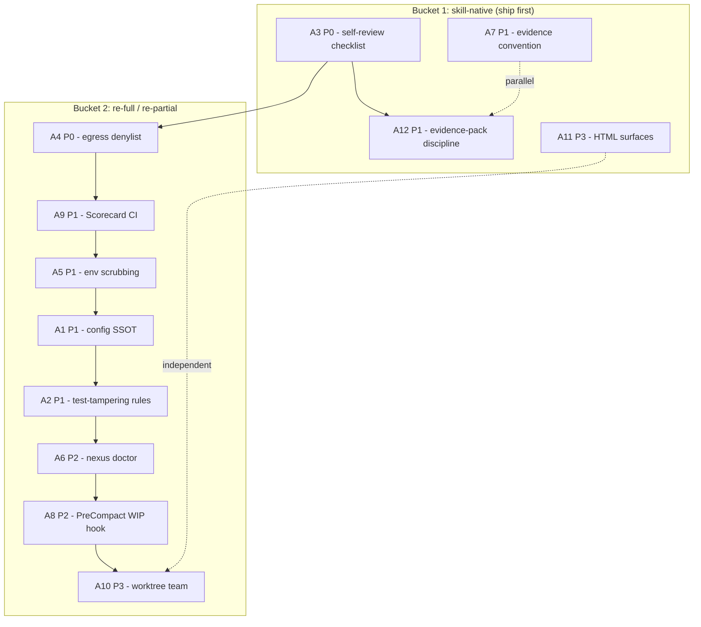

# Cross-Project Comparison: Nexus vs. claude-code-harness

**Version**: v1.3.0
**Generated**: 2026-05-30
**Analyzer**: Claude Code -- compare-project command
**External Source**: https://github.com/Chachamaru127/claude-code-harness
**Source Type**: Repository

---

## Section 1: Executive Summary

This report compares **Nexus** (this repo: a local-first desktop AI Studio with four pillars, formerly Gemma Code) against **claude-code-harness** (an external Plan/Work/Review/Release delivery harness for Claude Code, with bounded paths for Codex, OpenCode, and Cursor). The two projects overlap only on a narrow seam: the agent-governance layer (guardrails, hooks, permissions, disciplined workflow skills). Most of Nexus (the runtime, memory subsystem, image/video/chat pillars, in-process MCP servers) has no counterpart in the harness, and most of the harness (multi-CLI plugin distribution, a Go-native guardrail binary, bilingual docs) is out of scope for, or actively conflicts with, Nexus's design.

The analysis surfaces **12 adoption candidates** and **8 explicitly-rejected items**. The candidates cluster around safety hardening (test-tampering detection, network-egress denylist, subprocess env scrubbing, a config SSOT that generates safety files) and workflow discipline (a pre-commit self-review checklist, evidence-pack discipline, a non-destructive `doctor` inventory, the "not_observed != absent" evidence convention). Critically, claude-code-harness is itself local-first and zero-outbound at its core, so adopting its **patterns** introduces essentially no new trust surface: most candidates are `skill-native` or `re-full` under the MCP Registry Policy, and the few outbound-touching skills it ships (notebookLM, deploy, auth, harness-mem) are dropped outright.

**Overall recommendation: selectively adopt.** Nexus is already more hardened than the harness in several dimensions (permission tiers with floor-clamping, SSRF guard with per-hop DNS re-validation, mutation testing, four-layer hybrid-retrieval memory). The valuable imports are a handful of safety rules and workflow conventions, not the harness's architecture. Adopt the patterns; do not adopt the Go engine, the per-CLI plugin trees, or the vendor skills.

---

## Section 2: Project Profiles

| Attribute | Nexus (current) | claude-code-harness (external) |
|---|---|---|
| **Identity** | Local-first desktop AI Studio; "Your Local AI Studio. Four Pillars, One Desktop, Zero Tokens Billed." | Disciplined delivery loop for Claude Code; "Plan. Work. Review. Ship." |
| **Purpose** | A runtime product: agentic coding + chat + image + video, all on local open-source models | A workflow harness/plugin that wraps an existing agent CLI with a contract-driven operating loop |
| **Version** | v1.3.0 active cycle (package.json `0.43.0` via semantic-release; product line uses v1.x docs versioning) | 4.13.2 (`VERSION`, `harness.toml`) |
| **License** | MIT (`LICENSE`) | MIT, dual-language (`LICENSE.md` + `LICENSE.ja.md`) |
| **Author/Owner** | bendourthe (Nexus-AI) | Chachamaru (`harness.toml [project.author]`) |
| **Maturity** | Mature multi-cycle product; v1.0.0 - v1.2.0 shipped, v1.3.0 in progress | Mature harness at Phase 35+ (Go rewrite); 4.x line |
| **Scale** | Large: `core/`, `modules/`, `src/`, `desktop/` (Tauri+React), Python installer | Medium: Go engine + ~130 bash scripts + 35 markdown skills |
| **Primary language** | TypeScript (+ Rust/Tauri, Python installer) | Go (`go/`, go 1.25) + Bash + Markdown skills |
| **Distribution** | VS Code extension (`nexus-coding`) + native desktop app | Claude Code plugin marketplace + per-CLI setup scripts |
| **Network posture** | Local-first; no outbound runtime calls without explicit opt-in | Local-first; zero-outbound core; a few opt-in vendor skills |
| **Companion repo** | Nexus-Hub (the skill catalog Nexus consumes upstream) | harness-mem (optional cross-session memory daemon) |

---

## Section 3: Technology Stack Comparison

| Layer | Nexus (current) | claude-code-harness (external) | Notes |
|---|---|---|---|
| **Core language** | TypeScript (Node 20+) | Go 1.25 (`go/go.mod`) + Bash | Fundamentally different engine language |
| **Shell/UI** | Tauri 2.x + React 19 + Vite + Tailwind v4 (`desktop/`) | None (CLI harness only) | Nexus ships a GUI; harness does not |
| **Guardrail engine** | TypeScript: `src/guardrails/PermissionTiers.ts`, `scripts/hooks/*.mjs` (Node ESM, zero deps) | Go: `go/internal/guardrail/` compiled to `bin/harness` | Same job, different runtime |
| **Config format** | `package.json` settings + scattered config in `configs/` | Single `harness.toml` SSOT -> `bin/harness sync` generates plugin files | Harness has a tighter config story |
| **Inference** | Ollama / LM Studio (local Gemma 4, Llama 3, Qwen, SANA, video models) | N/A (delegates to host CLI's model) | Nexus is the model runtime; harness is model-agnostic |
| **Persistence** | SQLite (`better-sqlite3`) + FTS5; `~/.nexus/` | SQLite (`modernc.org/sqlite`, pure Go) + JSONL session logs | Both local SQLite |
| **Package mgmt** | npm; uv/pip (installer); cargo (Tauri) | Go modules; detects npm/bun/pnpm/yarn for project commands | -- |
| **Build** | `tsc`, `tauri build`, PyInstaller | `go build` -> committed `bin/harness-*` binaries (darwin amd64/arm64, linux amd64, windows amd64) | Harness commits prebuilt binaries to the repo (see N5) |
| **Go tooling** | None in repo (AGENTS.md lists Go commands aspirationally; no `*.go`, no `go.mod`) | Native (`go/cmd`, `go/internal`, `go/pkg`, `Makefile`, `test-e2e.sh`) | Adopting the Go engine itself is rejected (N7) |

---

## Section 4: AI Assistant Configuration Comparison

This is the highest-signal section: it is the only dimension where both projects do comparable work.

| Aspect | Nexus (current) | claude-code-harness (external) |
|---|---|---|
| **Config philosophy** | Deliberately agent-agnostic. Ships agent-neutral artifacts and *scripts*, not agent-specific config. `AGENTS.md` is the single directive; `docs/harness-integration.md` documents per-agent wirings the user opts into. | Multi-CLI plugin model. `harness.toml` is the SSOT; `bin/harness sync` generates `.claude-plugin/`, `.codex-plugin/`, `.cursor-plugin/` manifests. |
| **Tracked agent dirs** | `.claude/agents/` (4 files), `.claude/commands/` (1 file). No `.claude/skills/`. Everything else under `.claude/` is gitignored personal config. | `.claude-plugin/` (`plugin.json`, `marketplace.json`, `settings.json`, `hooks.json`), `.codex-plugin/`, `.cursor-plugin/`, `.cursor/`, plus `.claude/` runtime state + `.claude/rules/`. |
| **Agents** | `pr-manager.md`, `pr-manager-lite.md`, `taskmaster.md`, `hooks-over-prompts-inventory.md` (reference doc) | `agents/worker.md`, `agents/reviewer.md`, `agents/advisor.md` (the Breezing team) |
| **Commands/skills surface** | Slash commands consumed from Nexus-Hub (the external catalog: 203 skills, 36 commands, 14 hooks). Nexus itself ships only `ship-and-babysit.md`. | 35 skills under `skills/` + 3 Codex variants under `skills-codex/`. The 5 verbs (plan/work/review/sync/release + setup) are slash commands backed by skills. |
| **Hook system** | 4 Node ESM guardrail scripts (`scripts/hooks/`) wired per-agent by the user; in-process `core/lifecycle/HookBus.ts` (13-event bus) inside the runtime. | `.claude-plugin/hooks.json` registers ~17 hook event types, each dispatching to `bin/harness hook <event>` (Go) or a Haiku agent. |
| **Settings generation** | `scripts/generate-tool-permission-table.mjs` regenerates a permission doc from `PermissionTiers.ts`; CI gate `perm-tier:check`. | `harness sync` regenerates all plugin manifests + `settings.json` deniedDomains/permissions from `harness.toml`; direct `settings.json` edits are denied. |

**Key contrast:** Nexus and the harness sit at opposite ends of the same axis. Nexus refuses to bundle agent-specific config (by design, per `docs/harness-integration.md`: "Bundling a `.claude/settings.local.json` would imply Claude Code is the supported agent, which it is not"). The harness embraces a per-CLI plugin tree generated from one SSOT. The adoptable insight is the **SSOT-generates-safety-files pattern** (Section 5a, item A1), not the per-CLI plugin trees (rejected as N8).

---

## Section 5: Skills and Capabilities Gap Analysis

### 5a. Present in External, Missing in Current (adoption candidates)

Grouped by capability category. Nexus consumes its general workflow skills from Nexus-Hub, so "missing" here means missing from both Nexus and (where checked) the Nexus-Hub catalog's coverage of this specific behavior.

**Safety / guardrail behaviors**
- **Test-tampering detection** (`go/internal/guardrail/tampering.go`, rules T01-T12; README acknowledges "Beagle - Test tampering prevention patterns"). Detects skipped tests, hardcoded results, disabled checks, falsified evidence. Nexus has verification gating (`passStateGating`) but no explicit anti-tampering rule family.
- **Network-egress denylist** (`harness.toml [safety.sandbox.network] deniedDomains`): cloud-metadata endpoints (169.254.169.254, metadata.google.internal, metadata.azure.com) plus paste/file-host sites (pastebin.com, transfer.sh, 0x0.st, paste.ee, termbin.com, ix.io). Nexus's SSRF guard (`src/utils/ssrf.ts`) blocks private/loopback ranges but has no named exfil-destination denylist.
- **Subprocess env scrubbing** (`harness.toml [env] CLAUDE_CODE_SUBPROCESS_ENV_SCRUB = "1"`): strips sensitive env vars from child processes. Nexus redacts secrets in memory writes (`core/observability/redactSecrets.ts`) but does not scrub the env handed to `run_terminal` subprocesses.

**Workflow / discipline behaviors**
- **Worker self-review checklist before commit** (`harness.toml [worker.self_review] default_rules`): `dry-violation-none`, `plans-cc-markers-untouched`, `all-declared-symbols-called`, `dod-items-verified-with-evidence`, `no-existing-test-regression`, `tdd-red-evidence-attached`. A concrete pre-commit gate with evidence requirements.
- **Evidence-pack discipline** (`docs/evidence/work-all.md`, `harness-release` skill): only verified output is packaged for PR/release; "PR ready is not release ready".
- **"not_observed != absent" evidence philosophy + support-tier matrix** (`docs/distribution-scope.md`, `docs/tool-capability-matrix.md`): claims are tied to local proof; capability tiers (supported / internal-compatible / candidate / future) are explicit.

**Tooling / DX behaviors**
- **Non-destructive migration/inventory** (`bin/harness doctor --migration-report`): inventories stale caches, duplicate skills, old symlinks, memory state without deleting anything.
- **PreCompact WIP-detection + state checkpoint** (`hooks.json` PreCompact -> Go save + Haiku WIP detection; PostCompact restore): warns on in-flight work before context compaction.
- **OpenSSF Scorecard CI** (`.github/workflows/scorecard.yml`): supply-chain posture scoring. Nexus runs CodeQL but not Scorecard.
- **Worktree-isolated parallel agent team (Breezing)** (`agents/worker.md` + `go/internal/breezing/`): each parallel agent runs in its own git worktree.
- **Cognitive-load HTML surfaces** (`harness-plan-brief`, `harness-progress`, `harness-accept`): stakeholder-facing HTML for plan briefs, progress, and acceptance decisions.

### 5b. Present in Current, Missing in External (strengths to preserve)

- **Four-layer memory + hybrid retrieval** (`core/memory/MemoryHub.ts`, BM25 + dense + graph via RRF k=60, local `all-MiniLM-L6-v2` embedder). The harness's optional `harness-mem` is a simpler JSONL/HTTP daemon.
- **In-process codegraph MCP** (`core/codegraph/mcp/CodeGraphMcpServer.ts`, 8 symbol/call-edge tools + file enumerator) and **LSP MCP** (`core/coding/lsp/LspMcpServer.ts`). No equivalent in the harness.
- **Permission tiers with floor-clamping** (`src/guardrails/PermissionTiers.ts`, tiers 0/1/2; confirmation-tier tools cannot be silently dropped to auto-approve). More granular than the harness's allow/ask/deny lists.
- **SSRF guard with per-hop DNS re-validation** (`src/utils/ssrf.ts`): re-validates on every redirect hop. Stronger than a static domain denylist.
- **Mutation testing** (`configs/stryker.config.json`) and a **golden-task evaluation suite** (`tests/golden/`, Ollama-backed). No mutation/eval harness in the external project.
- **The product runtime itself**: image (SANA), video (SANA-Video), chat pillars, GPU scheduler, cross-OS installer. Entirely out of the harness's scope.

### 5c. Present in Both, Quality Comparison

| Capability | Nexus | claude-code-harness | Who does it better |
|---|---|---|---|
| Plan -> implement -> review -> ship workflow | Nexus-Hub skills (`generate-plan`, `implement-phase`, `review-codebase`, `shipping-and-launch`) + `docs/versions/<v>/` discipline | Tight 5-verb surface (plan/work/review/sync/release) + `spec.md`/`Plans.md` SSOT + team_validation_mode | Comparable; harness has a tighter, more opinionated surface (Section 10) |
| Secret-path denylist | `core/observability/redactSecrets.ts` + `pathGuard.ts` (realpath-aware, symlink-safe) | `harness.toml [safety.sandbox.filesystem] denyRead` | Nexus (runtime-enforced, symlink-aware) |
| Deterministic pre-commit checks | `bin/nexus-check.mjs` (LLM-free rule CLI) + husky pre-push | Go guardrail R-rules + `scripts/ci/check-consistency.sh` | Comparable |
| Branch-control-plane guard | `scripts/hooks/check-git-control-plane.mjs` (refuses main/master, dirty-file cap) | `harness.toml protectedBranchPush = "ask"` | Nexus (richer policy) |
| Conventional commits + release automation | commitlint + semantic-release (`.releaserc.json`) | `harness-release` skill + `release.yml` | Comparable |

---

## Section 6: Commands and Automation Comparison

### 6a. Commands Gap

| Item | Nexus | claude-code-harness | Adoption relevance |
|---|---|---|---|
| Workflow verbs | Many granular Nexus-Hub commands (`/generate-plan`, `/implement-phase`, `/review-codebase`, `/run-deep-review`, ...) | 6 tight verbs (`/harness-setup`, `/harness-plan`, `/harness-work`, `/harness-review`, `/harness-sync`, `/harness-release`) | Structural note (Section 10), not a discrete adoption |
| Doctor / inventory | None | `bin/harness doctor --migration-report` | Adopt as `nexus doctor` (A6) |
| Sync command | `nexus skills sync` (catalog sync) | `bin/harness sync` (regenerate manifests from SSOT) | Pattern feeds A1 |
| Config SSOT | Scattered (`package.json` + `configs/`) | `harness.toml` + sync | Adopt SSOT-for-safety (A1) |

### 6b. CI/CD and Hooks Gap

| Item | Nexus | claude-code-harness | Adoption relevance |
|---|---|---|---|
| CI workflows | 13 (`ci.yml`, `codeql.yml`, `coverage-diff.yml`, `golden-tasks.yml`, `installer-*`, `pr-quality.yml`, `release.yml`, `semantic-release.yml`, `shell-build.yml`, ...) | 7 (`benchmark.yml`, `codeql.yml`, `opencode-compat.yml`, `release.yml`, `scorecard.yml`, `smoke-install.yml`, `validate-plugin.yml`) | Adopt `scorecard.yml` (A9) |
| Security SAST | CodeQL | CodeQL + OpenSSF Scorecard | Scorecard is the gap |
| Guardrail hooks | 4 Node ESM scripts (tool-permission, git-control-plane, prompt-policy, commit-msg) | ~17 hook event types via `hooks.json` -> Go | Adopt PreCompact WIP hook (A8) |
| Pre-commit | husky pre-push (lint/build/check) + commit-msg ASCII gate | `.githooks/` + `scripts/hooks/install-git-hooks.sh` | Adopt self-review checklist (A3) |
| Test-tampering CI gate | None explicit | T01-T12 in Go engine | Adopt as nexus-check rules (A2) |

---

## Section 7: Documentation and Developer Experience Comparison

| Dimension | Nexus | claude-code-harness |
|---|---|---|
| **README quality** | Strong: four-pillar narrative, Nexus/Nexus-Hub seam diagram, per-cycle status tables | Strong: operating-loop hero image, Quickstart, "First 15 Minutes", per-tool install tiers, support-boundary section |
| **Onboarding** | `AGENTS.md` + `docs/harness-integration.md` (opt-in wiring examples) | `docs/onboarding/index.md` (tool-first), `migration.md`, `skill-trigger-acceptance.md` |
| **Version docs** | Rigorous: `docs/versions/v1/<v>/` with plans, benchmarks, known-gaps, RELEASE_NOTES; archive subtree | `docs/` flat-ish with `MIGRATION-v4.md`, phase docs, evidence packs |
| **Capability/support claims** | Implicit | Explicit tier matrix (`docs/tool-capability-matrix.md`) + "not_observed != absent" (A7) |
| **Bilingual** | English only | English + Japanese (README_ja.md, LICENSE.ja.md, skill `-ja` frontmatter) -- rejected for Nexus (N6) |
| **Setup automation** | Cross-OS installer (Tauri + PyQt) | Per-tool setup scripts (`setup-codex.sh`, `setup-opencode.sh`, `setup-cursor.sh`) -- rejected (N8) |
| **Stakeholder surfaces** | None | HTML Plan Brief / Progress / Acceptance (A11) |

---

## Section 8: Testing and Security Posture Comparison

| Dimension | Nexus | claude-code-harness |
|---|---|---|
| **Test runner** | Vitest (`configs/vitest.config.ts`) | Bash smoke suites + Go tests (`go/test-e2e.sh`) + `core` npm test |
| **Test types** | Unit (`tests/unit/`), integration, e2e, golden-task eval (`tests/golden/`), benchmarks (`tests/benchmarks/`) | Smoke, integration (`tests/integration/`), unit (`tests/unit/`), fixtures |
| **Mutation testing** | Stryker (`configs/stryker.config.json`), high=80% | None |
| **Coverage gate** | `coverage-diff.yml`; `--coverage` artifacts | `npm test` in `core` |
| **Test-tampering prevention** | None explicit (gap A2) | T01-T12 in Go guardrail + `no-existing-test-regression` self-review rule |
| **Permission model** | Tiers 0/1/2 with floor-clamping (`PermissionTiers.ts`) | allow/ask/deny lists (`harness.toml [safety.permissions]`) |
| **Secret protection** | `redactSecrets.ts` + `pathGuard.ts` (symlink-aware) + per-call `allow_secrets` override | `denyRead` glob list + `settings.json` deny |
| **Network/SSRF** | DNS-resolving SSRF guard, per-hop redirect re-validation | Static `deniedDomains` exfil list (gap A4) |
| **Subprocess hardening** | run_terminal allowlist + blocklist; all terminal = DANGEROUS tier | env scrubbing via `CLAUDE_CODE_SUBPROCESS_ENV_SCRUB` (gap A5) |
| **Supply-chain** | CodeQL, semantic-release | CodeQL + OpenSSF Scorecard (gap A9); commits prebuilt binaries (anti-pattern N5) |
| **Security policy** | `SECURITY.md` (supported versions, disclosure timeline) | `SECURITY.md` + `.claude/rules/` policy docs |

---

## Section 9: Security and Risk Assessment

(MANDATORY -- gates Section 11 adoption recommendations. References the `AGENTS.md` MCP Registry Policy decision tree throughout.)

### 9.1 Threat Model Comparison

| Dimension | Nexus (current) | claude-code-harness (external) | Adoption delta |
|---|---|---|---|
| New runtime dependencies introduced | -- | Go engine, ~130 bash scripts | **Zero.** We adopt patterns, not the engine; candidates are implemented in existing TS/Node. |
| Outbound-call destinations at runtime | None without opt-in | None in core; opt-in skills (notebookLM -> Google, deploy -> Vercel/AWS, auth -> Clerk/Supabase) | **Zero.** Outbound-touching skills are all dropped (N1-N3). |
| Credentials / API keys required | None | None for core; vendor skills require their own keys | **Zero.** No candidate requires a key. |
| Source / prompts / query text leaves machine | No | No (core) | **Zero.** All candidates are local-only safety/workflow patterns. |
| New commercial third-party relationship | No | No (core) | **Zero.** |

The harness core is local-first and zero-outbound, identical to Nexus's posture. Every adoption candidate **reduces** risk (more guardrails) or is purely local workflow tooling. The only trust concerns are the vendor skills and the committed binaries, all of which are rejected.

### 9.2 Per-Item Risk Scorecard

| Item | Risk tier | Justification |
|---|---|---|
| A1 Config SSOT -> generated safety files | Low | New generator code touching settings; bounded, internal, no outbound. |
| A2 Test-tampering detection rules | Low | New nexus-check rules; read-only static analysis. |
| A3 Worker self-review checklist | None | A documented checklist/skill; no code execution risk. |
| A4 Network-egress denylist | None | Strictly tightens the existing SSRF guard. |
| A5 Subprocess env scrubbing | Low | Reduces env exposure to child processes; could break a command that needs a scrubbed var (mitigated by allowlist). |
| A6 `nexus doctor` inventory | None | Read-only, non-destructive by contract. |
| A7 "not_observed != absent" doc convention | None | Documentation convention only. |
| A8 PreCompact WIP hook | Low | New lifecycle hook; in-process, no outbound. |
| A9 OpenSSF Scorecard CI | Low | Adds a CI workflow; reads repo metadata only. |
| A10 Worktree-isolated parallel team | Medium | Concurrent git worktrees + parallel agents add orchestration complexity and disk cost. |
| A11 Cognitive-load HTML surfaces | None | Local HTML generation; no outbound. |
| A12 Evidence-pack discipline | None | Process/convention; no code risk. |

No item is rated High, so none is gated on Section 9.3 viability before reaching Section 11.

### 9.3 Reverse-Engineering Viability Analysis

| Item | Classification | Internal deliverable (if any) | Effort | Rationale |
|---|---|---|---|---|
| A1 Config SSOT | `re-full` | `nexus.security.toml` (or extend existing config) + generator extending `scripts/generate-tool-permission-table.mjs` | Medium | Pure config + codegen; fully local. MCP Registry Policy bucket 3 (reverse-engineer into internal artifact). |
| A2 Test-tampering rules | `re-full` | New rules in `lib/checks/` consumed by `bin/nexus-check.mjs` | Medium | Static checks reproducible in TS; no external logic. |
| A3 Self-review checklist | `skill-native` | A pre-commit/pre-PR checklist skill (or Nexus-Hub skill) | Low | Achievable by instructing the agent; MCP Registry Policy bucket 2. |
| A4 Egress denylist | `re-full` | Extend `src/utils/ssrf.ts` + the egress settings list | Low | A static denylist merged into existing guard. |
| A5 Env scrubbing | `re-full` | Extend `RunTerminalTool` to scrub child env | Low-Medium | Local code change; no external dependency. |
| A6 `nexus doctor` | `re-full` | New `nexus doctor` CLI subcommand | Medium | Local filesystem inventory; reproducible. |
| A7 Evidence convention | `skill-native` | Docs convention + a known-gaps/support-tier note | Low | Pure instruction/convention. |
| A8 PreCompact WIP hook | `re-full` | New handler on `core/lifecycle/HookBus.ts` PreCompact event | Medium | In-process hook; Nexus already has the bus. |
| A9 Scorecard CI | `re-full` | `.github/workflows/scorecard.yml` | Low | Standard OpenSSF action; config only. |
| A10 Worktree team | `re-partial` | Extend `SubAgentManager` with optional worktree isolation; document the gap vs full Breezing | High | Partially reproducible; full team orchestration is large. Ship isolation, defer orchestration. |
| A11 HTML surfaces | `skill-native` | A reporting skill that emits local HTML | Medium | Agent-generatable; no external service. |
| A12 Evidence-pack discipline | `skill-native` | Extend the shipping/release skill checklist | Low | Process convention. |

### 9.4 Recommendation Ordering

Per MCP Registry Policy, candidates are ordered before they enter Section 11:

1. **`skill-native` first** (zero-code replacements): A3 (self-review checklist), A7 (evidence convention), A12 (evidence-pack discipline), A11 (HTML surfaces).
2. **`re-full` / `re-partial` next** (internal builds): A4 (egress denylist), A9 (Scorecard CI), A5 (env scrubbing), A1 (config SSOT), A2 (test-tampering rules), A6 (`nexus doctor`), A8 (PreCompact WIP hook), A10 (worktree team).
3. **`vendor-intrinsic`**: none qualify (no candidate has an intrinsic third-party destination worth adopting).
4. **`drop-outright`**: N1-N8 -> Section 13.

This ordering structures Section 11. Priority tiers (P0-P3) operate *within* each RE bucket, not across it.

---

## Section 10: Structural and Architectural Differences

- **Product vs harness.** Nexus is a runtime that *contains* an agent loop; claude-code-harness is a thin discipline layer that *wraps* someone else's agent loop. They are not the same kind of artifact, which is why most dimensions do not map one-to-one.
- **Agent-agnostic-by-omission vs SSOT-generates-everything.** Nexus deliberately ships no agent-specific config and documents opt-in wirings (`docs/harness-integration.md`). The harness generates a per-CLI plugin tree from `harness.toml`. The adoptable middle ground is a config SSOT for *safety* surfaces (A1) without committing to per-CLI plugin distribution.
- **Tight verb surface vs granular command catalog.** The harness exposes 6 verbs; Nexus (via Nexus-Hub) exposes dozens of granular commands. The harness's opinionated `spec.md`/`Plans.md` SSOT with `team_validation_mode` is a coherent pattern worth noting, but Nexus's per-version `docs/versions/<v>/` discipline already covers the same ground differently.
- **Compiled-binary distribution vs source build.** The harness commits prebuilt cross-platform Go binaries (`bin/harness-*`). Nexus builds from source. Adopting binary-commit would be a regression for Nexus (N5).
- **Language split.** The harness is mid-migration from TypeScript to Go for its engine. Nexus's engine is TS with a Rust shell. Rebuilding harness patterns in Go is rejected (N7); reimplement the *behaviors* in Nexus's existing stack.

---

## Section 11: Adoption Plan

Organized per Section 9.4 ordering (skill-native, then re-full/re-partial), then by priority tier within each bucket.

### Bucket 1 -- skill-native (ship first, zero new code paths)

| What | Source | Target | Effort | Dependencies | Risk |
|---|---|---|---|---|---|
| **A3 (P0)** Pre-commit/pre-PR self-review checklist (DRY, all-symbols-called, DoD-verified-with-evidence, no-test-regression) | `harness.toml [worker.self_review]` | New skill or `docs/` checklist; optionally enforced by husky pre-push | Low | None | None |
| **A7 (P1)** "not_observed != absent" evidence + support-tier convention | `docs/distribution-scope.md`, `docs/tool-capability-matrix.md` | `docs/versions/v1/v1.3.0/` convention + known-gaps wording | Low | None | None |
| **A12 (P1)** Evidence-pack discipline (verified-only for PR/release) | `docs/evidence/work-all.md`, `harness-release` | Extend `shipping-and-launch` usage + release checklist | Low | A3 | None |
| **A11 (P3)** Stakeholder HTML surfaces (plan brief / progress / acceptance) | `harness-plan-brief`, `harness-progress`, `harness-accept` | New reporting skill emitting local HTML | Medium | None | None |

### Bucket 2 -- re-full / re-partial (build internal equivalents)

| What | Source | Target | Effort | Dependencies | Risk |
|---|---|---|---|---|---|
| **A4 (P0)** Network-egress denylist (cloud-metadata + paste-site endpoints) | `harness.toml [safety.sandbox.network] deniedDomains` | `src/utils/ssrf.ts` + egress settings | Low | None | None |
| **A9 (P1)** OpenSSF Scorecard CI workflow | `.github/workflows/scorecard.yml` | New `.github/workflows/scorecard.yml` | Low | None | Low |
| **A5 (P1)** Subprocess env scrubbing for run_terminal | `harness.toml CLAUDE_CODE_SUBPROCESS_ENV_SCRUB` | `RunTerminalTool` child-env scrub + allowlist | Low-Med | None | Low |
| **A1 (P1)** Config SSOT that generates safety files | `harness.toml` + `bin/harness sync` | `nexus.security.toml` + extend `generate-tool-permission-table.mjs` | Medium | None | Low |
| **A2 (P1)** Test-tampering detection rules | `go/internal/guardrail/tampering.go` (T01-T12) | New `lib/checks/` rules in `bin/nexus-check.mjs`; CI gate | Medium | None | Low |
| **A6 (P2)** `nexus doctor --migration-report` (non-destructive inventory) | `bin/harness doctor --migration-report` | New `nexus doctor` CLI subcommand | Medium | None | None |
| **A8 (P2)** PreCompact WIP-detection + state checkpoint hook | `hooks.json` PreCompact/PostCompact | New handlers on `core/lifecycle/HookBus.ts` | Medium | None | Low |
| **A10 (P3)** Worktree-isolated parallel sub-agent execution | `agents/worker.md` + `go/internal/breezing/` | Optional worktree isolation in `SubAgentManager` (defer full orchestration) | High | None | Medium |

---

## Section 12: Implementation Sequence

Recommended order honors Section 9.4 (skill-native first, then internal builds) and dependencies. Skill-native items A3/A7/A12 ship immediately because they are conventions with no code risk. Within Bucket 2, the lowest-effort hardening (A4, A9, A5) lands before the larger builds (A1, A2), and the optional A10 worktree work is last.

**Suggested phasing for the v1.3.0 / v1.4.0 cycle:**
1. **Phase A (immediate, P0):** A3 (checklist), A4 (egress denylist). Both are low-effort, high-leverage, no dependencies.
2. **Phase B (short-term, P1):** A7, A12, A9, A5, A1, A2. The safety builds and conventions.
3. **Phase C (medium-term, P2):** A6 (`nexus doctor`), A8 (PreCompact WIP hook).
4. **Phase D (backlog, P3):** A11 (HTML surfaces), A10 (worktree isolation) -- only if parallel-team workloads justify the orchestration cost.

---

## Section 13: Risks and Considerations

**General considerations:**
- **Do not import architecture, only behaviors.** Every candidate must be implemented in Nexus's existing TypeScript/Node stack, not by importing Go or bash. A2 and A1 in particular must be reimplemented as `nexus-check` rules and a config generator, not ported.
- **A5 (env scrubbing) can break commands** that legitimately need an env var. Gate it behind an allowlist and default to the existing run_terminal allowlist behavior.
- **A1 (config SSOT) overlaps existing tooling.** Nexus already regenerates a permission table from `PermissionTiers.ts`. Extend that generator rather than introducing a competing SSOT; avoid two sources of truth for permissions.
- **A10 (worktree team) is the only Medium-risk item.** Concurrent worktrees and parallel agents add disk cost and orchestration complexity; treat as backlog and only pursue if a real parallel workload exists.

### Items explicitly NOT recommended for adoption (security / policy reasons)

- **N1 -- `notebookLM` skill (Google NotebookLM API).** Outbound generation-as-service. Violates the MCP Registry Policy hard-no on "generation-as-service" and the local-first runtime contract. Nexus generates locally via its own pillars. **Rejected.**
- **N2 -- `deploy` skill (Vercel / Netlify / AWS Lambda / CloudRun).** Out of Nexus's domain (a local desktop AI Studio, not a cloud deploy tool); each target is vendor-intrinsic to a third party. Not within scope; per MCP Registry Policy bucket 5 (drop). **Rejected.**
- **N3 -- `auth` skill (Clerk / Supabase / Firebase).** Same rationale as N2: third-party-vendor-intrinsic, out of Nexus's domain. **Rejected.**
- **N4 -- `harness-mem` companion daemon.** Nexus's four-layer memory with hybrid BM25 + dense + graph retrieval (`core/memory/MemoryHub.ts`) strictly supersedes a JSONL/HTTP memory daemon. Adopting it adds maintenance burden with negative value. **Rejected.**
- **N5 -- Committing prebuilt cross-platform binaries (`bin/harness-*`).** Supply-chain and repo-hygiene anti-pattern; binaries should be built and released, not tracked in-repo. Conflicts with Nexus's build-from-source posture. **Rejected.**
- **N6 -- Bilingual EN/JA documentation duplication.** No audience need for Nexus; doubles doc-maintenance burden. **Rejected.**
- **N7 -- The Go-native guardrail engine rewrite.** Nexus's engine is TypeScript + Rust. Rebuilding the guardrail layer in Go is not worth the cost; adopt the *rule behaviors* (A2) in `nexus-check`, not the language. **Rejected.**
- **N8 -- Per-CLI plugin distribution (`.codex-plugin/`, `.cursor-plugin/`, `setup-*.sh`).** Directly conflicts with Nexus's deliberate agent-agnostic stance, documented in `docs/harness-integration.md` ("Bundling a `.claude/settings.local.json` would imply Claude Code is the supported agent, which it is not"). Nexus ships scripts and `AGENTS.md`, not per-agent plugin trees. **Rejected** (architectural conflict, not security).

---
