# Cross-Project Comparison: Nexus (v1.4.0 codebase) vs. 2026-06 Ecosystem Scan (8 sources)

**Version**: v1.5.0 (forward input for the v1.5.0 cycle; analysis snapshot taken against the v1.4.0 codebase at the close of Phase 8, 2026-06-09)
**Generated**: 2026-06-09T00:00:00Z
**Analyzer**: Claude Code -- /compare
**Source Type**: Multi-source (2 web articles + 3 product announcements + 1 framework + 2 open models/repos)
**Companion reports**: prior ecosystem scan [comparison-ecosystem-2026-05.md](../v1.2/comparison-ecosystem-2026-05.md); single-source [comparison-claude-code-harness.md](../v1.3/comparison-claude-code-harness.md) (the source of the active v1.4.0 plan); upstream comparisons under [docs/versions/v1/](../../versions/v1).
**Decision lens**: [AGENTS.md](../../../AGENTS.md) MCP Registry Policy -- **local-only > LLM-native skill > reverse-engineered internal module > trusted-vendor wrapper > drop**. Hard no: search / embeddings / scraping / generation as a service; no outbound calls without explicit user opt-in; no telemetry by default.
**Wording convention**: per [development/evidence-and-support-tiers.md](../v1.4/development/evidence-and-support-tiers.md), every claim about an *unbuilt* Nexus capability is stated at `candidate` or `future` tier, never `supported`; "not_observed != absent" applies. "Already implemented" classifications are grounded in the [README.md](../../../README.md) capability table, the v1.4.0 [known-gaps.md](../v1.4/known-gaps.md) adoption ledger, and prior comparison reports at `internal-compatible` confidence, not a fresh line-by-line code audit (see Appendix B).

This is a single consolidated report covering eight sources scanned together because they map a single moment in the mid-2026 AI-agent landscape: where personal / local agents, retrieval, desktop surfaces, parallel orchestration, model packaging, and agent security are all heading. The headline is that the scan **overwhelmingly validates Nexus's existing direction** rather than exposing large gaps -- six of the eight sources move toward the local-first, desktop, shared-core, hybrid-retrieval, parallel-sub-agent bet Nexus already made across v1.0-v1.4. The genuinely net-new work is small and clusters around three local-only wins (a Gemma 4 GGUF quant ladder, energy-aware telemetry, a local credential vault) plus one re-full item that Nexus has *already deferred* (swarm orchestration over the worktree-isolated sub-agents that landed in v1.4.0 Phase 6).

---

## 1. Executive Summary

Eight sources were scanned: two web articles (Viktor's "team agent, not solo bot" enterprise pitch; the "look past the RAG pipeline" Direct-Corpus-Interaction / GrepSeek piece), three product announcements (MiniMax M3, Nous Research's Hermes Desktop, Kimi Work), one academic framework (Stanford's OpenJarvis), and two open models / repos (Datalab's Surya OCR model, Google's Gemma 4 12B via Unsloth GGUF). Across the eight, the analysis surfaced **41 distinct insights**, of which **13 are already implemented in Nexus**, **7 are partially implemented**, **11 are missing-but-relevant**, and **10 are not applicable**.

The dominant finding is **validation, not gap**. OpenJarvis (Stanford), Hermes Desktop (Nous), the Gemma 4 GGUF release, and the local half of Kimi Work all independently confirm the four pillars of Nexus's design: local-first-by-default, a native desktop app sharing one agent core with the CLI / IDE surfaces, hybrid retrieval over pure-vector RAG, and parallel isolated sub-agents. The DCI / GrepSeek article reads almost as a post-hoc justification for Nexus's BM25 + dense + graph RRF retrieval, code-graph MCP, and command-output compressor -- all already shipped (v1.1.0-v1.2.0). Kimi's "agent swarm" and Viktor's multi-agent framing point at the exact orchestration layer Nexus *deliberately deferred* in v1.4.0 Phase 6 (`T018.P3.B`).

The genuinely net-new, on-brand, adoptable work is **six items**: **(local-only)** add the Gemma 4 12B-IT Unsloth Dynamic-2.0 GGUF quant ladder to the model catalog / installer picker; add an intelligence-per-watt energy metric to the telemetry layer; add an OS-keychain-backed credential vault for user-wired MCP / integration secrets. **(skill-native)** a DCI / hybrid-retrieval search-discipline skill; a small set of agent presets. **(re-full)** an inbound prompt-injection classifier on fetched web content, and the swarm / DAG orchestration layer over the existing worktree-isolated sub-agents (already a deferred Nexus item). A further cluster of **re-partial** desktop / UX items (multimodal input via Gemma 4, split preview panel, provider-and-credential management UI, cross-surface session resume) is real but lower priority.

The drops are decisive and well-grounded: **Viktor** (team / multiplayer / 3,000 SaaS integrations / cloud vault) conflicts with the single-user single-machine product shape exactly as Multica did in the 2026-05 scan; **MiniMax M3** (frontier 1M-context cloud model) conflicts with the single-GPU ceiling and the no-outbound default; **Surya** is out of scope (no document / OCR pillar) *and* carries a commercially-restricted RAIL-M weights license that conflicts with Nexus's "internal commercial: green" stance; **Kimi's** browser automation and finance feed are outbound / out-of-scope. Overall recommendation: **adopt 6 net-new items + harvest the desktop re-partials opportunistically**, all sequenced reverse-engineer-first per the MCP Registry Policy; **drop 4 sources at the product-shape / scope / license / ceiling level**.

---

## 2. Source Inventory

| # | Source | Type | License | Headline claim | Primary integration target in Nexus |
|---|---|---|---|---|---|
| S1 | Viktor -- "Why your enterprise needs a team agent, not a solo bot" | Web article (vendor) | n/a (closed product) | Multiplayer enterprise team agent: shared memory partitioned by team/topic/task, 3,000 integrations, backend credential vault, prompt-injection classifier, human-in-the-loop, compounding skills | Mostly out of scope; security + memory sub-ideas touch [core/observability/](../../../core/observability) + [core/lifecycle/](../../../core/lifecycle) |
| S2 | "As AI agents evolve, we need to look past the RAG pipeline" (DCI / GrepSeek) | Web article (research summary) | n/a | Direct Corpus Interaction (grep/find/cat/sed over raw corpus) beats vector RAG on multi-hop / exact-match; hybrid is best; sharded-parallel shell engine = 7.6x | Coding pillar retrieval ([core/memory/HybridRetriever.ts](../../../core/memory/HybridRetriever.ts) + [core/codegraph/](../../../core/codegraph) + [core/observability/CommandCompressor.ts](../../../core/observability/CommandCompressor.ts)) -- **already aligned** |
| S3 | [MiniMax M3](https://www.minimax.io/blog/minimax-m3) | Product / model (blog) | Open-weights (pending; license unstated) | Frontier coding model, 1M context, native multimodality, MSA sparse attention; SWE-Bench Pro 59.0% | ModelRegistry candidate -- **conflicts with single-GPU ceiling + no-outbound** |
| S4 | [OpenJarvis](https://ollama.com/blog/openjarvis) (Stanford Hazy Research / Scaling Intelligence) | Framework (blog) | Open source (unstated) | Local-first personal agents on your own hardware; Ollama-native; tracks energy / cost / latency alongside accuracy ("Intelligence Per Watt") | Validates the whole product; energy metric -> [core/telemetry/](../../../core/telemetry) + Local Model Status panel |
| S5 | [Hermes Desktop](https://github.com/NousResearch/hermes-agent/tree/main/apps/desktop) (Nous Research) | Product / repo | MIT | Native desktop app sharing one agent core with the CLI; preview panel; provider/model/tool/credential UI; remote mode; CLI<->desktop session portability | Validates the Tauri shell + sidecar + VS Code adapter; UX re-partials -> [desktop/src/](../../../desktop/src) |
| S6 | [Surya](https://github.com/datalab-to/surya) (Datalab) | Open model / repo | Code Apache-2.0; **weights modified RAIL-M (commercial-restricted)** | 650M document VLM (OCR + layout + tables + reading order), 90+ langs, beats sub-3B models, single-GPU / CPU | n/a -- no document / OCR pillar; **license conflict** |
| S7 | [Gemma 4 12B-IT (Unsloth GGUF)](https://huggingface.co/unsloth/gemma-4-12b-it-GGUF) | Open model (model card) | Apache-2.0 | Laptop-runnable multimodal (text/image/audio) model, 256K context, GGUF quants 2-16 bit, Q4 ~7GB; Unsloth Dynamic 2.0 | ModelRegistry + installer model picker ([scripts/installer/](../../../scripts/installer)) + Chat/Coding multimodal input |
| S8 | [Kimi Work](https://www.kimi.com/products/kimi-work) | Product (page) | Not disclosed | Desktop agent; "300 parallel AI workers locally" (per announcement; not on the product page); Agent Swarm; local files + browser automation + Cron + Python/shell; finance feed | Swarm layer -> [src/agents/](../../../src/agents) (deferred `T018.P3.B`); the rest out of scope / outbound |

---

## 3. Per-Source Briefs

### 3.1 S1 -- Viktor (team agent vs. solo bot)

Viktor is a closed, multiplayer enterprise agent ("a shared digital coworker") whose entire thesis is that solo agents (it names OpenClaw, Claude Code, Hermes) do not scale to teams. Its differentiators: memory partitioned across **team / topic / task** to avoid the compaction that "silently discarded a Meta director's safety constraints and deleted hundreds of her emails"; **3,000 out-of-the-box SaaS integrations**; credential security via **backend abstraction** (sandboxed execution, an encrypted vault off the user device, an integration proxy so the agent never touches raw tokens); prompt-injection defense by passing **untrusted external data through LLM classifiers before the core agent reads it**, plus **human-in-the-loop approval** for any mutating / sending action; and **compounding intelligence** (persistent memory means the org's workflows and preferences accumulate into dozens of learned skills).

**What Nexus already has**: the compaction failure Viktor leads with is exactly what Nexus's four-layer memory (working / episodic / semantic / graph, README) and the v1.4.0 Phase 5 **PreCompact WIP hook** ([core/lifecycle/PreCompactHook.ts](../../../core/lifecycle/PreCompactHook.ts), `attachPreCompactWipHook`, gap `A8`) mitigate -- the hook detects in-flight work and persists a restorable checkpoint *before* compaction. Human-in-the-loop on mutating actions is the permission-tier model ([src/guardrails/PermissionTiers.ts](../../../src/guardrails/PermissionTiers.ts)) plus Auto-mode verification gates and git checkpoints. Outbound credential exposure is largely a non-issue because Nexus makes **no outbound calls by construction** and stores no cloud tokens; secret hygiene is covered by [redactSecrets](../../../core/observability/redactSecrets.ts), [scrubEnv](../../../core/observability/scrubEnv.ts) (`A5`), and the secret-path denylist (`A1`).

**What is novel and in-scope**: two genuinely-relevant security ideas survive the single-machine filter. (1) A **positive, local credential vault** -- Nexus scrubs and denies secrets but has no OS-keychain-backed store for the credentials a user *does* legitimately wire into an MCP server or integration; today those would live in plaintext config, which is the exact `.env`-exposure threat Viktor cites (the article notes a report of 12M IPs exposing `.env` files). (2) An **inbound untrusted-data classifier**: Nexus guards *outbound* egress (`A4` SSRF / egress denylist) but does not screen *inbound* fetched web content for indirect prompt injection before the agent reasons over it -- the Promptfoo-style attack Viktor describes.

**Why most of it does not fit**: the team / multiplayer product shape, the 3,000-integration SaaS surface, the Slack-based orchestration, per-user isolation, and the cloud vault are all the same conflict the 2026-05 scan recorded for Multica -- they live *above* the single-machine layer Nexus operates at and require outbound connectivity Nexus rejects by default. Drop the product; harvest the two security ideas.

### 3.2 S2 -- DCI / GrepSeek (look past the RAG pipeline)

This article argues that vector RAG "decides too early what the agent is allowed to see" and breaks on exact-string / version-constraint / multi-hop tasks, and that the fix is **Direct Corpus Interaction** -- letting the agent use grep / find / cat / sed / shell pipelines against the raw corpus, in an iterative hypothesis-refine loop. GrepSeek adds an RL-trained model that treats the corpus as a search environment, plus a **semantics-preserving sharded-parallel execution engine** (7.6x faster grep over large corpora). The recommended end-state is **hybrid**: semantic retrieval for broad candidate discovery, DCI as a precision verification layer that expands laterally from an anchor document and checks exact constraints.

**What Nexus already has -- essentially all of it**. This is the strongest validation in the scan. Nexus's Coding agent loop already does DCI (`grep_codebase`, `run_terminal`, `read_file`). Its retrieval is already the article's recommended hybrid: **BM25 (lexical / exact) + dense (semantic) + graph, fused via Reciprocal Rank Fusion (`k=60`)** ([core/memory/HybridRetriever.ts](../../../core/memory/HybridRetriever.ts), v1.1.0 Phase 5). The code-graph MCP ([core/codegraph/](../../../core/codegraph), v1.2.0 Phase 3, with `codegraph_trace` / `callers` / `callees`) is the structured lateral-expansion the article describes. The "raw terminal output bloats the context window" friction point is solved by the **command-output compressor** ([core/observability/CommandCompressor.ts](../../../core/observability/CommandCompressor.ts), v1.2.0 Phase 2). The article's closing claim -- "retrieval quality relies on the resolution of the interface, not better embeddings or larger context" -- is the thesis Nexus shipped a year of work against.

**What is novel**: (1) the **search *discipline*** (form a hypothesis, refine the query, recognize dead ends, expand from an anchor, verify exact constraints before answering) is a behavior pattern Nexus has the primitives for but does not codify as an explicit agent strategy -- a clean skill-native add. (2) The **sharded-parallel grep engine** is a real performance idea, but for Nexus it is largely *subsumed* by the FTS5-backed code-graph index, which answers exact-match queries from a pre-built index rather than re-running grep over the tree -- a structurally better solution to the same latency problem. (3) GrepSeek's RL model training is out of scope: Nexus runs pretrained local models (Gemma 4, Qwen 2.5 Coder) and does not train its own.

### 3.3 S3 -- MiniMax M3

MiniMax M3 is a frontier coding model: 1M-token context, native multimodality from "step-0 mixed-modality training", a novel MSA (MiniMax Sparse Attention) mechanism for long context, and strong agentic-coding scores (SWE-Bench Pro 59.0%, Terminal-Bench 2.1 66.0%, 24-hour autonomous CUDA-kernel optimization). Weights are promised open within ~10 days but no license is stated; today it ships via API, a subscription token plan, and a "MiniMax Code" desktop app. No GGUF / Ollama path, no stated hardware footprint.

**Why it does not fit the Nexus runtime**: a frontier 1M-context multimodal model is, by definition, far above the **single-GPU ceiling** (RTX 3070-4090 class) every Nexus pillar must run within; the API / subscription path violates **no outbound calls without explicit opt-in**; and the 1M context window is the *opposite* of Nexus's design premise -- Nexus's entire context-diet stack (compression, code-graph, hybrid retrieval, PrunedDenseIndex) exists *because* laptop-class local models do not have 1M context. MSA is an architecture technique baked into the weights, not something adoptable into a runtime. The only transferable signal is a **future-tier watch**: if open weights ship under a permissive license *and* a single-GPU-runnable quant appears, it becomes a ModelRegistry candidate -- not before. Drop now.

### 3.4 S4 -- OpenJarvis (Stanford)

OpenJarvis is the closest philosophical sibling in the scan: a Stanford Hazy Research / Scaling Intelligence open framework for **personal agents that run on your own hardware**, Ollama-native, configured via `config.toml`, shipping presets (morning briefing, research, coding assistant). Its distinctive contribution is the **"Intelligence Per Watt"** lens -- it measures **energy consumption, operational cost, and latency alongside accuracy**, reversing the default of sending every request to the cloud.

**What Nexus already has**: local-first-by-default, Ollama-native model pulling, and TOML-driven configuration ([nexus.security.toml](../../../nexus.security.toml) SSOT). GPU / VRAM telemetry and the GPU scheduler already exist (Local Model Status panel, README).

**What is novel and strongly on-brand**: the **energy / power-draw metric**. Nexus tracks VRAM, utilization, and token cost ([core/observability/TokenCost.ts](../../../core/observability/TokenCost.ts)) but not **watts or tokens-per-watt**. An intelligence-per-watt readout in the telemetry panel is a local-only, zero-outbound, originality-aligned feature that directly reinforces the single-GPU-ceiling ethos. The **agent presets** are a small skill-native add (preset skill / command bundles). OpenJarvis is best read as a validating peer plus one crisp feature idea.

### 3.5 S5 -- Hermes Desktop (Nous Research)

Hermes Desktop is a native MIT-licensed app (Electron + React renderer) for Mac / Windows / Linux that wraps the *same* Hermes agent core as the CLI -- shared `~/.hermes` runtime, same config, API keys, sessions, and skills, "the two are interchangeable". Features: streaming chat with live tool activity, a **side-by-side preview panel** rendering web pages / files / tool outputs, a file browser, voice I/O, a **provider / model / tool / credential management UI** instead of YAML editing, and a **remote mode** that points the desktop app at a Hermes backend on another machine. Sessions started in the desktop resume in the CLI and vice versa.

**What Nexus already has**: the shared-core-across-surfaces architecture is a Nexus first principle, *already built* -- the Tauri 2.x shell + Node sidecar + the VS Code adapter that proxies to the desktop daemon, all importing the same [core/](../../../core). The Trace dashboard, session replay timeline, and interactive HTML artifacts ([desktop/src/components/InteractiveArtifact.tsx](../../../desktop/src/components/InteractiveArtifact.tsx)) overlap with the preview panel. Hermes Desktop is essentially a confirmation that Nexus picked the right shape a year earlier.

**What is novel (re-partial UX)**: a dedicated **split preview pane** (render web / files / tool output beside chat) is only partially present via interactive artifacts; a full **provider / model / tool / credential management UI** is partial (Hardware Settings + model picker exist, but no credential UI -- which pairs with the S1 local vault); **explicit cross-surface session resume** (CLI <-> desktop) is partial (shared core + replay exist, but a documented resume handshake may not be wired). **Remote mode** is borderline: a LAN-only "UI on the laptop, sidecar / GPU on a workstation" mode could suit a power user, but it introduces a network surface that conflicts with the no-outbound default and must be explicit-opt-in / LAN-scoped if ever built. Voice I/O is out of scope for now.

### 3.6 S6 -- Surya (Datalab OCR model)

Surya is a 650M-parameter document VLM (Qwen3.5-style) that does OCR, layout analysis, table recognition, and reading order across 90+ languages, ranking first among sub-3B models on olmOCR-bench (83.3%) and running on a single GPU or CPU via `pip install surya-ocr`. The **code is Apache-2.0 but the model weights are under a modified AI-Pubs Open-RAIL-M license**: free for research, personal use, and startups under $5M, with a **separate commercial license required** otherwise.

**Why it does not fit**: Nexus has four pillars -- Coding, Chat, Image, Video -- and **no document-intelligence / OCR pillar**. The Chat pillar retrieves text and code, not scanned documents; this is the same scope objection the 2026-05 scan applied to LEANN's multimodal PDF / DOCX retrieval (`N2`). On top of scope, the **weights license actively conflicts** with Nexus's stated posture that "open-source / hobby / internal commercial software" is green with no restrictions ([README.md](../../../README.md) "Safety and Use") -- a RAIL-M model with a $5M commercial cap cannot be bundled by the installer under that promise. The one positive signal is *validating*: a sub-3B model beating 3B+ rivals reinforces Nexus's single-GPU-ceiling, small-model-first philosophy. If a document-ingestion capability is ever added to Chat, Surya would be a candidate *only* after the license is cleared. Drop now.

### 3.7 S7 -- Gemma 4 12B-IT (Unsloth GGUF)

This is the Unsloth "Dynamic 2.0" GGUF packaging of Google DeepMind's **Gemma 4 12B instruction-tuned** model: Apache-2.0 (commercial use OK), a **256K context window**, **native multimodality (text / image / audio, no separate encoders)**, and quants from IQ2_M (4.21 GB) through Q4_K_XL (7.37 GB) to BF16 (23.8 GB), runnable via `ollama run hf.co/unsloth/gemma-4-12b-it-GGUF`, llama.cpp, or LM Studio. Q4 (~7 GB) fits most consumer GPUs; smaller quants enable laptop inference. Benchmarks: MMLU-Pro 77.2%, LiveCodeBench 72%, MMMU-Pro (vision) 69.1%.

**What Nexus already has**: Gemma 4 is *already* a named primary model in the README, run against Ollama, in the model class Nexus targets. The 256K context and Apache-2.0 commercial license align perfectly with the project's posture.

**What is novel and a clean win**: (1) the **specific Unsloth Dynamic-2.0 GGUF quant ladder** with per-quant VRAM / disk sizing is exactly the data the **hardware-and-disk-aware installer model picker** (Phase 14) and the ModelRegistry need -- adopting `gemma-4-12b-it-GGUF` as a catalog entry with its quant tiers mapped to Nexus's hardware tiers is a local-only, Ollama-native, zero-outbound add. (2) **Native multimodal *input*** (image / audio understanding) is a capability Nexus does not expose: the Image Studio *generates* images, but the Chat / Coding pillars cannot currently *read* a screenshot or image. Gemma 4's built-in vision makes "describe this image / read this screenshot" possible on the very model the project already ships -- a re-partial wiring of multimodal input into the Chat pillar.

### 3.8 S8 -- Kimi Work

Kimi Work is a macOS / Windows desktop agent for knowledge work: deep local-file integration, browser automation ("WebBridge"), a built-in Cron scheduler, Python / shell execution, and a pre-integrated finance / market-data feed. The announcement claims **"300 parallel AI workers locally"**; the product page does not mention a worker count and instead describes "Agent Swarm" technology that "coordinates multiple specialized agents", and **does not disclose whether execution is local or in Kimi's cloud**. License and models are undisclosed.

**What Nexus already has**: local-file integration plus Python / shell execution is the Coding pillar (`run_terminal`, isolated execution). Crucially, **parallel isolated sub-agents landed in v1.4.0 Phase 6** -- the worktree-isolated execution engine ([src/agents/WorktreeManager.ts](../../../src/agents/WorktreeManager.ts), gap `A10`), proven by a real-git parallel no-collision integration test.

**What is novel and -- importantly -- already-deferred-in-Nexus**: the **swarm / DAG orchestration layer** (Planner / Critic / Worker composition over the parallel sub-agents) is precisely the `T018.P3.B` deferral recorded in the v1.4.0 [known-gaps.md](../v1.4/known-gaps.md): "the full Breezing-style team-orchestration layer was deferred per the plan." Kimi's swarm is independent evidence that this is the right next step. The realistic Nexus version is bounded by the **single-GPU concurrency limit** -- worktrees parallelize *files*, but the GPU scheduler serializes *token generation*, so "300 workers" is not literally reproducible on one consumer GPU (a skeptical, evidence-tier-honest note: the claim is `not_observed` as a *local* capability and most plausibly involves staggering or cloud workers). The **local Cron scheduler** is borderline -- it conflicts with Nexus's "the autonomy unit is the session, not a scheduled job" stance, but a *local* scheduler is far less objectionable than Multica's cloud autopilots were. **Browser automation** and the **finance feed** are out of scope and outbound-heavy -- drops.

---

## 4. Cross-Source Themes

Six themes recur across the eight sources. The first four are *Nexus already did this*; the last two are where the net-new work sits.

| Theme | Sources | Implication for Nexus |
|---|---|---|
| **Local-first is now the mainstream bet** | S4 (Stanford), S5 (Nous, MIT), S7 (Gemma 4 GGUF), S8 (local half) | Validation. Only S1 (team / cloud) and S3 (frontier cloud) go the other way. Nexus is well-positioned, not behind. |
| **Desktop app sharing one agent core across CLI / IDE / GUI** | S5 (Hermes), S8 (Kimi), S3 (MiniMax Code), S4 (presets) | Validation. Nexus's Tauri shell + sidecar + VS Code adapter already implement this; the gaps are UX polish (split pane, credential UI, cross-surface resume). |
| **Retrieval is moving from pure-vector to hybrid / DCI** | S2 (explicit) | Strong validation. Nexus's RRF hybrid + code-graph MCP + command compressor already are the article's recommended end-state. Only a discipline *skill* is missing. |
| **Parallel / swarm sub-agent execution** | S8 (Kimi swarm), S1 (Viktor multi-agent) | Nexus shipped worktree isolation (Phase 6) and deferred the orchestration layer (`T018.P3.B`). The scan says: build the deferred layer next, GPU-bounded. |
| **Efficiency as a first-class metric** | S4 (intelligence-per-watt), S6 (sub-3B beats 3B), S7 (laptop quants), S3 (MSA) | Net-new: add an **energy / watts** readout to telemetry. Nexus tracks VRAM + token cost but not power draw. |
| **Agent credential + injection security** | S1 (vault, air-gap, inbound classifier, HITL) | Net-new: a **local credential vault** (OS keychain) and an **inbound prompt-injection classifier**. Nexus has outbound egress + secret-scrub + permission tiers; inbound + positive-vault are the gaps. |

The cluster suggests a coherent v1.5.0 theme: **"Local Agent Maturity"** -- not chasing frontier models or team features, but hardening the local-first single-machine agent along the three axes the ecosystem now treats as table stakes: efficiency visibility (watts), credential / injection security (vault + inbound classifier), and orchestration depth (swarm over the worktree sub-agents). The Gemma 4 GGUF catalog entry and multimodal input are the model-layer companions.

---

## 5. Relevance Analysis: 41 Insights Mapped Against Nexus

**Status**: **A** (Already implemented) / **P** (Partial) / **M** (Missing-but-relevant) / **N/A** (Not applicable).

| # | Source | Insight | Status | Evidence / Notes |
|---|---|---|---|---|
| 1 | S1 | Memory partitioned (team/topic/task) to resist compaction stripping critical instructions | **P** | Four-layer memory + scope-aware retriever + PreCompact WIP hook ([core/lifecycle/PreCompactHook.ts](../../../core/lifecycle/PreCompactHook.ts), `A8`); topic/task partitioning is scope-id-based, not an explicit 3-axis split |
| 2 | S1 | Local encrypted credential vault (OS keychain) for user MCP / integration secrets | **M** | Nexus scrubs ([scrubEnv](../../../core/observability/scrubEnv.ts)) + denies secret paths (`A1`) but has no positive keychain-backed store |
| 3 | S1 | Inbound untrusted-data classifier (screen fetched content for prompt injection before agent reads it) | **M** | Egress is guarded (`A4` SSRF/denylist); inbound web content is not classified pre-ingest |
| 4 | S1 | Human-in-the-loop approval for mutating / sending actions | **A** | [PermissionTiers.ts](../../../src/guardrails/PermissionTiers.ts) + Auto-mode verification gates + git checkpoints |
| 5 | S1 | Compounding persistent skills / memory (system learns over time) | **A** | Persistent four-layer memory + Ebbinghaus decay + skill catalog + continuous-learning skill |
| 6 | S1 | 3,000 SaaS integrations / multiplayer team workspace / Slack orchestration / per-user isolation | **N/A** | Conflicts with single-user single-machine + no-outbound; same class as Multica (2026-05 `N1`) |
| 7 | S2 | Direct Corpus Interaction (grep/find/cat/sed terminal tools for retrieval) | **A** | Coding agent loop: `grep_codebase`, `run_terminal`, `read_file` |
| 8 | S2 | Hybrid retrieval: semantic broad-recall + lexical/DCI exact-constraint precision | **A** | BM25 + dense + graph via RRF (`k=60`), [HybridRetriever.ts](../../../core/memory/HybridRetriever.ts) |
| 9 | S2 | Don't pre-filter evidence before the agent's reasoning loop (interface resolution > embeddings) | **A** | DCI tools + hybrid retrieval honor this by design |
| 10 | S2 | Compress raw terminal output so it does not bloat context | **A** | [CommandCompressor.ts](../../../core/observability/CommandCompressor.ts) (v1.2.0 Phase 2) |
| 11 | S2 | DCI search discipline (hypothesis -> refine -> anchor -> lateral expand -> verify constraints) as explicit strategy | **P** | Primitives exist (codegraph `trace`/`callers`/`callees`); not codified as a discipline skill |
| 12 | S2 | Semantics-preserving sharded-parallel shell engine (7.6x grep speedup) | **M** | Largely subsumed by the FTS5 code-graph index; raw-grep sharding is a near-N/A perf item |
| 13 | S2 | RL-trained corpus-search model (GrepSeek) | **N/A** | Nexus runs pretrained local models; it does not train models |
| 14 | S3 | Frontier 1M-token context window | **N/A** | Conflicts with single-GPU ceiling; the context-diet stack exists *because* local models lack 1M ctx |
| 15 | S3 | Native multimodality from step-0 mixed-modality training | **N/A** | Model-baked; the local analogue is S7 item 33 |
| 16 | S3 | Open-weights frontier coding model as a ModelRegistry candidate | **N/A** | Cloud/API today; too large for single GPU; future-watch only if a small open quant appears |
| 17 | S3 | MSA (MiniMax Sparse Attention) long-context efficiency | **N/A** | Architecture baked into weights; not adoptable into a runtime |
| 18 | S4 | Intelligence-per-watt telemetry (energy / power draw + cost + latency alongside accuracy) | **M** | GPU/VRAM telemetry + [TokenCost.ts](../../../core/observability/TokenCost.ts) exist; watts / tokens-per-watt do not |
| 19 | S4 | Local-first by default, cloud optional | **A** | Core design principle 1 (README) |
| 20 | S4 | Ollama-native model pulling / config | **A** | `nexus skills sync` + Ollama runtime; TOML config SSOT |
| 21 | S4 | Agent presets (morning briefing / research / coding assistant) as ready-made templates | **M** | Skills + commands exist; no preset *bundle* templates |
| 22 | S4 | TOML-driven agent configuration | **P** | [nexus.security.toml](../../../nexus.security.toml) SSOT covers safety config; not a general agent-preset config |
| 23 | S5 | Native desktop app sharing one agent core with CLI / IDE (interchangeable surfaces) | **A** | Tauri 2.x shell + Node sidecar + VS Code adapter, all importing [core/](../../../core) |
| 24 | S5 | Side-by-side preview panel (web / files / tool outputs beside chat) | **P** | Interactive artifacts + Trace dashboard exist; dedicated split preview pane partial |
| 25 | S5 | Provider / model / tool / credential management UI (not config-file editing) | **P** | Hardware Settings + model picker exist; no credential UI (pairs with item 2) |
| 26 | S5 | Cross-surface session resume (CLI <-> desktop) | **P** | Shared core + session replay exist; explicit resume handshake not documented as wired |
| 27 | S5 | Remote mode (desktop UI points at agent backend on another machine) | **M** | Borderline: conflicts with no-outbound; only viable LAN-only + explicit opt-in |
| 28 | S5 | Voice input / output | **M** | Out of scope for current pillars; low priority |
| 29 | S6 | Local document-intelligence (OCR + layout + tables) to ingest scanned/PDF docs | **N/A** | No document / OCR pillar; same scope objection as 2026-05 `N2` |
| 30 | S6 | Sub-3B model beating 3B+ rivals (efficiency) | **A** | Validates the single-GPU-ceiling / small-model-first philosophy (informational) |
| 31 | S6 | Model weights license model (modified RAIL-M, commercial-restricted) | **N/A** | Constraint, not a feature; conflicts with "internal commercial: green" |
| 32 | S7 | Gemma 4 12B-IT Unsloth Dynamic-2.0 GGUF quant ladder in ModelRegistry + installer picker | **P** | "Gemma 4" is named generically; the specific GGUF quant ladder + per-quant sizing is the concrete add |
| 33 | S7 | Native multimodal *input* (image / audio understanding) in Chat / Coding via Gemma 4 | **M** | Image Studio generates; no pillar reads an image / screenshot as input |
| 34 | S7 | 256K context window on a laptop-class model | **A** | Already the Nexus model class |
| 35 | S7 | Apache-2.0 commercial-use weights | **A** | Aligns with MIT + "internal commercial: green" |
| 36 | S8 | Swarm / DAG orchestration (Planner / Critic / Worker) over parallel isolated sub-agents | **M** | Maps directly to the *deferred* `T018.P3.B` over the shipped `A10` worktree isolation |
| 37 | S8 | "300 parallel AI workers locally" scale claim | **N/A** | Single GPU cannot run 300 concurrent LLM workers; file-parallel yes, token-parallel no; `not_observed` as local |
| 38 | S8 | Built-in local Cron scheduler for recurring background agent tasks | **M** | Borderline: conflicts with "session is the autonomy unit"; local-only softens it |
| 39 | S8 | Browser automation (autonomous web navigation + extraction) | **M** | Out of scope / outbound-heavy; bigger surface than `fetch_page` |
| 40 | S8 | Local file integration + Python / shell execution | **A** | Coding pillar (`run_terminal`, isolated execution) |
| 41 | S8 | Finance / market-data integration | **N/A** | Data-as-service + outbound; hard-no per policy |

Counts: **A = 13** / **P = 7** / **M = 11** / **N/A = 10**.

---

## 6. Security & Risk Assessment

Per [AGENTS.md](../../../AGENTS.md), every adoption candidate is classified against the decision tree before it enters the adoption plan. The matrix below covers the 11 **M** items and the 4 **P** items where adoption work is non-trivial (items 11, 24, 25, 26).

### 6.1 Threat-model deltas

| Dimension | Nexus today | Worst-case if all 8 sources were adopted as vendors | Adoption delta under the recommended plan (RE / local-only) |
|---|---|---|---|
| New runtime processes | Tauri shell + Node sidecar + Ollama | + Viktor cloud agent, + MiniMax API client, + Surya Python + PyTorch daemon, + Kimi browser-automation runtime | 0 (all adoptions are in-process TS / model-catalog entries) |
| Outbound calls at runtime | None | + Viktor SaaS / vault, + MiniMax API, + Kimi finance feed + browser, + Hermes remote mode | 0 by default (LAN remote mode and any integration are explicit-opt-in only) |
| New credentials / API keys | None | + Viktor workspace token, + MiniMax API key, + Kimi account | 0 (the *local vault* stores user-supplied creds in the OS keychain; Nexus itself requires none) |
| Source / prompt egress | None | Viktor streams team activity off-machine; MiniMax sends prompts to the API | 0 |
| New runtime deps | Ollama only | + Python + PyTorch + vllm (Surya), + headless browser (Kimi), + Electron (Hermes) | 0 net new heavy deps; an OS-keychain binding (e.g. keytar-class) is the only addition, and it is local-only |
| New commercial relationships | None | Viktor + MiniMax subscriptions; Surya commercial weights license | 0 (Surya dropped on license; no vendor adopted) |
| New attack surface | egress denylist + secret scrub + permission tiers | + inbound web content (uncontrolled), + browser automation, + remote backend | **Reduced**: item 3 (inbound classifier) and item 2 (vault) *add* defenses, not surface |

### 6.2 Per-item risk scorecard

Only Missing / Partial items with non-trivial adoption work are scored.

| # | Item | Risk tier | Justification |
|---|---|---|---|
| 2 | Local OS-keychain credential vault | Low | OS keychain binding is a well-trodden pattern; local-only, no outbound; strictly *reduces* the plaintext-secret threat |
| 3 | Inbound prompt-injection classifier | Medium | Reuses the local model + the existing skill-install injection scanner; risk is false-positive blocking of legitimate fetched content -- mitigate with a warn-then-allow default and a review surface |
| 11 | DCI search-discipline skill | Low | Pure skill / convention; no code, no deps |
| 12 | Sharded-parallel grep engine | Low | Recommend NOT building -- FTS5 code-graph index already solves it; documented as covered |
| 18 | Intelligence-per-watt telemetry | Low | Local-only telemetry extension; risk is platform-variance in power-draw APIs (NVML / powermetrics / RAPL) -- degrade to "unavailable" where unsupported |
| 21 | Agent presets | Low | Skill / command bundle templates; no deps |
| 24 | Split preview panel | Low | Desktop UI feature; renders content already produced by interactive artifacts |
| 25 | Provider / credential management UI | Medium | UI scope; the credential half must route through item 2's vault, not a config file -- sequencing dependency |
| 26 | Cross-surface session resume | Medium | Touches the session-state contract shared by sidecar + CLI + adapter; correctness-sensitive |
| 27 | LAN remote mode | High | Introduces a network surface that conflicts with no-outbound default; only acceptable LAN-only + explicit opt-in + authenticated; easy to get wrong -- defer unless a concrete demand exists |
| 28 | Voice I/O | Low | Out of scope; if ever built, local STT/TTS only |
| 33 | Multimodal input via Gemma 4 | Medium | Wires image / audio into the Chat/Coding input path; bounded but touches the prompt-assembly + model-call boundary |
| 36 | Swarm / DAG orchestration over worktree sub-agents | Medium | Real complexity, but the isolation primitive (`A10`) is built and tested; GPU-concurrency bound must be enforced so it cannot oversubscribe the scheduler |
| 38 | Local Cron scheduler | Medium | Conflicts with the "session is the unit" stance; if built, local-only, no network triggers, explicit per-job consent |
| 39 | Browser automation | High | Large outbound surface; out of scope -- drop |

No item requires new credentials *for Nexus itself*, outbound calls by default, or a commercial relationship. The two security adoptions (items 2, 3) net-*reduce* the threat surface.

### 6.3 Reverse-engineering viability

Classification per the [AGENTS.md](../../../AGENTS.md) decision tree (local-only > skill-native > re-full > re-partial > vendor-intrinsic > drop):

| # | Item | Classification | Internal deliverable | Effort | Rationale |
|---|---|---|---|---|---|
| 32 | Gemma 4 GGUF quant ladder | `local-only` | ModelRegistry entry `gemma-4-12b-it-GGUF` + installer catalog rows with per-quant VRAM/disk -> hardware-tier mapping | Low | Just catalog data pulled via Ollama; zero outbound, zero new dep |
| 2 | Local credential vault | `local-only` | New `core/security/CredentialVault.ts` over the OS keychain; consumed by the MCP registry + integration config | Medium | Keychain binding is the only new primitive; strictly local |
| 18 | Intelligence-per-watt telemetry | `local-only` | Energy estimator in [core/telemetry/](../../../core/telemetry) (NVML / powermetrics / RAPL) feeding the Local Model Status panel + [TokenCost.ts](../../../core/observability/TokenCost.ts) | Medium | Local sensors only; degrade gracefully where unsupported |
| 11 | DCI / hybrid search-discipline skill | `skill-native` | New Nexus-Hub skill (e.g. `developer-experience/direct-corpus-interaction`) | Low | Convention, not code; policy preference 2 |
| 21 | Agent presets | `skill-native` | A small set of preset skill / command bundles in Nexus-Hub | Low | Templates over existing skills/commands |
| 3 | Inbound prompt-injection classifier | `re-full` | New gate (e.g. `modules/coding/security/InboundClassifier.ts`) screening fetched content before ingest, reusing the local model + skill-install scanner pattern | Medium | RE the Promptfoo/Viktor idea into a local classifier; no vendor |
| 36 | Swarm / DAG orchestration | `re-full` | Planner/Critic/Worker layer over [src/agents/](../../../src/agents) `DAGExecutor` + `WorktreeManager`, GPU-concurrency bounded | High | This is the already-recorded `T018.P3.B` deferral; primitives shipped in `A10` |
| 33 | Multimodal input via Gemma 4 | `re-partial` | Wire image/audio input through the Chat/Coding prompt-assembly + model call for vision-capable models | Medium | Bounded to vision-capable local models; opt-in per model capability flag |
| 24 | Split preview panel | `re-partial` | Desktop pane under [desktop/src/](../../../desktop/src) reusing the interactive-artifact renderer | Low | UI only; no new deps |
| 25 | Provider / credential management UI | `re-partial` | Settings surface under [desktop/src/](../../../desktop/src); credential half routes through item 2's vault | Medium | Pairs with the vault; sequence after item 2 |
| 26 | Cross-surface session resume | `re-partial` | Session-state handshake in the sidecar shared by CLI + adapter | Medium | Correctness-sensitive; bounded scope |
| 38 | Local Cron scheduler | `re-partial` (borderline) | A local scheduler over the agent loop; no network triggers | Medium | Only if demand exists; conflicts mildly with "session is the unit" |
| 12 | Sharded-parallel grep | `re-full` (NOT recommended) | None -- covered by FTS5 code-graph index | n/a | Building it would duplicate existing capability |
| 27 | LAN remote mode | `re-partial` (defer) | None for now | n/a | High risk vs. no-outbound default; defer pending concrete need |
| 6, 13-17, 28, 29, 31, 37, 39, 41 | (see Section 9) | `drop-outright` / out-of-scope | None | n/a | Product-shape / ceiling / scope / license / outbound conflicts |

### 6.4 Recommendation ordering

Sequenced reverse-engineer-first per the policy:

1. **Local-only (3 items)**: ship first -- items 32 (Gemma 4 GGUF catalog), 2 (credential vault), 18 (energy telemetry).
2. **Skill-native (2 items)**: items 11 (DCI discipline skill), 21 (agent presets). Zero code.
3. **Re-full (2 items)**: items 3 (inbound classifier), 36 (swarm orchestration -- the deferred `T018.P3.B`).
4. **Re-partial (5 items)**: items 33 (multimodal input), 24 (split pane), 25 (credential UI, after item 2), 26 (session resume), 38 (local cron, demand-gated).
5. **Vendor-intrinsic**: none.
6. **Drop-outright**: items 6, 12, 13-17, 27 (defer), 28, 29, 31, 37, 39, 41 -- see Section 9.

This ordering IS the adoption plan in Section 7.

---

## 7. Adoption Plan

Bucketed by Section 6.4 ordering, then P-tier within each bucket. **What / Source / Target / Effort / Dependencies / Risk**.

### Bucket 1: Local-only (ship first)

| Tier | What | Source | Target | Effort | Dependencies | Risk |
|---|---|---|---|---|---|---|
| P0 | Gemma 4 12B-IT Unsloth GGUF quant ladder in the model catalog | S7 | ModelRegistry entry + installer catalog rows ([scripts/installer/](../../../scripts/installer)) with per-quant VRAM/disk -> hardware tier | Low | Ollama (present); installer model picker (Phase 14) | Low -- catalog data only |
| P1 | Local credential vault (OS keychain) for user MCP / integration secrets | S1 | New `core/security/CredentialVault.ts`; consumed by the MCP registry | Medium | OS keychain binding | Low -- local-only; reduces threat |
| P1 | Intelligence-per-watt telemetry | S4 | Energy estimator in [core/telemetry/](../../../core/telemetry) -> Local Model Status panel + [TokenCost.ts](../../../core/observability/TokenCost.ts) | Medium | NVML / powermetrics / RAPL | Low -- degrade where unsupported |

### Bucket 2: Skill-native

| Tier | What | Source | Target | Effort | Dependencies | Risk |
|---|---|---|---|---|---|---|
| P1 | DCI / hybrid-retrieval search-discipline skill | S2 | New Nexus-Hub skill `developer-experience/direct-corpus-interaction` | Low | Nexus-Hub write access | Low -- documentation only |
| P2 | Agent presets (briefing / research / coding) | S4 | Preset skill / command bundles in Nexus-Hub | Low | None | Low |

### Bucket 3: Re-full (build as internal modules)

| Tier | What | Source | Target | Effort | Dependencies | Risk |
|---|---|---|---|---|---|---|
| P1 | Inbound prompt-injection classifier on fetched content | S1 | New `modules/coding/security/InboundClassifier.ts`; reuses local model + skill-install scanner pattern; warn-then-allow default | Medium | Local model; `fetch_page` integration point | Medium -- false positives; needs a review surface |
| P1 | Swarm / DAG orchestration over worktree-isolated sub-agents | S8, S1 | Planner/Critic/Worker layer over [src/agents/](../../../src/agents) `DAGExecutor` + `WorktreeManager`, GPU-concurrency bounded | High | `A10` worktree isolation (shipped); closes deferral `T018.P3.B` / `T018.P3.A` | Medium -- must not oversubscribe the GPU scheduler |

### Bucket 4: Re-partial (bounded scope)

| Tier | What | Source | Target | Effort | Dependencies | Risk |
|---|---|---|---|---|---|---|
| P1 | Multimodal (image / audio) input via Gemma 4 | S7 | Wire input through Chat/Coding prompt-assembly + model call; gate on a per-model vision-capability flag | Medium | Item 32 (Gemma 4 GGUF catalog) | Medium -- touches prompt + model-call boundary |
| P2 | Side-by-side preview panel | S5 | Desktop pane under [desktop/src/](../../../desktop/src) reusing the interactive-artifact renderer | Low | None | Low |
| P2 | Provider / model / tool / credential management UI | S5 | Settings surface under [desktop/src/](../../../desktop/src); credential half routes through the vault | Medium | Item 2 (vault) must land first | Medium -- UI scope |
| P2 | Cross-surface session resume (CLI <-> desktop) | S5 | Session-state handshake in the sidecar shared by CLI + VS Code adapter | Medium | None | Medium -- session-contract correctness |
| P3 | Local Cron scheduler (demand-gated) | S8 | Local scheduler over the agent loop; no network triggers, per-job consent | Medium | None | Medium -- conflicts mildly with "session is the unit" |

### Bucket 5: Vendor-intrinsic

None.

### Bucket 6: Drop-outright

Viktor team platform (S1), MiniMax M3 as a runtime model (S3), Surya OCR (S6), Kimi browser automation + finance feed (S8), plus the out-of-scope insights -- see Section 9.

---

## 8. Implementation Sequence

Relative ordering (not calendar dates). Bucket 1 + 2 ship first because they are low-risk, high-validation, and unlock later work (the vault gates the credential UI; the GGUF catalog gates multimodal input).

```mermaid
gantt
    title 2026-06 Ecosystem Adoption -- relative ordering (not calendar dates)
    dateFormat X
    axisFormat %s

    section Local-only
    Gemma 4 GGUF catalog        :a1, 0, 1
    Credential vault            :a2, 0, 2
    Energy telemetry            :a3, 0, 2

    section Skill-native
    DCI discipline skill        :b1, 0, 1
    Agent presets               :b2, after b1, 1

    section Re-full
    Inbound injection classifier:c1, after a2, 3
    Swarm/DAG orchestration     :c2, after b1, 5

    section Re-partial
    Multimodal input (Gemma 4)  :d1, after a1, 3
    Split preview panel         :d2, 0, 2
    Credential mgmt UI          :d3, after a2, 2
    Cross-surface session resume:d4, after d2, 2
    Local cron (demand-gated)   :d5, after c2, 2
```

Notes on the ordering:

- **Gemma 4 GGUF catalog (a1) first** -- it is the cheapest win and a prerequisite for multimodal input (d1).
- **Credential vault (a2) before the credential UI (d3) and the inbound classifier (c1)** -- both consume the vault.
- **Swarm orchestration (c2)** is the largest item; it is sequenced after the DCI skill (b1) frames how sub-agents should search, and it directly closes the deferred `T018.P3.A` / `T018.P3.B`.
- **LAN remote mode (item 27) is intentionally absent** -- it is deferred pending a concrete demand, given its conflict with the no-outbound default.

A reasonable phasing for a v1.5.0 cycle: **Phase 1** = Bucket 1 + Bucket 2 (all five low-risk items). **Phase 2** = inbound classifier (c1) + multimodal input (d1) + split pane (d2). **Phase 3** = swarm orchestration (c2) + credential UI (d3) + session resume (d4). Local cron (d5) only if demand materializes.

---

## 9. Risks, Conflicts, and Items Not Adopted

### 9.1 Risks of the adoption set

- **Swarm orchestration (item 36, Bucket 3)** is the highest-complexity item. It must enforce the **single-GPU concurrency bound** -- worktrees parallelize files, but the GPU scheduler serializes token generation. Building a Planner/Critic/Worker layer that dispatches more concurrent model calls than the scheduler can serve would degrade, not improve, throughput. Bound dispatch to the scheduler's capacity and treat extra workers as a queue, not concurrency.
- **Inbound prompt-injection classifier (item 3, Bucket 3)** risks false-positive blocking of legitimate fetched content. Ship it **warn-then-allow** by default with a review surface, not hard-block, so a misclassification never silently drops evidence the agent needs (the same "don't pre-filter what the agent sees" lesson S2 teaches).
- **Energy telemetry (item 18, Bucket 1)** depends on platform power APIs (NVML on NVIDIA, `powermetrics` on macOS, RAPL on Linux) that are not uniformly available. Degrade to "energy: unavailable" rather than guessing; never block a pillar on a missing sensor.
- **Credential UI (item 25, Bucket 4)** must not become a second credential store. The UI is a view over the vault (item 2); credentials live only in the OS keychain, never in a config file the UI writes.

### 9.2 Conflicts with existing conventions

- **Viktor's cloud vault / integration proxy** is the *anti-pattern* for Nexus: the value is a *local* keychain vault, not an off-machine encrypted store the agent calls over the network. Adopt the local analogue only.
- **Kimi's "300 workers" framing** must not seed an oversubscription bug. The Nexus swarm is GPU-bounded; the worker count is a scheduling abstraction, not a literal concurrency target.
- **Hermes remote mode** is a network surface. If ever built, it is LAN-only, authenticated, and explicit-opt-in -- it does not relax the no-outbound default for anyone who does not turn it on.
- **MiniMax's 1M context** is the opposite design axis. Nexus's context-diet stack is a feature, not a limitation to be "fixed" by chasing ever-larger windows.

### 9.3 Maintenance burden

The net-new code surface is modest: one model-catalog entry, one keychain module, one telemetry estimator, one classifier, and the swarm layer. The swarm layer carries the only meaningful ongoing cost (orchestration correctness as the agent toolset evolves). The two skills and the GGUF catalog entry are near-zero maintenance.

### 9.4 Items explicitly NOT recommended for adoption (security / policy / scope reasons)

| ID | Item | Source | Rejection reason (MCP Registry Policy / design principles) |
|---|---|---|---|
| **N1** | Viktor as a platform (team workspace, 3,000 SaaS integrations, Slack orchestration, per-user isolation, cloud vault) | S1 | Conflicts with the single-user single-machine product shape; requires pervasive outbound connectivity (violates "no outbound calls without explicit user opt-in"); the team-workforce problem is orthogonal to the workstation Nexus is built for. Same class as Multica (2026-05 `N1`). Classification: `drop-outright`. |
| **N2** | MiniMax M3 as a runtime model (1M context, frontier scale, MSA, API / subscription) | S3 | Far above the single-GPU ceiling; API path violates no-outbound; 1M context is the opposite of Nexus's context-diet premise; MSA is weight-baked and not adoptable. Future-watch only if a permissively-licensed single-GPU quant ships. Classification: out-of-scope / `drop` now. |
| **N3** | Surya OCR model + a document / OCR pillar | S6 | No document-intelligence pillar exists (same scope objection as 2026-05 `N2`); and the weights' **modified RAIL-M license** (commercial use restricted, $5M cap, separate commercial license) **conflicts** with Nexus's "open-source / hobby / internal commercial: green, no restrictions" posture. Cannot be installer-bundled under that promise. Classification: `drop-outright` (scope) + license-incompatible. |
| **N4** | Kimi "300 parallel AI workers locally" as a literal target | S8 | Unverifiable from the product page; a single consumer GPU cannot run 300 concurrent LLM workers. Adopt the *bounded* swarm layer (item 36) instead; do not encode 300 as a concurrency goal. Classification: `not_observed` as a local capability; not adopted literally. |
| **N5** | Kimi browser automation (WebBridge) | S8 | Large outbound surface beyond the guarded `fetch_page`; autonomous web navigation conflicts with the egress-denylist posture and adds a headless-browser runtime dep. Classification: out-of-scope / `drop`. |
| **N6** | Kimi finance / market-data feed | S8 | Data-as-service over the network; hard-no per the policy's anti-as-a-service rule + no-outbound. Classification: `drop-outright`. |
| **N7** | GrepSeek RL-trained corpus-search model | S2 | Nexus runs pretrained local models and does not train its own; the *behavior* is captured as a skill (item 11), not a trained model. Classification: out-of-scope. |
| **N8** | Voice input / output (Hermes) | S5 | Not a current pillar concern; if ever added, local STT/TTS only. Classification: defer / out-of-scope. |
| **N9** | LAN remote mode (Hermes) | S5 | Introduces a network surface conflicting with the no-outbound default; only acceptable LAN-only + authenticated + explicit-opt-in, and no concrete demand exists. Classification: `defer` (re-partial), not adopted this cycle. |
| **N10** | Sharded-parallel raw-grep engine (GrepSeek) | S2 | The FTS5-backed code-graph index already answers exact-match queries from a pre-built index, structurally superior to re-running grep over the tree. Building it would duplicate existing capability. Classification: covered / not built. |

All rejections are grounded in the [AGENTS.md](../../../AGENTS.md) MCP Registry Policy decision tree or the [README.md](../../../README.md) design principles (local-first, no outbound calls, single-GPU ceiling, internal-commercial-green licensing, originality over wrappers).

---

## Appendix A: Source URLs

- S1 Viktor -- "Why your enterprise needs a team agent, not a solo bot": provided as PDF (vendor article; no canonical public URL captured)
- S2 "As AI agents evolve, we need to look past the RAG pipeline" (DCI / GrepSeek): provided as PDF (research-summary article)
- S3 MiniMax M3: <https://www.minimax.io/blog/minimax-m3>
- S4 OpenJarvis (Stanford): <https://ollama.com/blog/openjarvis>
- S5 Hermes Desktop (Nous Research): <https://github.com/NousResearch/hermes-agent/tree/main/apps/desktop>
- S6 Surya (Datalab): <https://github.com/datalab-to/surya>
- S7 Gemma 4 12B-IT (Unsloth GGUF): <https://huggingface.co/unsloth/gemma-4-12b-it-GGUF>
- S8 Kimi Work: <https://www.kimi.com/products/kimi-work>

## Appendix B: Method Notes

- The two PDFs (S1, S2) were read in full from the supplied content. S3-S8 were fetched via WebFetch on 2026-06-09. No repositories were cloned; no external systems were contacted beyond the six HTTP fetches.
- **S8 caveat**: the [Kimi Work product page](https://www.kimi.com/products/kimi-work) does not state "300 parallel AI workers" or disclose local-vs-cloud execution; that figure comes from the announcement text in the request, not the product page. The report treats the local-300-worker claim as `not_observed` per the evidence-tier convention.
- Counts in Section 5 collapse duplicate insights across sources (e.g. "local-first" recurs in S4, S5, S7, S8 but is treated once per source).
- The Section 6 risk scorecard scores *adoption work into Nexus*, not the source's own quality. A `Low` risk means adopting the pattern is low risk, not that the source is low quality.
- "Already implemented" (status **A**) classifications are grounded in the [README.md](../../../README.md) capability table, the v1.4.0 [known-gaps.md](../v1.4/known-gaps.md) adoption ledger, and prior comparison reports -- at `internal-compatible` confidence, not a fresh line-by-line code audit. Per "not_observed != absent", an **A** here asserts a documented, plausibly-wired capability, not a re-verified one.
- Section 6.3 ordering follows the [AGENTS.md](../../../AGENTS.md) decision tree literally: local-only > skill-native > re-full > re-partial > vendor-intrinsic > drop. Within each bucket, P0 ships before P1 before P2.
- No code was written, no dependencies were added, and no files other than this report were created.
