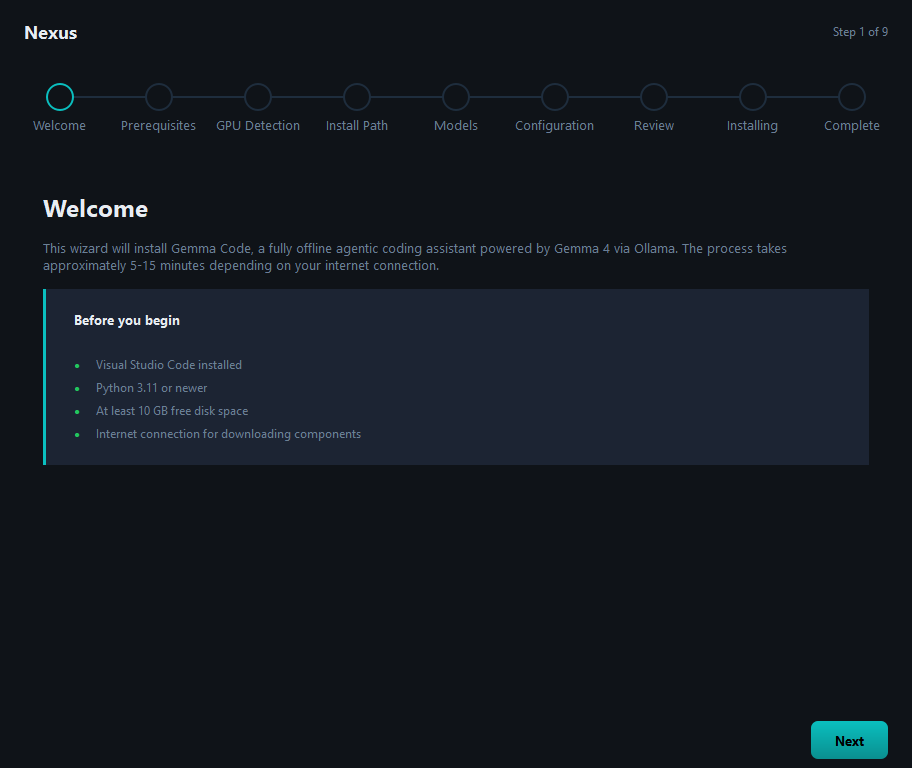
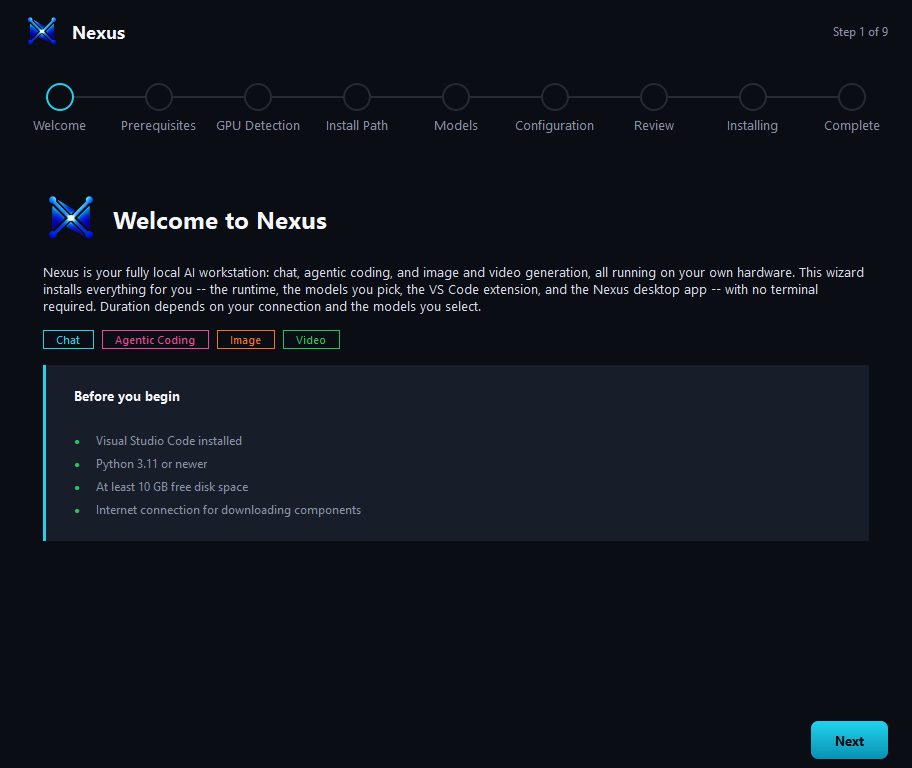
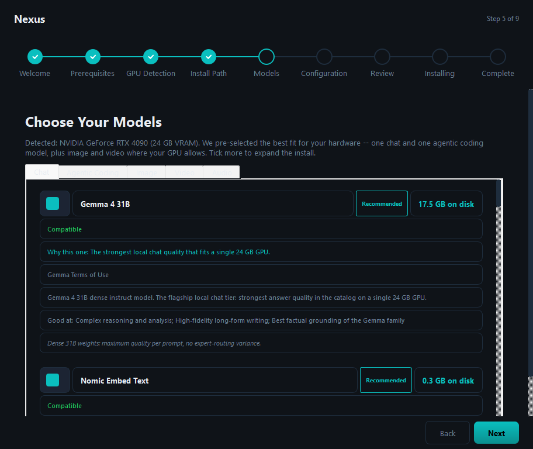
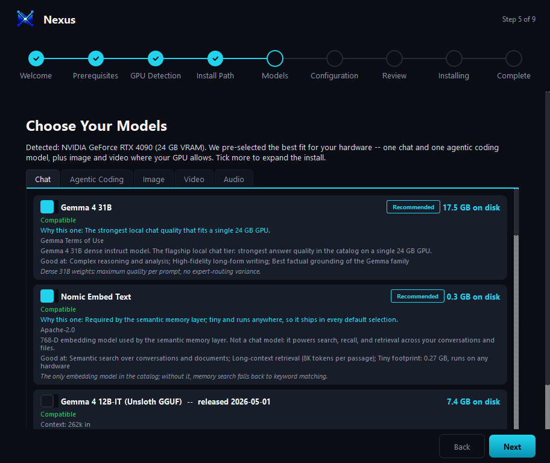
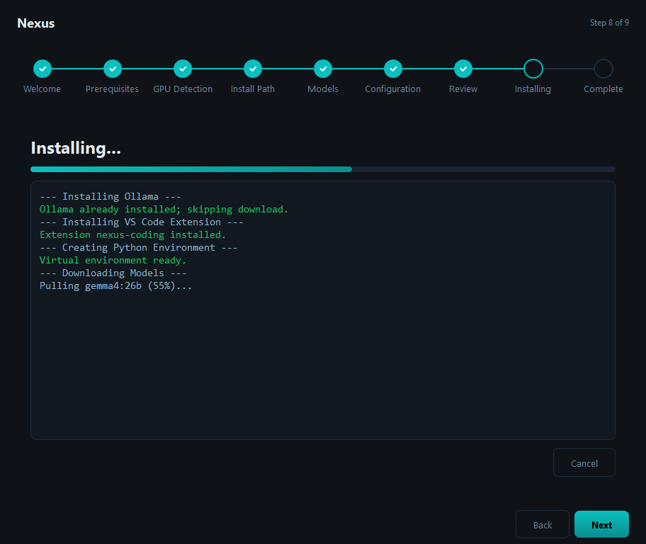
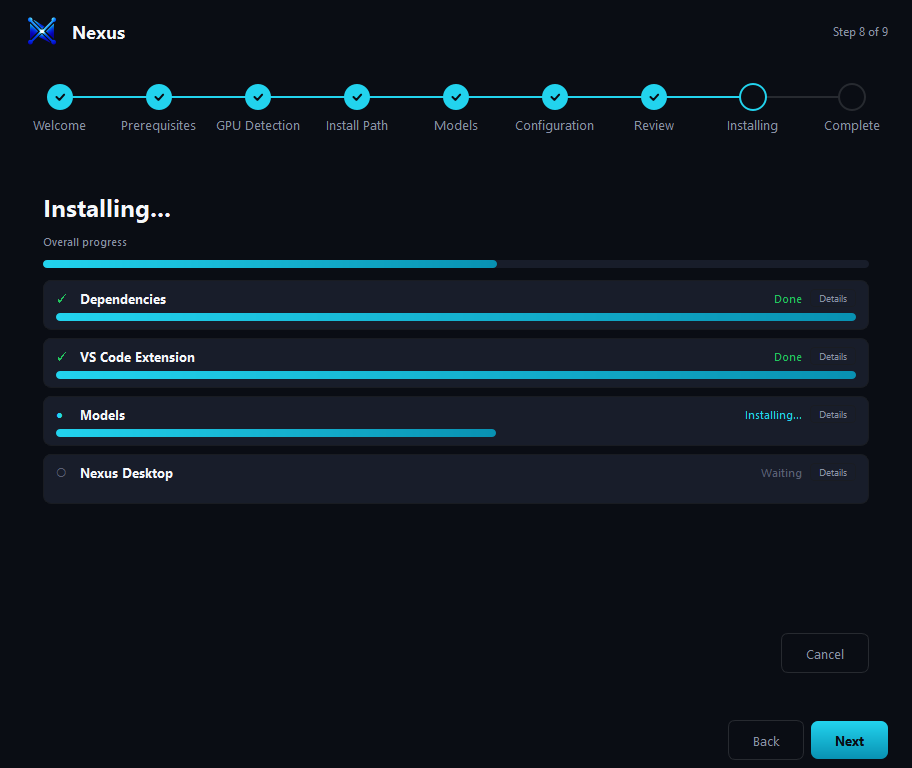
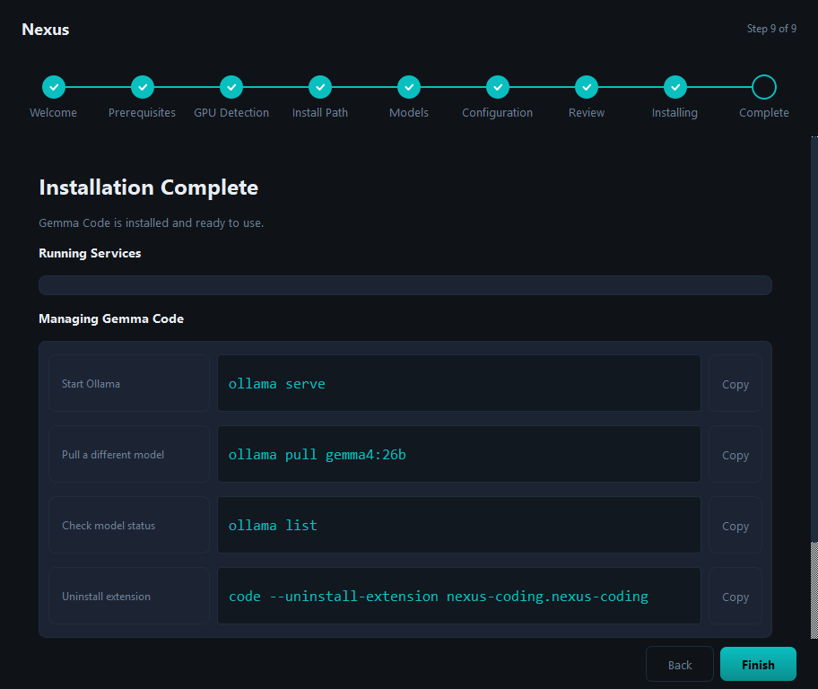
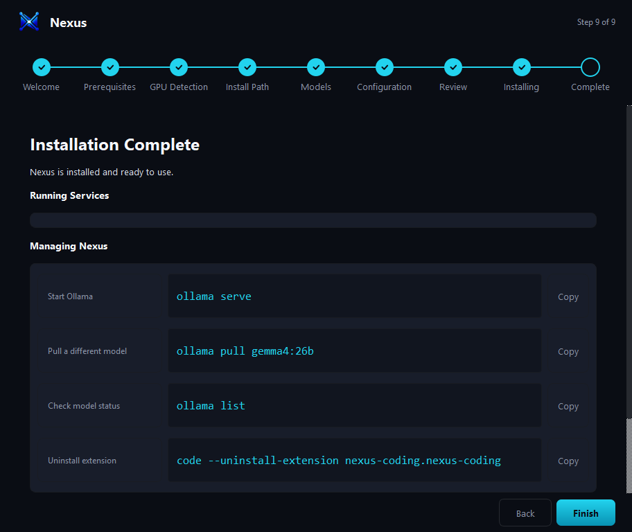

# v1.8.0 Phase 5 -- Desktop-Token Restyle + Per-Phase Progress UX (T501-T503)

**Date**: 2026-07-03
**Plan**: [../../plans/one-shot-installer.md](../../plans/one-shot-installer.md) (Phase 5, closes gap G4)
**Branch**: `feat/v1.8.0-installer-phase-5`

## What shipped

### T501 -- the installer palette is now the desktop app's palette

[constants.py](../../../../../scripts/installer/pyqt/src/nexus_installer/constants.py) is a direct port of [desktop/src/styles/tokens.css](../../../../../desktop/src/styles/tokens.css) and is documented as the single palette source (pages and widgets must not hardcode hex values):

- Surfaces: `BG_WINDOW #0a0d14` (--bg-0), `BG_HEADER`/`BG_INPUT #11151f` (--bg-1), `BG_CARD #181d2a` (--bg-2), new `BG_ELEVATED #20263a`.
- Foreground: `TEXT_PRIMARY #f5f7fb` (--fg-0), new `TEXT_BODY #d6dbe7` (--fg-1, page subtitles), `TEXT_SECONDARY #8a92a6` (--fg-muted), `TEXT_MUTED #5a6075` (--fg-disabled).
- Borders: the desktop's white-alpha borders (rgba 6% / 12%) composited on --bg-0 as solid `BORDER #191c22` / new `BORDER_STRONG #272a30` (QSS + QColor consumers need solid colors).
- Accents: the lead accent moves from the legacy teal `#0ABFBF` to the desktop's chatbot cyan `ACCENT #22d3ee` (+ `ACCENT_BRIGHT`/`ACCENT_DIM` gradient stops); the four module accents land as `ACCENT_CHAT #22d3ee`, `ACCENT_CODING #ec4899`, `ACCENT_IMAGE #f97316`, `ACCENT_VIDEO #22c55e`, plus `INFO #38bdf8` (--status-info).
- `SECTION_ACCENTS` maps catalog sections to module accents (audio uses the info blue until a dedicated module accent exists in the desktop tokens).

[theme.py](../../../../../scripts/installer/pyqt/src/nexus_installer/theme.py) consumes the new tokens, adds `QTabWidget::pane` / `QTabBar::tab` styling (the typed catalog's tabs previously rendered with platform-default chrome), switches the primary button's text to `BG_WINDOW` (dark-on-bright, the desktop treatment), and replaces the mojibake section-comment rules with ASCII. The step indicator's completed-dot checkmark goes dark for the same reason, and its future/connector strokes use `BORDER_STRONG`.

Catalog section accents ([typed_catalog.py](../../../../../scripts/installer/pyqt/src/nexus_installer/pages/typed_catalog.py)): each tab gets a 2px accent rule under the tab bar, and every model card in a section carries the section accent on its Recommended pill, size label, "Why this one" line, and checked checkbox. Also fixed en route: `_ModelCard`'s unqualified stylesheet propagated its border to every child QLabel (each copy line rendered as its own boxed pill); the style is now scoped via `QWidget#modelCard` + `WA_StyledBackground`.

Stray hardcoded hexes aligned to constants: the window error label and the disk footer's red now use `ERROR`; the log panel's info color uses `TEXT_SECONDARY`.

### T502 -- per-phase progress on the installing page

The single indeterminate bar + one big log becomes a grouped view:

- New [phase_group.py](../../../../../scripts/installer/pyqt/src/nexus_installer/widgets/phase_group.py) widget: status icon (pending / active / done / completed-with-issues), title, per-group progress bar, and a collapsible per-group log behind a Details toggle.
- [installing.py](../../../../../scripts/installer/pyqt/src/nexus_installer/pages/installing.py) maps engine steps onto four groups -- **Dependencies** (ollama + venv) -> **VS Code Extension** -> **Models** -> **Nexus Desktop** -- with the overall bar on top. Groups rebuild from `components_to_install` at start (configuration-page toggles drop their group). Log lines route to the group whose step is active; `get_log_text()` still returns the full aggregate log.
- [engine/installer.py](../../../../../scripts/installer/pyqt/src/nexus_installer/engine/installer.py) gains three step-level signals -- `step_started(str)`, `step_progress(str, float)`, `step_failed(str)` -- emitted alongside the existing `step_completed` / `progress_update` (which are unchanged for existing consumers). The model and desktop steps stream real within-step progress; ollama/extension/venv report start + completion only (their installers expose no progress callback -- see `OSI005.P5.A`).

### T503 -- welcome/complete polish + archives

- Welcome: a product lockup (the desktop app's own icon from `desktop/src-tauri/icons/` + "Welcome to Nexus"), product copy replacing the stale "Gemma Code ... 5-15 minutes" text, and four pillar chips (Chat / Agentic Coding / Image / Video) in the module accents above the existing live prerequisite checks.
- Complete: "Nexus is installed and ready to use.", "Managing Nexus" card title, and the saved-log default filename becomes `nexus-install.log`.
- Fixed en route: the header brand mark never rendered from the source tree -- its fixed-depth path resolution landed on `scripts/assets/` (does not exist). Both the header and the welcome lockup now walk up to find the asset (works from the source tree and the PyInstaller bundle layout, which stages `assets/icon.png` at the bundle root).

## Before / after (archived in [assets/2026-07_phase-5/](assets/2026-07_phase-5))

| Page | Before | After |
|---|---|---|
| Welcome |  |  |
| Models |  |  |
| Installing |  |  |
| Complete |  |  |

Capture method: the wizard runs on the native Qt platform without `show()` (the `offscreen` plugin renders no text on Windows) with detection workers stubbed; the installing page is fed a simulated mid-install snapshot through the engine-signal handlers (deps done, extension done, models at 55%, desktop waiting) and grabbed via `QWidget.grab()`. The after-installing capture is the DoD's "four phase groups progressing" proof; group-card background pixel-verified `#181d2a` (BG_CARD). Note: the complete page's "Running Services" card renders empty in **both** captures -- a grab-before-layout artifact of the harness, not a Phase 5 regression (the rows populate on real show and are covered by `test_complete.py`).

## Gates

- Installer suite: **564 passed / 2 skipped / 0 failed** (+26 new: `test_phase_group.py` widget lifecycle + grouping/routing, engine step-signal ordering/failure/progress forwarding, desktop-token palette + section-accent + tab-selector theme assertions, welcome/complete copy checks).
- Coverage (touched modules): `phase_group` 96%, `engine/installer` 93%, `typed_catalog` 93%, `installing` 82%, `theme`/`log_panel` 100%; suite total 80%.
- Ruff: 0 new findings on all touched files (the two remaining flags in the scope run are pre-existing lines not authored this phase).
- Root gates: Vitest **4569 passed / 6 skipped / 0 failed** (unchanged -- no TS surface touched); `tsc -b` clean. The benchmark-fixture JSONs the root run regenerates (timing noise) were restored.

## Dispositions on open gaps

- `OSI002.P2.D` (unwired `VsCodeExtensionPage` / `StoragePage`): Phase 5 restyled the existing 9-page flow without reworking it, so the standalone pages remain unwired; the item stays open for Phase 6 or a later flow pass.
- `OSI004.P4.D` (legacy `ModelSelectionPage` retirement): the restyle confirmed no page reuse -- retirement can proceed in the `NAME.P1.A` compat sweep.

## New gaps (recorded in [../../known-gaps.md](../../known-gaps.md))

- `OSI005.P5.A` (P3 WN): dependency-step group bars are completion-quantized -- ollama / extension / venv expose no within-step progress callback, so only Models and Nexus Desktop stream live progress.
- `OSI005.P5.B` (P3 WN): typography parity is size/weight-level only; the desktop's Inter / JetBrains Mono faces are not bundled (platform fonts remain: Segoe UI / SF Pro / Cantarell).
