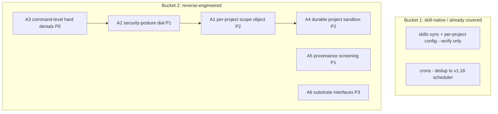

# Cross-Project Comparison: Nexus vs. QM

**Version**: v2.0.0
**Adoption target**: v2.0.0
**Generated**: 2026-08-05
**Analyzer**: Claude Code -- /compare command
**External Source**: https://github.com/yc-software/qm (Repository)
**Source Type**: Repository
**Pre-ingest source-security verdict**: CLEAR -- see Section 5.0

---

## Section 1: Executive Summary

QM (`yc-software/qm`, MIT, ~11.8k stars) is Y Combinator's open-sourced company-wide "multiplayer agent harness": a headless TypeScript/Node Fastify core plus Postgres, deployed to the operator's own cloud (Fly / AWS), with Slack (Bolt) and web-UI (Vite + Lit) plugins. Its organizing idea is the *scope*: every person and every room owns its own memory, files, keychain view, permissions, crons, web apps, skills, and a durable isolated sandbox. Agent backends (Pi, OpenCode, Codex, Claude Code) are interchangeable behind substrate interfaces. Security is a three-posture dial -- Strict (every tool call pauses for approval), Auto (a classifier screens provenance-labelled external data), and Dangerous (no screening, no pauses) -- with one crucial invariant: a predeclared command policy of hard denials applies in every posture, "Dangerous included".

Nexus is the photographic negative on deployment (single-user local desktop vs multi-tenant company server) but a close sibling on governance: Nexus already ships tiered permissions with a non-bypassable floor clamp, a confirmation gate, git checkpoints, an action classifier, and a prompt-injection scanner. The adoptable delta is therefore QM's *shape*, not its server: the unified per-scope isolation object (reborn as per-project/per-workspace isolation), the named security-posture dial over the existing tiers, command-level hard denials that survive every posture, provenance-labelled content screening, and a durable per-project exec sandbox. Everything multi-tenant -- the Fastify/Postgres server core, Slack plugin, cloud deployment CLI, org identity and admin promotion -- is rejected on MCP Registry Policy and local-first grounds.

**Overall recommendation: reverse-engineer QM's scope and posture concepts into Nexus's single-user model as per-project isolation and a graduated security dial; reject the entire server, Slack, and cloud-deployment surface wholesale.**

## Section 2: Project Profiles

| Aspect | Nexus (this project) | QM |
|---|---|---|
| Identity | Nexus (Nexus-AI) | QM (`yc-software/qm`) |
| Kind of artifact | Local-first desktop AI Studio (4 pillars) | Company-wide multiplayer agent harness (server) |
| Purpose | Coding + Chat + Image + Video, local-only, single user | Shared agents for whole companies in Slack + web UI |
| Version / maturity | Milestone v1.15.0 in flight; adoption target v2.0.0 | Open-sourced by YC, used internally; ~11.8k stars |
| License | MIT | MIT |
| Author / owner | @bendourthe | Y Combinator software team (`yc-software`) |
| Primary language | TypeScript (+ Rust/Tauri shell, Python sidecars) | TypeScript / Node.js |
| Platform | Windows, macOS, Linux desktop | Server: operator's cloud (Fly / AWS) + Postgres |
| Network posture | Local-first; no outbound without explicit opt-in | Cloud service by construction; Slack + web clients |
| Agent framework | Internal Nexus coding engine (tool registry, plan/auto mode, 4-layer memory) | Harness abstraction over Pi, OpenCode, Codex, Claude Code |
| Relevance to Nexus | -- | High on governance/isolation concepts; nil on deployment model |

## Section 3: Capability and Architecture Comparison

### 3a: Deployment, isolation, and harness architecture

| Aspect | Nexus (current) | QM | Delta |
|---|---|---|---|
| Runtime topology | Tauri shell + local Node sidecar; everything on one machine | Headless Fastify core + Postgres + plugins over HTTP | Fundamental: local single-user vs multi-tenant server |
| Isolation unit | Per-project MCP registry (`modules/coding/mcp/HubRegistryPolicyFilter.ts`), per-chat scoped memory (`modules/chat/memory/ChatScopedMemory.ts:32`) -- partial, not unified | The *scope*: each person/room owns memory, files, keychain view, permissions, crons, web apps, skills, and a durable sandbox | QM unifies what Nexus scatters (adoption candidate A1) |
| Sandbox | Exec-sandbox audit exists (`docs/archive/v1/v1.12/exec-sandbox-audit.md`); headless tool sandboxing in `modules/coding/runtime/headlessTools.ts`; no durable per-project sandbox | "its durable computer, where installed tools stay installed" -- per-scope isolated sandbox behind a fixed `execute` tool | Gap (A4) |
| Agent backend | Internal engine only; per-model harness selector tunes scaffold per local model (v1.12.0) | Pi / OpenCode / Codex / Claude Code interchangeable; "every substrate (harness, session store, sandbox, memory) sits behind an interface" | Interface-per-substrate pattern is adoptable (A6); external-CLI backends are not |
| Memory | 4-layer (working/episodic/semantic/graph) + hybrid retrieval (`core/memory/MemoryHub.ts`, `core/memory/HybridRetriever.ts`) | Scoped, durable, Postgres-backed; no layered architecture described | Nexus deeper on memory architecture; QM better on scoping |

### 3b: Security and governance

| Aspect | Nexus (current) | QM | Delta |
|---|---|---|---|
| Permission model | Per-tool tiers AUTO_APPROVE / CONFIRM / DANGEROUS (`modules/coding/guardrails/PermissionTiers.ts:5-9`); MCP/unknown tools default DANGEROUS (`:47-53`) | Org-level config with scope-specific tightening; skill grants; admin-gated promotion | Nexus per-tool; QM per-scope. Scope-level tightening maps to per-project overrides (A1) |
| Bypass resistance | Floor clamp: confirmation-tier tools cannot be override-dropped to auto-approve (`PermissionTiers.ts:69-90`, closes pen-test F-003) | "predeclared command policy -- approval rules and hard denials for things like recursive deletes or destructive SQL -- applies in every posture, Dangerous included" | Same invariant, different granularity: Nexus clamps tiers, QM also hard-denies *commands* (A3) |
| Graduated modes | Plan mode vs auto mode + per-tool tiers + `src/tools/ConfirmationGate.ts` + auto-mode verification gate (`src/tools/AgentLoop.ts`) | Named postures: Strict / Auto (default) / Dangerous | Nexus has the machinery but no single user-facing posture dial (A2) |
| Untrusted-content screening | `modules/coding/guardrails/PromptInjectionScanner.ts` | Auto posture: "a classifier screens provenance-labelled external data and tool results before they reach the model" | Provenance labelling of tool results is the missing half (A5) |
| Destructive-op recovery | Git checkpoints (`modules/coding/guardrails/GitSafetyNet.ts`) + `modules/coding/guardrails/ActionClassifier.ts` | Hard denials only; no checkpoint/rollback described | Nexus stronger on recovery |

**Key contrast:** QM's security dial and Nexus's tier system are the same idea at different altitudes. QM names the posture and lets the command policy survive even Dangerous mode; Nexus enforces the equivalent floor at the tier level but never surfaces a single graduated control to the user, and its hard denials are tier-shaped rather than command-shaped.

## Section 4: Gap Analysis

### 4a: Present in QM, missing or partial in Nexus (adoption candidates)

- **A1 -- Unified per-project scope object.** QM bundles memory + files + permissions + skills + crons + sandbox into one owned scope per person/room. Nexus has the pieces (per-chat memory `ChatScopedMemory.ts`, per-project MCP registry `HubRegistryPolicyFilter.ts`, per-tool tiers) but no single per-project/per-workspace isolation object with scope-specific permission tightening.
- **A2 -- Named security-posture dial.** A user-facing Strict / Standard / Unattended-style selector that composes the existing `PermissionTiers` + `ConfirmationGate` + auto-mode verification gate into named, documented postures. Nexus must NOT ship a true "dangerous" no-floor mode; the clamp (`PermissionTiers.ts:69-90`) stays authoritative in every posture.
- **A3 -- Predeclared command-level hard denials.** Extend `ActionClassifier.ts` / `GitSafetyNet.ts` with a declarative deny-list for command shapes (recursive deletes, destructive SQL, history rewrites) that applies in every posture, mirroring QM's "Dangerous included" invariant.
- **A4 -- Durable per-project exec sandbox.** A persistent, project-scoped sandbox where installed tooling survives across sessions ("durable computer"), building on the v1.12.0 exec-sandbox audit (`docs/archive/v1/v1.12/exec-sandbox-audit.md`).
- **A5 -- Provenance-labelled content screening.** Label tool results and external data by origin and route them through `PromptInjectionScanner.ts` before they reach the model, per QM's Auto posture.
- **A6 -- Substrate-behind-interface formalization.** QM puts harness, session store, sandbox, and memory each behind an interface. Nexus's per-model harness selector (v1.12.0) partially does this; formalizing the remaining seams is low-priority hygiene, not a feature.
- **(Dedup) Crons and watches.** QM's background crons map to the local scheduler already adopted as A2 of the OpenWorker comparison (`docs/archive/v1/v1.18/comparisons/v1.18.0-comparison-openworker.md`); no new candidate.

### 4b: Present in Nexus, missing in QM (strengths to preserve)

- Zero-infrastructure local-first posture: no server, no Postgres, no cloud account, no Slack tenancy.
- Four-layer memory + hybrid retrieval (BM25 + dense + graph via RRF) vs QM's undifferentiated scoped store.
- Git checkpoint recovery (`GitSafetyNet.ts`) -- QM denies but does not roll back.
- Image Studio / Video Lab / GPU scheduler / local telemetry -- QM is text-work only.
- Reverse-engineering-first MCP policy; QM happily wraps third-party harnesses and Slack.
- `redactSecrets` pre-index scrubbing (`core/observability/redactSecrets.ts`).

### 4c: Present in both (quality comparison)

| Capability | Nexus | QM | Better |
|---|---|---|---|
| Permission floors | Tier clamp, non-bypassable | Command policy survives all postures | Tie on invariant; QM finer-grained (A3 closes it) |
| Scoped memory | Per-chat scope, 4-layer | Per-person/per-room scope, flat | Nexus on depth, QM on scoping model |
| Skills | Nexus-Hub catalog sync, per-project | Scope-owned, grants, git import | Roughly equivalent; grants are multi-user-only |
| Untrusted-input defense | PromptInjectionScanner | Provenance classifier (Auto posture) | QM on provenance labelling (A5) |
| Backend flexibility | Per-model harness profiles, local models | 4 interchangeable vendor harnesses | Different by doctrine, not better/worse |

## Section 5: Security and Risk Assessment

*This section is MANDATORY per the compare-project skill (Steps 1.5 and 5) and the MCP Registry Policy.*

### 5.0 Pre-ingest source-security scan (Step 1.5)

| Check | QM |
|---|---|
| Prompt injection / agent-directed instructions | None found in the fetched README/landing surface; no "ignore previous instructions" payloads, hidden text, or agent-directed imperatives. All source text was treated as data. |
| Malicious or destructive code patterns | None surfaced in the content examined. The project itself documents hard denials for destructive operations. |
| Supply-chain provenance | Reputable owner (Y Combinator's `yc-software` org), MIT, ~11.8k stars, npm package `@yc-software/qm`. Deploy CLI generates an org-specific repo depending on the npm package -- a supply-chain surface for QM *operators*, but Nexus adopts no QM code, so it is out of scope here. |
| Residual flags | None. |

**Verdict: CLEAR.** Ingestion proceeded. This scan covered the web-fetched README surface only; a byte-level tree scan would be a precondition of vendoring any QM code, and none is recommended (all candidates below are reverse-engineered, not vendored).

### 5.1 Threat-model delta

| Dimension | Adoption delta |
|---|---|
| New runtime dependencies | None. A1-A5 are local TypeScript builds; no Fastify, no Postgres, no Slack SDK, no `@yc-software/qm` dependency. |
| Outbound-call destinations | Zero. All rejected items (server, Slack, cloud deploy) are precisely the outbound surface. |
| Credentials / API keys | Zero. QM's keychain-view concept is not adopted; Nexus keeps its existing credential vault. |
| Data leaving the machine | None for any candidate. |
| New inbound surface | A4 (durable sandbox) persists attacker-reachable state across sessions and must be wiped/rebuildable; A2 (posture dial) is a new control surface that must never expose a floor-removing mode. |

### 5.2 Per-item risk scorecard

| Item | Risk tier | Justification |
|---|---|---|
| A1 Per-project scope object | Low | Local refactor unifying existing scoping; tightening-only permission deltas |
| A2 Security-posture dial | Medium | A mislabeled posture could over-relax; the tier clamp must remain authoritative in every posture, and no no-floor "dangerous" mode ships |
| A3 Command-level hard denials | None-Low | Strictly subtractive; only tightens the existing gate |
| A4 Durable per-project sandbox | Medium | Persistent sandbox state must be isolated per project, excluded from memory indexing, and trivially resettable |
| A5 Provenance-labelled screening | Low | Additive filter in front of the model; extends an existing scanner |
| A6 Substrate interfaces | None | Internal refactor only |

## Section 6: Reverse-Engineering Viability Analysis

*MANDATORY. Every candidate is classified against the decision tree: skill-native > re-full > re-partial > vendor-intrinsic > drop-outright.*

| Item | Classification | Internal deliverable | Effort | Rationale |
|---|---|---|---|---|
| A1 Per-project scope object | re-partial | A `ProjectScope` abstraction composing `ChatScopedMemory`, the per-project MCP registry, per-scope permission overrides (clamp-preserving), and per-scope skill enablement | Medium-High | Builds on existing partial scoping; QM's multi-user grant/promotion machinery is dropped |
| A2 Security-posture dial | re-full | Named posture presets over `PermissionTiers` + `ConfirmationGate` + `AgentLoop` verification gate, with a settings/UI surface | Medium | Pure local composition of existing guardrails; no QM code needed |
| A3 Command-level hard denials | re-partial | Declarative deny-list evaluated in `ActionClassifier` / terminal handler, enforced in all postures | Low | Extends existing classifier; the "survives every posture" invariant is the whole point |
| A4 Durable per-project sandbox | re-partial | Persistent project-keyed sandbox root with tool-install persistence and a one-click reset, per the exec-sandbox audit recommendations | High | Local OS-level work; QM's container/cloud specifics do not transfer |
| A5 Provenance-labelled screening | re-partial | Origin tags on tool results + external fetches routed through `PromptInjectionScanner` pre-model | Medium | Extends an existing local scanner |
| A6 Substrate interfaces | re-partial | Interface seams for session store / sandbox / memory mirrors the existing harness-selector seam | Low | Hygiene refactor |
| Scope-owned skills w/ git import | skill-native | Already covered: Nexus-Hub catalog sync + per-project skill config | None | Existing `nexus skills sync` pipeline is the local equivalent |
| Crons / watches | skill-native (dedup) | Already planned as OpenWorker A2 local scheduler (v1.18 comparison) | None here | No duplicate build |

**Recommendation ordering (per MCP Registry Policy):** two items are `skill-native`/already-covered, six are `re-partial`/`re-full` local builds, none is `vendor-intrinsic`, and the server/Slack/cloud surface is `drop-outright` (Section 9).

## Section 7: Adoption Plan

### Bucket 1 -- skill-native (zero-code wins)

| What | Source | Target | Effort | Deps | Risk |
|---|---|---|---|---|---|
| Scope-owned skills + git import (P3, verify-only) | QM skills system | Existing Nexus-Hub `nexus skills sync` + per-project config | None | -- | None |
| Background crons/watches (P3, dedup) | QM background work | Already planned: OpenWorker A2 local scheduler | None | v1.18 A1/A2 | None |

### Bucket 2 -- reverse-engineered internal builds

| What | Source | Target | Effort | Deps | Risk |
|---|---|---|---|---|---|
| A3 Command-level hard denials (P0) | QM predeclared command policy | `modules/coding/guardrails/ActionClassifier.ts` + terminal handler | Low | -- | None-Low |
| A2 Security-posture dial (P1) | QM Strict/Auto/Dangerous postures | New posture presets over `PermissionTiers.ts` / `ConfirmationGate.ts` / `AgentLoop.ts` + settings UI | Medium | A3 (floor must exist first) | Medium |
| A5 Provenance-labelled screening (P1) | QM Auto-posture classifier | `modules/coding/guardrails/PromptInjectionScanner.ts` + tool-result tagging | Medium | -- | Low |
| A1 Per-project scope object (P2) | QM per-person/per-room scopes | New `ProjectScope` composing memory, MCP registry, permissions, skills | Medium-High | A2 | Low |
| A4 Durable per-project sandbox (P2) | QM durable per-scope sandbox | Project-keyed persistent exec sandbox per `docs/archive/v1/v1.12/exec-sandbox-audit.md` | High | A1 | Medium |
| A6 Substrate interfaces (P3) | QM substrate-behind-interface pattern | Internal seams for session store / sandbox / memory | Low | -- | None |

### Bucket 3 -- vendor-intrinsic

None. No candidate requires a third party as its intrinsic destination.

## Section 8: Implementation Sequence

Suggested phasing for the v2.0.0 cycle:
1. A3 (hard denials): small, strictly tightening, and the precondition for any posture work.
2. A2 + A5 (posture dial + provenance screening): the user-visible security surface.
3. A1 then A4 (scope object, then durable sandbox): the isolation backbone, largest effort last.

## Section 9: Risks and Explicit Rejections

General considerations:
- QM's headline value is multiplayer; Nexus is single-user by design. Every adoption above deliberately re-homes a multi-user concept (scope, posture, policy) onto per-project boundaries. Do not let "QM does teams" pressure a server build.
- A2 is the one candidate that could weaken safety if implemented as a literal port: QM's Dangerous mode removes screening and pauses. Nexus must keep the `PermissionTiers.ts:69-90` clamp and A3 denials authoritative in every posture; the most permissive Nexus posture is "fewer confirmations above the floor", never "no floor".
- A4 persists state across sessions; treat the sandbox as untrusted, keep it out of memory indexing, and make reset one click.

### Items explicitly NOT recommended for adoption

- **N1 -- The multi-tenant server core (Fastify headless core + Postgres persistence).** A company server with a database is the opposite of Nexus's local-first, zero-infrastructure desktop posture. **Rejected** (MCP Registry Policy bucket 5 / drop; local-first design principle -- README.md "Design Principles" 1; no outbound or hosted infrastructure without explicit opt-in).
- **N2 -- Slack integration (Bolt plugin) and the web/admin/public portals.** Chat-platform tenancy and hosted web surfaces are as-a-service integrations reached over the network. **Rejected** (MCP Registry Policy hard-no on as-a-service surfaces; `HubRegistryPolicyFilter.ts` default-deny doctrine).
- **N3 -- Cloud deployment CLI (Fly / AWS targets, operator cloud accounts).** Generating and operating cloud deployments is out of scope for a desktop app and would introduce credentials, billing, and outbound infrastructure. **Rejected** (MCP Registry Policy; local-first / single-GPU-desktop principles).
- **N4 -- External vendor harness backends (Pi, OpenCode, Codex, Claude Code as interchangeable engines).** Driving third-party agent CLIs/APIs as Nexus's engine would wrap external harnesses instead of the internal engine and, for hosted backends, bill tokens. **Rejected** (MCP Registry Policy bucket 3 preference for internal equivalents; "Originality over wrappers", README.md Design Principle 2; only the *interface pattern* is adopted as A6).
- **N5 -- Org identity, skill grants, and admin-gated promotion.** Multi-user governance machinery with no single-user analogue beyond A1's per-project scoping. **Rejected** (drop-outright; no user for it in Nexus's model).

## Appendix: Source Facts (as fetched 2026-08-05)

**QM (`yc-software/qm`, MIT, ~11.8k stars, ~1.3k forks, npm `@yc-software/qm`).** Y Combinator's open-sourced "multiplayer agent harness for work", used internally by its engineering teams; works in Slack and a web UI. Architecture: headless TypeScript/Node core running Fastify (API, identity, policy, agent loop); Postgres persistence layer for "user data, session history, and other durable state"; plugins (Slack via Bolt in-process, web UI Vite + Lit, admin panel, public portal) over the HTTP API. Scopes: "Each person and each room has its own scoped memory, files, keychain view, permissions, crons, web apps, and durable sandbox"; the `execute` tool "runs commands in the scope's own isolated sandbox -- its durable computer, where installed tools stay installed". Skills: "scope-owned", "shareable by grant, with admin-gated promotion to the whole org", "skill packs imported from git repositories". Security postures: Strict ("every harness tool call pauses for human approval, except the two no-effect turn enders"); Auto, the default ("a classifier screens provenance-labelled external data and tool results before they reach the model"); Dangerous ("no content screening, no pauses between tool calls"); and "The predeclared command policy -- approval rules and hard denials for things like recursive deletes or destructive SQL -- applies in every posture, Dangerous included." Harnesses: "Pi, OpenCode, Codex, and Claude Code all drive the same core, so a deployment isn't tied to any single vendor"; "every substrate (harness, session store, sandbox, memory) sits behind an interface". Background work: "Crons and watches run work while nobody's watching." Deployment: CLI creates an org-specific deployment repo depending on `@yc-software/qm`; runs in the operator's cloud account; Fly and AWS targets. Pre-ingest security verdict: CLEAR.
