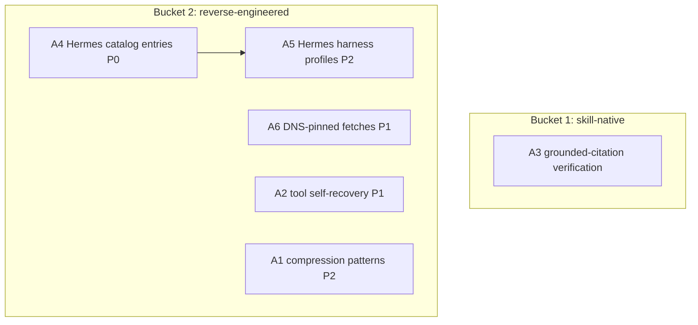

# Cross-Project Comparison: Nexus vs. Hermes Agent

**Version**: v2.0.1
**Adoption target**: v2.0.0
**Generated**: 2026-08-05
**Analyzer**: Claude Code -- /compare command
**External Source**: https://github.com/NousResearch/hermes-agent (Repository)
**Source Type**: Repository
**Pre-ingest source-security verdict**: CLEAR -- see Section 5.0

---

## Section 1: Executive Summary

Hermes Agent (Nous Research, MIT, ~226k stars) is a self-improving, multi-platform AI agent that creates skills from experience, keeps persistent memory, and runs anywhere from a $5 VPS to serverless. Its v0.20.0 "Herald" release (2026-08-03, ~3,650 commits and 650+ contributors since v0.19.0) adds real-time voice, an Agent-to-Agent (A2A v1.0) protocol plugin, signed outbound webhooks, a desktop plugin SDK, a grounded-citations research skill, a context-compression overhaul, tool self-recovery, and the "Ironproxy" credential-egress firewall. Hermes and Nexus share the same agentic DNA -- tool registry, subagent delegation, MCP, skill curation, scheduling -- but diverge on network posture: Hermes is gateway-and-cloud-happy (Telegram/Discord/Slack/WhatsApp/Signal/Buzz gateways; Nous Portal, OpenRouter, OpenAI, Anthropic providers; hosted Honcho user modeling), while Nexus is local-only by doctrine.

The adoptable signal is in Herald's harness engineering, not its connectivity. Six candidates survive the policy gate: the context-compression patterns (per-model thresholds, micro-compaction, user-tail retention), the tool self-recovery patterns (truncation spill-to-file, already-applied-patch detection, near-miss search probes), grounded-citation discipline (skill-native), Hermes-family local models for the catalog (currently absent from `core/registry/catalog.json`), per-model harness tuning for those models via the v1.12.0 `HarnessSelector`, and DNS-pinned egress hardening on top of the existing `ssrf.ts` guard. Six items are rejected outright on MCP Registry Policy grounds (Nous Portal hosted inference, cloud provider breadth, Honcho hosted memory, the messaging-gateway surface, outbound webhooks, and the A2A protocol plugin).

**Overall recommendation: reverse-engineer Herald's harness-reliability patterns and catalog the Hermes-family local models; reject every hosted Nous dependency and every off-machine communication surface wholesale.**

## Section 2: Project Profiles

| Aspect | Nexus (this project) | Hermes Agent |
|---|---|---|
| Identity | Nexus (Nexus-AI) | Hermes Agent (`NousResearch/hermes-agent`) |
| Kind of artifact | Local-first desktop AI Studio (4 pillars) | Self-improving multi-platform AI agent |
| Purpose | Coding + Chat + Image + Video, local-only | Persistent assistant across messaging gateways, CLI, and desktop |
| Version / maturity | Milestone v2.0.0 in flight | v0.20.0 "Herald" (2026-08-03), ~226k stars |
| License | MIT | MIT |
| Author / owner | @bendourthe | Nous Research |
| Primary language | TypeScript (+ Rust/Tauri shell, Python diffusion sidecar) | Python + JavaScript/Node.js |
| Network posture | Local-first; no outbound without explicit opt-in | Cloud providers + hosted portal + messaging gateways + webhooks |
| Agent framework | Internal engine: `src/tools/AgentLoop.ts`, `src/tools/ToolRegistry.ts`, planner/critic/worker DAG (`modules/coding/orchestration/`) | Learning loop with autonomous skill creation, 40+ tools, subagent delegation, built-in cron |
| Relevance to Nexus | Direct agent-harness sibling; the largest open agent project of the 2026 wave | High |

## Section 3: Capability and Architecture Comparison

### 3a: Agent harness and orchestration

| Aspect | Nexus (current) | Hermes Agent v0.20.0 | Delta |
|---|---|---|---|
| Core loop | `src/tools/AgentLoop.ts` + `src/tools/ToolRegistry.ts` / `ToolRegistryBuilder.ts` | Learning loop, 40+ tools, seven terminal backends | Equivalent pattern; Hermes adds self-recovery behaviors Nexus lacks |
| Multi-agent | Planner/critic/worker DAG since v1.5.0 (`modules/coding/orchestration/PlannerAgent.ts`, `CriticAgent.ts`, `DAGExecutor.ts`, `TaskDAG.ts`) + `modules/coding/agents/SubAgentManager.ts` | Isolated subagent delegation for parallel workstreams | Equivalent |
| Per-model tuning | Per-model harness selector since v1.12.0 (`modules/coding/orchestration/HarnessSelector.ts`, `HarnessSelectorAb.ts`) | Configurable per-model context-compression thresholds; "way more reliable local and open models" | Same idea; Herald's per-model compression thresholds are the delta (A1) |
| Context management | `modules/coding/chat/ContextCompactor.ts`, `CompactionStrategy.ts`, strategies (`deduplication.ts`, `purgeErrors.ts`) | Proactive tool-result pruning, per-turn micro-compaction, guaranteed N-user-message tail retention, per-model thresholds | Gap in Nexus (A1) |
| Tool failure handling | `modules/coding/guardrails/LoopDetector.ts`; no spill/recovery behaviors | Truncation spills to readable files; already-applied-patch detection; near-miss search probes; iteration limit 90 -> 500 | Gap in Nexus (A2) |
| Skill self-improvement | `modules/coding/skills/CurationLoop.ts`, `WorkflowDetector.ts`, `SkillMetrics.ts` | Autonomous skill creation from experience (agentskills.io standard) | Equivalent pattern, different maturity |
| Scheduling | `modules/coding/agents/IdleTimeScheduler.ts`, `BackgroundWorkers.ts` | Built-in cron for unattended automations | Roughly equivalent |

### 3b: Network posture, memory, and security

| Aspect | Nexus (current) | Hermes Agent v0.20.0 | Delta |
|---|---|---|---|
| Providers | Local-only loopback (`modules/coding/llm/LocalAdapterRegistry.ts`, Ollama/LM Studio clients) | Nous Portal (20% discount promo), OpenRouter, OpenAI, Anthropic, custom endpoints | Fundamental doctrine divergence (rejected N1/N2) |
| Memory | 4-layer local memory (working/episodic/semantic/graph) | FTS5 session search + LLM summarization (local) + Honcho dialectic user modeling (hosted) | Nexus stronger locally; Honcho rejected (N3) |
| Reach | Desktop app only | Telegram, Discord, Slack, WhatsApp, Signal, Buzz (Nostr), CLI gateways; A2A v1.0; signed outbound webhooks | Entire surface rejected (N4/N5/N6) |
| Egress security | `modules/coding/utils/ssrf.ts`, `secretPaths.ts`, `modules/coding/guardrails/PromptInjectionScanner.ts`, `PermissionTiers.ts`, `GitSafetyNet.ts` | Ironproxy credential-injection egress firewall with DNS-pinned SSRF-safe fetches | Nexus covers most of this; DNS pinning is the delta (A6) |
| Research integrity | Nexus-Hub `deep-research-compilation` skill with managed citations | `grounded-citations` skill: quotes must match actual page text; fact-checking mode | Verification discipline is the delta (A3, skill-native) |

**Key contrast:** Hermes optimizes for reach (every messaging platform, every cloud provider, agent-to-agent federation); Nexus optimizes for containment. Every Herald feature that touches the network is policy-rejected, and everything that makes the harness itself more reliable -- compression, self-recovery, per-model thresholds, citation grounding -- is locally reproducible.

## Section 4: Gap Analysis

### 4a: Present in Hermes Agent, missing or partial in Nexus (adoption candidates)

- **A1 -- Context-compression overhaul patterns.** Per-model compression thresholds, per-turn micro-compaction, proactive tool-result pruning, and guaranteed N-user-message tail retention, layered onto `modules/coding/chat/ContextCompactor.ts` / `CompactionStrategy.ts` and keyed off the `HarnessSelector` per-model profile.
- **A2 -- Tool self-recovery patterns.** Truncated terminal output spilled to a readable file instead of lost; patch-tool detection of already-applied edits; search-tool near-miss probing; a revisited iteration ceiling in `src/tools/AgentLoop.ts`.
- **A3 -- Grounded-citation verification.** A quotes-must-match-fetched-text check and a fact-checking pass for research output; extends the existing Nexus-Hub `deep-research-compilation` skill rather than new engine code.
- **A4 -- Hermes-family local models in the catalog.** `core/registry/catalog.json` currently has zero Hermes/Nous entries (verified by grep); the open-weight Hermes family (Ollama/Hugging Face distribution) is a natural fit for the Agentic tab (`agentic: true`, `origin`, `provenance` fields already exist).
- **A5 -- Per-model harness tuning for Hermes models.** Herald's "way more reliable local and open models" claim implies per-model harness work; once A4 lands, add Hermes profiles to `modules/coding/orchestration/HarnessSelector.ts` and validate via `HarnessSelectorAb.ts` + the golden task suite (`modules/coding/evaluation/GoldenTaskSuite.ts`).
- **A6 -- DNS-pinned egress fetches.** Ironproxy's DNS-pinning (resolve once, connect to the pinned address) closes the TOCTOU/rebinding gap in the existing `modules/coding/utils/ssrf.ts` guard.

### 4b: Present in Nexus, missing in Hermes Agent (strengths to preserve)

- Zero as-a-service posture: no hosted portal, no cloud providers, no gateway relays.
- Four-pillar product surface (Coding + Chat + Image Studio + Video Lab) with GPU scheduler and local telemetry.
- Structured planner/critic/worker DAG orchestration with a fusion/reflexion layer (`modules/coding/orchestration/`).
- Tiered permissions with floor-clamp, git checkpoints, and prompt-injection scanning (`modules/coding/guardrails/`).
- Reverse-engineering-first MCP policy with default-deny (`modules/coding/mcp/HubRegistryPolicyFilter.ts`).
- Fully local 4-layer memory; no hosted user-modeling dependency.

### 4c: Present in both (quality comparison)

| Capability | Nexus | Hermes Agent | Better |
|---|---|---|---|
| Tool registry + agent loop | `ToolRegistry.ts` + `AgentLoop.ts` | 40+ tools, seven terminal backends | Hermes on breadth; Nexus on governance |
| Subagents | `SubAgentManager.ts`, worktree isolation | Isolated subagent delegation | Equivalent |
| Skill ecosystem | Nexus-Hub catalog + `CurationLoop.ts` | Autonomous skill creation, agentskills.io | Hermes on autonomy; Nexus on curation/audit |
| Context compaction | Compactor + strategies | Herald overhaul (per-model, micro-compaction) | Hermes (hence A1) |
| Scheduling | `IdleTimeScheduler.ts` | Built-in cron | Equivalent |
| Egress security | ssrf.ts + secretPaths + injection scanner | Ironproxy + DNS pinning | Split (hence A6) |
| MCP | Default-deny, read-only, per-project | MCP integration, plugin SDK | Nexus on safety default |

## Section 5: Security and Risk Assessment

*This section is MANDATORY per the compare-project skill (Steps 1.5 and 5) and the MCP Registry Policy.*

### 5.0 Pre-ingest source-security scan (Step 1.5)

| Check | Hermes Agent |
|---|---|
| Prompt injection / agent-directed instructions | None found in the README or the v0.20.0 release notes; no "ignore previous instructions" payloads, no hidden/encoded blobs surfaced. All fetched text was treated as data. |
| Malicious or destructive code patterns | None surfaced in the content examined. |
| Supply-chain provenance | Reputable owner (Nous Research), MIT, huge contributor base. Flag noted: the documented install path is `curl ... | bash` / `iex (irm ...)` piped installers that bundle uv, Python, Node, and MinGit -- standard for the genre but a real supply-chain surface. Nexus adopts no Hermes code and never runs the installer, so the flag does not gate this report. |
| Residual flags | Piped-installer pattern only (not ingested, not executed). |

**Verdict: CLEAR.** Ingestion proceeded. Scope: README/landing and Herald release-notes surface fetched over the web; a byte-level tree scan is a precondition of adopting any Hermes *code* (none is recommended -- all candidates are reverse-engineered or catalog data).

### 5.1 Threat-model delta

| Dimension | Adoption delta |
|---|---|
| New runtime dependencies | None. A1/A2/A5/A6 are edits to existing internal modules; A3 is skill text; A4 is catalog data pulled through the existing Ollama/HF weights pipeline with pinned SHA-256 digests. |
| Outbound-call destinations | Zero new destinations. A4 model downloads use the already-sanctioned Ollama/Hugging Face channels. A6 strictly tightens existing egress. |
| Credentials / API keys | Zero. The rejected items (Nous Portal, OpenRouter/OpenAI/Anthropic, Honcho, gateways) are exactly the credential-sprawl surface being refused. |
| Data leaving the machine | None for any candidate. Rejected webhooks/A2A/gateways would stream session and lifecycle data off-machine. |
| New inbound surface | None. Rejecting A2A (N6) specifically avoids a new agent-driven inbound control channel. |

### 5.2 Per-item risk scorecard

| Item | Risk tier | Justification |
|---|---|---|
| A1 Compression patterns | Low | Local logic; risk is over-pruning context, mitigated by golden-task validation |
| A2 Tool self-recovery | Low | Local logic; spill files must respect `secretPaths.ts` scrubbing |
| A3 Grounded citations | None | Skill prose + local verification step |
| A4 Hermes catalog entries | Low | Data only; license + provenance verification required per catalog curation rules |
| A5 Hermes harness profiles | Low | Config + A/B validation via existing harness |
| A6 DNS-pinned fetches | None | Strictly tightens the existing SSRF guard |

## Section 6: Reverse-Engineering Viability Analysis

*MANDATORY. Every candidate is classified against the decision tree: skill-native > re-full > re-partial > vendor-intrinsic > drop-outright.*

| Item | Classification | Internal deliverable | Effort | Rationale |
|---|---|---|---|---|
| A1 Compression patterns | re-full | Per-model thresholds + micro-compaction + user-tail retention in `ContextCompactor.ts` / `CompactionStrategy.ts` | Medium | Behavioral pattern, no Hermes code needed |
| A2 Tool self-recovery | re-full | Spill-to-file, applied-patch detection, near-miss probes in `src/tools/` handlers | Medium | Pure local harness logic |
| A3 Grounded citations | skill-native | Quote-verification + fact-check pass added to the Nexus-Hub `deep-research-compilation` skill | Low | Achievable by instructing the agent; no engine code |
| A4 Hermes local models | re-full | Curated `catalog.json` entries (Ollama/HF, pinned digests, provenance) | Low | Catalog data through existing pipeline |
| A5 Hermes harness profiles | re-full | `HarnessSelector.ts` profiles + `HarnessSelectorAb.ts` / golden-suite validation | Medium | Extends the v1.12.0 selector; depends on A4 |
| A6 DNS-pinned fetches | re-partial | DNS-pin the existing `ssrf.ts` fetch path | Low | Adopt the pinning idea only; the rest of Ironproxy already exists in Nexus |

**Recommendation ordering (per MCP Registry Policy):** one `skill-native` (A3), four `re-full` (A1/A2/A4/A5), one `re-partial` (A6). Nothing is `vendor-intrinsic`; the six N-items in Section 9 are `drop-outright`.

## Section 7: Adoption Plan

### Bucket 1 -- skill-native (zero-code wins)

| What | Source | Target | Effort | Deps | Risk |
|---|---|---|---|---|---|
| A3 Grounded-citation verification (P1) | Herald `grounded-citations` skill | Nexus-Hub `deep-research-compilation` skill | Low | -- | None |

### Bucket 2 -- reverse-engineered internal builds

| What | Source | Target | Effort | Deps | Risk |
|---|---|---|---|---|---|
| A4 Hermes-family catalog entries (P0) | Hermes open-weight model family | `core/registry/catalog.json` | Low | License/provenance check | Low |
| A6 DNS-pinned egress fetches (P1) | Ironproxy pattern | `modules/coding/utils/ssrf.ts` | Low | -- | None |
| A2 Tool self-recovery (P1) | Herald tool hardening | `src/tools/` handlers + `AgentLoop.ts` | Medium | -- | Low |
| A1 Compression patterns (P2) | Herald compression overhaul | `modules/coding/chat/ContextCompactor.ts` | Medium | -- | Low |
| A5 Hermes harness profiles (P2) | Herald local-model reliability work | `modules/coding/orchestration/HarnessSelector.ts` | Medium | A4 | Low |

### Bucket 3 -- vendor-intrinsic

None. No candidate has a third party as its intrinsic data destination; every hosted Nous surface is rejected in Section 9 instead.

## Section 8: Implementation Sequence

Suggested phasing for the v2.0.0 cycle:
1. A4 (P0): catalog the Hermes family -- lowest effort, unlocks A5.
2. A3 + A6 (P1): skill edit and SSRF tightening, both independent.
3. A2 (P1): tool self-recovery in the agent loop.
4. A1 then A5 (P2): compression patterns, then Hermes-specific harness profiles validated on the golden task suite.

## Section 9: Risks and Explicit Rejections

General considerations:
- All six candidates are local and additive; the main quality risk is A1 over-pruning context, which the golden-task gate (`modules/coding/evaluation/validationGate.ts`) must cover before merge.
- A2 spill files must pass through secret scrubbing before being written or re-read into context.
- Hermes's headline value (reach, voice, federation) lives almost entirely in the surface Nexus rejects; do not let its 226k-star gravity pressure the rejections below.

### Items explicitly NOT recommended for adoption

- **N1 -- Nous Portal hosted inference (including the Herald 20% model discount).** A hosted, per-token, third-party generation API. **Rejected** by the MCP Registry Policy hard no on generation-as-a-service and the zero-as-a-service doctrine.
- **N2 -- Cloud provider breadth (OpenRouter, OpenAI, Anthropic endpoints).** Outbound + API keys + per-token billing. **Rejected** per the MCP Registry Policy and the local-first posture enforced in `modules/coding/llm/LocalAdapterRegistry.ts`; consistent with the v1.6.0 D1 cloud-breadth drop.
- **N3 -- Honcho dialectic user modeling.** A hosted third-party memory/user-modeling service. **Rejected** by the MCP Registry Policy decision tree (Nexus's local 4-layer memory is the bucket-3 internal equivalent, already built).
- **N4 -- Messaging-gateway surface (Telegram, Discord, Slack, WhatsApp, Signal, Buzz).** Persistent outbound connections to third-party platforms with credential sprawl. **Rejected** per the MCP Registry Policy and the no-outbound-without-opt-in principle.
- **N5 -- Outbound webhooks (signed lifecycle events to registered HTTP endpoints).** Streams session/tool telemetry off-machine by design. **Rejected** per the MCP Registry Policy; if ever revisited, only as a loopback-only, explicitly opted-in surface.
- **N6 -- A2A v1.0 protocol plugin.** Lets external agents discover and drive the local agent: a new inbound control channel plus outbound federation. **Rejected** per the MCP Registry Policy default-deny posture (`modules/coding/mcp/HubRegistryPolicyFilter.ts`) and the prompt-injection threat model (`modules/coding/guardrails/PromptInjectionScanner.ts`).

## Appendix: Source Facts (as fetched 2026-08-05)

**Hermes Agent (`NousResearch/hermes-agent`, MIT, ~226.1k stars / ~44k forks).** "A self-improving AI agent" from Nous Research: creates skills from experience (agentskills.io standard), persistent memory (FTS5 session search, LLM summarization, Honcho dialectic user modeling), 40+ tools across seven terminal backends, subagent delegation, built-in cron, MCP support. Gateways: Telegram, Discord, Slack, WhatsApp, Signal, CLI (Buzz added in v0.20.0). Providers: Nous Portal, OpenRouter, OpenAI, Anthropic, custom endpoints. Python + Node.js; piped-script installers bundling uv, Python 3.11, Node, ripgrep, ffmpeg, MinGit. **v0.20.0 "Herald" (2026-08-03, tag v2026.8.3):** ~3,650 commits, ~1,400 PRs, 650+ contributors since v0.19.0 (2026-07-20). Adds real-time voice (streaming TTS, barge-in, on-device wake words), A2A v1.0 plugin, signed outbound webhooks, desktop artifacts + plugin SDK (Kanban founding plugin), `grounded-citations` skill with fact-checking mode, context-compression overhaul (proactive tool-result pruning, per-turn micro-compaction, guaranteed N-user-message tail, configurable per-model thresholds), prompt caching (cold start ~14s to ~1.8s; 54x faster config reads), tool self-recovery (truncation spill-to-file, already-applied patch detection, near-miss search probes, iteration limit 90 to 500), CLI power commands (`!` shell, `/init`, `/diff`, `/context`, `/focus`), Ironproxy credential-injection egress firewall with DNS-pinned SSRF-safe fetches, office skills (docx/xlsx/pdf/pptx), and (per the announcement thread) "way more reliable local and open models" plus a Nous Portal 20% model discount. Pre-ingest security verdict: CLEAR.
