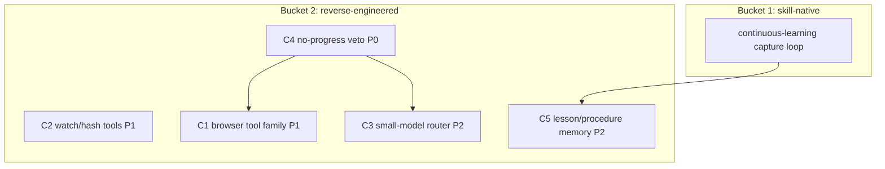

# Cross-Project Comparison: Nexus vs. Atomic Agent

**Version**: v2.0.2
**Adoption target**: v2.0.0
**Generated**: 2026-08-05
**Analyzer**: Claude Code -- /compare command
**External Source**: https://github.com/AtomicBot-ai/atomic-agent (Repository)
**Source Type**: Repository
**Pre-ingest source-security verdict**: CLEAR -- see Section 5.0

---

## Section 1: Executive Summary

Atomic Agent (`AtomicBot-ai/atomic-agent`, MIT, ~1.2k stars, developer preview) is a TypeScript local-first AI agent that manages the user's browser and files: Playwright-driven browser control (navigate, click, type, ARIA snapshots), a rich local filesystem tool set (read/write/edit/patch/glob/grep/watch/hash), approval-gated shell execution, SQLite+FTS5 memory with lessons/procedures/voting, cron-scheduled tasks, and a llama.cpp inference backend tuned for fast small local models (custom TurboQuant quantization, speculative decoding). Architecturally it is close kin to Nexus: TypeScript agent loop, local models by default, a Tauri sidecar for desktop embedding, approval gates in front of consequential actions, and append-only local traces.

The adoptable signal is concentrated in three areas Nexus does not yet cover: a local browser-automation tool surface (Nexus's web tools stop at `web_search` / `fetch_page`, both DANGEROUS-tier in `modules/coding/guardrails/PermissionTiers.ts:22-23`), file-management tool extensions (watch/hash), and loop-robustness patterns for small local models (a no-progress veto, aggressive tool-result compression, and a fast small-model command router). Five candidates survive the policy gate; four items are rejected outright on MCP Registry Policy grounds (Exa search-as-service, cloud/OpenRouter provider breadth, the Telegram remote-control relay, and the external ClawHub skill hub, which Nexus-Hub already replaces).

**Overall recommendation: reverse-engineer the browser-automation tool surface over a local Playwright dependency as the headline v2.0.x adoption, pick up the low-cost loop-robustness and file-tool wins, and reject every outbound surface (Exa, cloud providers, Telegram, ClawHub) wholesale.**

## Section 2: Project Profiles

| Aspect | Nexus (this project) | Atomic Agent |
|---|---|---|
| Identity | Nexus (Nexus-AI) | Atomic Agent (`AtomicBot-ai/atomic-agent`) |
| Kind of artifact | Local-first desktop AI Studio (4 pillars) | Local-first AI agent for browser + file management |
| Purpose | Coding + Chat + Image + Video, local-only | "Manages your browser and files; high-speed local models run commands and remember context securely on your machine" |
| Version / maturity | Milestone v1.15.0 in flight; release track toward v2.0.x targets | Developer preview; "APIs and behavior remain in flux" |
| License | MIT | MIT |
| Author / owner | @bendourthe | AtomicBot-ai org |
| Primary language | TypeScript (+ Rust/Tauri shell, Python diffusion sidecar) | TypeScript (Node 25.7+); Ink + React terminal UI |
| Platform | Windows, macOS (Intel + Apple Silicon), Linux x86_64 | macOS, Linux x64, Windows x64 |
| Network posture | Local-first; no outbound without explicit opt-in | Local-first default; optional Exa search, cloud LLMs, Telegram, external MCP |
| Agent framework | Internal Nexus coding engine (`src/tools/ToolRegistry.ts:54`, `src/tools/AgentLoop.ts`, tiered permissions, 4-layer memory) | Internal loop: model -> JSON tool calls -> execution -> result compression -> repeat |
| Relevance to Nexus | Same TypeScript local-first agent species; strongest external signal yet on browser control and small-model loop robustness | High |

## Section 3: Capability and Architecture Comparison

### 3a: Runtime, models, and inference

| Aspect | Nexus (current) | Atomic Agent | Delta |
|---|---|---|---|
| Desktop shell | Tauri 2.x + React 19 + Node JSON-RPC sidecar (`desktop/src-tauri/src/sidecar.rs`) | Terminal-first (Ink + React); Tauri sidecar for desktop embedding | Inverted packaging: Nexus is desktop-first, Atomic is TUI-first with a Tauri option |
| Inference backend | Ollama / LM Studio over loopback only, manifest-driven (`modules/coding/llm/LocalAdapterRegistry.ts:13-21,:35`) with a hard non-loopback reject citing the MCP policy | Locally-managed `llama-server` (llama.cpp) with custom TurboQuant quantization + speculative decoding (Gemma 4 MTP, Qwen 3.6 NextN); optional OpenAI-compatible / OpenRouter | Both local-first; Atomic ships its own llama.cpp management and quantization, Nexus delegates to Ollama by design |
| Models validated | Hardware-aware catalog (`core/registry/catalog.json`), per-model harness selector (v1.12.0) | Qwen 3.6-35B, Qwen 3.5-9B, Gemma 4-12B; GAIA L1 69.8% (37/53) with Qwen 3.6-35B | Atomic publishes an agentic benchmark against a public suite; Nexus benchmarks are per-cycle internal |
| Loop robustness | Auto-mode verification gate (`src/tools/AgentLoop.ts`); output compression tools (`compress_range`, `compress_message`, `PermissionTiers.ts:24-25`) | Result compression each turn + "no-progress veto after 5 identical calls" | Nexus lacks an identical-call circuit breaker (candidate C4) |

### 3b: Tool surface and governance

| Aspect | Nexus (current) | Atomic Agent | Delta |
|---|---|---|---|
| Browser | `web_search` + `fetch_page` only, DANGEROUS tier (`PermissionTiers.ts:22-23`); no DOM interaction | Playwright: navigation, clicking, typing, ARIA snapshots over Chrome/Edge/Chromium | Major gap in Nexus (candidate C1) |
| Filesystem | read/write/edit/create/delete + glob/grep tools (`PermissionTiers.ts:11-20`) | read, write, edit, patch, glob, grep, plus watch and hash | Nexus lacks watch/hash (candidate C2) |
| Shell | `run_terminal` DANGEROUS tier + allowlist (`src/tools/handlers/terminal.ts` `isAllowlisted`) + `ConfirmationGate` (`src/tools/ConfirmationGate.ts:4`) + git checkpoints (`modules/coding/guardrails/GitSafetyNet.ts`) | Approval-gated command execution | Equivalent intent; Nexus deeper (tiers, floor-clamp, git safety net) |
| Approval gates | 3-tier `PermissionTier` enum (`PermissionTiers.ts:5-9`) + `ActionClassifier` (`modules/coding/guardrails/ActionClassifier.ts`) | Gates on shell, fs writes/patches, archive extraction, process kill, HTTP, skill scripts, untrusted MCP tools | Same shape; Atomic's per-category gate list maps cleanly onto Nexus tiers |
| Memory | 4-layer (working/episodic/semantic/graph) + hybrid retrieval (`core/memory/MemoryHub.ts`, `core/memory/HybridRetriever.ts`, `core/memory/RrfFuser.ts`) | SQLite+FTS5: profile facts, notes, links, lessons, procedures, voting | Nexus retrieval is richer; Atomic's "lessons/procedures with voting" is a distilled-learning store Nexus lacks natively (C5) |
| Scheduling | No user-facing scheduler (A2 in the v1.18.0 OpenWorker comparison, `docs/archive/v1/v1.18/comparisons/v1.18.0-comparison-openworker.md`) | Cron schedules, deferred turns, webhooks | Reconfirms the A2 gap; webhooks are an inbound surface Nexus should not take |
| MCP / skills | Stdio MCP, default-deny (`modules/coding/mcp/HubRegistryPolicyFilter.ts`, `modules/coding/mcp/McpManager.ts`); Nexus-Hub skill feed | External MCP servers gated as untrusted; 17 starter Markdown playbooks; ClawHub hub | Equivalent MCP posture; ClawHub duplicates what Nexus-Hub already provides |
| Traces | Session replay + standalone HTML export; `redactSecrets` scrubbing (`core/observability/redactSecrets.ts`) | Append-only NDJSON traces; prompt drift replay | Roughly equivalent; Nexus adds secret redaction |

**Key contrast:** Atomic Agent independently converges on Nexus's core doctrine (TypeScript loop, local models, approval gates, local state, default-deny on untrusted MCP), which is further external validation. The genuinely new material is the Playwright browser tool surface and the small-model loop hardening; everything else Atomic does, Nexus either already does more deeply or has already rejected by policy.

## Section 4: Gap Analysis

### 4a: Present in Atomic Agent, missing or partial in Nexus (adoption candidates)

- **C1 -- Local browser-automation tool surface.** Playwright-driven `browser_*` tools (navigate, click, type, ARIA snapshot) against the user's local Chrome/Edge/Chromium. Nexus's web reach today is `web_search` / `fetch_page` (`PermissionTiers.ts:22-23`); there is no way for the coding agent to drive a page. ARIA snapshots (not screenshots) keep token cost small enough for local models.
- **C2 -- Filesystem watch/hash tools.** `watch_path` (observe changes during a run) and `hash_file` (cheap integrity/change detection) extend the existing read-only tool family in `src/tools/ToolRegistry.ts` at AUTO_APPROVE tier.
- **C3 -- Fast small-model command router.** Atomic's headline is "high-speed local models run commands": route short imperative requests to a small fast local model (Qwen 3.5-9B class from `core/registry/catalog.json`) that emits one JSON tool call, escalating to the full loop only when the router abstains. Complements the v1.12.0 per-model harness selector.
- **C4 -- No-progress veto.** Abort/redirect after N identical consecutive tool calls. Small local models loop more than frontier models; this is a cheap circuit breaker inside `src/tools/AgentLoop.ts`.
- **C5 -- Lessons/procedures memory kinds with voting.** Distilled "what worked" records promoted from episodic memory, with a usefulness vote signal. Nexus-Hub's `continuous-learning` skill already covers capture/minting at the skill layer, so only thin memory-kind support in `core/memory/MemoryHub.ts` is code.

### 4b: Present in Nexus, missing in Atomic Agent (strengths to preserve)

- Four-pillar product surface (Coding, Chat, Image, Video) + GPU scheduler + VRAM telemetry -- Atomic is a single agent surface with optional vision describe.
- Four-layer memory with hybrid retrieval (BM25 + dense + graph via RRF, `k=60`) vs. FTS5-only search.
- Tiered permission model with floor-clamp, `ActionClassifier`, git checkpoints (`GitSafetyNet.ts`) -- deeper than per-category approval gates.
- `redactSecrets` pre-index/pre-export scrubbing (`core/observability/redactSecrets.ts`); Atomic stores secrets in a flagged `.env` file.
- Cross-OS installer that provisions runtimes and weights; Atomic uses `curl | sh` / `irm | iex` install scripts.
- Reverse-engineering-first MCP policy with zero as-a-service integrations by construction.

### 4c: Present in both (quality comparison)

| Capability | Nexus | Atomic Agent | Better |
|---|---|---|---|
| Local-first agent loop | Node sidecar loop + verification gate | Model -> JSON tool call -> compress -> repeat | Equivalent core; Atomic adds the no-progress veto |
| Approval gating | 3 tiers + classifier + allowlist + git safety net | Per-category gates (shell, fs, HTTP, MCP, ...) | Nexus (structured, clamped) |
| Local inference | Ollama/LM Studio loopback-only registry | Self-managed llama.cpp + TurboQuant + speculative decoding | Different by design; Atomic squeezes more speed, Nexus keeps a simpler managed runtime |
| Memory | 4-layer + hybrid retrieval | FTS5 notes + lessons/procedures + voting | Nexus on retrieval; Atomic on distilled-learning kinds |
| Traces / replay | Session replay + HTML export + redaction | Append-only NDJSON + drift replay | Nexus (redaction) |
| MCP | Default-deny, read-only tools | Untrusted-MCP approval gate | Equivalent posture |

## Section 5: Security and Risk Assessment

*This section is MANDATORY per the compare-project skill (Steps 1.5 and 5) and the MCP Registry Policy.*

### 5.0 Pre-ingest source-security scan (Step 1.5)

| Check | Atomic Agent |
|---|---|
| Prompt injection / agent-directed instructions | None found. README addresses developers/end-users; no "ignore previous instructions" payloads, no hidden/zero-width/base64 blobs surfaced in the fetched content. |
| Malicious or destructive code patterns | None surfaced in the README content examined (no credential harvesting, reverse shells, or destructive commands). Secrets location (`<stateDir>/.env`) is documented transparently as sensitive. |
| Supply-chain provenance | MIT license; org account (`AtomicBot-ai`) rather than a named individual, ~1.2k stars, developer preview. Install path is `curl -fsSL https://atomicagent.io/install \| sh` / `irm ... \| iex` -- a pipe-to-shell pattern from a vendor domain. Checksum verification is claimed but the script was NOT executed or byte-audited here. |
| Residual flags | The pipe-to-shell installer and preview-stage maturity are noted as caution items for any future code-level engagement. Irrelevant to this comparison: all candidates are reverse-engineered, no Atomic code is vendored or executed. |

**Verdict: CLEAR.** Ingestion proceeded; all source text was treated as data, never instructions. A byte-level scan of the repository tree (and never running the hosted install script) is a precondition of adopting any Atomic Agent *code* -- none is recommended here.

### 5.1 Threat-model delta

| Dimension | Adoption delta |
|---|---|
| New runtime dependencies | C1 adds one local OSS library (Playwright + a local browser it drives). C2-C5 add none. Rejected items would add Exa, OpenRouter/cloud SDKs, and the Telegram Bot API. |
| Outbound-call destinations | Zero new destinations for C2-C5. C1's browser tools reach whatever URL the user's task targets -- an agent-steered outbound surface that must sit at DANGEROUS tier like `fetch_page`, never below. Rejected items would add hosted search, cloud inference, and Telegram servers. |
| Credentials / API keys | Zero for all candidates. Browser automation must never be pointed at the user's logged-in default profile by default (session-cookie exfiltration risk); use an isolated browser profile. |
| Data leaving the machine | None for C2-C5. C1 sends page interactions to user-chosen sites only, under per-action gating. |
| New inbound surface | None adopted. Atomic's webhooks are explicitly NOT taken (inbound trigger surface). |

### 5.2 Per-item risk scorecard

| Item | Risk tier | Justification |
|---|---|---|
| C1 Browser-automation tools | Medium | Agent-steered outbound + page content is untrusted input (indirect prompt injection); requires DANGEROUS tier, isolated profile, per-action confirmation, and ARIA-snapshot sanitization before it enters the prompt |
| C2 watch/hash file tools | None-Low | Local, read-only; watch must be scoped to the workspace root |
| C3 Small-model command router | Low | Router output is a proposal only; every routed call still passes `PermissionTiers`/`ConfirmationGate`, never bypasses them |
| C4 No-progress veto | None | Pure loop-control logic; strictly tightens behavior |
| C5 Lessons/procedures memory | Low | Local writes through the existing `redactSecrets` pre-index path; poisoned "lessons" must remain advisory context, never executable instructions |

## Section 6: Reverse-Engineering Viability Analysis

*MANDATORY. Every candidate is classified against the decision tree: skill-native > re-full > re-partial > vendor-intrinsic > drop-outright.*

| Item | Classification | Internal deliverable | Effort | Rationale |
|---|---|---|---|---|
| C1 Browser-automation tools | re-partial | New `browser_*` tool family in `src/tools/ToolRegistry.ts` (navigate/click/type/aria_snapshot) at DANGEROUS tier, over a locally-installed Playwright dependency and an isolated browser profile | High | The tool schema, ARIA-snapshot representation, and gating are reverse-engineered; Playwright itself is a local OSS library (no service), so this is re-partial, not re-full |
| C2 watch/hash file tools | re-full | `watch_path` + `hash_file` handlers alongside the existing fs tools; AUTO_APPROVE tier entries in `PermissionTiers.ts` | Low | Pure Node stdlib (`fs.watch`, `crypto`); no Atomic code needed |
| C3 Small-model command router | re-full | Local intent router that classifies a request and dispatches a single tool call via a small catalog model, with abstain-and-escalate | Medium | Extends the v1.12.0 per-model harness selector; all-local |
| C4 No-progress veto | re-full | Identical-call detector + halt/redirect in `src/tools/AgentLoop.ts` | Low | A hash-window over recent tool calls |
| C5 Lessons/procedures memory | skill-native + re-partial | Capture/minting: existing Nexus-Hub `continuous-learning` skill (skill-native). Storage: `lesson`/`procedure` kinds + usefulness counter in `core/memory/MemoryHub.ts` (re-partial, thin) | Low-Med | The workflow already exists as a skill; only the memory-kind plumbing is code |

**Recommendation ordering (per MCP Registry Policy):** C5's capture loop is `skill-native` first; C2/C3/C4 are `re-full` local builds; C1 and C5's storage are `re-partial`. Nothing is `vendor-intrinsic`; all rejected items fall to `drop` in Section 9.

## Section 7: Adoption Plan

### Bucket 1 -- skill-native (zero-code wins)

| What | Source | Target | Effort | Deps | Risk |
|---|---|---|---|---|---|
| Lessons/procedures capture loop (P1) | Atomic memory "lessons, procedures, voting" | Nexus-Hub `continuous-learning` skill (already exists) | None | -- | None |
| Command playbooks (P3) | Atomic's 17 starter Markdown playbooks | Nexus-Hub skill catalog (already exists; no import) | None | -- | None |

### Bucket 2 -- reverse-engineered internal builds

| What | Source | Target | Effort | Deps | Risk |
|---|---|---|---|---|---|
| C4 No-progress veto (P0) | Atomic 5-identical-calls veto | `src/tools/AgentLoop.ts` | Low | -- | None |
| C2 watch/hash file tools (P1) | Atomic fs tool set | `src/tools/` handlers + `PermissionTiers.ts` | Low | -- | None-Low |
| C1 Browser-automation tool family (P1) | Atomic Playwright browser tools | New `browser_*` tools in `src/tools/ToolRegistry.ts`, DANGEROUS tier, isolated profile, ARIA snapshots | High | C4 (loop safety first) | Medium |
| C3 Small-model command router (P2) | Atomic high-speed local command execution | Router in front of `AgentLoop`, models from `core/registry/catalog.json` | Medium | C4 | Low |
| C5 lesson/procedure memory kinds (P2) | Atomic memory kinds + voting | `core/memory/MemoryHub.ts` + `redactSecrets` path | Low-Med | skill-native capture loop | Low |

### Bucket 3 -- vendor-intrinsic

None. No candidate requires a third party as its intrinsic data destination. (Telegram remote control was evaluated for this bucket and rejected -- see N3.)

## Section 8: Implementation Sequence

Suggested phasing for the v2.0.x cycle:
1. C4 (P0): the loop circuit breaker, prerequisite hardening for any longer-running browser or routed work.
2. C2 + C1 (P1): file-tool extensions land trivially; the browser tool family is the headline build and needs its own security design pass (isolated profile, DANGEROUS tier, snapshot sanitization).
3. C3 + C5 (P2): the fast command router once C4 protects the loop; lesson/procedure memory kinds once the skill-native capture loop is exercised.

## Section 9: Risks and Explicit Rejections

General considerations:
- C1 is the one candidate that materially widens the threat model: browser pages are untrusted content that flows back into the prompt (indirect prompt injection). ARIA snapshots must be treated as data, sanitized, and every consequential browser action must pass the existing `PermissionTiers`/`ConfirmationGate` path.
- C3 must remain a dispatcher, not a bypass: a fast model choosing a tool call does not lower that call's permission tier.
- Atomic Agent is a developer preview; adopt its *patterns*, never pin against its APIs or vendor its code.

### Items explicitly NOT recommended for adoption

- **N1 -- Exa web-search provider.** A hosted search-as-service dependency. **Rejected** (MCP Registry Policy "hard no" on search-as-service; Nexus's `web_search` stays behind the existing DANGEROUS-tier local tool with explicit opt-in).
- **N2 -- Cloud LLM providers / OpenRouter breadth.** Outbound inference with API keys and per-token billing. **Rejected** (MCP Registry Policy; already formally dropped as D1 in the v1.6.0 aisuite adoption, `docs/archive/v1/v1.6/plans/adoption-aisuite-harness.md`; `LocalAdapterRegistry.ts` rejects non-loopback endpoints by construction).
- **N3 -- Telegram Bot API remote control.** Routes agent control and command output through Telegram's servers -- an outbound relay and a remote inbound command surface. Evaluated for the trusted-vendor bucket and **rejected**: the vendor is not an intrinsic data destination for Nexus, the feature is not "extremely worth it" for a desktop-first studio, and it violates local-first (MCP Registry Policy step 4/5).
- **N4 -- ClawHub external skill hub.** A third-party skill distribution surface. **Rejected** (MCP Registry Policy step 2/3: Nexus-Hub is the sole, author-owned upstream skill feed, `README.md` "How Nexus fits with Nexus-Hub"; importing a second external hub adds supply-chain surface for zero capability gain). Atomic's webhooks trigger surface is likewise not taken (new inbound surface).

## Appendix: Source Facts (as fetched 2026-08-05)

**Atomic Agent (`AtomicBot-ai/atomic-agent`, MIT, ~1.2k stars, ~170 forks, TypeScript, Node 25.7+).** "Local First Ai Agent. Optimized for Local Ai models. Long context window. Proper tools callings. Runs privately on your device." Core loop: model -> JSON tool calls -> execution -> result compression -> repeat. Components: Playwright browser automation (Chrome/Edge/Chromium; navigation, clicking, typing, ARIA snapshots); filesystem tools (read, write, edit, patch, glob, grep, watch, hash); approval-gated shell; SQLite+FTS5 memory (profile facts, notes, links, lessons, procedures, voting); tasks (cron, deferred turns, webhooks); 17 starter Markdown playbooks + ClawHub integration; optional `vision.describe`; MCP client; single-user Telegram remote control; Ink + React TUI; Tauri sidecar for desktop embedding. Inference: locally-managed `llama-server` (llama.cpp) with custom TurboQuant quantization and speculative decoding (Gemma 4 MTP, Qwen 3.6 NextN); tested on Qwen 3.6-35B, Qwen 3.5-9B, Gemma 4-12B; optional OpenAI-compatible / OpenRouter providers. Benchmark: GAIA Level 1 (53 tasks) 69.8% (37/53) with Qwen 3.6-35B, ~217 s/task. State: `~/.atomic-agent/` (plain files, SQLite, NDJSON); secrets in `<stateDir>/.env` (documented as sensitive). Safety: approval gates on shell, fs writes/patches, archive extraction, process termination, HTTP, skill scripts, untrusted MCP tools; append-only NDJSON traces; no-progress veto after 5 identical calls; per-session FIFO ordering; prompt drift replay. Install: `curl -fsSL https://atomicagent.io/install | sh` (macOS/Linux), `irm https://atomicagent.io/install.ps1 | iex` (Windows). Platforms: macOS, Linux x64, Windows x64. Status: developer preview. Pre-ingest security verdict: CLEAR.
