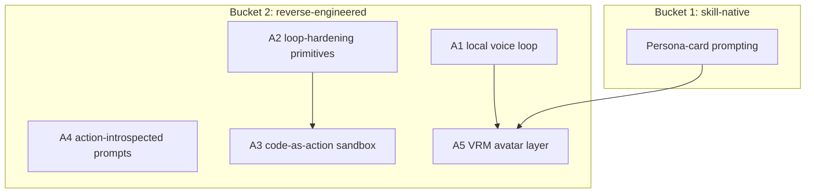

# Cross-Project Comparison: Nexus vs. Airi

**Version**: v2.0.3
**Adoption target**: v2.0.0
**Generated**: 2026-08-05
**Analyzer**: Claude Code -- /compare command
**External Source**: https://github.com/moeru-ai/airi (Repository)
**Source Type**: Repository
**Pre-ingest source-security verdict**: CLEAR -- see Section 5.0

---

## Section 1: Executive Summary

Airi ("Project AIRI", moeru-ai, MIT, ~47k stars) is a self-hosted AI companion inspired by Neuro-sama: an animated Live2D/VRM avatar that talks in real time, remembers past conversations, connects to Discord/Telegram, and autonomously plays games (a Minecraft agent that plans a path, gathers resources, and builds; Factorio and KSP tracks announced). It is a TypeScript/Vue monorepo with Rust components, deployed as a browser PWA, an Electron desktop app ("Stage Tamagotchi"), and an iOS build, with local inference via HuggingFace Candle / WebGPU alongside 20+ cloud LLM providers and hosted TTS services (ElevenLabs, Azure).

Airi and Nexus barely overlap in product surface: Airi is a character-companion runtime; Nexus is a four-pillar local AI Studio (Coding, Chat, Image, Video -- `desktop/src/modules/coding/CodingPage.tsx`, `chat/ChatPage.tsx`, `image/ImageStudioPage.tsx`, `video/VideoLabPage.tsx`). The useful signal for Nexus is concentrated in three areas of Airi's engineering, all assessed against the Chat pillar and the coding agent loop: (1) a fully local real-time voice loop (client-side STT + local TTS), (2) the Minecraft agent's long-horizon autonomy machinery (conscious/reflex event prioritization, code-as-action execution in a sandboxed worker, a bounded control-action queue, no-action budgets, error-burst guards), and (3) an optional avatar presence layer for Chat. Airi's memory architecture (DuckDB WASM, "Memory Alaya" WIP) is behind Nexus's shipped four-layer memory and hybrid retrieval, so nothing is adopted there.

Five adoption candidates survive the policy gate (persona-card prompting as skill-native; local voice loop, autonomy-loop hardening, code-as-action sandbox pattern, and a VRM avatar layer as reverse-engineered builds). Three items are rejected outright on MCP Registry Policy grounds: the 20+ cloud model-provider matrix, the hosted TTS services, and the Discord/Telegram connector surface. The game-playing product surface itself is dropped as out of scope.

**Overall recommendation: reverse-engineer Airi's local voice loop and its autonomy-loop safety patterns for the Chat pillar and coding agent respectively; treat the avatar as an optional P3 delight feature; reject the cloud provider matrix, hosted TTS, and chat-platform connectors wholesale.**

## Section 2: Project Profiles

| Aspect | Nexus (this project) | Airi |
|---|---|---|
| Identity | Nexus (Nexus-AI) | Project AIRI (`moeru-ai/airi`) |
| Kind of artifact | Local-first desktop AI Studio (4 pillars) | Self-hosted AI companion / VTuber runtime |
| Purpose | Coding + Chat + Image + Video, local-only | Animated avatar companion: real-time talk, memory, game-playing |
| Version / maturity | Release track v2.0.x; milestone v1.15.0 in flight | v0.10.2, ~4.2k commits, very active |
| License | MIT | MIT |
| Author / owner | @bendourthe | moeru-ai org (community project) |
| Primary language | TypeScript (+ Rust/Tauri shell, Python diffusion sidecar) | TypeScript/Vue (+ Rust, WASM/WebGPU) |
| Platform | Windows, macOS (Intel + Apple Silicon), Linux x86_64 (Tauri 2) | Browser PWA, Electron desktop (Win/macOS), iOS (Capacitor) |
| Network posture | Local-first; no outbound without explicit opt-in | Self-hostable, but ships 20+ cloud providers + hosted TTS + Discord/Telegram |
| Agent framework | Internal Nexus coding engine (`src/tools/AgentLoop.ts`, tool registry, 4-layer memory) | CognitiveEngine plugin + `@proj-airi/server-sdk`; Minecraft agent via Mineflayer |
| Relevance to Nexus | Different product, overlapping engineering: voice UX, autonomy loop, avatar presence | Medium-high |

## Section 3: Capability and Architecture Comparison

### 3a: Shell, runtime, and provider architecture

| Aspect | Nexus (current) | Airi | Delta |
|---|---|---|---|
| Desktop shell | Tauri 2 + React (`desktop/src-tauri/src/lib.rs`, `desktop/src/App.tsx`) | Electron (migrated from Tauri, Oct 2025) + Vue; also browser PWA and iOS | Different shell bet; Nexus keeps the lighter Tauri footprint |
| Agent/runtime spine | Node JSON-RPC sidecar over stdio (`desktop/src-tauri/src/sidecar.rs`) | WebSocket `@proj-airi/server-sdk` connecting modules (Minecraft bot, Discord, stage UI) to a core runtime | Same hub-and-modules idea, different transport; both local-process capable |
| Model providers | Loopback-only `LocalAdapterRegistry` (`modules/coding/llm/LocalAdapterRegistry.ts`, `OllamaClient.ts`); non-loopback rejected by construction | 20+ providers (OpenAI, Anthropic, Gemini, OpenRouter, Together, ...) plus local Ollama/vLLM/SGLang and in-browser Candle/WebGPU | Fundamental policy divergence; Airi's local WebGPU inference track is the only aligned slice |
| Generation runtimes | Python diffusion sidecar (`desktop/sidecar/src/diffusion/dispatcher.ts`), Ollama for LLMs | HuggingFace Candle (Rust), WebGPU in-browser, CUDA/Metal | Different stacks, same local-inference intent |

### 3b: Companion UX, autonomy, and memory

| Aspect | Nexus (current) | Airi | Delta |
|---|---|---|---|
| Voice interaction | None (no STT/TTS anywhere in `desktop/src/`) | Real-time voice chat: client-side speech recognition + TTS (hosted ElevenLabs/Azure plus local Kokoro-class) | Gap in Nexus Chat pillar (adoption candidate A1, local slice only) |
| Avatar presence | None; Chat is text + media composer (`desktop/src/shared/chat/MediaComposer.tsx`) | Live2D + VRM avatars with auto-blink, eye tracking, lip-sync | Gap, but of debatable value for a studio product (A5, P3) |
| Long-horizon autonomy | Auto mode with verification gate (`src/tools/AgentLoop.ts`), tiered permissions (`modules/coding/guardrails/PermissionTiers.ts`), git checkpoints (`modules/coding/guardrails/GitSafetyNet.ts`), 60s `ConfirmationGate` (`src/tools/ConfirmationGate.ts`) | Minecraft agent: conscious/reflex two-layer event system, bounded control-action queue (1 executing + 4 pending), no-action budget, error-burst guard, 60s VM timeouts | Airi's loop-hardening primitives are adoptable into Nexus auto mode (A2) |
| Action execution model | JSON tool calls via tool registry (`modules/coding/llm/ToolCallFormat.ts`) | LLM writes a JavaScript script executed in a sandboxed worker, plus a side-effect-free Query DSL for world introspection | Pattern candidate for complex multi-step tool sequences (A3), with real risk to manage |
| Memory | Four-layer memory + hybrid retrieval: BM25 + dense + graph via RRF (`core/memory/HybridRetriever.ts`, `RrfFuser.ts`, `MemoryHub.ts`, `LocalEmbedder.ts`), decay (`core/memory/DecaySweep.ts`), contradiction resolution (`core/memory/ContradictionResolver.ts`) | In-browser DuckDB WASM store; "Memory Alaya" long-term memory still WIP | Nexus is ahead; nothing to adopt |
| Game playing | None (out of product scope) | Minecraft (Mineflayer), Factorio, KSP announced | Surface dropped; only the loop machinery transfers |

**Key contrast:** Airi validates that a local-first TypeScript companion with real-time voice and a long-horizon autonomous agent loop is buildable on consumer hardware. Nexus should mine the machinery (voice loop, autonomy guards, sandboxed code-as-action) without importing the product (character companion, game bots, cloud provider breadth).

## Section 4: Gap Analysis

### 4a: Present in Airi, missing or partial in Nexus (adoption candidates)

- **A1 -- Local real-time voice loop for the Chat pillar.** Client-side STT (Whisper-class via local runtime) + local TTS (Kokoro-class open weights) + push-to-talk / VAD UX in `ChatPage.tsx`. Airi proves the full loop runs client-side; Nexus's installer already provisions model runtimes (README "Installer carries the burden"), so weights distribution has a home.
- **A2 -- Autonomy-loop hardening primitives.** Bounded control-action queue, no-action budget (cap consecutive "thinking" turns), and error-burst guard for `src/tools/AgentLoop.ts` auto mode. These are cheap, local, and directly reduce runaway-loop risk on long-horizon runs.
- **A3 -- Sandboxed code-as-action execution with a side-effect-free Query DSL.** For multi-step tool sequences, let the model emit a script executed in a locked-down worker with read-only introspection separated from mutating actions. Complements the v1.12.0 exec-sandbox audit; must route every mutating call through `PermissionTiers`.
- **A4 -- Action-introspected system prompts.** Airi generates its system prompt by introspecting the action registry, injecting compact Zod-typed docs per tool. Nexus's tool registry can do the same to keep prompts and tools in lockstep.
- **A5 -- Avatar presence layer (VRM).** An optional animated presence in Chat via open `three-vrm`-class rendering (auto-blink, lip-sync driven by A1's TTS timing). Cosmetic; strictly P3.

### 4b: Present in Nexus, missing in Airi (strengths to preserve)

- Four-layer memory with hybrid BM25 + dense + graph retrieval via RRF (`core/memory/HybridRetriever.ts`, `RrfFuser.ts`) vs Airi's WIP memory layer.
- Tiered permissions with floor-clamp, git checkpoints, and a verification-pass gate (`modules/coding/guardrails/PermissionTiers.ts`, `GitSafetyNet.ts`, `src/tools/AgentLoop.ts`).
- Image Studio and Video Lab pillars with a local diffusion sidecar (`desktop/sidecar/src/diffusion/dispatcher.ts`).
- Loopback-only provider registry rejecting non-local endpoints by construction (`modules/coding/llm/LocalAdapterRegistry.ts`).
- `redactSecrets` pre-index/pre-export scrubbing (`core/observability/redactSecrets.ts`); Airi has no equivalent redaction layer documented.
- Real model registry with disk/Ollama reconciliation (`core/registry/catalog.json`).

### 4c: Present in both (quality comparison)

| Capability | Nexus | Airi | Better |
|---|---|---|---|
| Local inference | Ollama/LM Studio loopback only | Candle/WebGPU/Ollama/vLLM plus 20+ cloud providers | Nexus on posture; Airi on local-runtime breadth |
| Persistent memory | 4-layer + hybrid retrieval, decay, contradiction resolution | DuckDB WASM, long-term memory WIP | Nexus |
| Agent loop safety | Tiers + gates + git checkpoints | Queue caps, budgets, burst guards, VM timeouts | Complementary; each has what the other lacks |
| Desktop packaging | Tauri 2 native bundles + one-shot installer | Electron + winget/Homebrew/Scoop | Nexus (footprint, installer depth) |
| Multi-platform reach | Win/macOS/Linux desktop | Web + desktop + iOS | Airi (reach), by design not a Nexus goal |

## Section 5: Security and Risk Assessment

*This section is MANDATORY per the compare-project skill (Steps 1.5 and 5) and the MCP Registry Policy.*

### 5.0 Pre-ingest source-security scan (Step 1.5)

| Check | Airi |
|---|---|
| Prompt injection / agent-directed instructions | None found. README and docs target developers/users; no "ignore previous instructions" payloads, no hidden/zero-width/base64 blobs surfaced in the fetched content. |
| Malicious or destructive code patterns | None surfaced in the README/docs content examined. Install channels are standard package managers (winget, Homebrew, Scoop). |
| Supply-chain provenance | Community org (`moeru-ai`), MIT, ~47k stars, 4.2k+ commits, active releases (v0.10.2). Large pnpm monorepo with many sub-packages; no byte-level dependency scan performed here. One licensing flag: Live2D rendering depends on the proprietary Live2D Cubism Core SDK (not MIT), relevant only if A5 chose Live2D over VRM. |
| Residual flags | None beyond the Live2D licensing note. |

**Verdict: CLEAR.** Ingestion proceeded. No source content was treated as instructions. This scan covered the README, docs, and architecture-wiki surface fetched over the web; a byte-level scan of the repository tree is a precondition of adopting any Airi *code* (none is recommended -- all candidates are reverse-engineered, not vendored).

### 5.1 Threat-model delta

| Dimension | Adoption delta |
|---|---|
| New runtime dependencies | A1 adds local STT/TTS model weights + a local audio runtime (installer-provisioned, offline). A2/A4 add none. A3 adds a worker sandbox boundary that must be hardened. A5 adds a local 3D rendering lib. Rejected items would add many cloud dependencies. |
| Outbound-call destinations | Zero for all five candidates; weights are pulled once by the installer like existing models. Rejected items (cloud providers, hosted TTS, Discord/Telegram) would add persistent outbound channels. |
| Credentials / API keys | Zero for the candidates. Hosted TTS and chat connectors would introduce per-service credential storage. |
| Data leaving the machine | None for the candidates; microphone audio is processed locally (A1). Rejected items would stream conversation audio/text to third-party processors. |
| New inbound/exec surface | A3 is the significant one: model-authored code execution. It must run in a no-network, no-fs-by-default worker, with mutating operations routed through `PermissionTiers`/`ConfirmationGate` and checkpointed by `GitSafetyNet`. A1 adds a microphone capture surface gated behind explicit user activation. |

### 5.2 Per-item risk scorecard

| Item | Risk tier | Justification |
|---|---|---|
| A1 Local voice loop | Low | Mic data stays on-host; local weights only; UI must show a clear capture indicator |
| A2 Loop-hardening primitives | None | Pure local control logic that tightens, never loosens, existing gates |
| A3 Code-as-action sandbox | Medium | Model-authored code execution; requires locked-down worker, Query DSL read/write separation, permission-tier routing, timeouts |
| A4 Action-introspected prompts | None | Prompt assembly from the local tool registry |
| A5 VRM avatar layer | Low | Local rendering only; choose VRM (open) over Live2D (proprietary Cubism core) to avoid a licensing/supply-chain flag |
| P0 Persona-card prompting | None | Skill-native prompt content, no code |

## Section 6: Reverse-Engineering Viability Analysis

*MANDATORY. Every candidate is classified against the decision tree: skill-native > re-full > re-partial > vendor-intrinsic > drop-outright.*

| Item | Classification | Internal deliverable | Effort | Rationale |
|---|---|---|---|---|
| Persona-card prompting (companion identity/persona system prompts) | skill-native | Prompt patterns via existing Nexus-Hub `prompt-engineering` / `creative-generation` skills; per-chat persona field in Chat settings | None-Low | Pure prompting; no Airi code involved |
| A2 Loop-hardening primitives | re-full | Bounded action queue, no-action budget, error-burst guard inside `src/tools/AgentLoop.ts` auto mode | Low-Med | Small, well-described local control logic |
| A4 Action-introspected prompts | re-full | Prompt assembler that walks the tool registry and emits compact typed docs | Low | Nexus already owns registry + `ToolCallFormat.ts` |
| A1 Local voice loop | re-full | Local STT (Whisper-class) + local TTS (Kokoro-class open weights) + VAD/push-to-talk UX in `ChatPage.tsx`; weights provisioned by the installer | High | The local slice is fully reverse-engineerable; hosted TTS providers are excluded (see N2) |
| A3 Code-as-action sandbox | re-partial | Sandboxed-worker script execution + side-effect-free Query DSL, adopted only for bounded multi-step sequences; JSON tool calls remain the default | Medium-High | The pattern transfers; Airi's Minecraft-specific ActionRegistry and Mineflayer wiring do not |
| A5 VRM avatar layer | re-partial | Optional VRM presence in Chat using open renderers; skip Live2D (proprietary Cubism core = vendor-intrinsic sub-part, not worth it) | Medium | Rendering is open; expression/lip-sync driven by A1 |
| Game-playing surface (Minecraft/Factorio bots) | drop-outright | -- | -- | Outside the four-pillar product scope; only its loop machinery transfers (captured as A2/A3) |
| Cloud provider matrix, hosted TTS, Discord/Telegram connectors | drop-outright | -- | -- | See Section 9 |

**Recommendation ordering (per MCP Registry Policy):** one skill-native win, three re-full builds, two re-partial builds, zero vendor-intrinsic items, and the game surface plus all cloud/connector items dropped.

## Section 7: Adoption Plan

### Bucket 1 -- skill-native (zero-code wins)

| What | Source | Target | Effort | Deps | Risk |
|---|---|---|---|---|---|
| Persona-card prompting for Chat (P2) | Airi character/persona config | Nexus-Hub `prompt-engineering` / `creative-generation` skills + a per-chat persona field | None-Low | -- | None |

### Bucket 2 -- reverse-engineered internal builds

| What | Source | Target | Effort | Deps | Risk |
|---|---|---|---|---|---|
| A2 Loop-hardening primitives (P0) | Minecraft agent brain (queue caps, budgets, burst guard) | `src/tools/AgentLoop.ts` auto mode | Low-Med | -- | None |
| A4 Action-introspected prompts (P1) | Airi dynamic system-prompt generation | Tool registry prompt assembler | Low | -- | None |
| A1 Local voice loop (P1) | Airi client-side STT + local TTS | Chat pillar (`ChatPage.tsx`) + installer weights provisioning | High | installer catalog entry | Low |
| A3 Code-as-action sandbox (P2) | Airi sandboxed-worker execution + Query DSL | Coding engine, behind `PermissionTiers` + `GitSafetyNet` | Med-High | v1.12.0 exec-sandbox audit | Medium |
| A5 VRM avatar layer (P3) | Airi VRM/Live2D stage | Optional Chat presence pane (VRM only) | Medium | A1 (lip-sync timing) | Low |

### Bucket 3 -- vendor-intrinsic

None. No candidate requires a third party as its intrinsic destination. (Live2D's proprietary Cubism core was evaluated as a vendor-intrinsic sub-dependency of A5 and rejected in favor of open VRM.)

## Section 8: Implementation Sequence

Suggested phasing:
1. A2 (P0): loop-hardening lands first -- cheapest, pure safety upside, and a precondition for trusting longer autonomous runs.
2. A4 + persona-card prompting (P1/P2): prompt-side improvements, independent and low effort.
3. A1 (P1): the local voice loop -- the highest-value Chat pillar feature, gated on installer catalog work for STT/TTS weights.
4. A3 (P2): code-as-action only after A2's guards exist and only inside the audited exec sandbox.
5. A5 (P3): avatar presence last, only if Chat pillar demand justifies it.

## Section 9: Risks and Explicit Rejections

General considerations:
- Airi's headline appeal (a character that talks, remembers, and plays games) is a different product; adopt machinery, not identity. Do not let the avatar/companion framing drift Nexus's studio positioning.
- A3 is the only candidate that expands the execution surface; it must never bypass `PermissionTiers`, `ConfirmationGate`, or `GitSafetyNet`, and mutating actions must stay out of the Query DSL.
- A1's weights (Whisper-class STT, Kokoro-class TTS) must ship through the existing installer/catalog path (`core/registry/catalog.json`), not ad-hoc downloads.
- Airi's memory layer is behind Nexus's; resist any urge to swap SQLite-backed memory for DuckDB WASM to "match" Airi.

### Items explicitly NOT recommended for adoption

- **N1 -- The 20+ cloud LLM provider matrix (OpenAI, Anthropic, Gemini, Groq, OpenRouter, Together, Mistral, regional APIs, ...).** Outbound inference with per-provider API keys and per-token billing. **Rejected** (MCP Registry Policy: cloud provider breadth already formally dropped as D1 in v1.6.0; conflicts with local-first / "Zero Tokens Billed"; `modules/coding/llm/LocalAdapterRegistry.ts` rejects non-loopback endpoints by construction).
- **N2 -- Hosted TTS/voice services (ElevenLabs, Azure Speech, OpenAI-compatible TTS).** Speech synthesis as a metered cloud service streaming conversation text to third-party processors. **Rejected** (MCP Registry Policy "hard no" on generation-as-a-service; the local Kokoro-class slice of A1 delivers the capability without the service).
- **N3 -- Discord and Telegram connector surface.** SaaS chat-platform connectors that relay conversation content off-machine and require per-service credentials. **Rejected** (MCP Registry Policy "hard no" on as-a-service connector surfaces; local-first design principle: no outbound without explicit opt-in; `modules/coding/mcp/HubRegistryPolicyFilter.ts` default-deny posture).

## Appendix: Source Facts (as fetched 2026-08-05)

**Airi (`moeru-ai/airi`, MIT, ~47k stars, ~4.7k forks, 4,158 commits, latest v0.10.2).** "Self hosted, you-owned Grok Companion, a container of souls of waifu, cyber livings"; a recreation of the Neuro-sama AI VTuber concept. Stack: TypeScript/Vue pnpm monorepo + Rust, WebAssembly/WebGPU/Web Audio; deployment targets are Stage Web (browser PWA), Stage Tamagotchi (Electron desktop, migrated from Tauri in Oct 2025; Windows/macOS via winget/Homebrew/Scoop), and Stage Pocket (iOS via Capacitor). Local inference via HuggingFace Candle (CUDA/Metal) and in-browser WebGPU; 20+ LLM providers including OpenAI, Anthropic, DeepSeek, Gemini, Groq, Ollama, vLLM, SGLang, OpenRouter, Together, Mistral. Voice: real-time voice chat, client-side speech recognition, TTS via ElevenLabs/Azure/OpenAI-compatible/Kokoro. Avatar: VRM and Live2D with auto-blink and eye tracking. Memory: in-browser DuckDB WASM (`@proj-airi/duckdb-wasm`, `drizzle-duckdb-wasm`); "Memory Alaya" long-term memory WIP. Integrations: Discord, Telegram. Games: Minecraft via Mineflayer (merged from `airi-minecraft`), Factorio (separate repo), Kerbal Space Program announced. Minecraft agent architecture (docs/wiki): two cognitive layers (conscious "Brain" for event prioritization/LLM turns/safety; reflex layer for reactive behavior and world snapshots); action model where the LLM writes a JavaScript script executed in a sandboxed worker instead of JSON tool calls, plus a side-effect-free Query DSL; a control-action queue capped at 5 slots (1 executing + 4 pending); no-action budget, error-burst guard, 60s VM timeouts; system prompt dynamically generated by introspecting the action registry with Zod-typed docs; connects to the core via `@proj-airi/server-sdk`. Pre-ingest security verdict: CLEAR (one licensing note: Live2D rendering depends on the proprietary Live2D Cubism Core SDK).
