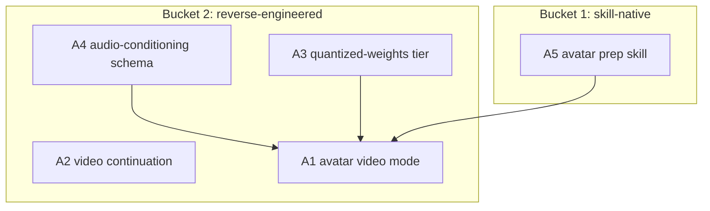

# Cross-Project Comparison: Nexus vs. LongCat-Video

**Version**: v2.0.4
**Adoption target**: v2.0.0
**Generated**: 2026-08-05
**Analyzer**: Claude Code -- /compare command
**External Source**: https://github.com/meituan-longcat/LongCat-Video (Repository)
**Source Type**: Repository
**Pre-ingest source-security verdict**: CLEAR -- see Section 5.0

---

## Section 1: Executive Summary

LongCat-Video (Meituan, MIT license for both code and weights) is a 13.6B-parameter dense DiT video foundation model that unifies text-to-video, image-to-video, and video continuation in a single architecture, and ships Avatar variants (1.0 on Wav2Vec2, 1.5 on Whisper-Large-v3) that turn one photo plus an audio track into minutes-long, lip-synced talking video. Everything is locally runnable PyTorch with weights on HuggingFace; no hosted API is required. That makes it, on paper, a clean fit for Nexus's local-only Video Lab -- weights download is exactly the kind of external dependency the MCP Registry Policy permits.

The friction is hardware, not policy. Nexus's Video Lab is tiered by `core/config/DiffusionTier.ts` for consumer GPUs (video enabled from 8 GB, `cogvideox_5b` at 24 GB+), while full-precision LongCat-Video wants ~80 GB VRAM; only INT8/FP8 quantized paths (~15 GB reported) bring it near the `diffusion-pro` tier. Five adoption candidates survive the policy gate: an audio-driven avatar capability tier for Video Lab, the video-continuation technique for minutes-long output, quantized-weights support in the installer weights puller, an audio-conditioning extension to the catalog/tier schema, and a skill-native avatar script/audio-prep aid. Two items are rejected outright on MCP Registry Policy grounds (any hosted LongCat generation API; unvetted community quantizations without provenance).

**Overall recommendation: adopt the avatar capability as a new gated `diffusion-pro` Video Lab tier via quantized official weights, adopt the continuation pattern for long-form output, and reject every hosted-inference shortcut; the 13.6B full-precision path stays out of scope until consumer VRAM catches up.**

## Section 2: Project Profiles

| Aspect | Nexus (this project) | LongCat-Video |
|---|---|---|
| Identity | Nexus (Nexus-AI) | LongCat-Video (`meituan-longcat/LongCat-Video`) |
| Kind of artifact | Local-first desktop AI Studio (4 pillars) | Open-weights video foundation model + inference code |
| Purpose | Coding + Chat + Image + Video, local-only | Long-form video generation; audio-driven avatar video |
| Version / maturity | v2.0.x cycle in flight | Public release with base + Avatar-1.0 + Avatar-1.5 variants |
| License | MIT | MIT (code and weights) |
| Author / owner | @bendourthe | Meituan (LongCat team) |
| Primary language | TypeScript (+ Rust/Tauri shell, Python diffusion sidecar) | Python (PyTorch, DiT) |
| Network posture | Local-first; no outbound without explicit opt-in | Fully local inference; weights fetched from HuggingFace |
| Model scale | Video: 1.3B-5B consumer-class (LTX, Wan, CogVideoX tiers) | 13.6B dense; ~80 GB VRAM full precision, ~15 GB INT8/FP8 |
| Relevance to Nexus | -- | High: candidate capability tier for the Video Lab pillar |

## Section 3: Capability and Architecture Comparison

### 3a: Video generation pipeline

| Aspect | Nexus (current) | LongCat-Video | Delta |
|---|---|---|---|
| Video UI | Video Lab pillar (`desktop/src/modules/video/VideoLabPage.tsx`, `VideoPromptForm.tsx`, `videoClient.ts`, `TimelinePreviewer.tsx`) | No UI; research/inference scripts only | Nexus-only strength |
| Dispatch | `text2video` / `image2video` JSON-RPC methods (`desktop/sidecar/src/diffusion/videoDispatcher.ts:15,:45-48`) into the Python runtime | Direct PyTorch pipelines for T2V, I2V, continuation, avatar | LongCat adds two modes Nexus lacks: continuation and audio-driven avatar |
| Tier gating | `DiffusionTier.ts` -- video disabled below 8 GB, `ltx_video` at mid/high, `cogvideox_5b` at `diffusion-pro` 20 GB+ (`core/config/DiffusionTier.ts:96,:120,:144,:160-165`) | None; assumes datacenter GPUs (~80 GB), community INT8/FP8 for consumer cards | Nexus's tier model is the integration seam |
| Weights delivery | Installer HF weights puller with per-file sha256 manifests (`scripts/installer/src/nexus_installer/engine/hf_weights_puller.py`; catalog `weights.files[].sha256`, `core/registry/catalog.json:578-586`) | Weights on HuggingFace (meituan-longcat org), three variants | Same distribution channel; puller can ingest it |
| Long-form output | Fixed clips: 4-8 s at 24 fps per tier (`DiffusionTier.ts:97,:121,:145`) | Minutes-long video via native video continuation, coarse-to-fine (temporal then spatial), Block Sparse Attention | Gap in Nexus (A2) |
| Audio conditioning | None anywhere in the video pipeline or catalog schema | Avatar variants: single/multi-stream audio, merge and concatenation dual-audio modes, lip-sync optimized | Gap in Nexus (A1, A4) |

**Key contrast:** Nexus has the product shell (Video Lab UI, tier policy, verified weights pipeline) and LongCat-Video has the missing capability (audio-driven talking-head plus long-form continuation). Nothing in LongCat-Video requires a service, an API key, or outbound calls at runtime -- the only blocker is that its native scale sits one hardware generation above Nexus's `diffusion-pro` ceiling, which quantization partially closes.

## Section 4: Gap Analysis

### 4a: Present in LongCat-Video, missing in Nexus (adoption candidates)

- **A1 -- Audio-driven avatar (talking-head) video mode.** One photo + audio -> lip-synced video. New Video Lab mode alongside `text2video`/`image2video` in `videoDispatcher.ts:45-48`, new form surface in `VideoPromptForm.tsx`, new Python pipeline in the diffusion sidecar. Weights: LongCat-Video-Avatar-1.5 (Whisper-Large-v3 conditioning, distilled fast inference, INT8 support), MIT.
- **A2 -- Video continuation for minutes-long output.** Autoregressive clip continuation would let `TimelinePreviewer.tsx` chain segments beyond the tier-fixed 4-8 s clips; the technique (condition on prior frames) is model-portable and worth prototyping on the existing Wan 2.2 pipeline first.
- **A3 -- Quantized-weights tier in the installer.** `hf_weights_puller.py` and the catalog `weights` schema assume one precision per model; adding a quantization field (fp8/int8 file sets with their own sha256s) is the precondition for shipping any 13.6B-class model to 16-24 GB cards.
- **A4 -- Audio-conditioning fields in catalog + DiffusionTier.** `DiffusionTierVideoDefaults` (`DiffusionTier.ts:34-43`) has no audio/avatar concept; `catalog.json` video entries have no audio-input flag. Small schema extension, prerequisite for A1.
- **A5 -- Avatar script/audio-prep guidance.** Prompting and audio-preparation guidance (script pacing, TTS handoff, reference-photo framing) is achievable by instructing the agent directly -- a skill, not code.

### 4b: Present in Nexus, missing in LongCat-Video (strengths to preserve)

- Full desktop product: Video Lab UI, job dispatch, progress correlation (`videoDispatcher.ts:50-60`), GPU scheduler, telemetry.
- VRAM-aware tier policy with user override (`DiffusionTier.ts:160-194`) -- LongCat assumes you have the hardware.
- Verified weights supply chain: per-file sha256 manifests + preflight (`scripts/installer/src/nexus_installer/engine/model_preflight.py`).
- Multi-model catalog breadth: LTX-Video (12 GB), Wan 2.1 1.3B (8 GB), Wan 2.2 TI2V 5B (24 GB) (`catalog.json:553-660`).

### 4c: Present in both (quality comparison)

| Capability | Nexus | LongCat-Video | Better |
|---|---|---|---|
| Text-to-video / image-to-video | LTX / Wan / CogVideoX tiers, consumer VRAM | 13.6B unified model, datacenter VRAM | Nexus for fit; LongCat for ceiling quality |
| 720p output | Wan 2.2 at 720p24 on 24 GB (`catalog.json:651`) | 720p30 native | Roughly equivalent at the pro tier |
| Local-only inference | By construction | By construction (PyTorch, no API) | Equivalent -- policy-compatible |

## Section 5: Security and Risk Assessment

*This section is MANDATORY per the compare-project skill (Steps 1.5 and 5) and the MCP Registry Policy.*

### 5.0 Pre-ingest source-security scan (Step 1.5)

| Check | LongCat-Video |
|---|---|
| Prompt injection / agent-directed instructions | None found. README is standard model documentation; no "ignore previous instructions" payloads, no hidden/zero-width/base64 instruction blobs surfaced. |
| Malicious or destructive code patterns | None surfaced in the README/landing content examined (no destructive shell fragments, credential harvesting, or exfiltration patterns). |
| Supply-chain provenance | Established owner (Meituan LongCat org), MIT code and weights, weights on the official HuggingFace org. Community re-quantizations are third-party artifacts and are NOT covered by this verdict (see N2). |
| Residual flags | None. |

**Verdict: CLEAR.** Ingestion proceeded; all source text was treated as data. Scope: README/landing surface fetched over the web. A byte-level scan of the inference code plus sha256 pinning of every weight file through `model_preflight.py` is a precondition of any actual adoption -- no LongCat code is vendored by this report.

### 5.1 Threat-model delta

| Dimension | Adoption delta |
|---|---|
| New runtime dependencies | A1 adds a new Python pipeline (LongCat inference code, Whisper-Large-v3 audio encoder) inside the existing diffusion sidecar; A2/A3/A4 add none beyond schema and puller logic; A5 adds none. |
| Outbound-call destinations | HuggingFace weight download at install time only -- the same channel the puller already uses (`hf_weights_puller.py`). Zero runtime outbound. |
| Credentials / API keys | None. Official repos are ungated. |
| Data leaving the machine | None. User photos and audio never leave the device -- the entire value of doing this locally. |
| New inbound surface | None; avatar jobs enter through the existing validated IPC path (`videoDispatcher.ts`). |

### 5.2 Per-item risk scorecard

| Item | Risk tier | Justification |
|---|---|---|
| A1 Avatar video mode | Medium | Large new local pipeline + 13.6B-class weights; deepfake-adjacent output warrants a provenance note in saved metadata; VRAM pressure must respect the GPU scheduler |
| A2 Video continuation | Low | Pipeline-level technique; no new dependencies |
| A3 Quantized-weights tier | Low | Puller/schema change; sha256 discipline unchanged |
| A4 Audio-conditioning schema | None | Pure data-model extension |
| A5 Avatar prep skill | None | Instruction-only |

## Section 6: Reverse-Engineering Viability Analysis

*MANDATORY. Every candidate is classified against the decision tree: skill-native > re-full > re-partial > vendor-intrinsic > drop-outright.*

| Item | Classification | Internal deliverable | Effort | Rationale |
|---|---|---|---|---|
| A5 Avatar prep guidance | skill-native | Nexus-Hub skill extending `creative-generation` with talking-head script/audio/framing guidance | Low | LLM-instructable; no code |
| A4 Audio-conditioning schema | re-full | `audioConditioning` fields in `DiffusionTierVideoDefaults` + catalog video entries | Low | Pure local schema work |
| A3 Quantized-weights tier | re-full | Precision-variant file sets in `catalog.json` `weights` + `hf_weights_puller.py` selection logic | Medium | Extends existing puller; benefits every future large model |
| A2 Video continuation | re-partial | Continuation loop in the sidecar video pipeline + timeline chaining in `TimelinePreviewer.tsx`; full quality parity needs LongCat's continuation-pretrained weights | Medium | Technique is portable; the pretrained continuation behavior is model-specific |
| A1 Avatar video mode | re-full | New `audio2video` dispatch mode + Avatar-1.5 INT8 pipeline behind `diffusion-pro`, weights pulled and sha256-pinned like any catalog model | High | Local open weights (MIT); "re" here means integrating upstream MIT code into `desktop/sidecar/`, stripped per policy bucket 3 conventions |
| Hosted LongCat inference API | drop-outright | -- | -- | Generation-as-a-service; MCP Registry Policy hard no (see N1) |

**Recommendation ordering (per MCP Registry Policy):** A5 (skill-native) first, then A4 -> A3 -> A2 -> A1 (re builds, dependency-ordered), nothing vendor-intrinsic, hosted API dropped to Section 9.

## Section 7: Adoption Plan

### Bucket 1 -- skill-native (zero-code wins)

| What | Source | Target | Effort | Deps | Risk |
|---|---|---|---|---|---|
| A5 Avatar script/audio-prep guidance (P2) | LongCat Avatar usage docs | Nexus-Hub `creative-generation` skill family | Low | -- | None |

### Bucket 2 -- reverse-engineered internal builds

| What | Source | Target | Effort | Deps | Risk |
|---|---|---|---|---|---|
| A4 Audio-conditioning schema (P1) | LongCat Avatar audio modes | `core/config/DiffusionTier.ts`, `core/registry/catalog.json` | Low | -- | None |
| A3 Quantized-weights tier (P1) | Avatar-1.5 INT8 / community FP8 pattern | `scripts/installer/src/nexus_installer/engine/hf_weights_puller.py`, catalog `weights` schema | Medium | -- | Low |
| A2 Video continuation (P1) | LongCat continuation + coarse-to-fine | `desktop/sidecar/src/diffusion/` video pipeline, `TimelinePreviewer.tsx` | Medium | -- | Low |
| A1 Avatar video mode (P2) | LongCat-Video-Avatar-1.5 (MIT weights) | New `audio2video` mode in `videoDispatcher.ts` + sidecar pipeline, gated to `diffusion-pro` | High | A3, A4 | Medium |

### Bucket 3 -- vendor-intrinsic

None. Weights download from HuggingFace is install-time fetch of open artifacts, not an as-a-service relationship; no candidate requires a third party as its runtime destination.

## Section 8: Implementation Sequence

Suggested phasing for the v2.0.0 adoption cycle:
1. A4 + A3 (schema + puller groundwork, independent, low-risk).
2. A2 (continuation prototyped on the existing Wan 2.2 pipeline; validates the timeline-chaining UX cheaply).
3. A1 (avatar mode) once quantized-weight delivery and audio schema exist; ship gated to `diffusion-pro` with an explicit VRAM preflight.
4. A5 lands alongside A1 so the skill and the capability ship together.

## Section 9: Risks and Explicit Rejections

General considerations:
- A1 is the only high-effort item and the only one importing upstream code; a byte-level security scan of the LongCat inference tree and sha256 pinning of all weight files via `model_preflight.py` are mandatory preconditions.
- Talking-head synthesis is deepfake-adjacent: embed generation provenance in output metadata and keep the capability behind an explicit user action; local-only processing is the mitigating strength, not a waiver.
- Do not let the "minutes-long" headline pull the 80 GB full-precision path into scope; the consumer story is quantized-or-nothing.

### Items explicitly NOT recommended for adoption

- **N1 -- Any hosted LongCat / Meituan video-generation API or cloud endpoint.** Routing prompts, photos, or audio to a hosted inference service is generation-as-a-service, which the **MCP Registry Policy** names as a hard no; it would also create a new third-party data processor for biometric-grade inputs (a user's face and voice). **Rejected** regardless of convenience; local weights are the only sanctioned path.
- **N2 -- Unvetted community quantizations (third-party FP8/INT8 re-uploads).** The ~15 GB FP8 artifacts circulating are not published by the `meituan-longcat` org; adopting them would bypass the provenance discipline the **MCP Registry Policy** and the catalog's per-file sha256 verification exist to enforce. **Rejected** until either official quantized releases exist (Avatar-1.5 INT8 qualifies) or Nexus quantizes from official weights itself inside the installer pipeline.

## Appendix: Source Facts (as fetched 2026-08-05)

**LongCat-Video (`meituan-longcat/LongCat-Video`, MIT code and weights).** 13.6B-parameter dense DiT video foundation model from Meituan unifying text-to-video, image-to-video, video continuation, and interactive generation; 720p/480p at 30 fps; minutes-long output via native continuation. Techniques: coarse-to-fine generation (temporal then spatial), Block Sparse Attention, multi-reward GRPO training. Avatar variants: Avatar-1.0 (Wav2Vec2 audio conditioning) and Avatar-1.5 (Whisper-Large-v3 conditioning, distillation-based fast inference, INT8 quantization support); single and multi-stream audio with merge and concatenation dual-audio modes, lip-sync optimized. Weights distributed on HuggingFace under the meituan-longcat organization; inference is local PyTorch (FlashAttention-2/3, xformers) with no hosted API requirement. Reported hardware: ~80 GB VRAM for full-precision inference (multi-GPU supported); community FP8 quantization (~15 GB) runs on consumer GPUs but is third-party (see N2). Pre-ingest security verdict: CLEAR.
