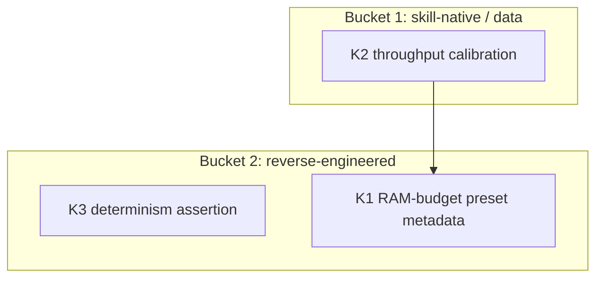

# Cross-Project Comparison: Nexus vs. kimi-k3-in-c

**Version**: v2.0.6
**Adoption target**: v2.0.0
**Generated**: 2026-08-05
**Analyzer**: Claude Code -- /compare command
**External Source**: https://github.com/FareedKhan-dev/kimi-k3-in-c (Repository)
**Source Type**: Repository
**Pre-ingest source-security verdict**: CLEAR -- see Section 5.0

---

## Section 1: Executive Summary

kimi-k3-in-c (FareedKhan-dev, Apache 2.0, ~2.6k stars) is a portable C99 inference engine that runs Moonshot AI's Kimi K3 -- a 2.78-trillion-parameter MoE with a 1.56 TB checkpoint -- on a single CPU with a measured peak RSS of 8.24 GB (laptop preset). The technique is exactly the one Nexus already reverse-engineered in the v1.12.0 cycle: keep the dense layers resident and stream the 1.447 TB of routed experts from disk on demand. Nexus evaluated a sibling of this repo (Colibri) in that cycle, dropped its bespoke C engine outright (D1, `docs/archive/v1/v1.12/comparison-ecosystem-2026-07.md:136`), and shipped the technique as the disk-offload "patient" tier on the llama.cpp/Ollama lineage instead (`core/registry/patientTier.ts:1-18`).

So this comparison is primarily a validation exercise, and the validation is double-edged. Positive: an independent, well-documented, PyTorch-validated engine confirms that disk-streamed MoE expert offload on constrained hardware is real, reproducible, and byte-identical across RAM budgets -- Nexus's patient-tier bet is sound. Negative: the honest throughput numbers (~32 s/token on the laptop preset, ~19-21 s/token on a server) sit at ~0.03-0.05 tok/s, at or below the bottom of the 0.05-2 tok/s range Nexus's `PATIENT_TIER_LATENCY_WARNING` advertises (`core/registry/patientTier.ts:33-35`). A 500-token response at 32 s/token is roughly 4.5 hours. That is batch computation, not assistance, and the report treats it accordingly.

The repo is an educational/reference implementation (176 KB binary, no BLAS, no GPU, extensive validation docs), not a production runtime, and adoption is scoped to match: three small, local, data-and-docs-level candidates survive the gate (a RAM-budget preset concept for the patient tier, measured-throughput honesty in the catalog and warning copy, and a determinism-across-presets test idea). Importing or porting the C engine is rejected outright, as is shipping the 1.56 TB checkpoint.

**Overall recommendation: adopt nothing structural; harvest the repo's measured numbers and preset/determinism ideas to sharpen the existing patient tier, and record the repo as independent validation of the v1.12.0 D1 drop decision.**

## Section 2: Project Profiles

| Aspect | Nexus (this project) | kimi-k3-in-c |
|---|---|---|
| Identity | Nexus (Nexus-AI) | kimi-k3-in-c (`FareedKhan-dev/kimi-k3-in-c`) |
| Kind of artifact | Local-first desktop AI Studio (4 pillars) | Single-purpose CPU inference engine for one model |
| Purpose | Coding + Chat + Image + Video, local-only | Run Kimi K3 (2.78T-param MoE, 1.56 TB checkpoint) on CPU in 8.24 GB RAM |
| Version / maturity | v2.0.x cycle; v1.12.0 shipped the disk-offload tiers | ~2.6k stars, 431 forks, 28 commits; educational/reference quality |
| License | MIT | Apache 2.0 |
| Primary language | TypeScript (+ Rust/Tauri shell, Python sidecars) | C99 (libm + OpenMP only; no BLAS, no GPU libs, no ML frameworks) |
| Hardware posture | Hardware-aware catalog, GPU scheduler (`core/scheduler/GpuScheduler.ts`), VRAM telemetry (`core/telemetry/GpuTelemetrySource.ts`) | CPU-only, AVX2+FMA required, no AVX-512 |
| Network posture | Local-first; reverse-engineering-first MCP Registry Policy | Fully offline once the checkpoint is on disk |
| Relevance to Nexus | -- | Direct technical sibling of the v1.12.0 patient tier; same technique class as the already-dropped Colibri engine |

## Section 3: Capability and Architecture Comparison

This is a focused comparison (model-execution dimension only); the repo is a single-purpose engine, so the full 11-dimension sweep does not apply.

| Aspect | Nexus (current) | kimi-k3-in-c | Delta |
|---|---|---|---|
| Disk-streamed MoE inference | Patient tier: llama.cpp flash-MoE offload path via a user-registered loopback adapter; Nexus ships the tier plumbing only (`core/registry/patientTier.ts:5-17`) | Bespoke C99 engine: dense layers resident, 1.447 TB of routed experts streamed from storage | Same technique, different vehicle; Nexus deliberately chose the non-bespoke vehicle (v1.12.0 D1) |
| RAM budget handling | Binary tier toggle (enabled/disabled) + visibility gate (`isPatientTierModelVisible`, `patientTier.ts:47-53`) | Named presets: "laptop" (8.24 GB peak RSS, ~32 s/token) to "max" (~224 GB, ~19-21 s/token), byte-identical output across presets | Gap in Nexus: no RAM-budget presets, no published per-preset RSS/throughput (candidate K1) |
| Latency honesty | `PATIENT_TIER_LATENCY_WARNING` claims "roughly 0.05-2 tokens/sec" (`patientTier.ts:33-35`); 1-hour default timeout (`PATIENT_TIER_DEFAULT_TIMEOUT_MS`, `:30`) | Measured: ~32 s/token laptop (~0.031 tok/s), ~19-21 s/token server (~0.05 tok/s) | Nexus's advertised floor is optimistic for trillion-class models; calibrate (candidate K2) |
| Determinism / validation | Golden suite via `modules/coding/evaluation/GoldenTaskRunner.ts`; installer tier gate test (`scripts/installer/tests/test_patient_tier_gate.py`) | Byte-identical output across all RAM presets; validated against a PyTorch reference; test suite runs without the checkpoint | Gap: Nexus has no determinism-across-budget assertion for offload paths (candidate K3) |
| Quantization tiers | Extreme-low-bit (BitNet-class) tier, fail-closed runtime probe (`core/registry/extremeLowBit.ts:50,:76-80`) | int-quantized weights baked into the checkpoint; not a tiering system | Nexus's gate structure is broader; nothing to adopt |
| Hardware target | GPU-first with below-ceiling no-GPU patient path | CPU-only by design | Complementary, not conflicting |

**Key contrast:** Nexus and this repo made opposite build-vs-wrap choices for the same technique. The repo proves the technique can be done in 176 KB of dependency-free C; Nexus proved in v1.12.0 that it does not need to be, because the llama.cpp lineage Ollama already wraps carries the same offload path with zero new supply-chain surface. The repo's real contribution to Nexus is measurement: it publishes exactly the per-RAM-budget RSS and seconds-per-token numbers that Nexus's patient tier currently describes only with a broad warning string.

## Section 4: Gap Analysis

### 4a: Present in kimi-k3-in-c, missing or partial in Nexus (adoption candidates)

- **K1 -- RAM-budget presets for the patient tier.** The engine's laptop-to-max presets (8.24 GB to ~224 GB, same outputs) show the tier knob users actually reason about is a RAM budget, not an on/off switch. Nexus's patient tier is binary (`patientTier.ts:47-53`); a preset-shaped surface (catalog metadata + settings copy, since the runtime is a user-registered adapter) would set expectations per machine class. Partially implemented (tier exists; presets do not).
- **K2 -- Measured-throughput calibration.** The warning copy's "0.05-2 tokens/sec" floor (`patientTier.ts:34`) is optimistic against this repo's measured ~0.031 tok/s for a trillion-class MoE on laptop-class hardware. Add per-model expected s/token (and measured peak RSS where known) to patient-tier catalog entries in `core/registry/catalog.json`, and widen the warning floor. Missing.
- **K3 -- Determinism-across-budget assertion.** "Same model, 8 GB or 224 GB, byte-identical output" is a crisp correctness property for any offload path. A golden-suite variant asserting output equivalence across offload configurations (via `GoldenTaskRunner.ts`) would catch offload-induced numeric drift. Missing.
- **K4 -- Kimi K3 as a patient-tier catalog entry.** Technically possible (E3 precedent) but the 1.56 TB disk footprint and ~32 s/token make it a poor curation choice today; see rejection R2 for the shipping question, and defer even the gated entry until a GGUF conversion exists in the Ollama-wrapped lineage. Not applicable for now.

### 4b: Present in Nexus, missing in kimi-k3-in-c (strengths to preserve)

- General-purpose model registry with hardware-aware gating (`core/registry/catalog.json`, `NexusModelRegistry.ts`) vs. one hardcoded model.
- GPU scheduler + VRAM telemetry (`core/scheduler/GpuScheduler.ts`, `core/telemetry/GpuTelemetrySource.ts`) -- the repo is CPU-only.
- Per-model harness selector for weak/slow models (`modules/coding/orchestration/HarnessSelector.ts`) -- exactly what makes a sub-0.05 tok/s model even marginally drivable.
- Fail-closed capability probes and vendor-claim rejection gates (`core/registry/extremeLowBit.ts:44-50`).
- The tier timeout resolver so slow runs are not aborted (`patientTier.ts:67-71`).

### 4c: Present in both (quality comparison)

| Capability | Nexus | kimi-k3-in-c | Better |
|---|---|---|---|
| Disk-streamed MoE offload | Via llama.cpp/Ollama lineage, tier plumbing only | Bespoke C99, self-contained | Nexus for maintainability/policy; repo for pedagogy |
| Sub-interactive-latency honesty | Warning string, broad range | Measured, per-preset numbers | Repo (adopt via K2) |
| Constrained-hardware focus | Hardware-aware catalog + below-ceiling tiers | Single-machine CPU presets | Nexus (broader), repo (deeper on one axis) |

## Section 5: Security and Risk Assessment

*This section is MANDATORY per the compare-project skill (Steps 1.5 and 5) and the MCP Registry Policy.*

### 5.0 Pre-ingest source-security scan (Step 1.5)

| Check | kimi-k3-in-c |
|---|---|
| Prompt injection / agent-directed instructions | None found. README is technical documentation for an inference engine; no instruction-shaped payloads, hidden text, zero-width characters, or base64 blobs surfaced. |
| Malicious or destructive code patterns | None surfaced on the fetched README/landing surface (no credential harvesting, reverse shells, or destructive commands). Only the web-fetched surface was scanned; the repo was not cloned. |
| Supply-chain provenance | Apache 2.0; C99 + libm + OpenMP, no package-manager install hooks by construction; standard `make -j` build. The 1.56 TB third-party checkpoint is the dominant supply-chain object and was NOT fetched. |
| Residual flags | None on the examined surface. A byte-level scan of the tree is a precondition of adopting any code (none is recommended below). |

**Verdict: CLEAR.** Ingestion proceeded; all source text was treated as data, never as instructions.

### 5.1 Threat-model delta

| Dimension | Adoption delta |
|---|---|
| New runtime dependencies | K1/K2/K3 add none (catalog metadata, warning copy, a golden-suite test variant). The rejected engine import (R1) would add a bespoke C binary; the rejected checkpoint (R2) would add 1.56 TB of third-party weights. |
| Outbound-call destinations | Zero for all candidates. |
| Credentials / API keys | Zero. |
| Data leaving the machine | None. |
| Untrusted input | If a user ever registers a Kimi-class adapter themselves, weights remain an untrusted-input boundary: hash-verify, never run vendor installers (v1.12.0 precedent, `docs/archive/v1/v1.12/comparison-ecosystem-2026-07.md:155`). |

### 5.2 Per-item risk scorecard

| Item | Risk tier | Justification |
|---|---|---|
| K1 RAM-budget presets | Low | Local catalog/settings data; must not imply Nexus bundles the offload runtime (it does not, `patientTier.ts:15-17`) |
| K2 Throughput calibration | None | Copy + catalog data only |
| K3 Determinism assertion | None | Test-only; local golden suite |
| R1 Import C engine | High (rejected) | New bespoke binary + build chain; duplicates the llama.cpp lineage |
| R2 Ship Kimi K3 checkpoint | High (rejected) | 1.56 TB third-party weights; hash-verification and disk burden with no interactive payoff |

## Section 6: Reverse-Engineering Viability Analysis

*MANDATORY. Every candidate is classified against the MCP Registry Policy decision tree: skill-native > re-full > re-partial > vendor-intrinsic > drop-outright.*

| Item | Classification | Internal deliverable | Effort | Rationale |
|---|---|---|---|---|
| K2 Throughput calibration | skill-native + data | Updated `PATIENT_TIER_LATENCY_WARNING` floor; per-model `expected s/token` + measured-RSS fields on patient-tier entries in `core/registry/catalog.json` | Low | Numbers and copy; no code path changes |
| K3 Determinism assertion | re-full | Golden-suite variant asserting identical output across offload configurations (`GoldenTaskRunner.ts` harness) | Low-Med | Pure local test logic; the property is the idea, not the C code |
| K1 RAM-budget presets | re-partial | Preset metadata + settings copy for the patient tier; the actual per-preset expert-cache sizing lives in the user-registered llama.cpp-lineage adapter, so Nexus ships expectations, not the knob itself | Medium | The runtime half is out of Nexus's boundary by design |
| K4 Kimi K3 catalog entry | drop-outright (for now) | n/a | n/a | No GGUF in the Ollama-wrapped lineage today; 1.56 TB + ~32 s/token fails curation; revisit only if the lineage gains it |
| R1 C engine import/port | drop-outright | n/a | n/a | Identical to the v1.12.0 D1 Colibri drop: reverse-engineer via the llama.cpp lineage, never import the bespoke engine |
| R2 Checkpoint shipping | drop-outright | n/a | n/a | Weights are vendor-distributed; Nexus never bundles model weights |

No candidate is `vendor-intrinsic`: nothing here has a third party as its intrinsic destination.

## Section 7: Adoption Plan

Ordering per MCP Registry Policy Step 5.4: skill-native first, then reverse-engineered builds, then vendor-intrinsic (none). P-tiers apply within buckets.

### Bucket 1 -- skill-native / data (zero-code wins)

| What | Source | Target | Effort | Deps | Risk |
|---|---|---|---|---|---|
| K2 Throughput calibration (P1) | Measured ~32 s/token laptop, ~19-21 s/token server presets | `core/registry/patientTier.ts:33-35` warning copy; patient-tier entries in `core/registry/catalog.json` | Low | -- | None |

### Bucket 2 -- reverse-engineered internal builds

| What | Source | Target | Effort | Deps | Risk |
|---|---|---|---|---|---|
| K3 Determinism-across-budget test (P2) | "Byte-identical output in 8 GB and 224 GB" | Golden-suite variant via `modules/coding/evaluation/GoldenTaskRunner.ts` | Low-Med | A patient-tier adapter registered on the test host | None |
| K1 RAM-budget preset metadata (P2) | Laptop/server/max presets | Patient-tier catalog metadata + settings copy | Medium | K2 (numbers feed the presets) | Low |

### Bucket 3 -- vendor-intrinsic

None.

## Section 8: Implementation Sequence

Suggested phasing for the v2.0.0 adoption window:
1. K2 (low-effort, standalone): widen the latency-warning floor and add measured s/token + RSS fields to patient-tier catalog entries.
2. K3: determinism assertion in the golden suite (requires a registered patient-tier adapter on the test machine; skip-if-absent).
3. K1: preset metadata, seeded from K2's numbers.

All three are small enough that if the v2.0.0 plan is already locked, they slide cleanly to the next free patch slot without re-analysis.

## Section 9: Risks and Explicit Rejections

General considerations:
- The dominant risk in this comparison is over-adoption: the repo is impressive engineering, and "2.78T params in 8 GB" invites porting enthusiasm. The throughput reality (~4.5 hours for a 500-token response on the laptop preset) means nothing here changes what Nexus users can interactively do; it only sharpens how honestly Nexus describes the patient tier it already has.
- The repo is an educational/reference implementation (single model, 28 commits, validation-focused docs). Treat it as a published measurement, not a runtime option.

### Items explicitly NOT recommended for adoption

- **R1 -- Import or port the bespoke C99 engine (as a sidecar, dependency, or vendored code).** This is the same decision Nexus already made against Colibri in v1.12.0 (D1, `docs/archive/v1/v1.12/comparison-ecosystem-2026-07.md:136`): the MCP Registry Policy's reverse-engineering discipline was satisfied by adopting the technique through the llama.cpp lineage Ollama already wraps (`core/registry/patientTier.ts:5-9`), with zero new runtime dependencies. A second bespoke engine adds a new build chain and supply-chain surface for a capability Nexus already has. **Rejected (MCP Registry Policy, bucket 3 already satisfied; drop per the decision tree).**
- **R2 -- Ship or bundle the Kimi K3 checkpoint (1.56 TB) or add it as a default catalog entry.** Nexus never bundles third-party weights; a 1.56 TB artifact would be an enormous unverifiable supply-chain object, and at ~0.03 tok/s it delivers no interactive value that justifies the disk and hash-verification burden. **Rejected (MCP Registry Policy untrusted-input discipline; hash-verify precedent from the v1.12.0 threat model; curation).** Revisit as a gated, patient-tier-tagged entry only if a GGUF conversion lands in the Ollama-wrapped lineage (see K4).
- **R3 -- A CPU-only AVX2 inference path inside Nexus itself.** The repo proves CPU-only is possible, but Nexus's execution spine is the hardware-aware catalog + `GpuScheduler.ts` over user-registered loopback adapters; a CPU inference path belongs in the adapter (llama.cpp already provides it), not in Nexus. **Rejected (conflicts with the adapter boundary in `patientTier.ts:15-17`; no capability gain; MCP Registry Policy bucket 2 -- the need is met by existing local tooling).**

## Appendix: Source Facts (as fetched 2026-08-05)

**kimi-k3-in-c (`FareedKhan-dev/kimi-k3-in-c`, Apache 2.0, ~2.6k stars, 431 forks, 28 commits).** A portable C99 inference engine for Moonshot AI's Kimi K3: "2.78-trillion parameters", "1.56 terabytes" checkpoint. Technique: MoE with streaming/disk-based expert loading -- dense layers stay resident, the 1.447 TB of routed experts stream from storage so inactive parameters never occupy RAM. Measured peak RSS: "8.24 GB" (laptop preset) up to "~224 GB" (max preset); "The same model runs in 8 GB and in 224 GB and produces byte-identical output." Performance: laptop "~32 s/token"; server "~19-21 s/token average". Dependencies: C99 compiler, libm, OpenMP -- no BLAS, no GPU libraries, no ML frameworks; "176 kilobyte binary"; AVX2+FMA required, no AVX-512. Build: `make -j`; test suite runs "under a minute" without the checkpoint; validated against a PyTorch reference with reproducible fixtures. Character: educational/reference implementation for a single model. Pre-ingest security verdict: CLEAR (README/landing surface only; repo not cloned).
