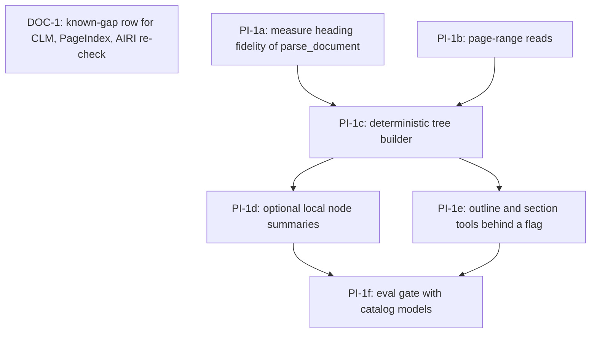

# Cross-Project Comparison: PageIndex, AIRI (update), and CLM

**Authored during**: package metadata 2.10.0, tag v2.10.0 published, develop clean
**Adoption target**: v2.11.0
**Generated**: 2026-09-30
**Analyzer**: Claude Code, /compare (three sources)
**Source types**: three GitHub repositories (one of them a re-check of an earlier comparison)
**External sources**:
- [VectifyAI/PageIndex](https://github.com/VectifyAI/PageIndex), MIT (LICENSE file read), vectorless tree-search RAG
- [moeru-ai/airi](https://github.com/moeru-ai/airi), MIT, re-checked against [v2.0.3-comparison-airi.md](../../../archive/v2/v2.0/comparisons/v2.0.3-comparison-airi.md)
- [Contrastive-LM/CLM](https://github.com/Contrastive-LM/CLM), Apache-2.0 code and CLM-8B weights per the README
**Pre-ingest source-security verdict**: AIRI CLEAR. PageIndex and CLM PROCEED-WITH-CAUTION. No source was BLOCKED. See Section 6.1.
**Slotting reason**: the highest plan on disk is `docs/archive/v2/v2.10/plans/v2.10.0-adoption-system-one-models.md`, and `docs/v2/v2.11/` holds only `known-gaps.md`. v2.11.0 is the first free slot. `scripts/enumerate_plan_queue.py` does not exist in this repo, so the queue was enumerated by listing `docs/v2`, `docs/archive/v2`, and searching for v3 paths (none). Re-slot if a different target is preferred.
**Layout note**: canonical `docs/releases/` is not present in this repo. This file follows the legacy `docs/v2/v2.11/comparisons/` path, as the v2.10 report did.

## Section 1: Executive answer

**Adopt one build (a local document outline tree, inspired by PageIndex), one documentation row, and nothing from AIRI or CLM.**

| Source | What it is | Verdict |
| --- | --- | --- |
| PageIndex | Builds a table-of-contents tree per document, then has an LLM walk the tree and read the right section. Local mode is MIT and text-PDF only. OCR, image understanding, the MCP server, and the corpus-wide FileSystem layer are cloud-only. Default models are hosted (gpt-5.6-luna, gpt-5.6-sol) and local mode asks for an OpenAI key | Drop the package and the cloud. Reverse-engineer the idea (PI-1), because Nexus has a measurable long-document defect that it addresses |
| AIRI 0.12.0-beta.5 | Same companion product as in v2.0.3. Since v0.10.2: more speech engines, more avatar formats, character-card zip packages, a Minecraft bot relay, Electron 42 | No new adoption. The deltas are either already covered by shipped Nexus work or sit outside the product |
| CLM-8B | An open, Apache-2.0 relative of Jev. Two frozen Qwen3-8B encoders (state, action) with 20M-parameter heads. It ranks a closed set of candidate actions and does not generate text. Needs vLLM plus a second service, Linux and CUDA assumed | Do not admit. It removes two of the v2.10 refusal grounds (hosted, license) and leaves the rest. Record it in the known-gaps row |

The concrete Nexus defect behind PI-1: `parse_document` returns at most a capped number of pages per call (`src/tools/handlers/parseDocument.ts`), and its optional memory ingest (default off) stores only the first 8,000 characters followed by `[truncated]` (`src/tools/handlers/documentMemoryIngestor.ts`, `DEFAULT_MEMORY_INGEST_MAX_CHARS`). A 200-page report therefore has no way to be navigated by section. The hybrid BM25, dense, and graph retriever (`core/memory/HybridRetriever.ts`) retrieves memory rows, and nothing gives it the document's structure.

## Section 2: How Nexus is shaped for this batch

| Dimension | Current state | Evidence |
| --- | --- | --- |
| Document parsing | `parse_document` tool, OCR runtime (RapidOCR via a Python sidecar), result is `markdown` (nullable) plus `text` and `pageCount`. Flag-gated, lazy runtime | `src/tools/parseDocumentWiring.ts`, `src/tools/handlers/parseDocument.ts` |
| Document memory | Optional ingest, first 8,000 characters, `[truncated]` marker, injection scanner can reject the row | `src/tools/handlers/documentMemoryIngestor.ts` |
| Retrieval | BM25 + dense + graph, fused by RRF, over memory entries. AST-aware chunker for code | `core/memory/HybridRetriever.ts`, `core/memory/chunkers/AstChunker.ts` |
| Code navigation | `codegraph_*` tools preferred over grep for symbols | AGENTS.md, Code-graph MCP section |
| Document navigation | None. No outline, no section reader | Search of `core/`, `src/tools/`, `modules/` on 2026-09-30 |
| Voice | Shipped: faster-whisper STT, Kokoro-class TTS, push-to-talk and VAD | `desktop/src/modules/chat/voiceLoop.ts`, `core/audio/AudioRuntimeClient.ts` |
| Loop guards | Shipped | `modules/coding/guardrails/LoopGuards.ts` |
| Personas | Markdown import and export in settings | `desktop/src/pages/settings/PersonasSettings.tsx` |
| Avatar presence | No VRM code found under `desktop/src` or `core` | Search on 2026-09-30 |
| Tool selection | Keyword router unwired (DF-11); activation by rules | `src/tools/ToolActivationRules.ts`, `docs/archive/v2/v2.0/known-gaps.md` |
| Inference | Ollama on loopback, one GPU behind one scheduler | `core/scheduler/GpuScheduler.ts`, v2.10 report Section 2 |

## Section 3: Per-source inventory

Claims are from fetched text. They are not Nexus measurements. No package was installed, no weight was downloaded, and no benchmark was reproduced. Page text was returned through a summarizing fetch, not read byte for byte.

### 3.1 PageIndex

- **Method.** Layout is extracted without an LLM. A model then summarizes and refines the structure into a hierarchical tree. Retrieval is an LLM reasoning over that tree and reading the chosen section, with page-level citations.
- **Claim.** 98.7% on FinanceBench against about 50% for vector RAG. The README itself says all 62 questions have the answer as a fact in running text, so a miss is a retrieval or reading failure. That limits what the number says about other question types.
- **Open source versus cloud.** Open: local PDF indexing (about $0.001 per page with the hosted model), tree retrieval, page citations, a markdown indexer (`page_index_md.py` exists in the package listing). Cloud-only: OCR, image understanding, folders, metadata, the MCP server, the FileSystem layer.
- **Models.** The quickstart uses OpenAI model names. Whether a loopback `base_url` or a local model is supported was not shown in the fetched text. Not proven here.
- **Recent.** August 2026: local SDK mode, and PageIndex Flash as the default local indexing path for text PDFs.
- **Not read.** The Python source, the exact tree schema, and the tree-search prompt. The README extract did not give them.

### 3.2 AIRI, delta since the v2.0.3 comparison (v0.10.2 to v0.12.0-beta.5)

| Release (as fetched) | Change | Nexus status |
| --- | --- | --- |
| v0.10.2 | MCP tool configuration improvements, new speech and ARK-compatible cloud providers | Cloud providers refused in v2.0.3 and still refused |
| v0.11.0 | Spine 2D, Gemini TTS, Aliyun ASR, experimental Godot stage with VRM | Cloud speech refused. Avatar formats: Nexus has no avatar layer |
| v0.11.3 | Desktop voice input with mic buffering, character card import and export as zip with model resources | Voice shipped. Persona import and export exists as Markdown only. A zip with model resources only matters once an avatar layer exists |
| v0.12.0-beta.1 | MMD and Tachie formats, hearing playground, Minecraft bot relay, Steam and Apple sign-in | Out of product scope. Sign-in adds cloud identity |
| v0.12.0-beta.3 | Apple Speech on macOS 26+, mobile compact bubble | OS-native STT would add a platform-specific path beside faster-whisper. Skip |
| v0.12.0-beta.5 | Live2D motion driver, VOICEVOX and AivisSpeech local TTS engines, desktop startup fixes | Both engines target Japanese. Kokoro is the shipped local TTS. Skip |
| Notes | Retryable tool calls, DOM-aware browser actions, transcript-based state tracking, Electron 42, Wayland | Tool self-recovery shipped in v1.19.1. Browser tools exist (`src/tools/handlers/browser.ts`). Electron does not apply (Tauri shell) |

The fetched notes list v0.10.2 as 7 May 2026, while the v2.0.3 report (dated 5 August 2026) called it the current release. The release dates were not cross-checked against git tags.

### 3.3 CLM

- **Architecture.** A state encoder and an action encoder, each a frozen Qwen3-8B backbone plus a 20M-parameter trainable head. Training: about 60M Nemotron Q&A pairs, about 30M synthetic hard negatives, about 1M agent trajectories.
- **Function.** Ranks a closed candidate set (`POST /v1/rank`) or answers typed questions (`POST /v1/systemone`, the same shape as Jev). It does not generate text.
- **Serving.** vLLM serving Qwen3-8B on port 8090, plus `clm-serve` on port 8700 (`pip install contrastive-lm`). Reference hardware is one RTX 4090. Default state limit 2,048 tokens. The README names no Windows path.
- **Caching.** Action embeddings are cached on the GPU and reused while the state changes. The README reports about 2.8x faster on a revisited state and 1.7 ms to 0.6 ms for three actions.
- **Claims.** Up to 9x lower latency than Jev, comparable accuracy on computer-use, gaming, and tool-calling (BFCL v4). With fine-tuning: DeepSWE 81.6% (38 held-out tasks) and Terminal-Bench 2.1 87.6% (30 held-out tasks), described as verifier performance. The scaffold around those runs was not read.
- **Not read.** The Notion blog, the Hugging Face cards, the scaling-law thread, the Discord link, and the package source.

## Section 4: Gap analysis

| ID | Capability | Status in Nexus | Notes |
| --- | --- | --- | --- |
| P1 | Per-document outline tree with section-level reads | **Missing** | Defect is measurable in code (Section 1). Candidate PI-1 |
| P2 | LLM navigates the tree instead of similarity search | **Missing** | Tied to P1. Needs a tool-calling local model, accuracy unmeasured here |
| P3 | Page-level citations from the tree | **Partial** | `parse_document` knows `pageCount`. Page-to-section mapping not found |
| P4 | Cloud OCR, image understanding, MCP server, FileSystem layer | **Missing, on purpose** | Hosted. Dropped |
| P5 | Corpus-wide file-level tree | **Missing** | Covered in Nexus by memory plus codegraph for code. The PageIndex version is cloud-only |
| A1 | New speech engines (VOICEVOX, AivisSpeech, Apple Speech, Gemini, Aliyun) | **Not applicable** | Japanese-only, OS-specific, or cloud |
| A2 | Avatar formats (Live2D MAGIC, Spine, MMD, Tachie) | **Missing, unchanged** | Same position as v2.0.3 A5. Live2D Cubism Core is proprietary |
| A3 | Character card zip with model resources | **Partial** | Markdown personas exist. Resources only matter with an avatar |
| A4 | Retryable tool calls, DOM-aware browser actions | **Present** | v1.19.1 recovery and the browser handler |
| C1 | Contrastive state-to-action ranker as a System One model | **Missing, on purpose** | v2.10 position stands, with updated grounds in Section 6.3 |
| C2 | Cached action embeddings with a changing state | **Missing** | Idea transfers without the model (CL-1, backlog) |
| C3 | Learned verifier for long-horizon coding agents | **Missing, on purpose** | `AgentLoop` has a verification gate. A learned verifier needs trajectories Nexus does not collect |

## Section 5: Value, effort, and the acceptance bar

| ID | Value | Effort | Matrix | Why |
| --- | --- | --- | --- | --- |
| DOC-1 | Medium | Low | P1 | One known-gap row so the next "CLM is Apache and local" request has an answer on file |
| PI-1 | High | Medium | P1 | Fixes a concrete, code-verified limit on long documents. New files only, behind a flag, no new runtime |
| CL-1 | Low | Medium | P3 | Needs DF-11 wired first, and a generic embedder lacks the contrastive training that makes CLM useful |
| P4, P5, A1 to A3, C1, C3 | Low or negative here | High | Skip | Hosted, off-scope, or a new runtime |

Against `docs/reference/model-acceptance.md`: CLM-8B has no job on the map. "Typed decisions" is not a job the map names, and the v2.10 report refused to add one. The 8B frozen backbone is a second resident 8B-class model on a single GPU shared by chat, image, and video through `core/scheduler/GpuScheduler.ts`. No measured local number exists, and vendor scores do not count as that measurement. PI-1 adds no model.

## Section 6: Security and reverse-engineering assessment

Mandatory per the compare-project skill (Steps 1.5 and 5) and the MCP Registry Policy: local-only, then skill-native, then a reverse-engineered internal build, then a trusted-vendor wrapper, then drop.

### 6.1 Pre-ingest source-security scan

| Source | Verdict | Findings and handling |
| --- | --- | --- |
| AIRI (README, release notes) | **CLEAR** | No agent-directed instructions, hidden text, or destructive examples surfaced. Standard package-manager install channels. Scan covered the fetched README and release notes only, as in v2.0.3. The summarizer flagged "agent instructions" once, and that text was the fetch prompt itself, not page content |
| PageIndex (README, LICENSE, package file listing) | **PROCEED-WITH-CAUTION** | No injection payload surfaced. The LICENSE file is MIT. Local mode asks for a hosted-model key. The `pageindex` package and `cloud_api.py` were not scanned, and `mcp_bridge.py` is a third-party MCP path. All instruction-like text was treated as data |
| CLM (README) | **PROCEED-WITH-CAUTION** | No injection payload surfaced. `pip install contrastive-lm` and the serve scripts were not inspected. Two network services are opened (ports 8090 and 8700). The Notion, Hugging Face, and Discord links were not visited |
| The pasted posts (Sources 1 and 3) | Treated as data | Marketing summaries of the two repositories. Their numbers are quoted only as claims |

No BLOCK. A byte-level scan of any package is a precondition to vendoring code, and none is recommended here.

### 6.2 Threat-model delta

| Axis | Nexus today | If a dropped source were forced in |
| --- | --- | --- |
| New runtime dependencies | Ollama plus diffusion, audio, OCR runtimes | PageIndex: Python package with hosted-model client. CLM: vLLM, torch, FastAPI, a second 8B model |
| Outbound destinations | Loopback inference, pinned installer pulls | PageIndex: OpenAI by default, PageIndex Cloud for OCR and MCP. CLM: Hugging Face weight download |
| Credentials | None for local generation | PageIndex: OpenAI or PageIndex API key |
| Data leaving the machine | Documents stay on device | PageIndex defaults send document text to a hosted model. Cloud mode uploads documents |
| New commercial relationship | None | PageIndex Cloud |
| PI-1 as designed | | None of the above. Local model, local files, one new flag |

### 6.3 Per-item risk and reverse-engineering classification

| ID | Candidate | Risk | RE class | Disposition |
| --- | --- | --- | --- | --- |
| DOC-1 | Known-gap row for CLM, PageIndex package, and the AIRI re-check | **None** | `skill-native` | **Adopt.** Documentation only |
| PI-1 | Local `DocumentOutline` (heading tree from parsed markdown, optional local-model node summaries, outline and section-read tools) | **Low** | `re-full` | **Adopt.** The technique is a tree plus an LLM walk, which is local by construction. Risk: OCR text is untrusted input and must pass the injection scanner |
| P-pkg | Install the `pageindex` package or its local SDK mode | **High** | `drop-outright` | **Drop.** Hosted model key by default, loopback support unverified. MCP Registry Policy: generation as a service is a hard no |
| P4 | PageIndex Cloud API, cloud OCR, cloud MCP, FileSystem layer | **High** | `vendor-intrinsic` | **Drop.** Documents would leave the machine. Reverse-engineering viability does not rescue it, since PI-1 already covers the local slice |
| C1 | Catalog or serve CLM-8B | **High** | `drop-outright` | **Drop.** Hosted ground and license ground from v2.10 are gone. The runtime ground (new vLLM and torch stack beside Ollama), the GPU ground (a second resident 8B model), the job-map ground, and the Windows ground remain |
| C3 | Use CLM as a learned verifier in `AgentLoop` | **Medium** | `drop-outright` | **Drop.** Results depend on fine-tuning with agent trajectories Nexus does not collect. The existing verification gate stays |
| CL-1 | Cached action-embedding shortlist for tool and skill activation, using the existing `LocalEmbedder` | **None** | `re-partial` | **Backlog.** Local and cheap, but DF-11 (the unwired router) comes first |
| A-all | Speech engines, avatar formats, sign-in, Minecraft relay | **Medium** | `drop-outright` | **Drop** for the reasons in Section 3.2 |

### 6.4 Recommendation ordering

1. DOC-1 (`skill-native`).
2. PI-1 (`re-full`), then CL-1 (`re-partial`, backlog).
3. No `vendor-intrinsic` item is worth a wrapper.
4. P-pkg, P4, C1, C3, and A-all move to Section 9.

## Section 7: Adoption plan

### Bucket 1: skill-native

| What | Source | Target | Effort | Deps | Risk |
| --- | --- | --- | --- | --- | --- |
| DOC-1 (P1). Extend or follow DF-v210-1 with: CLM-8B (Apache-2.0, local, ranks candidates, vLLM plus `clm-serve`, no Windows path in the README) is not admitted, no catalog row, and does not close DF-11. PageIndex package and cloud are not adopted (PI-1 is the local equivalent). AIRI reviewed through 0.12.0-beta.5 with no new adoption | This report | `docs/v2/v2.11/known-gaps.md` | Low | None | None |

### Bucket 2: reverse-engineered internal builds

| What | Source | Target | Effort | Deps | Risk |
| --- | --- | --- | --- | --- | --- |
| PI-1 (P1). Local document outline and section reader. Sub-tasks, in order: (a) measure heading fidelity of `parse_document` output on real text PDFs, markdown, and OCR scans, because `markdown` is nullable and OCR may not recover headings; (b) check whether `parse_document` can read a page range, and add it if not; (c) deterministic tree builder from headings and page markers, no model involved; (d) optional node summaries from the active local chat model, off by default, cached by content hash; (e) tools `document_outline` and `document_read_section`, registered behind a flag like `parseDocument.enabled`, with text routed through `PromptInjectionScanner`; (f) an eval gate comparing outline navigation against the current capped parse and against hybrid retrieval on a small local document set, using models from the catalog | PageIndex README (method only) | New `core/documents/DocumentOutline.ts`, new `src/tools/handlers/documentOutline.ts`, edits to `src/tools/ToolCatalog.ts`, `ToolRegistryBuilder.ts`, `ToolActivationRules.ts`, `docs/reference/model-acceptance.md` only if a model job changes (it should not) | Medium | None external | Low |

### Bucket 3: vendor-intrinsic

None.

### Backlog

CL-1 (P3) waits for DF-11. Not part of the v2.11.0 plan.

## Section 8: Implementation sequence

DOC-1 has no dependency and can land first. The flag stays off until PI-1f reports local numbers.

## Section 9: Not recommended

| Item | Policy ground |
| --- | --- |
| `pip install pageindex` and its local SDK mode | MCP Registry Policy: generation as a service. Default models are hosted and a key is requested. Local-model support is not proven here |
| PageIndex Cloud (OCR, image understanding, MCP server, FileSystem layer) | MCP Registry Policy: hosted processing of user documents, new credential, new commercial relationship |
| CLM-8B, `clm-serve`, or a vLLM side path | New runtime beside Ollama, a second resident 8B model on one GPU, no job on the model-acceptance map, no Windows path shown |
| CLM as an `AgentLoop` verifier or a permission scorer | Same as v2.10 J2 and J6: `ConfirmationGate` stays a person and the injection scanner stays deterministic |
| AIRI speech engines (VOICEVOX, AivisSpeech, Apple Speech, Gemini TTS, Aliyun ASR) | Japanese-only, OS-specific, or cloud. Kokoro and faster-whisper already hold the local jobs |
| AIRI avatar formats (Live2D, Spine, MMD, Tachie) and card zips with model resources | Same position as v2.0.3 A5. Live2D needs the proprietary Cubism Core |
| AIRI Steam and Apple sign-in, Minecraft bot relay | Cloud identity and a product surface Nexus does not have |

## Section 10: Conflicts with current conventions

- Module authorship: handlers are the only side-effecting modules, and only `src/storage/` opens SQLite. The outline cache must be plain JSON under `~/.nexus/` or go through a storage owner, never SQLite from the handler.
- OCR output is untrusted text. The memory store already rejects rows that trip the injection scanner (`documentMemoryIngestor.ts`). Outline nodes need the same screening before they reach a prompt.
- The tree complements the hybrid retriever. It does not replace memory retrieval across sessions.
- Evidence tiers: PageIndex's 98.7% is a vendor result on a factual-lookup set. Per `docs/versions/v1/v1.4.0/development/evidence-and-support-tiers.md`, PI-1 is a candidate until PI-1f produces local numbers.
- `docs/reference/model-acceptance.md` is not edited by this plan. No model is added.

## Section 11: Trapdoors for the next cycle

1. "No vector database, no embeddings" is true of retrieval and false of the stack. Local mode still needs a hosted-model key, and the tree is built by an LLM.
2. "Fully open source" excludes OCR, image understanding, the MCP server, and the FileSystem layer.
3. The 98.7% result covers 62 factual-lookup questions. It does not predict summarization, cross-document, or table questions.
4. An earlier fetch of the PageIndex page reported no license text. The LICENSE file is MIT (Copyright 2025 Vectify AI).
5. Tree search is several model calls per question. On a 9B-class local model the latency and the failure rate are unmeasured.
6. CLM's "9x faster than Jev" compares a local 4090 service to a hosted API. It says nothing about running beside Ollama on a shared GPU.
7. CLM's DeepSWE and Terminal-Bench numbers are 38 and 30 held-out tasks, with fine-tuned heads, as a verifier. They are not an agent resolve rate.
8. CLM removes the hosted and license objections only. Do not reuse the v2.10 sentence unchanged.
9. AIRI release dates in the fetched notes conflict with the v2.0.3 report's "current release" statement. Re-check against git tags before quoting a date.
10. The OCR path may return `markdown: null`. A heading tree from OCR text is not guaranteed.

## Section 12: Verification checklist

- [x] Step 1.5 ran before the sources were used as adoption evidence. No BLOCK. Caution items are in Section 6.1
- [x] Source types identified: three repositories, one a re-comparison
- [x] Gaps cite Nexus files or fetched source sections (Sections 2 to 4)
- [x] Adoption items have concrete target locations (Section 7)
- [x] Priorities follow the value/effort matrix (Section 5)
- [x] Conflicts with module authorship, injection screening, and the acceptance bar are in Section 10
- [x] Items not recommended cite the MCP Registry Policy where a hosted call, key, or new runtime is involved
- [x] Step 5 threat model, risk scorecard, and RE class are in Section 6, ordered per 6.4
- [x] Queued-plan impact recorded below
- [x] Header carries `Adoption target: v2.11.0`
- [x] Prior coverage checked: AIRI (v2.0.3), System One family (v2.10). No earlier mention of PageIndex or CLM in the repo (the v2.8.0 Nimble report discusses contrastive training-data curation, which is a different topic from the CLM model)
- [ ] Not done, by design: package install, weight download, benchmark reproduction, source code reading for PageIndex and CLM

## Queued-plan impact

No queued predecessors. No plan exists for v2.11.0 or later (only `docs/v2/v2.11/known-gaps.md`), and the v2.10.0 plan is archived and published. The carried-forward rows in that file (for example DF-v260-2, DF-v210-1) are open gaps, not plans, and none changes a finding here. DF-11 (unwired keyword router) is relevant to CL-1 only, which is already backlog.
