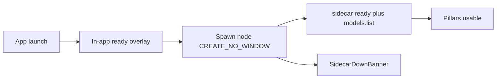

# Plan - Ready Shell and Studio Chrome

**Project**: Nexus AI Studio
**Version**: v2.2.2
**Slug**: ready-shell-and-studio-chrome
**Filename**: v2.2.2-ready-shell-and-studio-chrome.md
**Plan Type**: Feature / Enhancement (patch follow-on)
**Created**: 2026-08-22
**Predecessor**: [v2.2.1-field-repair-and-chrome-completion.md](v2.2.1-field-repair-and-chrome-completion.md)
**Goal**: After a v2.2.1 install whose healthcheck passed, the GUI never opens a Node console, the sidecar stays alive, an in-app overlay covers startup until the backend and catalog are ready, Image generation accepts `flow-dpm-solver`, and Chat / Coding / Image / Video share icon-send composers, 80% fit-content bubbles, and Settings-parity chrome on Data and Advanced settings.

## Overview

v2.2.1 closed the packaged sqlite ABI and `unsloth-pins.json` holes. On this Windows host the installer Complete page then printed sidecar ok. The next GUI launch still failed the product: a visible `node.exe` console (Windows Terminal tooltip `Default: ...\Nexus\runtime\node\node.exe`), then `sidecar-exited:-1073741510` (`STATUS_CONTROL_C_EXIT`, 0xC000013A). Settings Models and Local API showed backend-down. Chat and Coding looked empty because they never mount `SidecarDownBanner`. Image generation failed at sidecar Zod with `received: "flow-dpm-solver"` against a six-value enum. Composer chrome still wrapped a labeled Generate/Send control in `MetalAccent` (square fallback ring) and Coding kept a three-box `+` / textarea / Send row. Data had no page padding. Advanced settings stayed a native `<details>` plus raw number inputs. Transcripts were full-width rectangles labeled You / Assistant.

This patch does not re-run v2.2.0 or v2.2.1. It hides the console so the child cannot be killed by closing a CMD window, shows a modern in-app ready overlay (not a second OS window), unblocks SANA's sampler at the protocol layer, and finishes the composer / bubble / Data / Advanced chrome the field session still showed as unfinished.

Success looks like: launching the app from Explorer or Start shows only the Tauri window; an overlay dismisses when the sidecar is running and `models.list` has returned (empty catalog is success); no console exists to close; Chat and Coding show the backend banner when the sidecar is down; Image Generate with the SANA default sampler does not 400 at Zod; `+` and send sit together inside the field as icons; user bubbles sit right and assistant bubbles sit left, fit-content, max 80% of the transcript pane; Data is inset like Models; Advanced settings use the shared primitives.

## Field evidence (2026-08-22, post v2.2.1 installer)

Installer Complete page: healthcheck passed (`sidecar: ok`, catalog rows present).

In the running app (same session, screenshots):

- A Windows CMD / Terminal window opened on launch, titled with the provisioned Node path. The shell sat on an empty canvas until models appeared to load.
- Settings > Local API: `sidecar exited: -1073741510` while "Checking the local API server..." stayed on screen.
- Settings > Models: `The Nexus backend could not start`. Installed / Available / External 0.
- Settings > Data: Export/Import controls flush to the left edge of the main pane (no `padding: var(--space-6)`).
- Local Chat / Agentic Coding: empty constellation; Coding composer still uses the three-box layout and the placeholder `Ask anything, or attach a PDF... Type / for commands (17 available).`
- Image Studio / Video Lab: labeled Generate button with a square MetalAccent outline; Advanced settings is a plain disclosure triangle plus unstyled fields.
- First image generate: sidecar request error, `invalid_enum_value` for `sampler`, received `flow-dpm-solver`, options `euler | euler_a | dpmpp_2m | dpmpp_sde | ddim | lms`.
- Image transcript: full-width rectangles, left-aligned, labeled Assistant.

Mapped to code:

- Visible console: `desktop/src-tauri/src/sidecar.rs` `Sidecar::spawn_with` builds `Command::new(node)` with piped stdio and no creation flags. `desktop/src-tauri/src/main.rs` is `windows_subsystem = "windows"`. Console-subsystem `node.exe` therefore allocates a new console. `--healthcheck` from the installer can pass (no interactive console to close) while the GUI then dies.
- Exit `-1073741510`: closing that console sends CTRL_CLOSE / CTRL_C. Restart backend reuses `spawn_with`, so the window returns.
- Empty Chat / Coding: `ChatPage.tsx` `chat-page-empty` is a faint one-liner; Coding uses `MessageList` empty copy. Neither mounts `SidecarDownBanner` (Models / Image / Video already do).
- Data glued left: `DataSettings.tsx` root `<section>` has no padding; `ModelsSettings.tsx` uses `padding: var(--space-6, 24px)`.
- Generate square outline: `MediaComposer.tsx` wraps a labeled submit in `MetalAccent`. `.nexus-metal-fallback` in `desktop/src/styles/globals.css` paints a 1px box-shadow ring. `CodingInput.tsx` still uses a separate `+` / textarea / Send row.
- Advanced not modernized: Image/Video native `<details><summary>` plus leftover `<input type="number">` in `ImagePromptForm.tsx` / `VideoPromptForm.tsx`.
- Sampler failure: UI default and Fast Preview send `flow-dpm-solver`. Python `runtimes/diffusion/pipelines/params.py` already allows it. Sidecar `DiffusionSampler` in `desktop/sidecar/src/protocol.ts` is the six-value enum without `flow-dpm-solver`.
- Rectangle bubbles: `MessageBubble.tsx` is a full-width `<article>` with a role header. Image/Video also render custom `<ul><li>` transcripts instead of the shared list.

## Locked product decisions

Carry v2.2.1 locks (occupancy, compact sidebar, Approvals, Hub, export). Amendments from this session:

- **Ready overlay vs GPU load**: "Until backend and models are all loaded" means sidecar alive plus `models.list` returned (catalog known), **not** every weight in VRAM. Peeking a tab still never loads or unloads a model.
- **No sidecar console**: Windows `CREATE_NO_WINDOW` (`0x08000000`) via `std::os::windows::process::CommandExt` on the shared `spawn_with` path (app, restart, `--healthcheck`). Do **not** set `DETACHED_PROCESS` (breaks piped stdin/stdout).
- **Ready UI**: in-app overlay on the existing shell (constellation plus short status). Not a second OS window and not a CMD. Dismiss when ready, or when failed (`SidecarDownBanner` plus Restart). Must time out; never hang forever.
- **Composer**: `+` and send grouped inside the field (right cluster). Send is an icon (`aria-label` Send or Generate). No caption text. No MetalAccent box around the control. Keep AccentBeam on the **surface** (focus/streaming).
- **Bubbles**: user right, assistant left, `width: fit-content`, `max-width: 80%` of the transcript pane (not a pixel cap), no You / Assistant labels on normal turns. Subtle outline or translucent fill; two close colors. Tool cards may keep a name.
- **Occupancy / Hub / Approvals / compact sidebar**: unchanged from v2.2.1.

## Copyable implementation prompt

Paste the block below into a new agent session to implement this cycle. Canonical plan: this file. Predecessor (do not re-run as greenfield): [v2.2.1-field-repair-and-chrome-completion.md](v2.2.1-field-repair-and-chrome-completion.md).

```
Implement Nexus AI Studio v2.2.2 from docs/archive/v2/v2.2/plans/v2.2.2-ready-shell-and-studio-chrome.md. Follow AGENTS.md. Do not re-run v2.2.0 or v2.2.1. Close what the post-healthcheck GUI session still proves broken, and finish composer / bubble / Data / Advanced chrome.

PRODUCT LOCKS
- Peeking a tab never loads or unloads a model. Generate / Send / agent tool: co-reside if summed VRAM plus 2 GB headroom, else Switch / Keep / Remember-for-session. Unknown VRAM: confirm, never silent swap.
- Ready overlay waits for sidecar running plus models.list (catalog known). It must not load every weight into VRAM.
- No Node console. CREATE_NO_WINDOW on spawn_with. No DETACHED_PROCESS.
- Ready UI is an in-app overlay, not a second window and not a CMD.
- Compact icon-only sidebar is the default (~56 px). Title bar keeps the brand.
- GPU status lives in the sidebar footer.
- + and send grouped inside the composer field (right cluster). Send is an icon with aria-label, no Generate/Send caption, no MetalAccent box around the button. AccentBeam stays on the surface.
- User bubbles right, assistant left, fit-content, max 80% of the transcript pane, no You/Assistant labels on normal turns. Subtle two-tone.
- Every Settings tab uses Select / SearchInput / TextField / Button / Switch. Data must have the same page padding as Models. Image/Video Advanced must use those primitives.
- Ask Inbox stays a quiet bell. No auto-approve.
- Hub offline snapshot + Sync. Do not dump every Hub skill into every prompt.

USER-REPORTED ISSUES (2026-08-22 post v2.2.1 install)

1. Healthcheck passed, then a CMD/Terminal window opened for node.exe. That must be a background task. Show a modern in-app loading overlay until backend and catalog are ready.
2. Settings > Data has no left padding; controls sit on the pane edge.
3. Sidecar still unable to start in the GUI (Local API: sidecar exited -1073741510). Closing the console kills the child.
4. Local AI Chat (and Coding) look like an empty window.
5. Image/Video Generate is a big labeled box with a square outline. Want orbs/beam/metal-style surface, icon send, + grouped with send, blended into the field. No Generate/Send text.
6. Agentic Coding typing area was not updated; same in-field + / send icon contract.
7. Image/Video Advanced settings not modernized.
8. First image generate: invalid_enum_value sampler flow-dpm-solver vs euler | euler_a | dpmpp_2m | dpmpp_sde | ddim | lms.
9. Chat bubbles are rectangles, no left/right alignment, labeled You/Assistant. User right, assistant left, fit-content, max 80% of pane, subtle colors, no You label.

ISSUES DETECTED IN CODE

- spawn_with has no CREATE_NO_WINDOW. nexus-shell is windows_subsystem windows. node.exe is console-subsystem.
- Exit -1073741510 is STATUS_CONTROL_C_EXIT. Matches closing the visible console.
- ChatPage and CodingPage never mount SidecarDownBanner.
- DataSettings root section has no padding.
- MediaComposer wraps labeled submit in MetalAccent (.nexus-metal-fallback ring). CodingInput is still a three-box row.
- DiffusionSampler Zod omits flow-dpm-solver; Python params.py already allows it.
- MessageBubble is full-width with a role header. Image/Video custom ul transcripts bypass MessageList.

ACCEPTANCE
- GUI launch: only the Tauri window. No node.exe console. sidecar_status.running true after overlay dismiss.
- Overlay copy: Starting local backend... then Reading installed models... Dismiss on running plus models.list (empty catalog ok). Failure: SidecarDownBanner plus Restart, not a hung splash.
- Chat and Coding show SidecarDownBanner when sidecar is down. Composer stays visible.
- txt2img with sampler flow-dpm-solver validates in sidecar protocol tests and no longer 400s at Zod.
- MediaComposer and CodingInput: + and send grouped inside the field; submit has aria-label and no caption text; no MetalAccent on the button.
- Data tab padding matches Models (var(--space-6, 24px)).
- Image/Video Advanced uses shared primitives; collapsed by default.
- MessageList rows: user flex-end, assistant flex-start; bubble fit-content max-width 80%; no You/Assistant on normal turns. Image/Video transcripts use the same bubble.
```

## Constitution Check

*GATE: Must pass before Phase 0 research. Re-check after Phase 1 design.*

No constitution file found at docs/v2.2.0/constitution.md - skipping check. Recommend running /constitution to establish project principles.

## Current model map

**Model map status**: fresh as of 2026-08-22; sources cited below.

| Tier | Anthropic | OpenAI | Google | Cursor |
|------|-----------|--------|--------|--------|
| frontier | `claude-fable-5` | `gpt-5.6-sol` | `gemini-3.7-flash` | `cursor-grok-4.6` |
| strong | `claude-opus-5` | `gpt-5.6-terra` | `gemini-3.6-flash` | `cursor-grok-4.5` |
| standard | `claude-sonnet-5` | `gpt-5.6-terra` | `gemini-3.5-flash` | `composer-2.5` |
| fast | `claude-haiku-4-5` | `gpt-5.6-luna` | `gemini-3.5-flash-lite` | `composer-2.5-fast` |

### Model map sources

- Anthropic: https://platform.claude.com/docs/en/about-claude/models/overview
- OpenAI: https://developers.openai.com/api/docs/models
- Google: https://blog.google/innovation-and-ai/models-and-research/gemini-models/introducing-gemini-3-7-flash/
- Cursor: https://cursor.com/docs/models-and-pricing

Cursor is manual-picker only. On `/implement`, select the phase's Cursor cell in the model picker. Do not downshift.

## Phases at a Glance

| Phase | Title | Outcome | Recommended model tier | Recommended effort level |
|-------|-------|---------|------------------------|--------------------------|
| 1 | Hidden sidecar and ready overlay | No Node console; child survives; in-app overlay until sidecar plus catalog | frontier | max |
| 2 | Diffusion sampler contract | `flow-dpm-solver` validates in sidecar Zod, matching Python | frontier | high |
| 3 | Shared composer chrome | Chat, Coding, Image, Video: in-field + / icon send, no metal box | strong | high |
| 4 | Data padding and Advanced settings | Data inset like Models; Image/Video Advanced uses primitives | standard | medium |
| 5 | Transcript bubbles and backend-down | 80% fit-content bubbles; Chat/Coding show SidecarDownBanner | strong | high |
| 6 | Architecture refactor, known-gaps, CI/CD | Layout clean, gaps reconciled, CI covers the patch | frontier | max |

Parallelism: Phase 2 can run beside Phase 1. Phases 3, 4, and 5 can proceed once Phase 1 spawn flags are in (they do not need a live GPU). Do not call the cycle done until a GUI launch on this host shows no console and `sidecar_status.running` stays true.



---

## Phase 1: Hidden sidecar and ready overlay

**Goal**: Node never shows a console; the shell shows a modern overlay until the backend is alive and the catalog is listed.
**Prerequisites**: None.
**Stability Gate**: GUI launch on this Windows host: zero extra console windows; `sidecar_status.running` true after overlay dismiss; closing nothing can send `0xC000013A`. If spawn fails, overlay becomes the existing banner with Restart, not a hung splash.
**Recommended model tier**: frontier
**Recommended effort level**: max
**Rationale**: Windows process flags plus GUI lifecycle; two high signals (risk, reasoning). Healthcheck already passed; the remaining P0 is console-kill of a live child.

### Sub-tasks

#### 1.1 - CREATE_NO_WINDOW on spawn

**Objective**: `Sidecar::spawn_with` sets Windows creation flags so `node.exe` does not allocate a console.

**Failure modes**: Flag omitted on one spawn path (app vs healthcheck vs restart) -> console returns; `DETACHED_PROCESS` used -> JSON-RPC stdin dies; flag applied on non-Windows -> must `cfg(windows)` only.

**Build class**: load-bearing.

**Prompt**:
> In the Nexus-AI repo, stop the packaged GUI from opening a Node console. `desktop/src-tauri/src/sidecar.rs` `Sidecar::spawn_with` currently `Command::new(node)` with piped stdio and no creation flags. On Windows, `use std::os::windows::process::CommandExt` and `creation_flags(0x08000000)` (CREATE_NO_WINDOW) on that Command, including `--healthcheck` and restart (they share `spawn_with`). Do not set DETACHED_PROCESS. Keep cwd = script.parent(), piped stdin/stdout/stderr, ready-marker wait. Extract a small `fn sidecar_command(...)` if that makes the flag assertable. Add a unit test that the spawn helper applies the flag on Windows. Acceptance: launching `nexus-shell.exe` from Explorer/Start shows only the Tauri window; `sidecar_status` stays running; killing a console is no longer a user action because none exists.

---

#### 1.2 - In-app ready overlay

**Objective**: Until sidecar is running and `models.list` has returned, the shell shows one overlay (constellation plus status). It does not load weights onto the GPU.

**Failure modes**: Overlay waits for VRAM residency -> contradicts occupancy lock; overlay never times out -> app looks frozen; overlay unmounts before first RPC -> user clicks into empty Chat.

**Build class**: load-bearing.

**Prompt**:
> Add a ready gate in `desktop/src/App.tsx` (or a small `ReadyOverlay` next to `SidecarDownBanner`). Poll `sidecar_status` then one `models.list` (or reuse existing clients). Copy: "Starting local backend..." then "Reading installed models...". Dismiss when `running` and list succeeds (including empty catalog). On failure or timeout, replace overlay with `SidecarDownBanner` plus Restart. Tests: overlay visible while status not running; gone after ok; failed status shows banner not infinite overlay. Do not spawn extra Tauri windows. Do not pull Ollama or diffusion weights as part of ready.

---

#### 1.3 - Testing and Stabilization

**Objective**: Generate and run all tests for this phase. Iterate until the phase is stable before advancing to Phase 2 as "done".

**Prompt**:
> Generate comprehensive tests for Phase 1: cargo test the creation-flag helper; desktop vitest for ReadyOverlay (visible / dismissed / failed). Confirm installer pytest still covers healthcheck verdict shape. Update CI path filters if new files sit outside existing globs. Do not proceed to Phase 2 as cycle-done until a GUI launch on this host shows no console. After all tests pass, run /generate-session-history to document Phase 1.

---

### Phase 1 Exit Checklist

- [ ] All sub-tasks completed
- [ ] All tests passing (unit, integration)
- [ ] No known regressions from prior phases
- [ ] Session history generated for this phase
- [ ] Ready to advance to Phase 2

---

## Phase 2: Diffusion sampler contract

**Goal**: Image (and video Fast Preview) `flow-dpm-solver` is accepted by sidecar Zod, matching Python `_VALID_SAMPLERS`.
**Prerequisites**: None (can parallel Phase 1).
**Stability Gate**: A txt2img request with `sampler: "flow-dpm-solver"` validates in protocol tests; the UI default no longer 400s at the sidecar.
**Recommended model tier**: frontier
**Recommended effort level**: high
**Rationale**: Production generation blast radius (one high signal). Python already allows the sampler; the desktop protocol is stale.

### Sub-tasks

#### 2.1 - Add `flow-dpm-solver` to DiffusionSampler

**Objective**: Sidecar Zod matches Python image and video sampler sets.

**Failure modes**: Enum updated in image request only -> video Fast Preview still fails; UI lists a sampler Python rejects -> opposite bug; default stays flow while some non-SANA models need euler -> coerce at the pipeline layer with a clear error, not by stripping the enum.

**Build class**: load-bearing.

**Prompt**:
> Update `desktop/sidecar/src/protocol.ts` `DiffusionSampler` to include `flow-dpm-solver` (same set as `runtimes/diffusion/pipelines/params.py` and `video_params.py`). Extend protocol unit tests (`desktop/tests/diffusion-protocol.test.ts`, `desktop/tests/video-protocol.test.ts`). Keep Python as source of truth; do not silently coerce unknown samplers. If a non-SANA model cannot run flow, coerce at the pipeline layer with a clear error. Re-run ImagePromptForm / VideoPromptForm tests that already expect flow.

---

#### 2.2 - Testing and Stabilization

**Objective**: Prove Zod parse accepts the field payload.

**Prompt**:
> Add a fixture request matching the 2026-08-22 field error (`sampler: "flow-dpm-solver"`) and assert parse success. Run desktop vitest for protocol tests. After all tests pass, run /generate-session-history to document Phase 2.

---

### Phase 2 Exit Checklist

- [ ] All sub-tasks completed
- [ ] All tests passing
- [ ] No known regressions from prior phases
- [ ] Session history generated for this phase
- [ ] Ready to advance to Phase 3

---

## Phase 3: Shared composer chrome

**Goal**: One in-field composer: grouped `+` and send icon, no labeled Generate/Send, no MetalAccent ring on the button. Used by Chat (`MediaComposer`), Coding (`CodingInput`), Image, Video.
**Prerequisites**: None.
**Stability Gate**: All four pillars show icon send inside the field; tests assert `aria-label` and no submit caption text.
**Recommended model tier**: strong
**Recommended effort level**: high
**Rationale**: Shared chrome across four pillars; existing tests query button text "Send"/"Generate" and will fail if not updated with the restyle.

### Sub-tasks

#### 3.1 - Restyle MediaComposer submit cluster

**Objective**: Icon send grouped with `+` on the right, inside the surface, no metal box.

**Failure modes**: Submit disabled with only attachments -> already allowed, keep it; icon-only with no aria-label -> inaccessible; MetalAccent removed from the button but left wrapping submit -> square outline remains.

**Build class**: load-bearing.

**Prompt**:
> In `desktop/src/shared/chat/MediaComposer.tsx`, stop wrapping submit in `MetalAccent`. Use a lucide (already a desktop dependency) send icon; `aria-label` from `submitLabel` (Chat "Send", Image/Video "Generate") but do not render the word. Group `+` with send on the right inside the surface. Shrink textarea right padding to match the clustered controls. Keep AccentBeam on the composer surface for focus/streaming. Update tests that query button text "Send" or "Generate".

---

#### 3.2 - CodingInput matches MediaComposer

**Objective**: Agentic Coding uses the same in-field layout. Slash autocomplete and document accept stay.

**Failure modes**: Slash palette positioning assumes the old three-box row -> re-anchor to the surface; paste/attach contract must not change.

**Build class**: load-bearing.

**Prompt**:
> Rewrite `desktop/src/modules/coding/CodingInput.tsx` to the same in-field layout as MediaComposer (slash autocomplete and document accept stay). Delete the three-box flex row (`addBtnStyle` plus textarea plus MetalAccent Send). Tests: `coding-input-add` and `coding-input-submit` inside the surface; submit has no "Send" text node.

---

#### 3.3 - Testing and Stabilization

**Objective**: Generate and run all tests for this phase.

**Prompt**:
> Desktop vitest for MediaComposer plus CodingInput. Update `/_styleguide` if it still shows a labeled send. After all tests pass, run /generate-session-history to document Phase 3.

---

### Phase 3 Exit Checklist

- [ ] All sub-tasks completed
- [ ] All tests passing
- [ ] No known regressions from prior phases
- [ ] Session history generated for this phase
- [ ] Ready to advance to Phase 4

---

## Phase 4: Data padding and Advanced settings

**Goal**: Data tab uses the same page padding as Models; Image/Video Advanced uses Select / TextField / Button / Switch, not a bare `<summary>` plus raw number inputs.
**Prerequisites**: Phase 3 optional.
**Stability Gate**: Data content is inset like Models; Advanced panel controls match Settings primitives.
**Recommended model tier**: standard
**Recommended effort level**: medium
**Rationale**: Mechanical token and primitive sweep; one or two medium signals.

### Sub-tasks

#### 4.1 - DataSettings padding

**Objective**: Data is not glued to the pane edge.

**Failure modes**: Padding only on inner groups -> heading still flush; a shared `settingsPageBodyStyle` is better than a one-off if Models already has the token.

**Build class**: load-bearing.

**Prompt**:
> Add `padding: var(--space-6, 24px)` (same as ModelsSettings) to `desktop/src/pages/settings/DataSettings.tsx` root. Prefer extracting a shared `settingsPageBodyStyle` if that is a one-file mechanical move. Guard with a test that the settings-data root includes that token.

---

#### 4.2 - Advanced settings chrome

**Objective**: Image/Video Advanced matches Settings control chrome.

**Failure modes**: Collapsed-by-default lost -> Advanced dumps a wall of fields; queue seed sweep and mask tools must stay inside Advanced.

**Build class**: load-bearing.

**Prompt**:
> Replace native `<details>` chrome in `desktop/src/modules/image/ImageStudioPage.tsx` / `desktop/src/modules/video/VideoLabPage.tsx` and leftover raw `<input type="number">` in `ImagePromptForm.tsx` / `VideoPromptForm.tsx` with shared `Select`, `TextField`, `Switch`, `Button`. Keep collapsed-by-default. Queue seed sweep and mask tools stay inside Advanced. Extend `desktop/tests/settings-control-sweep.test.ts` or add a studio-control-sweep grep so Advanced cannot regress to unstyled inputs.

---

#### 4.3 - Testing and Stabilization

**Prompt**:
> Vitest for Data padding plus Advanced using primitives. After all tests pass, run /generate-session-history to document Phase 4.

---

### Phase 4 Exit Checklist

- [ ] All sub-tasks completed
- [ ] All tests passing
- [ ] No known regressions from prior phases
- [ ] Session history generated for this phase
- [ ] Ready to advance to Phase 5

---

## Phase 5: Transcript bubbles and backend-down

**Goal**: User right / assistant left, fit-content, max 80% of pane, no You/Assistant labels on normal turns. Chat and Coding show SidecarDownBanner when the backend is down instead of a blank constellation.
**Prerequisites**: None (can parallel 3/4).
**Stability Gate**: Shared MessageBubble tests for alignment and 80% max-width; ChatPage and CodingPage show the banner on sidecar-down.
**Recommended model tier**: strong
**Recommended effort level**: high
**Rationale**: Shared transcript chrome plus two pages that currently hide backend-down; Image/Video custom lists must not be left as rectangles.

### Sub-tasks

#### 5.1 - MessageBubble plus MessageList alignment

**Objective**: Fit-content bubbles, 80% of the transcript pane, no You/Assistant on normal turns.

**Failure modes**: 80% of the viewport instead of the transcript pane -> too wide; `width: fit-content` on a block article -> still full width unless the **row** is flex; selectable preview bubbles lose hit target if too narrow.

**Build class**: load-bearing.

**Prompt**:
> In `desktop/src/shared/chat/MessageList.tsx`, wrap each row as flex (`justify-content: flex-end` for user, `flex-start` for assistant). In `desktop/src/shared/chat/MessageBubble.tsx`, drop the You/Assistant header for user/assistant (keep tool/system identification on tool cards). Bubble: `width: fit-content`, `max-width: 80%`, subtle border or translucent background. Image Studio and Video Lab custom `<ul>` transcripts must use the same bubble (or MessageList) so generation errors are not left-aligned unlabeled rectangles. Tests for `data-role`, alignment, and max-width 80%.

---

#### 5.2 - SidecarDownBanner on Chat and Coding

**Objective**: Empty canvas is not the backend-down state.

**Failure modes**: Banner hides the composer -> user cannot type after restart; empty copy for a healthy backend with no thread must remain.

**Build class**: load-bearing.

**Prompt**:
> Mount `SidecarDownBanner` on `desktop/src/modules/chat/ChatPage.tsx` and `desktop/src/modules/coding/CodingPage.tsx` when `useSidecarStatus` reports down (same as Models/Image/Video). Empty copy stays for a healthy backend with no thread. Do not hide the composer.

---

#### 5.3 - Testing and Stabilization

**Prompt**:
> ChatPage / CodingPage / MessageBubble tests. After all tests pass, run /generate-session-history to document Phase 5.

---

### Phase 5 Exit Checklist

- [ ] All sub-tasks completed
- [ ] All tests passing
- [ ] No known regressions from prior phases
- [ ] Session history generated for this phase
- [ ] Ready to advance to Phase 6

---

## Phase 6: Architecture Refactor, Known-Gaps Reconciliation, and CI/CD

**Goal**: Leave the project well-organized, its known gaps reconciled, and its CI/CD complete and optimized.
**Prerequisites**: All prior phases.
**Stability Gate**: The layout is clean (no deprecated/obsolete files, empty dirs, redundant files/dirs, or overcomplicated structure left un-triaged); the version's known gaps are reconciled; CI/CD covers every change and is optimized; project validation/tests pass.
**Recommended model tier**: frontier
**Recommended effort level**: max
**Rationale**: Repo-wide refactor, reference repair, known-gap reconciliation, and release gating carry high context volume and blast radius.

### Sub-tasks

#### 6.1 - Architecture refactor

**Objective**: Refactor toward a well-organized, intuitive layout.

**Prompt**:
> Identify deprecated/obsolete files, empty directories, redundant files/dirs, and overcomplicated structure, then refactor toward a clean, intuitive layout via [[project-refactor]] and [[docs-layout-refactor]] (propose-then-apply, with confirmation; repair every reference for anything that moves). Candidates: duplicate composer style objects in CodingInput after Phase 3; Image/Video custom transcript lists after Phase 5 if MessageList can replace them.

#### 6.2 - Known-gaps reconciliation

**Objective**: Reconcile this version's open gaps.

**Prompt**:
> Reconcile this version's known gaps via [[known-gaps-tracker]]: resolve, defer, or transfer each open item, and add a v2.2.2 section to docs/archive/v2/v2.2/known-gaps.md. Carry forward DF-1 (Node SEA), DF-2 clean-VM smoke (this host Complete-page ok is not a clean VM), DF-4 live-GPU soaks, DF-16 native file dialog, DF-17 URL settings tabs, DF-18 macOS/Linux addon layout. Close field bugs this plan named: visible node console / 0xC000013A, sampler Zod mismatch, Data padding, icon-send composer, 80% bubbles, Chat/Coding backend-down banner.

#### 6.3 - CI/CD create/update/optimize

**Objective**: CI/CD covers all changes and is optimized.

**Prompt**:
> Create or update the CI/CD pipeline so it covers every change in this plan (Windows creation-flag unit test, DiffusionSampler includes flow-dpm-solver, composer aria-label / no caption text, MessageBubble alignment, Data padding, Chat/Coding SidecarDownBanner), then optimize it to reduce action minutes (path filters, concurrency cancel-in-progress, dependency caching, gating expensive-OS or matrix jobs to merges/schedule) while keeping comprehensive testing. Keep it platform-agnostic; GitHub Actions is the primary example.

#### 6.4 - Cross-installer parity

**Objective**: Prevent operating-system installer drift when the repository ships multiple installers.

**Prompt**:
> If this repository ships more than one installer, run or add a declarative cross-installer parity gate covering distributed artifacts, supported platforms, named capability counterparts, and external-tool fallbacks, then execute the real installers on their target operating systems with identical postconditions. Cross-link [[platform-contract-verification]] so discovery and delivery are checked in the same pass. CREATE_NO_WINDOW is Windows-only; record macOS/Linux as N/A for the console flag, not as proven hidden. If the remaining work is Windows-only field proof, record a silent no-op for other OS consoles and continue.

#### 6.5 - Testing and Stabilization

**Objective**: Prove the refactor preserved behavior and CI/CD is green.

**Prompt**:
> Run the full validation/test suite (desktop vitest, cargo test in desktop/src-tauri, installer pytest for packaging/healthcheck), confirm the refactor changed no behavior, confirm CI/CD passes, and iterate until clean. Generate a session-history entry for this phase.

---

## Complexity Tracking

> **Fill ONLY if Constitution Check has violations that must be justified**

| Violation | Why Needed | Simpler Alternative Rejected Because |
|-----------|------------|-------------------------------------|
| | | |

---

### Phase 6 Exit Checklist

- [ ] All sub-tasks completed
- [ ] All tests passing (unit, integration, and any phase-specific tests)
- [ ] No known regressions from prior phases
- [ ] Session history generated for this phase
- [ ] Release readiness confirmed (hand off to /update release)

---

## Out of scope

- Re-running the full v2.2.0 or v2.2.1 cycles.
- Loading every model into VRAM at startup.
- Node SEA / Tauri `externalBin` (DF-1).
- Live-GPU generation soaks (DF-4).
- Native file dialog for export/import (DF-16 remaining).
- URL-addressable settings tabs (DF-17).
- Redesigning orbs / beam / metal engines; only stop using MetalAccent as a send-button frame.
- Dumping the Hub catalog into every system prompt.
- Deleting the Ask Inbox capability.
- Multi-GPU scheduling.
- Light-theme support.
