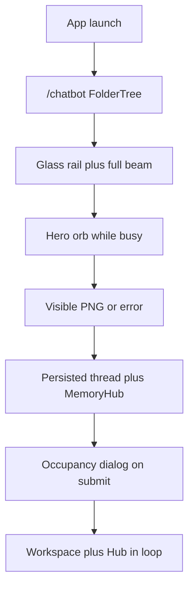

# Plan - Glass Chrome, Thinking Orbs, and Pillar Runtime

**Project**: Nexus AI Studio
**Version**: v2.2.3
**Slug**: glass-orbs-and-pillar-runtime
**Filename**: v2.2.3-glass-orbs-and-pillar-runtime.md
**Plan Type**: Feature / Enhancement (patch follow-on)
**Created**: 2026-08-22
**Predecessor**: [v2.2.2-ready-shell-and-studio-chrome.md](v2.2.2-ready-shell-and-studio-chrome.md)
**Goal**: After the v2.2.2 GUI session, Local Chat is not a blank constellation, Image and Video show a working orb then a real result, chrome is one glass language instead of per-tab neon, and the four pillars can generate, remember, switch models honestly, and run Nexus-Hub commands, skills, hooks, and rules against a real workspace.

## User-reported issues (this session)

These are the complaints the operator stated in the 2026-08-22 post-v2.2.2 GUI session, in the order they were raised. Every item below must appear in at least one sub-task.

### U1 - Composer beam only lights the right half of the typing area

On Image Studio, focus/streaming paints an orange glow on the bottom-right of the composer. The left half of the bottom edge and the top/left edges stay a static muted cyan. The operator asked for the animation on the whole typing area, not a stuck wedge.

### U2 - Per-tab flashy colors; want liquid glass

The compact sidebar paints each module a different high-contrast hue (cyan chatbot, pink coding, orange image, green video), plus a 3px left accent bar and a tinted active fill. The operator asked to drop those colors and use a modern treatment that matches the dark scheme, specifically a liquid-glass selected state like the open-source glass references already in `.nexus-glass`. Settings and Approvals already sit in muted foreground; the four module rows should match that language. The title-bar mark must not recolor with the active tab (v2.2.1 lock).

### U3 - No image was generated

After sending "Generate the same image Change outfit to skinny bikini" with a source thumbnail, Image Studio showed a user bubble (prompt plus thumb), a large empty black canvas, and a row of seven native grey text buttons (Download, Copy Workflow, Use Prompt, Use Seed, Use All, Remix, Use as Source). There was no visible generated image and no visible working animation while the job ran.

### U4 - Studio action buttons are native text boxes; want icons

The seven actions in U3 are unstyled `<button>` elements. On Windows they draw as grey OS chrome. The operator asked for modern icon controls with accessible names, not captioned boxes.

### U5 - Working animation should be the thinking orbs

While a model is working (image generation, video generation, chat reply, coding/thinking), the operator wants the dotted thought-orbs from [https://orbs.jakubantalik.com/](https://orbs.jakubantalik.com/) (states such as Working, Searching, Solving, Listening, Composing, Shaping). The field session showed no such animation in the empty Image Studio canvas.

### U6 - Same class of failures expected on Video, Agentic Coding, and Local Chat

The operator expects the empty-canvas, missing-working-state, ugly-actions, and "it did not actually do the job" pattern to repeat on Video Lab, Agentic AI Coding, and Local Chatbot, and asked for a deep investigation that fixes all of them, not only Image Studio.

### U7 - Local Chatbot is an empty window; default tab should be that module

Clicking Local Chatbot yields an empty main pane (constellation only). Fresh launch should land on Local Chatbot, not a hidden Dashboard and not Image Studio.

### U8 - Key functionalities must actually work

Beyond chrome, the cycle must make these product paths real on this host:

- Switching models (occupancy policy: peeking a tab never loads; submit may Switch / Keep / Remember-for-session).
- Generating images.
- Generating videos.
- Generating text (Local Chat).
- Maintaining memory across chat (reload, reopen a thread, sidecar restart).
- Accomplishing complex agentic tasks (tools against a real workspace).
- Running Nexus-Hub commands, skills, hooks, and rules from the desktop Agentic surface.

### U9 - Installer leftovers from the same field day

Still open from the same conversation, not yet coded:

- Unlimited OCR 3B should be recommended and pre-selected on GPU tiers that fit (RapidOCR on CPU/8 GB so Document is never empty).
- Installer taskbar icon should be a transparent PNG like the installed app, not a navy-filled tile.
- Installing should auto-advance to a compact Complete page (no extra Next, no clipped "VS Code extension", no giant Copy rows).

## Issues found in code (investigation, 2026-08-22)

Mapped from the GUI session onto the tree. Support tier: **supported** where the file and call site were read in this session; **not proven here** where a live GPU or packaged Explorer launch was not repeated.

> **Verification addendum (2026-08-22, independent re-read of every claim below).** Items marked [V] were re-confirmed against the working tree with file:line evidence. Items marked [V-corrected] were wrong or incomplete as originally written; the correction is inline. New findings from the verification pass are collected in "Additional issues from verification" after item 28 and are folded into the phase prompts.

### Chat (empty window, no memory, no default tab)

1. **[V] IPC client is the wrong shape for FolderTree (P0 blank pane).** `desktop/src/modules/chat/ChatPage.tsx:149-159` casts `createIpcChatExplorerClient()` onto the **sync** `ChatExplorerClient` from `chatExplorerClient.ts`. `FolderTree` calls `client.listTree()` inside `useMemo` on mount (`FolderTree.tsx:185`). The IPC client exposes `tree(): Promise<...>`, not `listTree()`. That throw has no error boundary (grep confirms **zero** ErrorBoundary/componentDidCatch anywhere under `desktop/src`), so the crash propagates to the React root and blanks the whole app, not just the pane. Tests never hit it because they inject `InMemoryChatExplorerClient`; `App.test.tsx` renders ChatPage without a `client` prop and silently gets the in-memory client because `tauriAvailable()` is false in jsdom. This is the concrete cause of U7's empty window, independent of sidecar health. v2.2.2's SidecarDownBanner does not fire for this crash. **Second sync crash**: `ChatPage.tsx:233` calls `client.ancestors(activeChat.folderId)` inside a `useMemo` (breadcrumb); fixing only `listTree` still crashes as soon as a chat is active. **Type divergence**: the sync client imports `Chat`/`Folder`/`FolderTreeNode` from `./types` while the IPC client imports them from `storage/ChatExplorerStore.types` - two separate type families hidden by the cast.

2. **[V] FolderTree mutations are still sync.** `createFolder`, `createChat`, `getChat`, `ancestors`, `search` on the in-memory interface are synchronous. IPC `createFolder` takes `(parentId, name)`, not `{parentId, name}` (`FolderTree.tsx:367` would send `{parentId: {parentId,name}, name: undefined}` and the sidecar Zod schema rejects it). Missing from the IPC client but called by live UI code: `listTree`, `getFolder` (FolderTree.tsx:396,407,627,648), `getChat` (630,649), `ancestors` (ChatPage.tsx:233), `search` (declared on the sync interface; the sidecar already implements `chat.explorer.search` but the IPC client never exposes it). Present only on the IPC side: `setPersona`, `appendMessage`, `listMessages` - reached today only through casts or not at all. IPC `renameChat` takes a third `byUser` arg; IPC `createChat` is already overloaded to accept the object form. Even after adding `listTree`, the rail will throw on the next user action unless every call is `Promise.resolve`'d and the IPC adapter implements the missing methods.

3. **[V] Transcripts are React RAM only.** `ChatPage.appendMessage` (`ChatPage.tsx:337-343`) updates `messagesByChat`. It does not call `chat.explorer.appendMessage`. `handleOpenChat` (`ChatPage.tsx:314-318`) sets `activeChat` and does not call `listMessages`. The sidecar already exposes `chat.explorer.appendMessage` and `chat.explorer.listMessages` (protocol.ts:92-93, both `implemented: true`, handled in handlers.ts/explorerRuntime.ts) - the persistence path is fully wired sidecar-side and has **zero renderer call sites**. Reload or switching chats loses the visible thread. That is U8 "maintaining memory across chat" at the transcript layer. Related: `sessionIdsRef` (`ChatPage.tsx:165`) is per-instance and never rehydrated, so once transcripts persist, a reopened chat will show restored messages while the sidecar LLM session starts with empty history - Phase 4 must either replay stored turns into the new session or label the mismatch.

4. **LLM session memory is an in-process Map.** `desktop/sidecar/src/chat/sessionManager.ts` keeps `history` in a `Map`. Sidecar restart forgets the model context even if explorer rows existed.

5. **Episodic memory is a process-local stub.** `desktop/src/App.tsx` does `const chatMemoryHub = new InMemoryMemoryHub()` and passes it into ChatPage. Captions and STT rows never reach `~/.nexus` SQLite. Reload wipes them.

6. **Chat replies are batched.** `sendChatTurn` awaits `chat.session.sendMessage` then joins all token events. The pending orb can appear, but tokens do not stream into the bubble. Combined with a 20px inline orb and no caption, U5 looks like "nothing is happening".

7. **Default route is Dashboard.** `App.tsx` mounts `Dashboard` at `/`. `main.tsx` restores `readActiveRoute()`. Fresh install has no stored route, so `/` is Dashboard, which is not in the sidebar. The operator asked for Local Chatbot as the first module.

8. **[V] Chat and Coding never consult the occupancy policy.** `useModelResidency` / `ModelSwitchDialog` are imported only by Image Studio and Video Lab. `App.tsx:182` passes ImageStudioPage **exactly one prop** (`onGetMoreModels`) - no `hostVramFreeGB`, no `activeSchedulerJob`, and **no `diffusionTier`**, so Image silently defaults to `"diffusion-low"` and wrongly gates 2K/4K on high-VRAM hosts (Video does get `vramGB`/`diffusionTier`, but total VRAM, not free). Even Image's policy sees "VRAM unknown / nothing resident" unless those props are wired. **There is no `scheduler.snapshot` IPC**: the protocol's only scheduler methods are the cron-style `ask.scheduler.*`, and the `GpuScheduler` instance in `studioRuntime.ts` is never exposed over IPC - Phase 5 must add a new protocol method, not "reuse" one. Known-gaps DF-9 is marked resolved from v2.2.0 Phase 8; this investigation contradicts that for Chat and Coding (and for App wiring into Image). Treat DF-9 as **reopened**.

### Image Studio (U3, U4, U5)

9. **Working orb is 20px and left-aligned.** Pending assistant messages use `AgentStateOrb` `size="inline"` (20px) inside a fit-content bubble. `GenerationCanvas` (64px hero orb plus aurora) is explicitly **not mounted** on Image/Video (`GenerationCanvas.tsx` comment: "Production Image/Video pages still do not mount this canvas"). In a large empty history pane the operator sees no working animation.

10. **Breathing beam is a 22% wedge that only moves 48 degrees.** `globals.css` `.nexus-accent-beam::before` is a conic gradient with color between 8% and 22%. Breathing keyframes set `--nexus-beam-angle` from `0deg` to `48deg`. That keeps the highlight in one quadrant. Image Studio also passes `--accent-image` (orange) into the beam, and `composerSurfaceStyle` draws a second inner border in `--accent-chatbot`. The beam wraps the **outer** composer (thumbs plus padding), not the inner typing surface. That is U1.

11. **[V-corrected] Generated `` can collapse; empty completes are silent; the sidecar never emits diffusion errors.** Bubble styling lives in the **shared** `MessageBubble.tsx:167-185` (`width: fit-content; max-width: 80%`, image `max-width: 100%`), not in ImageStudioPage - a width fix there also touches Chat and Coding. A missing intrinsic size (truncated or invalid data URL) collapses the image to empty while `m.media` is still truthy, which is exactly "black canvas plus action buttons"; neither the `` nor the `<video>` has an `onError` handler. Complete-with-empty-`png` (`ImageStudioPage.tsx:227-245`) clears `pending` with `content` still `""` and `media` undefined - a **silent blank assistant bubble**, and it poisons `outputs.current` with `""` so Download / Use as Source hit falsy early-returns. The **real infinite-pending path is sidecar-side and is two bugs, not one**: (a) `handlers.ts:500-517` only calls `recordCompletion` inside `if (result.pngBase64)` with no `else`, and (b) `core/generations/queuePump.ts:61-64` catches a thrown render, calls `queue.markFailed`, and returns - **no `kind:"error"` DiffusionEvent is ever synthesized by the sidecar for a diffusion job** (grep: the only `kind:"error"` producers are the model installer and the hub CLI; error events can only pass through from the Python runtime). If Python dies or the JS layer throws, the UI's 100ms poll spins forever. Also `handlers.ts:548` fire-and-forgets `pumpStudio` with a swallowed rejection.

12. **Action row is raw `<button>` text.** `ImageStudioPage` Download / Copy Workflow / Use as Source and `RecallActions` Use Prompt / Use Seed / Use All / Remix are unstyled native buttons (U4). Video Lab duplicates the same pattern.

13. **[V-corrected] Replace-intent vs img2img.** "Change outfit to skinny bikini" does not match `parseReplaceIntent`, but the gate is the **verb-preposition pairing**, not a missing keyword: `REPLACE_RE` accepts the verb `change` but requires the literal `with`; `RECOLOR_RE` accepts `to`/`as` but only for `recolor|recolour|paint` (`core/image/replaceIntent.ts:14-20`). So the path is whole-image img2img at the form's denoise strength - no SAM mask - which repaints the entire subject. Optional product improvement (Phase 3, non-blocking): extend `REPLACE_RE` to accept `change X to Y`. Regardless, a failed or black img2img still needs an honest error, not a silent empty canvas.

### Video Lab (U6)

14. **Same pending orb, same native action buttons, same beam color-by-pillar.** Video uses `--accent-video` (green) on the composer beam and `size="inline"` while pending.

15. **[V-corrected] Even a SUCCESSFUL video is unplayable in production, and empty completes are blank, not "actions without a clip".** Three distinct defects: (a) `resolveMp4Url` defaults to the **identity function** (`VideoLabPage.tsx:77-78,108`) and `App.tsx:187-191` never passes it, so a raw sidecar filesystem path (`C:\...\out.mp4`) is written straight into `<video src>` - a Tauri WebView will not load a bare absolute path; there is no `convertFileSrc` / asset-protocol conversion anywhere in the repo. **A fully successful render therefore fails silently today.** Fixing this needs `@tauri-apps/api` `convertFileSrc` plus enabling the asset protocol scope in `tauri.conf.json` for the outputs directory. (b) Complete without `mp4Path` produces a fully blank bubble - `media: undefined`, `content` `""`, and the action row and TimelinePreviewer are both gated on `m.media`, so there are **no actions at all** (the original claim of "actions but no clip" was wrong); `outputs` is also poisoned with `""`. (c) Sidecar `handlers.ts:481` double-gates recording on `result.mp4Path && result.workflow`, so a rendered clip whose workflow-metadata embed failed records **no completion at all**, contradicting the deliberate embed-failure swallow a few lines above.

16. **Residency is coded on the page but starved of live inputs** unless App wires free VRAM and the scheduler snapshot (same as Image).

### Agentic Coding (U6, U8)

17. **[V] No workspace is sent, but the backend is already plumbed.** `CodingPage.ensureSession` (`CodingPage.tsx:146-157`) calls `coding.session.start` with `{ modelId }` only. The protocol **already accepts** optional `workspacePath` (protocol.ts:157-166) and it is carried end-to-end through `CodingSessionManager` into the runner - the fix is frontend-only plus a way for the user to supply a path. `createHeadlessAgentRunner.resolveWorkspace` falls through to `NEXUS_WORKSPACE` or `process.cwd()` (the sidecar install directory). Complex agentic tasks cannot see the user's project. That is a functional miss, not chrome. **Constraint discovered in verification: there is no folder-picker plumbing today** - no `tauri-plugin-dialog` in `Cargo.toml`, no `@tauri-apps/plugin-dialog` in `desktop/package.json`, no dialog capability in `capabilities/default.json` (and the existing `@tauri-apps/plugin-shell` JS dep is inert because the Rust plugin is absent). A native picker means: Cargo dep + JS dep + `.plugin(...)` registration in `lib.rs` + `dialog:allow-open` capability. The low-friction alternative is a validated text field persisted via `desktop/src/lib/persistence.ts` (`PERSISTENCE_KEYS`, e.g. `nexus.coding.workspacePath`); sidecar `settings.get`/`settings.set` are declared but `implemented: false`, so do not persist there. `resolveInsideWorkdir` already fails closed on traversal and accepts any absolute root, so a typed path works.

18. **[V] Hub commands are discoverable; skills/hooks/rules are not in the loop.** v2.2.0 Phase 3 listed Hub skills in Settings and merged Hub commands into the slash dropdown. `createHeadlessAgentRunner` does not load `SkillCatalog` into `systemInstructions` / `skillBody`, does not construct `HookBus`, and `HeadlessAgentSession.buildSystemPrompt` does not read workspace `AGENTS.md`, `.nexus/permissions.deny`, or Hub `rules/`. Slash entries insert a template into the textarea (`CodingInput.tsx:128-132`); they do not activate a skill body, and **there is no IPC method to fetch a command/skill body** (`commands.list` returns names + descriptions only, by design of `readHubCommands`). Optimizer can pass `skillBody`; the desktop composer cannot. Verified building blocks: `HeadlessAgentSession.skillBody` already exists and renders as `# Active skill`; `core/skills/SkillCatalog.ts` imports only `node:fs` so the sidecar can use it directly; `core/storage/PermissionsDeny.ts` is a pure parser honored only on the VS Code `ToolRegistry` path - `sidecarHeadlessTools.ts` has zero deny support; `HookBus` (`core/lifecycle/HookBus.ts`) is wired only in the extension host, though the protocol already types `hookKind` on trace events. **Warning: a second headless composition exists** - `main.ts` builds `AgentRunScheduler` with its own `HeadlessAgentSession` and a real `workspacePath`; any skill/hook/deny enrichment added to `createHeadlessAgentRunner` will silently not apply there unless factored into a shared builder.

19. **Turns are batched.** `coding.session.sendMessage` returns the full event array after the agent finishes. `busy` plus a 20px orb is the only working signal. Tool cards appear only when the turn completes. U5 on this pillar is "the orb is there in tests and invisible in the field".

20. **Occupancy policy not on submit** (item 8).

21. **[V-REFUTED] `CodingPage`'s `MetalAccent` import is NOT dead.** It wraps the "New session" button (`CodingPage.tsx:484-504`, testid `coding-new-session-metal`) and a test asserts that testid. Removing the import breaks the build and the test. If the glass language should replace it, do so deliberately in Phase 2 with the test updated; do not treat it as leftover cleanup in Phase 8.

### Chrome identity (U2)

22. **[V-corrected] Sidebar `NavLink` sets the accent on the icon, `-soft` background, and a 3px left bar per module** in `Sidebar.tsx:210-219` (the row text is already `--fg-0`/`--fg-1`; the hue lives on the icon `color`, the fill, and the bar). `.nexus-glass` on the `<aside>` is only `color-mix` plus `blur(12px)`; its 1px edge is an inline `borderRight` at `Sidebar.tsx:159`, so adding a border to `.nexus-glass` would double it. Active Settings uses muted `bg-2` without a hue. **Approvals is no longer a nav entry** - it is the `ApprovalsBell` in the footer (v2.2.0 Phase 6); only Settings remains in `ADMIN_ENTRIES`. Also noted: `Sidebar.tsx:211` string-concatenates `${entry.accentVar}-soft` instead of using the existing `accentSoftVar` field, and `NAV_ENTRIES` hand-duplicates `MODULES`. `Sidebar.test.tsx` currently has zero accent/glass assertions, so de-hueing breaks no existing test. That mismatch is U2.

23. **Module accents remain in tokens** (`--accent-chatbot` cyan, coding pink, image orange, video green). They may stay as styleguide tokens. They must not drive the rail, the composer beam, or the send icon in this cycle. Beam and orbs use the brand cyan / `--glow-cyan` / `--accent-primary` (already aliased to chatbot cyan).

### Installer (U9)

24. **`recommended.json` has no `document` section.** `tier_defaults.py` `SECTION_ORDER` is chat, agentic, embed, image, video, audio. Document cards never pre-tick. Catalog already has `unlimited-ocr-3b` and `rapidocr-ppocrv4`.

25. **[V] `win_titlebar.py` `_render_taskbar_tile` has TWO defects.** It fills navy `_TASKBAR_TILE_BG` (line 206), **and** `_first_existing("icon.png", "nexus-ai-primary_no-background.png")` (lines 197-199) prefers the black-background `icon.png`, so the transparent source is only a fallback. Both must change: fill alpha 0 and flip the preference order. The installed app uses a transparent PNG (`window-icon.png` from `nexus-ai-primary_no-background.png`; both assets verified present).

26. **[V-corrected] `_on_install_finished` does not auto-advance.** `window.py:418-421` only sets `_install_finished` and refreshes nav/footer; Complete is a ninth step the user must Next into (and `_nav_state` marks the Complete row "done" while still on Installing). Complete page `setFixedWidth(160)` name labels (`complete.py:287`) clip "VS Code extension". **Correction on the Copy rows**: the `#secondaryButton min-height: 38px` rule is NOT in complete.py - it is the global QSS rule in `theme.py:206-214` driven by `BUTTON_HEIGHT` in `constants.py:267`, and complete.py sets no `secondaryButton` object names (the only two call sites are in `typed_catalog.py`). Shrinking Copy rows means a local override on the Complete page widgets, never lowering the global `BUTTON_HEIGHT`.

### False or incomplete closures to reopen

27. **DF-9 (occupancy on all four submit surfaces)** marked resolved in `docs/archive/v2/v2.2/known-gaps.md`. ChatPage and CodingPage still have no `useModelResidency`. App does not pass `hostVramFreeGB` / `activeSchedulerJob` into ImageStudioPage. Reopen.

28. **DF-12 / DF-13** chat rail and auto-title work was marked resolved. Auto-title is called, but the rail still dies on `listTree` in production, so those closures are not field-true.

### Additional issues from verification (2026-08-22 review pass)

29. **Uncommitted predecessor work.** The working tree carries ~60 modified/untracked files - the entire v2.2.1 and v2.2.2 implementation (session histories for v2.2.1 Phases 1-5 and v2.2.2 Phases 1-6 are untracked, this plan file included). **Pre-flight for this cycle: commit the v2.2.1/v2.2.2 work on `develop` before Phase 1 starts**, so v2.2.3 phase commits are attributable and revertable. Note the already-staged `installer-tests.yml` diff adds `desktop/src-tauri/**` and `desktop/sidecar/**` to the pytest triggers.

30. **Version correction.** Root `package.json` is `2.1.0`; `desktop/package.json` is `1.5.0` (not 2.1.0 as originally written). The no-bump lock applies to both unless the cycle owner asks.

31. **No incremental chat/coding transport exists.** `chat.session.sendMessage` and `coding.session.sendMessage` are strictly request/response returning a batched event array; there is no subscription or notification channel in the protocol. Phase 4.3's "stream if cheap" resolves to: keep batching this cycle, keep the orb visible, record streaming as a named residual.

32. **CI blind spot on `develop`.** `ci.yml` runs root + desktop vitest on every push (no path filter), but `shell-build.yml` (sidecar coverage suite, `cargo check/clippy/test`) fires only on push-to-`main` and PR-to-`main`. A `src-tauri` or sidecar regression on `develop` is invisible until the release PR. Phase 8.3 should extend `shell-build.yml` to `develop` pushes or accept and document the gap.

33. **Minor adjacent defects, fix only if touched by a phase**: `MediaComposer.composerStyle` hardcodes `var(--accent-image)` for the drag-active border on every pillar (a third competing border - fold into 2.2); `FolderTree.onChangeColor` self-admittedly discards the color on any non-in-memory client (no `updateFolder` anywhere - out of scope, note in known-gaps); the ChatPage flex chain is missing `minHeight: 0` on the root section and column (1.1 already adds it); persona popover anchors to `<main>` instead of the gear button; `FloatingLogo` defaults to a nonexistent `/icons/window-icon.png`; `unlimited-ocr-3b` declares `"modalities": ["image"]` while typed `document` (check the typed-catalog UI tolerates that in 7.1); `progress` events with `total === 0` render no progress bar while pending.

## Overview

v2.2.2 hid the Node console, added a ready overlay, unblocked `flow-dpm-solver`, and finished in-field icon send plus 80% bubbles. The next GUI session proved the shell can be up while every pillar still fails the operator: Chat crashes on a sync/async client lie; Image can complete into an empty canvas with grey Windows buttons and a beam that only chases one corner; working state is a 20px orb the studio layout hides; memory is an in-process stub; the agent has no workspace and no Hub bodies in its prompt; occupancy is a dialog that Image/Video own in source and nobody feeds from App.

This patch does not re-run v2.2.0, v2.2.1, or v2.2.2. It does not `npm install thinking-orbs` (v1.17 identity lock: reverse-engineered Canvas orb, Nexus tokens only). It does not dump the Hub catalog into every system prompt. It does not load weights because the user peeked a tab.

Success looks like: first launch opens Local Chatbot; the rail is glass, not a four-color traffic light; the composer beam travels the full typing-surface perimeter in brand cyan; Generate/Send still has no caption; Image/Video/Chat/Coding show a labeled hero or inline orb from the thinking-orbs grammar while work is in flight; a finished image is a visible PNG (or a written error, never a blank canvas with Download); studio actions are icon buttons with `aria-label`; reopening a chat shows the saved thread; submit on any pillar can raise Switch/Keep/Remember; the coding agent tools run in a user-chosen workspace and can load matching Hub skills plus workspace rules/hooks; installer Document is pre-ticked, the taskbar mark is transparent, and Complete appears by itself.

## Locked product decisions

Carry v2.2.2 locks (no console, ready overlay = sidecar plus `models.list`, occupancy on submit not on peek, compact rail, Approvals bell, Hub snapshot + Sync, icon send, 80% bubbles). Amendments from this session:

- **Default module**: `/` redirects to `/chatbot`. Persisted routes that are missing, `/`, or `/dashboard` also land on `/chatbot`. Last real module (coding, images, videos, settings, chatbot) still restores.
- **Rail color**: one glass treatment for every module. Active: frosted fill, hairline, inset highlight, `color: var(--fg-0)`. Inactive: `var(--fg-1)` / `var(--fg-muted)`. No per-tab `accentVar` on the icon, bar, or background. Logo in the title bar stays brand, not tab-tinted.
- **Composer beam**: wrap the **inner** typing surface (`media-composer-surface` / `coding-input-surface`). Breathing is a full-perimeter ring (opacity pulse) or a traveling 360deg chase, never a 0-48deg wedge. Color is `--accent-chatbot` / `--glow-cyan`, not `--accent-image` / `--accent-coding` / `--accent-video`. Drop the competing inner focused border. Send icon uses `var(--fg-0)`, not a pillar hue.
- **Thinking orbs**: keep `AgentStateOrb` / `orbEngine` (no `thinking-orbs` package). Studio pending (image/video) uses `size="hero"` (64px, the reference playground default), centered in the history pane, with the mapped caption (`Shaping...`). Chat/coding pending keeps inline size but **must** show the caption (`Composing...`, `Working...`) so it is not a 20px mystery. Reduced-motion: static ring, no rAF.
- **Generation honesty**: complete without bytes is an error string on the assistant bubble, never an empty media flag and never a hung pending state. A `` that fails to decode shows a visible failure, not a collapsed box. Actions render only when there is a displayable asset.
- **Studio actions**: icon-only, `aria-label` + `title`, glass `nx-icon-btn`. Testids stay (`image-download-*`, `image-use-prompt-*`, ...). No native grey Windows buttons.
- **Chat persistence**: every user/assistant turn is written through explorer IPC (`appendMessage`) and rehydrated with `listMessages` on open. `InMemoryMemoryHub` in App is not an acceptable production default for this cycle; wire the sidecar-backed hub or an IPC episodic client. Support tier for the SQLite path: implement and test; live soak is DF-4 adjacent and must be labeled if not executed.
- **Occupancy**: Chat and Coding submit through the same `useModelResidency` gate as Image/Video. App supplies `hostVramFreeGB` from telemetry (`vramFreeGB`, not total) and `activeSchedulerJob` from a scheduler snapshot. Unknown VRAM still confirms, never silent swap. Peeking still never loads.
- **Agent workspace**: `coding.session.start` accepts `workspacePath`. The UI must send one (picker or last-used). Tools must not default to the sidecar install directory when the user has a project.
- **Hub harness in the loop**: Settings list + slash discovery stay. This cycle loads (a) matching skill bodies for an invoked `/command` or explicit skill, (b) workspace `AGENTS.md` / `.nexus` rules into `systemInstructions`, (c) `HookBus` lifecycle positions the headless loop already has a type for, (d) `.nexus/permissions.deny` on the headless tool path. Do not inject the entire Hub catalog into every turn.
- **Installer Document**: `SECTION_ORDER` includes `document` (multi-pick, not single-pick). cpu/8: `rapidocr-ppocrv4`. 12/16/24: `unlimited-ocr-3b` (and RapidOCR on low tiers so Document is never empty).
- **Shipping version**: do not bump root `package.json` (`2.1.0`) or `desktop/package.json` (`1.5.0`, verified - not 2.1.0) unless the cycle owner asks. Plan version is v2.2.3.
- **Pre-flight**: commit the uncommitted v2.2.1/v2.2.2 working tree (~60 files, session histories included) on `develop` before Phase 1, so v2.2.3 phase commits are atomic and revertable.
- **Do not re-run** v2.2.0 / v2.2.1 / v2.2.2 as greenfield.

## Copyable implementation prompt

Paste the block below into a new agent session to implement this cycle. Canonical plan: this file. Predecessor (do not re-run as greenfield): [v2.2.2-ready-shell-and-studio-chrome.md](v2.2.2-ready-shell-and-studio-chrome.md).

```
Implement Nexus AI Studio v2.2.3 from docs/archive/v2/v2.2/plans/v2.2.3-glass-orbs-and-pillar-runtime.md. Follow AGENTS.md. Do not re-run v2.2.0, v2.2.1, or v2.2.2. Do not bump package.json (root 2.1.0, desktop 1.5.0) unless asked. Do not npm install thinking-orbs. PRE-FLIGHT: the working tree still holds uncommitted v2.2.1/v2.2.2 work (~60 files); commit it on develop first so v2.2.3 commits are atomic.

PRODUCT LOCKS
- Peeking a tab never loads or unloads a model. Generate / Send / agent tool: co-reside if summed VRAM plus 2 GB headroom, else Switch / Keep / Remember-for-session. Unknown VRAM: confirm, never silent swap.
- Ready overlay waits for sidecar running plus models.list (catalog known). It must not load weights into VRAM.
- No Node console. CREATE_NO_WINDOW on spawn_with. No DETACHED_PROCESS.
- Compact icon-only sidebar default (~56 px). Title bar keeps the brand. GPU status in the sidebar footer.
- Rail: one liquid-glass selected state for every module. No per-tab cyan/pink/orange/green icons or left bars.
- Composer: + and send inside the field; send is aria-label only; no MetalAccent on the button. AccentBeam on the inner typing surface, full perimeter, brand cyan, not pillar orange/pink/green.
- User bubbles right, assistant left, fit-content, max 80% of the transcript pane.
- Thinking orbs: existing AgentStateOrb. Hero + caption for image/video pending. Inline + caption for chat/coding pending. No thinking-orbs package.
- Ask Inbox stays a quiet bell. No auto-approve.
- Hub: offline snapshot + Sync. Do not dump every Hub skill into every prompt. Do inject matching skill / AGENTS.md / hooks / permissions.deny into the headless coding turn.
- Default route: /chatbot.

USER-REPORTED ISSUES (2026-08-22 post v2.2.2)

1. Composer beam only on the right half of the typing area.
2. No flashy per-tab colors; liquid glass that matches the dark scheme.
3. Image generate produced no visible image; empty black canvas plus seven grey text buttons.
4. Those buttons should be modern icons.
5. While the model works (image, video, chat, thinking), show thinking orbs (orbs.jakubantalik.com grammar).
6. Expect the same failures on video, agentic, and local chat; fix all of them.
7. Local Chatbot is an empty window; default tab should be that module.
8. Switching models, generating image/video/text, memory across chat, complex agentic tasks, Hub commands/skills/hooks/rules must work.
9. Installer: Unlimited OCR 3B recommended; transparent taskbar icon; auto-advance to compact Complete.

ISSUES DETECTED IN CODE

- ChatPage casts async IPC client to sync ChatExplorerClient; FolderTree.listTree AND ChatPage ancestors (line 233) throw; no error boundary anywhere, so the whole app blanks.
- Chat transcripts never call explorer appendMessage/listMessages (sidecar already implements both; zero renderer call sites); InMemoryMemoryHub in App; ChatSessionManager is an in-memory Map; sessionIdsRef never rehydrated (restored thread but empty LLM context).
- / is Dashboard; fresh install does not open /chatbot.
- AccentBeam breathing is 0-48deg of an 8-22% wedge; inner surface has a second border; drag border hardcodes --accent-image on every pillar; beam wraps the outer box; Image uses --accent-image.
- Sidebar NavLink uses entry.accentVar for the icon, -soft fill, and left bar (Approvals is a footer bell now, not a nav entry).
- Image/Video pending uses 20px inline orb; GenerationCanvas is unmounted (AgentStateOrb already supports size="hero"; captions do not exist yet); native <button> action rows; img max-width 100% inside fit-content can collapse; no onError on img/video.
- Sidecar NEVER emits a diffusion error event: handlers skips completion when pngBase64 missing (video double-gates on mp4Path && workflow), and queuePump's catch only marks the queue DB. Empty completes leave a silent blank bubble and poison outputs with "".
- Video is unplayable even on success: resolveMp4Url defaults to identity, App never passes it, no convertFileSrc/asset-protocol anywhere - wire convertFileSrc plus a scoped asset protocol in tauri.conf.json.
- App passes ImageStudioPage only onGetMoreModels (no hostVramFreeGB, activeSchedulerJob, or diffusionTier - Image runs as diffusion-low); no scheduler-snapshot IPC exists (add one; ask.scheduler.* is the cron scheduler); Chat/Coding have no residency gate. DF-9 is a false closure.
- coding.session.start omits workspacePath (protocol/sidecar already accept it - frontend fix); no tauri-plugin-dialog exists (add it properly or use a persisted text field via persistence.ts; sidecar settings.get/set are implemented:false); headless runner does not load SkillCatalog, HookBus, AGENTS.md, or permissions.deny (enforce deny in sidecarHeadlessTools; share enrichment with the AgentRunScheduler composition); no IPC returns a command/skill body - resolve bodies sidecar-side.
- CodingPage MetalAccent is NOT dead (New session button + test); replace deliberately or keep.
- recommended.json has no document section; taskbar tile fills navy AND prefers icon.png over the transparent PNG; Complete requires Next (the 38px Copy rows come from the global theme.py #secondaryButton rule - override locally, never lower BUTTON_HEIGHT).

ACCEPTANCE
- Packaged or Tauri Chatbot: FolderTree renders (empty tree is OK); first send creates a chat; reload + reopen shows saved messages (or a written failure, not a blank crash).
- First launch with no stored route: Local Chatbot is the visible module.
- Sidebar active item: no accent-* in computed icon color or left border; glass class shared by all four modules.
- Focused composer: beam visible on all four sides of the inner field, brand cyan, Image Studio included.
- Image pending: hero orb + "Shaping..." centered. Image complete: visible img or error text. Actions are icon buttons with aria-label; testids unchanged.
- Video pending: same orb grammar. Complete without mp4: error, not hung pending or a blank bubble. Successful mp4 plays in the packaged WebView via convertFileSrc + scoped asset protocol.
- A thrown or empty diffusion job produces a kind:"error" event from the sidecar (queuePump catch and handlers else-branch), never an eternally-polling UI.
- Chat/coding pending: orb plus caption. Tokens may stream; if still batched this cycle, the orb stays visible until the batch returns.
- Chat/Coding/Image/Video submit can open ModelSwitchDialog when the policy says confirm. App feeds free VRAM and active job.
- coding.session.start with workspacePath; tools confined there. Invoking a Hub command loads that skill body. Workspace AGENTS.md is in systemInstructions when present.
- Installer Document pre-ticks OCR per tier; taskbar icon has an alpha canvas; finish auto-advances to Complete without an extra Next.
```

## Constitution Check

*GATE: Must pass before Phase 0 research. Re-check after Phase 1 design.*

No constitution file found at docs/v2.2.0/constitution.md - skipping check. Recommend running /constitution to establish project principles.

Phase B.5 grounding: `docs/solutions/` is absent; `STRATEGY.md` is absent. Grounding is the predecessor plans plus `docs/archive/v2/v2.2/known-gaps.md` and AGENTS.md (local-first, occupancy, Hub snapshot, evidence tiers).

## Current model map

**Model map status**: fresh as of 2026-08-22; sources cited below.

| Tier | Anthropic | OpenAI | Google | Cursor |
|------|-----------|--------|--------|--------|
| frontier | `claude-fable-5` | `gpt-5.6-sol` | `gemini-3.7-flash` | `cursor-grok-4.6` |
| strong | `claude-opus-5` | `gpt-5.6-terra` | `gemini-3.6-flash` | `cursor-grok-4.5` |
| standard | `claude-sonnet-5` | `gpt-5.6-terra` | `gemini-3.5-flash` | `composer-2.5` |
| fast | `claude-haiku-4-5` | `gpt-5.6-luna` | `gemini-3.5-flash-lite` | `composer-2.5-fast` |

### Model map sources

- Anthropic: https://platform.claude.com/docs/en/about-claude/models/overview
- OpenAI: https://developers.openai.com/api/docs/models
- Google: https://blog.google/innovation-and-ai/models-and-research/gemini-models/introducing-gemini-3-7-flash/
- Cursor: https://cursor.com/docs/models-and-pricing

Cursor is manual-picker only. On `/implement`, select the phase's Cursor cell in the model picker. Do not downshift.

## Phases at a Glance

| Phase | Title | Outcome | Recommended model tier | Recommended effort level |
|-------|-------|---------|------------------------|--------------------------|
| 1 | Chat explorer IPC and default route | Local Chatbot renders; first launch opens that tab | frontier | max |
| 2 | Liquid glass rail, full-perimeter beam, icon actions | No per-tab neon; beam on the whole field; studio actions are icons | strong | high |
| 3 | Thinking orbs and generation honesty | Visible working orb; visible image/video or a written error | frontier | max |
| 4 | Durable chat memory and streamed replies | Threads survive reload; memory is not a RAM stub | frontier | max |
| 5 | Occupancy on all four submit surfaces | Switch/Keep/Remember can fire from Chat, Coding, Image, Video | frontier | high |
| 6 | Agentic workspace and Hub harness in the loop | Tools see the project; commands/skills/hooks/rules actually run | frontier | max |
| 7 | Installer Document, taskbar, Complete | OCR pre-ticked; transparent tile; auto-advance compact Complete | frontier | high |
| 8 | Architecture refactor, known-gaps, CI/CD | Layout clean, gaps honest, CI covers the patch | frontier | max |

Parallelism: Phase 2 can run beside Phase 1. Phase 7 is Python installer and can run beside Phases 2-3. Phases 4, 5, and 6 need Phase 1's Chat client to be promise-safe. Do not call the cycle done until a GUI launch on this host opens Chatbot without a white/empty crash and Image pending shows a hero orb.



---

## Phase 1: Chat explorer IPC and default route

**Goal**: Local Chatbot is a working module on first paint, and it is the default tab.
**Prerequisites**: None.
**Stability Gate**: In Tauri, opening `/chatbot` does not throw; FolderTree shows an empty tree or real chats. A fresh launch with no `nexus.shell.activeRoute` (or with `/`) shows ChatPage, not Dashboard.
**Recommended model tier**: frontier
**Recommended effort level**: max
**Rationale**: Two high signals (production blast radius, cross-file contract). This is the P0 blank window.

### Sub-tasks

#### 1.1 - Promise-safe explorer adapter

**Objective**: Production ChatPage talks to IPC without pretending it is the sync in-memory client.

**Failure modes**: Malformed IPC payload -> surface an empty tree plus a one-line error, do not crash the pane. Sidecar unreachable -> empty tree + existing SidecarDownBanner, composer stays. `listTree` in flight overlapping a mutation -> last write wins after a single refresh, no dual-write of remapped ids.

**Build class**: load-bearing.

**Prompt**:
> In the Nexus-AI repo, stop Local Chatbot from crashing on first paint. `desktop/src/modules/chat/ChatPage.tsx:149-159` casts `createIpcChatExplorerClient()` (async `tree()`) onto sync `ChatExplorerClient` (`listTree()`). `FolderTree.tsx:185` calls `listTree()` in useMemo and throws; `ChatPage.tsx:233` calls `client.ancestors()` in a second useMemo and throws as soon as a chat is active - fix BOTH. Implement a compatible adapter in `ipcChatExplorerClient.ts` (or a thin wrapper) so FolderTree and ChatPage can `await Promise.resolve` every method. Add `listTree` as an alias of `tree`, map `createFolder({parentId,name})` to IPC args, implement `getChat` / `getFolder` / `ancestors` / `search` against a cached tree (refresh after mutations); the sidecar already implements `chat.explorer.search`, so the adapter can delegate. Reconcile the two type families (`chat/types` vs `storage/ChatExplorerStore.types`) instead of casting across them. Keep `InMemoryChatExplorerClient` sync for tests. Do not dual-write remapped ids. Add a React error boundary around the routed module pane (none exists anywhere in desktop/src today) so any future module crash degrades to an in-pane error instead of a blank app. Add `minHeight: 0` / flex fill on ChatPage root section AND the inner column (only the message row has it today) so the transcript scrolls instead of growing past the viewport. Tests: FolderTree with a fake async client that only has `tree()`; ChatPage in a harness that used to throw now renders `chat-page` and the rail; a breadcrumb/ancestors render with an active chat. Do not require a live sidecar in vitest.

---

#### 1.2 - Default route is Local Chatbot

**Objective**: First launch and `/` show Local Chatbot. Last real module still restores.

**Failure modes**: Stored route `/settings` must still restore (do not force chatbot every launch). Missing or `/` or `/dashboard` -> `/chatbot`. Invalid stored path -> `/chatbot`, not a blank route.

**Build class**: load-bearing.

**Prompt**:
> Redirect `/` to `/chatbot` in `desktop/src/App.tsx`. In `persistence.ts` (or `main.tsx`) treat missing, `/`, and `/dashboard` as `/chatbot` when restoring `readActiveRoute`. Keep restoring `/coding`, `/images`, `/videos`, `/settings`, `/chatbot`. Update `desktop/tests/App.test.tsx` (it currently expects `dashboard` at `/`). Dashboard may remain at `/dashboard` if tests or the styleguide need it; it must not be the first-run sidebar landing.

---

#### 1.3 - Testing and Stabilization

**Objective**: Generate and run all tests for this phase. Iterate until stable before calling Phase 1 done.

**Prompt**:
> Generate comprehensive tests for Phase 1: FolderTree/ChatPage with an async IPC-shaped fake; App `/` -> chatbot; persistence restore matrix. Update CI path filters if new files sit outside existing globs. Do not proceed until vitest proves the old `as unknown as ChatExplorerClient` cast is gone from ChatPage. After all tests pass, run /generate-session-history to document Phase 1.

---

### Phase 1 Exit Checklist

- [ ] All sub-tasks completed
- [ ] All tests passing (unit, integration)
- [ ] No known regressions from prior phases
- [ ] Session history generated for this phase
- [ ] Ready to advance to Phase 2

---

## Phase 2: Liquid glass rail, full-perimeter beam, icon actions

**Goal**: Chrome matches the dark scheme: glass nav, a beam on the whole typing field, icon studio actions.
**Prerequisites**: None (can parallel Phase 1).
**Stability Gate**: Sidebar tests assert no `accent-image` / `accent-coding` on nav icon color. Composer tests assert beam wraps `media-composer-surface`, accent `--accent-chatbot`, and globals.css breathing no longer uses `48deg`. Image/Video action testids exist as icon buttons with aria-label, not `getByText("Use Prompt")` as the only query.
**Recommended model tier**: strong
**Recommended effort level**: high
**Rationale**: No high blast-radius signal if occupancy and generation pipelines stay untouched; several medium files (sidebar, CSS, composers, RecallActions).

### Sub-tasks

#### 2.1 - Glass sidebar

**Objective**: One liquid-glass selected state for every module row.

**Failure modes**: Missing `aria-current` -> inactive glass must not look selected. Compact 56px rail -> icon remains visible at `--fg-0` / `--fg-1` without a 3px left bar eating width. Reduced-motion -> no extra animation required; static glass is enough.

**Build class**: load-bearing.

**Prompt**:
> Restyle `desktop/src/components/Sidebar.tsx` so module NavLinks do not use `entry.accentVar` for icon `color`, background, or `borderLeft`. Add `.nexus-nav-link` in `globals.css` next to `.nexus-glass`: inactive transparent; `[aria-current="page"]` uses color-mix frosted fill, hairline, inset highlight, `backdrop-filter: blur(16px)`, `color: var(--fg-0)`. Lucide icons inherit `currentColor`. Settings/Approvals already muted; match that language. Enhance `.nexus-glass` modestly (blur/saturate/inset highlight) without double borders fighting `borderRight`. Tests in `Sidebar.test.tsx` / `shell-phase6.test.tsx`: active `/images` must not contain `accent-image` in the icon color attribute. Keep `MODULES.*.accentVar` for styleguide/module cards if tests require it; the rail must not consume it.

---

#### 2.2 - Full-perimeter composer beam

**Objective**: Focus and streaming light the whole inner typing surface in brand cyan.

**Failure modes**: `@property --nexus-beam-angle` unsupported -> static full ring in beam color, not an invisible beam. Reduced-motion -> static 1px ring (already in CSS). Streaming plus focus -> one traveling or full-ring mode, no two animations fighting (MotionSurface already picks beam).

**Build class**: load-bearing.

**Prompt**:
> Fix U1. In `desktop/src/styles/globals.css`, stop breathing from oscillating `--nexus-beam-angle` 0-48deg. Breathing must pulse a **full doughnut ring** (solid `--nexus-beam-color` on the masked border) or travel 360deg. Traveling stays 360deg. Set `box-sizing: border-box` on `::before`. Wrap `AccentBeam` around `media-composer-surface` and `coding-input-surface` (not the outer thumbs box). Use `radiusToken="--radius-lg"`. Force `accentToken="--accent-chatbot"` in MediaComposer and CodingInput regardless of `submitAccentVar`. Remove the inner focused cyan/pink border so the beam is the only ring, and fix the third competing border: `composerStyle` hardcodes `var(--accent-image)` for the drag-active border on every pillar (`MediaComposer.tsx:477`) - use the brand token there too. Send icon color `var(--fg-0)`, not `--accent-image`. Pin in `brandTokens.test.ts` that globals.css does not contain `--nexus-beam-angle: 48deg`. Update MediaComposer tests: beam contains the surface; `submitAccentVar="--accent-image"` still yields `data-beam-accent="--accent-chatbot"`.

---

#### 2.3 - Icon studio actions

**Objective**: Download / workflow / recall / use-as-source are icon buttons.

**Failure modes**: Missing workflow -> recall icons omit or disable; Download/Use as Source still show only when media exists. Click with no PNG in `outputs` -> no-op, no throw. Screen readers -> every control has `aria-label` matching the old caption.

**Build class**: load-bearing.

**Prompt**:
> Replace the native text buttons in `RecallActions.tsx`, `ImageStudioPage.tsx`, and `VideoLabPage.tsx` with lucide icon buttons (Download, ClipboardCopy or FileJson, Type/Text, Hash, Layers, Shuffle, ImagePlus). Shared glass class `nx-icon-btn` in globals.css. Keep existing data-testid prefixes. Update ImageStudioPage tests that `findByText("Use Prompt")` to `getByLabelText` / testid. Video Copy Workflow test already uses testid prefix; keep it. Do not put captions back in the toolbar; tooltips via `title` plus `aria-label`.

---

#### 2.4 - Testing and Stabilization

**Objective**: Prove chrome without requiring a GPU.

**Prompt**:
> Run desktop vitest for Sidebar, MediaComposer, CodingInput, AccentBeam, ImageStudioPage, VideoLabPage, brandTokens. Add CI coverage for the new CSS assertions. After tests pass, run /generate-session-history for Phase 2.

---

### Phase 2 Exit Checklist

- [ ] All sub-tasks completed
- [ ] All tests passing (unit, integration)
- [ ] No known regressions from prior phases
- [ ] Session history generated for this phase
- [ ] Ready to advance to Phase 3

---

## Phase 3: Thinking orbs and generation honesty

**Goal**: While a job runs, the operator sees a thinking orb. When it finishes, they see the asset or an error, never a blank canvas with Download.
**Prerequisites**: Phase 2 beam wrap is preferred so the composer and canvas do not fight; not a hard blocker.
**Stability Gate**: ImageStudio pending test asserts hero orb (`data-orb-size="hero"`) and caption Shaping. Complete with empty png shows error text and no `image-download-*`. Complete with png shows `message-media-*` with a min-width so the img cannot be 0x0 CSS. Video complete without mp4Path errors. Chat/coding pending shows a caption next to the orb.
**Recommended model tier**: frontier
**Recommended effort level**: max
**Rationale**: Production generation display plus motion; high blast radius if complete events are mishandled. Uncertainty on live GPU -> frontier/max.

### Sub-tasks

#### 3.1 - Hero orb + caption on pending surfaces

**Objective**: Match the thinking-orbs grammar without adding the npm package.

**Failure modes**: `activity` omitted -> default `chat-streaming` / Composing, never a blank pending slot. Reduced-motion -> static dots, caption still visible. Offscreen IntersectionObserver pause -> caption remains so the row does not look empty.

**Build class**: load-bearing.

**Prompt**:
> Do not install `thinking-orbs`. Extend `AgentStateOrb` with an optional visible caption from `resolveAgentState(activity).label` (append ASCII `...`). In `MessageBubble`, if `pending` and activity is `image-generation` or `video-generation`, use `size="hero"`, center the row (`width: 100%`, minHeight ~12rem, no competing bubble chrome). Chat/coding pending: keep inline size, show the caption. ImageStudio/VideoLab tests already look for Agent shaping; assert `data-orb-size="hero"` for studio pending. mediaMessageBubble test: pending still has the orb; add caption assertion. Unify orb canvas fill to `--accent-chatbot` / `#22d3ee` for this cycle (update `agentStateMapping.test.ts`); do not keep orange/pink/green orbs on the studio canvas.

---

#### 3.2 - Visible generated media or a written failure

**Objective**: Close U3 and the video analogue.

**Failure modes**: Empty `png` / missing `mp4Path` -> assistant `content` is `Generation failed: ...`, `pending: false`, no `media`. Invalid data URL -> img `onError` sets visible fallback text, actions hidden. Sidecar omits complete when `pngBase64` missing -> emit an error complete event from `handlers.ts` so the UI cannot poll forever.

**Build class**: load-bearing.

**Prompt**:
> In `ImageStudioPage.advanceFromEvents`, if `complete` has no png, patch an error string, do not set `media`, and do not write `""` into `outputs.current` (empty-string poisoning breaks Download / Use as Source silently). Sidecar honesty is TWO fixes, not one: (a) in `handlers.ts`, if an image job returns without `pngBase64`, record an `error` event, never skip (same for video: drop the `result.mp4Path && result.workflow` double-gate - a rendered clip without workflow metadata must still record a completion); (b) in `core/generations/queuePump.ts`, the `catch` that calls `queue.markFailed` must also surface a `kind:"error"` event to the studio queue - today NO diffusion failure ever reaches the UI as an event, which is the true infinite-pending path. Stop swallowing the `pumpStudio` rejection at `handlers.ts:548` (log it and record an error event). **Video playback (new scope, required for U6/U8 "generating videos" to be field-true)**: `resolveMp4Url` defaults to identity and App never passes it, so even a successful render writes a raw filesystem path into `<video src>`, which a Tauri WebView will not load. Wire `convertFileSrc` from `@tauri-apps/api/core` (via a prop App passes to VideoLabPage), and enable the asset protocol in `tauri.conf.json` with a scope limited to the sidecar outputs directory. Add `onError` handlers on the generated `` and `<video>` in `MessageBubble` that swap in a visible failure line and hide actions. Style `message-media-*` images: `display:block; width:min(100%,48rem); max-width:100%; height:auto; min-height:8rem; object-fit:contain; background: var(--bg-2)`. Note bubble styling lives in the shared `MessageBubble.tsx`, so scope media-width rules to bubbles that carry media (`min(80%, 48rem)` rather than fit-content around a 0x0 img) without widening plain chat bubbles. Tests: scripted complete `{png:""}` shows `/Generation failed/` and no download button; scripted png shows alt Generated image with minHeight style; video complete without mp4 shows error and no actions; queuePump throw produces an error event. Live GPU remaining unrun is DF-4; label the vitest path **supported** and a real SANA soak plus packaged asset-protocol playback **not proven here**.

---

#### 3.3 - Testing and Stabilization

**Objective**: Vitest covers pending size, captions, empty complete, img styles.

**Prompt**:
> Extend ImageStudioPage, VideoLabPage, MessageBubble, AgentStateOrb, sidecar handler tests. Update CI globs. Session history for Phase 3.

---

### Phase 3 Exit Checklist

- [ ] All sub-tasks completed
- [ ] All tests passing (unit, integration)
- [ ] No known regressions from prior phases
- [ ] Session history generated for this phase
- [ ] Ready to advance to Phase 4

---

## Phase 4: Durable chat memory and streamed replies

**Goal**: A chat thread and episodic memory survive reload; the operator can see the model working on a reply.
**Prerequisites**: Phase 1 adapter (listMessages/appendMessage must exist on the client FolderTree already uses).
**Stability Gate**: After send, `chat.explorer.appendMessage` was invoked (test spy). Opening a chat hydrates from `listMessages`. App production path does not construct `new InMemoryMemoryHub()` as the only hub (tests may still inject it). Pending chat shows Composing caption until `pending: false`.
**Recommended model tier**: frontier
**Recommended effort level**: max
**Rationale**: Data durability plus IPC; two high signals (data, cross-module).

### Sub-tasks

#### 4.1 - Persist and rehydrate explorer messages

**Objective**: SQLite explorer is the source of truth for the visible thread.

**Failure modes**: `listMessages` fails -> show banner/error, keep composer, do not wipe in-memory rows if any exist. `appendMessage` fails -> keep the RAM row, surface a non-blocking error, do not claim saved. Overlapping open + send -> per-chatId in-flight flag; do not interleave two hydrations into one map slot.

**Build class**: load-bearing.

**Prompt**:
> Wire `ChatPage` to call IPC `appendMessage` for user and assistant turns (after the React append for snappy UI). On `handleOpenChat`, await `listMessages` and replace that chat's `messagesByChat` entry. Map sidecar records onto `ChatMessage`. Tests with a fake client: open chat B does not show chat A rows; reload simulation (new ChatPage, same client with stored rows) hydrates. Do not use InMemory-only maps as production persistence.

---

#### 4.2 - Sidecar-backed MemoryHub

**Objective**: Episodic memory is not a module-level `InMemoryMemoryHub` in App.tsx.

**Failure modes**: Hub IPC down -> skip record, do not throw out of send. Malformed record -> redactSecrets still applied; drop the write. Concurrent STT + text record -> unique ids (`baseId-stt`, `baseId-turn`), no overwrite.

**Build class**: load-bearing.

**Prompt**:
> Replace `const chatMemoryHub = new InMemoryMemoryHub()` in `desktop/src/App.tsx` with a sidecar IPC episodic client (reuse existing memory IPC if present under sidecar handlers; if none, add a minimal `memory.episodic.record` / `search` pair backed by the real MemoryHub in the sidecar process). Tests inject InMemoryMemoryHub. ChatPage STT and multimodal surrogate paths stay the same seam. Document if retrieval is not yet injected into `ChatSessionManager` system prompt; if missing, add a short retrieved-context prefix on `sendMessage` when search returns hits. Session Map in ChatSessionManager remaining process-local is acceptable if explorer SQLite holds the user-visible thread; note as residual DF if LLM context still drops on sidecar restart.

---

#### 4.3 - Visible composing state (stream if cheap)

**Objective**: U5 for chat/coding: the operator sees an orb plus caption for the whole wait.

**Failure modes**: Empty token stream -> `(no reply)` already exists. Slow sidecar -> orb stays until finally. If streaming IPC is not available this cycle, do not fake tokens; keep batched join but do not hide the orb.

**Build class**: load-bearing for caption/orb; streaming tokens are load-bearing if a drain/subscribe already exists, else document as residual.

**Prompt**:
> Ensure Chat and Coding pending bubbles use Phase 3 captions. If `chat.session.sendMessage` / `coding.session.sendMessage` can emit incrementally (existing event arrays), patch the assistant content on each token instead of waiting for the full join. If the IPC is request/response only, keep batching and do not invent a second websocket this cycle. Coding `busy` placeholder row already exists; make sure it is hero/inline per Phase 3 and not an empty string with no orb.

---

#### 4.4 - Testing and Stabilization

**Prompt**:
> ChatPage tests for hydrate/persist; App test that production export is not InMemoryMemoryHub (or that a factory is used). Session history Phase 4.

---

### Phase 4 Exit Checklist

- [ ] All sub-tasks completed
- [ ] All tests passing (unit, integration)
- [ ] No known regressions from prior phases
- [ ] Session history generated for this phase
- [ ] Ready to advance to Phase 5

---

## Phase 5: Occupancy on all four submit surfaces

**Goal**: Switching models is a real dialog on Chat, Coding, Image, and Video, fed by live free VRAM and the scheduler.
**Prerequisites**: None for wiring; Image/Video already have the hook.
**Stability Gate**: App passes `hostVramFreeGB` from telemetry `vramFreeGB` (not total) into Image and Video. Chat and Coding mount `ModelSwitchDialog` and call `residency.request` on submit. A page test with a confirm verdict shows the dialog and does not send until Switch/Keep/Remember.
**Recommended model tier**: frontier
**Recommended effort level**: high
**Rationale**: One high signal (production GPU policy). DF-9 was a false closure.

### Sub-tasks

#### 5.1 - Feed App telemetry and scheduler into studios

**Objective**: Stop starving Image's policy.

**Failure modes**: Telemetry missing `vramFreeGB` -> pass `null` (confirm path), never `0` as "empty GPU". Scheduler snapshot IPC missing -> `activeJob: null`, still classify. Conflicting Switch vs in-flight generate -> existing `isGenerating` guard wins; do not start a second job.

**Build class**: load-bearing.

**Prompt**:
> `App.tsx:182` currently passes ImageStudioPage exactly one prop (`onGetMoreModels`) - no `hostVramFreeGB`, no `activeSchedulerJob`, and no `diffusionTier` (so Image silently runs as `diffusion-low` and wrongly gates 2K/4K; pass `classifyDiffusionTier(hostVramGB)` like Video already gets). Wire `vramFreeGB` from the live telemetry sample (the sidebar GPU footer already shows it). **Add a NEW protocol method** (e.g. `generation.scheduler.snapshot`) exposing the `GpuScheduler` active job from `studioRuntime.ts` - no such IPC exists today; the `ask.scheduler.*` methods are the unrelated cron scheduler. Pass the same into VideoLabPage residency (today Video gets `vramGB` total for DiffusionTier, which is a different number). Tests: ImageStudioPage with `hostVramFreeGB={null}` still can confirm; with a fake pending verdict the dialog renders; protocol test for the new snapshot method.

---

#### 5.2 - Chat and Coding submit gates

**Objective**: Reopen and actually close DF-9.

**Failure modes**: Defer/not-installed -> assistant/system message, no silent send. Confirm expired -> dismiss, do not send. Remember-for-session must persist for that App session only.

**Build class**: load-bearing.

**Prompt**:
> Copy the ImageStudio `residency.request` + `ModelSwitchDialog` + resume-from-`pendingPromptRef` pattern onto `ChatPage.handleSubmit` and `CodingPage.handleSubmit`. Use listed model `vramGB` when present. Tests: chat-residency and coding-residency (mirror `video-residency-phase8.test.tsx`). Reopen DF-9 in known-gaps until those tests exist, then resolve it honestly in Phase 8.

---

#### 5.3 - Testing and Stabilization

**Prompt**:
> Run occupancy unit tests plus the four page gates. Session history Phase 5.

---

### Phase 5 Exit Checklist

- [ ] All sub-tasks completed
- [ ] All tests passing (unit, integration)
- [ ] No known regressions from prior phases
- [ ] Session history generated for this phase
- [ ] Ready to advance to Phase 6

---

## Phase 6: Agentic workspace and Hub harness in the loop

**Goal**: Complex agentic tasks run in the user's project; Hub commands, skills, hooks, and rules affect the headless turn.
**Prerequisites**: Phase 1 not required. Coding composer from v2.2.2 stays.
**Stability Gate**: `coding.session.start` test round-trips `workspacePath`. A Hub `/command` that maps to a skill includes that skill body in the runner's `systemInstructions` or `skillBody`. When `AGENTS.md` exists under the workspace, it is in the prompt. `permissions.deny` rejects a matching tool. Hooks: at least `lifecycle.session.reflection` or the existing protocol `hookKind` fires or is documented as residual if the bus cannot land this cycle.
**Recommended model tier**: frontier
**Recommended effort level**: max
**Rationale**: Three high signals (scope, architecture, production tools).

### Sub-tasks

#### 6.1 - Workspace path on session start

**Objective**: Tools are not scoped to the sidecar cwd by default.

**Failure modes**: Missing path -> prompt the user (folder picker / last-used); refuse to start rather than silently using the install dir. Path outside allowlist / `..` escape -> reject. Two sessions -> each keeps its own workdir.

**Build class**: load-bearing.

**Prompt**:
> The protocol, `CodingSessionManager`, and `AgentRunnerInput.workspacePath` ALREADY carry `workspacePath` end-to-end (protocol.ts:157-166) - the sidecar needs no plumbing. The gap is `CodingPage.tsx:146-157` sending only `{ modelId }` plus the absence of any picker. **Picker decision**: there is no `tauri-plugin-dialog` today (missing from Cargo.toml, package.json, capabilities, and lib.rs registration). Either (a) add the plugin properly - Cargo dep, `@tauri-apps/plugin-dialog` JS dep, `.plugin(tauri_plugin_dialog::init())` in lib.rs, `dialog:allow-open` in capabilities/default.json - or (b) ship this cycle with a validated workspace text field persisted via `desktop/src/lib/persistence.ts` (`PERSISTENCE_KEYS`, key `nexus.coding.workspacePath`) and defer the native dialog to a named residual. Do NOT persist through sidecar `settings.get/set` (declared but `implemented: false`). Display the workspace in the coding header. Tests: start without path errors or waits; start with path reaches `createHeadlessAgentRunner` resolveWorkspace. Do not default to sidecar `process.cwd()` when the UI omitted the field.

---

#### 6.2 - Skills, rules, hooks, commands in the headless loop

**Objective**: Close U8 Hub harness for the desktop agent, without dumping the catalog.

**Failure modes**: Unknown slash command -> keep current "fill template" behavior, do not crash. Scanner-blocked skill body -> skip body, log, continue with base prompt. Missing AGENTS.md -> omit section. Hook throw -> log and continue the turn (do not abort the user send). Deny file malformed -> fail closed on parse error for that tool.

**Build class**: load-bearing.

**Prompt**:
> `createHeadlessAgentRunner` currently passes optional `systemInstructions` and does not load SkillCatalog. **Body resolution is a sidecar concern**: `commands.list` deliberately returns names + descriptions only and no IPC exposes a command/skill body, so resolve the body sidecar-side when `sendMessage` text begins with a known Hub `/command` (or add a `commands.resolve` method), and pass that SKILL.md body as `skillBody` (HeadlessAgentSession already supports it; `core/skills/SkillCatalog.ts` is node:fs-only and safe to import in the sidecar). Read workspace `AGENTS.md` (and `.nexus` rules if present) into `systemInstructions`. Honor `.nexus/permissions.deny` on the headless tool path: the parser in `core/storage/PermissionsDeny.ts` is pure and currently enforced ONLY by the VS Code ToolRegistry - the enforcement point to add is `sidecarHeadlessTools.ts`, which has zero deny support today. Wire `HookBus` positions the protocol already types (`hookKind` on trace events) for session start/end/reflection if a vscode-free bus can attach in the sidecar (HookBus itself is core-level; only its current wiring is extension-host); if a hook cannot land without vscode, record a named residual in known-gaps rather than a fake pass. **Factor the enrichment into a shared builder used by BOTH `createHeadlessAgentRunner` and the `AgentRunScheduler` composition in `main.ts`** - otherwise scheduled runs silently miss skills/rules/deny. Keep Settings Sync and slash discovery from v2.2.0 Phase 3. Do not inject every Hub skill into every turn. Tests: skillBody present for a fixture command; AGENTS.md fixture appears in the built system prompt; deny file blocks a named tool on the sidecar tool path; the scheduler composition receives the same enrichment.

---

#### 6.3 - Testing and Stabilization

**Prompt**:
> Sidecar protocol tests for workspacePath; hub-command-discovery plus a new headless prompt composition test. Session history Phase 6.

---

### Phase 6 Exit Checklist

- [ ] All sub-tasks completed
- [ ] All tests passing (unit, integration)
- [ ] No known regressions from prior phases
- [ ] Session history generated for this phase
- [ ] Ready to advance to Phase 7

---

## Phase 7: Installer Document, taskbar, Complete

**Goal**: The Windows installer matches the operator's remaining field requests from this conversation.
**Prerequisites**: None (parallel-safe).
**Stability Gate**: pytest: Document section in `SECTION_ORDER`; 12/16/24 pre-tick `unlimited-ocr-3b`; cpu/8 RapidOCR. Taskbar renderer fills alpha 0, not navy. After `finish(True)` plus `processEvents()`, wizard index is Complete. Complete page no longer uses default 11px QHBoxLayout margins on service rows.
**Recommended model tier**: frontier
**Recommended effort level**: high
**Rationale**: One high signal (shipping installer). Python plus Win32 icon path.

### Sub-tasks

#### 7.1 - Document OCR recommended defaults

**Objective**: Unlimited OCR 3B is the GPU default; RapidOCR is the portable fallback.

**Failure modes**: Unknown tier -> do not pre-tick a 12 GB model on cpu. Missing catalog id -> skip that tick, do not crash the Models page. Single-pick sections must not include document.

**Build class**: load-bearing.

**Prompt**:
> Add `"document"` to `SECTION_ORDER` in `scripts/installer/src/nexus_installer/tier_defaults.py` (multi-pick, not `SINGLE_PICK_SECTIONS`). Extend `core/registry/recommended.json` tiers: cpu and 8 -> `rapidocr-ppocrv4`; 12/16/24 -> `unlimited-ocr-3b` (keep RapidOCR on low tiers so Document is never empty). Tests in `test_tier_defaults.py` / `test_typed_catalog.py`. Do not break existing exact-set tests that omit document unless those fixtures are updated deliberately.

---

#### 7.2 - Transparent installer taskbar icon

**Objective**: Match the installed app's transparent PNG tile.

**Failure modes**: Missing PNG -> fall back to icon.png, still on an alpha canvas. Fully transparent ICO via LoadImage -> keep CreateIconIndirect. Mask: derive AND mask from alpha if needed.

**Build class**: load-bearing.

**Prompt**:
> In `scripts/installer/src/nexus_installer/widgets/win_titlebar.py`, stop filling `_TASKBAR_TILE_BG` navy. `canvas.fill(0)` ARGB. Prefer `nexus-ai-primary_no-background.png` then `icon.png`. Update `resolve_window_icon` / `build_window_icon` and `test_registry_paths.py` (`test_source_tree_prefers_ico` may need to prefer PNG). Keep HICON via CreateIconIndirect.

---

#### 7.3 - Auto-advance and compact Complete

**Objective**: No extra Next after all phase cards are Done; Complete is short enough to skip scrolling.

**Failure modes**: Cancel `finished(False)` -> do not auto-advance as success. Reparent during signal -> `QTimer.singleShot(0, ...)`. Unpin stepper `progress_index` so Complete is current after finish.

**Build class**: load-bearing.

**Prompt**:
> In `InstallerWindow._on_install_finished`, auto-advance to Complete once `_install_finished` is set, via `QTimer.singleShot(0, ...)`. After finish, Complete is the current step (not Installing). Add a pytest that `processEvents()` then asserts `current_index == last`. Compact `pages/complete.py`: spacing 16->8, card padding 12->6, service-row margins 0, widen name label past 160px so "VS Code extension" does not clip, shrink Copy `min-height` via a local override on the Complete page's own buttons only - the 38px comes from the global `QPushButton#secondaryButton` rule in `theme.py:206-214` fed by `BUTTON_HEIGHT` (`constants.py:267`), and complete.py sets no `secondaryButton` object names today, so do NOT lower the global constant. Keep Open VS Code / Finish at `BUTTON_HEIGHT`. Distinguish user cancel from engine success.

---

#### 7.4 - Testing and Stabilization

**Prompt**:
> Run installer pytest for tier defaults, registry paths, phase6 shell Complete auto-advance. Do not rebuild `NexusSetup.exe` unless the operator asks. Session history Phase 7.

---

### Phase 7 Exit Checklist

- [ ] All sub-tasks completed
- [ ] All tests passing (unit, integration)
- [ ] No known regressions from prior phases
- [ ] Session history generated for this phase
- [ ] Ready to advance to Phase 8

---

## Phase 8: Architecture Refactor, Known-Gaps Reconciliation, and CI/CD

**Goal**: Leave the project well-organized, its known gaps reconciled, and its CI/CD complete and optimized.
**Prerequisites**: All prior phases.
**Stability Gate**: The layout is clean (no deprecated/obsolete files, empty dirs, redundant files/dirs, or overcomplicated structure left un-triaged); the version's known gaps are reconciled; CI/CD covers every change and is optimized; project validation/tests pass.
**Recommended model tier**: frontier
**Recommended effort level**: max
**Rationale**: Repo-wide refactor, reference repair, known-gap reconciliation, and release gating carry high context volume and blast radius.

### Sub-tasks

#### 8.1 - Architecture refactor

**Objective**: Refactor toward a well-organized, intuitive layout.

**Prompt**:
> Identify deprecated/obsolete files, empty directories, redundant files/dirs, and overcomplicated structure, then refactor toward a clean, intuitive layout via [[project-refactor]] and [[docs-layout-refactor]] (propose-then-apply, with confirmation; repair every reference for anything that moves). Candidates: duplicate composer surface style objects (DF-14); dual ChatExplorerClient types once the adapter exists; `NAV_ENTRIES` duplicating `MODULES` in Sidebar.tsx. NOT a candidate: `MetalAccent` on CodingPage is live (New session button, testid `coding-new-session-metal`, asserted by a test) - if the glass language replaces it, that is a deliberate Phase 2 change with the test updated, not cleanup. Do not drive-by cleanup outside this cycle's files.

---

#### 8.2 - Known-gaps reconciliation

**Objective**: Reconcile this version's open gaps.

**Prompt**:
> Reconcile via [[known-gaps-tracker]]: add a v2.2.3 section to `docs/archive/v2/v2.2/known-gaps.md`. Reopen DF-9 until Phase 5 tests exist, then resolve it with evidence. Carry DF-1 Node SEA, DF-2 clean-VM, DF-4 live-GPU soaks, DF-16 file dialog, DF-17 settings URLs, DF-18 macOS/Linux addon, DF-19 CREATE_NO_WINDOW N/A on unix. Close field bugs this plan named when the phase tests exist: Chat listTree crash, default `/chatbot`, glass rail, full beam, hero orbs, generation honesty, explorer persist, occupancy wiring, workspacePath, installer OCR/taskbar/Complete. Any Hub hook that could not land without vscode stays a named DF, never a silent pass. Evidence rule: not_observed != absent.

---

#### 8.3 - CI/CD create/update/optimize

**Objective**: CI/CD covers all changes and is optimized.

**Prompt**:
> Update CI so it covers Phase 1-7 tests (Chat async FolderTree, App default route, sidebar glass, beam 48deg absence, icon aria-labels, empty png error, occupancy page tests, workspacePath protocol, installer document section). Current coverage verified: `ci.yml` runs root + desktop vitest on every push with no path filter (new `desktop/tests/**` files are picked up automatically); `installer-tests.yml` matches `scripts/installer/**` on both triggers. **Known blind spot to close or document**: `shell-build.yml` (sidecar coverage suite plus `cargo check/clippy/test`) fires only on push-to-`main`/PR-to-`main`, so `src-tauri` and sidecar regressions on `develop` are invisible until the release PR - extend it to `develop` or record the gap. Optimize path filters, concurrency cancel-in-progress, caching. GitHub Actions is the primary example.

---

#### 8.4 - Cross-installer parity

**Objective**: Prevent operating-system installer drift when the repository ships multiple installers.

**Prompt**:
> If this repository ships more than one installer, run or add a declarative cross-installer parity gate covering distributed artifacts, supported platforms, named capability counterparts, and external-tool fallbacks, then execute the real installers on their target operating systems with identical postconditions. Cross-link [[platform-contract-verification]]. Taskbar transparency and CREATE_NO_WINDOW are Windows-only; record macOS/Linux as N/A for those flags, not as proven equivalent. Document-section defaults should exist on every OS catalog UI.

---

#### 8.5 - Testing and Stabilization

**Objective**: Prove the refactor preserved behavior and CI/CD is green.

**Prompt**:
> Run desktop vitest, sidecar tests, cargo test in desktop/src-tauri, installer pytest. Confirm the refactor changed no behavior. Generate session history for this phase. Hand off to /update release only if the operator asks to bump the shipping version.

---

## Complexity Tracking

> **Fill ONLY if Constitution Check has violations that must be justified**

| Violation | Why Needed | Simpler Alternative Rejected Because |
|-----------|------------|-------------------------------------|
| | | |

---

### Phase 8 Exit Checklist

- [ ] All sub-tasks completed
- [ ] All tests passing (unit, integration, and any phase-specific tests)
- [ ] No known regressions from prior phases
- [ ] Session history generated for this phase
- [ ] Release readiness confirmed (hand off to /update release)

---

## Out of scope

- Re-running the full v2.2.0, v2.2.1, or v2.2.2 cycles.
- Loading every model into VRAM at startup or on tab peek.
- `npm install thinking-orbs` or importing that package's palettes.
- Dumping the entire Hub catalog into every coding system prompt.
- Node SEA / Tauri `externalBin` (DF-1).
- Live-GPU generation soaks on this host (DF-4) unless the operator runs them; vitest remains the gate.
- Native file dialog for Data export/import (DF-16 remaining).
- URL-addressable settings tabs (DF-17).
- Deleting the Ask Inbox capability.
- Multi-GPU scheduling.
- Light-theme support.
- Bumping `package.json` from 2.1.0 unless the cycle owner asks.
- Rebuilding `NexusSetup.exe` unless the operator asks.

## Residual risks (label, do not hide)

- A real SANA/LTX generate on this RTX host is **not proven here** until DF-4 or a manual soak runs. Phase 3 can still make empty/invalid completes honest.
- Chat LLM context in `ChatSessionManager` may still drop on sidecar restart after Phase 4 if only explorer SQLite is persisted; call that out in known-gaps if true.
- Hub hooks that require vscode APIs cannot be faked in the sidecar; residual DF, not a green checkbox.
