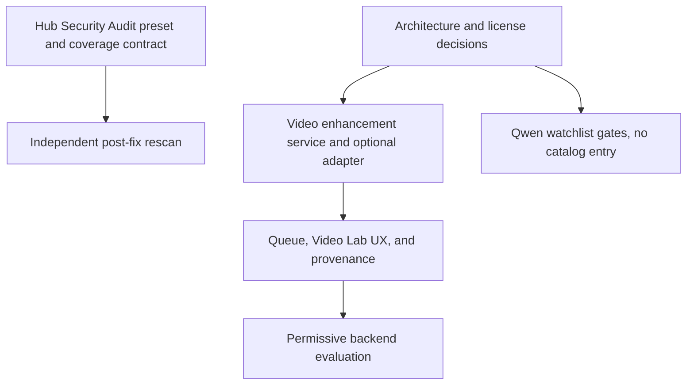

# Cross-Project Comparison: Qwen3.8-Flash-Next, Video2X, and OpenWorker

**Project**: Nexus AI Studio
**Version**: v2.3.0
**Adoption target**: v2.3.0
**Generated**: 2026-08-27
**Analyzer**: Codex `/compare`
**External sources**: [Qwen3.8-Flash-Next](https://huggingface.co/Qwen/Qwen3.8-Flash-Next), [Video2X](https://github.com/k4yt3x/video2x), [OpenWorker](https://github.com/andrewyng/openworker)
**Source types**: Three Git repositories, with official model, release, and runtime documentation
**Pre-ingest source-security verdicts**: Qwen CLEAR; Video2X CLEAR; OpenWorker PROCEED-WITH-CAUTION. See Section 6.1.

---

## Section 1: Executive Summary

The three sources produce three different decisions.

1. **Do not add Qwen3.8-Flash-Next to the Nexus installer or desktop model catalog in v2.3.0.** The name does not describe an 8B model. Current official material describes a 125B main model with 6B activated per token, plus 51B n-gram embeddings and 4B multi-token-prediction parameters, a 262,144-token native context window, and a Qwen Community License. Observed artifacts span about 105 GB through 360 GB, including 163 GB GGUF and 186 GB FP8 variants. That is outside Nexus's consumer-laptop hardware envelope, and current tool-calling/runtime evidence is not stable enough for an Agentic model badge. Track it behind admission gates instead of presenting it as installable.

2. **Add local video enhancement as an optional Video Lab post-processing workflow, but do not vendor Video2X in the first implementation.** Video2X proves that local super-resolution and frame interpolation are practical on supported Vulkan hardware. A Nexus enhancement job can offer model-compatible 2x/4x upscaling, 2x frame interpolation, progress, cancellation, preserved originals, and provenance. Upscaling can improve apparent sharpness and interpolation can improve motion smoothness, but neither recovers genuine lost detail. The workflow must warn about hallucinated texture, flicker, warping, text damage, and long processing times. Video2X is AGPL-3.0, so the first release should use a separately installed executable behind an internal adapter while licensing and a permissive native backend are evaluated.

3. **Do not integrate OpenWorker itself.** Nexus already shipped the useful governance patterns identified in the earlier OpenWorker comparison: ask inbox, scheduled runs, tool-calling verification, and per-tool MCP denial. OpenWorker v0.2.x adds cybersecurity coworkers, but Nexus Hub already has most of the underlying security skills. The remaining worthwhile work is skill-native orchestration: an explicit scanner coverage contract, a composed Security Audit preset, optional recipes for locally installed scanners, and an independent post-fix rescan. OpenWorker's SaaS connectors, OAuth relay, cloud models, and reviewer-based auto-approval remain out of scope.

**Overall recommendation**: make local video enhancement the v2.3.0 product feature, add the small Nexus Hub security-workflow refinements through the Hub's own upstream workflow, and keep Qwen3.8-Flash-Next on a documented watchlist until licensing, hardware, runtime, and tool-calling gates pass.

## Section 2: Scope and Current Nexus Baseline

This is a focused comparison. The user asked three adoption questions, so the review concentrates on project identity, runtime architecture, model/tool integration, security, testing, licensing, distribution, and developer experience rather than exhaustively comparing unrelated documentation or CI conventions.

| Dimension | Nexus baseline | Comparison relevance |
|---|---|---|
| Model catalog | Shared catalog consumed by installer and desktop settings; current Qwen entries include laptop-sized Qwen 3.5 and Qwen3-Coder variants in [`core/registry/catalog.json`](../../../../core/registry/catalog.json) | Determines whether Qwen3.8 belongs in either user-facing model list |
| Video runtime | Video Lab UI, generation queue, diffusion dispatcher, downloadable outputs, and MP4 workflow metadata already exist in [`desktop/src/modules/video/VideoLabPage.tsx`](../../../../desktop/src/modules/video/VideoLabPage.tsx), [`core/generations/GenerationQueue.ts`](../../../../core/generations/GenerationQueue.ts), and [`core/video/WorkflowMetadata.ts`](../../../../core/video/WorkflowMetadata.ts) | Provides the integration seam for an enhancement child job |
| Media tooling | FFmpeg is already provisioned cross-platform by [`scripts/installer/src/nexus_installer/engine/ffmpeg_provisioner.py`](../../../../scripts/installer/src/nexus_installer/engine/ffmpeg_provisioner.py) | Avoids adding a second media mux/probe dependency |
| Agent autonomy | Ask inbox and scheduler are implemented in [`modules/coding/autonomy/AskInbox.ts`](../../../../modules/coding/autonomy/AskInbox.ts) and [`modules/coding/autonomy/AgentRunScheduler.ts`](../../../../modules/coding/autonomy/AgentRunScheduler.ts) | Confirms earlier OpenWorker adoption already landed |
| Model verification | `toolCallingVerified` and benchmark provenance are catalog fields | Confirms earlier OpenWorker model-curation pattern already landed |
| MCP governance | Per-tool denial exists under `modules/coding/mcp/` and tightens the default-deny policy | Confirms earlier OpenWorker per-tool control already landed |
| Security knowledge | Nexus Hub has security review, dependency audit, CVE reachability, cloud posture, patching, and pre-commit skills | New OpenWorker security coworkers overlap substantially |

## Section 3: Qwen3.8-Flash-Next

### 3.1 Source profile

| Aspect | Finding |
|---|---|
| Identity | Experimental preview of architecture behind Qwen4 |
| Parameter shape | 125B main-model parameters, 6B activated per token, plus 51B n-gram embeddings and 4B multi-token-prediction parameters; runtime surfaces may report roughly 176B to 180B overall |
| Context | 262,144 tokens natively, with an advertised extension path to 1M |
| Modalities | Text and vision architecture (`qwen4_exp`) |
| Local artifacts | Approximately 360 GB BF16 and 105 GB MLX NVFP4 in the official Ollama listing |
| License | Qwen Community License 1.0, with commercial-display and separate-license clauses that may be relevant to an AI Work Assistant product |
| Maturity | Experimental preview; newly arriving runtime support and open compatibility issues |

Sources: [official model card](https://huggingface.co/Qwen/Qwen3.8-Flash-Next), [official Ollama tags](https://ollama.com/library/qwen3.8-flash-next/tags), and [Qwen license](https://huggingface.co/Qwen/Qwen3.8-Flash-Next/blob/main/LICENSE).

### 3.2 Catalog fit

The current Nexus catalog can technically express this model's metadata. It already supports total and active parameters, required RAM and VRAM, license notes, gated-license flags, minimum Ollama versions, modalities, runtime dependencies, and tool-calling verification. Schema capacity is not the blocker.

The blockers are product fit and evidence:

- The 105 GB minimum artifact is far beyond the current recommended consumer tiers and is MLX-specific rather than a normal cross-platform Ollama artifact.
- The BF16 repository requires roughly 360 GB before runtime overhead and cache allocation.
- The license includes conditions that warrant a project-specific commercial review. This report is not legal advice.
- A current llama.cpp issue reports corrupted output for a 93.7 GB quant when most layers are offloaded to GPU on a 122 GB unified-memory Jetson Thor, while CPU execution works. See [llama.cpp issue 27763](https://github.com/ggml-org/llama.cpp/issues/27763).
- A current SGLang issue reports tool-parser looping with this model family in agentic use. See [SGLang issue 36537](https://github.com/sgl-project/sglang/issues/36537).
- The Ollama tag page and upstream model repository do not present fully consistent license provenance, which must be resolved before a curated installer entry.

### 3.3 Decision

**Status: Not recommended for catalog admission in v2.3.0.** Do not add it to `core/registry/catalog.json`, the installer, desktop Settings, or any recommended tier.

Reconsider only when all gates pass:

1. The Qwen Community License is reviewed for Nexus's distribution and AI Work Assistant use.
2. The selected artifact has consistent upstream and downstream license provenance.
3. A stable cross-platform Ollama/llama.cpp artifact exists, not only MLX tags.
4. Hardware requirements are explicit and installer capability checks can truthfully enforce them.
5. Nexus's tool-calling benchmark passes without parser loops or malformed calls.
6. The entry remains experimental and opt-in, never recommended by default, until field evidence supports promotion.

## Section 4: Video2X and Local Video Enhancement

### 4.1 Source profile

Video2X 6.x is a local C/C++ video processing application. It supports image upscaling and frame interpolation with Vulkan-backed models such as Real-ESRGAN, Real-CUGAN, Anime4K, and RIFE. Version 6.4.0 adds newer RIFE models, videos-without-PTS handling, metadata copying, and Qt-frontend queue usability improvements. See the [Video2X repository](https://github.com/k4yt3x/video2x) and [release history](https://github.com/k4yt3x/video2x/releases).

The stable native release targets Windows x64 and Linux x86_64. Prebuilt binaries require AVX2 and Vulkan-capable hardware. Container instructions do not establish a native, low-friction macOS desktop integration; native macOS support remains open upstream.

### 4.2 What enhancement can and cannot do

| Operation | User-visible benefit | Limitation |
|---|---|---|
| Super-resolution | Produces a larger frame and can improve edge clarity and perceived detail | Cannot reconstruct ground truth; may invent texture, sharpen compression, damage text, or flicker across frames |
| Frame interpolation | Produces smoother motion by multiplying the source frame rate by an integer, with 2x as the v2.3.0 preset | Adds synthesized frames, not detail; fast motion and occlusion can produce ghosting or warping |
| Denoise/sharpen | Can reduce visible noise and make local generations look cleaner | Aggressive settings can erase texture or create halos |
| Combined upscale and interpolation | Produces a larger, smoother deliverable when source quality and hardware are suitable | Requires two isolated processor stages and multiplies work across every frame and pixel; offline processing can be long and memory-intensive |

The feature should therefore be described as **Enhance**, not as restoring true 4K detail. The original generated file must remain available.

### 4.3 Nexus integration design

The safest first implementation is an internal `VideoEnhancementService` with a backend-neutral contract:

- Input: a completed local video generation plus a selected enhancement preset.
- Presets: model-compatible animation upscale 2x/4x, general upscale 4x, `Smooth 2x`, and a two-stage `Upscale + Smooth` composition. Arbitrary target resolution and 48/60 fps choices are not valid tagged-CLI mappings.
- Content routing: explicit preset selection in v2.3.0. Automatic Real-ESRGAN, Real-CUGAN, Anime4K, or RIFE routing is a candidate Nexus policy that requires benchmark evidence.
- Execution: child job in the existing generation queue with progress, cancellation, timeout, resource reporting, and a capability preflight.
- Output: a new file and Video Lab message linked to the source generation; never replace the original.
- Provenance: source hash, backend/version, model, scale/target, interpolation rate, command parameters, start/end time, and outcome embedded through the existing video workflow metadata path.
- Security: canonical input/output paths, no shell-string construction, bounded temporary files, subprocess cancellation, output validation with ffprobe, and no network calls at enhancement runtime.

### 4.4 Licensing and delivery decision

Video2X is AGPL-3.0. Its component projects have mixed, often permissive licenses, and FFmpeg can be LGPL or GPL depending on its build. Nexus is MIT. Bundling, linking, or copying Video2X code therefore requires a distribution-specific license review.

**Recommended v2.3.0 path**: support a separately installed `video2x` executable through an opt-in local adapter on supported Windows/Linux hardware, with honest disabled-state copy elsewhere. Do not download or bundle Video2X automatically. In parallel, evaluate whether a permissively licensed ncnn-based Real-ESRGAN/RIFE backend can provide the required subset as an internal implementation in a later phase. This follows the MCP Registry Policy's local reverse-engineering preference and adds no service, account, credential, or runtime egress.

## Section 5: OpenWorker v0.2.x

### 5.1 Already integrated from the earlier comparison

The earlier report at [`docs/archive/v1/v1.18/comparisons/v1.18.0-comparison-openworker.md`](../../../v1/v1.18/comparisons/v1.18.0-comparison-openworker.md) recommended four local patterns. All four now have Nexus evidence:

| Earlier candidate | Current Nexus evidence | Status |
|---|---|---|
| Ask inbox | `modules/coding/autonomy/AskInbox.ts`, desktop inbox UI, ACP confirmation integration | Implemented |
| Local scheduler | `modules/coding/autonomy/AgentRunScheduler.ts`, scheduled headless runner | Implemented |
| Tool-calling verified flag | `core/registry/catalog.json` and desktop model service | Implemented |
| Per-tool MCP control | `modules/coding/mcp/McpToolDeny.ts` and MCP settings | Implemented |

OpenWorker itself is not vendored or used as a runtime dependency.

### 5.2 New OpenWorker capabilities

OpenWorker v0.2.0 added Skills, memory, reviewer-based auto-approval, guided MCP setup, reasoning levels, and three cybersecurity coworkers: Security Coworker, Dependency Audit Coworker, and Cloud Posture Coworker. Version 0.2.1 added an OpenRouter-hosted model option. See the [OpenWorker release history](https://github.com/andrewyng/openworker/releases).

The security coworkers use familiar local scanners and workflows:

- Security review: Semgrep and gitleaks, followed by triage, fixes, tests, and a pull request.
- Dependency audit: OSV-Scanner, package-manager audits, pip-audit, or Trivy, with reachability and minimal upgrades.
- Cloud posture: Trivy config and Checkov, plus read-only cloud inspection and infrastructure-as-code fixes without applying them.

### 5.3 Nexus Hub overlap and remaining gap

Nexus Hub already has `security-reviewer`, `security-review`, `dependency-security-audit`, `cve-reachability-analyzer`, `cloud-security-posture-detection`, `security-patch-advisor`, and `pre-commit-checklist`. These cover most of OpenWorker's functional surface without adopting OpenWorker.

The remaining useful gaps are orchestration and proof:

1. A Security Audit preset that composes the existing skills in a deterministic order.
2. A scanner coverage record using `RAN`, `NOT_APPLICABLE`, `UNAVAILABLE`, `FAILED`, or `DECLINED` plus the required reason. Missing tools must never disappear silently; `degraded` is an aggregate coverage result rather than a receipt state.
3. Optional Semgrep, gitleaks, OSV-Scanner, Trivy-config, and Checkov recipes in the owning skills, with no automatic installation or hidden outbound call.
4. An independent post-fix rescan and diff review so the fixer is not the only verifier.

These are Nexus Hub changes, not Nexus-AI runtime features. They should land upstream in Nexus-Hub and then arrive through the existing Hub sync/version workflow.

### 5.4 Explicit non-adoptions

- Do not adopt OpenWorker's SaaS connector catalog or cloud OAuth broker. They introduce new data processors, credentials, and outbound destinations.
- Do not add OpenRouter-hosted Ox Alpha or other cloud model breadth. It conflicts with the local-first design and the MCP Registry Policy's hard prohibition on generation-as-a-service.
- Do not adopt reviewer-based auto-approval. Nexus's tiered permissions, confirmation replay, and default-deny controls are stronger; an automatic reviewer expands the approval attack surface.
- Do not replace Nexus memory, scheduler, or MCP governance with OpenWorker equivalents. The current implementations are deeper and already integrated.

## Section 6: Security and Reverse-Engineering Assessment

### 6.1 Pre-ingest source-security scan

The security scan ran before technical source ingestion.

| Source | Verdict | Findings and handling |
|---|---|---|
| Qwen3.8-Flash-Next | CLEAR | The only instruction-like match was a model tool-call template rule. Weight files were Git LFS pointers, not opaque committed executables. Source text was treated as data. |
| Video2X | CLEAR | Destructive-pattern matches were bounded build or container cleanup. Binary files were model assets. No credential harvesting, reverse shell, or agent-directed prompt injection was found. |
| OpenWorker | PROCEED-WITH-CAUTION | Security tests and corpora intentionally contain prompt-injection and exfiltration examples, including `IGNORE ALL PREVIOUS INSTRUCTIONS` and a `printenv`/`curl` fixture targeting an invalid collector domain. These were treated as adversarial test data, never as instructions. Broad connector and self-update surfaces were flagged for the post-ingest risk assessment. |

No source installer, build script, model, or executable was run.

### 6.2 Threat-model delta

| Candidate | Runtime dependencies | Outbound destinations | Credentials | Data leaves machine | Commercial relationship |
|---|---|---|---|---|---|
| Qwen catalog entry | Ollama/llama.cpp plus 105-360 GB model artifact | Model download only | None for public weights | No after download | Qwen license review may be required for commercial AI Work Assistant use |
| Video enhancement adapter | User-installed Video2X executable and local model assets; Vulkan/AVX2 on supported platforms | Download/install is user-controlled; enhancement runtime is local | None | No | None at runtime; AGPL distribution review if bundled |
| Hub security preset | Existing skills plus optional locally installed scanners | Scanner databases may update when the user invokes their normal update behavior | None required by the skill itself | Source stays local unless an individual scanner is configured otherwise | None |
| Rejected OpenWorker connectors/models | Connector runtimes and hosted models | Many SaaS and model providers | OAuth tokens and API keys | Yes | Yes |

### 6.3 Per-item risk scorecard

| ID | Candidate | Risk | Rationale |
|---|---|---|---|
| OW-S1 | Security Audit preset and scanner coverage contract | Low | Skill-native composition over existing local capabilities; failure mode is incomplete or misleading coverage reporting |
| OW-S2 | Independent post-fix rescan | Low | Adds verification, no runtime dependency |
| V-1 | Backend-neutral video enhancement contract and local adapter | Medium | New local process execution, untrusted media parsing, output-path handling, GPU/CPU resource pressure, and AGPL boundary |
| V-2 | Video Lab enhance UX, queue child jobs, and provenance | Medium | Cross-cutting user-facing workflow with cancellation, persistence, and large artifact handling |
| V-3 | Permissive native backend evaluation | Medium | New native/runtime dependency and packaging surface; decision must precede bundling |
| Q-1 | Qwen3.8 catalog admission now | High | License uncertainty, extreme hardware demand, platform-specific artifacts, and unstable agentic runtime evidence |

### 6.4 Reverse-engineering viability

| ID | Classification | Internal deliverable | Effort | Policy rationale |
|---|---|---|---|---|
| OW-S1 | skill-native | Nexus Hub Security Audit preset plus closed-vocabulary scanner receipts and aggregate degraded coverage | Low-Medium | The agent can orchestrate existing local skills and scanners; no MCP or service is justified |
| OW-S2 | skill-native | Independent rescan/review gate after remediation | Low | Prompt/workflow composition over existing tools |
| V-1 | re-partial | Internal service and adapter contract calling a separately installed local executable | Medium | Local value ships without copying AGPL code or adding a service |
| V-2 | re-full | Queue integration, Video Lab UI, output preservation, and provenance | Medium-High | Pure Nexus logic built on existing generation infrastructure |
| V-3 | re-partial | Smallest permissive Real-ESRGAN/RIFE-compatible native backend that passes a license and packaging review | High | Reverse engineer the required local behavior, not Video2X's codebase |
| Q-1 | drop-outright for v2.3.0 | No catalog entry; retain documented admission gates | None | The current trust, hardware, and compatibility cost exceeds user value |
| OW-N1 | drop-outright | SaaS connectors, OAuth broker, cloud models, and reviewer auto-approval | None | Conflicts with local-first policy and introduces avoidable outbound trust |

## Section 7: Prioritized Adoption Plan

P-tier applies within the reverse-engineering buckets.

### Bucket 1: Skill-native

| Priority | Item | Target | Effort | Dependency | Risk |
|---|---|---|---|---|---|
| P1 | OW-S1 Security Audit preset and scanner coverage contract | Nexus-Hub `catalog/agents/security-reviewer.md`, security skills, and preset/bundle metadata | Low-Medium | None | Low |
| P1 | OW-S2 independent post-fix rescan and diff review | Nexus-Hub security workflow | Low | OW-S1 | Low |

### Bucket 2: Reverse-engineered local builds

| Priority | Item | Target | Effort | Dependency | Risk |
|---|---|---|---|---|---|
| P1 | V-1 enhancement contract, capability probe, and optional Video2X adapter | `core/video/`, `desktop/sidecar/src/video/` | Medium | License boundary decision | Medium |
| P1 | V-2 queue child jobs, Video Lab Enhance actions, preserved originals, and provenance | `core/generations/`, `desktop/src/modules/video/`, `core/video/WorkflowMetadata.ts` | Medium-High | V-1 | Medium |
| P2 | V-3 permissive native backend evaluation | `runtimes/video-enhancement/` or rejected decision record | High | V-1 benchmarks and license review | Medium |

### Bucket 3: Vendor-intrinsic

None. Every recommended capability has a local path.

### Bucket 4: Drop outright for this release

- Q-1 Qwen3.8-Flash-Next catalog admission.
- OpenWorker SaaS connectors and OAuth broker.
- OpenWorker cloud/OpenRouter model options.
- OpenWorker reviewer-based auto-approval.
- Automatic Video2X download or bundling before AGPL distribution review.

## Section 8: Implementation Sequence

Recommended release sequencing:

1. Lock the license/platform/backend boundary and Qwen non-admission gates.
2. Land the Nexus Hub security workflow upstream, then consume it through the existing Hub version sync.
3. Build the backend-neutral enhancement core and optional local adapter.
4. Add Video Lab actions, queue semantics, progress/cancel, output preservation, and provenance.
5. Benchmark representative 480p/720p AI-generated clips on supported hardware and decide whether a permissive native backend is justified.
6. Finish with architecture, known-gaps, living-docs, CI/CD, and independent Goal-vs-codebase reconciliation.

## Section 9: Acceptance Criteria for the Seeded Plan

- No Qwen3.8-Flash-Next entry appears in the installer or desktop catalog unless every documented admission gate is independently satisfied.
- A completed Video Lab generation exposes an optional Enhance action only when a supported backend is detected.
- Users can choose upscale, interpolation, or both; the UI explains that the result is synthesized enhancement, not recovered source detail.
- The original file remains intact and downloadable.
- Enhancement is a cancellable child job with progress and typed unsupported/failed outcomes.
- The enhanced output has validated media metadata and Nexus provenance linking it to the source generation.
- Unsupported hardware or platforms fail closed with actionable setup copy and no hidden download.
- Nexus Hub's security workflow reports each scanner as `RAN`, `NOT_APPLICABLE`, `UNAVAILABLE`, `FAILED`, or `DECLINED`, derives aggregate degraded coverage, and performs an independent post-fix rescan.
- No new SaaS, cloud-model, search-as-a-service, scraping-as-a-service, embeddings-as-a-service, or generation-as-a-service dependency is introduced.

## Section 10: Residual Risks and Decisions Required During Implementation

1. **Video2X licensing**: legal/distribution review is required before any binary bundling or linked integration. The adapter-only path avoids deciding that question by accident.
2. **Platform coverage**: Windows/Linux can use the Video2X path first; macOS needs an explicit supported-backend decision and must not be silently advertised.
3. **Performance envelope**: no real-time promise. Benchmarks must record source resolution/fps, output resolution/fps, GPU, VRAM, duration, peak memory, and failure mode.
4. **Quality regressions**: faces, text, animation edges, fast motion, and repeated textures need visual fixtures because pixel-level success does not prove perceptual quality.
5. **Cross-repository ownership**: Nexus Hub skill changes should be planned and committed in Nexus-Hub, then consumed by Nexus-AI through the normal versioned sync. The Nexus-AI release plan must not pretend one repository commit owns both histories.
6. **Qwen watchlist staleness**: runtime and license evidence can change quickly. Re-evaluate from official sources when a cross-platform artifact and stable tool-calling evidence exist.

## Appendix A: Source Facts and Provenance

### Qwen3.8-Flash-Next

- Official model repository and architecture: https://huggingface.co/Qwen/Qwen3.8-Flash-Next
- Official license: https://huggingface.co/Qwen/Qwen3.8-Flash-Next/blob/main/LICENSE
- Ollama artifact tags: https://ollama.com/library/qwen3.8-flash-next/tags
- Runtime issue evidence: https://github.com/ggml-org/llama.cpp/issues/27763
- Tool-parser issue evidence: https://github.com/sgl-project/sglang/issues/36537

### Video2X

- Repository, documentation, license, and supported algorithms: https://github.com/k4yt3x/video2x
- Release history: https://github.com/k4yt3x/video2x/releases
- Stable compatibility revision: tag `6.4.0`, commit `a96bda9b4d79616cc6b71b94e6945146b5b4d509`; unreleased revision `7db9c18` was research evidence only

### OpenWorker

- Repository and MIT license: https://github.com/andrewyng/openworker
- v0.2.x release notes: https://github.com/andrewyng/openworker/releases
- Prior Nexus comparison: [`docs/archive/v1/v1.18/comparisons/v1.18.0-comparison-openworker.md`](../../../v1/v1.18/comparisons/v1.18.0-comparison-openworker.md)

## Appendix B: Handoff

This comparison is intended to seed `/plan from-comparison docs/archive/v2/v2.3/comparisons/v2.3.0-comparison-qwen-video2x-openworker.md` with `reverse-engineer-first=true`.
