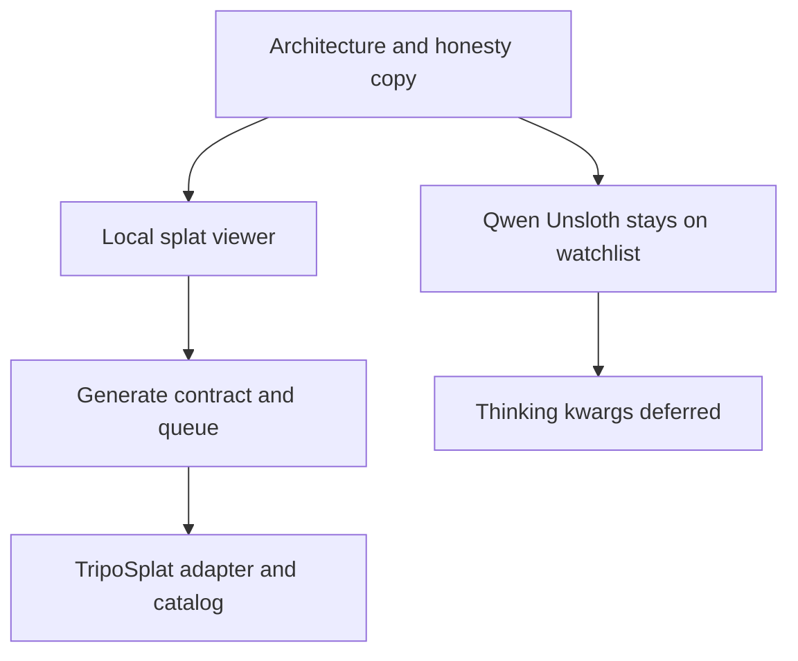

# Cross-Project Comparison: Unsloth Qwen3.8-Flash-Next GGUF and 3D AI Studio Gaussian Splatting

**Project**: Nexus AI Studio
**Version**: v2.4.0
**Adoption target**: v2.4.0
**Generated**: 2026-08-28
**Analyzer**: Cursor `/compare` (cross-project-comparison skill)
**External sources**: [Unsloth Qwen3.8-Flash-Next run guide](https://unsloth.ai/docs/models/qwen3.8-next), [unsloth/Qwen3.8-Flash-Next-GGUF](https://huggingface.co/unsloth/Qwen3.8-Flash-Next-GGUF), [3D AI Studio Gaussian Splatting](https://www.3daistudio.com/Tools/GaussianSplatting)
**Source types**: Two documentation / product pages (article mode) plus one Hugging Face model repository treated as a model-card inventory (GGUF weights were not cloned)
**Pre-ingest source-security verdicts**: Unsloth docs PROCEED-WITH-CAUTION; Unsloth GGUF card CLEAR; 3D AI Studio page CLEAR. See Section 6.1.
**Slotting reason**: v2.3.0 is in flight under [`docs/archive/v2/v2.3/plans/v2.3.0-adoption-qwen-video2x-openworker.md`](../../v2.3/plans/v2.3.0-adoption-qwen-video2x-openworker.md) and already rejects Qwen3.8-Flash-Next catalog admission. No `docs/archive/v2/v2.4/plans/` directory existed at authoring time, so v2.4.0 is the first free slot. Highest-value new work is local Image Studio Gaussian Splatting, which does not fit the v2.3.0 video-enhancement plan. Re-slot if a different target is preferred.

This report is a delta against the v2.3.0 Qwen decision, not a replacement of it. Official Qwen artifacts remain rejected in [`docs/archive/v2/v2.3/development/model-admission-qwen38.md`](../../v2.3/development/model-admission-qwen38.md). The question here is whether Unsloth's quantized GGUF and thinking-control docs change that outcome, and whether 3D AI Studio's Gaussian Splatting tool can be reverse-engineered into Image Studio.

---

## Section 1: Executive Summary

The two sources produce two different decisions.

1. **Do not add Unsloth's Qwen3.8-Flash-Next GGUF to the Nexus installer or Settings model list in v2.4.0.** Unsloth does ship a real local path: Dynamic 3.0 GGUFs from 72.5 GB (UD-IQ1_S) through 354 GB (BF16), llama.cpp / `unsloth run` recipes, a vision mmproj, and chat-template knobs for `enable_thinking`, `preserve_thinking`, and `reasoning_effort`. That does not make the model a laptop catalog entry. Unsloth's own table still requires 75 GB RAM or unified memory for the smallest quant (96 GB recommended). The Hugging Face card declares `qwen-community-1.0` and points `license_link` at `LICENSE`, but the published file list has no `LICENSE` file. Qwen Community License 1.0 still needs a project-specific review for an AI Work Assistant product. The architecture is `qwen4exp`, which is days old in llama.cpp, with open GPU-corruption and tool-parser issues recorded in the v2.3.0 admission record. Unsloth Desktop (Think / Preserved Thinking toggles, web search, hosted-style UX) is a competing app, not a Nexus dependency. Thinking-control plumbing can wait until a Qwen thinking model actually clears admission.

2. **Do not wrap 3D AI Studio. Do reverse-engineer a local, honest subset of the user-visible workflow into Image Studio.** The page at [3daistudio.com/Tools/GaussianSplatting](https://www.3daistudio.com/Tools/GaussianSplatting) is a hosted generator: upload one photo, wait about four minutes on their servers, preview in a browser, download a `.splat`. That is generation-as-a-service and is a hard no under the MCP Registry Policy. Their live samples (Bonsai, Kitchen, Bicycle, Garden) are Mip-NeRF360 multi-view captures, not one-photo tours. A single image cannot become a photorealistic property walkthrough without inventing unseen geometry. The local path that *is* adoptable: a WebGL splat viewer in Image Studio (orbit, screenshot, export), plus an optional NVIDIA-CUDA feed-forward generator using MIT-licensed [TripoSplat](https://github.com/VAST-AI-Research/TripoSplat) weights behind an internal adapter, with copy that says object-level 3D preview, not recovered architecture. Multi-view COLMAP + 3DGS "property tours from a phone" stay a later candidate, not v2.4.0.

**Overall recommendation**: keep Qwen3.8-Flash-Next on the existing admission watchlist (Unsloth GGUF does not flip any of the six gates). Make local Gaussian Splatting the v2.4.0 Image Studio feature: viewer first, then optional local single-image generation on supported NVIDIA hardware, never 3D AI Studio's API.

## Section 2: Scope and Current Nexus Baseline

This is a focused comparison. The user asked two adoption questions, so the review concentrates on catalog/installer identity, thinking-control harnesses, Image Studio generation, licensing, and local-first policy rather than an 11-dimension repo audit.

| Dimension | Nexus baseline | Comparison relevance |
|---|---|---|
| Model catalog | Shared [`core/registry/catalog.json`](../../../../core/registry/catalog.json) consumed by the installer wizard and desktop Settings. Current Qwen entries are laptop-sized Qwen 3.5 4B/9B and Qwen3-Coder 30B-A3B. The only ~75 GB Unsloth GGUF already listed is opt-in Inkling-Small (`patient-tier`, Apache-2.0, never a `recommended.json` default). | Decides whether Unsloth Qwen3.8-Flash-Next can follow the Inkling pattern |
| Hardware envelope | Product identity is a laptop with one consumer GPU. Patient-tier RAM presets in [`core/registry/patientTier.ts`](../../../../core/registry/patientTier.ts) are copy for disk-offload MoE (laptop peak RSS 8.24 GB), not a 75 GB unified-memory floor | Unsloth's 75 GB RAM table is a different contract than Inkling's 8 GB RSS offload story |
| Thinking controls | `/thinking-mode` presets `nothink` / `think` / `think-max` in [`modules/coding/config/SamplerPresets.ts`](../../../../modules/coding/config/SamplerPresets.ts); Qwen `<think>` format is already named; harness profiles exist in [`modules/coding/orchestration/HarnessSelector.ts`](../../../../modules/coding/orchestration/HarnessSelector.ts) | Maps Unsloth/Qwen `enable_thinking`, `preserve_thinking`, `reasoning_effort` without Unsloth Desktop |
| Unsloth today | Installer checkbox and Settings Fine-tuning provision Unsloth Core for QLoRA only (`scripts/installer/.../unsloth_venv_provisioner.py`). Studio/CLI extras are forbidden. v2.1.0 already dropped bundling Unsloth Desktop | Using Unsloth GGUF as catalog *data* is allowed; shipping Unsloth Desktop is not |
| Image Studio | Chat-first 2D diffusion: txt2img / img2img / inpaint / outpaint, SAM2 replace-the-X, queue, PNG workflow metadata, recall actions in [`desktop/src/modules/image/ImageStudioPage.tsx`](../../../../desktop/src/modules/image/ImageStudioPage.tsx) | No 3D representation, no splat viewer, no reconstruction job |
| Prior Qwen decision | [`docs/archive/v2/v2.3/comparisons/v2.3.0-comparison-qwen-video2x-openworker.md`](../../v2.3/comparisons/v2.3.0-comparison-qwen-video2x-openworker.md) and [`docs/archive/v2/v2.3/development/model-admission-qwen38.md`](../../v2.3/development/model-admission-qwen38.md) | Unsloth is a new artifact, not a new model family |

## Section 3: Unsloth Qwen3.8-Flash-Next

### 3.1 Source profile

| Aspect | Finding |
|---|---|
| Identity | Third-party Dynamic 3.0 GGUF conversion of official `Qwen/Qwen3.8-Flash-Next`, architecture `qwen4exp` |
| Parameter shape | 125B main-model parameters, 6B activated per token, plus 51B n-gram embeddings and 4B MTP; HF GGUF metadata reports ~177B params |
| Context | 262,144 tokens in the GGUF `context_length` field |
| Modalities | Card is `image-text-to-text`. Unsloth publishes `mmproj-F16.gguf` and `mmproj-BF16.gguf`. Nexus has not verified GGUF vision end-to-end |
| Smallest artifact | UD-IQ1_S 72.5 GB (3 shards). UD-IQ1_M 74.5 GB. UD-Q4_K_XL 111.3 GB (4 shards). BF16 354 GB |
| Unsloth RAM table | 1-bit 75 GB, 2-bit 79 GB, 3-bit 90 GB, 4-bit 112 GB, 5-bit 200 GB, 8-bit 270 GB, BF16 355 GB (RAM + VRAM or unified memory). "Best to have a 96GB RAM/unified memory device" |
| Thinking controls | Hybrid thinking model. Defaults: thinking `temperature=1.0 / top_p=0.95 / top_k=20`; instruct `temperature=0.7 / top_p=0.80 / presence_penalty=1.5`. Chat-template kwargs: `enable_thinking`, `preserve_thinking`, `reasoning_effort` in {`xhigh` (default), `medium`, `low`}. Unsloth Desktop exposes Think and Preserved Thinking toggles. llama.cpp path: `--chat-template-kwargs '{"reasoning_effort":"medium"}'` |
| Quant quality (Unsloth KLD) | UD-IQ1_S 80.2% same-top-1%; UD-Q4_K_XL 93.5%. N-gram / PLE layers stay at least 4-bit because of random access |
| License metadata | `license: other`, `license_name: qwen-community-1.0`, `license_link: LICENSE`. Hugging Face siblings list has README, GGUF shards, imatrix, and mmproj files. **No `LICENSE` file is published in the repo file list** (raw `LICENSE` fetch returned 404) |
| Runtime | Unsloth documents llama.cpp from source plus `unsloth run --model unsloth/Qwen3.8-Flash-Next-GGUF:UD-Q4_K_XL`. Unsloth Desktop is a separate product (search, tools, train, generate media) |
| Maturity | Card last modified 2026-08-28. Base model released 2026-08-26. llama.cpp `qwen4exp` support is new (see v2.3.0 admission record) |

Sources: [Unsloth run guide](https://unsloth.ai/docs/models/qwen3.8-next), [HF model card](https://huggingface.co/unsloth/Qwen3.8-Flash-Next-GGUF), HF API `GET /api/models/unsloth/Qwen3.8-Flash-Next-GGUF` (sha `c8b5954a88c2775c546b92593eda40ea041d3176`).

### 3.2 Insight classification

| ID | Insight | Status in Nexus |
|---|---|---|
| U1 | Quantized GGUF exists and is smaller than official BF16 / FP8 / Q8 | Missing from catalog. Disk size now overlaps Inkling-Small (74.8 GB), but Unsloth's *runtime* RAM floor is 75 GB, not Inkling's measured 8.24 GB peak RSS |
| U2 | Hardware table with per-quant RAM+VRAM totals | Partial. Catalog can store `requiredRamGB` / `vramGB`. Nexus has no measured matrix for this artifact, and installer capability checks cannot truthfully enforce Unsloth's 75 GB claim without local measurement |
| U3 | `enable_thinking` / `preserve_thinking` / `reasoning_effort` via chat template | Partial. Nexus has `nothink`/`think`/`think-max` sampler presets and a `qwen-chat-template` hint. It does not pass Ollama/llama.cpp `chat_template_kwargs`, does not model `preserve_thinking`, and does not expose xhigh/medium/low |
| U4 | Unsloth Desktop thinking toggles, auto sampler, RAM offload, web search, code execution | N/A as a product. Unsloth Desktop was dropped in the v2.1.0 comparison (competitor UI; AGPL-risk extras). Fine-tuning already uses Unsloth Core only |
| U5 | llama.cpp / `unsloth run` as the local inference path | Partial. Nexus serves via Ollama and optional local adapters. `qwen4exp` is not a pinned, cross-platform Ollama release contract in this repo |
| U6 | Vision mmproj alongside text GGUF | Missing. Catalog vision matcher in [`modules/coding/config/ModelCapabilities.ts`](../../../../modules/coding/config/ModelCapabilities.ts) only lists Gemma 4 and Qwen 3.5. GGUF multimodal for this architecture is unverified (same class of gap as Inkling's projector DF) |
| U7 | Qwen Community License on the Unsloth conversion | Partial / blocking. Inkling-Small was admitted only after first-party Apache-2.0 verification. This conversion inherits Qwen Community License 1.0 and does not even ship the license text in-repo |

### 3.3 Catalog fit

Schema capacity is still not the blocker. The catalog already expresses Unsloth GGUF lines, SHA-256 shards, `requiredRamGB`, patient-tier tags, `toolCallingVerified`, modalities, and license notes.

What Unsloth changes relative to the v2.3.0 official-artifact review:

- Smallest *disk* artifact falls from ~105 GB (Ollama MLX NVFP4) / 163 GB (ggml Q8) to 72.5 GB GGUF.
- A vendor RAM table now exists (Gate 4 had "no published consumer RAM/VRAM minimum"). It is Unsloth-claimed, not Nexus-measured, and the number is 75 GB, which is workstation / Mac Studio / DGX Spark class, not the laptop GPU envelope.
- Thinking controls are in the GGUF chat template, so they do not require Unsloth Desktop.
- Provenance is worse on one axis: Unsloth points at `LICENSE` but does not publish that file. Official Qwen still hosts the license text.

What Unsloth does not change:

- The model is still not an 8B-class "Qwen3.8" despite the name.
- License family is still Qwen Community License 1.0. Community summaries of that license describe a separate-license clause for coding / office-assistant products. This report is not legal advice; Gate 1 remains unresolved.
- llama.cpp GPU corruption, native-context aborts, and SGLang tool-parser looping from the v2.3.0 record are not shown to be fixed for this Unsloth quant.
- Nexus tool-calling benchmark has not been run on UD-IQ1_S or UD-Q4_K_XL.
- Inkling-Small is not a precedent for admission. Inkling is Apache-2.0, patient-tier with an honest 8 GB RSS offload story, and `task: chat`. Flash-Next's Unsloth guide says n-gram / PLE layers resist aggressive quant and want tens of gigabytes of fast memory.

### 3.4 Decision

**Status: Not recommended for catalog, installer, or Settings admission in v2.4.0.** Do not add `unsloth/Qwen3.8-Flash-Next-GGUF` to [`core/registry/catalog.json`](../../../../core/registry/catalog.json), the installer picker, desktop Settings Models, or any recommended tier, including `patient-tier`.

Keep the six v2.3.0 gates. Unsloth-specific addenda:

| Gate | Unsloth delta | v2.4.0 result |
|---|---|---|
| 1. Project-specific license review | Same Qwen Community License 1.0; Unsloth does not replace it | Fail: unresolved |
| 2. Consistent artifact-license provenance | Card says `qwen-community-1.0` and `license_link: LICENSE`; published siblings omit `LICENSE` | Fail: inconsistent |
| 3. Stable released cross-platform runtime | Still `qwen4exp`; Unsloth tells users to build latest llama.cpp or use Unsloth Desktop | Fail: newly available, not a Nexus-pinned Ollama contract |
| 4. Explicit enforceable hardware requirements | Unsloth publishes 75 GB+ RAM. That is explicit and also outside the laptop ceiling. Not Nexus-measured | Fail: not proven for installer enforcement; product-unfit even if copied verbatim |
| 5. Nexus tool-calling benchmark | Not run on Unsloth GGUF + Nexus parser | Fail: not run |
| 6. Experimental opt-in policy | Could be satisfied in form; cannot override gates 1-5 | Policy-satisfiable; evidence absent |

If a future cycle reopens this, the only honest catalog shape is workstation-class experimental opt-in with Unsloth's RAM table printed as vendor claim, SHA-256 pins on every GGUF shard, a copied first-party Qwen license URL, `toolCallingVerified` after a local pass, and no default recommendation. That is still not v2.4.0 work.

Adjacent watch only (not an adoption item): Qwen3.8-27B is a different, dense model that community guides place near 17 GB GGUF / 24 GB GPU. It is not Flash-Next and needs its own comparison before any catalog row.

## Section 4: 3D AI Studio Gaussian Splatting

### 4.1 Source profile

[3D AI Studio's Gaussian Splatting page](https://www.3daistudio.com/Tools/GaussianSplatting) markets a four-step cloud workflow: upload one image, generate with their model (~4 minutes), preview live in the browser, download `.splat`. The viewer is free without sign-up. The generator gives new users free credits. The company also sells Image to 3D mesh, Text to 3D, and a node canvas named Flow.

The page mixes three different capabilities:

1. **Hosted single-image generation** (their product): one photo, AI reconstructs a Gaussian field on their servers.
2. **Browser viewer** of existing `.splat` files, including Mip-NeRF360 samples (Bonsai ~35 MB through Garden ~134 MB).
3. **Classic multi-view 3DGS** (mentioned in the FAQ): many photos, Structure-from-Motion, optimization. This is how real property captures work. It is not what their "from one image" generator does.

They correctly state that a splat is not an editable mesh. Production assets should be meshes. Splats win at photoreal real-time viewing.

### 4.2 Insight classification

| ID | Insight | Status in Nexus |
|---|---|---|
| G1 | Upload a photo and get a downloadable `.splat` | Missing. Image Studio emits PNG/JPEG diffusion outputs, not Gaussian fields |
| G2 | In-app orbit / zoom / pan viewer at interactive framerate | Missing. Studio history and recall are 2D |
| G3 | Export `.splat` / `.ply` / related formats | Missing |
| G4 | "Photorealistic property tours from regular photos" | N/A as advertised. One image cannot recover a walkable building. Multi-view reconstruction is a different pipeline (COLMAP + 3DGS), hours-class, CUDA-heavy |
| G5 | Hosted credits, accounts, ~4 min cloud generate | N/A. MCP Registry Policy hard-no: generation-as-a-service |
| G6 | Educational comparison of splat vs mesh vs NeRF | Already as knowledge. No product gap |
| G7 | Free viewer with drag-and-drop `.splat` | Missing as UI; reverse-engineerable without their site |

### 4.3 What can actually be reverse-engineered

3D AI Studio's generator weights and server are not published. Reverse-engineering *that tool* into Nexus would mean cloning a proprietary cloud model. That is neither viable nor allowed.

The user-visible workflow is reverse-engineerable from open research and MIT-licensed software:

| Layer | Local building block | License / hardware (vendor-claimed; not proven in this repo) | Nexus seam |
|---|---|---|---|
| Viewer | WebGL Gaussian rasterizer (SparkJS / SuperSplat-class algorithm; implement internally, do not vendor their SaaS) | Typically MIT/Apache viewers exist | New Image Studio message type + orbit canvas |
| Single-image generate | [TripoSplat](https://github.com/VAST-AI-Research/TripoSplat) inference (~2k LOC, numpy/safetensors/pillow/tqdm + local PyTorch) and [VAST-AI/TripoSplat](https://huggingface.co/VAST-AI/TripoSplat) weights | MIT code and weights. Community reports ~8 GB NVIDIA CUDA VRAM; upstream demo hardcodes `cuda` | Optional runtime under `runtimes/` or a Video2X-style separately installed adapter; catalog row; generation-queue child job |
| Multi-view reconstruction | OpenSplat / gsplat + COLMAP (or equivalent) | Mixed; original INRIA 3DGS is often research-restricted. Prefer permissive trainers | Deferred. This is "property tour from a phone capture", not Image Studio's current chat generate |

TripoSplat is object-level feed-forward generation with a controllable Gaussian count (up to 262,144). It hallucinates the back of the object. That matches "turn this product photo into something I can orbit". It does not match Zillow SkyTours.

Apple SHARP is a strong single-image *scene* synthesizer but ships under a non-commercial research license. Drop for product use.

### 4.4 Nexus integration design

v2.4.0 should describe the feature as **3D preview**, never as restoring a real interior.

Recommended first implementation:

- Input: an Image Studio generation or user-uploaded still, plus an explicit "Preview in 3D" action.
- Execution: child job on the existing generation queue with progress, cancellation, timeout, and a CUDA/Vulkan capability preflight.
- Backend: internal `GaussianSplatService` with a backend-neutral contract. First generator adapter: local TripoSplat weights, no ComfyUI, no 3D AI Studio HTTP.
- Output: `.ply` or `.splat` stored next to the source PNG, never replacing it. Provenance: source hash, backend/version, Gaussian count, seed, duration (extend [`core/image/WorkflowMetadata.ts`](../../../../core/image/WorkflowMetadata.ts)).
- Viewer: Nexus-owned WebGL canvas (orbit, zoom, screenshot, fullscreen). Fail closed on unsupported GPUs with a still-frame fallback.
- Copy: "This is a generated 3D preview. Unseen sides are invented. It is not a measured property tour."
- Security: canonical paths, no shell-string construction, no runtime network, bounded temp files, no upload of user photos off-machine.

Phase 2 (not this comparison's P0): multi-view capture import for actual walkthroughs, only after a permissive trainer and a Windows/Linux/macOS hardware story exist. macOS without CUDA must stay honestly disabled for generation even if the viewer works.

## Section 5: Gap Analysis Summary

### 5a. Strengths to preserve

- Hardware-aware catalog that refuses to list models it cannot describe honestly ([`catalog.json`](../../../../core/registry/catalog.json), installer picker).
- Unsloth used only as QLoRA Core, never as a second desktop shell.
- Image Studio chat UX, queue, SAM2, and PNG provenance.
- Local-first ban on generation-as-a-service (README / MCP Registry Policy).
- Existing Qwen thinking sampler presets, so future Qwen kwargs can land in one harness without a new product surface.

### 5b. Structural gaps these sources actually open

1. **No 3D preview path in Image Studio** (G1-G3, G7). This is the only high-value product gap.
2. **No `chat_template_kwargs` bridge** (U3). Real, but worthless until a Qwen thinking model is admitted.
3. **No workstation-class Qwen4-exp catalog row** (U1). Intentional, not a defect.

## Section 6: Security and Reverse-Engineering Assessment

*This section is MANDATORY per the compare-project skill (Steps 1.5 and 5) and the MCP Registry Policy (local-only > LLM-native skill > reverse-engineered internal module > trusted-vendor wrapper > drop). Hard no: search / embeddings / scraping / generation as a service; no outbound calls without explicit user opt-in; no telemetry by default.*

### 6.1 Pre-ingest source-security scan (Step 1.5)

The scan ran on fetched page text and Hugging Face API metadata before those materials were used as adoption evidence. No installer, GGUF, CUDA kernel, or 3D AI Studio WASM viewer was executed. The Unsloth GitBook `ask` endpoint was not called.

| Source | Verdict | Findings and handling |
|---|---|---|
| unsloth.ai/docs/models/qwen3.8-next | PROCEED-WITH-CAUTION | GitBook "Agent Instructions" tell agents to `GET` the same URL with `?ask=` / `&goal=` against `unsloth.ai`. Same class of finding as v2.1.0 Unsloth docs. Treated as data. Endpoint not queried. Page also documents `curl ... \| sh` and PowerShell `irm \| iex` for Unsloth Desktop install; those are their product installers, not instructions for this agent. Pipe-to-shell was not executed |
| huggingface.co/unsloth/Qwen3.8-Flash-Next-GGUF | CLEAR | Model card, YAML license metadata, and GGUF chat template. Chat template is a Jinja data file (thinking/tool formatting), not agent-directed instructions. Weight files were listed as filenames only; shards were not downloaded |
| 3daistudio.com/Tools/GaussianSplatting | CLEAR | Marketing HTML. No ignore-previous-instructions payload, no hidden agent block, no credential harvest. Commercial generate/credits copy only |

No BLOCK verdict. Ingestion proceeded with Unsloth docs quoted as data only.

### 6.2 Threat-model comparison

| Vector | Nexus today | If the adoption plan below is executed |
|---|---|---|
| New runtime dependencies | Ollama, diffusion sidecar, optional Unsloth Core (fine-tune), optional Video2X adapter | + optional local Gaussian generator (PyTorch + TripoSplat weights) and a WebGL viewer. No 3D AI Studio client. No Unsloth Desktop. No Qwen3.8 catalog runtime |
| Outbound destinations | Opt-in Hugging Face weight pulls at install | One more opt-in HF pull (`VAST-AI/TripoSplat`) if the generator ships. No generate API, no credits, no account |
| Credentials | Loopback gateway token; existing gated-HF token flow | None added. TripoSplat is ungated MIT |
| Data leaving the machine | None without opt-in | User photos stay local. Explicitly rejected: upload to 3daistudio.com |
| Commercial relationships | None | None. MIT weights. Qwen3.8 remains unlistable partly because a commercial-license review is unfinished |

### 6.3 Per-item risk scorecard

| ID | Candidate | Risk | Rationale |
|---|---|---|---|
| Q-1 | Unsloth Qwen3.8-Flash-Next catalog / installer / Settings row | High | License gap, missing LICENSE file, 75 GB RAM floor, unstable `qwen4exp`, unverified tools and vision |
| Q-2 | Map `reasoning_effort` / `preserve_thinking` into SamplerPresets + Ollama kwargs | Low | Local harness work; only useful after Q-1 or another Qwen thinking admission |
| Q-3 | Bundle Unsloth Desktop as the way to "get thinking controls" | High | Competitor shell, extra install surface, previously dropped |
| G-V | Internal WebGL splat viewer + export | Medium | New GPU canvas, large binary assets, XSS if remote URLs were allowed (they must not be) |
| G-G | Local TripoSplat adapter + catalog weights + queue job | Medium | New Python/CUDA runtime, untrusted image decode, VRAM contention with diffusion, NVIDIA-only honesty |
| G-M | Multi-view COLMAP property-tour pipeline | High | Heavy native stack, mixed licenses, hours-class jobs, far outside current Image Studio |
| G-S | 3D AI Studio HTTP generate / credits | High | Generation-as-a-service; photos leave the machine |

### 6.4 Reverse-engineering viability

| ID | Classification | Internal deliverable | Effort | Policy rationale |
|---|---|---|---|---|
| Q-1 | drop-outright for v2.4.0 | Update the Qwen admission watchlist with Unsloth artifact facts; no catalog row | None | Trust, license, and hardware cost still exceed user value. MCP Registry Policy: local-only weight download is allowed in principle (Inkling), but this artifact fails Gates 1-5 |
| Q-2 | re-full (deferred) | `chat_template_kwargs` + reasoning-effort enum on the Qwen harness | Medium | Build the local control, not Unsloth Desktop. Defer until a model that honors the template is admitted |
| Q-3 | drop-outright | None | None | Vendor UI; AGPL-risk extras; duplicates Nexus |
| G-V | re-full | Nexus-owned splat viewer in Image Studio | Medium | Viewer algorithms are public; do not embed 3D AI Studio. MCP Registry Policy bucket: reverse-engineered internal module |
| G-G | re-partial first, re-full inference wrapper | Backend-neutral `GaussianSplatService` calling local MIT TripoSplat weights (adapter, not ComfyUI, not their cloud) | Medium-High | Weights are vendor-intrinsic and MIT (justified, like SANA). Runtime logic is small enough to wrap internally. Policy: local-only weight download, no service |
| G-M | drop-outright for v2.4.0 (watch) | Later permissive reconstruction spike | High | Different product; license and OS-parity unproven |
| G-S | drop-outright | None | None | MCP Registry Policy hard-no: generation-as-a-service |

## Section 7: Prioritized Adoption Plan

P-tier applies within reverse-engineering buckets.

### Bucket 1: Skill-native

None. Gaussian Splatting is not a prompt. Qwen thinking kwargs are runtime protocol, not a Hub skill.

### Bucket 2: Reverse-engineered local builds

| Priority | Item | Target | Effort | Dependency | Risk |
|---|---|---|---|---|---|
| P0 | G-V Image Studio splat viewer (local files only), screenshot, download, source-linked provenance | `desktop/src/modules/image/`, `core/image/WorkflowMetadata.ts` | Medium | None | Medium |
| P1 | G-G backend-neutral generate contract, CUDA preflight, queue child job, fail-closed macOS/no-NVIDIA copy | `core/image/` or `core/generations/`, desktop Image Studio action | Medium-High | G-V | Medium |
| P1 | G-G TripoSplat local adapter + catalog weights row (opt-in, never a recommended.json default) | `core/registry/catalog.json`, `runtimes/` or sidecar Python env, installer capability check | Medium-High | G-G contract | Medium |
| P3 | Q-2 Qwen `chat_template_kwargs` / `reasoning_effort` / `preserve_thinking` harness | `modules/coding/config/SamplerPresets.ts`, sidecar Ollama options | Medium | A future admitted Qwen thinking model | Low |

### Bucket 3: Vendor-intrinsic (justified)

TripoSplat weights on Hugging Face are the trained value and are MIT. Referencing them as catalog data (download at install, run locally) matches the SANA / Inkling pattern. Do not vendor ComfyUI or 3D AI Studio.

### Bucket 4: Drop outright for this release

- Q-1 Unsloth Qwen3.8-Flash-Next in installer or Settings.
- Q-3 Unsloth Desktop.
- G-S 3D AI Studio generate API, accounts, credits, or remote viewer URLs.
- G-M Multi-view property-tour reconstruction as a v2.4.0 promise.
- Apple SHARP weights (non-commercial research license).
- Any claim that one photo yields a photorealistic real-estate walkthrough.

## Section 8: Implementation Sequence

1. Lock copy: 3D preview, not property tours; Qwen3.8-Flash-Next remains unlistable.
2. Ship the viewer against fixture `.splat` / `.ply` files (no generator required).
3. Add the generate contract, queue semantics, cancellation, and NVIDIA preflight.
4. Wire TripoSplat as an optional local backend with provenance.
5. Benchmark object-centric stills on 8 GB / 12 GB / 24 GB NVIDIA; record VRAM, duration, and failure modes. Do not enable generation on Metal until measured.
6. Leave Qwen thinking-kwargs on the watchlist until Gate 1-5 pass for some Qwen thinking artifact.

## Section 9: Acceptance Criteria for the Seeded Plan

- No `Qwen3.8-Flash-Next` / Unsloth Flash-Next id appears in installer or Settings unless every documented admission gate is independently satisfied for that exact artifact.
- Image Studio can open a local `.splat` or `.ply` and orbit it without any network call.
- An optional Generate-3D action exists only after a supported local backend is detected.
- UI copy states that unseen geometry is synthesized.
- The source 2D image remains downloadable.
- Generation is a cancellable queue job with typed unsupported/failed outcomes.
- No 3D AI Studio URL, API key, or credit flow exists in the product.
- No new SaaS, cloud-model, or generation-as-a-service dependency is introduced.

## Section 10: Residual Risks and Decisions Required During Implementation

1. **Qwen Community License vs AI Work Assistant**: engineering cannot close Gate 1. A future catalog row needs a documented legal review, not this comparison.
2. **Unsloth LICENSE 404**: if Unsloth later adds the file, Gate 2 still needs the text to match official Qwen.
3. **75 GB vs 8 GB patient-tier**: do not reuse Inkling's laptop RSS copy for Flash-Next. Unsloth says the n-gram table fights mmap-style offload.
4. **TripoSplat CUDA-only**: Image Studio must not advertise 3D generate on macOS/AMD until a backend exists. Viewer can still be cross-platform.
5. **VRAM scheduler**: splat generate will contend with SANA/SDXL. Reuse the GPU scheduler; do not start a second untracked CUDA process.
6. **Single-image vs tours**: if marketing language slips, users will think Nexus does Matterport. Keep the honesty string in the UI, not only in docs.
7. **Qwen3.8-27B confusion**: do not satisfy "add Qwen 3.8" by silently cataloguing Flash-Next. If laptop Qwen 3.8 is desired, compare the 27B dense model separately.

## Appendix A: Source Facts and Provenance

### Unsloth Qwen3.8-Flash-Next

- Run guide: https://unsloth.ai/docs/models/qwen3.8-next
- GGUF repo: https://huggingface.co/unsloth/Qwen3.8-Flash-Next-GGUF
- HF API inventory (2026-08-28): architecture `qwen4exp`, context 262144, siblings include UD-IQ1_S (3 shards), UD-Q4_K_XL (4 shards), `mmproj-F16.gguf`, `mmproj-BF16.gguf`; no `LICENSE` sibling
- Base model: https://huggingface.co/Qwen/Qwen3.8-Flash-Next
- Prior Nexus decision: [`docs/archive/v2/v2.3/development/model-admission-qwen38.md`](../../v2.3/development/model-admission-qwen38.md)

### Gaussian Splatting

- 3D AI Studio tool page: https://www.3daistudio.com/Tools/GaussianSplatting
- Local generate candidate (not cloned for this comparison): https://github.com/VAST-AI-Research/TripoSplat (MIT)
- Weights: https://huggingface.co/VAST-AI/TripoSplat
- Viewer references for algorithm study (do not wrap as a service): SparkJS, SuperSplat

## Appendix B: Handoff

This comparison is intended to seed `/plan from-comparison docs/archive/v2/v2.4/comparisons/v2.4.0-comparison-unsloth-qwen38-gaussian-splatting.md` with `reverse-engineer-first=true`.

## Section 11: Verification Checklist

- [x] Step 1.5 security scan ran per source BEFORE ingestion; verdicts in 6.1; no BLOCK
- [x] Source types identified (2 articles + 1 HF model repo as card inventory); GGUF weights not cloned
- [x] Every insight cites its source artifact; Nexus statuses cite files
- [x] Step 5 threat model (6.2), risk scorecard (6.3), RE classification (6.4) complete
- [x] Step 5.4 ordering applied: skill-native (none) -> RE builds (G-V, G-G, deferred Q-2) -> vendor-intrinsic weights (TripoSplat, justified) -> drops in Bucket 4
- [x] Adoption target resolved: v2.4.0 (v2.3.0 in-flight; no later plan dirs)
- [x] MCP Registry Policy cited for catalog download, new runtime, and rejected outbound generate
