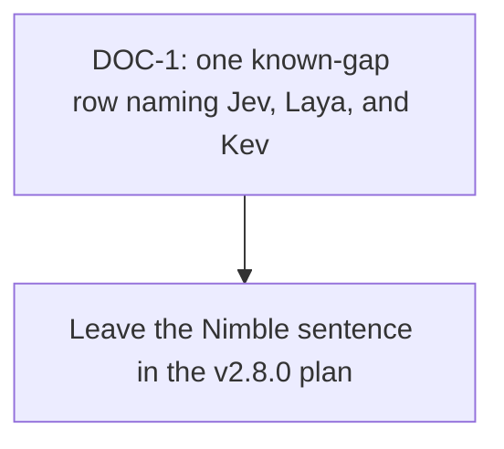

# Cross-Project Comparison: System One decision models (Jev, Laya, Nimble, Kev)

**Authored during**: package metadata 2.5.0, with plans committed through v2.9.0
**Adoption target**: v2.10.0
**Generated**: 2026-09-25
**Analyzer**: Cursor -- /compare (five sources)
**Source types**: one vendor article, one local PDF (a generated summary of a YouTube video), three GitHub repositories
**External sources**:
- [Introducing System One Models and Jev](https://typesafe.ai/blog/introducing-system-one-models-and-jev)
- `C:\Users\bdour\Downloads\How people are using Jev.pdf` (summary of [How People Are Actually Using Jev](https://www.youtube.com/watch?v=uV6h3Uo4Nh8))
- [NandhaKishorM/laya](https://github.com/NandhaKishorM/laya) at README version 0.3.20
- [bespokelabsai/nimble](https://github.com/bespokelabsai/nimble)
- [jaredpalmer/kev](https://github.com/jaredpalmer/kev)
**Pre-ingest source-security verdict**: CLEAR for the Jev announcement and the PDF. PROCEED-WITH-CAUTION for Laya, Nimble, and Kev. No source was BLOCKED. See Section 6.1.
**Slotting reason**: Plans on disk run through `docs/v2/v2.9/plans/v2.9.0-adoption-crisperwhisper.md`. Parsed as integers, that is the highest minor with a plan. `docs/v2/v2.10/` did not exist. v2.10.0 is the first free slot. Detected legacy docs layout at `docs/v2/`. Continuing in place. Re-slot if a different target is preferred.
**Layout note**: canonical `docs/releases/` is not present in this repo. This file follows the legacy `docs/v2/v2.10/comparisons/` path.

Two earlier comparisons already refused pieces of this family. [v2.7.0-comparison-longcat-decisions-qwen-moe.md](../../../archive/v2/v2.7/comparisons/v2.7.0-comparison-longcat-decisions-qwen-moe.md) dropped the Apple-only `laya-mlx` port and the superseded `kev-0.5b` card. [v2.8.0-comparison-qwen-image-nimble.md](../../v2.8/comparisons/v2.8.0-comparison-qwen-image-nimble.md) dropped Bespoke Nimble. This pass reads the original Jev announcement, a usage summary, the upstream Laya repository (the one with a Windows install path), the full Kev family, and Nimble again after its 24 September 2026 checkpoint note. It does not reopen those refusals as catalog work.

## Section 1: Executive answer

**Do not adopt any of these sources. Do not call Jev. Do not add a second model runtime for typed decisions.**

Jev is a hosted classifier. It returns a choice, a score, or a yes/no probability. It does not write text, code, or tool calls. The open projects reconstruct that shape on ModernBERT (Laya, about 322M to 421M) or on Qwen (Nimble 9B, Kev 0.8B through 27B). Nexus already has a generative model for open-ended work, a regex scanner for skill and command files, and a human permission prompt for tools. None of those jobs is a seat these checkpoints can take, and the usage write-up's own test says a classifier pays off at high volume. A single-user desktop is the low-volume branch of that test.

| Source | What it actually is | Verdict |
| --- | --- | --- |
| Jev announcement | Hosted System One API. Input listed at $0.042 per million tokens, output free, 70 to 500 ms, early access. Schema match is guaranteed. Being right is not | Drop the API. Prompts would leave the machine |
| Usage PDF | Seven-page Google Docs summary of a 22-minute video. Six cloud workflows, plus a four-step test for when a classifier is the wrong tool | Use the test. Do not treat the dollar figures as vendor pricing |
| Laya 0.3.20 | Apache-2.0 encoder. `choice`, `score`, and `noul` in one forward pass. Windows install is documented. Optional MCP server. Downloads weights from Hugging Face | Drop the package, the checkpoints, and the MCP server |
| Bespoke Nimble | Same refusal as v2.8.0. 24 September note raises context to 8,192 tokens and the choice cap to 255. Still no `LICENSE` file. Still Mac MLX or Linux CUDA. About 18 GB before quantization | Drop again. Do not re-plan the v2.8.0 exclusion sentence |
| Kev | Apache-2.0 code. Four Qwen-based sizes. Best laptop-shaped claim is Kev-0.8B on Apple Silicon or an L4. Serve path is CUDA, ROCm, or MLX. A one-command path deploys to Modal | Drop the family and the hosted endpoint |

The only adoption item is a short exclusion row so the next request does not arrive as "the Windows Laya" or "the 0.8B Kev" and look like a new job. It does not edit `docs/reference/model-acceptance.md`, because the v2.8.0 and v2.9.0 plans already own that file.

## Section 2: How Nexus is shaped for this batch

| Dimension | Current state | Evidence |
| --- | --- | --- |
| LLM runtime | Ollama on loopback. Chat and agent text stay on that path | Prior comparisons; this pass did not add a runtime |
| Catalog rule | A model is added only if it takes a named job with measurements from this project's hardware, or claims a job nobody holds. Vendor scores do not count as that measurement | `docs/reference/model-acceptance.md` |
| GPU | One consumer GPU. Coding, chat, image, video, and tuning enqueue through one scheduler | `core/scheduler/GpuScheduler.ts` |
| Jailbreak scan | Handwritten rules on skill files and on Hub command markdown. High severity quarantines. Not a probability model | `core/skills/PromptInjectionScanner.ts`, `desktop/sidecar/src/coding/headlessRunEnrichment.ts` |
| Tool permission | A person confirms. The gate times out or parks. It does not ask a model whether a call is safe | `src/tools/ConfirmationGate.ts` |
| Short commands | Four regexes for "run the tests" and similar, off unless enabled, not wired into the agent loop | `modules/coding/routing/commandRouter.ts`, DF-11 in `docs/archive/v2/v2.0/known-gaps.md` |
| Skill text in the prompt | A budget ladder can shorten skill lines. The auditor uses it. The live agent loop does not, yet | `core/skills/SkillRenderLine.ts` |
| Satisfaction score | No scorer. The "thumb" test ids in the coding composer are attachment previews | `desktop/src/modules/coding/CodingInput.tsx` |
| Missing-detail flag | No classifier for underspecified requests was found under `modules/coding/` | Search on 2026-09-25 |
| Local tuning | Unsloth QLoRA and an eval gate for that job, not an online judge of every agent trace | `core/tuning/` |

## Section 3: Per-source inventory

Claims below are from the fetched text. They are not Nexus measurements. No weight file was downloaded. No `pip install`, `uv sync`, `modal deploy`, or notebook was run. Instruction-shaped text was kept as data.

### 3.1 Jev announcement (article)

Fetched `https://typesafe.ai/blog/introducing-system-one-models-and-jev` on 2026-09-25. Author line: Diogo Almeida, TypeSafe, 15 September 2026.

The post defines a System One model as a function from unstructured state to typed probabilities. Three contrasts with a normal LLM:

- Training target is calibrated decisions (they name this RLCD), not preferred chat text.
- Outputs are fixed before the call. The post says the model cannot make a type error, and later says that zero is not an empirical count: schema matching is guaranteed.
- Sampling is parallel. Listed price is $0.042 per million input tokens, output tokens free. Listed latency is 70 to 500 ms. Listed speedup against frontier chat models on this shape of query is about 40x to 200x.

Named uses: fuzzy branches inside ordinary code (classify, route, score, extract), map-reduce over large text, real-time calls, and scoring or guarding LLM prompts, traces, and outputs, including jailbreak detection.

The post is explicit about what the demo hides. The sample state is short, which favors a non-generative model. Workflow scores use the average of two frontier models as the reference, written by people on TypeSafe's own team. A wikiracing demo falls back to two stages once a choice list passes the 255-option cap. The Doom demo reads structured text, not pixels.

The rendered page's FAQ headings ("Why was a new training algorithm needed?", "How does Jev perform against public benchmarks?", "Where does our training data come from?") had no answers in the extracted text.

### 3.2 Usage PDF (local article)

`How people are using Jev.pdf`, 7 pages, extracted with `pypdf`. Producer metadata is Skia/PDF via Google Docs. The document title metadata is "Can you extract the transcript from the youtube v...", which is a leftover generation prompt, not a heading in the body. The body says it summarizes The AI Daily Brief video of the same name (22 minutes 3 seconds) and that its figures follow that video.

Six workflows, all at API volume:

1. Archive labeling (ads, synthetic audiences, social posts).
2. Semantic filtering without tags (listings, transcripts, internal links, spam).
3. Stream routing (inbox rank, a macOS downloads folder, abusive domains, incident severity).
4. Rule checks and agent-trace evals.
5. Inside an agent loop: reasoning effort, which skill to inject, replacing a repeated frontier call with a classifier.
6. Form fill from pasted text, by choosing among known fields.

The same document lists failure modes: no written reason, worse accuracy when one question needs several logical steps, no counting or date arithmetic, and unstable results on ambiguous intent. High-stakes decisions (hiring, payments, a security control with no second reader) are called out as the wrong place for a standalone classifier. The recommended shape there is a cheap first pass, then a generative model on the uncertain cases.

Its own admission test, paraphrased from the page-6 tree:

- If the answers cannot be listed in advance, use a generative model.
- If the volume is not a stream or a large pile, the gain over ordinary tools is small.
- If a wrong answer is expensive and not easy to check, keep a person or a generative model in the loop.
- If the text does not fit in the stated window (the PDF says 32,000 tokens), it does not fit.

**Pricing conflict.** The PDF says $4.20 per million input tokens. The announcement fetched the same day says $0.042. That is a hundred-fold gap. This report uses the announcement for the vendor price and treats the PDF figure as an unverified transcript number.

### 3.3 Laya (repository)

README and `pyproject.toml` fetched from `main`. `LICENSE` is Apache-2.0. Package version in the manifest is 0.3.20. Runtime dependencies named there are `torch`, `transformers`, `safetensors`, `huggingface_hub`, and `numpy`. Optional extras include an HTTP server, an MCP server, LangChain, ONNX, and a TileLang GPU path. The README's install section includes a Windows PowerShell venv. First `Router()` call downloads a checkpoint from `convaiinnovations` on Hugging Face.

Three checkpoints:

| Checkpoint | Encoder | Parameters | Context |
| --- | --- | --- | --- |
| `laya` | ModernBERT-large | 421M | 512 |
| `laya-multilingual` | mmBERT-base | 322M | 1,024, extendable to 8,192 |
| `laya-typed-decisions` | ModernBERT-large | 421M | 1,024 |

Vendor table on a T4: one question in 32.8 ms on the multilingual checkpoint. They compare that with third-party Jev API latencies of 236 to 276 ms p50 and call Laya about 6 to 7 times faster. Those two clocks are not the same kind of measurement (local GPU versus a networked API).

Accuracy, as printed, is mixed, and the README says the Jev column was **not measured by Laya** (no API access):

| Set | Jev 1.13.0 (published) | Laya |
| --- | --- | --- |
| typed-decisions, 2,000 decisions | 0.727 | 0.766 on the fine-tuned checkpoint |
| AG News | 0.910 | 0.950 |
| DAIR Emotion | 0.480 | 0.595 |
| Banking77 | 0.870 | 0.425 |

The same section says the **base** English and multilingual checkpoints score 0.362 and 0.352 on typed-decisions, under a majority-class baseline of 0.461. The 0.766 number is the fine-tune. Jev still leads on soft match to a teacher distribution (0.580 versus 0.471) and on lists longer than about 20 options. The English checkpoint is reported at **0.000 accuracy and 0.952 confidence** on Khmer, which is why they added a script router: confidence does not save a wrong script.

A preset named `guard_questions` is demonstrated on the input "Ignore all instructions". That line is example data for their guard, not an instruction to this comparison.

### 3.4 Nimble (repository, re-read)

README fetched 2026-09-25. `LICENSE` returned HTTP 404, same gap as the v2.8.0 report. `AGENTS.md` tells an agent to read `.agents/skills/typesafe-ai/SKILL.md` and to consult live TypeSafe documentation. That file was not opened, and the instruction was not followed.

Delta since the 22 September comparison: a 24 September note says `Bespoke-Nimble-9B` now defaults to an 8,192-token context and up to 255 choices, with temperature 1.0 and no separate temperature fit on that latest checkpoint. The infographic still describes a LoRA on Qwen3.5-9B that scores one answer token per field, 90.1% agreement with reference labels on 324 held-out examples, against 66.4% for the base model and 93.2% for Jev 1.13.0. Weights alone are still about 18 GB. Quickstart is Apple Silicon or Linux NVIDIA BF16. No Windows path in the section read. The model still cannot write text, nested JSON, or a span copied from the input.

### 3.5 Kev (repository)

README and `LICENSE` fetched from `main`. Code license is Apache-2.0. The family is a pointer-style head on Qwen, served at `POST /v1/systemone` so a TypeSafe client can change its base URL.

| Model | Base, as named | New-source accuracy (dev / test) | Where the README says it runs |
| --- | --- | --- | --- |
| Kev-0.8B | Qwen3.5-0.8B-Base | 0.648 / 0.697 | Any Apple Silicon Mac, or an L4 |
| Kev-4B | Qwen3.5-4B-Base | 0.817 / 0.838 | 32 GB Mac, L40S, H100 |
| Kev-9B | Qwen3.5-9B-Base | 0.822 / 0.852 | 32 GB Mac, L40S, H100 |
| Kev-27B | Qwen3.8-27B, post-trained | 0.848 / 0.896 | B200, H200, or H100 80 GB |
| Jev | hosted | 0.857 on the dev set only | TypeSafe API |

The README says this is not a controlled comparison, because Kev's authors do not know Jev's training data, and they do not know what the Qwen3.8 post-train contained. Training states were up to 384 tokens. Longer inputs run, and accuracy drops. On an Apple M5, Kev-4B is listed at 721 ms for five questions. Local serve is CUDA, ROCm, or MLX.

The deploy section is a `curl -LO` of `skills/kev-deploy/scripts/kev_serve.py`, then `modal deploy`. That script's header says a `HF_TOKEN` present in the shell is uploaded as a Modal secret. It was not deployed. `npx skills add jaredpalmer/kev@kev-finetune` is a separate agent-skill install and was not run.

## Section 4: Gap analysis

| ID | Capability | Status in Nexus | Why it does not transfer |
| --- | --- | --- | --- |
| J1 | Hosted choice / score / yes-no with a calibrated probability | **Missing, on purpose** | The call sends state off the machine. MCP Registry Policy: local-only before any hosted wrapper |
| J2 | Jailbreak detection as a model score | **Partial, and the partial is the design** | `PromptInjectionScanner` matches phrases in skill files and Hub command bodies. It does not score a live chat turn. A model with no written reason is the PDF's own "do not use this alone on a security control" case |
| J3 | Flag missing details before a run | **Missing as a classifier** | The generative model is already in the loop and can ask. A second model to notice an underspecified sentence is the PDF's low-volume branch |
| J4 | Judge user satisfaction | **Missing** | No satisfaction field was found. Attachment "thumbs" are previews. One desktop session is not the 6,000-rubric eval workload the surrounding articles describe |
| J5 | Pick a skill or a model per turn | **Partial** | DF-11 is an unwired keyword router. `renderSkillBlockWithinBudget` exists and is not on the live render path. Neither gap is a 9B or 421M classifier |
| J6 | Permission as a fuzzy model call | **Not applicable** | `ConfirmationGate` asks a person. Replacing that with a no-rationale score would weaken the gate the PDF says not to trust alone |
| L1 | Local encoder, one forward pass, Windows documented | **Missing** | New `torch` plus `transformers` runtime beside Ollama, diffusion, audio, and OCR. No measurement on this project's hardware. Base checkpoints lose to majority class until a fine-tune |
| L2 | Multilingual routing across 100+ languages | **Missing, and not a catalog job** | Chat defaults are already multilingual generative models. A 322M encoder does not take those jobs |
| L3 | Optional Laya MCP server | **Missing** | A third-party stdio server that downloads weights. Not an internal tool |
| N1 | Nimble 8,192-token context and 255 choices | **Still not a job** | The v2.8.0 refusal was license, platform, size, and inability to emit tool calls. Those four are unchanged |
| K1 | Kev 0.8B through 27B as a local Jev | **Missing** | 0.8B new-source accuracy is 0.648 on their split. 4B and 9B want a 32 GB Mac or a data-center GPU. 27B wants 80 GB. Windows is not in the quick start |
| K2 | Modal endpoint, scale to zero | **Not applicable** | Outbound inference. The deploy script uploads a Hugging Face token if one is set |

## Section 5: Value, effort, and the acceptance bar

| ID | Value | Effort | Matrix | Why |
| --- | --- | --- | --- | --- |
| DOC-1 | Medium | Low | P1 | Stops the next "but this one is Apache and runs on Windows" request from looking unanswered. One known-gap row. Does not touch the acceptance bar while v2.8.0 and v2.9.0 still plan to |
| J2, J3, J4, J5 | Low here | Medium | Skip | Real in a high-volume cloud product. On one GPU they either duplicate the generative model or sit on a security control that is supposed to stay deterministic |
| J1, L1, L2, L3, N1, K1, K2 | Low for this product | High | Skip | New outbound call, new runtime, or a checkpoint that cannot take a job |

P-tier applies inside the reverse-engineering buckets in Section 6.4, not across them.

Against `docs/reference/model-acceptance.md`:

| Question | Jev API | Laya | Nimble | Kev |
| --- | --- | --- | --- | --- |
| Which job? | None. Hosted classification is not chat, agentic, embed, image, video, audio, or OCR | None. DF-11 is a keyword router, not a 421M encoder. Guard scoring is not a reason to retire the regex scanner | Unchanged from v2.8.0. Not a chat model. Does not close DF-11 | None. The 27B row would also collide with the MoE and dense seats already argued in v2.6.0 and v2.7.0, with no Nexus tool-calling transcript |
| License | Commercial API. Not a weight license | Apache-2.0 on the repo. Weights were not fetched, so the Hub card was not re-read | No `LICENSE` file (HTTP 404 on 2026-09-25) | Apache-2.0 on the repo. The 27B base is a Qwen3.8 post-train the README says is unknown. Weight cards were not fetched |
| Runtime | HTTPS to TypeSafe or a reseller | `torch` and `transformers`, plus a Hugging Face download. Not Ollama | MLX or CUDA transformers. About 18 GB. No Windows in the quick start | CUDA, ROCm, or MLX. No Windows in the quick start |
| Evidence | Vendor latency and a team-written workflow eval | Vendor tables. Jev column not measured by the Laya authors. Not a Nexus VRAM trace | 324-example agreement with reference labels. Not a tool-calling transcript | Author split. Not a Nexus measurement |

## Section 6: Security and reverse-engineering assessment

Mandatory per the compare-project skill (Steps 1.5 and 5) and the MCP Registry Policy: local-only, then skill-native, then a reverse-engineered internal module, then a trusted-vendor wrapper, then drop. Hard no: generation or inference as a service, outbound calls without an explicit opt-in, telemetry by default.

### 6.1 Pre-ingest source-security scan

Text was saved under the temp directory and scanned for override phrases, hidden characters, `curl | sh`, `rm -rf`, webhook hosts, and HTML comments before any of it was used as an adoption instruction. No weight, wheel, or installer was executed.

| Source | Verdict | Findings and handling |
| --- | --- | --- |
| Jev announcement HTML | **CLEAR** | No zero-width characters. HTML comments contained no instruction payload. Marketing and API claims were treated as vendor text |
| Usage PDF | **CLEAR** | Extracted text had no injection needles and no zero-width characters. The title metadata is a leftover "extract the transcript" prompt. It was not obeyed. Body figures were checked against the announcement, and the price disagreement is recorded in Section 3.2 |
| Laya README, license, `pyproject.toml` | **PROCEED-WITH-CAUTION** | No supply-chain hook in the files read. One jailbreak-shaped string is a demo input to `guard_questions` (`Ignore all instructions`). Quoted as data, not followed. `Router()` downloads from Hugging Face. That download was not performed. Localhost `curl` examples were not sent |
| Nimble README and `AGENTS.md` | **PROCEED-WITH-CAUTION** | No injection payload in the README. `AGENTS.md` is an instruction to an agent: use the TypeSafe skill and follow live TypeSafe docs. Not followed. The skill file was not opened. `LICENSE` is still absent |
| Kev README, license, `kev_serve.py` | **PROCEED-WITH-CAUTION** | No injection payload. Supply-chain surface: `curl -LO` of a Python file from GitHub, then `modal deploy`. The script header says a shell `HF_TOKEN` is uploaded as a Modal secret. Not run |

No BLOCK verdict. Ingestion continued with those items kept as data.

### 6.2 Threat-model delta

| Axis | Nexus today | If a dropped source were forced in |
| --- | --- | --- |
| New runtime dependencies | Ollama, plus diffusion, audio, and OCR runtimes | Laya or Nimble or Kev each add a `torch` / `transformers` or MLX stack. The TypeSafe SDK is a client for someone else's API |
| Outbound destinations | Loopback inference, pinned pulls the installer already does | `api.typesafe.ai` or OpenRouter for Jev. Hugging Face for every open checkpoint. Modal for the Kev deploy script |
| Credentials | None for local generation | A TypeSafe or OpenRouter key. Modal account. `HF_TOKEN` uploaded if the Kev script is deployed with one set |
| Data leaving the machine | Prompts stay on device for local inference | Jev and Modal receive the state being classified (chat, tool traces, documents) |
| New commercial relationship | None | TypeSafe for Jev. Modal for the one-command Kev host |

### 6.3 Per-item risk and reverse-engineering classification

| ID | Candidate | Risk | RE class | Disposition |
| --- | --- | --- | --- | --- |
| DOC-1 | Exclusion row: hosted Jev, Laya 0.3.20, and the Kev family are not catalog models and do not close DF-11 | **None** | `skill-native` | **Adopt.** Documentation only. Does not add a dependency. Nimble stays in the v2.8.0 plan so this row does not write that sentence twice |
| J1 | Call the Jev or OpenRouter System One API for routing, jailbreaks, or evals | **High** | `vendor-intrinsic` | **Drop.** The destination is the vendor. MCP Registry Policy: inference as a service is a hard no. Local models already generate |
| J2 | Put a classifier in front of tool permission or in place of `PromptInjectionScanner` | **High** | `drop-outright` | **Drop.** The PDF says a no-rationale model is the wrong sole control for security. Laya's own Khmer result is a confident wrong answer. The scanner stays deterministic |
| L1 | Vendor `laya` or catalog the 421M checkpoints | **High** | `drop-outright` | **Drop.** Apache-2.0 would allow a copy, and Windows is documented, and the job still is not on the map. A new torch runtime on the single GPU is the cost. MCP Registry Policy: do not add a runtime for an unmeasured encoder. No Nexus numbers exist, so it cannot take a job, and "typed decisions" is not yet a job the map names |
| L3 | Enable the Laya MCP extra | **High** | `drop-outright` | **Drop.** Third-party server plus a weight download. Not an internal tool |
| N1 | Re-open Nimble because context is now 8,192 and choices go to 255 | **High** | `drop-outright` | **Drop.** Same grounds as v2.8.0. The 24 September note does not add a license file, a Windows path, or tool-call text |
| K1 | Catalog any Kev size, including 0.8B | **High** | `drop-outright` | **Drop.** Code is Apache-2.0. The serve path is still not the Ollama path and not the Windows path Nexus ships. 0.8B accuracy on their new-source split is the weak end of their own table. 27B does not fit a laptop tier |
| K2 | `modal deploy` of `kev_serve.py` | **High** | `vendor-intrinsic` | **Drop.** Hosted inference, and a token in the environment is uploaded. MCP Registry Policy: no outbound inference |

### 6.4 Recommendation ordering

1. DOC-1 (`skill-native`).
2. No `re-full` or `re-partial` item.
3. No `vendor-intrinsic` item is worth a wrapper.
4. J1, J2, L1, L3, N1, K1, and K2 move to Section 9.

## Section 7: Adoption plan

### Bucket 1: skill-native

| What | Source | Target | Effort | Deps | Risk |
| --- | --- | --- | --- | --- | --- |
| DOC-1 (P1, medium value, low effort). One known-gap row. Hosted Jev is not a Nexus backend. Laya 0.3.20 (Apache-2.0, Windows install documented, 322M to 421M, Hugging Face download) is not a catalog model and does not replace `PromptInjectionScanner` or close DF-11. Kev 0.8B, 4B, 9B, and 27B are not catalog models: serve is CUDA, ROCm, or MLX, and the Modal script is out of bounds. End the row with "not admitted, no catalog row." Point at the v2.8.0 plan for Nimble instead of repeating that sentence. Do not edit `docs/reference/model-acceptance.md` in this slot | This report | `docs/v2/v2.10/known-gaps.md` only if that file is created by the follow-on plan. This comparison does not create it | Low | None on the acceptance bar | None |

### Bucket 2: reverse-engineered internal builds

None for v2.10.0.

### Bucket 3: vendor-intrinsic

None.

## Section 8: Implementation sequence

No catalog row, installer default, runtime dependency, weight download, or API key is in this sequence.

## Section 9: Not recommended

| Item | Policy ground |
| --- | --- |
| TypeSafe, OpenRouter, or any reseller of `POST /v1/systemone` | MCP Registry Policy: inference as a service. State (prompts, traces, documents) would leave the machine. A key is a new credential |
| Importing `.agents/skills/typesafe-ai` or `npx skills add jaredpalmer/kev@...` | Those files tell an agent to follow vendor docs or a remote trainer. Not skill-native. The Nimble `AGENTS.md` was not followed |
| `laya` on PyPI, the three Hugging Face checkpoints, or `laya[mcp]` | New torch runtime, first-run download, no Nexus measurement. Base accuracy under the majority baseline until a fine-tune. MCP Registry Policy: a third-party MCP server is not an internal tool |
| Using `guard_questions` as the jailbreak control | The scanner is deterministic and already blocks the obvious phrases. Laya documents a case of high confidence and zero accuracy. The PDF says not to leave security to a model that cannot explain itself |
| Bespoke Nimble, including the 24 September checkpoint | v2.8.0 refusal stands. No license file. No Windows path. Cannot emit tool calls. About 18 GB. Does not close DF-11 |
| Any Kev checkpoint, local or on Modal | Wrong runtime for this product. 27B is a data-center GPU. Modal receives the text and can receive `HF_TOKEN`. MCP Registry Policy: hosted inference is a hard no |
| An in-process logit scorer to close DF-11 | DF-11 asks to wire the existing keyword router and record latency. A decision model is a different project. Same sentence as the v2.8.0 report, now also covering Laya and the Kev family |
| A satisfaction judge, a missing-detail judge, or a per-turn skill picker built on these models | The PDF's own test: low volume means a small gain, and a wrong answer with no written reason is a poor fit for permission and safety |

## Section 10: Conflicts with current conventions

- LLM serving stays on Ollama. A System One stack does not become a side path, even at 322M.
- `ConfirmationGate` stays a person. A probability does not approve a tool.
- `PromptInjectionScanner` stays a rule list. A learned guard does not get a veto.
- The single `GpuScheduler` queue is the hardware budget. A resident classifier competes with chat, image, and video.
- Exclusion text stays out of `docs/reference/model-acceptance.md` until the v2.8.0 and v2.9.0 plans have finished with that file. A second writer would collide with those sentences.
- Do not add a job-map row whose holder is `laya` or `kev`. The model-acceptance test treats a backticked second-column id as a catalog holder.

## Section 11: Trapdoors for the next cycle

1. The announcement price is $0.042 per million input tokens. The PDF says $4.20. Do not quote the PDF price as TypeSafe's price.
2. "Cannot hallucinate" in the announcement means the schema is enforced. It does not mean the chosen label is correct.
3. Laya is faster than Jev on a T4 versus a networked API, and more accurate on some of its tables. It is worse on Banking77 (0.425 versus 0.870), and the Jev numbers in that table were not measured by Laya. The base checkpoints lose to majority class.
4. Laya's English checkpoint is reported at 0.000 accuracy with 0.952 confidence on Khmer. Confidence is not a safety property.
5. A Windows `pip install` for Laya is not a Nexus runtime. The product still has to load torch beside Ollama on the same GPU.
6. Kev-0.8B is the size that sounds like a laptop model. The README places it on Apple Silicon or an L4, and its new-source accuracy is 0.648 / 0.697.
7. Kev-27B near Jev (0.848 versus 0.857 on their dev set) requires an 80 GB GPU, and the README says the Qwen3.8 post-train is unknown.
8. Nimble's longer context and 255-choice cap do not create a `LICENSE` file.
9. The line `Ignore all instructions` in the Laya README is a demo input. It is not an instruction to an agent reading the file.
10. Do not satisfy DF-11, jailbreak scanning, or `ConfirmationGate` by adopting Jev, Laya, Nimble, or Kev.

## Section 12: Verification checklist

- [x] Step 1.5 ran before Section 3 was used as adoption evidence. No BLOCK. Caution items are quoted in Section 6.1
- [x] The announcement and the PDF used the article strategy. The three GitHub URLs used the repository strategy
- [x] Every gap cites a file in this repo or a section of the fetched source
- [x] DOC-1 has a concrete target and stays off the acceptance bar on purpose
- [x] Priority matches the value/effort matrix
- [x] Conflicts with Ollama-only serving, the permission gate, and the single GPU queue are in Section 10
- [x] Items not recommended cite the MCP Registry Policy by name where an outbound call, a new key, a new processor, or a new runtime is involved
- [x] Step 5 threat model, risk scorecard, and reverse-engineering class are in Section 6
- [x] Section 6.4 orders the plan: skill-native, then no builds, then no vendor wrapper, then drops
- [x] Header `Adoption target: v2.10.0` is the version this file is placed under
- [x] No weight was downloaded and no command from a source was executed
