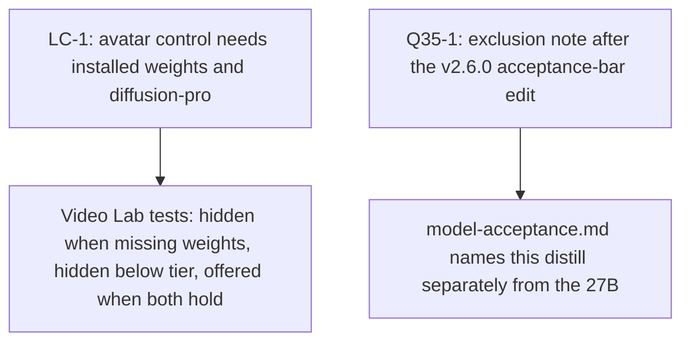

# Cross-Project Comparison: LongCat-Video, typed-decision runtimes, and a Qwen3.8 MoE distill

**Authored during**: v2.4.1 package metadata, with plans already committed through v2.6.0
**Adoption target**: v2.7.0
**Generated**: 2026-09-21
**Analyzer**: Cursor -- /compare (multi-source)
**Pre-ingest source-security verdict**: mixed. LongCat and Kev are CLEAR. The other four are PROCEED-WITH-CAUTION. No source was BLOCKED. See Section 6.1.
**Slotting reason**: `docs/v2/v2.6/plans/` already holds two plans (`v2.6.0-adoption-qwen38-27b.md`, `v2.6.0-adoption-chat-surface.md`). `docs/v2/v2.7/` did not exist. v2.7.0 is the first free slot. Re-slot if a different target is preferred.

This report compares Nexus with six sources supplied together. Three are GitHub repositories. Three are Hugging Face model cards, analyzed as articles. One prior comparison already covers LongCat-Video ([v2.0.4-comparison-longcat-video.md](../../../archive/v2/v2.0/comparisons/v2.0.4-comparison-longcat-video.md)), and the avatar half of that plan has since shipped. This pass asks what is still missing, and it refuses to re-plan work that is already a known gap.

## Section 1: Executive answer

**One small product gap is real. Five of the six sources should not be adopted.**

The request for LongCat-Video is already the product shape Nexus ships for talking-head video: `longcat-video-avatar-1.5` is an opt-in catalog entry, official Meituan INT8 weights are sha256-pinned, and the Photo + audio control appears only on a `diffusion-pro` host with at least 20 GB VRAM (`core/video/avatarGate.ts`). What the request also asked for, and what the code does not do, is hide that control until those weights are installed. The mode selector keys off hardware alone (`VideoPromptForm.tsx`), and the submit path checks that the *selected* video model is installed, then swaps the request onto LongCat (`VideoLabPage.tsx`). A diffusion-pro host can be offered a talking-head run against weights it does not have.

Everything else in this batch fails the catalog's job map, the Ollama-only serving path, or both.

| Source | What it actually is | Verdict |
| --- | --- | --- |
| [meituan-longcat/LongCat-Video](https://github.com/meituan-longcat/LongCat-Video) | 13.6B video model. Avatar 1.5 INT8 is already gated in Nexus. Base text-to-video, continuation, and interactive demos have no official consumer quant in the README | Adopt only the missing download half of the existing gate. Do not add the base model |
| [harshatheg/Qwen-2.5-1B-RLCD](https://huggingface.co/harshatheg/Qwen-2.5-1B-RLCD) | A model card for an Apple-Silicon MLX trick (parallel constrained decoding of enum and boolean fields). The repo name says RLCD. The card describes a different engine, pinned to `Qwen2.5-1.5B`, with a placeholder clone URL | Drop |
| [PrismML-Eng/Bonsai-demo](https://github.com/PrismML-Eng/Bonsai-demo) | Demo for Bonsai 2 27B ternary weights that require PrismML's llama.cpp fork. Vendor is already on the installer block list | Drop. The new demo strengthens the existing rejection |
| [empero-ai/Qwen3.8-35B-A3B-Distill-GGUF](https://huggingface.co/empero-ai/Qwen3.8-35B-A3B-Distill-GGUF) | Community distill of claimed Qwen3.8 teachers into Qwen3.6-35B-A3B (about 3B active). Separate `mmproj` for vision | Drop the artifact. Record it so it is not confused with the 27B dense model already under review for v2.6.0 |
| [mizorewww/laya-mlx](https://github.com/mizorewww/laya-mlx) | MLX port of Convai Laya: choice, score, and yes/no in one forward pass, Apple Silicon only | Drop |
| [jaredpalmer/kev-0.5b](https://huggingface.co/jaredpalmer/kev-0.5b) | Superseded 0.5B prototype of the same idea (a pointer head on Qwen2.5-0.5B). The card says not to use it | Drop |

**Overall recommendation: close the avatar control's missing install check in v2.7.0, and decline the other five sources.** Live LongCat inference remains the existing v2.0.0 gap DF-8 (the DiT tree was never vendored). This comparison does not open a second plan for it.

## Section 2: How Nexus is shaped for this batch

| Dimension | Current state | Evidence |
| --- | --- | --- |
| LLM runtime | Ollama on loopback. No in-process llama.cpp or MLX engine | `desktop/sidecar/src/serving/adapters.ts` (default `http://127.0.0.1:11434`) |
| Catalog rule | A model is added only if it takes a named job with measurements from this project's hardware, or claims a job nobody holds | `docs/reference/model-acceptance.md` |
| 24 GB MoE job | Held by `nemotron-lightning:30b-a3b` | Job map, opt-in row |
| Video jobs | 16 GB default `wan2.1-t2v-1.3b`, 24 GB default `wan2.2-ti2v-5b`. Avatar is opt-in, not a default | Job map |
| Talking-head gate | Tier `diffusion-pro`, VRAM at least 20 GB, explicit local-generation confirm, official `meituan-longcat` repo only | `core/video/avatarGate.ts` |
| Avatar weights | Official INT8, 15.9 GB, sha256-pinned, not a `recommended.json` default | `core/registry/catalog.json` entry `longcat-video-avatar-1.5` |
| Avatar inference | Stub. Upstream PyTorch tree was not imported | `docs/archive/v2/v2.0/known-gaps.md` DF-8 |
| Bonsai / PrismML | Vendor string is rejected by the installer picker. No live catalog row | `scripts/installer/src/nexus_installer/pages/typed_catalog.py` `_BLOCKED_VENDORS` |
| Fast command router | Classifies a few short imperatives when enabled. Not wired into the agent loop. No latency number | `docs/archive/v2/v2.0/known-gaps.md` DF-11 |

## Section 3: Per-source inventory

Claims below are from the fetched text. They are not Nexus measurements. No weight file, binary, or installer script was downloaded or run.

### 3.1 LongCat-Video (repository)

README fetched from `raw.githubusercontent.com` on 2026-09-21. MIT for weights and contributions. Three Hugging Face repos: base `LongCat-Video`, Avatar (Wav2Vec2), Avatar 1.5 (Whisper-Large-v3, `--use_distill` required, `--use_int8` documented only for `--model_type avatar-v1.5`).

Demos on the base checkpoint: text-to-video, image-to-video, video continuation, long video, and interactive video (`run_demo_interactive_video.py`). Avatar 1.5 adds single-audio and multi-audio, plus continuation via `--num_segments`. Install instructions pin Torch 2.6.0+cu124 and `flash_attn==2.7.4.post1`.

Nexus already integrated the avatar half of the August 2026 comparison: catalog row, tier gate, confirm checkbox, single-stream audio schema. It did not integrate the base checkpoint. The README still does not document an official INT8 (or other consumer quant) for that base checkpoint. The August report's "~80 GB full precision" figure was not re-measured here.

The interactive demo is new relative to that August report. This pass did not read `run_demo_interactive_video.py`. The README invokes it with the base checkpoint, so it sits on the same hardware problem as base text-to-video.

### 3.2 Qwen-2.5-1B-RLCD (model card, treated as an article)

The card is titled "Parallel Constrained Decoding for Apple Silicon". It describes one prefill, then a parallel score over enum or boolean choices, assembling JSON in code so syntax is guaranteed. The published benchmark table uses `mlx-community/Qwen2.5-1.5B-Instruct-4bit` on an M4 Max and reports 5.6x on three scenarios and 7.0x on a 28-field triage. Prerequisites are Apple Silicon and macOS 14+.

The card's clone URL is `github.com/your-org/parallel-constrained-decoding.git`. The Hub repo name says RLCD and "1B". The engine text says Qwen2.5-1.5B and does not describe a trained RLCD checkpoint. The technique, as written, does not apply to free-form JSON such as a tool call with a path or a patch. It applies where every field is a boolean or a closed choice list.

### 3.3 Bonsai-demo (repository)

README and `AGENTS.md` fetched 2026-09-21. Bonsai 2 27B is the default: ternary weights, a claimed 5.9 GB pack, a claimed 98.2% of FP16 "intelligence", vision via a separate projector, and tool calling. `AGENTS.md` states that Bonsai 2 bands need this demo's llama.cpp binaries, that stock llama.cpp rejects `PTQ1_0` and `PQ2_0`, and that a `Q2_0` file can load on stock llama.cpp and emit gibberish. `./setup.sh` / `.\setup.ps1` fetch those binaries and the weights. The README also points an AI coding agent at `AGENTS.md`.

Nexus already decided this vendor stays off the picker (`_BLOCKED_VENDORS` includes `bonsai`, `prismml`, and `prism-ml`). The extreme-low-bit gate remains fail-closed. Nothing in the new demo is an independent third-party benchmark of the sort that gate requires.

### 3.4 Qwen3.8-35B-A3B Distill GGUF (model card plus the parent card it defers to)

GGUF card and parent card `empero-ai/Qwen3.8-35B-A3B-Distill` fetched 2026-09-21. Claimed shape: distillation into `Qwen/Qwen3.6-35B-A3B`, 35B total, about 3B active, 256 experts, 8 routed per token, hybrid Gated DeltaNet plus full attention. Q4_K_M is listed at 21.713 GB. Vision is a separate `mmproj` file, and both cards say the distill was text-only and vision was not evaluated. A recent llama.cpp with Qwen3.6 / Gated DeltaNet MoE support is required.

Teachers named on the parent card: "Qwen3.8 2.4T A95B" and "Qwen3.8 Flash Next". Flash-Next is the model `docs/archive/v2/v2.3/development/model-admission-qwen38.md` already refused. Its official license, recorded there, is the Qwen Community License, not Apache-2.0. The distill card asserts Apache-2.0 inherited from the Qwen3.6 base. This pass did not re-read that base license file, so the chain is unreviewed.

The parent card also says a portion of the prompts used to build the synthetic training data came from people who used Empero's free community endpoint. The quickstart snippet loads `empero-ai/Qwen3.8-35B-A3B-Distilled`, which is not the repository name. Published scores are MMLU and ARC only. No Nexus tool-calling transcript exists.

This is not the 27B dense model in [v2.6.0-comparison-qwen38-27b-uncensored-gguf.md](../../v2.6/comparisons/v2.6.0-comparison-qwen38-27b-uncensored-gguf.md). Same naming trap, different artifact: MoE, about 3B active, community distill.

### 3.5 laya-mlx (repository)

README fetched 2026-09-21. Apache-2.0 claimed for the port. It runs Convai Laya checkpoints (ModernBERT-class encoders, 322M to 421M) as typed decisions: `choice`, `score`, and `noul` (a probability for a proposition). No generated tokens. Reported median latency on an M3 Max is 13.4 ms (English) and 7.4 ms (multilingual). Load path downloads from `aac6fef/laya-mlx` on Hugging Face, or from `convaiinnovations/laya`. Apple Silicon, macOS 14+, MLX. The README says RLCD training stays in the upstream project. This pass did not run the benchmark suite or verify the published checksum file.

### 3.6 kev-0.5b (model card)

Card fetched 2026-09-21. The author labels it a superseded prototype (trained 2026-09-17) and points at Kev-0.8B, Kev-4B, and Kev-9B. It is a LoRA plus a pointer head on frozen `Qwen/Qwen2.5-0.5B`. One packed prefill returns a distribution per question. Apache-2.0 is claimed for the adapter and head. The card's own "not intended" list includes moderation, fraud, credit, hiring, and medical or legal routing. Held-out accuracy on the training sources is self-reported at 0.799. Out-of-domain score against the newer Kev sizes is self-reported at 0.561. Serving is a local `POST /v1/systemone` compatible with TypeSafe's contract.

## Section 4: Gap analysis

| ID | Capability | Status in Nexus | What would have to change |
| --- | --- | --- | --- |
| LC-1 | Avatar control only when the official weights are installed and the host is `diffusion-pro` with at least 20 GB | **Partial.** Hardware and confirm are enforced (`avatarAvailable`, `assertAvatarAllowed`). Install is not. `VideoPromptForm.tsx` shows "Photo + audio -> Avatar" from `avatarAvailable` alone. Submit residency uses `selectedModelId`, then the avatar branch replaces `modelId` with `longcat-video-avatar-1.5` | Pass an installed flag into the mode selector, and run the not-installed check against the avatar id when the mode is `audio2video` |
| LC-2 | Base LongCat text-to-video, long continuation, interactive video | **Missing, and out of tier.** Those demos use the base checkpoint. The README's INT8 switch is avatar-1.5 only. Video defaults are already held by Wan | Nothing, until an official quant fits a tier Nexus can name, with a sha256 pin |
| LC-3 | Live avatar inference | **Missing, already tracked.** DF-8: the adapter is a stub because the upstream tree was not byte-scanned and imported | Not a new item. Remains `docs/archive/v2/v2.0/known-gaps.md` DF-8 |
| LC-4 | Multi-stream avatar audio | **Missing in the schema** (`audioConditioning.modes` is `["single"]`). Useless until LC-3 exists | Defer with DF-8 |
| RJ-1 | 5x faster structured JSON with no retraining | **Not applicable to the coding tool path.** Nexus tool calls are free-form strings parsed per model family, not closed enums. The card's engine is MLX-only and its repository URL is a placeholder | No engine work |
| BN-1 | Bonsai 2 27B as a laptop ternary model | **Rejected on purpose.** Vendor block list plus the extreme-low-bit gate. The demo now also requires a forked llama.cpp that stock Ollama does not provide | No catalog row |
| Q35-1 | 35B-A3B distill as a 24 GB MoE worker | **Missing, and it does not clear the bar.** The job is held by `nemotron-lightning:30b-a3b`. This artifact fails license-chain review, runtime proof, hardware measurement, and tool-calling evidence. Vision needs an `mmproj` Ollama does not load as a sidecar file (same blocker as the v2.6.0 27B report) | A short exclusion note after the v2.6.0 acceptance-bar edit lands, so the two Qwen3.8 shapes stay distinct |
| LY-1 / KV-1 | Prefill-only typed decisions (Laya, Kev) | **Missing.** Closest shipped relative is DF-11, which is an unwired keyword router, not a decision model. Both sources are Apple-only or MPS-only research stacks. Kev-0.5B is superseded by its own card | No runtime. Do not catalog either checkpoint as a chat model |

## Section 5: Value and effort

| ID | Value | Effort | Matrix | Why |
| --- | --- | --- | --- | --- |
| LC-1 | Medium | Low | P1 | Matches the request's enablement rule. A few call sites, no new dependency |
| Q35-1 | Medium | Low | P2 | Stops the next Qwen3.8 request from landing on the wrong model. Waits on the v2.6.0 edit of `docs/reference/model-acceptance.md` so two plans do not write that file at once |
| LC-2, LC-4, RJ-1, BN-1, LY-1, KV-1 | Low for this product | High | Skip | New runtime, forked binary, or a checkpoint that cannot take a job |
| LC-3 | High in the abstract | High | Already tracked | Re-planning DF-8 here would fork the v2.0.0 gap |

P-tier applies inside the reverse-engineering buckets in Section 7, not across them.

## Section 6: Security and reverse-engineering assessment

*Mandatory per the compare-project skill (Steps 1.5 and 5) and the MCP Registry Policy: local-only, then skill-native, then reverse-engineered internal module, then trusted-vendor wrapper, then drop. Hard no: generation or inference as a service, outbound calls without an explicit opt-in, telemetry by default.*

### 6.1 Pre-ingest source-security scan

Scanned rendered README and model-card text before any of it was used as an adoption instruction. No weight shard, GGUF, `mmproj`, llama.cpp binary, or `setup.sh` body was downloaded. No command from a source was executed. A byte-level zero-width scan of binaries was not possible, because those files were not fetched. Instruction-like blocks (install snippets, `AGENTS.md`, serve commands) were treated as data.

| Source | Verdict | Findings and handling |
| --- | --- | --- |
| LongCat-Video README | **CLEAR** | Ordinary model documentation and demo commands. No override payload, no hidden instruction, no credential harvest. Install commands were not run |
| Qwen-2.5-1B-RLCD card | **PROCEED-WITH-CAUTION** | No injection payload. Provenance is weak: placeholder `your-org` clone URL, title/body disagree (RLCD and 1B versus parallel decoding of Qwen2.5-1.5B), and three scenarios share an identical 5.6x figure. The documented server binds `0.0.0.0:8000`. Not cloned, not installed |
| Bonsai-demo README and `AGENTS.md` | **PROCEED-WITH-CAUTION** | The README tells an agent to follow `AGENTS.md`. That file is an overt setup guide (which binary to run, optional Brave Search key, a global npm MCP install). It does not say to ignore prior instructions, and it does not ask for the agent prompt or secrets beyond a user-supplied search key. It was not followed. `setup.sh` fetching a vendor llama.cpp fork is a supply-chain risk and is why the source is dropped in Section 6.3, not why ingestion stopped |
| Empero GGUF card and parent card | **PROCEED-WITH-CAUTION** | No injection payload. Shell and Python snippets were not run. Quickstart repo id does not match the repository. Parent card discloses that some training prompts came from a free community endpoint. Teacher list includes a model this project already refused |
| laya-mlx README | **PROCEED-WITH-CAUTION** | No injection payload. `pip install` and a Hugging Face download from `aac6fef` (not the Convai org) are the supply-chain surface. Neither was executed |
| kev-0.5b card | **CLEAR** | No injection payload. The card's own limits (superseded, not for decisions about people) are author warnings, not an attack. Weights were not downloaded |

No BLOCK verdict. Ingestion continued with the caution items quoted above and never promoted to instructions.

### 6.2 Threat-model delta

| Axis | If LC-1 and Q35-1 land | If a dropped source were forced in |
| --- | --- | --- |
| New runtime dependencies | None. LC-1 is a UI and submit check. Q35-1 is a paragraph in the acceptance bar | Bonsai adds a forked llama.cpp. Laya adds MLX. The RLCD card adds an MLX engine. Kev adds a PyTorch MPS server. Base LongCat adds Torch cu124 and FlashAttention inside the diffusion sidecar |
| Outbound destinations | None | New Hugging Face repos (Empero, `aac6fef`, PrismML) and, for Bonsai, whatever host `setup.sh` uses for binaries. Not reviewed, not pinned |
| Credentials | None | Bonsai's optional Brave key. Kev's TypeSafe-compatible server needs none, but it is a second local API |
| Data leaving the machine | None. The avatar confirm text already says the clip stays on device | Empero's training story is the opposite posture: prompts from a public endpoint were used to build the weights. Adopting those weights does not send new prompts out, but it ships a model trained that way |
| New commercial relationship | None | None required by the cards. Kev's HTTP shape copies a vendor API on purpose |

### 6.3 Per-item risk and reverse-engineering classification

| ID | Candidate | Risk | RE class | Disposition |
| --- | --- | --- | --- | --- |
| LC-1 | Require installed official avatar weights before showing or running the mode | **Low** | `re-full` | **Adopt.** Local check on data the app already has |
| Q35-1 | Exclusion note: this MoE distill is not the 27B, and it is not admitted | **None** | `skill-native` | **Adopt, after v2.6.0.** Documentation only. Does not add a row |
| LC-2 | Catalog the base LongCat checkpoint behind a hardware gate | **High** | `drop-outright` | **Drop.** No official consumer quant in the README. Would contest Wan's video jobs with no Nexus measurement. FlashAttention and CUDA Torch are a new runtime dependency the diffusion set does not need for this |
| LC-3 | Vendor the LongCat DiT so the existing avatar row actually samples | **Medium** | `re-partial` | **Do not re-plan.** Already DF-8. A scanned import remains the precondition written there |
| LC-4 | Multi-audio avatar | **Low** | `re-partial` | **Drop for v2.7.0.** Depends on LC-3 |
| RJ-1 | Parallel constrained decoding for enum JSON | **Medium** | `drop-outright` | **Drop.** Placeholder upstream, Apple-only, and it does not speed the tool-call JSON Nexus actually parses. A loopback-only port would still be a new runtime. MCP Registry Policy: do not add a runtime that is also an unverified third-party engine |
| BN-1 | Bonsai 2 via the demo's llama.cpp fork | **High** | `drop-outright` | **Drop.** Vendor already blocked. Forked binaries, uncorroborated 98.2% claim, `Q2_0` gibberish failure mode on stock builds. MCP Registry Policy: a custom inference fork is not a trusted-vendor wrapper |
| Q35-row | Catalog row for the Empero GGUF | **High** | `drop-outright` | **Drop.** Fails the job-map take (no Nexus numbers against `nemotron-lightning:30b-a3b`). License chain through Flash-Next is unreviewed. Community-endpoint prompts are in the training story. `mmproj` vision would not run on Ollama. Weights cannot be reverse-engineered into an internal model |
| LY-1 | Ship laya-mlx as a decision runtime | **Medium** | `drop-outright` | **Drop.** Apple-only second runtime, weights from a non-org Hub account, no job on the map. Does not close DF-11 |
| KV-1 | Ship kev-0.5b or its `/v1/systemone` server | **Medium** | `drop-outright` | **Drop.** Superseded by the author's own card. Not for consequential decisions. Copying a vendor HTTP contract is the wrong shape for an internal router |

### 6.4 Recommendation ordering

1. Q35-1 (`skill-native`), sequenced after the v2.6.0 acceptance-bar edit so the paragraph has a home.
2. LC-1 (`re-full`). No dependency on Q35-1. It can land first inside v2.7.0.
3. No `vendor-intrinsic` item.
4. LC-2, LC-4, RJ-1, BN-1, the Empero catalog row, LY-1, and KV-1 move to Section 9. LC-3 stays on the v2.0.0 known-gaps list.

## Section 7: Adoption plan

### Bucket 1: skill-native

| What | Source | Target | Effort | Deps | Risk |
| --- | --- | --- | --- | --- | --- |
| Q35-1 (P2). State that `empero-ai/Qwen3.8-35B-A3B-Distill` is a community MoE distill (about 3B active), not Qwen3.8-27B dense, and that it is not admitted: unreviewed teacher license chain, community-endpoint training prompts, separate `mmproj`, no Ollama proof, and no measurement against `nemotron-lightning:30b-a3b` | Parent model card, this report | A short subsection of `docs/reference/model-acceptance.md`, written only after `v2.6.0-adoption-qwen38-27b.md` has finished its edit of that file | Low | v2.6.0 plan | None |

### Bucket 2: reverse-engineered internal builds

| What | Source | Target | Effort | Deps | Risk |
| --- | --- | --- | --- | --- | --- |
| LC-1 (P1). Show "Photo + audio -> Avatar" only when `avatarAvailable` is true and `longcat-video-avatar-1.5` is installed. When the mode is `audio2video`, the not-installed verdict must name that id, not the Wan (or other) model currently selected | The request's enablement rule, checked against `avatarGate.ts` and `VideoLabPage.tsx` | `core/video/avatarGate.ts`, `desktop/src/modules/video/VideoPromptForm.tsx`, `desktop/src/modules/video/VideoLabPage.tsx`, plus the existing avatar tests in `desktop/tests/VideoLabPage.test.tsx` | Low | None | Low. Must not reveal the control on a below-tier host that happens to have the files |

### Bucket 3: vendor-intrinsic

None.

## Section 8: Implementation sequence

LC-1 does not wait on Q35-1. Q35-1 waits on the v2.6.0 plan because both would edit the same living reference.

## Section 9: Not recommended

| Item | Policy ground |
| --- | --- |
| Base LongCat text-to-video, long video, or interactive video as a catalog model | No official consumer quant in the README. INT8 is documented for Avatar 1.5 only. Adding it would contest Wan's default video jobs with no local measurement. MCP Registry Policy: do not take a new CUDA Torch and FlashAttention dependency for an unmeasured checkpoint |
| Re-opening DF-8 inside v2.7.0 | The gap is already written. The precondition is still a byte-level scan of the upstream tree before any import. A stub is not a talking-head |
| The RLCD / parallel-decoding engine, including its `0.0.0.0` demo server | Unverified artifact (placeholder git URL, name mismatch). Apple-only. Wrong JSON shape for Nexus tool calls. A public bind would violate the loopback rule already used for Ollama |
| Bonsai 2, the PrismML llama.cpp fork, and any agent-driven `setup.sh` | Vendor block list. Forked binaries. The 98.2% retention figure is the vendor's, and the extreme-low-bit gate still requires an independent benchmark. `AGENTS.md` is a setup guide for agents and was not followed |
| Empero GGUF as a catalog row, including IQ2_M "fits a 16 GB card" | Job-map take without Nexus numbers. Vision projector does not load through Ollama. Training-data note conflicts with the local-first posture. License chain through Flash-Next is not reviewed |
| laya-mlx and kev-0.5b, including a TypeSafe-compatible local server | Second runtime, Apple-only, no catalog job. Kev-0.5B is superseded and explicitly unfit for decisions about people. Neither one is the unwired command router in DF-11 |
| Any hosted generation or inference API for these models | MCP Registry Policy hard no |

## Section 10: Conflicts with current conventions

- LC-1 must keep the existing fail-closed rules: below `diffusion-pro`, under 20 GB, missing confirm, or a non-`meituan-longcat` repo still refuse. The install check is additive.
- Q35-1 must not add a `catalog.json` row, an installer default, or a `qwen38` string that also matches the unrelated `qwen3:8b` tag. The v2.6.0 plan already calls out that collision.
- Bonsai stays blocked by vendor name even if a future mainline llama.cpp learns a ternary type. Upstream format support would not by itself clear the benchmark gate or the vendor block.
- Model cards in this batch bind servers on `0.0.0.0` or on a new port. Nexus local runtimes stay on loopback. Nothing here adds a listener.

## Section 11: Verification checklist

- [x] Step 1.5 ran before adoption conclusions. No BLOCK. Caution items are quoted in Section 6.1
- [x] GitHub URLs used the repository strategy. Hugging Face URLs used the article strategy
- [x] Every gap cites a file in this repo or a section of the fetched source
- [x] Adoption items name a target path
- [x] Priorities match the value/effort matrix, then the reverse-engineering order
- [x] Conflicts are in Section 10
- [x] Dropped items cite the MCP Registry Policy or the job map
- [x] `Adoption target: v2.7.0` is the placement authority, not the 2.4.1 package version
