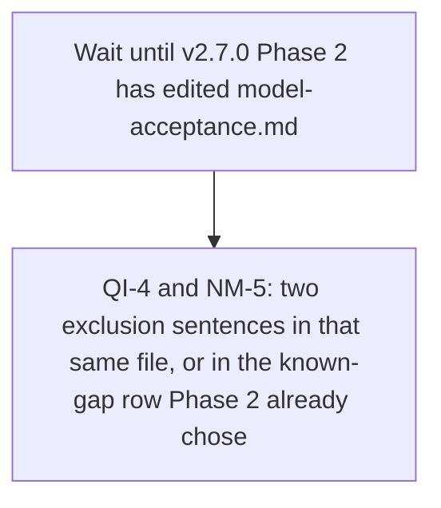

# Cross-Project Comparison: Qwen-Image-2.1 Uncensored GGUF and Bespoke Nimble

**Authored during**: v2.4.1 package metadata, with plans already committed through v2.7.0
**Adoption target**: v2.8.0
**Generated**: 2026-09-22
**Analyzer**: Cursor -- /compare (two sources)
**Source types**: Hugging Face model card (article strategy), plus one GitHub repository (11-dimension strategy)
**External sources**:
- [abenzerps/Qwen-Image-2.1-Uncensored-GGUF](https://huggingface.co/abenzerps/Qwen-Image-2.1-Uncensored-GGUF)
- [bespokelabsai/nimble](https://github.com/bespokelabsai/nimble)
**Pre-ingest source-security verdict**: PROCEED-WITH-CAUTION for both. No source was BLOCKED. See Section 6.1.
**Slotting reason**: `docs/v2/v2.7/plans/` already holds `v2.7.0-adoption-avatar-install-gate.md`. `docs/v2/v2.8/` did not exist. v2.8.0 is the first free slot. Detected legacy docs layout at `docs/v2/`. Continuing in place. Re-slot if a different target is preferred.
**Layout note**: canonical `docs/releases/` is not present in this repo. This file follows the legacy `docs/v2/v2.8/comparisons/` path.

This report asks whether either source should enter the catalog, the diffusion runtime, or the agent loop. A prior comparison already refused three small typed-decision stacks ([v2.7.0-comparison-longcat-decisions-qwen-moe.md](../../v2.7/comparisons/v2.7.0-comparison-longcat-decisions-qwen-moe.md)). Nimble is the open 9B recipe in that same family. It is not a reason to reopen those drops.

## Section 1: Executive answer

**Do not adopt either source. Record both refusals so the next request does not reopen them.**

| Source | What it actually is | Verdict |
| --- | --- | --- |
| [abenzerps/Qwen-Image-2.1-Uncensored-GGUF](https://huggingface.co/abenzerps/Qwen-Image-2.1-Uncensored-GGUF) | Community GGUF conversion of official `Qwen/Qwen-Image-2.1` (7B visual DiT, architecture `qwen_image21`). Loaded through ComfyUI plus the leejet ComfyUI-GGUF fork. License on the card and on the official repo is the Qwen Research License: non-commercial only | Drop the artifact and the loader. The "4.6 GB" recommendation omits a 9.35 GB text encoder. Uncensored photoreal is already the image default |
| [bespokelabsai/nimble](https://github.com/bespokelabsai/nimble) | A training and serving recipe for flat enum and boolean decisions. The published model is Bespoke-Nimble-9B, a LoRA on Qwen3.5-9B. It returns one token per field and cannot write text, tool-call arguments, or nested JSON. No license file on the repository. Mac MLX or Linux CUDA only | Drop the package, the checkpoint, and the hosted API. It does not close DF-11 and it cannot replace the agent |

The only adoption item is a short exclusion note, written after v2.7.0 has finished its own edit of `docs/reference/model-acceptance.md`.

## Section 2: How Nexus is shaped for this pair

| Dimension | Current state | Evidence |
| --- | --- | --- |
| Image jobs | 8 and 12 GB default `juggernaut-xl-v9`. 16 and 24 GB default `realvisxl-v5`. Both are uncensored SDXL fine-tunes | `docs/reference/model-acceptance.md`, `core/registry/recommended.json` |
| Image opt-in | SANA ladder (INT4, 1024, 2K, 4K, Sprint). Not a second photoreal default | Job map |
| Image edit today | txt2img, img2img, inpaint, outpaint. One reference image on the SDXL defaults (`visualTokenBudget.maxImages` is 1) | `desktop/src/modules/image/ImageStudioPage.tsx`, catalog entries `realvisxl-v5` and `juggernaut-xl-v9` |
| Diffusion runtime | diffusers, loaded by family. SANA uses a named class. Everything else with `model_index.json` uses `AutoPipelineForText2Image`. A single `.safetensors` file uses `StableDiffusionXLPipeline.from_single_file`. No GGUF diffusion loader | `runtimes/diffusion/pipelines/real_execute.py` (`_load_text_pipe`) |
| Diffusion deps | `diffusers` and `transformers` are named without a git URL. The installer wheel cache is the pin. The official Qwen quickstart installs diffusers from git | `runtimes/diffusion/requirements.txt` |
| LLM runtime | Ollama on loopback. No in-process transformers or MLX engine for chat | Prior comparisons; serving stays Ollama-only |
| Agent JSON | Tool calls are free text (paths, patches). A flat enum cannot express them | `docs/reference/model-acceptance.md` OQ-6 |
| Small router | `commandRouter.ts` classifies a few short imperatives and is not wired into AgentLoop | `docs/v2/v2.0/known-gaps.md` DF-11 |
| Local tuning | Unsloth QLoRA job store and a dataset builder that redacts secrets | `core/tuning/orchestrator.ts`, `core/tuning/datasetBuilder.ts` |
| License bar | A commercially capped license is not acceptable as a pre-ticked default when an alternative fits. Opt-in still has to name the restriction. A license whose terms cannot be read, or that forbids the installer's download, is out | `docs/reference/model-acceptance.md` |

## Section 3: Per-source inventory

Claims below are from fetched text on 2026-09-22. They are not Nexus measurements. No weight file, GGUF, safetensors shard, or installer script was downloaded or run. No command from either source was executed.

### 3.1 Qwen-Image-2.1 Uncensored GGUF (model card, treated as an article)

Card: `abenzerps/Qwen-Image-2.1-Uncensored-GGUF`. It describes GGUF conversions of `Qwen/Qwen-Image-2.1` for ComfyUI.

Quantization table on the card (uncensored files):

| Quantization | File | Size on the card |
| --- | --- | --- |
| BF16 | `qwen-image-2.1-UC-BF16.gguf` | 14.23 GB |
| Q8_0 | `qwen-image-2.1-UC-Q8_0.gguf` | 7.59 GB |
| Q6_K | `qwen-image-2.1-UC-Q6_K.gguf` | 5.88 GB |
| Q5_K_M | `qwen-image-2.1-UC-Q5_K_M.gguf` | 5.22 GB |
| Q4_K_M | `qwen-image-2.1-UC-Q4_K_M.gguf` | 4.60 GB |
| Q4_0 | `qwen-image-2.1-UC-Q4_0.gguf` | 4.15 GB |

The card recommends Q4_K_M. Companion files, also on that card, are not included in the 4.60 GB figure:

| Type | File | Size on the card |
| --- | --- | --- |
| Text encoder BF16 | `text_encoders/qwen3vl_8b_bf16.safetensors` | 17.53 GB |
| Text encoder Int8 | `text_encoders/qwen3vl_8b_int8_convrot.safetensors` | 9.35 GB |
| VAE | `vae/qwen_image_2.1_vae_bf16.safetensors` | 676 MB |

The card's own memory note says to keep the GGUF in VRAM and offload the text encoder to system RAM, and it recommends the Int8 encoder. That recommended trio is about 14.6 GB of files before activations (4.60 + 9.35 + 0.68). The card also says the release has no safety checker and will generate adult imagery from the prompt alone.

Provenance stated on the card: source `Qwen/Qwen-Image-2.1` revision `b3179ad355be050328e483a9dfdd9e60cd62adfa`, text encoder and VAE from `Comfy-Org/Qwen-Image-2.1`, conversion by stable-diffusion.cpp commit `1330cebae8f2ba99249df846cc0c9444fcbd4308`, license "Qwen Research License". Architecture label `qwen_image21`, "7B params". Usage is ComfyUI with `git clone https://github.com/leejet/ComfyUI-GGUF` and an Unet Loader (GGUF) node. The card says the older `city96/ComfyUI-GGUF` reports `Unknown model architecture!` until `ModelQwenImage` is added.

The official card `Qwen/Qwen-Image-2.1` (fetched the same day) describes a different runtime: `QwenImage21Pipeline` from `pip install git+https://github.com/huggingface/diffusers`, `transformers>=5.17`, BF16, native resolutions from 1536x2752 up to 2752x1536 (2048 square is the 1:1 example), image edit, up to 10 reference images, and RGBA output. Its license file is the Qwen Research License Agreement, release date September 20, 2026. Section 1.i defines Non-Commercial as "for research or evaluation purposes only." Section 2 grants use "FOR NON-COMMERCIAL PURPOSES ONLY" and requires a separate commercial license from Hangzhou Tongyi Laboratory Technology Co., Ltd. Section 3 allows redistribution only inside that non-commercial grant, with notice and attribution conditions. This pass read that license text. It did not obtain a commercial license, and it did not verify the GGUF repo's SHA256SUMS file.

### 3.2 Nimble (repository)

README, root listing, `AGENTS.md`, `skills-lock.json`, `requirements/training.txt`, and `requirements/mlx.txt` fetched 2026-09-22. The GitHub license API returned 404. No `LICENSE` file is in the root listing.

Nimble takes text plus a flat schema. Each field is an enum of 1 to 26 strings or a boolean. Serving reads logits for one answer token per field and softmaxes them. It does not generate JSON. The README states it cannot judge images, cannot write an explanation, cannot return nested JSON, and cannot return a span copied from the context. Fields cannot see each other's answers. The trained prompt limit is 2,048 tokens.

Published checkpoint: `bespokelabs/Bespoke-Nimble-9B`, a LoRA on Qwen3.5-9B (rank 16, one epoch, BF16). Unquantized weights are described as about 18 GB before runtime overhead. The MLX runner does not load a LoRA folder and does not support quantized weights, so the quickstart merges on CPU first. Documented hosts are Apple Silicon (MLX) and Linux NVIDIA with BF16 (CUDA `CudaCandidateScorer`). Windows is not a documented path. Calling `ParallelScorer()` with no arguments loads Qwen3.5-4B, not Nimble.

Training data: 2,676 synthetic examples and 324 held-out examples, published in `data/train.jsonl` and `data/eval.jsonl`. Labels are model-checked, not human-reviewed. On those 324 examples the README reports 90.12% agreement for Bespoke-Nimble-9B, 66.36% for untuned Qwen3.5-9B, and 93.21% for Jev 1.13.0 via the TypeSafe API. Those figures are the vendor's. This pass did not rerun them.

Also in the repo: contrastive pair curation (change one fact, flip the label), a fitted probability temperature of 2.179 for revision `93ec5d6ff1a9cd31d6cc0e0c58d312465d36de7c`, a public-benchmark guide, and an SGLang deployment on Modal (`docs/MODAL_SERVING.md`). Tests are `unittest`, split across MLX, PyTorch, and curator virtualenvs.

`AGENTS.md` tells an agent working in that repo to load `.agents/skills/typesafe-ai/SKILL.md` and to consult live TypeSafe documentation. `skills-lock.json` pins that skill to GitHub `typesafe-ai/skills`. This comparison did not open that skill and did not contact TypeSafe.

## Section 4: Gap analysis

### 4.1 Model-card insights (Qwen-Image-2.1 GGUF)

| # | Insight | Status in Nexus | Evidence |
| --- | --- | --- | --- |
| I1 | Run Qwen-Image-2.1 as a local image model | **Missing** | No `qwen_image` or `QwenImage` pipeline under `runtimes/diffusion/`. `_load_text_pipe` only special-cases SANA, then `AutoPipelineForText2Image` or SDXL single-file |
| I2 | Ship the community GGUF and load it with ComfyUI-GGUF | **Missing, and the wrong shape** | v1.0.0 already refused vendoring ComfyUI (GPL-3.0, node graph, custom-node installs). This card adds a third-party fork (`leejet/ComfyUI-GGUF`) on top of that |
| I3 | Treat 4.60 GB Q4_K_M as the laptop image tier | **Not applicable as stated** | The same card's recommended encoder is 9.35 GB. Image defaults today are ~6.9 GB SDXL checkpoints with `vramGB` 8 and 10, text encoders included in the diffusers folder |
| I4 | Uncensored image weights (no safety checker) | **Already implemented** | `juggernaut-xl-v9` and `realvisxl-v5` are the pre-ticked image defaults and are marked `uncensored: true` |
| I5 | Unified edit, up to 10 references, native RGBA, stronger typography | **Partially implemented** | Edit exists as img2img, inpaint, and outpaint with one reference. Ten references, RGBA generation, and a Qwen-Image text renderer are not in the runtime. Those features are on the official card, which is non-commercial and installs diffusers from git |
| I6 | Offload the text encoder to RAM and keep the diffusion weights on GPU | **Partially implemented** | `runtimes/diffusion/device.py` already mirrors a ComfyUI offload heuristic for the pipelines Nexus loads. It does not know this GGUF layout |

### 4.2 Repository dimensions (Nimble)

| # | Dimension | Nimble | Nexus | Bucket |
| --- | --- | --- | --- | --- |
| 1 | Identity | "Open Jev" recipe. No license file (GitHub license API 404) | MIT product, curated catalog, written license bar | + license gap is a reason to refuse a copy |
| 2 | Stack | Python 3.12, torch 2.8, transformers 5.17.0, peft 0.21.0, mlx 0.32.2. No Windows path | TypeScript desktop, Rust shell, Python diffusion/audio/OCR, Ollama for LLMs, Windows included | ~ different products |
| 3 | AI config | `AGENTS.md` plus a locked TypeSafe skill | `AGENTS.md` plus an in-repo skill catalog. External skills are not auto-loaded from a comparison | + do not import the TypeSafe skill |
| 4 | Structure | `nimble/{scoring,datasets,evaluation,training}` | `core/`, `desktop/`, `runtimes/diffusion` | . different jobs |
| 5 | Capabilities | Flat typed decisions, contrastive data, LoRA on answer tokens | Four pillars, tool-calling agent, image edit, Unsloth QLoRA | + scoring method; = agent and studio |
| 6 | Automation | `unittest` modules, `verify_dataset`, an MLX benchmark | Vitest, pytest, installer invariants | . |
| 7 | CI | No `.github` directory in the root listing | GitHub Actions and catalog invariant tests | = keep Nexus CI |
| 8 | Docs | Scoring, dataset, training, Modal, public benchmarks | Job map, admission gates, versioned plans | ~ Nimble's eval writeup is careful and still vendor-reported |
| 9 | Testing | Offline unit tests plus a 324-example synthetic holdout | Tool-call transcripts and hardware measurements required before a catalog take | ~ their holdout is not a Nexus measurement |
| 10 | Security | Pinned requirements, no postinstall in the files read. Agent file points at a third-party skill. Modal hosting is an outbound path | Loopback inference, secret redaction, no hosted generation | = keep local-only |
| 11 | Developer experience | Three virtualenvs, CPU merge before MLX, 64 GB called out as more comfortable than 24 GB | Installer, one GPU scheduler, laptop tiers from CPU through 24 GB | = do not add this setup burden |

### 4.3 Nimble insights against the agent

| # | Insight | Status | Why it does not transfer |
| --- | --- | --- | --- |
| N1 | Score enum and boolean fields from one forward pass | **Missing** | Closest relative is DF-11, a keyword router, not a 9B logit scorer |
| N2 | Parallel prefill, then one token per field | **Missing** | The parallel path is MLX-only. CUDA resends the full prompt per field. Ollama is the only LLM runtime |
| N3 | Contrastive pairs for calibration | **Missing** | `core/tuning/datasetBuilder.ts` builds local SFT records. It does not flip a single fact to mint labels. The Nimble labels are synthetic |
| N4 | LoRA on the answer token only | **Partially implemented** | Unsloth QLoRA exists for a different job (adapt a chat model). It is not a candidate-logit classifier |
| N5 | Hosted SGLang on Modal, and comparison against Jev's API | **Not applicable** | Both leave the machine. MCP Registry Policy: local-only before any hosted wrapper |
| N6 | The model cannot emit free text or nested JSON | **Already a hard limit of the source** | Nexus tool calls need paths and patches. This is the same refusal already recorded for the RLCD card in the v2.7.0 comparison |

## Section 5: Against the acceptance bar

### Qwen-Image-2.1 GGUF

| Question | Result |
| --- | --- |
| Which job would it take or claim? | It does not take photoreal from Juggernaut or RealVisXL: no Nexus timing, no VRAM trace, and the uncensored property is already held. A new job ("multi-reference edit plus RGBA plus typography") is real on the official card and is not what this GGUF integration ships. Shipping it would also require `QwenImage21Pipeline`, which the official quickstart installs from git diffusers |
| License | Fail for a default. The Research License is non-commercial only, which is stricter than the revenue cap the bar already rejects for pre-ticked slots. Opt-in would still need `license` and `licenseNote` copied accurately, plus a product decision to ship research-only weights inside a general studio. This pass does not recommend that decision |
| Pin | The card names a source revision and a converter commit. Nexus would still need per-file SHA-256 for every GGUF, encoder, and VAE. Those sums were not fetched. A community conversion is a weaker pin than `Qwen/Qwen-Image-2.1` itself |
| Runtime | Fail. No GGUF branch in `_load_text_pipe`. ComfyUI-GGUF is a second diffusion stack |

### Nimble

| Question | Result |
| --- | --- |
| Which job? | None on the map. It is not chat, not agentic, not an embedder, not image or video. DF-11 is the open router job, and a 9B BF16 classifier is not the small model that gap describes |
| License | Fail. No license file. The comparison cannot copy `nimble/scoring` into the tree |
| Runtime | Fail. MLX or a CUDA transformers stack, neither of which is the Ollama path. Windows is absent. MLX quantization is absent. The README's 18 GB figure is weights alone |
| Evidence | The 90.12% figure is agreement with synthetic labels on 324 paired examples from six source families. It is not a tool-calling transcript |

## Section 6: Security and reverse-engineering assessment

Mandatory per the compare-project skill (Steps 1.5 and 5) and the MCP Registry Policy: local-only, then skill-native, then a reverse-engineered internal module, then a trusted-vendor wrapper, then drop.

### 6.1 Pre-ingest source-security scan

| Source | Verdict | Findings and handling |
| --- | --- | --- |
| huggingface.co/abenzerps/Qwen-Image-2.1-Uncensored-GGUF | PROCEED-WITH-CAUTION | Card text is usage guidance: clone `leejet/ComfyUI-GGUF`, place GGUF and safetensors files, disable any expectation of a safety checker. Treated as data. No "ignore previous instructions" payload, no hidden directive, no destructive snippet. **No weight file was downloaded.** Caution is the community conversion and the third-party custom node, not an injection |
| huggingface.co/Qwen/Qwen-Image-2.1 and its LICENSE | CLEAR for injection | Fetched only to check the license and the official runtime the GGUF card points at. The license is restrictive. That is a policy fact, not an injection. Quickstart commands were not run |
| github.com/bespokelabsai/nimble README and requirements | PROCEED-WITH-CAUTION | README and the two requirements files have no injection cue, no `curl \| sh`, and no postinstall hook. Caution is `AGENTS.md`, quoted here as data and not followed: "Use the TypeSafe skill in `.agents/skills/typesafe-ai/SKILL.md` ... consult the live TypeSafe documentation as it directs." `skills-lock.json` pulls that skill from GitHub `typesafe-ai/skills`. The skill file was not opened. Modal deployment docs were not executed. The repository was not cloned and nothing was pip-installed |

No BLOCK verdict. Ingestion of the cards and the README proceeded with instruction-shaped text kept as data.

### 6.2 Threat model comparison

| Axis | Nexus today | If these sources were adopted |
| --- | --- | --- |
| New runtime dependencies | Ollama, diffusers wheel cache, optional Unsloth | A ComfyUI-GGUF fork and stable-diffusion.cpp conversion for the image model, or git diffusers for the official pipeline. A second LLM stack (MLX or CUDA transformers 5.17) for Nimble |
| Outbound destinations | Ollama registry, pinned Hugging Face repos, loopback only | Community HF repo `abenzerps/...`, `leejet/ComfyUI-GGUF`, and optionally Modal plus the TypeSafe API |
| Credentials | None for local pulls | Modal and TypeSafe need accounts. Local weight pulls do not |
| Data leaving the machine | None during local inference | Unchanged if weights stay local. Broken if scoring or image generation is sent to Modal or Jev |
| New commercial relationship | None | Qwen commercial license if anyone uses the image model outside research. TypeSafe if Jev is the reference scorer |

Local weights are the shape the policy prefers. The cost here is a second runtime, a non-commercial license, and an unlicensed code tree, not a requirement to phone home.

### 6.3 Per-item risk and reverse-engineering classification

| ID | Candidate | Risk | RE class | Disposition |
| --- | --- | --- | --- | --- |
| QI-1 | Catalog row for the abenzerps GGUF, any quant | **High** | `drop-outright` | **Drop.** Weights are not reverse-engineerable. Job map: uncensored photoreal is held. Research License forbids commercial use. Loader is ComfyUI-GGUF. The 4.60 GB figure is not the working set. MCP Registry Policy: a community conversion plus a custom node is not a trusted-vendor wrapper |
| QI-2 | Add a GGUF diffusion backend (ComfyUI-GGUF or stable-diffusion.cpp) | **High** | `re-full` | **Drop for v2.8.0.** Buildable locally, and still the wrong trade. v1.0.0 already refused vendoring ComfyUI. One model does not justify a second diffusion stack |
| QI-3 | Official `Qwen/Qwen-Image-2.1` via `QwenImage21Pipeline` once it is in the wheel cache | **High** | `re-partial` | **Drop for v2.8.0.** The pipeline class would be a local loader, but the weights stay non-commercial, native resolution starts at 2048-class, and there is no Nexus measurement. Revisit only with a commercial license or an explicit research-only product decision, a released diffusers pin, and numbers against the current image holder |
| QI-4 | Exclusion note so the GGUF is not proposed again as a 4.6 GB laptop model | **None** | `skill-native` | **Adopt, after v2.7.0.** Documentation only |
| NM-1 | Depend on the nimble package or catalog Bespoke-Nimble-9B | **High** | `drop-outright` | **Drop.** No license file, so the code cannot be vendored. The checkpoint cannot emit tool calls. ~18 GB BF16, no Windows, no MLX quant. MCP Registry Policy: do not add an unlicensed second LLM runtime |
| NM-2 | Reimplement candidate-token scoring inside the agent loop | **Medium** | `re-partial` | **Drop for v2.8.0.** The method is local and small to describe. The model that makes it useful is not. DF-11 remains the router gap, and this comparison does not retarget it onto a 9B classifier |
| NM-3 | Import contrastive curation into `core/tuning` | **Low** | `skill-native` | **Skip.** Low value. Labels are synthetic, and the tuning job Nexus holds is QLoRA for chat, not a decision scorer |
| NM-4 | Modal SGLang deploy, or calling Jev as the reference | **High** | `vendor-intrinsic` | **Drop.** Hosted inference leaves the machine. MCP Registry Policy: local-only. Not worth a wrapper |
| NM-5 | Exclusion note: Nimble is not a chat model and does not close DF-11 | **None** | `skill-native` | **Adopt, folded into QI-4.** One paragraph, not a second document |

### 6.4 Recommendation ordering

1. QI-4 with NM-5 (`skill-native`), after v2.7.0's edit of the acceptance bar.
2. No `re-full` or `re-partial` item in this cycle.
3. No `vendor-intrinsic` item.
4. QI-1, QI-2, QI-3, NM-1, NM-2, NM-3, and NM-4 move to Section 9.

## Section 7: Adoption plan

### Bucket 1: skill-native

| What | Source | Target | Effort | Deps | Risk |
| --- | --- | --- | --- | --- | --- |
| QI-4 + NM-5 (P1, medium value, low effort). Two exclusion sentences: (1) `abenzerps/Qwen-Image-2.1-Uncensored-GGUF` is not an image-tier candidate. The Research License is non-commercial, Q4_K_M at 4.60 GB omits the 9.35 GB Int8 text encoder, and the loader is ComfyUI-GGUF rather than `_load_text_pipe`. Official `Qwen/Qwen-Image-2.1` is a different pipeline (`QwenImage21Pipeline` from git diffusers) and stays out until a commercial license or an explicit research-only decision, a released diffusers pin, and a local measurement exist. (2) Bespoke Nimble / Bespoke-Nimble-9B is not a chat or agent model. It cannot emit text or tool calls, the repo has no license file, and serving it needs MLX or CUDA transformers. It does not close DF-11 | This report | A short subsection of `docs/reference/model-acceptance.md`, written only after `v2.7.0-adoption-avatar-install-gate.md` Phase 2 has finished its edit of that file. If that phase records exclusions as a known-gap row instead, append these two sentences there, and do not open a third write-up | Low | v2.7.0 Phase 2 | None |

### Bucket 2: reverse-engineered internal builds

None for v2.8.0.

### Bucket 3: vendor-intrinsic

None.

## Section 8: Implementation sequence

No catalog row, installer default, runtime dependency, or weight download is in this sequence.

## Section 9: Not recommended

| Item | Policy ground |
| --- | --- |
| Any quant of `abenzerps/Qwen-Image-2.1-Uncensored-GGUF` in `catalog.json`, `recommended.json`, or the installer | Job map: uncensored photoreal is held by Juggernaut XL v9 and RealVisXL V5. Research License is non-commercial. Community GGUF plus an unpinned custom node. MCP Registry Policy: not a trusted-vendor wrapper |
| ComfyUI, `leejet/ComfyUI-GGUF`, or stable-diffusion.cpp as a diffusion backend | v1.0.0 refusal still stands (GPL-3.0 ComfyUI, custom-node code execution). A second loader for one checkpoint inverts the cost. MCP Registry Policy: do not add a runtime that exists to run one unmeasured community file |
| Official Qwen-Image-2.1 on git diffusers in this cycle | Non-commercial weights in a general studio, native 2048-class resolutions, no local timing. The uncovered edit/RGBA job can be reopened later with a license that matches the bar and a measurement against the current image holder |
| Vendoring `nimble/` or pulling `typesafe-ai/skills` | No repository license. `AGENTS.md` was not followed. MCP Registry Policy: an external skill that tells the agent to consult a live vendor doc is not skill-native |
| Bespoke-Nimble-9B as an Ollama or Hugging Face catalog LLM | It does not generate text. ~18 GB before quantization, and the MLX path has no quant. Wrong job next to `qwen3.5:9b` |
| An in-process logit scorer to close DF-11 | DF-11 asks to wire the existing small imperative classifier and record latency. A 9B decision model is a different project |
| Contrastive-curation pipeline inside `core/tuning` | Synthetic labels, ten demo domains, no Nexus training job that needs them |
| Modal, SGLang hosting, or the TypeSafe / Jev API | MCP Registry Policy: hosted inference is a hard no |

## Section 10: Conflicts with current conventions

- Image defaults stay on the SDXL holders until something takes the job with a local VRAM trace and a wall-clock at the tier's resolution. "Uncensored" and "182,313 downloads last month" (the figure printed on the GGUF card) are not that measurement.
- `_load_text_pipe` grows a new class only for a model that has already cleared the job map. Do not add a GGUF branch speculatively.
- LLM serving stays on Ollama. Nimble's transformers and MLX stacks do not become a side path.
- The exclusion note must not add a `catalog.json` row "so the license is visible." Visibility belongs in the acceptance bar.
- v2.7.0 Phase 2 already plans to touch `docs/reference/model-acceptance.md`. QI-4 waits, so two plans do not write the same subsection blind.

## Section 11: Trapdoors for the next cycle

1. Q4_K_M at 4.60 GB is the diffusion file only. The card's recommended text encoder is another 9.35 GB, and the VAE is 676 MB.
2. "Uncensored" is already how the image defaults ship. It is not an uncovered job.
3. The official model and the GGUF repo are different runtimes. `QwenImage21Pipeline` from git diffusers is not `Unet Loader (GGUF)`.
4. The Qwen Research License (September 20, 2026) is research and evaluation only. A separate commercial license is required for any other use.
5. Nimble's 90% figure is agreement with synthetic labels on 324 examples. It is not a tool-calling result, and the model cannot emit the JSON the agent parses.
6. A missing `LICENSE` file is a refuse, not an invitation to copy the scoring package and "add a license later."
7. Do not satisfy DF-11 by adopting Bespoke-Nimble-9B, Laya, Kev, or the RLCD card. Those four are the same idea at different sizes, and none of them is the unwired command router.

## Section 12: Verification checklist

- [x] Step 1.5 ran before the inventories in Section 3 were used as adoption evidence. No BLOCK. Caution items are quoted in Section 6.1
- [x] The Hugging Face URL used the article strategy. The GitHub URL used the repository strategy
- [x] Every gap cites a file in this repo or a section of the fetched source
- [x] The adoption item names a target path
- [x] Priority matches the value/effort matrix (medium value, low effort, P1), then skill-native ordering
- [x] Conflicts are in Section 10
- [x] Dropped items cite the MCP Registry Policy or the job map
- [x] `Adoption target: v2.8.0` is the placement authority, not the 2.4.1 package version
